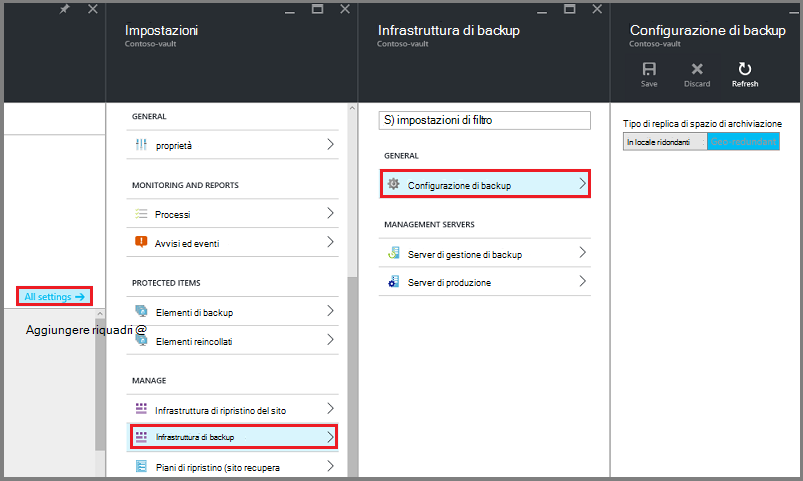
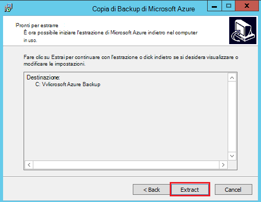
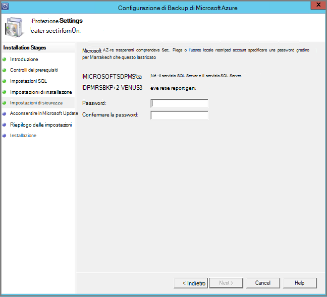
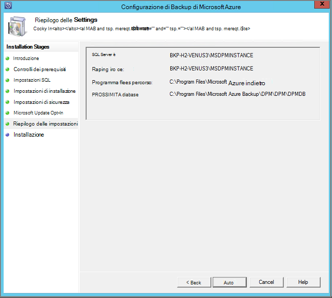
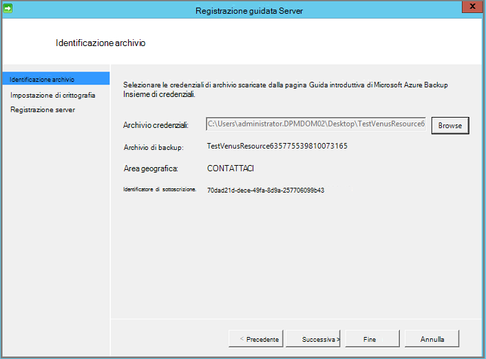
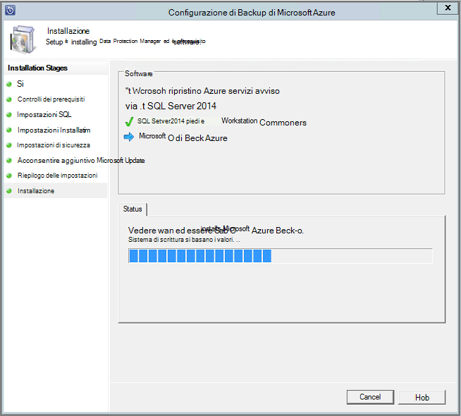

<properties
  pageTitle="Preparare l'ambiente per eseguire il backup carichi di lavoro tramite il Server di Backup di Azure | Microsoft Azure"
  description="Preparare l'ambiente per Server di Backup Azure consente di proteggere o il backup automatici carichi di lavoro."
  services="backup"
  documentationCenter=""
  authors="PVRK"
  manager="shivamg"
  editor=""
  keywords="Azure server backup. proteggere i carichi di lavoro; eseguire il backup carichi di lavoro"/>

<tags
  ms.service="backup"
  ms.workload="storage-backup-recovery"
  ms.tgt_pltfrm="na"
  ms.devlang="na"
  ms.topic="article"
  ms.date="09/27/2016"
  ms.author="jimpark;trinadhk;pullabhk;markgal"/>

# <a name="preparing-to-back-up-workloads-using-azure-backup-server"></a>Preparazione del backup carichi di lavoro tramite il Server di Backup di Azure

> [AZURE.SELECTOR]
- [Server di Backup Azure](backup-azure-microsoft-azure-backup.md)
- [SCDPM](backup-azure-dpm-introduction.md)
- [Server di Backup Azure (classica)](backup-azure-microsoft-azure-backup-classic.md)
- [SCDPM (classico)](backup-azure-dpm-introduction-classic.md)

In questo articolo viene spiegato come preparare l'ambiente per eseguire il backup carichi di lavoro tramite il Server di Backup di Azure. Con il Server di Backup di Azure, è possibile proteggere carichi di lavoro di applicazione, ad esempio macchine virtuali di Hyper-V, Microsoft SQL Server, SharePoint Server e Microsoft Exchange client Windows da un'unica console. È inoltre possibile proteggere le informazioni come un carichi di lavoro server (IaaS), ad esempio macchine virtuali di Azure.

> [AZURE.NOTE] Azure include due modelli di distribuzione per la creazione e utilizzo delle risorse: [Gestione risorse e classica](../resource-manager-deployment-model.md). In questo articolo fornisce informazioni e procedure per il ripristino delle macchine virtuali distribuite utilizzando il modello di Manager delle risorse.

Server di Backup Azure eredita molte delle funzionalità di backup di carico di lavoro da Data Protection Manager (DPM). Questo articolo fornisce collegamenti a documentazione di Data Protection Manager per descrivere alcune funzionalità condivise. Server di Backup di Azure attraverso condivide la maggior parte della stessa funzionalità Data Protection Manager. Server di Backup Azure non eseguire il backup su nastro né integrare con System Center.

## <a name="1-choose-an-installation-platform"></a>1. scegliere una piattaforma di installazione

Il primo passo per iniziare il Server di Backup Azure consiste nel configurare un Server di Windows. Il server può essere in Azure o locale.

### <a name="using-a-server-in-azure"></a>Utilizzo di un server di Azure

Quando si sceglie un server per l'esecuzione di Azure Backup Server, è consigliabile che iniziare con un'immagine della raccolta del Data Center di Windows Server 2012 R2. L'articolo [creare il prima macchina virtuale di Windows nel portale di Azure](..\virtual-machines\virtual-machines-windows-hero-tutorial.md), fornisce un'esercitazione per acquisire familiarità con la macchina virtuale consigliata in Azure, anche se non si è mai utilizzato Azure prima. I requisiti minimi consigliati per il server macchine () devono essere: A2 Standard con 2 core e 3,5 GB di RAM.

Protezione carichi di lavoro con il Server di Backup di Azure sono molte sfumature. L'articolo, [Installare Data Protection Manager come una macchina virtuale Azure](https://technet.microsoft.com/library/jj852163.aspx)spiega queste sfumature. Leggere questo articolo completamente prima di distribuire il computer.

### <a name="using-an-on-premises-server"></a>Uso di un server locale

Se non si desidera eseguire il server di base in Azure, è possibile eseguire il server in una macchina virtuale Hyper-V, una VM VMware o un host fisico. I requisiti minimi consigliati per l'hardware del server sono 2 core e 4 GB di RAM. Nella tabella seguente sono elencati i sistemi operativi supportati.

| Sistema operativo        | Piattaforma           | SKU  |
| :------------- |-------------| :-----|
|Windows Server 2012 R2 e SP più recente| a 64 bit| Standard, Data Center, Foundation|
|Windows Server 2012 e SP più recente|    a 64 bit| Data Center, Foundation, Standard|
|Windows lo spazio di archiviazione Server 2012 R2 e SP più recente  |a 64 bit|    Standard, gruppo di lavoro|
|Spazio di archiviazione di Windows Server 2012 e SP più recente |a 64 bit |Standard, gruppo di lavoro|


È possibile deduplicate lo spazio di archiviazione Data Protection Manager utilizzando Windows Server Deduplication. Ulteriori informazioni su Data Protection Manager deduplication interazione [e](https://technet.microsoft.com/library/dn891438.aspx) quando vengono distribuiti in macchine virtuali di Hyper-V.

> [AZURE.NOTE]  È possibile installare Server Azure Backup in un computer che esegue come controller di dominio.

È necessario partecipare Server Azure Backup di un dominio. Se si prevede di spostare il server in un dominio diverso, si consiglia di collegare il server per il nuovo dominio prima di installare il Server di Backup di Azure. Spostare una macchina Server Backup Azure esistente in un nuovo dominio dopo la distribuzione *non è supportato*.

## <a name="2-recovery-services-vault"></a>2. archivio di servizi di recupero

Se si invia dati di backup in Azure o lasciarla invariata per fare in locale, il software deve essere connesso a Azure. In modo più specifico, del Server di Backup Azure deve essere registrato con un archivio di servizi di recupero.

Per creare un archivio di servizi di recupero:

1. Accedere al [portale di Azure](https://portal.azure.com/).

2. Nel menu Hub fare clic su **Sfoglia** e nell'elenco delle risorse, digitare **I servizi di recupero**. Quando si inizia a digitare, l'elenco verrà applicato un filtro in base all'input. Fare clic su **archivio di servizi di recupero**.

     <br/>

    L'elenco degli archivi di servizi di recupero.

3. Nel menu **archivi di servizi di recupero** , fare clic su **Aggiungi**.

    

    Verrà visualizzata e l'archivio servizi di recupero che richiede di specificare un **nome**, **l'abbonamento**, **gruppo di risorse**e **posizione**.

    

4. Per **nome**immettere un nome descrittivo per identificare l'archivio. Il nome deve essere univoco per la sottoscrizione Azure. Digitare un nome che contiene da 2 a 50 caratteri. Deve iniziare con una lettera e possono contenere solo lettere, numeri e trattini.

5. Fare clic su **sottoscrizione** per visualizzare l'elenco delle sottoscrizioni disponibile. Se non si è certi di quale abbonamento da usare, usare il valore predefinito (o suggeriti) abbonamento. Si verificherà scelte multiple solo se l'account aziendale è associata a più abbonamenti Azure.

6. Fare clic su **gruppo di risorse** per visualizzare l'elenco dei gruppi di risorse disponibile oppure fare clic su **Nuovo** per creare un nuovo gruppo di risorse. Per informazioni complete sui gruppi di risorse, vedere [Panoramica di gestione risorse di Azure](../azure-resource-manager/resource-group-overview.md)

7. Fare clic su **posizione** per selezionare la località geografica per l'archivio.

8. Fare clic su **Crea**. Può richiedere un po' di tempo per l'archivio di servizi di recupero da creare. Eseguire il monitoraggio delle notifiche sullo stato nell'area superiore destro nel portale.
Dopo aver creato l'archivio, viene aperta nel portale.

### <a name="set-storage-replication"></a>Impostare la replica di spazio di archiviazione

L'opzione di replica di spazio di archiviazione consente di scegliere tra lo spazio di archiviazione ridondanti geografico e lo spazio di archiviazione ridondante in locale. Per impostazione predefinita, l'archivio dispone di spazio di archiviazione ridondanti geografico. Lasciare l'opzione impostata per lo spazio di archiviazione ridondanti geografico se si tratta di backup principale. Scegliere lo spazio di archiviazione in locale ridondante se si desidera un'opzione meno che non è abbastanza come permanente. Per saperne di più sui [geografico ridondanti](../storage/storage-redundancy.md#geo-redundant-storage) e opzioni relative all'archiviazione [localmente ridondanti](../storage/storage-redundancy.md#locally-redundant-storage) nella [Panoramica della replica di archiviazione Azure](../storage/storage-redundancy.md).

Per modificare l'impostazione di replica di spazio di archiviazione:

1. Selezionare l'insieme di credenziali per aprire il dashboard di archivio ed e l'impostazioni. Se non si apre e **l'Impostazioni** , fare clic su **tutte le impostazioni** del dashboard di archivio di.

2. Scegliere **Dell'infrastruttura di Backup**e **l'Impostazioni**  > **Configurazione di Backup** per aprire e il **Backup configurazione** . Scegliere l'opzione di replica di spazio di archiviazione per l'archivio e il **Backup configurazione** .

    

    Dopo aver selezionato l'opzione di spazio di archiviazione per l'archivio, si è pronti associare la macchina virtuale nell'archivio. Per iniziare l'associazione, si deve individuare e registrare le macchine virtuali Azure.

## <a name="3-software-package"></a>3. pacchetto software

### <a name="downloading-the-software-package"></a>Il download del pacchetto di software
1. Accedere al [portale di Azure](https://portal.azure.com/).

2. Se già aperto un archivio di servizi di recupero, procedere al passaggio 3. Se si dispone di un servizio di recupero archivio aperta, ma sono nel portale di Azure, nel menu Hub fare clic su **Sfoglia**.

    - Nell'elenco delle risorse, digitare **I servizi di recupero**.
    - Quando si inizia a digitare, l'elenco verrà applicato un filtro in base all'input. Quando viene visualizzato **archivi di servizi di recupero**, fare clic su esso.

    

    Viene visualizzato l'elenco degli archivi di servizi di recupero.

    - Nell'elenco di servizi di recupero archivi, selezionare un archivio.

    Verrà visualizzata nel dashboard di archivio selezionato.

    

3. Blade impostazioni aperta per impostazione predefinita. Se è chiuso, fare clic su **Impostazioni** per aprire e l'impostazioni.

    

4. Fare clic su **copia di Backup** nella **Guida introduttiva** per aprire la procedura guidata di introduzione.

    

5. In Guida introduttiva che si apre, schermata obiettivi di Backup sarà selezionato automatico.
    

    Nella sezione **obiettivi Backup** selezionare *locale* per la *quale viene eseguito il carico di lavoro*.

    

6. Selezionare i carichi di lavoro che si desidera proteggere con Server di Backup Azure in *quali carichi di lavoro che si desidera proteggere* e fare clic su **OK**.

    > [AZURE.NOTE] Se si prevede di proteggere solo i file e cartelle, è consigliabile utilizzare agente di Backup di Azure. Se si prevede di proteggere più carichi di lavoro rispetto a solo file e cartelle o in futuro se si prevede di espandere le esigenze di protezione, selezionare tutti i carichi di lavoro.

    Verranno modificate guidata introduzione per preparare l'infrastruttura per impedire carichi di lavoro locale in Azure.

    

7. In e il **Prepara infrastruttura** visualizzata, fare clic sul collegamento **Download** per installare Server Backup Azure e Download archivio credenziali. Utilizzare le credenziali di archivio durante la registrazione del Server di Backup Azure nell'archivio di servizi di recupero. I collegamenti è possibile visualizzare l'area Download nel punto in cui può essere scaricato il pacchetto di software.

    

8. Selezionare tutti i file e fare clic su **Avanti**. Scaricare tutti i file provenienti da una pagina di download di Microsoft Azure Backup e posizionare tutti i file nella stessa cartella.

    

    Poiché le dimensioni di download di tutti i file insieme > 3G, su un 10Mbps collegamento per il download che potrebbe richiedere fino a 60 minuti per il completamento del download.


### <a name="extracting-the-software-package"></a>L'estrazione del pacchetto software

Dopo aver scaricato tutti i file, fare clic su **MicrosoftAzureBackupInstaller.exe**. Verrà avviata la **Configurazione guidata di Microsoft Azure Backup** per estrarre i file di configurazione in un percorso specificato dall'utente. Continuare la procedura guidata e fare clic sul pulsante **Estrai** per avviare il processo di estrazione.

> [AZURE.WARNING] Almeno 4GB di spazio libero sono necessarie per estrarre i file di installazione.




Dopo l'estrazione elaborare completa, selezionare la casella per avviare appena estratti *setup.exe* per iniziare l'installazione di Microsoft Azure Backup Server e fare clic sul pulsante **Fine** .

### <a name="installing-the-software-package"></a>Installazione del pacchetto software

1. Fare clic su **Microsoft Azure Backup** per avviare la configurazione guidata.

    

2. Nella schermata iniziale fare clic sul pulsante **Avanti** . Verrà visualizzato nella sezione *Controlla prerequisiti* . In questa schermata, fare clic sul pulsante **Controlla** per determinare se sono stati soddisfatti i prerequisiti hardware e software per il Server di Backup di Azure. Se tutti i prerequisiti sono state soddisfatte correttamente, verrà visualizzato un messaggio che indica che il computer soddisfi i requisiti. Fare clic sul pulsante **Avanti** .

    

3. Server di Microsoft Azure Backup richiede SQL Server Standard e il pacchetto di installazione di Azure Backup Server fornito in dotazione con i file binari appropriati di SQL Server necessari. Quando a partire da una nuova installazione Azure Backup Server, è necessario selezionare l'opzione **Installa nuova istanza di SQL Server con il programma di installazione** e fare clic sul pulsante **verificare e installare** . Una volta completata siano installati i prerequisiti, fare clic su **Avanti**.

    

    In caso di errore con un suggerimento per riavviare il computer, eseguire questa operazione e fare clic su **Selezionare nuovo**.

    > [AZURE.NOTE] Server di Backup Azure non funziona con un'istanza di SQL Server remota. L'istanza utilizzata dal Server di Backup Azure deve essere locale.

4. Specificare un percorso per l'installazione di Microsoft Azure Backup server file e fare clic su **Avanti**.

    

    La posizione iniziale è un requisito di backup su Azure. Assicurarsi che la posizione iniziale 5% almeno dei dati pianificato in origine per eseguire il backup nel cloud. Per la protezione del disco, è necessario configurare una volta completata l'installazione dischi separati. Per ulteriori informazioni sui pool di archiviazione, vedere [configurazione di pool di archiviazione e spazio su disco](https://technet.microsoft.com/library/hh758075.aspx).

5. Fornire una password complessa per gli account utente locali con restrizioni e fare clic su **Avanti**.

    

6. Selezionare se si desidera utilizzare *Microsoft Update* per verificare la presenza di aggiornamenti e fare clic su **Avanti**.

    >[AZURE.NOTE] Si consiglia di gestire Windows Update di reindirizzamento a Microsoft Update, che offre protezione e aggiornamenti importanti per Windows e altri prodotti come Microsoft Azure Backup Server.

    

7. Esaminare il *Riepilogo delle impostazioni* e fare clic su **Installa**.

    

8. L'installazione viene eseguita in fasi. Nella prima fase l'agente di servizi di recupero di Microsoft Azure viene installato sul server. Controlla anche la procedura guidata per la connettività Internet. Se è disponibile la connettività Internet è possibile procedere con l'installazione, in caso contrario, è necessario fornire dettagli proxy per la connessione a Internet.

    Il passaggio successivo consiste nel configurare l'agente di servizi di recupero di Microsoft Azure. Come parte della configurazione, sarà necessario fornire le credenziali di archivio per registrare il computer per l'archivio di servizi di recupero. Fornire anche una frase per crittografia/decrittografia i dati inviati tra Azure e le locale. Automaticamente, è possibile generare una frase o fornire il proprio minima passphrase 16 caratteri. Continuare la procedura guidata fino a quando non è stato configurato l'agente.

    

9. Una volta completata la registrazione del server di Microsoft Azure Backup correttamente, la configurazione guidata di complessiva procede per l'installazione e configurazione di SQL Server e i componenti di Azure Backup Server. Al termine dell'installazione del componente di SQL Server, i componenti di Azure Backup Server siano installati.

    


Al termine di fase dell'installazione, le icone del desktop del prodotto saranno state create anche. Fare doppio clic sull'icona per avviare il prodotto.

### <a name="add-backup-storage"></a>Aggiungere spazio di archiviazione backup

La copia di backup prima verrà mantenuta nello spazio di archiviazione collegato al computer Server Backup Azure. Per ulteriori informazioni sull'aggiunta di dischi, vedere [configurazione di pool di archiviazione e spazio su disco](https://technet.microsoft.com/library/hh758075.aspx).

> [AZURE.NOTE] È necessario aggiungere spazio di archiviazione backup anche se si intende inviare dati a Azure. Architettura corrente del Server di Backup di Azure, l'archivio di Azure Backup contiene la *seconda* copia dei dati durante l'archiviazione locale contiene la copia di backup prima (e obbligatoria).

## <a name="4-network-connectivity"></a>4. la connettività di rete

Azure Server di Backup richiede una connessione al servizio di Backup di Azure per il prodotto per il corretto funzionamento. Per stabilire se il computer abbia la connettività di Azure, utilizzare la ```Get-DPMCloudConnection``` cmdlet nella console di Azure Backup Server PowerShell. Se l'output del cmdlet è vero è presente la connettività, altro non esiste alcun connettività.

Nello stesso momento la sottoscrizione Azure deve essere funzionante. Per individuare lo stato dell'abbonamento e gestirlo, accedere al [portale di sottoscrizione]( https://account.windowsazure.com/Subscriptions).

Dopo aver appreso lo stato di connettività Azure e della sottoscrizione Azure, è possibile utilizzare la tabella seguente per individuare l'impatto sulle funzionalità backup e ripristino offerta.

| Stato di integrazione applicativa | Abbonamento Azure | Copia di backup in Azure| Backup su disco | Ripristinare da Azure | Ripristinare da disco |
| -------- | ------- | --------------------- | ------------------- | --------------------------- | ----------------------- |
| Connesso | Attiva | È consentito | È consentito | È consentito | È consentito |
| Connesso | Scaduto | Arrestato | Arrestato | È consentito | È consentito |
| Connesso | Annullamento del provisioning | Arrestato | Arrestato | Punti di ripristino interrotte e Azure eliminati | Arrestato |
| Perso la connettività > 15 giorni | Attiva | Arrestato | Arrestato | È consentito | È consentito |
| Perso la connettività > 15 giorni | Scaduto | Arrestato | Arrestato | È consentito | È consentito |
| Perso la connettività > 15 giorni | Annullamento del provisioning | Arrestato | Arrestato |  Punti di ripristino interrotte e Azure eliminati | Arrestato |

### <a name="recovering-from-loss-of-connectivity"></a>Il ripristino da perdita di integrazione applicativa
Se si usa un firewall o un proxy che impedisce l'accesso a Azure, è necessario proprietà consentite gli indirizzi di dominio seguenti nel profilo del firewall/proxy:

- www.msftncsi.com
- \*. Microsoft.com
- \*. WindowsAzure.com
- \*. microsoftonline.com
- \*. windows.net

Una volta connettività a Azure è stata ripristinata nel computer Server di Backup di Azure, le operazioni che è possono eseguire dipendono dallo stato della sottoscrizione Azure. Nella tabella precedente è le operazioni consentite una volta al computer "connessa" i dettagli.

### <a name="handling-subscription-states"></a>Gestione degli stati di abbonamento

È possibile eseguire una sottoscrizione Azure da uno stato *scaduto* o *Deprovisioned* per lo stato *attivo* . Tuttavia questo comporta alcune implicazioni sul comportamento del prodotto mentre lo stato non è *attivo*:

- Una sottoscrizione *Deprovisioned* perde le funzionalità per il periodo viene rimosso con deprovisioning. Sull'attivazione *attivo*, viene ripristinata la funzionalità di prodotto di backup e ripristino. I dati di backup sul disco locale possono essere recuperati anche se è stata mantenuta con un periodo di conservazione sufficiente. Tuttavia, i dati di backup in Azure sono perditi definitiva dopo l'abbonamento entra nello stato *Deprovisioned* .
- Un abbonamento *scaduto* perde solo le funzionalità per fino a quando sono già state *Attiva* nuovamente. Eventuali backup pianificato per il periodo che l'abbonamento è stato *scaduto* non verrà eseguito.


## <a name="troubleshooting"></a>Risoluzione dei problemi

Server di Microsoft Azure Backup ha esito negativo errori durante la fase di installazione (o di una copia di backup o ripristino), fare riferimento al [documento di codici di errore](https://support.microsoft.com/kb/3041338) per ulteriori informazioni.
È inoltre possibile fare riferimento a [che backup Azure correlato domande frequenti](backup-azure-backup-faq.md)


## <a name="next-steps"></a>Passaggi successivi

Per informazioni dettagliate sulla [Preparazione dell'ambiente per Data Protection Manager](https://technet.microsoft.com/library/hh758176.aspx) nel sito Microsoft TechNet. Contiene inoltre informazioni sulle configurazioni supportate su cui distribuito e utilizzato il Server di Backup di Azure.

È possibile usare questi articoli per ottenere una maggiore comprensione di protezione di carico di lavoro utilizzando il server di Microsoft Azure Backup.

- [Copia di backup di SQL Server](backup-azure-backup-sql.md)
- [Copia di backup di SharePoint server](backup-azure-backup-sharepoint.md)
- [Copia di backup in un server alternativo](backup-azure-alternate-dpm-server.md)
