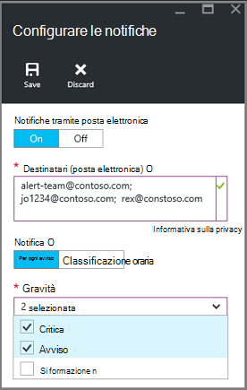

<properties
   pageTitle="Manager delle risorse monitor distribuito macchina virtuale backup | Microsoft Azure"
   description="Monitorare gli eventi e gli avvisi da un backup distribuito Manager delle risorse macchina virtuale. Inviare posta elettronica basato su avvisi."
   services="backup"
   documentationCenter="dev-center-name"
   authors="markgalioto"
   manager="cfreeman"
   editor=""/>

<tags
ms.service="backup"
ms.workload="storage-backup-recovery"
ms.tgt_pltfrm="na"
ms.devlang="na"
ms.topic="article"
ms.date="08/25/2016"
ms.author="trinadhk; giridham;"/>

# <a name="monitor-alerts-for-azure-virtual-machine-backups"></a>Monitoraggio degli avvisi per i backup Azure macchina virtuale

Avvisi sono le risposte del servizio che un limite di evento è stata soddisfatto o superato. Sapere quando problemi inizio può essere fondamentale per ridurre i costi di business verso il basso. Avvisi in genere non si verificano a intervalli ed è comunque utile conoscere presto dopo che si verificano gli avvisi. Ad esempio quando un processo di backup o ripristino non riesce, viene visualizzato un avviso di errore di cinque minuti. Il dashboard di archivio sul riquadro avvisi Backup consente di visualizzare gli eventi critici e livello di avviso. In impostazioni degli avvisi di Backup, è possibile visualizzare tutti gli eventi. Ma cosa fare se viene visualizzato un avviso quando si lavora su un problema separato? Se non si sa quando si verifica l'avviso, potrebbe essere un inconvenienti secondaria o possono compromettere i dati. Per assicurarsi che gli utenti siano a conoscenza di un avviso - quando si verifica, configurare il servizio per l'invio di notifiche tramite posta elettronica. Per informazioni dettagliate sulla configurazione delle notifiche tramite posta elettronica, vedere [configurare le notifiche](backup-azure-monitor-vms.md#configure-notifications).

## <a name="how-do-i-find-information-about-the-alerts"></a>Come è possibile trovare informazioni sugli avvisi?

Per visualizzare informazioni sull'evento che ha generato un avviso, è necessario aprire e il Backup avvisi. Esistono due modi per aprire e il Backup avvisi: dagli avvisi di Backup affiancare nel dashboard di archivio o da e l'avvisi ed eventi.

Per aprire e il Backup avvisi dal riquadro avvisi Backup:

- Nel riquadro di **Backup avvisi** nel dashboard di archivio, fare clic su **critico** o un **avviso** per visualizzare gli eventi operativi per quel livello gravità.

    


Per aprire e il Backup avvisi da e l'avvisi ed eventi:

1. Nel dashboard di archivio, fare clic su **Tutte le impostazioni**. 

2. Scegliere **avvisi ed eventi**e **l'Impostazioni** . 

3. Scegliere **Gli avvisi di Backup**e **l'avvisi ed eventi** . 

    Verrà visualizzato e il **Backup avvisi** avvisi filtrati.

    

4. Per visualizzare informazioni dettagliate su un particolare avviso, dall'elenco degli eventi, fare clic sull'avviso per aprire il relativo blade **Dettagli** .

    

    Per personalizzare gli attributi visualizzati nell'elenco, vedere [visualizzare gli attributi di evento aggiuntivo](backup-azure-monitor-vms.md#view-additional-event-attributes)

## <a name="configure-notifications"></a>Configurare le notifiche

 È possibile configurare il servizio per l'invio di notifiche tramite posta elettronica per gli avvisi che si sono verificati più ora passata o quando si verificano determinati tipi di eventi.

Per impostare le notifiche di posta elettronica per gli avvisi

1. Nel menu gli avvisi di Backup, fare clic su **Configura notifiche**

    

    Verrà visualizzata e il notifiche configurato automaticamente.

    

2. Della pala di configurare le notifiche, per le notifiche di posta elettronica, fare clic **su**.

    I destinatari e gravità finestre di dialogo di stella accanto alle perché tali informazioni sono necessarie. Specificare almeno un solo indirizzo email e selezionare almeno una gravità.

3. Nella finestra di dialogo **destinatari (posta elettronica)** , digitare gli indirizzi di posta elettronica per che ricevono le notifiche. Utilizzare il formato: username@domainname.com. Separare più indirizzi di posta elettronica con un punto e virgola (;).

4. Nell'area di **notifica** , scegliere **Avviso Per** inviare notifica quando si verifica l'avviso specificato o **Classificata oraria** per inviare un riepilogo per ultima ora.

5. Nella finestra di dialogo **gravità** , scegliere uno o più livelli che si desidera impostare un trigger notifica tramite posta elettronica.

6. Fare clic su **Salva**.
### <a name="what-alert-types-are-available-for-azure-iaas-vm-backup"></a>Quali tipi di avviso sono disponibili per il backup di macchine Virtuali IaaS Azure?
| Livello di avviso  | Avvisi inviati |
| ------------- | ------------- |
| Critica | Errore di backup, ripristino non riuscito  |
| Avviso  | Nessuno |
| Informativo  | Nessuno  |

### <a name="are-there-situations-where-email-isnt-sent-even-if-notifications-are-configured"></a>Ci sono situazioni in cui posta elettronica non viene inviato anche se sono configurate le notifiche?

Ci sono situazioni in cui non viene inviato un avviso, anche se le notifiche sono state configurate correttamente. Nel messaggio di posta elettronica situazioni seguenti le notifiche non vengono inviate al rumore avviso:

- Se le notifiche sono configurate per l'orario classificata e un avviso viene generato e risolto all'interno dell'ora.
- Annullare il processo.
- Un processo di backup viene attivato e l'ha esito negativo e un altro processo di backup è in corso.
- Avvio di un processo di backup pianificato per una macchina virtuale abilitato Manager delle risorse, ma la macchina virtuale non esiste più.

## <a name="customize-your-view-of-events"></a>Personalizzare la visualizzazione degli eventi

L'impostazione **log di controllo** viene fornito con un set predefinito di filtri e le colonne visualizzate le informazioni sull'evento operativo. È possibile personalizzare la visualizzazione in modo che quando si apre e **l'eventi** , che mostra le informazioni desiderate.

1. Nel [dashboard di archivio](./backup-azure-manage-vms.md#open-a-recovery-services-vault-in-the-dashboard), individuare e fare clic su **Registri di controllo** per aprire e **l'eventi** .

    

    Verrà visualizzata e **l'eventi** per gli eventi operativi filtrati solo per l'archivio corrente.

    

    E il Mostra l'elenco di critico, errore, avviso ed eventi informativi che si sono verificati nell'ultima settimana. L'intervallo di tempo è un valore predefinito impostato nel **filtro**. E **l'eventi** Mostra anche un grafico a barre verifica quando si è verificato gli eventi. Se non si desidera visualizzare il grafico a barre, nel menu **eventi** , fare clic su **Nascondi grafico** per attivare o disattivare il grafico. La visualizzazione predefinita di eventi visualizza le informazioni di operazione, livello, stato, risorse e ora. Per informazioni sull'esposizione attributi evento aggiuntivi, vedere la sezione [espansione informazioni sugli eventi](backup-azure-monitor-vms.md#view-additional-event-attributes).

2. Per ulteriori informazioni sull'evento operativo nella colonna **operazione** , fare clic su un evento per aprire il relativo blade operativo. Per informazioni dettagliate sugli eventi, e il. Eventi sono raggruppati per il loro ID di correlazione e un elenco di eventi che si sono verificati in intervallo di tempo.

    

3. Per visualizzare informazioni dettagliate su un particolare evento, dall'elenco degli eventi, fare clic sull'evento per aprire il relativo blade **Dettagli** .

    

    Le informazioni a livello di evento sono dettagliate, come Ottiene le informazioni. Se si desidera visualizzare questo quantità di informazioni relative a ogni evento e si desidera aggiungere questo livello di dettaglio e **l'eventi** , vedere la sezione [espansione informazioni sugli eventi](backup-azure-monitor-vms.md#view-additional-event-attributes).


## <a name="customize-the-event-filter"></a>Personalizzare il filtro di evento
Usare il **filtro** per regolare o selezionare le informazioni visualizzate in un determinato blade. Per filtrare le informazioni sull'evento:

1. Nel [dashboard di archivio](./backup-azure-manage-vms.md#open-a-recovery-services-vault-in-the-dashboard), individuare e fare clic su **Registri di controllo** per aprire e **l'eventi** .

    

    Verrà visualizzata e **l'eventi** per gli eventi operativi filtrati solo per l'archivio corrente.

    

2. Nel menu **eventi** , fare clic su **filtro** per aprire tale blade.

    

3. Su e il **filtro** , regolare i **livello di** **intervallo di tempo**, filtri e **chiamante** . Altri filtri non sono disponibili perché sono state impostate per fornire le informazioni correnti per l'archivio di servizi di recupero.

    

    È possibile specificare il **livello** di evento: critico, errore, avviso o informativo. È possibile scegliere qualsiasi combinazione di livelli di evento, ma è necessario disporre almeno un livello selezionato. Attivare o disattivare il livello di attivare o disattivare. Il filtro di **intervallo di tempo** consente di specificare l'intervallo di tempo per l'acquisizione di eventi. Se si usa un intervallo di tempo personalizzato, è possibile impostare l'ora di inizio e fine.

4. Quando si è pronti per i registri di operazioni usando il filtro della query, fare clic su **Aggiorna**. I risultati verranno visualizzati in e **l'eventi** .

    


### <a name="view-additional-event-attributes"></a>Visualizzare gli attributi di evento aggiuntivo
Utilizzo del pulsante di **colonne** , è possibile abilitare la visualizzazione nell'elenco e **l'eventi** attributi evento aggiuntivo. L'elenco predefinito di eventi Visualizza informazioni per l'operazione, livello, stato, risorse e ora. Per abilitare gli attributi aggiuntivi:

1. Scegliere **le colonne**e **l'eventi** .

    

    Verrà visualizzata e lo **Scegli colonne** .

    

2. Per selezionare l'attributo, selezionare la casella di controllo. La casella di controllo degli attributi attiva / disattiva.

3. Fare clic su **Reimposta** per reimpostare l'elenco degli attributi in e **l'eventi** . Dopo l'aggiunta o rimozione di attributi dall'elenco, utilizzare **Reimposta** per visualizzare il nuovo elenco gli attributi dell'evento.

4. Fare clic su **Aggiorna** per aggiornare i dati negli attributi dell'evento. Nella tabella seguente vengono fornite informazioni su ciascun attributo.

| Nome di colonna      |Descrizione|
| -----------------|-----------|
| Operazione|Il nome dell'operazione|
| Livello|Livello dell'operazione, i valori possono essere: informativo, avviso, errore o critica|
|Stato|Stato descrittivo dell'operazione|
|Risorsa|URL che identifica la risorsa. Nota anche come l'ID risorsa|
|Ora|Tempo misurato dall'ora corrente, quando si è verificato l'evento|
|Chiamante|Chi o cosa chiamato o attivate dell'evento. può essere il sistema o un utente|
|Timestamp|Ora quando è stata attivata l'evento|
|Gruppo di risorse|Gruppo di risorse associato|
|Tipo di risorsa|Il tipo di risorsa interna utilizzato da Gestione risorse|
|ID abbonamento|ID abbonamento associato|
|Categoria|Categoria dell'evento|
|ID di correlazione|ID comune per gli eventi correlati|


## <a name="use-powershell-to-customize-alerts"></a>Usare PowerShell per personalizzare gli avvisi
È possibile ottenere notifiche di avviso personalizzate per i processi nel portale. Per ottenere questi processi, definire regole di avviso in base a PowerShell per gli eventi registri operativi. Usare *PowerShell versione 1.3.0 o versione successiva*.

Per definire una notifica personalizzata per un avviso per gli errori di backup, utilizzare un comando come il seguente script:

```
PS C:\> $actionEmail = New-AzureRmAlertRuleEmail -CustomEmail contoso@microsoft.com
PS C:\> Add-AzureRmLogAlertRule -Name backupFailedAlert -Location "East US" -ResourceGroup RecoveryServices-DP2RCXUGWS3MLJF4LKPI3A3OMJ2DI4SRJK6HIJH22HFIHZVVELRQ-East-US -OperationName Microsoft.Backup/RecoveryServicesVault/Backup -Status Failed -TargetResourceId /subscriptions/86eeac34-eth9a-4de3-84db-7a27d121967e/resourceGroups/RecoveryServices-DP2RCXUGWS3MLJF4LKPI3A3OMJ2DI4SRJK6HIJH22HFIHZVVELRQ-East-US/providers/microsoft.backupbvtd2/RecoveryServicesVault/trinadhVault -Actions $actionEmail
```

**ResourceId** : È possibile ottenere ResourceId dai registri di controllo. Il ResourceId è un URL indicato nella colonna delle risorse dei log operazione.

**Invece** : invece è in formato "Microsoft.RecoveryServices/recoveryServicesVault/*EventName*" in cui può essere *EventName* :<br/>
- Eseguire la registrazione <br/>
- Annullare la registrazione <br/>
- ConfigureProtection <br/>
- Copia di backup <br/>
- Ripristinare <br/>
- StopProtection <br/>
- DeleteBackupData <br/>
- CreateProtectionPolicy <br/>
- DeleteProtectionPolicy <br/>
- UpdateProtectionPolicy <br/>

**Stato** : i valori supportati sono Started, completata o non riuscito.

**ResourceGroup** : si tratta del gruppo di risorse a cui appartiene la risorsa. È possibile aggiungere la colonna di gruppo di risorse per i log generati. Gruppo risorse corrisponde a uno dei tipi disponibili informazioni sull'evento.

**Nome** : nome della regola di avviso.

**CustomEmail** : specificare l'indirizzo di posta elettronica personalizzato a cui si desidera inviare un avviso

**SendToServiceOwners** : questa opzione Invia avviso a tutti gli amministratori e coamministratori della sottoscrizione. Può essere utilizzato in cmdlet **New-AzureRmAlertRuleEmail**

### <a name="limitations-on-alerts"></a>Limitazioni per gli avvisi
Gli avvisi basati sulla evento sono soggetti a limitazioni seguenti:

1. Avvisi sono attivati per tutte le macchine virtuali nell'archivio di servizi di recupero. Non è possibile personalizzare l'avviso per un subset di macchine virtuali in un archivio di servizi di recupero.
2. Questa caratteristica è in anteprima. [Ulteriori informazioni](../monitoring-and-diagnostics/insights-powershell-samples.md#create-alert-rules)
3. Avvisi vengono inviati da "alerts-noreply@mail.windowsazure.com". Attualmente non è possibile modificare il mittente di posta elettronica.


## <a name="next-steps"></a>Passaggi successivi

I registri eventi abilitare post-mortem interessanti e controllare il supporto per le operazioni di backup. Si è connessi le operazioni seguenti:

- Eseguire la registrazione
- Annullare la registrazione
- Configurare la protezione
- Copia di backup (entrambe pianificate oltre al tipo di backup su richiesta)
- Ripristinare
- Arrestare la protezione
- Eliminare i dati di backup
- Aggiungere criteri
- Eliminare criterio
- Criterio di aggiornamento
- Annulla processo

Per informazioni generali degli eventi, operazioni e i log di controllo in tutti i servizi Azure, vedere l'articolo, [visualizzare gli eventi e registri di controllo](../monitoring-and-diagnostics/insights-debugging-with-events.md).

Per informazioni su come creare nuovamente una macchina virtuale da un punto di ripristino, vedere [Ripristinare macchine virtuali di Azure](backup-azure-restore-vms.md). Per ulteriori informazioni sulla protezione macchine virtuali, vedere [prima di tutto: eseguire il backup di macchine virtuali in un archivio di servizi di recupero](backup-azure-vms-first-look-arm.md). Informazioni sulle attività di gestione per i backup macchine Virtuali vedere l'articolo [gestire Azure macchina virtuale backup](backup-azure-manage-vms.md).
