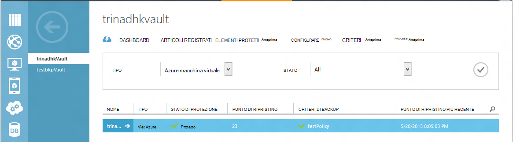
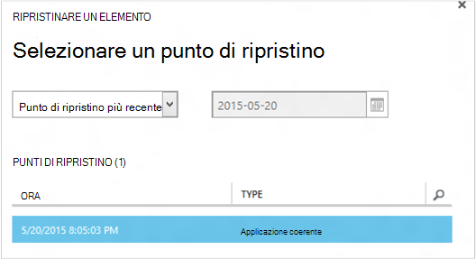
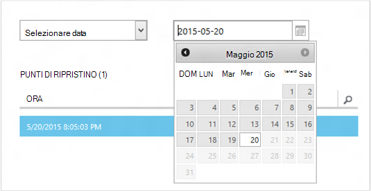
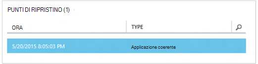
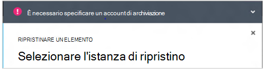
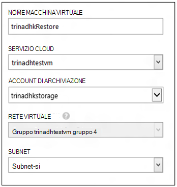
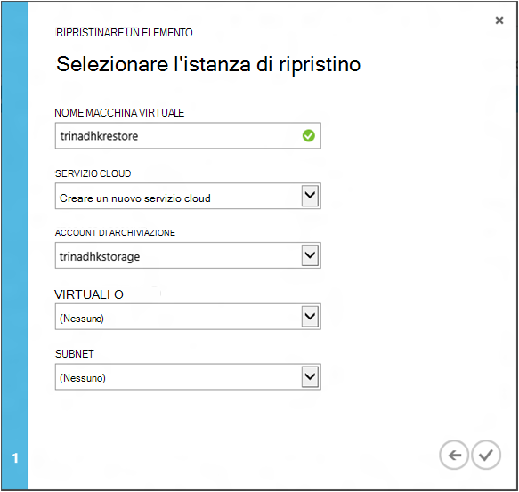
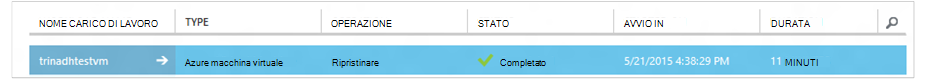

<properties
    pageTitle="Ripristinare un macchine virtuali da un backup | Microsoft Azure"
    description="Informazioni su come ripristinare una macchina virtuale Azure da un punto di ripristino"
    services="backup"
    documentationCenter=""
    authors="trinadhk"
    manager="shreeshd"
    editor=""
    keywords="ripristinare un backup. come ripristinare; punto di ripristino."/>

<tags
    ms.service="backup"
    ms.workload="storage-backup-recovery"
    ms.tgt_pltfrm="na"
    ms.devlang="na"
    ms.topic="article"
    ms.date="08/02/2016"
    ms.author="trinadhk; jimpark;"/>

# Ripristinare macchine virtuali di Azure

> [AZURE.SELECTOR]
- [Ripristinare macchine virtuali nel portale di Azure](backup-azure-arm-restore-vms.md)
- [Ripristinare macchine virtuali nel portale classica](backup-azure-restore-vms.md)

Ripristinare una macchina virtuale di una nuova macchina virtuale da un backup archiviati in un archivio di backup Azure con la procedura seguente.

## Ripristinare un flusso di lavoro

### 1. scegliere un elemento da ripristinare

1. Passare alla scheda **Elementi protetti** e selezionare l'immagine che si desidera ripristinare in una nuova macchina virtuale.

    

    La colonna di **Un punto di ripristino** nella pagina di **Elementi protetti** che indica il numero di punti di ripristino per una macchina virtuale. La colonna di **Un punto di ripristino più recente** indica l'ora del backup più recenti da cui possono essere ripristinata una macchina virtuale.

2. Fare clic su **Ripristina** per avviare la procedura guidata **ripristinare un elemento** .

    

### 2. selezionare un punto di ripristino

1. Nella schermata **Selezionare un punto di ripristino** , è possibile ripristinare dal punto di ripristino più recente o da un punto precedente nel tempo. L'opzione predefinita selezionata quando verrà visualizzata la procedura guidata è *Il punto di ripristino più recente*.

    

2. Per selezionare un punto precedente nel tempo, scegliere l'opzione **Selezione data** nella casella di riepilogo e selezionare una data nel controllo calendario facendo clic sull' **icona del calendario**. Nel controllo, tutte le date con punti di ripristino vengono riempite con una tonalità di grigio chiara e siano dall'utente.

    

    Dopo aver selezionato una data nel controllo calendario, il ripristino punti disponibili nella che data verrà visualizzata nella tabella di punti di ripristino riportata di seguito. La colonna **ora** indica l'ora in cui istantanea. Nella colonna **tipo** visualizzata la [coerenza](https://azure.microsoft.com/documentation/articles/backup-azure-vms/#consistency-of-recovery-points) del punto di ripristino. Intestazione di tabella mostra il numero di punti di ripristino disponibili in tale giorno tra parentesi.

    

3. Selezionare il punto di ripristino della tabella di **Punti di ripristino** e fare clic sulla freccia avanti per passare alla schermata successiva.

### 3. specificare un percorso di destinazione

1. Nella schermata **Selezionare Ripristina istanza** specificare i dettagli del punto in cui ripristinare la macchina virtuale.

  - Specificare il nome del computer virtuale: In un servizio cloud specificato, il nome del computer virtuale deve essere univoco. Non è possibile scrivere eccessiva macchine Virtuali esistenti. 
  - Selezionare un servizio cloud per la macchina virtuale: questo campo è obbligatorio per la creazione di una macchina virtuale. È possibile scegliere di utilizzare un servizio cloud esistente oppure creare un nuovo servizio cloud.

        Whatever cloud service name is picked should be globally unique. Typically, the cloud service name gets associated with a public-facing URL in the form of [cloudservice].cloudapp.net. Azure will not allow you to create a new cloud service if the name has already been used. If you choose to create select create a new cloud service, it will be given the same name as the virtual machine – in which case the VM name picked should be unique enough to be applied to the associated cloud service.

        We only display cloud services and virtual networks that are not associated with any affinity groups in the restore instance details. [Learn More](../virtual-network/virtual-networks-migrate-to-regional-vnet.md).

2. Selezionare un account di archiviazione per la macchina virtuale: questo campo è obbligatorio per la creazione della macchina virtuale. È possibile scegliere gli account di archiviazione esistenti nella stessa regione archivio di Backup di Azure. Non è possibile gli account di archiviazione che fanno zona ridondante o del tipo di spazio di archiviazione Premium.

    Se esistono account lo spazio di archiviazione con configurazione supportata, creare un account di archiviazione di configurazione supportata prima di avviare l'operazione di ripristino.

    

3. Selezionare una rete virtuale: la rete virtuale (VNET) per la macchina virtuale dovrebbe essere selezionata al momento della creazione della macchina virtuale. Il ripristino dell'interfaccia utente Mostra tutti i VNETs all'interno di questo abbonamento che può essere utilizzato. Non è necessario selezionare un VNET per la macchina virtuale ripristinata, sarà possibile connettersi al computer virtuale ripristinato tramite internet, anche se non viene applicato il VNET.

    Se il servizio cloud selezionato è associato a una rete virtuale, non è possibile modificare la rete virtuale.

    

4. Selezionare una subnet: nel caso in cui il VNET ha subnet, per impostazione predefinita è verrà selezionata la prima subnet. Scegliere subnet di propria scelta tra le opzioni di menu a discesa. Per informazioni dettagliate subnet, passare all'estensione reti nella [pagina home del portale](https://manage.windowsazure.com/), passare a **Reti virtuali** e selezionare la rete virtuale e drill-down Configura per visualizzare i dettagli di subnet.

    

5. Fare clic sull'icona di **INVIO** della procedura guidata per inviare i dettagli e creare un processo di ripristino.

## Tenere traccia dell'operazione di ripristino
Dopo aver tutte le informazioni nella procedura guidata di ripristino di input e inviata Azure Backup tenterà di creare un processo per tenere traccia dell'operazione di ripristino.

Se la creazione del processo ha esito positivo, verrà visualizzata una notifica di tipo avviso popup che indica che è stato creato il processo. È possibile ottenere ulteriori dettagli fare clic sul pulsante di **Visualizzazione processo** che consentono di accedere alla scheda **processi** .

Al termine dell'operazione di ripristino, verrà contrassegnata come completata nella scheda **processi** .

Dopo avere ripristinato la macchina virtuale potrebbe essere necessario reinstallare le estensioni sul originale macchine Virtuali e [modificare i punti finali](../virtual-machines/virtual-machines-windows-classic-setup-endpoints.md) per la macchina virtuale nel portale di Azure.

## Post-ripristino passaggi
Se si usa una distribuzione Linux basato su cloud-inizializzazione, ad esempio Ubuntu, per motivi di sicurezza, password verrà bloccata post-ripristino. Utilizzare VMAccess estensione in macchine Virtuali ripristinato per [reimpostare la password](../virtual-machines/virtual-machines-linux-classic-reset-access.md). È consigliabile utilizzare i tasti SSH su queste distribuzioni per evitare la reimpostazione password post ripristino. 

## Copia di backup per macchine virtuali ripristinate
Se è stato ripristinato macchine Virtuali in stesso servizio cloud con lo stesso nome inizialmente backup macchine Virtuali, backup continuerà sul ripristino di post macchine Virtuali. Se si dispone di ripristinato macchine virtuali in un servizio cloud diverso o specificato un nome diverso per macchine Virtuali ripristinato, questo verrà trattato come una nuova macchina virtuale ed è necessario eseguire il backup di configurazione per macchine Virtuali ripristinato.

## Il ripristino di una macchina virtuale durante Azure Data Center di emergenza
Backup Azure consente il ripristino di backup macchine virtuali al centro dati accoppiate nel caso in cui i dati primari centrare in macchine virtuali eseguita emergenza esperienze e configurato archivio di Backup per ridondante geografico. Durante tali scenari, è necessario selezionare un account di archiviazione che è presenta nell'interfaccia di dati accoppiate e resto del processo di ripristino rimane stesso. Backup Azure utilizza servizio da accoppiate geografico per creare la macchina virtuale ripristinata. 

## Ripristino delle macchine virtuali Controller di dominio
Copia di backup del Controller di dominio (controller di dominio) virtuali è uno scenario supportato con Azure Backup. Tuttavia alcune necessario prestare attenzione durante il processo di ripristino. L'esperienza di ripristino è molto diversa per le macchine virtuali Controller di dominio in una configurazione singolo controller di dominio e macchine virtuali in una configurazione con più controller di dominio.

### Singolo controller di dominio
La macchina virtuale può essere ripristinata (ad esempio qualsiasi altra macchina virtuale) i comuni portale o tramite PowerShell.

### Più controller di dominio
Quando si dispone di un ambiente con più controller di dominio, controller di dominio è modo di mantenere sincronizzati i dati. Quando un punto di backup meno recente è ripristinato *senza le precauzioni appropriate*, il processo di ripristino di USN può danneggiare in un ambiente con più controller di dominio. Nel modo giusto per recuperare ad esempio una macchina virtuale è viene avviato in modalità modalità ripristino servizi directory.

Il problema si verifica in quanto la modalità modalità ripristino servizi directory non sono presente in Azure. Per ripristinare una macchina di virtuale, pertanto non è possibile utilizzare il portale di Azure. L'unico supportato ripristino consiste ripristino basata su disco tramite PowerShell.

>[AZURE.WARNING] Per macchine virtuali Controller di dominio in un ambiente con più controller di dominio, non utilizzare il portale di Azure per il ripristino! È supportato solo ripristino di PowerShell in base a

Ulteriori informazioni sul [problema ripristino USN](https://technet.microsoft.com/library/dd363553) e strategie suggerite per risolvere il problema.

## Ripristino delle macchine virtuali con configurazioni di rete speciali
Azure Backup supporta backup per i seguenti configurazioni di rete speciale macchine virtuali.

- Macchine virtuali in bilanciamento del carico (interna ed esterna)
- Macchine virtuali con più indirizzi IP riservato
- Macchine virtuali con più schede di rete

Queste configurazioni impongono le seguenti considerazioni durante sul ripristino di utenti.

>[AZURE.TIP] Usare PowerShell in base a Ripristina flusso per ricreare la configurazione di rete speciale di macchine virtuali post ripristino.

### Ripristino dall'interfaccia utente:
Durante il ripristino dall'interfaccia utente e **scegliere sempre un nuovo servizio cloud**. Si noti che poiché portale accetta solo obbligatorio parametri durante il flusso di ripristino, macchine virtuali ripristinate utilizzando l'interfaccia utente andranno perse la configurazione di rete speciale che dispongono. In altre parole, Ripristina macchine virtuali sarà normale macchine virtuali senza la configurazione di bilanciamento del carico o con più NIC o più indirizzi IP riservato.

### Il ripristino da PowerShell:
PowerShell ha la possibilità di ripristinare solo dischi macchine Virtuali da un backup e non creare la macchina virtuale. Questa funzionalità è utile quando si ripristina macchine virtuali che richiedono mentined configurazioni di rete speciale sopra.

Per ricreare completamente dischi di ripristino post macchina virtuale, procedere come segue:

1. Ripristinare i dischi dall'archivio backup tramite [PowerShell Backup Azure](../backup-azure-vms-classic-automation.md#restore-an-azure-vm)

2. Creare la configurazione di macchine Virtuali necessaria per bilanciamento del carico / IP riservati più NIC/multiplo utilizzando i cmdlet di PowerShell e usare la creazione di macchine Virtuali di bene accolta configurazione.
    - Creare macchine Virtuali nel servizio cloud con [bilanciamento del carico interno](https://azure.microsoft.com/documentation/articles/load-balancer-internal-getstarted/)
    - Creare macchine Virtuali di connettersi a [Internet affiancate di bilanciamento del carico] (https://azure.microsoft.com/en-us/documentation/articles/load-balancer-internet-getstarted/)
    - Creare macchine Virtuali con [più schede di rete](https://azure.microsoft.com/documentation/articles/virtual-networks-multiple-nics/)
    - Creare macchine Virtuali con [più indirizzi IP riservato](https://azure.microsoft.com/documentation/articles/virtual-networks-reserved-public-ip/)

## Passaggi successivi
- [Risoluzione degli errori](backup-azure-vms-troubleshoot.md#restore)
- [Gestire macchine virtuali](backup-azure-manage-vms.md)
