<properties
   pageTitle="Ripristinare i dati in un Client di Windows o Windows Server comuni utilizzando il modello di distribuzione classica | Microsoft Azure"
   description="Informazioni su come ripristinare da un Client di Windows o Windows Server."
   services="backup"
   documentationCenter=""
   authors="saurabhsensharma"
   manager="shivamg"
   editor=""/>

<tags
   ms.service="backup"
   ms.workload="storage-backup-recovery"
     ms.tgt_pltfrm="na"
     ms.devlang="na"
     ms.topic="article"
     ms.date="08/02/2016"
     ms.author="trinadhk; jimpark; markgal;"/>

# Ripristinare i file in Windows server o computer client Windows utilizzando il modello di distribuzione classica

> [AZURE.SELECTOR]
- [Portale classica](backup-azure-restore-windows-server-classic.md)
- [Portale di Azure](backup-azure-restore-windows-server.md)

Questo articolo illustra i passaggi necessari per eseguire due tipi di operazioni di ripristino:

- Ripristinare i dati allo stesso computer da cui sono state create le copie di backup.
- Ripristinare i dati a un altro computer.

In entrambi i casi, i dati vengono recuperati dall'archivio di Backup di Azure.

[AZURE.INCLUDE [learn-about-deployment-models](../../includes/learn-about-deployment-models-classic-include.md)]

## Recuperare i dati allo stesso computer
Se si accidentalmente eliminato un file e si desidera ripristinare nello stesso computer (da cui viene eseguito il backup), la procedura seguente consente di recuperare i dati.

1. Aprire lo snap- **Microsoft Azure Backup** in.
2. Fare clic su **Recupera dati** per avviare il flusso di lavoro.

    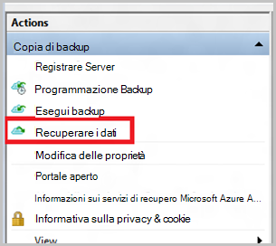

3. Selezionare il * *questo server (*yourmachinename*) * * le opzioni per ripristinare il backup dei file nello stesso computer.

    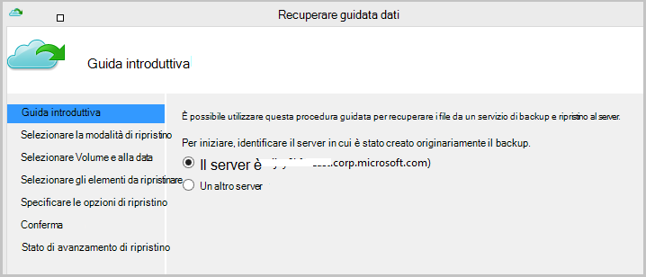

4. Scegliere **Sfoglia per i file** o **cercare i file**.

    Modificare l'opzione predefinita se si prevede di ripristinare uno o più file il cui percorso è sconosciuto. Se si desidera cercare un file non si è certi sulla struttura della cartella, selezionare l'opzione di **ricerca di file** . In questa sezione, si procederà con l'opzione predefinita.

    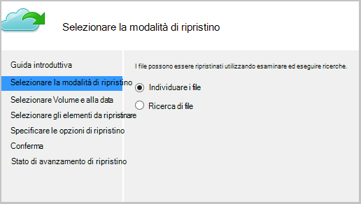

5. Selezionare il volume da cui si desidera ripristinare il file.

    È possibile ripristinare da un punto qualsiasi nel tempo. Le date che vengono visualizzati in **grassetto** nel controllo calendar indicano la disponibilità di un punto di ripristino. Dopo aver selezionata una data, in base alla pianificazione del backup e il successo di un'operazione di backup, è possibile selezionare un punto nel tempo dall'elenco a discesa **ora** verso il basso.

    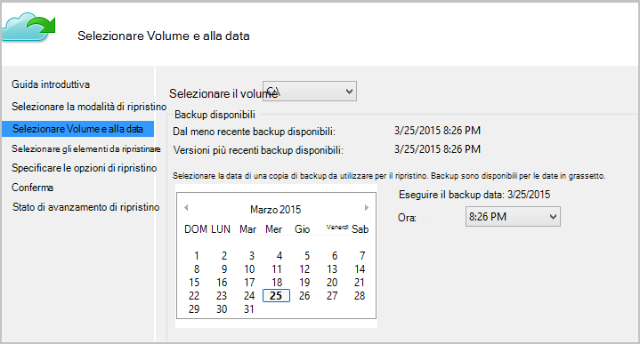

6. Selezionare gli elementi da ripristinare. È possibile selezioni più cartelle e file che si desidera ripristinare.

    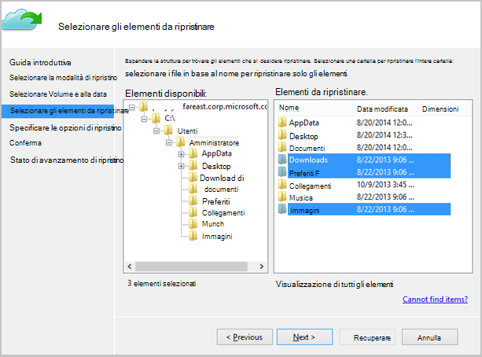

7. Specificare i parametri di ripristino.

    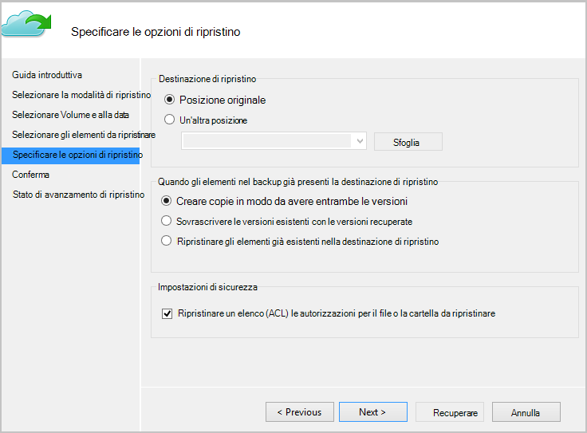

  - È disponibile un'opzione di ripristino nella posizione originale (in cui il file o la cartella vengono sovrascritti) o in un'altra posizione nello stesso computer.
  - Se il file o la cartella che si desidera ripristinare è presente nel percorso di destinazione, creare copie (due versioni dello stesso file), sovrascrivere i file nel percorso di destinazione o ignorare il ripristino di file che esiste nel database di destinazione.
  - Si consiglia di lasciare l'opzione predefinita di il ripristino degli ACL nel file di cui vengono recuperati.

8. Una volta vengono forniti i dati di input, fare clic su **Avanti**. Il flusso di lavoro di ripristino, che consente di ripristinare i file al computer in uso, verrà avviata.

## Ripristina in un computer alternativo
Se il server intero viene perso, è comunque possibile ripristinare dati da Azure Backup su un altro computer. La procedura seguente viene illustrato il flusso di lavoro.  

Include la terminologia utilizzata in questa procedura:

- *Computer di origine* : il computer originale da cui è stato eseguito il backup e che non è attualmente disponibile.
- *Computer di destinazione* : il computer in cui i dati vengono ripristinati.
- *Archivio di esempio* : archivio di Backup in cui sono registrate il *computer di origine* e *computer di destinazione* .  

> [AZURE.NOTE] Backup acquisito da un computer non possono essere ripristinati in un computer che esegue una versione precedente del sistema operativo. Ad esempio, se i backup vengono eseguiti da un computer Windows 7, possono essere ripristinato in Windows 8 o versioni successive di computer. Tuttavia, vice versa non accade.

1. Aprire lo **Microsoft Azure Backup** snap-in sul *computer di destinazione*.
2. Assicurarsi che il *computer di destinazione* e il *computer di origine* registrati per lo stesso archivio di backup.
3. Fare clic su **Recupera dati** per avviare il flusso di lavoro.

    

4. Selezionare **un altro server**

    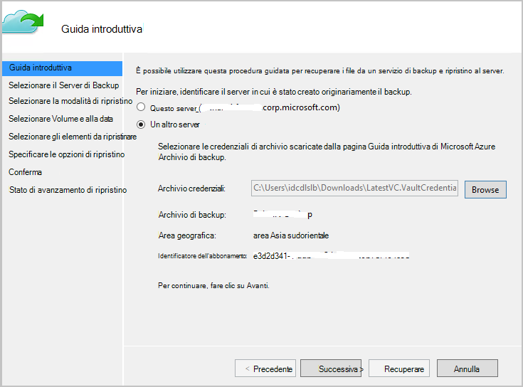

5. Specificare il file di archivio credenziali che corrisponde all' *archivio di esempio*. Se il file di archivio credenziali non è valido (o scaduto) scaricare un nuovo file di archivio credenziali dall' *archivio di esempio* nel portale di classica Azure. Una volta viene fornito il file di archivio credenziali, viene visualizzata l'archivio di backup nel file di archivio credenziali.

6. Selezionare la *macchina di origine* nell'elenco di computer visualizzato.

    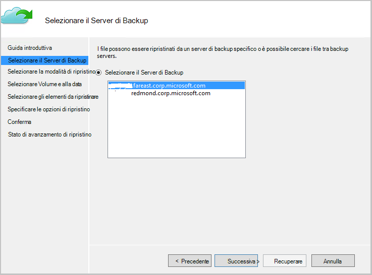

7. Opzione di **ricerca di file** o **cercare i file** . In questa sezione verrà usata l'opzione di **ricerca di file** .

    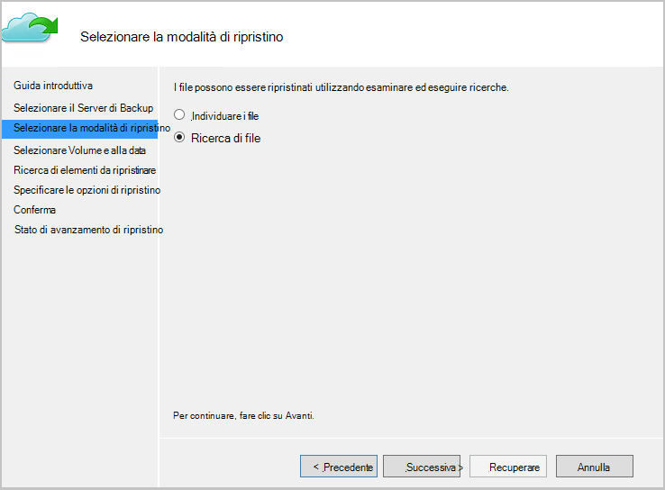

8. Selezionare il volume e la data nella schermata successiva. Cercare il nome di file delle cartelle da ripristinare.

    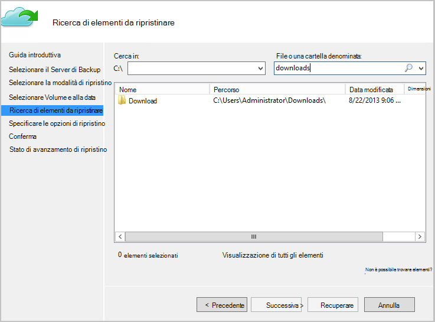

9. Selezionare il percorso in cui è necessario ripristinare i file.

    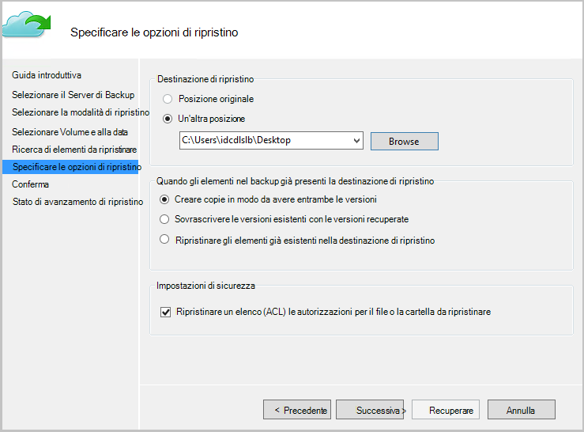

10. Specificare la passphrase crittografia fornito durante la registrazione del *computer di origine* *all'archivio di esempio*.

    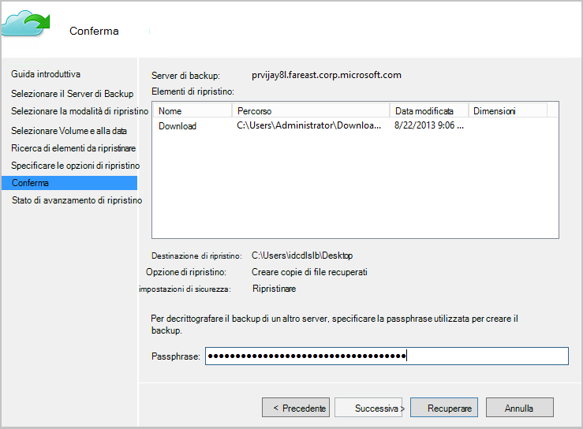

11. Una volta fornita l'input, fare clic su **Recupera**, che attiva il ripristino di file di backup alla destinazione fornito.

## Passaggi successivi
- [Domande frequenti Backup Azure](backup-azure-backup-faq.md)
- Visitare il [Forum Backup Azure](http://go.microsoft.com/fwlink/p/?LinkId=290933).

## Ulteriori informazioni
- [Panoramica di Backup Azure](http://go.microsoft.com/fwlink/p/?LinkId=222425)
- [Backup macchine virtuali di Azure](backup-azure-vms-introduction.md)
- [Backup carichi di lavoro di Microsoft](backup-azure-dpm-introduction.md)
