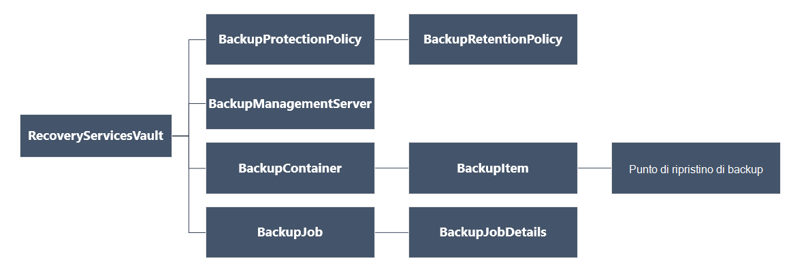

<properties
   pageTitle="Distribuire e gestire l'esecuzione di backup per macchine virtuali distribuito Manager delle risorse tramite PowerShell | Microsoft Azure"
   description="Usare PowerShell per distribuire e gestire backup in Azure per macchine virtuali distribuito Manager delle risorse"
   services="backup"
   documentationCenter=""
   authors="markgalioto"
   manager="cfreeman"
   editor=""/>

<tags
   ms.service="backup"
   ms.devlang="na"
   ms.topic="article"
   ms.tgt_pltfrm="na"
   ms.workload="storage-backup-recovery"
   ms.date="08/03/2016"
   ms.author="markgal; trinadhk"/>

# <a name="deploy-and-manage-backups-for-resource-manager-deployed-vms-using-powershell"></a>Distribuire e gestire l'esecuzione di backup per macchine virtuali distribuito Manager delle risorse tramite PowerShell

> [AZURE.SELECTOR]
- [Manager delle risorse](backup-azure-vms-automation.md)
- [Classica](backup-azure-vms-classic-automation.md)

In questo articolo viene illustrato come utilizzare i cmdlet di Azure PowerShell per eseguire il backup e ripristino una Azure macchine () da un archivio di servizi di recupero. Un archivio di servizi di recupero è una risorsa di gestione di risorse Azure e viene utilizzato per proteggere i dati e risorse in servizi di Azure Backup e il ripristino del sito di Azure. È possibile utilizzare un archivio di servizi di recupero a proteggere macchine virtuali distribuito Azure Service Manager, nonché macchine virtuali distribuito Manager delle risorse di Azure.

>[AZURE.NOTE] Azure include due modelli di distribuzione per la creazione e utilizzo delle risorse: [Gestione risorse e classica](../resource-manager-deployment-model.md). In questo articolo è per l'utilizzo con macchine virtuali create con il modello di Manager delle risorse.

In questo articolo illustra l'uso di PowerShell per proteggere una macchina virtuale e ripristinare i dati da un punto di ripristino.

## <a name="concepts"></a>Concetti

Se non si ha familiarità con il servizio di Backup di Azure, per una panoramica del servizio, vedere [che cos'è il Backup di Azure?](backup-introduction-to-azure-backup.md) Prima di iniziare, verificare illustrate le nozioni di base sui prerequisiti necessari per lavorare con Azure Backup e le limitazioni della soluzione di backup macchine Virtuali corrente.

Per utilizzare in modo efficace PowerShell, è necessario conoscere la gerarchia di oggetti e da dove iniziare.



Per visualizzare il riferimento di cmdlet AzureRmRecoveryServicesBackup PowerShell, vedere il [Backup di Azure - ripristino servizi cmdlet](https://msdn.microsoft.com/library/mt723320.aspx) nella raccolta di Azure.
Per visualizzare il riferimento di cmdlet AzureRmRecoveryServicesVault PowerShell, vedere i [Cmdlet di Azure ripristino del servizio](https://msdn.microsoft.com/library/mt643905.aspx).


## <a name="setup-and-registration"></a>Installazione e la registrazione

Per iniziare:

1. [Scaricare la versione più recente di PowerShell](https://github.com/Azure/azure-powershell/releases) (la versione minima necessaria è: 1.4.0)

2. Trovare i cmdlet di Azure Backup PowerShell disponibili digitando il comando seguente:

```
PS C:\> Get-Command *azurermrecoveryservices*

CommandType     Name                                               Version    Source
-----------     ----                                               -------    ------
Cmdlet          Backup-AzureRmRecoveryServicesBackupItem           1.4.0      AzureRM.RecoveryServices.Backup
Cmdlet          Disable-AzureRmRecoveryServicesBackupProtection    1.4.0      AzureRM.RecoveryServices.Backup
Cmdlet          Enable-AzureRmRecoveryServicesBackupProtection     1.4.0      AzureRM.RecoveryServices.Backup
Cmdlet          Get-AzureRmRecoveryServicesBackupContainer         1.4.0      AzureRM.RecoveryServices.Backup
Cmdlet          Get-AzureRmRecoveryServicesBackupItem              1.4.0      AzureRM.RecoveryServices.Backup
Cmdlet          Get-AzureRmRecoveryServicesBackupJob               1.4.0      AzureRM.RecoveryServices.Backup
Cmdlet          Get-AzureRmRecoveryServicesBackupJobDetails        1.4.0      AzureRM.RecoveryServices.Backup
Cmdlet          Get-AzureRmRecoveryServicesBackupManagementServer  1.4.0      AzureRM.RecoveryServices.Backup
Cmdlet          Get-AzureRmRecoveryServicesBackupProperties        1.4.0      AzureRM.RecoveryServices
Cmdlet          Get-AzureRmRecoveryServicesBackupProtectionPolicy  1.4.0      AzureRM.RecoveryServices.Backup
Cmdlet          Get-AzureRMRecoveryServicesBackupRecoveryPoint     1.4.0      AzureRM.RecoveryServices.Backup
Cmdlet          Get-AzureRmRecoveryServicesBackupRetentionPolic... 1.4.0      AzureRM.RecoveryServices.Backup
Cmdlet          Get-AzureRmRecoveryServicesBackupSchedulePolicy... 1.4.0      AzureRM.RecoveryServices.Backup
Cmdlet          Get-AzureRmRecoveryServicesVault                   1.4.0      AzureRM.RecoveryServices
Cmdlet          Get-AzureRmRecoveryServicesVaultSettingsFile       1.4.0      AzureRM.RecoveryServices
Cmdlet          New-AzureRmRecoveryServicesBackupProtectionPolicy  1.4.0      AzureRM.RecoveryServices.Backup
Cmdlet          New-AzureRmRecoveryServicesVault                   1.4.0      AzureRM.RecoveryServices
Cmdlet          Remove-AzureRmRecoveryServicesProtectionPolicy     1.4.0      AzureRM.RecoveryServices.Backup
Cmdlet          Remove-AzureRmRecoveryServicesVault                1.4.0      AzureRM.RecoveryServices
Cmdlet          Restore-AzureRMRecoveryServicesBackupItem          1.4.0      AzureRM.RecoveryServices.Backup
Cmdlet          Set-AzureRmRecoveryServicesBackupProperties        1.4.0      AzureRM.RecoveryServices
Cmdlet          Set-AzureRmRecoveryServicesBackupProtectionPolicy  1.4.0      AzureRM.RecoveryServices.Backup
Cmdlet          Set-AzureRmRecoveryServicesVaultContext            1.4.0      AzureRM.RecoveryServices
Cmdlet          Stop-AzureRmRecoveryServicesBackupJob              1.4.0      AzureRM.RecoveryServices.Backup
Cmdlet          Unregister-AzureRmRecoveryServicesBackupContainer  1.4.0      AzureRM.RecoveryServices.Backup
Cmdlet          Unregister-AzureRmRecoveryServicesBackupManagem... 1.4.0      AzureRM.RecoveryServices.Backup
Cmdlet          Wait-AzureRmRecoveryServicesBackupJob              1.4.0      AzureRM.RecoveryServices.Backup
```


Con PowerShell, è possono automatizzare le attività seguenti:

- Creare un archivio di servizi di recupero
- Eseguire il backup o proteggere macchine virtuali di Azure
- Avviare un processo di backup
- Monitorare un processo di backup
- Ripristinare una macchina virtuale Azure

## <a name="create-a-recovery-services-vault"></a>Creare un archivio di servizi di recupero

La procedura seguente per facilitare la creazione di un archivio di servizi di recupero. Un archivio di servizi di recupero è diverso da un archivio di Backup.

1. Se si utilizza il Backup di Azure per la prima volta, è necessario utilizzare il cmdlet **[Registro AzureRMResourceProvider](https://msdn.microsoft.com/library/mt679020.aspx)** per registrare il provider di servizi di recupero Azure con l'abbonamento.

    ```
    PS C:\> Register-AzureRmResourceProvider -ProviderNamespace "Microsoft.RecoveryServices"
    ```

2. Archivio di servizi di recupero è una risorsa di Manager delle risorse, pertanto è necessario inserire all'interno di un gruppo di risorse. È possibile usare un gruppo di risorse esistente o creare un nuovo gruppo di risorse con i cmdlet **[New-AzureRmResourceGroup](https://msdn.microsoft.com/library/mt678985.aspx)** . Quando si crea un nuovo gruppo di risorse, specificare il nome e il percorso per il gruppo di risorse.  

    ```
    PS C:\> New-AzureRmResourceGroup –Name "test-rg" –Location "West US"
    ```

3. Utilizzare il cmdlet **[New-AzureRmRecoveryServicesVault](https://msdn.microsoft.com/library/mt643910.aspx)** per creare il nuovo archivio. Assicurarsi di specificato nella stessa posizione per l'archivio di come è stato utilizzato per il gruppo di risorse.

    ```
    PS C:\> New-AzureRmRecoveryServicesVault -Name "testvault" -ResourceGroupName " test-rg" -Location "West US"
    ```

4. Specificare il tipo di ridondanza di archiviazione da utilizzare; è possibile utilizzare [Lo spazio di archiviazione ridondanti in locale (LRS)](../storage/storage-redundancy.md#locally-redundant-storage) o [Geografico ridondanti dello spazio di archiviazione (GRS)](../storage/storage-redundancy.md#geo-redundant-storage). Nell'esempio seguente mostra che l'opzione - BackupStorageRedundancy per testVault è impostata su GeoRedundant.

    ```
    PS C:\> $vault1 = Get-AzureRmRecoveryServicesVault –Name "testVault"
    PS C:\> Set-AzureRmRecoveryServicesBackupProperties  -Vault $vault1 -BackupStorageRedundancy GeoRedundant
    ```

    > [AZURE.TIP] Cmdlet di Backup di Azure molti richiedono l'oggetto di archivio di servizi di recupero come input. Per questo motivo, è utile memorizzare l'oggetto di archivio di servizi di recupero di Backup in una variabile.

## <a name="view-the-vaults-in-a-subscription"></a>Visualizzare gli archivi di in una sottoscrizione
Utilizzare **[Get-AzureRmRecoveryServicesVault](https://msdn.microsoft.com/library/mt643907.aspx)** per visualizzare l'elenco di tutti gli archivi nella sottoscrizione corrente. È possibile utilizzare questo comando per verificare che sia stato creato un nuovo archivio o per verificare quali archivi sono disponibili nella sottoscrizione.

Eseguire il comando Get-AzureRmRecoveryServicesVault e sono elencati tutti gli archivi nella sottoscrizione.

```
PS C:\> Get-AzureRmRecoveryServicesVault
Name              : Contoso-vault
ID                : /subscriptions/1234
Type              : Microsoft.RecoveryServices/vaults
Location          : WestUS
ResourceGroupName : Contoso-docs-rg
SubscriptionId    : 1234-567f-8910-abc
Properties        : Microsoft.Azure.Commands.RecoveryServices.ARSVaultProperties
```


## <a name="backup-azure-vms"></a>Backup macchine virtuali di Azure
Una volta creato un archivio di servizi di recupero, è possibile utilizzare per proteggere una macchina virtuale. Tuttavia prima di applicare la protezione, è necessario impostare il contesto di archivio e desiderate verificare il criterio di protezione. Contesto di archivio definisce il tipo di dati che sono protetti nell'archivio di. I criteri di protezione sono la programmazione durante l'esecuzione del processo di backup e il tempo viene mantenuto ogni snapshot backup.

Prima di attivare la protezione in una macchina virtuale, è necessario impostare il contesto di archivio. Il contesto viene applicato a tutti i cmdlet successivi.

```
PS C:\> Get-AzureRmRecoveryServicesVault -Name testvault | Set-AzureRmRecoveryServicesVaultContext
```

### <a name="create-a-protection-policy"></a>Creazione di un criterio di protezione

Quando si crea un nuovo archivio, include criteri predefiniti. Questo criterio attiva un processo di backup ogni giorno un'ora specifica. Criteri predefiniti per i backup snapshot viene mantenuto per 30 giorni. È possibile utilizzare il criterio predefinito per proteggere rapidamente le macchine Virtuali e modificare i criteri in un secondo momento con dettagli diversi.

Utilizzare **[Get-AzureRmRecoveryServicesBackupProtectionPolicy](https://msdn.microsoft.com/library/mt723300.aspx)** per visualizzare l'elenco dei criteri disponibile nell'archivio di:

```
PS C:\> Get-AzureRmRecoveryServicesBackupProtectionPolicy -WorkloadType AzureVM
Name                 WorkloadType       BackupManagementType BackupTime                DaysOfWeek
----                 ------------       -------------------- ----------                ----------
DefaultPolicy        AzureVM            AzureVM              4/14/2016 5:00:00 PM
```

> [AZURE.NOTE] Il fuso orario del campo BackupTime PowerShell sia l'ora UTC. Tuttavia, quando il tempo di backup viene visualizzato nel portale di Azure, l'ora viene regolata per il fuso orario locale.

Un criterio di protezione backup è associato almeno un criterio di conservazione.  Criteri di conservazione definiscono il periodo di tempo un punto di ripristino viene mantenuto con Azure Backup. Utilizzare **Get-AzureRmRecoveryServicesBackupRetentionPolicyObject** per visualizzare i criteri di conservazione predefinito.  In modo analogo è possibile utilizzare **Get-AzureRmRecoveryServicesBackupSchedulePolicyObject** per ottenere il criterio di programmazione predefinito. La pianificazione e la conservazione dei criteri vengono utilizzati come input al cmdlet **New-AzureRmRecoveryServicesBackupProtectionPolicy** .

Un criterio di protezione backup definisce quando e con quale frequenza il backup di un elemento è stato completato. Il cmdlet New-AzureRmRecoveryServicesBackupProtectionPolicy crea un oggetto di PowerShell che contiene informazioni sui criteri di backup. Criteri di backup viene utilizzato come input al cmdlet Enable-AzureRmRecoveryServicesBackupProtection.

```
PS C:\> $schPol = Get-AzureRmRecoveryServicesBackupSchedulePolicyObject -WorkloadType "AzureVM"
PS C:\>  $retPol = Get-AzureRmRecoveryServicesBackupRetentionPolicyObject -WorkloadType "AzureVM"
PS C:\>  New-AzureRmRecoveryServicesBackupProtectionPolicy -Name "NewPolicy" -WorkloadType AzureVM -RetentionPolicy $retPol -SchedulePolicy $schPol
Name                 WorkloadType       BackupManagementType BackupTime                DaysOfWeek
----                 ------------       -------------------- ----------                ----------
NewPolicy           AzureVM            AzureVM              4/24/2016 1:30:00 AM
```

### <a name="enable-protection"></a>Attivare la protezione

Per consentire la protezione include due oggetti - l'elemento e i criteri. Entrambi gli oggetti sono necessari per consentire la protezione per l'archivio. Dopo aver associato l'archivio il criterio, il flusso di lavoro backup viene attivata al momento in base alla pianificazione dei criteri.

Per consentire la protezione in macchine virtuali ARM non crittografato

```
PS C:\> $pol=Get-AzureRmRecoveryServicesBackupProtectionPolicy -Name "NewPolicy"
PS C:\> Enable-AzureRmRecoveryServicesBackupProtection -Policy $pol -Name "V2VM" -ResourceGroupName "RGName1"
```

Per abilitare la protezione in macchine virtuali crittografate [crittografato utilizzando BEK e KEK], è necessario assegnare le autorizzazioni per il servizio di Backup di Azure per leggere chiavi e informazioni riservate dall'archivio chiave. 

```
PS C:\> Set-AzureRmKeyVaultAccessPolicy -VaultName 'KeyVaultName' -ResourceGroupName 'RGNameOfKeyVault' -PermissionsToKeys backup,get,list -PermissionsToSecrets get,list -ServicePrincipalName 262044b1-e2ce-469f-a196-69ab7ada62d3
PS C:\> $pol=Get-AzureRmRecoveryServicesBackupProtectionPolicy -Name "NewPolicy"
PS C:\> Enable-AzureRmRecoveryServicesBackupProtection -Policy $pol -Name "V2VM" -ResourceGroupName "RGName1"
```

Per ASM in base a macchine virtuali

```
PS C:\>  $pol=Get-AzureRmRecoveryServicesBackupProtectionPolicy -Name "NewPolicy"
PS C:\>  Enable-AzureRmRecoveryServicesBackupProtection -Policy $pol -Name "V1VM" -ServiceName "ServiceName1"
```

### <a name="modify-a-protection-policy"></a>Modificare un criterio di protezione

Per modificare il criterio, modificare l'oggetto BackupSchedulePolicyObject o BackupRetentionPolicy e modificare i criteri di utilizzo AzureRmRecoveryServicesBackupProtectionPolicy Set

Nell'esempio seguente viene modificato il numero totale di conservazione a 365.

```
PS C:\> $retPol = Get-AzureRmRecoveryServicesBackupRetentionPolicyObject -WorkloadType "AzureVM"
PS C:\> $retPol.DailySchedule.DurationCountInDays = 365
PS C:\> $pol= Get-AzureRmRecoveryServicesBackupProtectionPolicy -Name NewPolicy
PS C:\> Set-AzureRmRecoveryServicesBackupProtectionPolicy -Policy $pol  -RetentionPolicy  $RetPol
```

## <a name="run-an-initial-backup"></a>Eseguire un backup iniziale

La pianificazione di backup attiva completo backup iniziale indietro per l'elemento. In successivi backup, eseguire il backup è una copia incrementale. Se si vuole forzare l'inizio del primo backup verificarsi in un determinato momento o persino immediatamente utilizzare il cmdlet di **[Backup AzureRmRecoveryServicesBackupItem](https://msdn.microsoft.com/library/mt723312.aspx)** :

```
PS C:\> $namedContainer = Get-AzureRmRecoveryServicesBackupContainer -ContainerType "AzureVM" -Status "Registered" -Name "V2VM"
PS C:\> $item = Get-AzureRmRecoveryServicesBackupItem -Container $namedContainer -WorkloadType "AzureVM"
PS C:\> $job = Backup-AzureRmRecoveryServicesBackupItem -Item $item
WorkloadName     Operation            Status               StartTime                 EndTime                   JobID
------------     ---------            ------               ---------                 -------                   ----------
V2VM              Backup               InProgress            4/23/2016 5:00:30 PM                       cf4b3ef5-2fac-4c8e-a215-d2eba4124f27
```

> [AZURE. Nota: Il fuso orario dei campi ora di inizio e fine PowerShell sia l'ora UTC. Tuttavia, quando il tempo viene visualizzato nel portale di Azure, l'ora viene regolata per il fuso orario locale.

## <a name="monitoring-a-backup-job"></a>Monitoraggio di un processo di backup

La maggior parte delle operazioni di lunga backup Azure sono unificate come processo. Questo è semplice tenere traccia dello stato senza la necessità di mantenere il portale di Azure aperto in qualsiasi momento.

Per ottenere lo stato più recente di un processo in corso, utilizzare il cmdlet Get-AzureRmRecoveryservicesBackupJob.

```
PS C:\ > $joblist = Get-AzureRmRecoveryservicesBackupJob –Status InProgress
PS C:\ > $joblist[0]
WorkloadName     Operation            Status               StartTime                 EndTime                   JobID
------------     ---------            ------               ---------                 -------                   ----------
V2VM             Backup               InProgress            4/23/2016 5:00:30 PM           cf4b3ef5-2fac-4c8e-a215-d2eba4124f27
```

Invece di polling questi processi per il completamento, che non necessarie codice aggiuntivo - utilizzano il cmdlet **[AzureRmRecoveryServicesBackupJob di attesa](https://msdn.microsoft.com/library/mt723321.aspx)** . Questo cmdlet sospende l'esecuzione fino al termine del processo o viene raggiunto il valore di timeout specificato.

```
PS C:\> Wait-AzureRmRecoveryServicesBackupJob -Job $joblist[0] -Timeout 43200
```

## <a name="restore-an-azure-vm"></a>Ripristinare una macchina virtuale Azure

Esiste una chiave differenza tra il ripristino di una macchina virtuale tramite il portale di Azure e sul ripristino di una macchina virtuale tramite PowerShell. Con PowerShell, l'operazione di ripristino è stata completata dopo aver creati la dischi e le informazioni di configurazione del punto di ripristino. L'operazione di ripristino non viene creata una macchina virtuale. Vengono fornite le istruzioni per creare la macchina virtuale dai dischi. Per ripristinare completamente una macchina virtuale, tuttavia, è necessario utilizzare le procedure seguenti:

- Selezionare la macchina virtuale
- Scegliere un punto di ripristino
- Ripristinare i dischi
- Creare la macchina virtuale da dischi archiviati

La figura seguente è illustrata la gerarchia da RecoveryServicesVault per difetto il BackupRecoveryPoint.


Per ripristinare i dati di backup, individuare l'elemento di backup e il punto di ripristino che contiene i dati in un momento. Quindi utilizzare il cmdlet **[AzureRmRecoveryServicesBackupItem ripristino](https://msdn.microsoft.com/library/mt723316.aspx)** per ripristinare i dati da archivio per conto del cliente.

### <a name="select-the-vm"></a>Selezionare la macchina virtuale

Per ottenere l'oggetto di PowerShell che identifica l'elemento a destra backup, iniziare dal contenitore nell'archivio di e il funzionamento verso il basso della gerarchia di oggetti. Per selezionare il contenitore che rappresenta la macchina virtuale, utilizzare il cmdlet **[Get-AzureRmRecoveryServicesBackupContainer](https://msdn.microsoft.com/library/mt723319.aspx)** e tubazioni che per il cmdlet **[Get-AzureRmRecoveryServicesBackupItem](https://msdn.microsoft.com/library/mt723305.aspx)** .

```
PS C:\> $namedContainer = Get-AzureRmRecoveryServicesBackupContainer  -ContainerType AzureVM –Status Registered -Name 'V2VM'
PS C:\> $backupitem = Get-AzureRmRecoveryServicesBackupItem –Container $namedContainer  –WorkloadType "AzureVM"
```

### <a name="choose-a-recovery-point"></a>Scegliere un punto di ripristino

Utilizzare il cmdlet **[Get-AzureRmRecoveryServicesBackupRecoveryPoint](https://msdn.microsoft.com/library/mt723308.aspx)** per visualizzare un elenco di tutti i punti di ripristino per l'elemento di backup. Scegliere quindi il punto di ripristino per ripristinare. Se non si conosce il punto di ripristino da utilizzare, è consigliabile scegliere RecoveryPointType più recente = AppConsistent punto dell'elenco.

In script seguente la variabile **$rp**è una matrice di punti di ripristino per l'elemento selezionato di backup. La matrice viene ordinata in ordine inverso di tempo con il punto di ripristino più recente indice 0. Usare l'indicizzazione in forma di matrice di PowerShell standard per selezionare il punto di ripristino. Ad esempio: $rp [0] verrà selezionato il punto di ripristino più recente.

```
PS C:\> $startDate = (Get-Date).AddDays(-7)
PS C:\> $endDate = Get-Date
PS C:\> $rp = Get-AzureRmRecoveryServicesBackupRecoveryPoint -Item $backupitem -StartDate $startdate.ToUniversalTime() -EndDate $enddate.ToUniversalTime()
PS C:\> $rp[0]
RecoveryPointAdditionalInfo :
SourceVMStorageType         : NormalStorage
Name                        : 15260861925810
ItemName                    : VM;iaasvmcontainer;RGName1;V2VM
RecoveryPointId             : /subscriptions/XX/resourceGroups/ RGName1/providers/Microsoft.RecoveryServices/vaults/testvault/backupFabrics/Azure/protectionContainers/IaasVMContainer;iaasvmcontainer;RGName1;V2VM/protectedItems/VM;iaasvmcontainer; RGName1;V2VM
                              /recoveryPoints/15260861925810
RecoveryPointType           : AppConsistent
RecoveryPointTime           : 4/23/2016 5:02:04 PM
WorkloadType                : AzureVM
ContainerName               : IaasVMContainer;iaasvmcontainer; RGName1;V2VM
ContainerType               : AzureVM
BackupManagementType        : AzureVM
```


### <a name="restore-the-disks"></a>Ripristinare i dischi

Utilizzare il cmdlet **[AzureRmRecoveryServicesBackupItem ripristino](https://msdn.microsoft.com/library/mt723316.aspx)** per ripristinare dati e configurazione per un elemento di Backup in un punto di ripristino. Dopo aver individuato un punto di ripristino usarla come valore per il parametro **- RecoveryPoint** . Nell'esempio precedente, **$rp [0]** è stato scelto come punto di ripristino di utilizzare. Nell'esempio seguente, **$rp [0]** viene specificato come il punto di ripristino da utilizzare per il ripristino su disco.

Per ripristinare i dischi e le informazioni di configurazione

```
PS C:\> $restorejob = Restore-AzureRmRecoveryServicesBackupItem -RecoveryPoint $rp[0] -StorageAccountName DestAccount -StorageAccountResourceGroupName DestRG
PS C:\> $restorejob
WorkloadName     Operation          Status               StartTime                 EndTime            JobID
------------     ---------          ------               ---------                 -------          ----------
V2VM              Restore           InProgress           4/23/2016 5:00:30 PM                        cf4b3ef5-2fac-4c8e-a215-d2eba4124f27
```

Una volta completato il processo di ripristino, utilizzare il cmdlet **[Get-AzureRmRecoveryServicesBackupJobDetails](https://msdn.microsoft.com/library/mt723310.aspx)** per visualizzare i dettagli dell'operazione di ripristino. Le informazioni necessarie per ricreare la macchina virtuale per la proprietà JobDetails.

```
PS C:\> $restorejob = Get-AzureRmRecoveryServicesBackupJob -Job $restorejob
PS C:\> $details = Get-AzureRmRecoveryServicesBackupJobDetails
```

Dopo avere ripristinato i dischi, passare alla sezione successiva per informazioni sulla creazione di macchina virtuale.

### <a name="create-a-vm-from-restored-disks"></a>Creare una macchina virtuale da dischi ripristinati

Dopo avere ripristinato i dischi, seguire questi passaggi per creare e configurare la macchina virtuale da disco.

1. Le proprietà disco ripristinato per i dettagli della query.

    ```
    PS C:\> $properties = $details.properties
    PS C:\> $storageAccountName = $properties["Target Storage Account Name"]
    PS C:\> $containerName = $properties["Config Blob Container Name"]
    PS C:\> $blobName = $properties["Config Blob Name"]
    ```

2. Impostare il contesto di archiviazione Azure e ripristinare file di configurazione JSON.

    ```
    PS C:\> Set-AzureRmCurrentStorageAccount -Name $storageaccountname -ResourceGroupName testvault
    PS C:\> $destination_path = "C:\vmconfig.json"
    PS C:\> Get-AzureStorageBlobContent -Container $containerName -Blob $blobName -Destination $destination_path
    PS C:\> $obj = ((Get-Content -Path $destination_path -Encoding Unicode)).TrimEnd([char]0x00) | ConvertFrom-Json
    ```

3. Utilizzare il file di configurazione JSON per creare la configurazione di macchine Virtuali.

    ```
  PS C:\> $vm = New-AzureRmVMConfig -VMSize $obj.HardwareProfile.VirtualMachineSize -VMName "testrestore"
    ```

4. Collegare il disco rigido del sistema operativo e dischi di dati.

      Per macchine virtuali non crittografato

       ```
       PS C:\> Set-AzureRmVMOSDisk -VM $vm -Name "osdisk" -VhdUri $obj.StorageProfile.OSDisk.VirtualHardDisk.Uri -CreateOption “Attach”
       PS C:\> $vm.StorageProfile.OsDisk.OsType = $obj.StorageProfile.OSDisk.OperatingSystemType foreach($dd in $obj.StorageProfile.DataDisks)
       {
       $vm = Add-AzureRmVMDataDisk -VM $vm -Name "datadisk1" -VhdUri $dd.VirtualHardDisk.Uri -DiskSizeInGB 127 -Lun $dd.Lun -CreateOption Attach
       }
       ```
      Per le macchine virtuali crittografate, è necessario specificare [informazioni chiave di archivio](https://msdn.microsoft.com/library/dn868052.aspx) prima di collegare dischi.
      
      ```
      PS C:\> Set-AzureRmVMOSDisk -VM $vm -Name "osdisk" -VhdUri $obj.StorageProfile.OSDisk.VirtualHardDisk.Uri -DiskEncryptionKeyUrl "https://ContosoKeyVault.vault.azure.net:443/secrets/ContosoSecret007" -DiskEncryptionKeyVaultId "/subscriptions/abcdedf007-4xyz-1a2b-0000-12a2b345675c/resourceGroups/ContosoRG108/providers/Microsoft.KeyVault/vaults/ContosoKeyVault" -KeyEncryptionKeyUrl "https://ContosoKeyVault.vault.azure.net:443/keys/ContosoKey007" -KeyEncryptionKeyVaultId "subscriptions/abcdedf007-4xyz-1a2b-0000-12a2b345675c/resourceGroups/ContosoRG108/providers/Microsoft.KeyVault/vaults/ContosoKeyVault" -CreateOption "Attach" -Windows
      PS C:\> $vm.StorageProfile.OsDisk.OsType = $obj.StorageProfile.OSDisk.OperatingSystemType foreach($dd in $obj.StorageProfile.DataDisks)
       {
       $vm = Add-AzureRmVMDataDisk -VM $vm -Name "datadisk1" -VhdUri $dd.VirtualHardDisk.Uri -DiskSizeInGB 127 -Lun $dd.Lun -CreateOption Attach
       }
      ```
      
5. Configurare le impostazioni di rete.

    ```
    PS C:\> $nicName="p1234"
    PS C:\> $pip = New-AzureRmPublicIpAddress -Name $nicName -ResourceGroupName "test" -Location "WestUS" -AllocationMethod Dynamic
    PS C:\> $vnet = Get-AzureRmVirtualNetwork -Name "testvNET" -ResourceGroupName "test"
    PS C:\> $nic = New-AzureRmNetworkInterface -Name $nicName -ResourceGroupName "test" -Location "WestUS" -SubnetId $vnet.Subnets[$subnetindex].Id -PublicIpAddressId $pip.Id
    PS C:\> $vm=Add-AzureRmVMNetworkInterface -VM $vm -Id $nic.Id
    ```

6. Creare la macchina virtuale.

    ```
    PS C:\> $vm.StorageProfile.OsDisk.OsType = $obj.StorageProfile.OSDisk.OperatingSystemType
    PS C:\> New-AzureRmVM -ResourceGroupName "test" -Location "WestUS" -VM $vm
    ```

## <a name="next-steps"></a>Passaggi successivi

Se si preferisce usare PowerShell per comunicare le risorse Azure, consultare l'articolo di PowerShell per la protezione di Windows Server, [distribuzione e gestione di Backup per Windows Server](./backup-client-automation.md). È inoltre disponibile un articolo di PowerShell per la gestione di backup di Data Protection Manager, [distribuzione e gestione di Backup per Data Protection Manager](./backup-dpm-automation.md). Entrambi gli articoli installata una versione per distribuzioni Manager delle risorse, nonché distribuzioni classica.  
