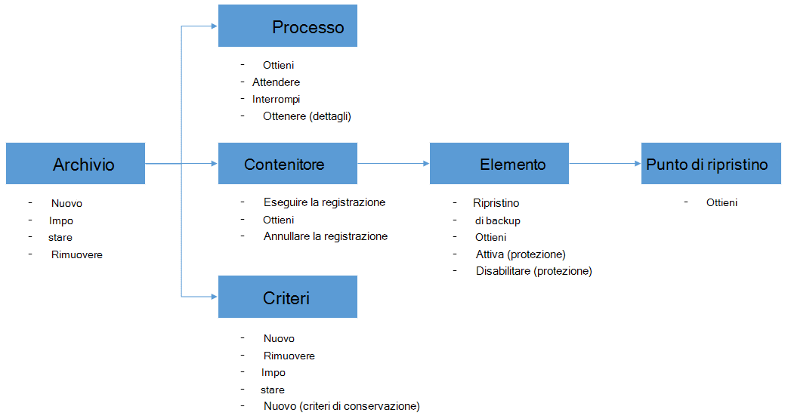

<properties
    pageTitle="Distribuire e gestire backup per macchine virtuali di Azure tramite PowerShell | Microsoft Azure"
    description="Informazioni su come distribuire e gestire Backup Azure tramite PowerShell"
    services="backup"
    documentationCenter=""
    authors="markgalioto"
    manager="cfreeman"
    editor=""/>

<tags
    ms.service="backup"
    ms.workload="storage-backup-recovery"
    ms.tgt_pltfrm="na"
    ms.devlang="na"
    ms.topic="article"
    ms.date="08/08/2016"
    ms.author="markgal;trinadhk;jimpark" />


# <a name="deploy-and-manage-backup-for-azure-vms-using-powershell"></a>Distribuire e gestire backup per macchine virtuali di Azure tramite PowerShell

> [AZURE.SELECTOR]
- [Manager delle risorse](backup-azure-vms-automation.md)
- [Classica](backup-azure-vms-classic-automation.md)

In questo articolo viene illustrato come utilizzare Azure PowerShell per eseguire il backup e ripristino delle macchine virtuali di Azure. Azure include due diversi modelli di distribuzione per la creazione e utilizzo delle risorse: gestione delle risorse e classica. In questo articolo è descritta utilizzando il modello di distribuzione classica. Si consiglia di più nuove distribuzioni di utilizzare il modello di Manager delle risorse.

## <a name="concepts"></a>Concetti


In questo articolo fornisce informazioni specifiche per i cmdlet di PowerShell utilizzati per eseguire il backup macchine virtuali. Per informazioni introduttive sulla protezione macchine virtuali di Azure, vedere [pianificare l'infrastruttura di backup macchine Virtuali Azure](backup-azure-vms-introduction.md).

> [AZURE.NOTE] Prima di iniziare, leggere i [Prerequisiti](backup-azure-vms-prepare.md) necessari per lavorare con Azure Backup e le [limitazioni](backup-azure-vms-prepare.md#limitations) della soluzione di backup macchine Virtuali corrente.

Per utilizzare in modo efficace PowerShell, richiedere alcuni minuti per comprendere la gerarchia di oggetti e da dove iniziare.



I due più importanti flussi sono abilitazione di protezione per una macchina virtuale e ripristinare dati da un punto di ripristino. Lo stato attivo di questo articolo è utile per acquisire familiarità utilizzare i cmdlet PowerShell per attivare i due scenari.


## <a name="setup-and-registration"></a>Installazione e la registrazione
Per iniziare:

1. [Scaricare PowerShell più recente](https://github.com/Azure/azure-powershell/releases) (versione minima necessaria è: 1.0.0)

2. Trovare i cmdlet di Azure Backup PowerShell disponibili digitando il comando seguente:

```
PS C:\> Get-Command *azurermbackup*

CommandType     Name                                               Version    Source
-----------     ----                                               -------    ------
Cmdlet          Backup-AzureRmBackupItem                           1.0.1      AzureRM.Backup
Cmdlet          Disable-AzureRmBackupProtection                    1.0.1      AzureRM.Backup
Cmdlet          Enable-AzureRmBackupContainerReregistration        1.0.1      AzureRM.Backup
Cmdlet          Enable-AzureRmBackupProtection                     1.0.1      AzureRM.Backup
Cmdlet          Get-AzureRmBackupContainer                         1.0.1      AzureRM.Backup
Cmdlet          Get-AzureRmBackupItem                              1.0.1      AzureRM.Backup
Cmdlet          Get-AzureRmBackupJob                               1.0.1      AzureRM.Backup
Cmdlet          Get-AzureRmBackupJobDetails                        1.0.1      AzureRM.Backup
Cmdlet          Get-AzureRmBackupProtectionPolicy                  1.0.1      AzureRM.Backup
Cmdlet          Get-AzureRmBackupRecoveryPoint                     1.0.1      AzureRM.Backup
Cmdlet          Get-AzureRmBackupVault                             1.0.1      AzureRM.Backup
Cmdlet          Get-AzureRmBackupVaultCredentials                  1.0.1      AzureRM.Backup
Cmdlet          New-AzureRmBackupProtectionPolicy                  1.0.1      AzureRM.Backup
Cmdlet          New-AzureRmBackupRetentionPolicyObject             1.0.1      AzureRM.Backup
Cmdlet          New-AzureRmBackupVault                             1.0.1      AzureRM.Backup
Cmdlet          Register-AzureRmBackupContainer                    1.0.1      AzureRM.Backup
Cmdlet          Remove-AzureRmBackupProtectionPolicy               1.0.1      AzureRM.Backup
Cmdlet          Remove-AzureRmBackupVault                          1.0.1      AzureRM.Backup
Cmdlet          Restore-AzureRmBackupItem                          1.0.1      AzureRM.Backup
Cmdlet          Set-AzureRmBackupProtectionPolicy                  1.0.1      AzureRM.Backup
Cmdlet          Set-AzureRmBackupVault                             1.0.1      AzureRM.Backup
Cmdlet          Stop-AzureRmBackupJob                              1.0.1      AzureRM.Backup
Cmdlet          Unregister-AzureRmBackupContainer                  1.0.1      AzureRM.Backup
Cmdlet          Wait-AzureRmBackupJob                              1.0.1      AzureRM.Backup
```

Con PowerShell, è possono automatizzare le attività di configurazione e la registrazione seguenti:

- Creare un archivio di backup
- Registrazione macchine virtuali con il servizio di Backup di Azure

### <a name="create-a-backup-vault"></a>Creare un archivio di backup

> [AZURE.WARNING] Se si utilizza il Backup di Azure per la prima volta, è necessario registrare il provider di Azure Backup da utilizzare con l'abbonamento. A tale scopo, eseguire il comando seguente: registro AzureRmResourceProvider - ProviderNamespace "Microsoft.Backup"

È possibile creare un nuovo archivio di backup utilizzando il cmdlet **New-AzureRmBackupVault** . Archivio di backup è una risorsa ARM, pertanto è necessario inserire all'interno di un gruppo di risorse. In una console di PowerShell Azure con privilegi elevata, eseguire i comandi seguenti:

```
PS C:\> New-AzureRmResourceGroup –Name “test-rg” –Location “West US”
PS C:\> $backupvault = New-AzureRmBackupVault –ResourceGroupName “test-rg” –Name “test-vault” –Region “West US” –Storage GeoRedundant
```

È possibile ottenere un elenco di tutti gli archivi di backup in un abbonamento specificato utilizzando il cmdlet **Get-AzureRmBackupVault** .

> [AZURE.NOTE] È utile memorizzare l'oggetto di archivio di backup in una variabile. L'oggetto archivio necessario come input per molti dei cmdlet di Azure Backup.


### <a name="registering-the-vms"></a>Registrazione macchine virtuali
Il primo passo per la configurazione di backup con Azure Backup consiste nel registrare il computer o macchine Virtuali di un archivio di Azure Backup. Il cmdlet **Registro AzureRmBackupContainer** accetta le informazioni di input di una macchina virtuale IaaS Azure e registra con l'archivio specificato. L'operazione register associa Azure macchina virtuale con l'archivio di backup e tiene traccia delle macchine Virtuali ciclo di vita backup.

Registrazione di una macchina virtuale con il servizio di Backup di Azure crea un oggetto contenitore di livello superiore. Un contenitore contiene in genere più elementi che è possono eseguire il backup, ma in caso di macchine virtuali si verificherà un solo elemento di backup per il contenitore.

```
PS C:\> $registerjob = Register-AzureRmBackupContainer -Vault $backupvault -Name "testvm" -ServiceName "testvm"
```

## <a name="backup-azure-vms"></a>Backup macchine virtuali di Azure

### <a name="create-a-protection-policy"></a>Creazione di un criterio di protezione
Non è necessario creare un nuovo criterio di protezione per avviare backup delle proprie macchine virtuali. L'archivio viene fornito con un 'criterio predefinito' che possono essere usati per attivare rapidamente la protezione e quindi modificato in un secondo momento con dei dettagli a destra. È possibile ottenere un elenco dei criteri disponibili nell'archivio di utilizzando il cmdlet **Get-AzureRmBackupProtectionPolicy** :

```
PS C:\> Get-AzureRmBackupProtectionPolicy -Vault $backupvault

Name                      Type               ScheduleType       BackupTime
----                      ----               ------------       ----------
DefaultPolicy             AzureVM            Daily              26-Aug-15 12:30:00 AM
```

> [AZURE.NOTE] Il fuso orario del campo BackupTime PowerShell sia l'ora UTC. Tuttavia, quando il tempo di backup viene visualizzato nel portale di Azure, il fuso orario viene allineato al sistema locale insieme fuso orario di riferimento.

Criteri di backup sono associato almeno un criterio di conservazione. I criteri di conservazione definiscono il periodo di tempo un punto di ripristino viene mantenuto con Azure Backup. Il cmdlet **New-AzureRmBackupRetentionPolicy** crea oggetti di PowerShell che contengono informazioni sui criteri di conservazione. Tali oggetti Criteri di conservazione vengono utilizzati come input al cmdlet *New-AzureRmBackupProtectionPolicy* oppure direttamente con il cmdlet *Enable-AzureRmBackupProtection* .

Criteri di backup definiscono quando e con quale frequenza il backup di un elemento è stato completato. Il cmdlet **New-AzureRmBackupProtectionPolicy** crea un oggetto di PowerShell che contiene informazioni sui criteri di backup. Criteri di backup viene utilizzato come input al cmdlet *Enable-AzureRmBackupProtection* .

```
PS C:\> $Daily = New-AzureRmBackupRetentionPolicyObject -DailyRetention -Retention 30
PS C:\> $newpolicy = New-AzureRmBackupProtectionPolicy -Name DailyBackup01 -Type AzureVM -Daily -BackupTime ([datetime]"3:30 PM") -RetentionPolicy $Daily -Vault $backupvault

Name                      Type               ScheduleType       BackupTime
----                      ----               ------------       ----------
DailyBackup01             AzureVM            Daily              01-Sep-15 3:30:00 PM
```

### <a name="enable-protection"></a>Attivare la protezione
Per consentire la protezione include due oggetti - l'elemento e i criteri e sia necessario in cui inserire lo stesso archivio. Una volta il criterio associato all'elemento, il flusso di lavoro backup verrà utilizzata pianificazione definito.

```
PS C:\> Get-AzureRmBackupContainer -Type AzureVM -Status Registered -Vault $backupvault | Get-AzureRmBackupItem | Enable-AzureRmBackupProtection -Policy $newpolicy
```

### <a name="initial-backup"></a>Backup iniziale
La pianificazione di backup farà eseguendo la copia iniziale completo per l'elemento e la copia incrementale per i backup successivi. Tuttavia, se si vuole forzare l'inizio del primo backup verificarsi in un determinato momento o persino immediatamente usare il cmdlet di **Backup AzureRmBackupItem** :

```
PS C:\> $container = Get-AzureRmBackupContainer -Vault $backupvault -Type AzureVM -Name "testvm"
PS C:\> $backupjob = Get-AzureRmBackupItem -Container $container | Backup-AzureRmBackupItem
PS C:\> $backupjob

WorkloadName    Operation       Status          StartTime              EndTime
------------    ---------       ------          ---------              -------
testvm          Backup          InProgress      01-Sep-15 12:24:01 PM  01-Jan-01 12:00:00 AM
```

> [AZURE.NOTE] Il fuso orario dei campi ora di inizio e fine nel PowerShell sia l'ora UTC. Tuttavia, quando vengono visualizzate le informazioni simili nel portale di Azure, il fuso orario è allineato all'orologio di sistema locale.

### <a name="monitoring-a-backup-job"></a>Monitoraggio di un processo di backup
La maggior parte delle operazioni di lunga backup Azure sono unificate come processo. Questo è semplice tenere traccia dello stato senza la necessità di mantenere il portale di Azure aperto in qualsiasi momento.

Per ottenere lo stato più recente di un processo in corso, utilizzare il cmdlet **Get-AzureRmBackupJob** .

```
PS C:\> $joblist = Get-AzureRmBackupJob -Vault $backupvault -Status InProgress
PS C:\> $joblist[0]

WorkloadName    Operation       Status          StartTime              EndTime
------------    ---------       ------          ---------              -------
testvm          Backup          InProgress      01-Sep-15 12:24:01 PM  01-Jan-01 12:00:00 AM
```

Invece di polling questi processi per il completamento, che è codice altre trasmissioni - è più semplice utilizzare il cmdlet **AzureRmBackupJob di attesa** . Se usata in uno script, il cmdlet verrà sospesa l'esecuzione fino al termine del processo o viene raggiunto il valore di timeout specificato.

```
PS C:\> Wait-AzureRmBackupJob -Job $joblist[0] -Timeout 43200
```


## <a name="restore-an-azure-vm"></a>Ripristinare una macchina virtuale Azure

Per ripristinare i dati di backup, è necessario identificare l'elemento di backup e il punto di ripristino che contiene i dati in un momento. Queste informazioni viene fornite per il cmdlet AzureRmBackupItem Ripristina per avviare un ripristino di dati dall'archivio di per conto del cliente.

### <a name="select-the-vm"></a>Selezionare la macchina virtuale

Per ottenere l'oggetto di PowerShell che identifica l'elemento a destra backup, è necessario iniziare dal contenitore nell'archivio di e il funzionamento verso il basso della gerarchia di oggetti. Per selezionare il contenitore che rappresenta la macchina virtuale, utilizzare il cmdlet **Get-AzureRmBackupContainer** e tubazioni che per il cmdlet **Get-AzureRmBackupItem** .

```
PS C:\> $backupitem = Get-AzureRmBackupContainer -Vault $backupvault -Type AzureVM -name "testvm" | Get-AzureRmBackupItem
```

### <a name="choose-a-recovery-point"></a>Scegliere un punto di ripristino

È ora possibile elencare tutti i punti di ripristino per l'elemento backup utilizzando il cmdlet **Get-AzureRmBackupRecoveryPoint** e scegliere il punto di ripristino per ripristinare. In genere utenti selezionare il punto di *AppConsistent* più recente nell'elenco.

```
PS C:\> $rp =  Get-AzureRmBackupRecoveryPoint -Item $backupitem
PS C:\> $rp

RecoveryPointId    RecoveryPointType  RecoveryPointTime      ContainerName
---------------    -----------------  -----------------      -------------
15273496567119     AppConsistent      01-Sep-15 12:27:38 PM  iaasvmcontainer;testvm;testv...
```

La variabile ```$rp``` è una matrice di punti di ripristino per il backup selezionato articolo, ordinati in ordine inverso di tempo - il punto di ripristino più recente è indice 0. Usare l'indicizzazione in forma di matrice di PowerShell standard per selezionare il punto di ripristino. Ad esempio: ```$rp[0]``` verrà selezionato il punto di ripristino più recente.

### <a name="restoring-disks"></a>Ripristino dischi

Esiste una differenza fondamentale tra le operazioni di ripristino eseguite tramite il portale di Azure e tramite PowerShell Azure. Con PowerShell, l'operazione di ripristino ferma ripristino del dischi e le informazioni di configurazione del punto di ripristino. Non crea una macchina virtuale.

> [AZURE.WARNING] Il ripristino AzureRmBackupItem non viene creata una macchina virtuale. Solo Ripristina dischi l'account di archiviazione specificato. Questa non è lo stesso comportamento che si verificheranno nel portale di Azure.

```
PS C:\> $restorejob = Restore-AzureRmBackupItem -StorageAccountName "DestAccount" -RecoveryPoint $rp[0]
PS C:\> $restorejob

WorkloadName    Operation       Status          StartTime              EndTime
------------    ---------       ------          ---------              -------
testvm          Restore         InProgress      01-Sep-15 1:14:01 PM   01-Jan-01 12:00:00 AM
```

È possibile ottenere i dettagli dell'operazione di ripristino utilizzando il cmdlet **Get-AzureRmBackupJobDetails** una volta completato il processo di ripristino. La proprietà *ErrorDetails* avrà le informazioni necessarie per ricreare la macchina virtuale.

```
PS C:\> $restorejob = Get-AzureRmBackupJob -Job $restorejob
PS C:\> $details = Get-AzureRmBackupJobDetails -Job $restorejob
```

### <a name="build-the-vm"></a>Creare la macchina virtuale

Creazione di macchine Virtuali fuori dischi ripristinati può essere gestita utilizzando i cmdlet di PowerShell di gestione dei servizi di Azure precedenti, i nuovi modelli di Manager delle risorse di Azure, anche tramite il portale di Azure. In un rapido esempio, ecco come raggiungerlo utilizzando i cmdlet di gestione dei servizi di Azure.

```
 $properties  = $details.Properties

 $storageAccountName = $properties["Target Storage Account Name"]
 $containerName = $properties["Config Blob Container Name"]
 $blobName = $properties["Config Blob Name"]

 $keys = Get-AzureStorageKey -StorageAccountName $storageAccountName
 $storageAccountKey = $keys.Primary
 $storageContext = New-AzureStorageContext -StorageAccountName $storageAccountName -StorageAccountKey $storageAccountKey


 $destination_path = "C:\Users\admin\Desktop\vmconfig.xml"
 Get-AzureStorageBlobContent -Container $containerName -Blob $blobName -Destination $destination_path -Context $storageContext


$obj = [xml](((Get-Content -Path $destination_path -Encoding UniCode)).TrimEnd([char]0x00))
 $pvr = $obj.PersistentVMRole
 $os = $pvr.OSVirtualHardDisk
 $dds = $pvr.DataVirtualHardDisks
 $osDisk = Add-AzureDisk -MediaLocation $os.MediaLink -OS $os.OS -DiskName "panbhaosdisk"
 $vm = New-AzureVMConfig -Name $pvr.RoleName -InstanceSize $pvr.RoleSize -DiskName $osDisk.DiskName

 if (!($dds -eq $null))
 {
     foreach($d in $dds.DataVirtualHardDisk)
     {
         $lun = 0
         if(!($d.Lun -eq $null))
         {
             $lun = $d.Lun
         }
         $name = "panbhadataDisk" + $lun
     Add-AzureDisk -DiskName $name -MediaLocation $d.MediaLink
     $vm | Add-AzureDataDisk -Import -DiskName $name -LUN $lun
    }
}

New-AzureVM -ServiceName "panbhasample" -Location "SouthEast Asia" -VM $vm
```

Per ulteriori informazioni su come creare una macchina virtuale da dischi ripristinati, consultare i cmdlet seguenti:

- [Aggiungere AzureDisk](https://msdn.microsoft.com/library/azure/dn495252.aspx)
- [Nuovo AzureVMConfig](https://msdn.microsoft.com/library/azure/dn495159.aspx)
- [Nuovo AzureVM](https://msdn.microsoft.com/library/azure/dn495254.aspx)

## <a name="code-samples"></a>Esempi di codice

### <a name="1-get-the-completion-status-of-job-sub-tasks"></a>1. ottenere lo stato di completamento delle attività di processo secondario

Per verificare lo stato di completamento delle singole sottoattività, è possibile utilizzare il cmdlet **Get-AzureRmBackupJobDetails** :

```
PS C:\> $details = Get-AzureRmBackupJobDetails -JobId $backupjob.InstanceId -Vault $backupvault
PS C:\> $details.SubTasks

Name                                                        Status
----                                                        ------
Take Snapshot                                               Completed
Transfer data to Backup vault                               InProgress
```

### <a name="2-create-a-dailyweekly-report-of-backup-jobs"></a>2. creare un report giornaliera o settimanale dei processi di backup

Gli amministratori che in genere sapere quali processi di backup è stato eseguito nelle ultime 24 ore, lo stato di tali processi di backup. Inoltre, la quantità di dati trasferiti consente agli amministratori per stimare mensile all'uso dei dati. Lo script seguente recupera i dati non elaborati dal servizio di Backup di Azure e vengono visualizzate le informazioni nella console di PowerShell.

```
param(  [Parameter(Mandatory=$True,Position=1)]
        [string]$backupvaultname,

        [Parameter(Mandatory=$False,Position=2)]
        [int]$numberofdays = 7)


#Initialize variables
$DAILYBACKUPSTATS = @()
$backupvault = Get-AzureRmBackupVault -Name $backupvaultname
$enddate = ([datetime]::Today).AddDays(1)
$startdate = ([datetime]::Today)

for( $i = 1; $i -le $numberofdays; $i++ )
{
    # We query one day at a time because pulling 7 days of data might be too much
    $dailyjoblist = Get-AzureRmBackupJob -Vault $backupvault -From $startdate -To $enddate -Type AzureVM -Operation Backup
    Write-Progress -Activity "Getting job information for the last $numberofdays days" -Status "Day -$i" -PercentComplete ([int]([decimal]$i*100/$numberofdays))

    foreach( $job in $dailyjoblist )
    {
        #Extract the information for the reports
        $newstatsobj = New-Object System.Object
        $newstatsobj | Add-Member -Type NoteProperty -Name Date -Value $startdate
        $newstatsobj | Add-Member -Type NoteProperty -Name VMName -Value $job.WorkloadName
        $newstatsobj | Add-Member -Type NoteProperty -Name Duration -Value $job.Duration
        $newstatsobj | Add-Member -Type NoteProperty -Name Status -Value $job.Status

        $details = Get-AzureRmBackupJobDetails -Job $job
        $newstatsobj | Add-Member -Type NoteProperty -Name BackupSize -Value $details.Properties["Backup Size"]
        $DAILYBACKUPSTATS += $newstatsobj
    }

    $enddate = $enddate.AddDays(-1)
    $startdate = $startdate.AddDays(-1)
}

$DAILYBACKUPSTATS | Out-GridView
```

Se si desidera aggiungere funzionalità di creazione di grafici a questo rapporto, imparare dai post di blog TechNet [grafici con PowerShell](http://blogs.technet.com/b/richard_macdonald/archive/2009/04/28/3231887.aspx)

## <a name="next-steps"></a>Passaggi successivi

Se si preferisce usare PowerShell per comunicare le risorse Azure, consultare l'articolo di PowerShell per la protezione di Windows Server, [distribuzione e gestione di Backup per Windows Server](./backup-client-automation-classic.md). È inoltre disponibile un articolo di PowerShell per la gestione di backup di Data Protection Manager, [distribuzione e gestione di Backup per Data Protection Manager](./backup-dpm-automation-classic.md). Entrambi gli articoli installata una versione per distribuzioni Manager delle risorse, nonché distribuzioni classica.
