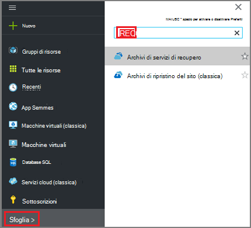
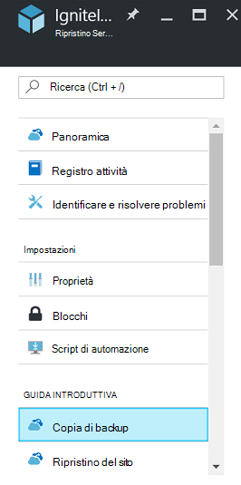
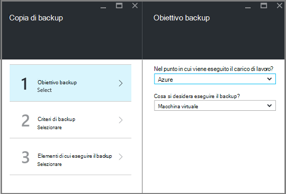
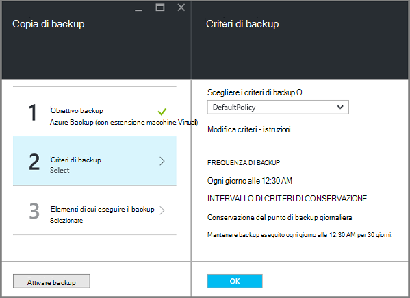
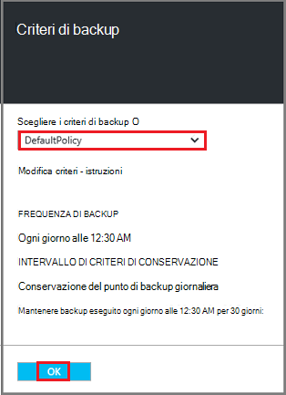
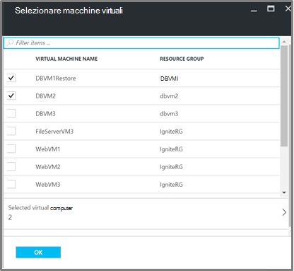
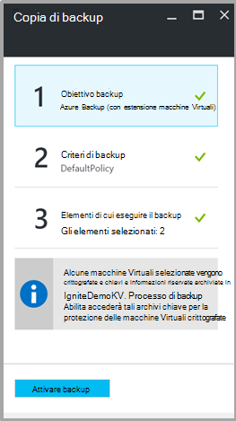

<properties
   pageTitle="Eseguire il backup e ripristino crittografata macchine virtuali con una copia di Backup di Azure"
   description="In questo articolo parla il backup e ripristino esperienza per macchine virtuali crittografati Usa la crittografia disco Azure."
   services="backup"
   documentationCenter=""
   authors="JPallavi"
   manager="vijayts"
   editor=""/>
<tags
   ms.service="backup"
   ms.devlang="na"
   ms.topic="article"
   ms.tgt_pltfrm="na"
   ms.workload="storage-backup-recovery"
   ms.date="10/25/2016"
   ms.author="markgal; jimpark; trinadhk"/>

# Eseguire il backup e ripristino crittografata macchine virtuali con una copia di Backup di Azure

In questo articolo illustra i passaggi da eseguire il backup e ripristino macchine virtuali con Azure Backup. Inoltre, sono disponibili dettagli sugli scenari supportati, prerequisiti e risoluzione dei problemi per i casi di errore.

## Scenari supportati

> [AZURE.NOTE]
1.  Eseguire il backup e ripristino delle macchine virtuali crittografate è supportata solo per macchine virtuali di gestione risorse distribuito. Non è supportata per macchine virtuali classica.  
2.  Questa caratteristica è supportata solo per macchine virtuali crittografate con una chiave di crittografia BitLocker e chiave di crittografia. Non è supportata per macchine virtuali crittografate con solo una chiave di crittografia BitLocker.  

## Prerequisiti

1.  Macchina virtuale è stato protetto mediante [La crittografia del Azure](../security/azure-security-disk-encryption.md). Crittografato tramite chiave di crittografia BitLocker e chiave di crittografia.
2.  Archivio di servizi di recupero è stato creato e replica di spazio di archiviazione impostata attenendosi alla procedura indicata nell'articolo [preparare l'ambiente per il backup](backup-azure-arm-vms-prepare.md).

## Copia di backup crittografati macchine Virtuali
Utilizzare la procedura seguente per impostare backup obiettivo, definire i criteri, configurare gli elementi e backup trigger.

### Configurare il backup

1. Se è già aperto un archivio di servizi di recupero, procedere al passaggio successivo. Se si dispone di un servizio di recupero archivio aperta, ma sono nel portale di Azure, nel menu Hub fare clic su **Sfoglia**.

  - Nell'elenco delle risorse, digitare **I servizi di recupero**.
  - Quando si inizia a digitare, i filtri di elenco in base all'input. Quando viene visualizzato **archivi di servizi di recupero**, fare clic su esso.
  
        

    Viene visualizzato l'elenco degli archivi di servizi di recupero. Nell'elenco di servizi di recupero archivi, selezionare un archivio.

    Verrà visualizzata nel dashboard di archivio selezionato.

2. Dall'elenco di elementi che appare in archivio, fare clic su **copia di Backup** per aprire e il Backup.

       
    
3. Scegliere l' **obiettivo di Backup** per aprire e l'obiettivo di Backup e il Backup.

       
    
4.   In e il Backup obiettivo impostato **nel punto in cui è il carico di lavoro in esecuzione** su Azure e **cosa si desidera eseguire il backup** a macchina virtuale, quindi fare clic su **OK**.

    Viene chiusa e l'obiettivo di Backup e viene aperta e il criterio di Backup.

       

5. Scegliere i criteri di backup che si desidera applicare all'archivio e fare clic su **OK**e il criterio Backup.

       

    I dettagli dei criteri predefiniti sono elencati i dettagli. Se si desidera creare un criterio, selezionare **Crea nuovo** dal menu a discesa. Dopo aver fatto clic su **OK**, criteri di backup sono associato l'archivio.

    Scegliere Avanti macchine virtuali da associare l'archivio.
    
6. Scegliere le macchine virtuali crittografate per associare il criterio specificato e fare clic su **OK**.

      
   
7. Questa pagina viene visualizzato un messaggio relativo alla chiave archivio associato alle macchine virtuali crittografate selezionate. Servizio di backup richiede l'accesso in sola lettura per le chiavi e informazioni riservate nell'archivio di chiave. Utilizza le autorizzazioni per la chiave di backup e segreto insieme associate macchine virtuali. 

      

      Dopo avere definito tutte le impostazioni per l'archivio in e il Backup, fare clic su Abilita copia di Backup nella parte inferiore della pagina. Abilita il Backup distribuisce i criteri per l'archivio e macchine virtuali.

8. La fase successiva in preparazione installa l'agente di macchine Virtuali o accertarsi che l'agente di macchine Virtuali è installato. Per eseguire la stessa operazione, utilizzare la procedura indicata nell'articolo [preparare l'ambiente per il backup](backup-azure-arm-vms-prepare.md). 

### Attivazione di processo di backup
Seguire la procedura indicata nell'articolo [Backup macchine virtuali di Azure all'archivio di servizi di recupero](backup-azure-arm-vms.md) del processo di backup trigger.

## Ripristinare macchine Virtuali crittografato
Esperienza di ripristino per macchine virtuali crittografate e non crittografato è la stessa. Utilizzare la procedura indicata nel [ripristinare macchine virtuali nel portale di Azure](backup-azure-arm-restore-vms.md) per ripristinare la macchina virtuale crittografata. Nel caso in cui è necessario ripristinare chiavi e informazioni riservate, è necessario assicurarsi che archivio chiave per poterli ripristinare in deve esistere.

## Risoluzione degli errori

| Operazione | Dettagli sull'errore | Risoluzione |
| -------- | -------- | -------|
| Copia di backup | Convalida non riuscita durante la macchina virtuale è crittografato con BEK da soli. Backup possono essere abilitati solo per macchine virtuali crittografate con BEK e KEK. | Macchina virtuale dovrebbero essere crittografato utilizzando BEK e KEK. In seguito, è necessario attivare backup. |
| Ripristinare | Poiché non esiste alcun archivio chiave associato a questa macchina virtuale non è possibile ripristinare questa macchina virtuale crittografata. | Creare un archivio chiave usando [l'Introduzione Azure chiave archivio](../key-vault/key-vault-get-started.md). Vedere l'articolo [ripristinare chiave archivio chiave e segreto utilizzo del Backup Azure](backup-azure-restore-key-secret.md) ripristinare chiave e segreto se non sono presenti. |
| Ripristinare | Dal momento che non sono presenti chiave e segreto associato a questa macchina virtuale non è possibile ripristinare questa macchina virtuale crittografata. | Vedere l'articolo [ripristinare chiave archivio chiave e segreto utilizzo del Backup Azure](backup-azure-restore-key-secret.md) ripristinare chiave e segreto se non sono presenti. |
