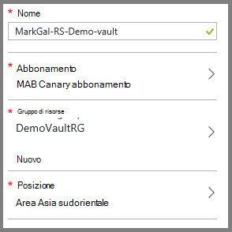
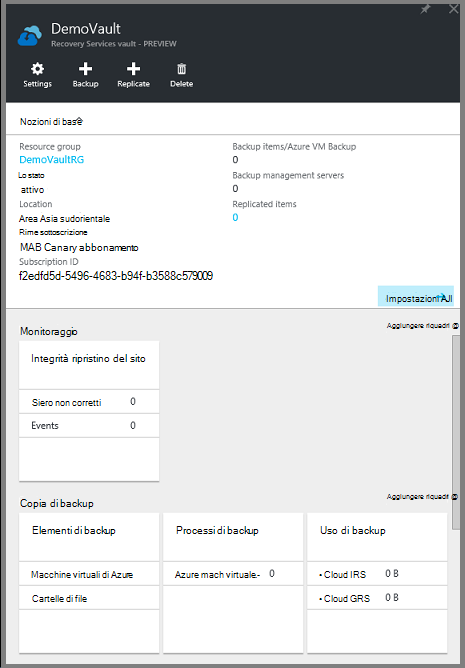

<properties
    pageTitle="Prima di tutto: proteggere macchine virtuali di Azure con un archivio di servizi di recupero | Microsoft Azure"
    description="Proteggere macchine virtuali di Azure a un archivio di servizi di recupero. Utilizzare backup di macchine virtuali distribuito Manager delle risorse, macchine virtuali distribuito classica e macchine virtuali di spazio di archiviazione Premium per proteggere i dati. Creare e registrare un archivio di servizi di recupero. Registrare macchine virtuali, creare criteri e proteggere macchine virtuali di Azure."
    services="backup"
    documentationCenter=""
    authors="markgalioto"
    manager="cfreeman"
    editor=""
    keyword="backups; vm backup"/>

<tags
    ms.service="backup"
    ms.workload="storage-backup-recovery"
    ms.tgt_pltfrm="na"
    ms.devlang="na"
    ms.topic="hero-article"
    ms.date="10/13/2016"
    ms.author="markgal; jimpark"/>

# Prima di tutto: proteggere macchine virtuali di Azure con un archivio di servizi di recupero

> [AZURE.SELECTOR]
- [Proteggere macchine virtuali a un archivio di servizi di recupero](backup-azure-vms-first-look-arm.md)
- [Proteggere macchine virtuali con un archivio di backup](backup-azure-vms-first-look.md)

In questa esercitazione illustra i passaggi per la creazione di un archivio di servizi di recupero e backup di una Azure macchine (). Proteggere gli archivi di servizi di recupero:

- Azure macchine virtuali distribuito Manager delle risorse
- Macchine virtuali classiche
- Spazio di archiviazione standard macchine virtuali
- Spazio di archiviazione Premium macchine virtuali
- Macchine virtuali crittografate tramite crittografia disco di Azure, con BEK e KEK

Per ulteriori informazioni sulla protezione archiviazione Premium macchine virtuali, vedere [eseguire il backup e ripristino macchine virtuali di spazio di archiviazione Premium](backup-introduction-to-azure-backup.md#back-up-and-restore-premium-storage-vms)

>[AZURE.NOTE] In questa esercitazione si presuppone che si dispone già di una macchina virtuale nell'abbonamento Azure e che sono stati misure per consentire il servizio di backup accedere a macchina virtuale.

[AZURE.INCLUDE [learn-about-Azure-Backup-deployment-models](../../includes/backup-deployment-models.md)]

Un alto livello, ecco i passaggi da completare.  

1. Creare un archivio di servizi di recupero per una macchina virtuale.
2. Usare il portale di Azure per selezionare uno Scenario, impostare i criteri e identificare gli elementi per la protezione.
3. Eseguire il backup iniziale.

## Creare un archivio di servizi di recupero per una macchina virtuale

Un archivio di servizi di recupero è un'entità contenente tutti i backup e i punti di ripristino creato nel tempo. Archivio di servizi di recupero contiene anche i criteri di backup applicati alle macchine virtuali protette.

>[AZURE.NOTE] Backup delle macchine virtuali è un processo locale. È possibile eseguire il backup macchine virtuali da una posizione in un archivio di servizi di recupero in un'altra posizione. Pertanto, per ogni posizione di Azure con macchine virtuali eseguire il backup, ripristino almeno un archivio di servizi deve essere presente in quella posizione.

Per creare un archivio di servizi di recupero:

1. Accedere al [portale di Azure](https://portal.azure.com/).

2. Nel menu Hub fare clic su **Sfoglia** e nell'elenco delle risorse, digitare **I servizi di recupero**. Quando si inizia a digitare, i filtri di elenco in base all'input. Fare clic su **archivio di servizi di recupero**.

      

    L'elenco degli archivi di servizi di recupero.

3. Nel menu **archivi di servizi di recupero** , fare clic su **Aggiungi**.

    

    Verrà visualizzata e l'archivio servizi di recupero che richiede di specificare un **nome**, **l'abbonamento**, **gruppo di risorse**e **posizione**.

    

4. Per **nome**immettere un nome descrittivo per identificare l'archivio. Il nome deve essere univoco per la sottoscrizione Azure. Digitare un nome che contiene da 2 a 50 caratteri. Deve iniziare con una lettera e possono contenere solo lettere, numeri e trattini.

5. Fare clic su **sottoscrizione** per visualizzare l'elenco delle sottoscrizioni disponibile. Se non si è certi di quale abbonamento da usare, usare il valore predefinito (o suggeriti) abbonamento. Sono disponibili più opzioni solo se l'account aziendale è associata a più abbonamenti Azure.

6. Fare clic su **gruppo di risorse** per visualizzare l'elenco dei gruppi di risorse disponibile oppure fare clic su **Nuovo** per creare un gruppo di risorse. Per informazioni complete sui gruppi di risorse, vedere [Panoramica di gestione risorse di Azure](../azure-resource-manager/resource-group-overview.md)

7. Fare clic su **posizione** per selezionare la località geografica per l'archivio. L' archivio **deve** essere nella stessa regione le macchine virtuali che si desidera proteggere.

    >[AZURE.IMPORTANT] Se si conosce la posizione in cui si trova la macchina virtuale, chiudere la finestra di dialogo Creazione archivio e passare all'elenco di macchine virtuali nel portale. Se si dispone macchine virtuali in più aree, creare un archivio di servizi di recupero in ogni area. Creare l'archivio in prima posizione prima di passare alla posizione successiva. Non è necessario specificare gli account di archiviazione per archiviare i dati di backup, ossia l'archivio di servizi di recupero e il servizio di Azure Backup lo gestisca automaticamente.

8. Fare clic su **Crea**. Può richiedere un po' di tempo per l'archivio di servizi di recupero da creare. Eseguire il monitoraggio delle notifiche sullo stato nell'area superiore destro nel portale. Dopo aver creato l'archivio, viene visualizzato nell'elenco degli archivi di servizi di recupero.

    

Dopo aver creato l'archivio, informazioni su come impostare la replica di spazio di archiviazione.

### Impostare la replica di spazio di archiviazione

L'opzione di replica di spazio di archiviazione consente di scegliere tra lo spazio di archiviazione ridondanti geografico e lo spazio di archiviazione ridondante in locale. Per impostazione predefinita, l'archivio dispone di spazio di archiviazione ridondanti geografico. Lasciare l'opzione impostata per lo spazio di archiviazione ridondanti geografico se si tratta di backup principale. Scegliere lo spazio di archiviazione in locale ridondante se si desidera un'opzione economica non come permanente. Per saperne di più sui [geografico ridondanti](../storage/storage-redundancy.md#geo-redundant-storage) e opzioni relative all'archiviazione [localmente ridondanti](../storage/storage-redundancy.md#locally-redundant-storage) nella [Panoramica della replica di archiviazione Azure](../storage/storage-redundancy.md).

Per modificare l'impostazione di replica di spazio di archiviazione:

1. Selezionare l'insieme di credenziali per aprire il dashboard di archivio ed e l'impostazioni. Se non si apre e **l'Impostazioni** , fare clic su **tutte le impostazioni** del dashboard di archivio di.

2. Scegliere **Dell'infrastruttura di Backup**e **l'Impostazioni**  > **Configurazione di Backup** per aprire e il **Backup configurazione** . Scegliere l'opzione di replica di spazio di archiviazione per l'archivio e il **Backup configurazione** .

    

    Dopo aver selezionato l'opzione di spazio di archiviazione per l'archivio, si è pronti associare la macchina virtuale nell'archivio. Per iniziare l'associazione, si deve individuare e registrare le macchine virtuali Azure.

## Selezionare un obiettivo backup, impostare i criteri e definire gli elementi per la protezione

Prima di registrare una macchina virtuale a un archivio, eseguire il processo di rilevamento per assicurarsi che le nuove macchine virtuali che sono stati aggiunti alla sottoscrizione identificate. Le query di processo Azure per l'elenco di macchine virtuali in abbonamento, insieme a ulteriori informazioni, ad esempio il nome del servizio cloud e l'area geografica. Nel portale di Azure scenario si riferisce a cosa si intende inserire l'archivio di servizi di recupero. Criteri sono la programmazione con quale frequenza e quando i punti di ripristino sono estratti. Criteri includono anche l'intervallo di criteri di conservazione per i punti di ripristino.

1. Se si dispone già di un servizio di recupero aprire archivio, procedere al passaggio 2. Se non si dispone di un ripristino servizi archivio aperta, ma sono nel portale di Azure, nel menu Hub fare clic su **Sfoglia**.

  - Nell'elenco delle risorse, digitare **I servizi di recupero**.
  - Quando si inizia a digitare, i filtri di elenco in base all'input. Quando viene visualizzato **archivi di servizi di recupero**, fare clic su esso.

      

    Viene visualizzato l'elenco degli archivi di servizi di recupero.
  - Nell'elenco degli archivi di servizi di recupero, selezionare un archivio.

    Verrà visualizzata nel dashboard di archivio selezionato.

    

2. Dal menu archivio dashboard, fare clic su **copia di Backup** per aprire e il Backup.

    

    Quando si apre e il, il servizio di Backup cerca eventuali nuove macchine virtuali nella sottoscrizione.

    

3. Scegliere l' **obiettivo di Backup** per aprire e l'obiettivo di Backup e il Backup.

    

4. In e il Backup obiettivo impostato **nel punto in cui è il carico di lavoro in esecuzione** su Azure e **cosa si desidera eseguire il backup** a macchina virtuale, quindi fare clic su **OK**.

    Viene chiusa e l'obiettivo di Backup e viene aperta e il criterio di Backup.

    

5. Scegliere i criteri di backup che si desidera applicare all'archivio e fare clic su **OK**e il criterio Backup.

    

    I dettagli dei criteri predefiniti sono elencati i dettagli. Se si desidera creare un criterio, selezionare **Crea nuovo** dal menu a discesa. Menu a discesa vengono forniti anche un'opzione per impostare il tempo quando l'istantanea, alle 19: 00. Per istruzioni sulla definizione di un criterio di backup, vedere [definizione dei criteri di backup](backup-azure-vms-first-look-arm.md#defining-a-backup-policy). Dopo aver fatto clic su **OK**, criteri di backup sono associato l'archivio.

    Scegliere Avanti macchine virtuali da associare l'archivio.

6. Scegliere le macchine virtuali per associare il criterio specificato e fare clic su **Seleziona**.

    

    Se la macchina virtuale desiderata non è disponibile, verificare che si trovi nella stessa posizione Azure archivio di servizi di recupero.

7. Dopo avere definito tutte le impostazioni per l'archivio in e il Backup, fare clic su **Abilita copia di Backup** nella parte inferiore della pagina. Consente di distribuire i criteri per l'archivio e macchine virtuali.

    

## Backup iniziale

Dopo la distribuzione di un criterio di backup del computer virtuale, che non significa che i dati sono stato eseguito il backup. Per impostazione predefinita, il primo backup pianificato (come definito nei criteri di backup) è il backup iniziale. Fino a quando non viene eseguito il backup iniziale, come **avviso (backup iniziale in sospeso)**viene visualizzato lo stato di Backup ultimo su e il **Processi di Backup** .

A meno che il backup iniziale è dovuto alla prima di iniziare, è consigliabile eseguire **il backup ora**.

Per eseguire **il backup ora**:

1. Nel dashboard di archivio sul riquadro di **Backup** , fare clic su **macchine virtuali di Azure**  
    

    Verrà visualizzata e il **Backup elementi** .

2. Scegliere e il **Backup elementi** rapida archivio che si desidera eseguire il backup e fare clic su **Esegui Backup**.

    

    Il processo di Backup viene attivato.  

    

3. Per visualizzare il backup iniziale completamento, nel dashboard di archivio sul riquadro **Processi di Backup** , fare clic su **macchine virtuali di Azure**.

    

    Verrà visualizzata e il processi di Backup.

4. In e il processi di Backup, è possibile visualizzare lo stato di tutti i processi.

    

    >[AZURE.NOTE] Come parte dell'operazione di backup, il servizio di Azure Backup invia un comando all'articolo estensione backup in ogni macchina virtuale per svuotare tutte le operazioni scrittura e creare uno snapshot coerenza.

    Al termine del processo di backup, lo stato è *completato*.

[AZURE.INCLUDE [backup-create-backup-policy-for-vm](../../includes/backup-create-backup-policy-for-vm.md)]

## Installare l'agente di macchine Virtuali nella macchina virtuale

Queste informazioni vengono fornite nel caso in cui è necessaria. Agente di macchine Virtuali di Azure deve essere installato Azure virtual machine per l'estensione di Backup per l'uso. Tuttavia, se la macchina virtuale è stata creata dalla raccolta di Azure, quindi l'agente di macchine Virtuali è già presenta nel computer virtuale. Macchine virtuali che vengono eseguita la migrazione da Data Center locale agente di macchine Virtuali non sarebbe installati. In questo caso, l'agente di macchine Virtuali deve essere installato. Se si verificano problemi backup la macchina virtuale Azure, verificare che l'agente di macchine Virtuali di Azure sia correttamente installato sul computer virtuale (vedere la tabella riportata di seguito). Se si crea una macchina virtuale personalizzata, [Assicurarsi che sia selezionata la casella di controllo **installare l'agente di macchine Virtuali** ](../virtual-machines/virtual-machines-windows-classic-agents-and-extensions.md) prima la macchina virtuale viene eseguito il provisioning.

Informazioni sulle [Macchine Virtuali agente](https://go.microsoft.com/fwLink/?LinkID=390493&clcid=0x409) e [come installarlo](../virtual-machines/virtual-machines-windows-classic-manage-extensions.md).

La tabella seguente contiene informazioni aggiuntive sui macchine Virtuali agente di Windows e macchine virtuali Linux.

| **Operazione** | **Windows** | **Linux** |
| --- | --- | --- |
| Installazione dell'agente di macchine Virtuali | <li>Scaricare e installare l' [agente MSI](http://go.microsoft.com/fwlink/?LinkID=394789&clcid=0x409). È necessario privilegi di amministratore per completare l'installazione. <li>[Aggiornare la proprietà macchine Virtuali](http://blogs.msdn.com/b/mast/archive/2014/04/08/install-the-vm-agent-on-an-existing-azure-vm.aspx) per indicare che l'agente è installato. | <li> Installare l' ultima [agenti Linux](https://github.com/Azure/WALinuxAgent) da GitHub. È necessario privilegi di amministratore per completare l'installazione. <li> [Aggiornare la proprietà macchine Virtuali](http://blogs.msdn.com/b/mast/archive/2014/04/08/install-the-vm-agent-on-an-existing-azure-vm.aspx) per indicare che l'agente è installato. |
| Agente di macchine Virtuali di aggiornamento | Agente di macchine Virtuali l'aggiornamento è semplice come reinstallare i [file binari agente macchine Virtuali](http://go.microsoft.com/fwlink/?LinkID=394789&clcid=0x409).  Assicurarsi che nessuna operazione di backup venga eseguito durante l'aggiornamento dell'agente di macchine Virtuali. | Seguire le istruzioni [sull'aggiornamento dell'agente di macchine Virtuali Linux ](../virtual-machines-linux-update-agent.md).  Assicurarsi che nessuna operazione di backup venga eseguito durante l'aggiornamento dell'agente di macchine Virtuali. |
| Convalidare l'installazione dell'agente di macchine Virtuali | <li>Passare alla cartella *C:\WindowsAzure\Packages* nella macchina virtuale Azure. <li>È necessario trovare il file WaAppAgent.exe presenta.<li> Pulsante destro del mouse sul file, passare a **proprietà**e quindi selezionare la scheda **Dettagli** . Il campo versione del prodotto deve essere 2.6.1198.718 o versione successiva. | N/D |

### Estensione di backup

Dopo aver installato l'agente di macchine Virtuali nella macchina virtuale, il servizio di Azure Backup installa l'estensione di backup in agente di macchine Virtuali. Servizio di Azure Backup diretta Aggiorna e corregge l'estensione backup senza l'intervento di altro utente.

L'estensione backup viene installato per il servizio di Backup se la macchina virtuale è in esecuzione. Una macchina virtuale in esecuzione offre la massima probabilità di ottenere un punto di ripristino applicazione coerente. Tuttavia, il servizio di Backup di Azure continua eseguire il backup della macchina virtuale anche se è stato disattivato e non è stato installato l'estensione. Tale valore è noto come Offline macchine Virtuali. In questo caso, il punto di ripristino sarà *un arresto anomalo coerente*.

## Informazioni sulla risoluzione dei problemi
Se si sono verificati problemi eseguire alcune operazioni in questo articolo, consultare le [indicazioni per la risoluzione dei problemi](backup-azure-vms-troubleshoot.md).

## Prezzi
Azure backup macchine Virtuali verranno addebitati in base al modello istanze protetto. Altre informazioni sui [Prezzi di Backup](https://azure.microsoft.com/pricing/details/backup/)

## Domande?
In caso di dubbi o qualsiasi funzione che si vuole vedere inclusi, [inviare un feedback](http://aka.ms/azurebackup_feedback).
