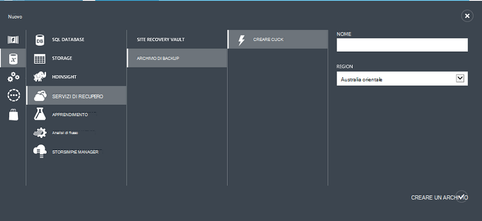
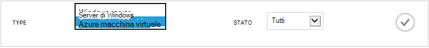
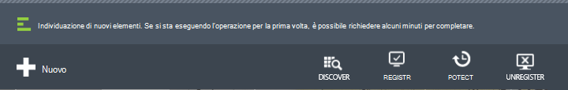
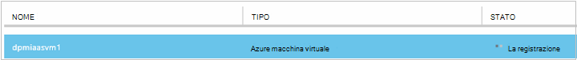
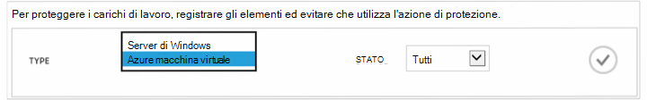
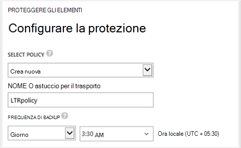
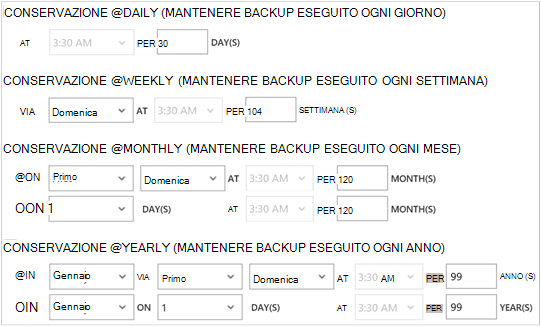
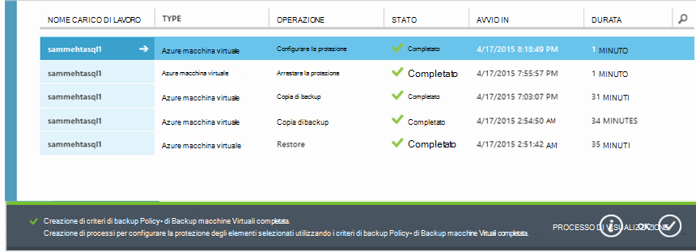

<properties
    pageTitle="Introduzione: Proteggere macchine virtuali di Azure con un archivio di backup | Microsoft Azure"
    description="Proteggere macchine virtuali di Azure con archivio di Backup. Esercitazione viene illustrato come creare un archivio, eseguire la registrazione macchine virtuali, creare criteri e proteggere macchine virtuali di Azure."
    services="backup"
    documentationCenter=""
    authors="markgalioto"
    manager="cfreeman"
    editor=""/>

<tags
    ms.service="backup"
    ms.workload="storage-backup-recovery"
    ms.tgt_pltfrm="na"
    ms.devlang="na"
    ms.topic="hero-article"
    ms.date="09/15/2016"
    ms.author="markgal; jimpark"/>

# Prima di tutto: backup macchine virtuali di Azure

> [AZURE.SELECTOR]
- [Proteggere macchine virtuali a un archivio di servizi di recupero](backup-azure-vms-first-look-arm.md)
- [Proteggere macchine virtuali di Azure con un archivio di backup](backup-azure-vms-first-look.md)

In questa esercitazione illustra i passaggi per il backup di una Azure macchine () in un archivio di backup in Azure. Questo articolo descrive il modello classico o il modello di distribuzione Service Manager, per il backup macchine virtuali. Se si desidera eseguire il backup di una macchina virtuale in un archivio di servizi di recupero appartenente a un gruppo di risorse, vedere [prima di tutto: proteggere macchine virtuali con un archivio di servizi di recupero](backup-azure-vms-first-look-arm.md). Per completare correttamente questa esercitazione, è necessario che i prerequisiti:

- È stata creata una macchina virtuale nell'abbonamento Azure.
- La macchina virtuale è connettività a indirizzi IP pubblici Azure. Per ulteriori informazioni, vedere [la connettività di rete](./backup-azure-vms-prepare.md#network-connectivity).

Per eseguire il backup una macchina virtuale, sono disponibili cinque passaggi principali:  

 creare un archivio di backup oppure identificare un archivio di backup esistente.  
 usare il portale di Azure classico per individuare e registrare le macchine virtuali.  
 installare l'agente di macchine Virtuali.  
 creare i criteri per la protezione delle macchine virtuali.  
 eseguire il backup.

>[AZURE.NOTE] Azure include due modelli di distribuzione per la creazione e utilizzo delle risorse: [Gestione risorse e classica](../resource-manager-deployment-model.md). In questa esercitazione è per uso con macchine virtuali che possono essere creati nel portale di Azure classica. Il servizio di Backup di Azure supporta macchine virtuali basate su Manager delle risorse. Per informazioni dettagliate sul backup macchine virtuali in un archivio di servizi di recupero, vedere [aspetto prima: proteggere macchine virtuali con un archivio di servizi di recupero](backup-azure-vms-first-look-arm.md).

## Passaggio 1 - creare un archivio di backup per una macchina virtuale

Un archivio di backup è un'entità contenente tutti i backup e i punti di ripristino creato nel tempo. Archivio di backup contiene anche i criteri di backup vengono applicati alle macchine virtuali viene eseguito il backup.

1. Accedere al [portale di Azure classica](http://manage.windowsazure.com/).

2. Nell'angolo inferiore sinistro del portale di Azure, fare clic su **Nuovo**

    

3. Nella procedura guidata Creazione rapida fare clic su **ODS** > **Servizi di recupero** > **Archivio di Backup** > **Creazione rapida**.

    

    La procedura guidata viene richiesto per il **nome** e **l'area geografica**. Se si amministra più di una sottoscrizione, viene visualizzata una finestra di dialogo per la scelta della sottoscrizione.

4. Per **nome**immettere un nome descrittivo per identificare l'archivio. Il nome deve essere univoco per la sottoscrizione Azure.

5. Nell' **area geografica**, selezionare la località geografica per l'archivio. L' archivio **deve** essere nella stessa regione macchine virtuali di che protegge.

    Se non si conosce l'area geografica in cui si trova la macchina virtuale, chiudere la procedura guidata e fare clic su **macchine virtuali** nell'elenco dei servizi di Azure. Nella colonna percorso fornisce il nome dell'area. Se si dispone macchine virtuali in più aree, creare un archivio di backup in ogni area.

6. Se non c'è alcun finestra di dialogo **sottoscrizione** della procedura guidata, andare al passaggio successivo. Se si utilizzano più abbonamenti, selezionare un abbonamento da associare il nuovo archivio di backup.

    

7. Fare clic su **Crea archivio**. Può richiedere un po' di tempo per l'archivio di backup da creare. Eseguire il monitoraggio delle notifiche sullo stato nella parte inferiore del portale.

    

    Un messaggio di conferma che l'archivio è stato creato correttamente. È elencato nella pagina **servizi di recupero** come **attivo**.

    

8. Nell'elenco degli archivi nella pagina **Servizi di recupero** , selezionare l'archivio è stato creato per avviare la pagina **Avvio rapido** .

    

9. Nella pagina **Guida introduttiva** , fare clic su **Configura** per aprire l'opzione di replica di spazio di archiviazione.
    

10. Opzione **replica di spazio di archiviazione** , scegliere l'opzione di replica per l'archivio.

    

    Per impostazione predefinita, l'archivio dispone di spazio di archiviazione ridondanti geografico. Scegliere lo spazio di archiviazione ridondanti geografico se si tratta di backup principale. Scegliere lo spazio di archiviazione in locale ridondante se si desidera un'opzione meno che non è abbastanza come permanente. Altre informazioni sulle opzioni di archiviazione ridondanti geografico e localmente ridondanti nella [Panoramica della replica di archiviazione Azure](../storage/storage-redundancy.md).

Dopo aver selezionato l'opzione di spazio di archiviazione per l'archivio, si è pronti associare la macchina virtuale nell'archivio. Per iniziare l'associazione, individuare e registrare le macchine virtuali Azure.

## Passaggio 2: individuare e macchine virtuali di registrare Azure
Prima di registrare la macchina virtuale a un archivio, eseguire il processo di rilevamento per identificare le nuove macchine virtuali. Restituisce un elenco di macchine virtuali di nell'abbonamento, insieme a informazioni supplementari come il nome del servizio cloud e l'area geografica.

1. Accedere al [portale di Azure classica](http://manage.windowsazure.com/)

2. Nel portale di classica Azure, fare clic su **Servizi di recupero** per aprire l'elenco degli archivi di servizi di recupero.
    

3. Nell'elenco degli archivi, selezionare l'archivio di eseguire il backup di una macchina virtuale.

    Quando si seleziona l'archivio, viene aperta la pagina **Guida introduttiva**

4. Dal menu archivio, fare clic su **Elementi registrati**.

    

5. Dal menu **tipo** selezionare **macchina virtuale Azure**.

    

6. Fare clic su **ricerca** nella parte inferiore della pagina.
    

    Il processo di rilevamento potrebbe richiedere alcuni minuti, mentre le macchine virtuali vengano vengano inserite. Esiste una notifica nella parte inferiore della schermata che informa che il processo è in esecuzione.

    

    Completare le modifiche di notifica del processo.

    

7. Fare clic su **Registra** nella parte inferiore della pagina.
    

8. Nel menu di scelta rapida di **Registrare gli elementi** , selezionare le macchine virtuali che si desidera registrare.

    >[AZURE.TIP] È possibile registrare contemporaneamente più macchine virtuali.

    Per ogni macchina virtuale selezionata viene creato un processo.

9. Fare clic su **Visualizza processo** nel messaggio di notifica per passare alla pagina **dei processi** .

    

    La macchina virtuale viene visualizzata anche nell'elenco di articoli registrati, con lo stato dell'operazione di registrazione.

    

    Al termine dell'operazione, le modifiche di stato in base allo stato *registrato* .

    

## Passaggio 3 - installare l'agente di macchine Virtuali nella macchina virtuale

Agente di macchine Virtuali di Azure deve essere installato Azure virtual machine per l'estensione di Backup per l'uso. Se la macchina virtuale è stata creata dalla raccolta di Azure, l'agente di macchine Virtuali è già presenta nella macchina virtuale. È possibile ignorare a [proteggere il macchine virtuali](backup-azure-vms-first-look.md#step-4-protect-azure-virtual-machines).

Se la macchina virtuale viene eseguita la migrazione da un data center locale, la macchina virtuale probabilmente non ha installato l'agente di macchine Virtuali. È necessario installare l'agente di macchine Virtuali nella macchina virtuale prima di continuare a proteggere la macchina virtuale. Per informazioni dettagliate sull'installazione agente di macchine Virtuali, vedere la [sezione agente macchine Virtuali di articolo macchine virtuali di Backup](backup-azure-vms-prepare.md#vm-agent).

## Passaggio 4 - creare criteri di backup
Prima avviare il processo di backup iniziale, impostare la pianificazione quando backup snapshot. Pianificare le snapshot di backup e l'intervallo di tempo tali snapshot vengono mantenuti, sono i criteri di backup. Le informazioni di conservazione basate sullo schema di rotazione backup nonno-padre-figlio.

1. Passare all'archivio di backup in **Servizi di recupero** nel portale di Azure classica e fare clic su **Elementi registrati**.
2. Selezionare **Azure Virtual Machine** dal menu a discesa.

    

3. Fare clic su **PROTEGGI** nella parte inferiore della pagina.
    

    La **procedura guidata di proteggere gli elementi** sono elencati *solo* macchine virtuali di registrati e non è protetto.

    

4. Selezionare le macchine virtuali che si desidera proteggere.

    Se sono presenti due o più macchine virtuali con lo stesso nome, utilizzare il servizio Cloud per distinguere tra le macchine virtuali.

5. Nel menu **Configura protezione** selezionare un criterio esistente o creare un nuovo criterio per proteggere le macchine virtuali che che sono stati identificati.

    Nuovi archivi di Backup dispongono di un criterio predefinito associato l'archivio. Questo criterio assume giornaliera snapshot ogni sera snapshot giornaliero viene mantenuto per 30 giorni. Ogni criterio backup può avere più macchine virtuali è associate. Tuttavia, la macchina virtuale può essere solo associata a un criterio alla volta.

    

    >[AZURE.NOTE] Criteri di backup includono una combinazione di criteri di conservazione per i backup pianificati. Se si seleziona un criterio di backup esistente, non sarà possibile modificare le opzioni di conservazione nel passaggio successivo.

6. In **Intervallo di criteri di conservazione** definire l'ambito giornaliera, settimana, mensile e annua per i punti di backup specifici.

    

    Criteri di conservazione specificano l'intervallo di tempo per la memorizzazione di una copia di backup. È possibile specificare i criteri di conservazione diverso in base a quando viene eseguito il backup.

7. Fare clic su **processi** per visualizzare l'elenco dei processi di **Configurare la protezione** .

    

    Ora che aver stabilito il criterio, andare al passaggio successivo ed eseguire il backup iniziale.

## Passaggio 5 - backup iniziale

Una volta una macchina virtuale è stato protetto con un criterio, è possibile visualizzare la relazione nella scheda **Elementi protetti** . Fino a quando non viene eseguito il backup iniziale, **Lo stato di protezione** viene mostrato come **protetta - (in sospeso backup iniziale)**. Per impostazione predefinita, il primo backup pianificato è il *backup iniziale*.

Per iniziare il backup iniziale:

1. Nella pagina **Elementi protetta** , fare clic su **Esegui Backup** nella parte inferiore della pagina.
    

    Servizio di Azure Backup crea un processo di backup per l'operazione di backup iniziale.

2. Fare clic sulla scheda **processi** per visualizzare l'elenco dei processi.

    

    Una volta completato backup iniziale, lo stato della macchina virtuale nella scheda **Elementi protetti** è *protetta*.

    

    >[AZURE.NOTE] Il backup dei macchine virtuali è un processo locale. È possibile eseguire il backup macchine virtuali da un'area di un archivio di backup in un'altra area. Pertanto, per ogni regione Azure con macchine virtuali che occorre eseguire il backup, è necessario creare almeno un archivio di backup in quell'area.

## Passaggi successivi
Ora che una macchina virtuale eseguito il backup, sono disponibili diversi passaggi successivi che potrebbero essere di interesse. Più logico, è necessario acquisire familiarità con ripristino dei dati in una macchina virtuale. Tuttavia, sono disponibili le attività di gestione che consentono di imparare a proteggere i dati e ridurre i costi.

- [Gestire e monitorare le macchine virtuali](backup-azure-manage-vms.md)
- [Ripristinare macchine virtuali](backup-azure-restore-vms.md)
- [Indicazioni per la risoluzione dei problemi](backup-azure-vms-troubleshoot.md)

## Domande?
In caso di dubbi o qualsiasi funzione che si vuole vedere inclusi, [inviare un feedback](http://aka.ms/azurebackup_feedback).
