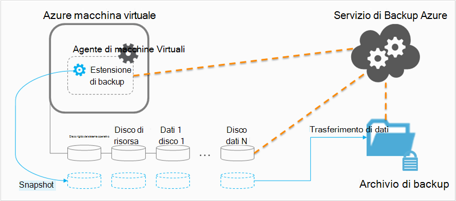

<properties
    pageTitle="Pianificazione dell'infrastruttura di backup macchine Virtuali di Azure | Microsoft Azure"
    description="Importanti considerazioni sulla pianificazione eseguire il backup macchine virtuali di Azure"
    services="backup"
    documentationCenter=""
    authors="markgalioto"
    manager="cfreeman"
    editor=""
    keywords="eseguire il backup macchine virtuali, eseguire il backup macchine virtuali"/>

<tags
    ms.service="backup"
    ms.workload="storage-backup-recovery"
    ms.tgt_pltfrm="na"
    ms.devlang="na"
    ms.topic="article"
    ms.date="10/19/2016"
    ms.author="trinadhk; jimpark; markgal;"/>

# <a name="plan-your-vm-backup-infrastructure-in-azure"></a>Pianificare l'infrastruttura di backup macchine Virtuali Azure
In questo articolo fornisce le prestazioni e suggerimenti per la pianificazione dell'infrastruttura di backup macchine Virtuali di una risorsa. Definisce inoltre aspetti del servizio di Backup. questi aspetti possono essere fondamentale per determinare l'architettura, pianificare e programmare la capacità. Se sono state eseguite le [preparare l'ambiente](backup-azure-vms-prepare.md), questo è il passaggio successivo prima di iniziare [a macchine virtuali di backup](backup-azure-vms.md). Se si desiderano maggiori informazioni sulla macchine virtuali di Azure, vedere la [documentazione macchine virtuali](https://azure.microsoft.com/documentation/services/virtual-machines/).

## <a name="how-does-azure-back-up-virtual-machines"></a>Funzionamento del Azure backup macchine virtuali?
Quando il servizio di Azure Backup avvia un processo di backup pianificata, attiva l'estensione di backup per creare uno snapshot nel momento. Questa istantanea in collaborazione con Volume ombreggiatura copia Service (VSS) per ottenere uno snapshot coerente dei dischi nella macchina virtuale senza che sia necessario chiuderlo.

Dopo l'istantanea, i dati vengono trasferiti dal servizio di Azure Backup per l'archivio di backup. Per rendere più efficiente il processo di backup, il servizio identifica e viene trasferita solo i blocchi di dati che sono stati modificati dopo l'ultimo backup.



Una volta completato il trasferimento dei dati, viene rimosso lo snapshot e viene creato un punto di ripristino.

### <a name="data-consistency"></a>Coerenza dei dati
Backup e ripristino dei dati di importanza cruciale sono complicati dal fatto che dati aziendali eseguire il backup durante le applicazioni di producono i dati business in esecuzione. Per risolvere questo problema, Backup Azure fornisce backup coerenti applicazione per carichi di lavoro di Microsoft tramite VSS per garantire che dati vengano scritti correttamente allo spazio di archiviazione.

>[AZURE.NOTE] Per macchine virtuali Linux, solo i backup coerenti con file sono possibili, poiché Linux non dispone di una piattaforma equivalente VSS.

Copia di Backup Azure consente di eseguire backup completo VSS in macchine virtuali di Windows (maggiori informazioni sui [backup completo VSS](http://blogs.technet.com/b/filecab/archive/2008/05/21/what-is-the-difference-between-vss-full-backup-and-vss-copy-backup-in-windows-server-2008.aspx)). Per attivare backup copia VSS, il di sotto del Registro di sistema chiave deve essere impostata su Virtual Machine.

```
[HKEY_LOCAL_MACHINE\SOFTWARE\MICROSOFT\BCDRAGENT]
"USEVSSCOPYBACKUP"="TRUE"
```


Questa tabella illustra i tipi di coerenza e le condizioni che si verificano in durante macchine Virtuali di Azure eseguirne il backup e ripristino procedure.

| Coerenza | In base a VSS | Spiegazione e dettagli |
|-------------|-----------|---------|
| Coerenza dell'applicazione | Sì | Questo è il tipo di coerenza ideale per carichi di lavoro di Microsoft garantisce che:<ol><li> Le macchine Virtuali di *avvio di*. <li>Non esiste *alcun danno*. <li>Non esiste *alcun perdite di dati*.<li> I dati sono coerenti per l'applicazione che utilizza i dati, grazie alla collaborazione tra l'applicazione al momento del backup--utilizzo VSS.</ol> La maggior parte dei carichi di lavoro di Microsoft ha writer VSS che eseguire azioni specifiche di un carico di lavoro che riguardano la coerenza dei dati. Ad esempio Microsoft SQL Server un writer VSS che assicura che le operazioni di scrittura per il file di registro e il database vengono eseguite correttamente.<br><br> Per macchine Virtuali di Azure backup, ottenere un punto di ripristino applicazione coerente significa che l'estensione backup è stato possibile richiamare il flusso di lavoro VSS e completarlo *correttamente* prima della creazione dello snapshot di macchine Virtuali. Naturalmente, significa che writer VSS di tutte le applicazioni in macchine Virtuali di Azure sono stati richiamati anche.<br><br>Informazioni di [base della SSV](http://blogs.technet.com/b/josebda/archive/2007/10/10/the-basics-of-the-volume-shadow-copy-service-vss.aspx) e approfondimenti i dettagli del [funzionamento](https://technet.microsoft.com/library/cc785914%28v=ws.10%29.aspx). |
| Coerenza del file system | Sì, per i computer basato su Windows | Esistono due scenari in cui il punto di ripristino può essere *file system coerente*:<ul><li>Backup delle macchine virtuali Linux in Azure, poiché Linux non dispone di una piattaforma equivalente VSS.<li>Errore di VSS durante la copia di backup per macchine virtuali di Windows in Azure.</li></ul> In entrambi i casi, le procedure che possono essere eseguite sia per garantire che: <ol><li> Le macchine Virtuali di *avvio di*. <li>Non esiste *alcun danno*.<li>Non esiste *alcun perdite di dati*.</ol> Applicazioni necessario implementare un proprio meccanismo di "correzione" sui dati ripristinati.|
| Coerenza arresto anomalo | No | Questa situazione corrisponde a una macchina virtuale riscontrando "arresto anomalo" (tramite Reimposta sfumato o disco). Questo accade solitamente quando la macchina virtuale Azure viene chiuso in fase di copia di backup. Per i backup Azure macchina virtuale, Guida mezzo punto ripristino arresto anomalo coerente che il Backup della Azure non offre alcuna garanzia intorno la coerenza dei dati sul supporto di memorizzazione - dal punto di vista del sistema operativo o dal punto di vista dell'applicazione. Solo i dati già presenti sul disco in fase di copia di backup sono cosa acquisita viene eseguito il backup. <br/> <br/> Mentre ci sono garanzie, nella maggior parte dei casi, verrà avviato il sistema operativo. In genere seguita da una procedura il controllo del disco, ad esempio chkdsk, per correggere gli errori di danneggiamento. Tutti i dati in memoria e scrive che non sono stati scaricati completamente sul disco andranno perse. L'applicazione è in genere segue con il proprio meccanismo di verifica in caso di dati, è necessario essere eseguiti. <br><br>Ad esempio, se il registro delle transazioni contiene voci che non sono presente nel database, quindi il software di database non un ripristino finché i dati sono coerenti. Quando i dati siano distribuiti in più dischi virtuali (ad esempio spanning), un punto di ripristino coerente arresto anomalo non garantisce la correttezza dei dati.|


## <a name="performance-and-resource-utilization"></a>Utilizzo delle prestazioni e delle risorse
Ad esempio un software di backup viene distribuito in locale, è consigliabile per l'utilizzo delle risorse e la capacità esigenze per eseguire il backup macchine virtuali di Azure. [Limiti di archiviazione di Azure](azure-subscription-service-limits.md#storage-limits) definire come strutturare distribuzioni di macchine Virtuali per ottenere prestazioni ottimali con un impatto minimo sia in esecuzione carichi di lavoro.

Durante la pianificazione delle prestazioni di backup, prestare attenzione ai limiti di archiviazione Azure seguenti:

- Uscita max per conto di spazio di archiviazione
- Tasso di richiesta totale per un account di archiviazione

### <a name="storage-account-limits"></a>Limiti di archiviazione account
Ogni volta che i dati di backup viene copiati da un account di archiviazione, viene conteggiata verso le operazioni di ingresso/uscita al secondo (IOPS) e in uscita (o velocità) metriche dell'account di archiviazione. Nello stesso momento macchine virtuali sono in esecuzione e utilizzo di secondo e la velocità di trasmissione. L'obiettivo è garantire che il traffico totale - backup e virtuali computer - non superare i limiti di account di archiviazione.

### <a name="number-of-disks"></a>Numero di dischi
Il processo di backup tenta di completare più presto un processo di backup. In questo modo, utilizza come molte risorse come può. Tuttavia, tutte le operazioni dei / o sono limitate dalla *Velocità di esecuzione di destinazione per Blob singolo*, che ha un limite di 60 MB al secondo. Nel tentativo di ottimizzare la velocità, il processo di backup tenta di eseguire il backup di ognuno dischi *in parallelo di Virtual Machine*. Pertanto, se una macchina virtuale è disponibili quattro dischi, quindi Backup Azure tenta di backup di tutti i quattro dischi in parallelo. Per questi motivi, il fattore più importante stabilire il traffico di backup chiusura di un account di archiviazione cliente è il **numero di dischi** viene eseguito il backup dell'account di archiviazione.

### <a name="backup-schedule"></a>Pianificazione di backup
Un fattore aggiuntivo che influisce sulle prestazioni è la **pianificazione di backup**. Se si configurano i criteri in modo che tutte le macchine virtuali eseguito il backup allo stesso tempo, è pianificata una bloccati il traffico. Il processo di backup tenterà di backup di tutti i dischi in parallelo. È possibile ridurre il traffico di backup da un account di archiviazione: assicurarsi che macchine virtuali diverse eseguito il backup orari del giorno, con senza sovrapposizione.

## <a name="capacity-planning"></a>Pianificazione delle capacità
Organizzando tutti questi fattori significa che l'utilizzo di account di archiviazione deve essere pianificata correttamente. Scaricare il [foglio di calcolo macchine Virtuali capacità di backup pianificazione Excel](https://gallery.technet.microsoft.com/Azure-Backup-Storage-a46d7e33) per visualizzare l'impatto del disco e opzioni di pianificazione di backup.

### <a name="backup-throughput"></a>Velocità di backup
Per ogni disco viene eseguito il backup, Azure Backup legge i blocchi sul disco e memorizza solo i dati modificati (backup incrementale). In questa tabella mostra i valori di velocità media che prevedibili in base a Backup Azure. In questo modo è possibile valutare la quantità di tempo che verrà eseguita per eseguire il backup di un disco di una certa dimensione.

| Operazione di backup | Velocità migliore |
| ---------------- | ---------- |
| Backup iniziale | 160 Mbps |
| Backup incrementale (DR) | 640 Mbps <br><br> Questa velocità possibile eliminare in modo significativo caso esistano numerosi distribuito varianza del disco che deve eseguire il backup. |

## <a name="total-vm-backup-time"></a>Tempo di backup macchine Virtuali
Durante la maggior parte dei casi backup viene utilizzata per la lettura e la copia di dati, sono disponibili altre operazioni contribuiscono al tempo necessario per eseguire il backup una macchina virtuale:

- Tempo necessario per [installare o aggiornare l'estensione di backup](backup-azure-vms.md#offline-vms).
- Ora snapshot indica il tempo necessario per attivare uno snapshot. Snapshot vengano attivati vicino dell'orario di backup.
- Tempo di attesa coda. Poiché il servizio di Backup elabora i backup di più clienti, copiare i dati di backup da snapshot backup o ripristino servizi archivio potrebbe non essere avviato immediatamente. Tempi di punta caricare, fino a 8 ore a causa il numero di backup in fase di elaborazione è possibile allungare il tempo di attesa. Tuttavia, il tempo di backup macchine Virtuali sarà inferiore a 24 ore per giorno criteri di backup.

## <a name="best-practices"></a>Procedure consigliate
Si consiglia di seguire queste procedure durante la configurazione di backup per macchine virtuali di:

- Non pianificare più di quattro macchine virtuali classiche dal servizio cloud stesso per eseguire il backup nello stesso momento. È consigliabile scaglionare orari di inizio backup di un'ora se si desidera eseguire il backup più macchine virtuali dal servizio cloud stesso.
- Non pianificare più di 40 macchine virtuali distribuito Manager delle risorse per eseguire il backup nello stesso momento.
- Pianificare l'esecuzione di backup macchine Virtuali durante le ore di scarsa in modo che il servizio di backup utilizza IOPS per trasferire i dati dell'account di archiviazione dei clienti della copia di backup o ripristino servizi archivio.
- Assicurarsi che un criterio di indirizzi macchine virtuali distribuiti in account di archiviazione diversi. È consigliabile non più di 20 dischi da un account di archiviazione protetta mediante un criterio. Se si dispone di maggiore di 20 dischi in un account di archiviazione, distribuire tali macchine virtuali su più criteri per ottenere IOPS richiesto durante la fase di trasferimento del processo di backup.
- Non consentono di ripristinare una macchina virtuale in esecuzione in archiviazione Premium stesso account di archiviazione. Se il processo di operazione di ripristino coincide con l'operazione di backup, si riduce IOPS disponibili per il backup.
- È consigliabile eseguire ogni macchina virtuale Premium in un account di archiviazione premium distinti per garantire prestazioni ottimali di backup.

## <a name="data-encryption"></a>Crittografia dei dati

Copia di Backup Azure non crittografa i dati come parte del processo di backup. Tuttavia, è possibile crittografare i dati all'interno della macchina virtuale e drill-up dati protetti diretta (maggiori informazioni sui [backup dei dati crittografati](backup-azure-vms-encryption.md)).


## <a name="how-are-protected-instances-calculated"></a>La modalità di calcolo istanze protette?
Azure macchine virtuali di backup tramite Backup Azure è soggetto a [prezzi Azure Backup](https://azure.microsoft.com/pricing/details/backup/). Calcolo protetta istanze dipende dimensioni *originali* della macchina virtuale, che equivale alla somma di tutti i dati nella macchina virtuale - esclusi "disco di risorsa".

Ci si trova *non* effettuata in base alle dimensioni massime supportate per ogni disco dati collegato al computer virtuale, ma su dati reali archiviati nel disco di dati. Analogamente, l'effetto di archiviazione di backup dipende la quantità di dati memorizzati con Azure Backup, che equivale alla somma dei dati effettivi di ogni punto di ripristino.

Ad esempio, richiedere una macchina virtuale A2 Standard dimensioni con due dischi dati aggiuntivi con dimensioni massime di 1 TB. Nella tabella seguente fornisce i dati effettivi archiviati in ognuna di questi dischi:

|Tipo di disco|Dimensioni massime|Presentare i dati effettivi|
|---------|--------|------|
| Sistema operativo disco | GB 1023 | 17 GB |
| Disco locale / disco di risorsa | 135 GB | 5 GB (non incluso per il backup) |
| Disco dati 1 | GB 1023 | 30 GB |
| Disco dati 2 | GB 1023 | 0 GB |

Dimensioni *originali* della macchina virtuale in questo caso sono 17 GB + 30 GB + 0 GB = 47 GB. Questo nome diventa le dimensioni di istanza protetto basato su conto mensile. Man mano che aumenta la quantità di dati nella macchina virtuale, la dimensione protetta istanza utilizzata per la fatturazione anche verrà modificate di conseguenza.

Fatturazione non viene avviato fino al completamento il primo backup completato. A questo punto, verrà avviata la fatturazione per l'archiviazione e le istanze protetto. Fatturazione continua, purché *i dati di backup archiviati con Azure Backup* per la macchina virtuale. Eseguire l'operazione Rimuovi protezione che non impedisce la fatturazione se i dati di backup viene mantenuti.

La fatturazione per una macchina virtuale specificata non sarà più disponibile solo se la protezione *e* ha smesso di eventuali dati di backup viene eliminati. Quando non sono disponibili processi di backup attivi (quando è stata interrotta protezione), le dimensioni della macchina virtuale al momento dell'ultimo backup completato diventano le dimensioni di istanza protetto basato su conto mensile.

## <a name="questions"></a>Domande?
In caso di dubbi o qualsiasi funzione che si vuole vedere inclusi, [inviare un feedback](http://aka.ms/azurebackup_feedback).

## <a name="next-steps"></a>Passaggi successivi

- [Eseguire il backup macchine virtuali](backup-azure-vms.md)
- [Gestire backup macchina virtuale](backup-azure-manage-vms.md)
- [Ripristinare macchine virtuali](backup-azure-restore-vms.md)
- [Risoluzione dei problemi di backup macchine Virtuali](backup-azure-vms-troubleshoot.md)
