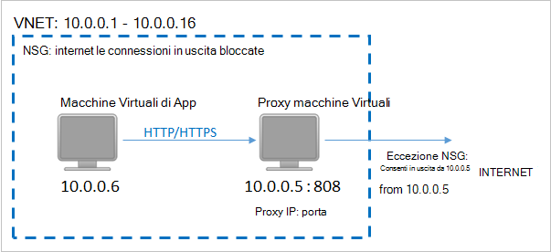

<properties
    pageTitle="Preparare l'ambiente per eseguire il backup macchine virtuali di Azure | Microsoft Azure"
    description="Verificare che l'ambiente è pronto per il backup macchine virtuali di Azure"
    services="backup"
    documentationCenter=""
    authors="markgalioto"
    manager="cfreeman"
    editor=""
    keywords="backup; backup;"/>

<tags
    ms.service="backup"
    ms.workload="storage-backup-recovery"
    ms.tgt_pltfrm="na"
    ms.devlang="na"
    ms.topic="article"
    ms.date="08/26/2016"
    ms.author="trinadhk; jimpark; markgal;"/>


# <a name="prepare-your-environment-to-back-up-azure-virtual-machines"></a>Preparare l'ambiente per eseguire il backup macchine virtuali di Azure

> [AZURE.SELECTOR]
- [Modello di gestione delle risorse](backup-azure-arm-vms-prepare.md)
- [Modello classico](backup-azure-vms-prepare.md)

Prima di eseguire il backup una Azure macchine (), sono disponibili tre condizioni che devono esistere.

- È necessario creare un archivio di backup oppure identificare un archivio di backup esistenti *nella stessa regione di una macchina virtuale*.
- Stabilire una connessione di rete tra gli indirizzi Internet pubblici Azure e i punti finali di archiviazione Azure.
- Installare l'agente di macchine Virtuali nella macchina virtuale.

Se si è sicuri di che queste condizioni già presenti nel proprio ambiente proseguire con il [backup dell'articolo macchine virtuali](backup-azure-vms.md). In caso contrario, continuare a leggere, in questo articolo verrà avviata la procedura per preparare l'ambiente per eseguire il backup una macchina virtuale Azure.


## <a name="limitations-when-backing-up-and-restoring-a-vm"></a>Limitazioni quando backup e ripristino di una macchina virtuale

>[AZURE.NOTE] Azure include due modelli di distribuzione per la creazione e utilizzo delle risorse: [Gestione risorse e classica](../resource-manager-deployment-model.md). L'elenco seguente include le limitazioni quando si distribuisce il modello classico.

- Non è possibile eseguire il backup dei macchine virtuali con più di 16 dischi di dati.
- Non è possibile eseguire il backup dei macchine virtuali con un indirizzo IP riservato e nessun endpoint definito.
- Dati di backup non includono le unità di rete installato associate a macchine Virtuali. 
- La sostituzione di una macchina virtuale esistente durante il ripristino non è supportata. Prima di tutto eliminare la macchina virtuale esistente e qualsiasi disco associati e ripristinare i dati da un backup.
- Area tra backup e ripristino non è supportata.
- Backup macchine virtuali utilizzando il servizio di Backup di Azure è supportato in tutte le aree pubbliche di Azure (vedere l' [elenco di controllo](https://azure.microsoft.com/regions/#services) delle aree supportate). Se attualmente non è supportato l'area che si sta cercando, non verrà visualizzato nell'elenco a discesa durante la creazione di archivio.
- Backup macchine virtuali utilizzando il servizio di Backup di Azure è supportato solo per le versioni di selezione del sistema operativo:
  - **Linux**: Backup Azure supporta [un elenco delle distribuzioni che approvato Azure](../virtual-machines/virtual-machines-linux-endorsed-distros.md) ad eccezione di base del sistema operativo Linux. Altri porta-Your-proprietari-distribuzioni Linux anche potrebbero funzionare come agente di macchine Virtuali è disponibile nel computer virtuale e il supporto per Python esiste.
  - **Windows Server**: versioni antecedenti a Windows Server 2008 R2 non sono supportate.
- Ripristino di un controller di dominio macchine Virtuali (CD) che fa parte di una configurazione con più controller di dominio sono supportato solo tramite PowerShell. Per ulteriori informazioni su [come ripristinare un controller di dominio con più controller di dominio](backup-azure-restore-vms.md#restoring-domain-controller-vms).
- Il ripristino delle macchine virtuali contenenti le configurazioni di rete speciali seguenti è supportato solo tramite PowerShell. Al termine dell'operazione di ripristino macchine virtuali creati usando il flusso di lavoro di ripristino nell'interfaccia utente non avranno queste configurazioni di rete. Per ulteriori informazioni, vedere [Il ripristino delle macchine virtuali con configurazioni di rete speciale](backup-azure-restore-vms.md#restoring-vms-with-special-netwrok-configurations).
    - Macchine virtuali in configurazione di bilanciamento carico (interna ed esterna)
    - Macchine virtuali con più indirizzi IP riservati
    - Macchine virtuali con più schede di rete

## <a name="create-a-backup-vault-for-a-vm"></a>Creare un archivio di backup per una macchina virtuale

Un archivio di backup è un'entità contenente tutti i backup e i punti di ripristino creato nel tempo. Archivio di backup contiene anche i criteri di backup che verranno applicati alle macchine virtuali viene eseguito il backup.

Questa immagine mostra le relazioni tra le varie entità Backup Azure:     

Per creare un archivio di backup:

1. Accedere al [portale di Azure](http://manage.windowsazure.com/).

2. Nel portale di Azure fare clic su **Nuovo** > **Integrazione ibrido** > **Backup**. Quando si fa clic su **Backup**, passerà automaticamente al portale di classico (come illustrato dopo la nota).

    

    >[AZURE.NOTE] Se l'abbonamento dell'ultimo utilizzo nel portale di classica, l'abbonamento può aprire nel portale di classica. In questo caso, fare clic su **Nuovo**per creare un archivio di backup, > **Servizi dati** > **Servizi di recupero** > **Archivio di Backup** > **Creazione rapida** (vedere l'immagine riportata di seguito).

    

3. Per **nome**immettere un nome descrittivo per identificare l'archivio. Il nome deve essere univoco per la sottoscrizione Azure. Digitare un nome che contiene da 2 a 50 caratteri. Deve iniziare con una lettera e possono contenere solo lettere, numeri e trattini.

4. Nell' **area geografica**, selezionare la località geografica per l'archivio. L'archivio deve essere nella stessa regione le macchine virtuali che si desidera proteggere. Se si dispone di macchine virtuali in più aree, è necessario creare un archivio di backup in ogni area. Non è necessario specificare gli account di archiviazione per archiviare i dati di backup, ossia l'archivio di backup e il punto di servizio Azure Backup questo automaticamente.

5. In **abbonamento** selezionare l'abbonamento che si desidera associare l'archivio di backup. Si verificherà scelte multiple solo se l'account aziendale è associata a più abbonamenti Azure.

6. Fare clic su **Crea archivio**. Può richiedere un po' di tempo per l'archivio di backup da creare. Eseguire il monitoraggio delle notifiche sullo stato nella parte inferiore del portale.

    

7. Un messaggio di confermare che l'archivio è stato creato correttamente. Verranno elencato nella pagina **servizi di recupero** come **attivo**. Assicurarsi di selezionare il diritto di opzione ridondanza di archiviazione appropriato dopo aver creato l'archivio. Altre informazioni [sull'impostazione dell'opzione di ridondanza dello spazio di archiviazione nell'archivio di backup](backup-configure-vault.md#azure-backup---storage-redundancy-options).

    

8. Fare clic su archivio di backup per passare alla pagina **Guida introduttiva** in cui sono visualizzate le istruzioni per il backup macchine virtuali di Azure.

    


## <a name="network-connectivity"></a>Connettività di rete

Per gestire le istantanee macchine Virtuali, l'estensione di backup richiede connettività a Azure indirizzi IP. Senza la connettività Internet destra, HTTP della macchina virtuale le richieste di timeout e l'operazione di backup non riesce. Se la distribuzione è associate le restrizioni di accesso in posizione (tramite un rete gruppo di sicurezza (NSG), ad esempio), quindi scegliere una delle opzioni seguenti per fornire un percorso chiaro per il traffico di backup:

- [Intervalli di proprietà consentite IP Azure Data Center](http://www.microsoft.com/en-us/download/details.aspx?id=41653) , vedere l'articolo per istruzioni su come a proprietà consentite gli indirizzi IP.
- Distribuire un server proxy HTTP per instradare il traffico.

Per decidere quale opzione utilizzare, compromessi sono compresi tra la gestibilità, controllo granulare e costo.

|Opzione|Vantaggi|Svantaggi|
|------|----------|-------------|
|Intervalli IP whitelist| Senza costi aggiuntivi.<br><br>Per l'apertura di access in un NSG, utilizzare il cmdlet <i>Set-AzureNetworkSecurityRule</i> . | Complesse per gestire come l'interessata intervalli di indirizzi IP cambiano nel tempo.<br><br>Consente di accedere all'intero di Azure e non solo lo spazio di archiviazione.|
|Proxy HTTP| Controllo granulare nel proxy sugli URL di spazio di archiviazione consentito.<br>Punto di Internet accesso singolo per macchine virtuali.<br>Non è soggetta a modifiche all'indirizzo IP di Azure.| Costi aggiuntivi per l'esecuzione di una macchina virtuale con il software proxy.|

### <a name="whitelist-the-azure-datacenter-ip-ranges"></a>Intervalli di indirizzi IP di proprietà consentite Data Center del Azure

A proprietà consentite intervalli di indirizzi IP di Azure Data Center, vedere il [sito Web Azure](http://www.microsoft.com/en-us/download/details.aspx?id=41653) per informazioni dettagliate sugli intervalli di indirizzi IP e le istruzioni.

### <a name="using-an-http-proxy-for-vm-backups"></a>Utilizzando un proxy HTTP per i backup macchine Virtuali
Per eseguire il backup di una macchina virtuale, l'estensione di backup nella macchina virtuale invia i comandi di gestione delle istantanea allo spazio di archiviazione di Azure mediante un'API HTTPS. Instradare il traffico di backup estensione attraverso il proxy HTTP poiché è l'unico componente configurato per l'accesso a Internet.

>[AZURE.NOTE] Non esiste alcun suggerimento per il software proxy che deve essere utilizzato. Assicurarsi di selezionare un proxy è compatibile con la procedura di configurazione riportata di seguito.

L'immagine di esempio seguente illustra la procedura di tre configurazione necessario utilizzare un proxy HTTP:

- Macchine Virtuali di App indirizza tutto il traffico HTTP destinato pubblica Internet attraverso macchine Virtuali Proxy.
- Proxy macchine Virtuali consente il traffico in ingresso da macchine virtuali nella rete virtuale.
- Il gruppo di sicurezza rete (NSG) denominato Scoperto blocco deve un protezione regola consentendo Internet il traffico in uscita da macchine Virtuali Proxy.



Per utilizzare un proxy HTTP per comunicare a Internet, procedere come segue:

#### <a name="step-1-configure-outgoing-network-connections"></a>Passaggio 1. Configurare le connessioni in uscita
###### <a name="for-windows-machines"></a>Per i computer Windows
Questa operazione verrà configurazione configurazione del server proxy per Account di sistema locale.

1. Scaricare [PsExec](https://technet.microsoft.com/sysinternals/bb897553)
2. Comando Esegui dal prompt dei comandi con privilegi elevati,

     ```
     psexec -i -s "c:\Program Files\Internet Explorer\iexplore.exe"
     ```
     Verrà aperta una finestra di internet explorer.
3. Selezionare Strumenti -> Opzioni Internet -> connessioni -> Impostazioni LAN.
4. Verificare le impostazioni proxy per account di sistema. Impostare Proxy IP e porte.
5. Chiudere Internet Explorer.

Consente di impostare una configurazione proxy per l'intero computer e verrà utilizzato per tutto il traffico HTTP/HTTPS in uscita.

Se è stato impostato un server proxy in un account utente corrente (non un Account di sistema locale), utilizzare il seguente script di applicarli a SYSTEMACCOUNT:

```
   $obj = Get-ItemProperty -Path Registry::”HKEY_CURRENT_USER\Software\Microsoft\Windows\CurrentVersion\Internet Settings\Connections"
   Set-ItemProperty -Path Registry::”HKEY_USERS\S-1-5-18\Software\Microsoft\Windows\CurrentVersion\Internet Settings\Connections" -Name DefaultConnectionSettings -Value $obj.DefaultConnectionSettings
   Set-ItemProperty -Path Registry::”HKEY_USERS\S-1-5-18\Software\Microsoft\Windows\CurrentVersion\Internet Settings\Connections" -Name SavedLegacySettings -Value $obj.SavedLegacySettings
   $obj = Get-ItemProperty -Path Registry::”HKEY_CURRENT_USER\Software\Microsoft\Windows\CurrentVersion\Internet Settings"
   Set-ItemProperty -Path Registry::”HKEY_USERS\S-1-5-18\Software\Microsoft\Windows\CurrentVersion\Internet Settings" -Name ProxyEnable -Value $obj.ProxyEnable
   Set-ItemProperty -Path Registry::”HKEY_USERS\S-1-5-18\Software\Microsoft\Windows\CurrentVersion\Internet Settings" -Name Proxyserver -Value $obj.Proxyserver
```

>[AZURE.NOTE] Se si osservano "(407) necessaria autenticazione Proxy" nel log server proxy, controllare che il authrntication sia impostata correttamente.

######<a name="for-linux-machines"></a>Per i computer Linux

Aggiungere la riga seguente per il ```/etc/environment``` file:

```
http_proxy=http://<proxy IP>:<proxy port>
```

Aggiungere le seguenti righe per il ```/etc/waagent.conf``` file:

```
HttpProxy.Host=<proxy IP>
HttpProxy.Port=<proxy port>
```

#### <a name="step-2-allow-incoming-connections-on-the-proxy-server"></a>Passaggio 2. Consentire le connessioni in ingresso nel server proxy:

1. Sul server proxy, aprire Windows Firewall. Il modo più semplice per accedere il firewall è cercare Windows Firewall con sicurezza avanzata.

    

2. Nella finestra di dialogo Windows Firewall rapida **Regole in entrata** e fare clic su **Nuova regola...**.

    

3. **In ingresso Creazione guidata nuova regola**, scegliere l'opzione **personalizzato** per il **Tipo di regola** e fare clic su **Avanti**.

4. Nella pagina per selezionare il **programma**, scegliere **Tutti i programmi** e fare clic su **Avanti**.

5. Nella pagina **porte e protocolli** immettere le informazioni seguenti e fare clic su **Avanti**:

    

    - *tipo* di protocollo scegliere *TCP*
    - porta *locale* scegliere *Porte specifiche*, nella casella sottostante specificare il ```<Proxy Port>``` che è stata configurata.
    - Selezionare *Tutte le porte* per *porta remota*

    Per il resto della procedura guidata, fare clic su fino alla fine e specificare un nome per la regola.

#### <a name="step-3-add-an-exception-rule-to-the-nsg"></a>Passaggio 3. Aggiungere una regola di eccezione per la NSG:

In un prompt dei comandi PowerShell di Azure, immettere il comando seguente:

Il comando seguente aggiunge un'eccezione per la NSG. Questa eccezione consente il traffico TCP da qualsiasi porta sul 10.0.0.5 a qualsiasi indirizzo Internet sulla porta 80 (HTTP) o 443 (HTTPS). Se si richiede una porta specifica in pubblica Internet, assicurarsi di aggiungere tale porta per il ```-DestinationPortRange``` anche.

```
Get-AzureNetworkSecurityGroup -Name "NSG-lockdown" |
Set-AzureNetworkSecurityRule -Name "allow-proxy " -Action Allow -Protocol TCP -Type Outbound -Priority 200 -SourceAddressPrefix "10.0.0.5/32" -SourcePortRange "*" -DestinationAddressPrefix Internet -DestinationPortRange "80-443"
```

*Assicurarsi di sostituire i nomi nell'esempio con i dettagli appropriati per la distribuzione.*


## <a name="vm-agent"></a>Agente di macchine Virtuali

Prima di eseguire il backup la macchina virtuale Azure, è necessario verificare che l'agente di macchine Virtuali di Azure correttamente è installato nel computer virtuale. Poiché l'agente di macchine Virtuali è un componente facoltativo nel momento in cui viene creata la macchina virtuale, assicurarsi che sia selezionata la casella di controllo per l'agente di macchine Virtuali prima la macchina virtuale viene eseguito il provisioning.

### <a name="manual-installation-and-update"></a>Installazione manuale e aggiornamento

Agente di macchine Virtuali è già presenta in macchine virtuali creato dalla raccolta di Azure. Tuttavia, macchine virtuali di cui eseguire la migrazione da Data Center locale avrebbe non è installato l'agente di macchine Virtuali. Per tali macchine virtuali, è necessario che l'agente di macchine Virtuali installati in modo esplicito. Altre informazioni [sull'installazione dell'agente di macchine Virtuali in una macchina virtuale esistente](http://blogs.msdn.com/b/mast/archive/2014/04/08/install-the-vm-agent-on-an-existing-azure-vm.aspx).

| **Operazione** | **Windows** | **Linux** |
| --- | --- | --- |
| Installazione dell'agente di macchine Virtuali | <li>Scaricare e installare l' [agente MSI](http://go.microsoft.com/fwlink/?LinkID=394789&clcid=0x409). Sono necessari privilegi di amministratore per completare l'installazione. <li>[Aggiornare la proprietà macchine Virtuali](http://blogs.msdn.com/b/mast/archive/2014/04/08/install-the-vm-agent-on-an-existing-azure-vm.aspx) per indicare che l'agente è installato. | <li> Installare l' ultima [agenti Linux](https://github.com/Azure/WALinuxAgent) da GitHub. Sono necessari privilegi di amministratore per completare l'installazione. <li> [Aggiornare la proprietà macchine Virtuali](http://blogs.msdn.com/b/mast/archive/2014/04/08/install-the-vm-agent-on-an-existing-azure-vm.aspx) per indicare che l'agente è installato. |
| Agente di macchine Virtuali di aggiornamento | Agente di macchine Virtuali l'aggiornamento è semplice come reinstallare i [file binari agente macchine Virtuali](http://go.microsoft.com/fwlink/?LinkID=394789&clcid=0x409). <br><br>Assicurarsi che nessuna operazione di backup venga eseguito durante l'aggiornamento dell'agente di macchine Virtuali. | Seguire le istruzioni [sull'Aggiornamento agente di supporto virtuale Linux ](../virtual-machines-linux-update-agent.md). <br><br>Assicurarsi che nessuna operazione di backup venga eseguito durante l'aggiornamento dell'agente di macchine Virtuali. |
| Convalidare l'installazione dell'agente macchine Virtuali | <li>Passare alla cartella *C:\WindowsAzure\Packages* nella macchina virtuale Azure. <li>È necessario trovare il file WaAppAgent.exe presenta.<li> Pulsante destro del mouse sul file, passare a **proprietà**e quindi selezionare la scheda **Dettagli** . Il campo versione del prodotto deve essere 2.6.1198.718 o versione successiva. | N/D |


Informazioni [sull'agente di macchine Virtuali](https://go.microsoft.com/fwLink/?LinkID=390493&clcid=0x409) e [come installarlo](https://azure.microsoft.com/blog/2014/04/15/vm-agent-and-extensions-part-2/).

### <a name="backup-extension"></a>Estensione di backup

Per eseguire il backup la macchina virtuale, il servizio di Backup di Azure installa un'estensione per l'agente di macchine Virtuali. Servizio di Azure Backup diretta Aggiorna e corregge l'estensione backup senza l'intervento di altro utente.

Se la macchina virtuale è in esecuzione, è installato l'estensione di backup. Una macchina virtuale in esecuzione vengono forniti anche la massima probabilità di ottenere un punto di ripristino applicazione coerente. Tuttavia, il Backup di Azure servizio continuerà a eseguire il backup macchine Virtuali, anche se è stato disattivato e l'estensione non può essere installato (o Offline macchine Virtuali). In questo caso, il punto di ripristino sarà *un arresto anomalo coerenza* come descritto sopra.


## <a name="questions"></a>Domande?
In caso di dubbi o qualsiasi funzione che si vuole vedere inclusi, [inviare un feedback](http://aka.ms/azurebackup_feedback).

## <a name="next-steps"></a>Passaggi successivi
Ora che è stato creato l'ambiente per il backup di una macchina virtuale, il passaggio logico successivo consiste nel creare una copia di backup. Per informazioni più dettagliate sugli backup delle macchine virtuali, l'articolo pianificazione.

- [Eseguire il backup macchine virtuali](backup-azure-vms.md)
- [Pianificare l'infrastruttura di backup macchine Virtuali](backup-azure-vms-introduction.md)
- [Gestire i backup macchina virtuale](backup-azure-manage-vms.md)
