<properties
    pageTitle="Eseguire il backup macchine virtuali di Azure | Microsoft Azure"
    description="Alla scoperta di, eseguire la registrazione e drill-up macchine virtuali con queste procedure per il backup di Azure macchina virtuale."
    services="backup"
    documentationCenter=""
    authors="markgalioto"
    manager="jwhit"
    editor=""
    keywords="backup macchina virtuale. eseguire il backup macchina virtuale; copia di backup e ripristino di emergenza; macchine virtuali copia di backup"/>

<tags
    ms.service="backup"
    ms.workload="storage-backup-recovery"
    ms.tgt_pltfrm="na"
    ms.devlang="na"
    ms.topic="article"
    ms.date="09/28/2016"
    ms.author="trinadhk; jimpark; markgal;"/>

# Eseguire il backup macchine virtuali di Azure

> [AZURE.SELECTOR]
- [Eseguire il backup macchine virtuali in servizi di recupero archivio](backup-azure-arm-vms.md)
- [Eseguire il backup macchine virtuali all'archivio di Backup](backup-azure-vms.md)

In questo articolo vengono fornite le procedure per il backup di una distribuzione classica Azure macchine () in un archivio di Backup. Esistono alcune attività che occorre prendersi cura della prima che è possibile eseguire il backup una macchina virtuale Azure. Se non è già stato fatto, completare i [Prerequisiti](backup-azure-vms-prepare.md) per preparare l'ambiente per il backup nelle macchine virtuali.

Per ulteriori informazioni, vedere gli articoli nella [pianificazione dell'infrastruttura di backup macchine Virtuali di Azure](backup-azure-vms-introduction.md) e [Azure macchine virtuali](https://azure.microsoft.com/documentation/services/virtual-machines/).

>[AZURE.NOTE] Azure include due modelli di distribuzione per la creazione e utilizzo delle risorse: [Gestione risorse e classica](../resource-manager-deployment-model.md). Un archivio di Backup protegge solo macchine virtuali distribuito classica. Non è possibile proteggere macchine virtuali distribuito Manager delle risorse a un archivio di Backup. Per informazioni dettagliate sull'utilizzo dei servizi di recupero archivi, vedere [eseguire il backup macchine virtuali all'archivio di servizi di recupero](backup-azure-arm-vms.md) .

Backup macchine virtuali di Azure prevede tre passaggi principali:

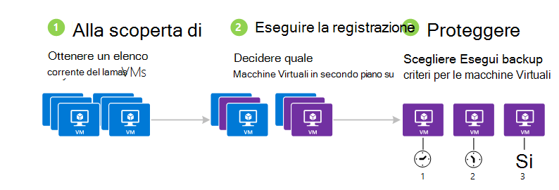

>[AZURE.NOTE] Il backup dei macchine virtuali è un processo locale. È possibile eseguire il backup macchine virtuali in un'area di un archivio di backup in un'altra area. Questa operazione, è necessario creare un archivio di backup in ogni regione Azure, in cui sono presenti macchine virtuali che saranno sottoposti a backup.

## Passaggio 1 - alla scoperta di macchine virtuali di Azure
Per assicurarsi che le nuove macchine () aggiunte alla sottoscrizione sono state identificate prima di registrare, eseguire il processo di rilevamento. Le query di processo Azure per l'elenco di macchine virtuali in abbonamento, insieme a ulteriori informazioni, ad esempio il nome del servizio cloud e l'area geografica.

1. Accedere al [portale classica](http://manage.windowsazure.com/)

2. Nell'elenco dei servizi di Azure, fare clic su **Servizi di recupero** per aprire l'elenco degli archivi di Backup e il ripristino del sito.
    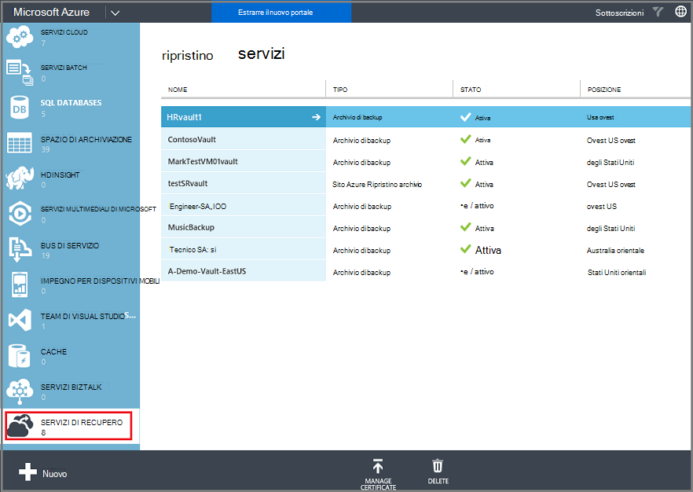

3. Nell'elenco degli archivi di Backup, selezionare l'archivio di eseguire il backup di una macchina virtuale.

    Se si tratta di un archivio di nuovo il portale viene visualizzata la pagina **Avvio rapido** .

    

    Se l'archivio è stato configurato in precedenza, il portale verrà visualizzata al menu degli ultimi file usato.

4. Dal menu archivio (nella parte superiore della pagina), fare clic su **Elementi registrati**.

    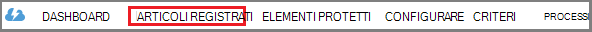

5. Dal menu **tipo** selezionare **macchina virtuale Azure**.

    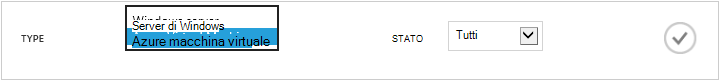

6. Fare clic su **ricerca** nella parte inferiore della pagina.
    

    Il processo di rilevamento potrebbe richiedere alcuni minuti, mentre le macchine virtuali vengano vengano inserite. Esiste una notifica nella parte inferiore della schermata che informa che il processo è in esecuzione.

    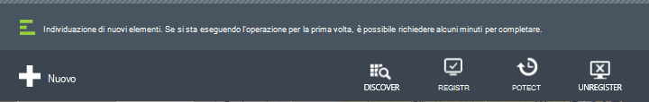

    Completare le modifiche di notifica del processo. Se il processo di rilevamento non trovato macchine virtuali, assicurarsi prima di tutto che macchine virtuali esistono. Se sono presenti macchine virtuali, assicurarsi che le macchine virtuali sono presenti nell'area stesso come archivio di backup. Se le macchine virtuali sono disponibili nella stessa regione, assicurarsi che le macchine virtuali non sono già registrate in un archivio di backup. Se una macchina virtuale è assegnata a un archivio di backup non è disponibile per l'assegnazione di altri archivi di backup.

    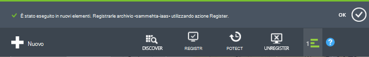

    Dopo aver individuato i nuovi elementi, andare al passaggio 2 e registrare le macchine virtuali.

##  Passaggio 2 - registro macchine virtuali di Azure
Registrare una macchina virtuale Azure per associare con il servizio di Backup di Azure. Si tratta in genere una singola attività.

1. Passare all'archivio di backup in **Servizi di recupero** nel portale di Azure e quindi fare clic su **Elementi registrati**.

2. Selezionare **Azure Virtual Machine** dal menu a discesa.

    

3. Fare clic su **Registra** nella parte inferiore della pagina.
    

4. Nel menu di scelta rapida di **Registrare gli elementi** , selezionare le macchine virtuali che si desidera registrare. Se sono presenti due o più macchine virtuali con lo stesso nome, utilizzare il servizio cloud per distinguere tra di esse.

    >[AZURE.TIP] È possibile registrare contemporaneamente più macchine virtuali.

    Per ogni macchina virtuale selezionata viene creato un processo.

5. Fare clic su **Visualizza processo** nel messaggio di notifica per passare alla pagina **dei processi** .

    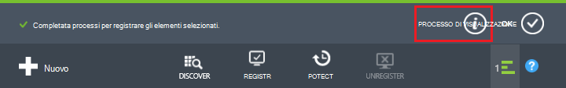

    La macchina virtuale viene visualizzata anche nell'elenco di articoli registrati, con lo stato dell'operazione di registrazione.

    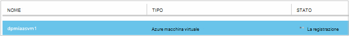

    Al termine dell'operazione, le modifiche di stato in base allo stato *registrato* .

    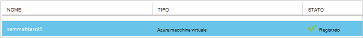

## Passaggio 3 - proteggere macchine virtuali di Azure
A questo punto è possibile impostare un criterio di backup e criteri di conservazione per la macchina virtuale. Più macchine virtuali può essere protetto tramite un unico proteggere azione.

Azure archivi di Backup creati dopo maggio 2015 accompagnato da un criterio predefinito incorporato nell'archivio. Questo criterio predefinito include un periodo di memorizzazione predefinito di 30 giorni e una pianificazione di backup di una volta al giorno.

1. Passare all'archivio di backup in **Servizi di recupero** nel portale di Azure e quindi fare clic su **Elementi registrati**.
2. Selezionare **Azure Virtual Machine** dal menu a discesa.

    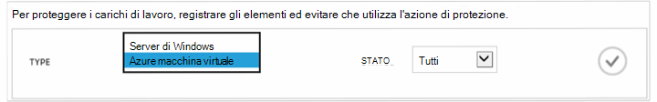

3. Fare clic su **PROTEGGI** nella parte inferiore della pagina.

    Verrà visualizzata la **procedura guidata di proteggere gli elementi** . La procedura guidata vengono elencati solo macchine virtuali registrate e non è protetto. Selezionare le macchine virtuali che si desidera proteggere.

    Se sono presenti due o più macchine virtuali con lo stesso nome, utilizzare il servizio cloud per distinguere tra le macchine virtuali.

    >[AZURE.TIP] È possibile proteggere contemporaneamente più macchine virtuali.

    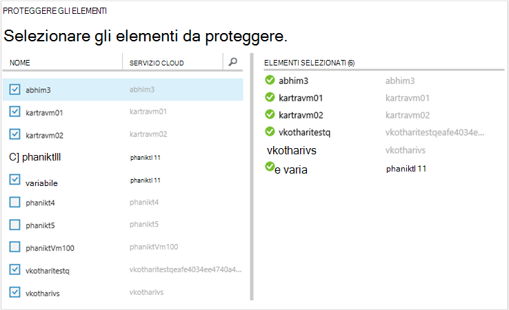

4. Scegliere una **pianificazione di backup** per eseguire il backup macchine virtuali selezionato. È possibile scegliere da un set di criteri esistente o definire uno nuovo.

    Ogni criterio backup può avere più macchine virtuali è associate. Tuttavia, la macchina virtuale può essere solo associata a un criterio in qualsiasi punto nel tempo.

    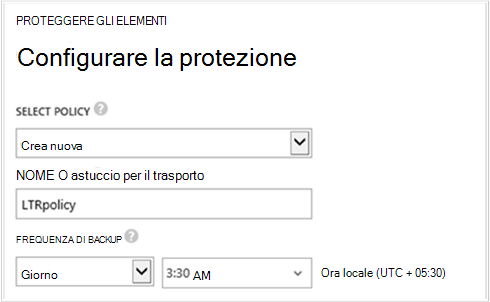

    >[AZURE.NOTE] Criteri di backup includono una combinazione di criteri di conservazione per i backup pianificati. Se si seleziona un criterio di backup esistente, è possibile modificare le opzioni di conservazione nel passaggio successivo.

5. Scegliere un **intervallo di criteri di conservazione** da associare il backup.

    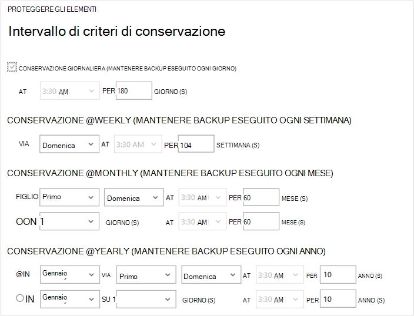

    Criteri di conservazione specificano l'intervallo di tempo per la memorizzazione di una copia di backup. È possibile specificare i criteri di conservazione diverso in base a quando viene eseguito il backup. Un punto di backup prese ogni giorno (che funge da un punto di ripristino operative), ad esempio, potrebbe essere mantenuto per 90 giorni. Confronto, un punto di backup eseguito alla fine di ogni trimestre (ai fini di controllo) potrebbe essere necessario conservate per il numero di mesi o anni.

    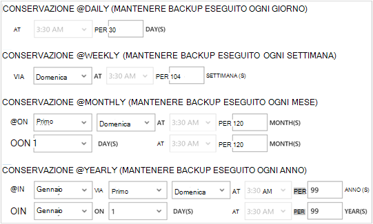

    In questo esempio di immagine:

    - **Criteri di conservazione giornaliera**: backup quotidianamente archiviati per 30 giorni.
    - **Criteri di conservazione settimanale**: backup ogni settimana domenica vengono conservate per 104 settimane.
    - **Criteri di conservazione mensile**: backup dell'ultima domenica di ogni mese vengono conservate per 120 mesi.
    - **Criteri di conservazione annuale**: backup prima domenica di ogni gennaio vengono conservate per il 99 anni.

    Per configurare i criteri di protezione e associare le macchine virtuali per tale criterio ogni macchina virtuale che è stata selezionata viene creato un processo.

6. Per visualizzare l'elenco dei processi di **Configurare la protezione** , dal menu archivi **processi** scegliere **Configurare la protezione** dal filtro **operazione** .

    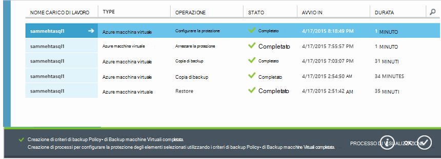

## Backup iniziale
Dopo la macchina virtuale è protetto con un criterio, verrà visualizzato nella scheda **Elementi protetti** con lo stato di *protetta - (in sospeso backup iniziale)*. Per impostazione predefinita, il primo backup pianificato è il *backup iniziale*.

Per attivare il backup iniziale immediatamente dopo la configurazione della protezione:

1. Nella parte inferiore della pagina di **Elementi protetta** , fare clic su **Esegui Backup**.

    Servizio di Azure Backup crea un processo di backup per l'operazione di backup iniziale.

2. Fare clic sulla scheda **processi** per visualizzare l'elenco dei processi.

    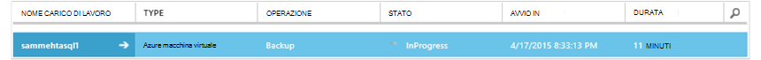

>[AZURE.NOTE] Durante l'operazione di backup, il servizio di Azure Backup invia un comando all'articolo estensione backup in ciascuna macchina virtuale per svuotare tutti i processi di scrittura e creare uno snapshot coerenza.

Al termine del processo di backup iniziale, lo stato della macchina virtuale nella scheda **Elementi protetti** è *protetta*.

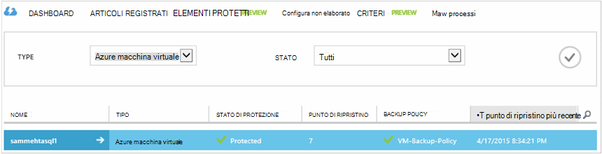

## Visualizzazione dettagli e lo stato di backup
Dopo aver protetto, il numero totale di macchina virtuale aumenta anche nella pagina **Dashboard di** riepilogo. Pagina del **Dashboard** Mostra anche il numero di processi da ultime 24 ore che hanno *avuto esito positivo*, *non è riuscita*e sono *in corso*. Nella pagina **processi** utilizzare di **stato**, **l'operazione**o menu **da** e **a** per filtrare i processi.

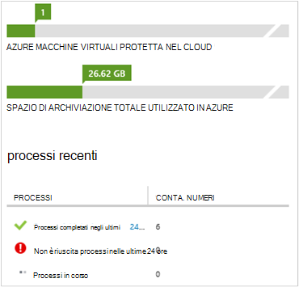

I valori nel dashboard vengono aggiornati ogni 24 ore.

## Risoluzione degli errori
Se si verificano problemi durante il backup la macchina virtuale, osservare l' [articolo sulla risoluzione dei problemi di macchine Virtuali](backup-azure-vms-troubleshoot.md) per assistenza.

## Passaggi successivi

- [Gestire e monitorare le macchine virtuali](backup-azure-manage-vms.md)
- [Ripristinare macchine virtuali](backup-azure-restore-vms.md)
