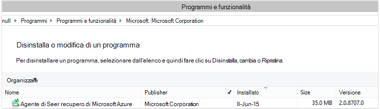

<properties
    pageTitle="Distribuire e gestire backup per Windows Server/Client tramite PowerShell | Microsoft Azure"
    description="Informazioni su come distribuire e gestire Backup Azure tramite PowerShell"
    services="backup"
    documentationCenter=""
    authors="saurabhsensharma"
    manager="shivamg"
    editor=""/>

<tags
    ms.service="backup"
    ms.workload="storage-backup-recovery"
    ms.tgt_pltfrm="na"
    ms.devlang="na"
    ms.topic="article"
    ms.date="09/01/2016"
    ms.author="saurabhsensharma;markgal;jimpark;nkolli;trinadhk"/>


# <a name="deploy-and-manage-backup-to-azure-for-windows-serverwindows-client-using-powershell"></a>Distribuire e gestire il backup su Azure per Windows Server/Client Windows tramite PowerShell

> [AZURE.SELECTOR]
- [PROCESSORE](backup-client-automation.md)
- [Classica](backup-client-automation-classic.md)

In questo articolo viene illustrato come usare PowerShell per la configurazione Azure Backup in Windows Server o un client di Windows e la gestione di backup e ripristino.

## <a name="install-azure-powershell"></a>Installare PowerShell Azure

[AZURE.INCLUDE [learn-about-deployment-models](../../includes/learn-about-deployment-models-include.md)]

Questo articolo analizza i cmdlet di PowerShell Manager delle risorse Azure (ARM) che consentono di utilizzare un archivio di servizi di recupero in un gruppo di risorse.

In ottobre 2015, è stata rilasciata Azure PowerShell 1.0. In questa versione è stata eseguita correttamente la 0.9.8 rilasciare e scaricati su alcune modifiche significative, specialmente nel modello di denominazione dei cmdlet di. 1.0 cmdlet seguire il modello di denominazione {verbo}-AzureRm {sostantivo}; invece di 0.9.8 nomi non includere nella selezione **Rm** (ad esempio, New-AzureRmResourceGroup anziché AzureResourceGroup nuovo). Quando si usa Azure PowerShell 0.9.8, è necessario abilitare la modalità di gestione risorse eseguendo il comando **AzureResourceManager AzureMode cambia** . Questo comando non è necessario in 1.0 o versione successiva.

Se si desidera utilizzare gli script scritti per il 0.9.8 ambiente, nell'ambiente 1.0 o versioni successiva con attenzione verificare gli script in un ambiente di pre-produzione prima dell'utilizzo di produzione per evitare impatto.

[Scaricare l'ultima versione di PowerShell](https://github.com/Azure/azure-powershell/releases) (versione minima necessaria è: 1.0.0)


[AZURE.INCLUDE [arm-getting-setup-powershell](../../includes/arm-getting-setup-powershell.md)]

## <a name="create-a-recovery-services-vault"></a>Creare un archivio di servizi di recupero

La procedura seguente per facilitare la creazione di un archivio di servizi di recupero. Un archivio di servizi di recupero è diverso da un archivio di Backup.

1. Se si utilizza il Backup di Azure per la prima volta, è necessario utilizzare il cmdlet **Registro AzureRMResourceProvider** per registrare il provider di servizi di recupero Azure con l'abbonamento.

    ```
    PS C:\> Register-AzureRmResourceProvider -ProviderNamespace "Microsoft.RecoveryServices"
    ```

2. Archivio di servizi di recupero è una risorsa ARM, pertanto è necessario per posizionarla all'interno di un gruppo di risorse. È possibile usare un gruppo di risorse esistente o crearne uno nuovo. Quando si crea un nuovo gruppo di risorse, specificare il nome e il percorso per il gruppo di risorse.  

    ```
    PS C:\> New-AzureRmResourceGroup –Name "test-rg" –Location "West US"
    ```

3. Utilizzare il cmdlet **New-AzureRmRecoveryServicesVault** per creare il nuovo archivio. Assicurarsi di specificato nella stessa posizione per l'archivio di come è stato utilizzato per il gruppo di risorse.

    ```
    PS C:\> New-AzureRmRecoveryServicesVault -Name "testvault" -ResourceGroupName " test-rg" -Location "West US"
    ```

4. Specificare il tipo di ridondanza di archiviazione da utilizzare; è possibile utilizzare [Lo spazio di archiviazione ridondanti in locale (LRS)](../storage/storage-redundancy.md#locally-redundant-storage) o [Geografico ridondanti dello spazio di archiviazione (GRS)](../storage/storage-redundancy.md#geo-redundant-storage). Nell'esempio seguente mostra che l'opzione - BackupStorageRedundancy per testVault è impostata su GeoRedundant.

    > [AZURE.TIP] Cmdlet di Backup di Azure molti richiedono l'oggetto di archivio di servizi di recupero come input. Per questo motivo, è utile memorizzare l'oggetto di archivio di servizi di recupero di Backup in una variabile.

    ```
    PS C:\> $vault1 = Get-AzureRmRecoveryServicesVault –Name "testVault"
    PS C:\> Set-AzureRmRecoveryServicesBackupProperties  -vault $vault1 -BackupStorageRedundancy GeoRedundant
    ```

## <a name="view-the-vaults-in-a-subscription"></a>Visualizzare gli archivi di in una sottoscrizione
Utilizzare **Get-AzureRmRecoveryServicesVault** per visualizzare l'elenco di tutti gli archivi nella sottoscrizione corrente. È possibile utilizzare questo comando per verificare che sia stato creato un nuovo archivio o per verificare quali archivi sono disponibili nella sottoscrizione.

Eseguire il comando Get-AzureRmRecoveryServicesVault e sono elencati tutti gli archivi nella sottoscrizione.

```
PS C:\> Get-AzureRmRecoveryServicesVault
Name              : Contoso-vault
ID                : /subscriptions/1234
Type              : Microsoft.RecoveryServices/vaults
Location          : WestUS
ResourceGroupName : Contoso-docs-rg
SubscriptionId    : 1234-567f-8910-abc
Properties        : Microsoft.Azure.Commands.RecoveryServices.ARSVaultProperties
```


## <a name="installing-the-azure-backup-agent"></a>Installazione dell'agente di Backup di Azure
Prima di installare l'agente di Backup di Azure, è necessario avere il programma di installazione scaricato e presenta in Windows Server. È possibile ottenere la versione più recente del programma di installazione dall' [Area Download Microsoft](http://aka.ms/azurebackup_agent) o dalla pagina Dashboard dell'archivio di servizi di recupero. Salvare il programma di installazione in una posizione facilmente accessibile come * C:\Downloads\*.

Per installare l'agente, eseguire il comando seguente in una console di PowerShell con privilegi elevata:

```
PS C:\> MARSAgentInstaller.exe /q
```

Consente di installare l'agente con tutte le opzioni predefinite. L'installazione sono necessari alcuni minuti in background. Se non si specifica l'opzione */nu* al termine dell'installazione per verificare la presenza di aggiornamenti verrà aperta la finestra di **Windows Update** . Dopo aver installato, l'agente verrà visualizzato nell'elenco dei programmi installati.

Per visualizzare l'elenco dei programmi attualmente installati, passare al **Pannello di controllo** > **programmi** > **programmi e funzionalità**.



### <a name="installation-options"></a>Opzioni di installazione

Per visualizzare tutte le opzioni disponibili tramite la riga di comando, utilizzare il comando seguente:

```
PS C:\> MARSAgentInstaller.exe /?
```

Le opzioni disponibili includono:

| Opzione | Dettagli | Impostazione predefinita |
| ---- | ----- | ----- |
| /q | Installazione automatica | - |
| /p: "posizione" | Percorso della cartella di installazione per l'agente di Backup di Azure. | C:\Programmi\Microsoft ripristino Azure servizi Agent |
| /s: "posizione" | Percorso della cartella della cache per l'agente di Backup di Azure. | C:\Programmi\Microsoft c:\Programmi\Microsoft ripristino Azure servizi Agent\Scratch |
| /m | Selezionare il Microsoft Update | - |
| /Nu | Controllare gli aggiornamenti al termine dell'installazione | - |
| /d | Disinstalla agente di servizi di recupero Microsoft Azure | - |
| /pH | Indirizzo proxy Host | - |
| /PO | Numero di porta Host proxy | - |
| /pu | Nome utente Host proxy | - |
| /pw | Password del proxy | - |


## <a name="registering-windows-server-or-windows-client-machine-to-a-recovery-services-vault"></a>Registrazione di computer client di Windows in un archivio di servizi di recupero o Windows Server

Dopo aver creato l'archivio di servizi di recupero, scaricare l'agente più recente e le credenziali di archivio e archiviarlo in una posizione centralizzata come C:\Downloads.

```
PS C:\> $credspath = "C:\downloads"
PS C:\> $credsfilename = Get-AzureRmRecoveryServicesVaultSettingsFile -Backup -Vault $vault1 -Path  $credspath
PS C:\> $credsfilename C:\downloads\testvault\_Sun Apr 10 2016.VaultCredentials
```

In Windows Server o computer client di Windows, eseguire il cmdlet [Start OBRegistration](https://technet.microsoft.com/library/hh770398%28v=wps.630%29.aspx) per registrare il computer con l'archivio.

```
PS C:\> $cred = $credspath + $credsfilename
PS C:\> Start-OBRegistration-VaultCredentials $cred -Confirm:$false
CertThumbprint      :7a2ef2caa2e74b6ed1222a5e89288ddad438df2
SubscriptionID      : ef4ab577-c2c0-43e4-af80-af49f485f3d1
ServiceResourceName: testvault
Region              :West US
Machine registration succeeded.
```

> [AZURE.IMPORTANT] Non utilizzare percorsi relativi per specificare il file di archivio credenziali. È necessario specificare un percorso assoluto come input al cmdlet.

## <a name="networking-settings"></a>Impostazioni di rete
Quando la connessione del computer Windows a internet tramite un server proxy, le impostazioni del proxy può essere forniti anche all'agente. In questo esempio è un server proxy, pertanto abbiamo in modo esplicito stiamo deselezionando le informazioni relative al proxy.

È anche possibile controllare l'utilizzo della larghezza di banda con le opzioni di ```work hour bandwidth``` e ```non-work hour bandwidth``` per un determinato insieme di giorni della settimana.

L'impostazione di dettagli del proxy e della larghezza di banda viene eseguita mediante il cmdlet [Set-OBMachineSetting](https://technet.microsoft.com/library/hh770409%28v=wps.630%29.aspx) :

```
PS C:\> Set-OBMachineSetting -NoProxy
Server properties updated successfully.

PS C:\> Set-OBMachineSetting -NoThrottle
Server properties updated successfully.
```

## <a name="encryption-settings"></a>Impostazioni di crittografia
I dati di backup inviati Azure Backup sono crittografati per proteggere la riservatezza dei dati. La crittografia passphrase è "password" per decrittografare i dati in fase di ripristino.

```
PS C:\> ConvertTo-SecureString -String "Complex!123_STRING" -AsPlainText -Force | Set-OBMachineSetting
Server properties updated successfully
```

> [AZURE.IMPORTANT] Mantenere le informazioni di passphrase e sicura dopo che è stata impostata. Non sarà possibile ripristinare i dati da Azure senza questo passphrase.

## <a name="back-up-files-and-folders"></a>Backup automatici di file e cartelle
Tutti i backup di client e server Windows eseguire il Backup di Azure dipendono dai criteri. Il criterio è costituito da tre elementi:

1. **Pianificazione di backup** che specifica quando l'esecuzione di backup necessario che vengono sincronizzati con il servizio.
2. **Pianificazione di conservazione** che specifica il tempo per la conservazione dei punti di ripristino di Azure.
3. **Specifica di inclusione o esclusione di file** che determina quali devono essere sottoposti a backup.

In questo documento, poiché è stiamo automazione di backup, supponiamo che non è stata configurata. Iniziamo creando un nuovo criterio backup utilizzando il cmdlet [New-OBPolicy](https://technet.microsoft.com/library/hh770416.aspx) .

```
PS C:\> $newpolicy = New-OBPolicy
```

In questo momento il criterio è vuoto e altri cmdlet sono necessari per definire gli elementi inclusi o esclusi, quando l'esecuzione di backup verrà eseguito e in cui verrà archiviato il backup.

### <a name="configuring-the-backup-schedule"></a>Configurare la pianificazione di backup
La prima parte 3 di un criterio è la pianificazione di backup, viene creata utilizzando il cmdlet [New-OBSchedule](https://technet.microsoft.com/library/hh770401) . La pianificazione di backup definisce quando necessitano adottate backup. Quando si crea una pianificazione che è necessario specificare 2 parametri di input:

- **Giorni della settimana** che deve essere eseguito il backup. È possibile eseguire il processo di backup in un solo giorno o ogni giorno della settimana o qualsiasi combinazione tra.
- **Ora del giorno** quando eseguita il backup. È possibile definire un massimo di 3 volte diversi del giorno quando verrà attivata la copia di backup.

Ad esempio, è possibile configurare un criterio di backup che funziona a 4 PM ogni sabato e domenica.

```
PS C:\> $sched = New-OBSchedule -DaysofWeek Saturday, Sunday -TimesofDay 16:00
```

La pianificazione di backup deve essere associato a un criterio e questo può essere ottenuto utilizzando il cmdlet [Set-OBSchedule](https://technet.microsoft.com/library/hh770407) .

```
PS C:> Set-OBSchedule -Policy $newpolicy -Schedule $sched
BackupSchedule : 4:00 PM Saturday, Sunday, Every 1 week(s) DsList : PolicyName : RetentionPolicy : State : New PolicyState : Valid
```
### <a name="configuring-a-retention-policy"></a>Configurare i criteri di conservazione
Consente di definire i criteri di conservazione per quanto tempo vengono mantenuti punti di ripristino creati da processi di backup. Quando si crea un nuovo criterio di conservazione utilizzando il cmdlet [New-OBRetentionPolicy](https://technet.microsoft.com/library/hh770425) , è possibile specificare il numero di giorni che devono essere mantenuti con Azure Backup i punti di ripristino backup. Nell'esempio seguente imposta un criterio di conservazione di 7 giorni.

```
PS C:\> $retentionpolicy = New-OBRetentionPolicy -RetentionDays 7
```

I criteri di conservazione devono essere associati con il criterio principale utilizzando il cmdlet [Set-OBRetentionPolicy](https://technet.microsoft.com/library/hh770405):

```
PS C:\> Set-OBRetentionPolicy -Policy $newpolicy -RetentionPolicy $retentionpolicy

BackupSchedule  : 4:00 PM
                  Saturday, Sunday,
                  Every 1 week(s)
DsList          :
PolicyName      :
RetentionPolicy : Retention Days : 7

                  WeeklyLTRSchedule :
                  Weekly schedule is not set

                  MonthlyLTRSchedule :
                  Monthly schedule is not set

                  YearlyLTRSchedule :
                  Yearly schedule is not set

State           : New
PolicyState     : Valid
```
### <a name="including-and-excluding-files-to-be-backed-up"></a>Inclusi e la relativa esclusione di file di backup
Un ```OBFileSpec``` oggetto definisce i file per da includere o escludere in una copia di backup. Si tratta di un set di regole di ambito i file protetti e cartelle in un computer. È possibile impostare come molti file inclusione o esclusione regole in base alle esigenze e associarli a un criterio. Quando si crea un nuovo oggetto OBFileSpec, è possibile:

- Specificare il file e cartelle da includere
- Specificare il file e cartelle da escludere
- Specificare la ricorsiva backup dei dati in una cartella (o) che devono essere eseguiti solo i file di primo livello nella cartella specificata.

Quest'ultimo è possibile utilizzare il contrassegno - non ricorsivo nel comando nuovo OBFileSpec.

Nell'esempio seguente è necessario eseguire il backup volume c e d: ed escludere i file binari del sistema operativo nella cartella di Windows e le cartelle temporanee. A tale scopo è necessario creare due specifiche del utilizzando il cmdlet [New-OBFileSpec](https://technet.microsoft.com/library/hh770408) - uno per l'inserimento di file e l'altra per l'esclusione. Dopo avere create le specifiche di file, che siano associati con il criterio utilizzando il cmdlet [OBFileSpec Aggiungi](https://technet.microsoft.com/library/hh770424) .

```
PS C:\> $inclusions = New-OBFileSpec -FileSpec @("C:\", "D:\")

PS C:\> $exclusions = New-OBFileSpec -FileSpec @("C:\windows", "C:\temp") -Exclude

PS C:\> Add-OBFileSpec -Policy $newpolicy -FileSpec $inclusions

BackupSchedule  : 4:00 PM
                  Saturday, Sunday,
                  Every 1 week(s)
DsList          : {DataSource
                  DatasourceId:0
                  Name:C:\
                  FileSpec:FileSpec
                  FileSpec:C:\
                  IsExclude:False
                  IsRecursive:True

                  , DataSource
                  DatasourceId:0
                  Name:D:\
                  FileSpec:FileSpec
                  FileSpec:D:\
                  IsExclude:False
                  IsRecursive:True

                  }
PolicyName      :
RetentionPolicy : Retention Days : 7

                  WeeklyLTRSchedule :
                  Weekly schedule is not set

                  MonthlyLTRSchedule :
                  Monthly schedule is not set

                  YearlyLTRSchedule :
                  Yearly schedule is not set

State           : New
PolicyState     : Valid


PS C:\> Add-OBFileSpec -Policy $newpolicy -FileSpec $exclusions

BackupSchedule  : 4:00 PM
                  Saturday, Sunday,
                  Every 1 week(s)
DsList          : {DataSource
                  DatasourceId:0
                  Name:C:\
                  FileSpec:FileSpec
                  FileSpec:C:\
                  IsExclude:False
                  IsRecursive:True
                  ,FileSpec
                  FileSpec:C:\windows
                  IsExclude:True
                  IsRecursive:True
                  ,FileSpec
                  FileSpec:C:\temp
                  IsExclude:True
                  IsRecursive:True

                  , DataSource
                  DatasourceId:0
                  Name:D:\
                  FileSpec:FileSpec
                  FileSpec:D:\
                  IsExclude:False
                  IsRecursive:True

                  }
PolicyName      :
RetentionPolicy : Retention Days : 7

                  WeeklyLTRSchedule :
                  Weekly schedule is not set

                  MonthlyLTRSchedule :
                  Monthly schedule is not set

                  YearlyLTRSchedule :
                  Yearly schedule is not set

State           : New
PolicyState     : Valid
```

### <a name="applying-the-policy"></a>Applicazione dei criteri
A questo punto l'oggetto Criteri è stata completata ed è associata una pianificazione backup, criteri di conservazione e un elenco di inclusione o esclusione di file. Questo criterio può essere eseguito il commit per il Backup di Azure da utilizzare. Prima di applicare il criterio appena creato assicurarsi che non sono presenti criteri di backup esistenti associati al server utilizzando il cmdlet [OBPolicy Rimuovi](https://technet.microsoft.com/library/hh770415) . Rimuovere il criterio verrà richiesto di conferma. Per ignorare l'utilizzo di conferma di ```-Confirm:$false``` contrassegno con il cmdlet.

```
PS C:> Get-OBPolicy | Remove-OBPolicy
Microsoft Azure Backup Are you sure you want to remove this backup policy? This will delete all the backed up data. [Y] Yes [A] Yes to All [N] No [L] No to All [S] Suspend [?] Help (default is "Y"):
```

Confermare l'oggetto Criteri viene eseguita mediante il cmdlet [Set-OBPolicy](https://technet.microsoft.com/library/hh770421) . Questa operazione anche verrà chiesto di confermare l'operazione. Per ignorare l'utilizzo di conferma di ```-Confirm:$false``` contrassegno con il cmdlet.

```
PS C:> Set-OBPolicy -Policy $newpolicy
Microsoft Azure Backup Do you want to save this backup policy ? [Y] Yes [A] Yes to All [N] No [L] No to All [S] Suspend [?] Help (default is "Y"):
BackupSchedule : 4:00 PM Saturday, Sunday, Every 1 week(s)
DsList : {DataSource
         DatasourceId:4508156004108672185
         Name:C:\
         FileSpec:FileSpec
         FileSpec:C:\
         IsExclude:False
         IsRecursive:True,

         FileSpec
         FileSpec:C:\windows
         IsExclude:True
         IsRecursive:True,

         FileSpec
         FileSpec:C:\temp
         IsExclude:True
         IsRecursive:True,

         DataSource
         DatasourceId:4508156005178868542
         Name:D:\
         FileSpec:FileSpec
         FileSpec:D:\
         IsExclude:False
         IsRecursive:True
    }
PolicyName : c2eb6568-8a06-49f4-a20e-3019ae411bac
RetentionPolicy : Retention Days : 7
              WeeklyLTRSchedule :
              Weekly schedule is not set

              MonthlyLTRSchedule :
              Monthly schedule is not set

              YearlyLTRSchedule :
              Yearly schedule is not set
State : Existing PolicyState : Valid
```

È possibile visualizzare i dettagli di criteri di backup esistenti utilizzando il cmdlet [Get-OBPolicy](https://technet.microsoft.com/library/hh770406) . È possibile drill-down ulteriormente utilizzando il cmdlet [Get-OBSchedule](https://technet.microsoft.com/library/hh770423) per la pianificazione di backup e il cmdlet [Get-OBRetentionPolicy](https://technet.microsoft.com/library/hh770427) per i criteri di conservazione

```
PS C:> Get-OBPolicy | Get-OBSchedule
SchedulePolicyName : 71944081-9950-4f7e-841d-32f0a0a1359a
ScheduleRunDays : {Saturday, Sunday}
ScheduleRunTimes : {16:00:00}
State : Existing

PS C:> Get-OBPolicy | Get-OBRetentionPolicy
RetentionDays : 7
RetentionPolicyName : ca3574ec-8331-46fd-a605-c01743a5265e
State : Existing

PS C:> Get-OBPolicy | Get-OBFileSpec
FileName : *
FilePath : \?\Volume{b835d359-a1dd-11e2-be72-2016d8d89f0f}\
FileSpec : D:\
IsExclude : False
IsRecursive : True

FileName : *
FilePath : \?\Volume{cdd41007-a22f-11e2-be6c-806e6f6e6963}\
FileSpec : C:\
IsExclude : False
IsRecursive : True

FileName : *
FilePath : \?\Volume{cdd41007-a22f-11e2-be6c-806e6f6e6963}\windows
FileSpec : C:\windows
IsExclude : True
IsRecursive : True

FileName : *
FilePath : \?\Volume{cdd41007-a22f-11e2-be6c-806e6f6e6963}\temp
FileSpec : C:\temp
IsExclude : True
IsRecursive : True
```

### <a name="performing-an-ad-hoc-backup"></a>Eseguire un backup reporting ad-hoc
Dopo aver impostato un criterio di backup i backup verranno eseguita per la pianificazione. Attivazione di una copia di backup di reporting ad-hoc è inoltre possibile utilizzare il cmdlet [Start OBBackup](https://technet.microsoft.com/library/hh770426) :

```
PS C:> Get-OBPolicy | Start-OBBackup
Taking snapshot of volumes...
Preparing storage...
Estimating size of backup items...
Estimating size of backup items...
Transferring data...
Verifying backup...
Job completed.
The backup operation completed successfully.
```

## <a name="restore-data-from-azure-backup"></a>Ripristinare i dati da un Backup di Azure
In questa sezione mostrerà tutti i passaggi per automatizzare il ripristino dei dati da un Backup di Azure. In questo modo prevede i passaggi seguenti:

1. Selezionare il volume di origine
2. Scegliere un punto di backup da ripristinare
3. Scegliere un elemento da ripristinare
4. Avviare il processo di ripristino

### <a name="picking-the-source-volume"></a>Se si seleziona il volume di origine
Per ripristinare un elemento da Azure Backup, è innanzitutto necessario identificare l'origine dell'elemento. Poiché esecuzione i comandi nel contesto di un Server di Windows o un client di Windows, il computer è già stato identificato. Il passaggio successivo per identificare l'origine è identificare il volume che lo contiene. Eseguendo il cmdlet [Get-OBRecoverableSource](https://technet.microsoft.com/library/hh770410) , è possibile recuperare un elenco di volumi o origini viene eseguito il backup di questo computer. Questo comando restituisce una matrice di tutte le origini di backup da questo server/client.

```
PS C:> $source = Get-OBRecoverableSource
PS C:> $source
FriendlyName : C:\
RecoverySourceName : C:\
ServerName : myserver.microsoft.com

FriendlyName : D:\
RecoverySourceName : D:\
ServerName : myserver.microsoft.com
```

### <a name="choosing-a-backup-point-to-restore"></a>Scelta di un punto di backup da ripristinare
Eseguendo il cmdlet [Get-OBRecoverableItem](https://technet.microsoft.com/library/hh770399.aspx) con i parametri appropriati, è possibile recuperare l'elenco di punti di backup. In questo esempio, si verrà scegliere il punto di backup più recente per il volume di origine *d:* e usarlo per recuperare un file specifico.

```
PS C:> $rps = Get-OBRecoverableItem -Source $source[1]
IsDir : False
ItemNameFriendly : D:\
ItemNameGuid : \?\Volume{b835d359-a1dd-11e2-be72-2016d8d89f0f}\
LocalMountPoint : D:\
MountPointName : D:\
Name : D:\
PointInTime : 18-Jun-15 6:41:52 AM
ServerName : myserver.microsoft.com
ItemSize :
ItemLastModifiedTime :

IsDir : False
ItemNameFriendly : D:\
ItemNameGuid : \?\Volume{b835d359-a1dd-11e2-be72-2016d8d89f0f}\
LocalMountPoint : D:\
MountPointName : D:\
Name : D:\
PointInTime : 17-Jun-15 6:31:31 AM
ServerName : myserver.microsoft.com
ItemSize :
ItemLastModifiedTime :
```
L'oggetto ```$rps``` è una matrice di punti di backup. Il primo elemento è il punto più recente e l'elemento n è il punto meno recente. Per scegliere il punto più recente, verrà usata ```$rps[0]```.

### <a name="choosing-an-item-to-restore"></a>Scelta di un elemento da ripristinare
Per individuare il file esatto o la cartella da ripristinare, in modo ricorsivo utilizzare il cmdlet [Get-OBRecoverableItem](https://technet.microsoft.com/library/hh770399.aspx) . In questo modo la gerarchia delle cartelle può essere esplorata esclusivamente mediante la ```Get-OBRecoverableItem```.

In questo esempio, se si desidera ripristinare i file *finances.xls* è possibile fare riferimento a tale usando l'oggetto ```$filesFolders[1]```.

```
PS C:> $filesFolders = Get-OBRecoverableItem $rps[0]
PS C:> $filesFolders
IsDir : True
ItemNameFriendly : D:\MyData\
ItemNameGuid : \?\Volume{b835d359-a1dd-11e2-be72-2016d8d89f0f}\MyData\
LocalMountPoint : D:\
MountPointName : D:\
Name : MyData
PointInTime : 18-Jun-15 6:41:52 AM
ServerName : myserver.microsoft.com
ItemSize :
ItemLastModifiedTime : 15-Jun-15 8:49:29 AM

PS C:> $filesFolders = Get-OBRecoverableItem $filesFolders[0]
PS C:> $filesFolders
IsDir : False
ItemNameFriendly : D:\MyData\screenshot.oxps
ItemNameGuid : \?\Volume{b835d359-a1dd-11e2-be72-2016d8d89f0f}\MyData\screenshot.oxps
LocalMountPoint : D:\
MountPointName : D:\
Name : screenshot.oxps
PointInTime : 18-Jun-15 6:41:52 AM
ServerName : myserver.microsoft.com
ItemSize : 228313
ItemLastModifiedTime : 21-Jun-14 6:45:09 AM

IsDir : False
ItemNameFriendly : D:\MyData\finances.xls
ItemNameGuid : \?\Volume{b835d359-a1dd-11e2-be72-2016d8d89f0f}\MyData\finances.xls
LocalMountPoint : D:\
MountPointName : D:\
Name : finances.xls
PointInTime : 18-Jun-15 6:41:52 AM
ServerName : myserver.microsoft.com
ItemSize : 96256
ItemLastModifiedTime : 21-Jun-14 6:43:02 AM
```

È anche possibile cercare gli elementi da ripristinare utilizzando il ```Get-OBRecoverableItem``` cmdlet. In questo esempio, per cercare *finances.xls* è possibile gestire, nel file a questo comando:

```
PS C:\> $item = Get-OBRecoverableItem -RecoveryPoint $rps[0] -Location "D:\MyData" -SearchString "finance*"
```

### <a name="triggering-the-restore-process"></a>Avviare il processo di ripristino
Per avviare il processo di ripristino, è innanzitutto necessario specificare le opzioni di ripristino. Ciò è possibile utilizzando il cmdlet [New-OBRecoveryOption](https://technet.microsoft.com/library/hh770417.aspx) . In questo esempio, si supponga che si desidera ripristinare i file su *C:\temp*. Si supponga inoltre che si desidera ignorare file già presenti nella cartella di destinazione *C:\temp*. Per creare un'opzione di ripristino, utilizzare il comando seguente:

```
PS C:\> $recovery_option = New-OBRecoveryOption -DestinationPath "C:\temp" -OverwriteType Skip
```

Impostare un trigger ora ripristino tramite il comando [Start OBRecovery](https://technet.microsoft.com/library/hh770402.aspx) sull'oggetto selezionato ```$item``` dall'output del ```Get-OBRecoverableItem``` cmdlet:

```
PS C:\> Start-OBRecovery -RecoverableItem $item -RecoveryOption $recover_option
Estimating size of backup items...
Estimating size of backup items...
Estimating size of backup items...
Estimating size of backup items...
Job completed.
The recovery operation completed successfully.
```


## <a name="uninstalling-the-azure-backup-agent"></a>Disinstallare l'agente di Backup di Azure
Disinstallare l'agente di Backup di Azure può essere eseguita tramite il comando seguente:

```
PS C:\> .\MARSAgentInstaller.exe /d /q
```

Disinstallare i file binari agente dal computer sono alcune conseguenze da considerare:

- Rimuove il filtro di file dal computer e il rilevamento delle modifiche è interrotto.
- Tutte le informazioni sui criteri viene rimosso dal computer, ma le informazioni sui criteri continuerà a essere archiviata nel servizio.
- Vengono rimosse tutte le pianificazioni di backup e senza ulteriore backup.

Tuttavia, i dati archiviati in rimane Azure e viene mantenuti per la configurazione dei criteri di conservazione dall'utente. Punti di meno recenti vengono automaticamente scaduti.

## <a name="remote-management"></a>Gestione remota
Gestione attorno agente Backup Azure, criteri e origini dati può essere eseguita in modalità remota tramite PowerShell. Il computer che verrà gestito in remoto deve essere preparato correttamente.

Per impostazione predefinita, il servizio è configurato per l'avvio manuale. Il tipo di avvio deve essere impostato su *automatico* e il servizio deve essere avviato. Per verificare che il servizio sia in esecuzione, il valore della proprietà Status deve essere *in esecuzione*.

```
PS C:\> Get-Service WinRM

Status   Name               DisplayName
------   ----               -----------
Running  winrm              Windows Remote Management (WS-Manag...
```

PowerShell deve essere configurato per i servizi remoti.

```
PS C:\> Enable-PSRemoting -force
WinRM is already set up to receive requests on this computer.
WinRM has been updated for remote management.
WinRM firewall exception enabled.

PS C:\> Set-ExecutionPolicy unrestricted -force
```

Il computer è possibile gestire in modalità remota - partire dall'installazione dell'agente. Ad esempio, il seguente script copiata agente di computer remoto e installarlo.

```
PS C:\> $dloc = "\\REMOTESERVER01\c$\Windows\Temp"
PS C:\> $agent = "\\REMOTESERVER01\c$\Windows\Temp\MARSAgentInstaller.exe"
PS C:\> $args = "/q"
PS C:\> Copy-Item "C:\Downloads\MARSAgentInstaller.exe" -Destination $dloc - force

PS C:\> $s = New-PSSession -ComputerName REMOTESERVER01
PS C:\> Invoke-Command -Session $s -Script { param($d, $a) Start-Process -FilePath $d $a -Wait } -ArgumentList $agent $args
```

## <a name="next-steps"></a>Passaggi successivi
Per ulteriori informazioni vedere Azure Backup per Windows Server/Client

- [Introduzione a Backup Azure](backup-introduction-to-azure-backup.md)
- [Il backup di Windows Server](backup-configure-vault.md)
