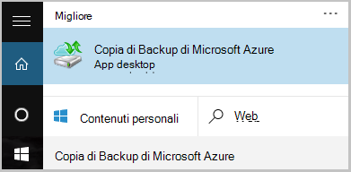

<properties
    pageTitle="Eseguire il backup di Windows server o client per Azure utilizzando il modello di distribuzione classica | Microsoft Azure"
    description="Backup Windows Server o ai client di Azure tramite la creazione di un archivio di backup, il download delle credenziali, installare l'agente di backup e il completamento di una copia di backup iniziale del file e cartelle."
    services="backup"
    documentationCenter=""
    authors="markgalioto"
    manager="cfreeman"
    editor=""
    keywords="archivio di backup; backup automatici di un server di Windows. backup windows."/>

<tags
    ms.service="backup"
    ms.workload="storage-backup-recovery"
    ms.tgt_pltfrm="na"
    ms.devlang="na"
    ms.topic="article"
    ms.date="08/08/2016"
    ms.author="jimpark; trinadhk; markgal"/>

# Eseguire il backup un client o il server di Windows Azure utilizzando il modello di distribuzione classica

> [AZURE.SELECTOR]
- [Portale classica](backup-configure-vault-classic.md)
- [Portale di Azure](backup-configure-vault.md)

In questo articolo vengono descritte le procedure da seguire per preparare l'ambiente e drill-up un client Windows server (o) in Azure. Vengono inoltre illustrate considerazioni sulla distribuzione la soluzione di backup. Se si è interessati durante il Backup di Azure per la prima volta, in questo articolo illustra rapidamente il processo.

>[AZURE.IMPORTANT] Azure include due diversi modelli di distribuzione per la creazione e utilizzo delle risorse: Gestione risorse e classica. In questo articolo è descritta utilizzando il modello di distribuzione classica. Si consiglia di più nuove distribuzioni di utilizzare il modello di Manager delle risorse.

## Prima di iniziare
Per eseguire il backup di un server o client in Azure, è necessario un account Azure. Se non si dispone di uno, è possibile creare un [account gratuito](https://azure.microsoft.com/free/) in pochi minuti.

## Passaggio 1: Creare un archivio di backup
Per eseguire il backup di file e cartelle da un client o server, è necessario creare un archivio di backup nella propria area geografica in cui si desidera archiviare i dati.

### Per creare un archivio di backup

1. Accedere al [portale di classica](https://manage.windowsazure.com/).

2. Fare clic su **Nuovo** > **Servizi dati** > **Servizi di recupero** > **Archivio di Backup**e quindi scegliere **Creazione rapida**.

3. Per il parametro **Name** , immettere un nome descrittivo per l'archivio di backup. Digitare un nome che contiene da 2 a 50 caratteri. Deve iniziare con una lettera e possono contenere solo lettere, numeri e trattini. Questo nome deve essere univoco per ogni sottoscrizione.

4. Per il parametro **area geografica** , selezionare la località geografica per l'archivio di backup. Questa scelta determina la propria area geografica in cui viene inviati i dati di backup. Scegliendo un'area geografica che si avvicina la posizione dell'utente, è possibile ridurre la latenza di rete per eseguire il backup di Azure.

5. Fare clic su **Crea archivio**.

    

    Può richiedere un po' di tempo per l'archivio di backup da creare. Per controllare lo stato, monitorare le notifiche nella parte inferiore del portale di classica.

    Dopo aver creato l'archivio di backup, verrà visualizzato un messaggio che informa che l'archivio è stato creato correttamente. Viene visualizzato anche come **attivo** nell'elenco delle risorse **Servizi di recupero** .

    

4. Selezionare l'opzione di ridondanza archiviazione seguendo la procedura descritta di seguito.

    >[AZURE.IMPORTANT] L'orario migliore per identificare l'opzione ridondanza dello spazio di archiviazione è subito dopo la creazione di archivio e prima di tutti i computer sono registrati nell'archivio. Dopo che un elemento è stato registrato all'archivio, l'opzione ridondanza dello spazio di archiviazione è bloccato e non può essere modificata.

    Se si utilizza Azure come un endpoint di archiviazione di backup principale (ad esempio, esegue il backup in Azure da un server di Windows), è consigliabile l'opzione di [archiviazione ridondanti geografico](../storage/storage-redundancy.md#geo-redundant-storage) rileva (impostazione predefinita).

    Se si utilizza Azure come un endpoint di terzo livello dello spazio di archiviazione backup (ad esempio si utilizza System Center Data Protection Manager all'archivio locale una copia di backup locale e con Azure per esigenze di conservazione a lungo termine), è consigliabile scegliere [localmente ridondante dello spazio di archiviazione](../storage/storage-redundancy.md#locally-redundant-storage). Verrà visualizzato il costo di archiviazione dati di Azure, fornendo un livello inferiore di durata per i dati che potrebbero essere accettabili per le copie di terzo livello.

    **Per selezionare l'opzione ridondanza dello spazio di archiviazione:**

    un. Fare clic su archivio che appena creato.

    b. Nella pagina Guida introduttiva scegliere **Configura**.

    

    c. Scegliere l'opzione ridondanza di archiviazione appropriato.

    Se si seleziona **Ridondanti in locale**, è necessario fare clic su **Salva** (perché **Geografico ridondanti** l'opzione predefinita).

    d. Nel riquadro di spostamento sinistra fare clic su **Servizi di recupero** per tornare all'elenco delle risorse per i servizi di recupero.

## Passaggio 2: Scaricare il file di archivio credenziali
Il computer locale deve essere autenticati con un archivio di backup prima eseguire il backup dei dati di Azure. Viene ottenuta l'autenticazione tramite *archivio credenziali*. Il file di archivio credenziali viene scaricato tramite un canale sicuro dal portale di classica. Chiave privata del certificato non viene mantenuto nel portale o il servizio.

Altre informazioni [sull'uso di archivio credenziali per l'autenticazione con il servizio di Backup](backup-introduction-to-azure-backup.md#what-is-the-vault-credential-file).

### Per scaricare il file di archivio credenziali di un computer locale

1. Nel riquadro di spostamento sinistra, fare clic su **Servizi di recupero**e quindi selezionare l'archivio di backup creato.

    

2.  Nella pagina Guida introduttiva, fare clic su **Scarica archivio credenziali**.

    Il portale classico genera credenziali archivio utilizzando una combinazione di nome dell'archivio e la data corrente. Il file di archivio credenziali viene utilizzato solo durante il flusso di lavoro di registrazione e scadenza dopo 48 ore.

    Il file di archivio credenziali può essere scaricato dal portale di.

3. Fare clic su **Salva** per scaricare il file di archivio credenziali nella cartella download dell'account locale. È anche possibile selezionare **Salva con nome** dal menu **Salva** per specificare un percorso per il file di archivio credenziali.

    >[AZURE.NOTE] Verificare che l'archivio credenziali viene salvato in un percorso accessibile dal proprio computer. Se è archiviato in un blocco di messaggi file server o Condividi, verificare di avere le autorizzazioni per l'accesso.

## Passaggio 3: Scaricare, installare e registrare l'agente di Backup
Dopo aver creato l'archivio di backup e scaricare il file di archivio credenziali, è necessario installare un agente su ciascun computer Windows.

### Per scaricare, installare e registrare l'agente

1. Fare clic su **Servizi di recupero**e quindi selezionare l'archivio di backup che si desidera eseguire la registrazione con un server.

2. Nella pagina Guida introduttiva, fare clic su agente di **Windows client o System Center Data Protection Manager o agente di Windows Server**. Fare clic su **Salva**.

    

3. Dopo il file MARSagentinstaller.exe scaricato, fare clic su **Esegui** oppure fare doppio clic su **MARSAgentInstaller.exe** dalla posizione salvata.

4. Scegliere la cartella di installazione e una cartella della cache necessari per l'agente e quindi fare clic su **Avanti**. Il percorso della cache specificate deve essere disponibile spazio uguale a almeno 5% dei dati di backup.

5. È possibile continuare a connettersi a Internet tramite le impostazioni del proxy predefinito.          Se si usa un server proxy per la connessione a Internet, nella pagina Configurazione Proxy, selezionare la casella di controllo **Usa impostazioni proxy personalizzate** e quindi immettere i dettagli di server proxy. Se si utilizza un proxy autenticato, immettere i dettagli di nome e una password utente e quindi fare clic su **Avanti**.

7. Fare clic su **Installa** per avviare l'installazione dell'agente. L'agente di Backup consente di installare Windows PowerShell e .NET Framework 4.5 (se non è già installata) per completare l'installazione.

8. Dopo aver installato l'agente, fare clic su **Continua per la registrazione** per continuare con il flusso di lavoro.

9. Nella pagina identificazione archivio individuare e selezionare il file di archivio credenziali precedentemente scaricato.

    Il file di archivio credenziali è valido solo 48 ore dopo essere stato scaricato dal portale. Se si verifica un errore in questa pagina (ad esempio "archivio credenziali file fornito è scaduto"), accedere al portale e scaricare di nuovo il file di archivio credenziali.

    Assicurarsi che il file di archivio credenziali sia disponibile in un percorso accessibili tramite l'applicazione di installazione. Se si verificano errori di accesso, copiare il file di archivio credenziali in un percorso temporaneo nello stesso computer e ripetere l'operazione.

    Se si verifica un errore di archivio credenziali, ad esempio "non valido archivio credenziali fornite", il file sia danneggiato o non sono associati le credenziali più recenti con il servizio di recupero. Ripetere l'operazione dopo il download di un nuovo file di archivio credenziali dal portale. Questo errore può verificarsi anche se si fa clic sull'opzione di **Download delle credenziali di archivio** più volte in rapida sequenza. In questo caso, solo l'ultimo file di credenziali di archivio è valido.

9. Nella pagina Impostazioni di crittografia, è possibile generare una frase o fornire una frase (con un minimo di 16 caratteri). È necessario ricordare di salvare la passphrase in un percorso sicuro.

10. Fare clic su **Fine**. Registrazione guidata Server registra il server con Backup.

    >[AZURE.WARNING] Se si perde o si dimentica la passphrase, Microsoft non consente di ripristinare i dati di backup. Si è proprietari passphrase crittografia e Microsoft non sono visibili in passphrase in uso. Salvare il file in un percorso sicuro perché devono avvenire durante un'operazione di ripristino.

11. Dopo aver impostata la chiave di crittografia, lasciare selezionata la casella di controllo **Dell'agente di servizi di avviare Microsoft Azure ripristino** e quindi fare clic su **Chiudi**.

## Passaggio 4: Completare il backup iniziale

Backup iniziale include due attività principali:

- Creare la pianificazione di backup
- Eseguire il backup dei file e cartelle per la prima volta

Al termine di backup iniziale, criteri di backup crea dei punti di backup che è possibile utilizzare per recuperare i dati. Criteri di backup responsabile in base alla pianificazione definite dall'utente.

### Per pianificare il backup

1. Aprire l'agente di Microsoft Azure Backup. (Si aprirà automaticamente se si lascia la casella di controllo **Dell'agente di servizi di avviare Microsoft Azure ripristino** selezionata quando si è chiuso registrazione guidata Server.) È possibile trovare la ricerca nel computer di **Microsoft Azure Backup**.

    

2. In agente di Backup, fare clic su **Programmazione Backup**.

    

3. Nella pagina Guida introduttiva della pianificazione guidata Backup, fare clic su **Avanti**.

4. Sugli elementi selezionare alla pagina di Backup, fare clic su **Aggiungi elementi**.

5. Selezionare il file e cartelle che si desidera eseguire il backup e quindi fare clic su **OK**.

6. Fare clic su **Avanti**.

7. Nella pagina **Imposta pianificazione Backup** specificare la **pianificazione di backup** e fare clic su **Avanti**.

    È possibile pianificare backup settimanale o giornaliera (a velocità massima di tre volte al giorno).

    

    >[AZURE.NOTE] Per ulteriori informazioni su come specificare la pianificazione di backup, vedere l'articolo [Utilizzo Azure Backup per sostituire l'infrastruttura di nastro](backup-azure-backup-cloud-as-tape.md).

8. Nella pagina **Seleziona criterio di conservazione** , selezionare il **Criterio di conservazione** per la copia di backup.

    I criteri di conservazione specificano la durata per cui verrà archiviato il backup. Appena si specifica un criterio"flat" per tutti i punti di backup, è possibile specificare i criteri di conservazione diverso in base a quando viene eseguito il backup. È possibile modificare i criteri di conservazione giornaliera, settimanale, mensile e annuale secondo le proprie esigenze.

9. Nella pagina tipo di Backup iniziale scegliere scegliere il tipo di backup iniziale. Lasciare l'opzione **automaticamente in rete** selezionata e quindi fare clic su **Avanti**.

    È possibile eseguire il backup automatico in rete oppure è possibile eseguire il backup non in linea. Il resto di questo articolo viene descritto il processo per il backup automatico. Se si preferisce eseguire un backup non in linea, consultare l'articolo [flusso di lavoro backup non in linea in Azure Backup](backup-azure-backup-import-export.md) per ulteriori informazioni.

10. Nella pagina Conferma esaminare le informazioni e quindi fare clic su **Fine**.

11. Termine della procedura guidata Creazione la pianificazione di backup, fare clic su **Chiudi**.

### Abilitare la limitazione al rete (facoltativo)

L'agente di Backup fornisce banda. La limitazione per l'utilizzo della larghezza di banda di rete durante il trasferimento di dati di controlli. Questo controllo può essere utile se è necessario eseguire il backup dei dati durante ore lavorative ma non si desidera che il processo di backup interferire con il traffico Internet. La limitazione si applica per eseguire il backup e ripristino.

**Per attivare la limitazione di rete**

1. In agente di Backup, fare clic su **Modifica proprietà**.

    

2. Nella scheda **Throttling** , selezionare la casella di controllo **Abilita l'utilizzo della larghezza di banda internet la limitazione per le operazioni di backup** .

    

3. Dopo aver attivato la limitazione, specificare la larghezza di banda consentito per il trasferimento di dati di backup durante le **ore lavorative** e **Non le ore lavorative**.

    I valori della larghezza di banda iniziano 512 kilobit al secondo (Kbps) e possono essere eseguita fino a 1.023 megabyte al secondo (MBps). È possibile impostare l'inizio e fine per **ore di lavoro**e i giorni della settimana sono i giorni lavorativi considerate. Ore di fuori ufficio designato sono considerate ore non-lavoro ore.

4. Fare clic su **OK**.

### Eseguire il backup ora

1. In agente di Backup, fare clic su **Esegui backup** per completare il seeding iniziale in rete.

    

2. Nella pagina Confirmation verificare le impostazioni che il backup ora guidato verrà utilizzato per eseguire il backup del computer. Fare clic su **Backup**.

3. Fare clic su **Chiudi** per chiudere la procedura guidata. Se si esegue questa operazione prima del completamento del processo di backup, la procedura guidata continua per l'esecuzione in background.

Al termine del primo backup, viene visualizzato lo stato **processo** nella console di Backup.

## Passaggi successivi
- Iscriversi a un [account Azure gratuito](https://azure.microsoft.com/free/).

Per ulteriori informazioni sui backup di macchine virtuali o altri carichi di lavoro, vedere:

- [Eseguire il backup macchine virtuali IaaS](backup-azure-vms-prepare.md)
- [Eseguire il backup carichi di lavoro su Azure con Server di Backup di Microsoft Azure](backup-azure-microsoft-azure-backup.md)
- [Eseguire il backup carichi di lavoro su Azure con Data Protection Manager](backup-azure-dpm-introduction.md)
