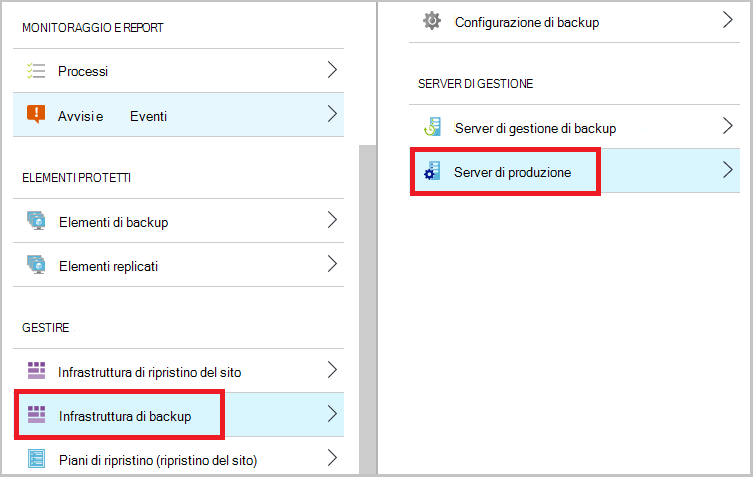

<properties
    pageTitle="Eseguire il backup di un client a Azure con Azure Backup utilizzando il modello di distribuzione di Manager delle risorse o Windows Server | Microsoft Azure"
    description="Backup Windows Server o ai client di Azure tramite la creazione di un archivio di backup, il download delle credenziali, installare l'agente di backup e il completamento di una copia di backup iniziale del file e cartelle."
    services="backup"
    documentationCenter=""
    authors="markgalioto"
    manager="cfreeman"
    editor=""
    keywords="archivio di backup; backup automatici di un server di Windows. backup windows."/>

<tags
    ms.service="backup"
    ms.workload="storage-backup-recovery"
    ms.tgt_pltfrm="na"
    ms.devlang="na"
    ms.topic="article"
    ms.date="08/10/2016"
    ms.author="jimpark; trinadhk; markgal"/>

# Eseguire il backup un client o il Server di Windows Azure utilizzando il modello di distribuzione di Manager delle risorse

> [AZURE.SELECTOR]
- [Portale di Azure](backup-configure-vault.md)
- [Portale classica](backup-configure-vault-classic.md)

In questo articolo viene spiegato come eseguire il backup del Server di Windows (o client Windows) file e cartelle in Azure con Azure Backup utilizzando il modello di distribuzione di Manager delle risorse.

[AZURE.INCLUDE [learn-about-deployment-models](../../includes/backup-deployment-models.md)]

## Prima di iniziare
Per eseguire il backup di un server o client in Azure, è necessario un account Azure. Se non si dispone di uno, è possibile creare un [account gratuito](https://azure.microsoft.com/free/) in pochi minuti.

## Passaggio 1: Creare un archivio di servizi di recupero

Un archivio di servizi di recupero è un'entità contenente tutti i backup e i punti di ripristino che creare nel tempo. Archivio di servizi di recupero contiene anche i criteri di backup applicati per le cartelle e file protetti. Quando si crea un archivio di servizi di recupero, selezionare anche l'opzione ridondanza di archiviazione appropriato.

### Per creare un archivio di servizi di recupero

1. Se non è già fatto, accedere al [Portale di Azure](https://portal.azure.com/) usando l'abbonamento Azure.

2. Nel menu Hub fare clic su **Sfoglia** e nell'elenco delle risorse, digitare **I servizi di recupero**. Quando si inizia a digitare, l'elenco verrà applicato un filtro in base all'input. Fare clic su **servizi di recupero archivi**.

      

    L'elenco degli archivi di servizi di recupero.

3. Nel menu **archivi di servizi di recupero** , fare clic su **Aggiungi**.

    

    Verrà visualizzata e l'archivio servizi di recupero che richiede di specificare un **nome**, **l'abbonamento**, **gruppo di risorse**e **posizione**.

    

4. Per **nome**immettere un nome descrittivo per identificare l'archivio. Il nome deve essere univoco per la sottoscrizione Azure. Digitare un nome che contiene da 2 a 50 caratteri. Deve iniziare con una lettera e possono contenere solo lettere, numeri e trattini.

5. Fare clic su **sottoscrizione** per visualizzare l'elenco delle sottoscrizioni disponibile. Se non si è certi di quale abbonamento da usare, usare il valore predefinito (o suggeriti) abbonamento. Si verificherà scelte multiple solo se l'account aziendale è associata a più abbonamenti Azure.

6. Fare clic su **gruppo di risorse** per visualizzare l'elenco dei gruppi di risorse disponibile oppure fare clic su **Nuovo** per creare un nuovo gruppo di risorse. Per informazioni complete sui gruppi di risorse, vedere [Panoramica di gestione risorse di Azure](../azure-resource-manager/resource-group-overview.md)

7. Fare clic su **posizione** per selezionare la località geografica per l'archivio. Questa scelta determina la propria area geografica in cui viene inviati i dati di backup. Scegliendo un'area geografica che si avvicina la posizione dell'utente, è possibile ridurre la latenza di rete per eseguire il backup di Azure.

8. Fare clic su **Crea**. Può richiedere un po' di tempo per l'archivio di servizi di recupero da creare. Eseguire il monitoraggio delle notifiche sullo stato nell'area superiore destro nel portale. Dopo aver creato l'archivio, per l'apertura del portale. Se non è visibile l'archivio elencato dopo aver completato, fare clic su **Aggiorna**. Quando si aggiorna l'elenco, fare clic sul nome dell'archivio.

### Per determinare la ridondanza dell'archiviazione
Quando si crea un archivio di servizi di recupero è determinare la modalità di replica di spazio di archiviazione.

1. In e **l'Impostazioni** , viene aperto automaticamente con il dashboard di archivio, fare clic su **Infrastruttura di Backup**.

2. In e dell'infrastruttura di Backup, fare clic su **Configurazione di Backup** per visualizzare il **tipo di replica di spazio di archiviazione**.

    

3. Scegliere l'opzione di replica di spazio di archiviazione per l'archivio.

    

    Per impostazione predefinita, l'archivio dispone di spazio di archiviazione ridondanti geografico. Se si utilizza Azure come un endpoint di archiviazione di backup principale, continuare a usare lo spazio di archiviazione ridondanti geografico. Se si utilizza Azure come un endpoint di archiviazione di backup non primario, quindi scegliere archiviazione localmente ridondanti, che consente di ridurre il costo di archiviazione dei dati in Azure. Per saperne di più sui [geografico ridondanti](../storage/storage-redundancy.md#geo-redundant-storage) e [localmente ridondanti](../storage/storage-redundancy.md#locally-redundant-storage) opzioni relative all'archiviazione in questa [Panoramica](../storage/storage-redundancy.md).

    Dopo aver selezionato l'opzione di spazio di archiviazione per l'archivio, si è pronti associare l'archivio di file e cartelle.

Dopo aver creato un archivio, si preparare l'infrastruttura di backup dei file e cartelle, scaricare e installare l'agente di servizi di recupero di Microsoft Azure, scaricare archivio credenziali e le credenziali per registrare l'agente con l'archivio.

## Passaggio 2 - file di Download

>[AZURE.NOTE] Copia di backup attivazione tramite il portale di Azure sarà presto disponibile. In questa fase, utilizzare i servizi Microsoft Azure agente locale per eseguire il backup dei file e cartelle.

1. Fare clic su **Impostazioni** nel dashboard di archivio di servizi di recupero.

    

2. Fare clic su **Introduzione > Backup** in e l'impostazioni.

    

3. Scegliere **obiettivo di Backup** e il Backup.

    

4. Selezionare **locale** da, dove è il carico di lavoro in esecuzione? menu.

5. Selezionare **file e cartelle** da cosa si desidera eseguire il backup? menu, fare clic su **OK**.

#### Scaricare l'agente di servizi di recupero

1. Fare clic su **Scarica agente di Windows Server o Client Windows** e il **Prepara infrastruttura** .

    

2. Fare clic su **Salva** nel popup del download. Per impostazione predefinita, **MARSagentinstaller.exe** viene salvato nella cartella download.

#### Scaricare l'archivio credenziali

1. Fare clic su **scaricare > Salva** in e l'infrastruttura preparare.

    

## Passaggio 3 - installa e registra l'agente

1. Individuare e fare doppio clic su **MARSagentinstaller.exe** dalla cartella download (o un'altra posizione salvata).

2. Completare la configurazione guidata di Microsoft Azure ripristino servizi agente. Per completare la procedura guidata, è necessario:

    - Scegliere un percorso per l'installazione e la cartella della cache.
    - Specificare il proxy di informazioni sul server se si usa un server proxy per la connessione a internet.
    - Fornire all'utente nome e la password se si utilizza un proxy autenticato.
    - Specificare le credenziali di archivio scaricato
    - Salvare la passphrase crittografia in un percorso sicuro.

    >[AZURE.NOTE] Se si perde o si dimentica la passphrase, Microsoft non consente di recuperare i dati di backup. Salvare il file in un percorso sicuro. È necessario ripristinare una copia di backup.

L'agente è stato installato e il computer è registrato all'archivio. Si è pronti per configurare e pianificare il backup.

### Confermare l'installazione

Per verificare che l'agente è stato installato e registrato correttamente, è possibile cercare gli elementi di che backup nella sezione **Server di produzione** del portale di gestione. Per procedere come segue:

1. Accedere al [Portale di Azure](https://portal.azure.com/) usando l'abbonamento Azure.

2. Nel menu Hub fare clic su **Sfoglia** e nell'elenco delle risorse, digitare **I servizi di recupero**. Quando si inizia a digitare, l'elenco verrà applicato un filtro in base all'input. Fare clic su **servizi di recupero archivi**.

      

    L'elenco degli archivi di servizi di recupero.

2. Selezionare il nome dell'archivio che è stato creato.

    Verrà visualizzata e il ripristino servizi archivio dashboard.

      

3. Fare clic sul pulsante **Impostazioni** nella parte superiore della pagina.

4. Fare clic su **dell'infrastruttura di Backup > server di produzione**.

    

Se viene visualizzato il server nell'elenco, è necessario conferma che l'agente è stata installata e registrato correttamente.

## Passaggio 4: Completare il backup iniziale

Backup iniziale include due attività principali:

- Pianificare il backup
- Backup automatici di file e cartelle per la prima volta

Per completare il backup iniziale, utilizzare l'agente di backup di Microsoft Azure.

### Per pianificare il backup

1. Aprire l'agente di Microsoft Azure Backup. È possibile trovare la ricerca nel computer di **Microsoft Azure Backup**.

    

2. In agente di Backup, fare clic su **Programmazione Backup**.

    

3. Nella pagina Guida introduttiva della pianificazione guidata Backup, fare clic su **Avanti**.

4. Sugli elementi selezionare alla pagina di Backup, fare clic su **Aggiungi elementi**.

5. Selezionare il file e cartelle che si desidera eseguire il backup e quindi fare clic su **OK**.

6. Fare clic su **Avanti**.

7. Nella pagina **Imposta pianificazione Backup** specificare la **pianificazione di backup** e fare clic su **Avanti**.

    È possibile pianificare backup settimanale o giornaliera (a velocità massima di tre volte al giorno).

    

    >[AZURE.NOTE] Per ulteriori informazioni su come specificare la pianificazione di backup, vedere l'articolo [Utilizzo Azure Backup per sostituire l'infrastruttura di nastro](backup-azure-backup-cloud-as-tape.md).

8. Nella pagina **Seleziona criterio di conservazione** , selezionare il **Criterio di conservazione** per la copia di backup.

    I criteri di conservazione specificano la durata per cui verrà archiviato il backup. Appena si specifica un criterio"flat" per tutti i punti di backup, è possibile specificare i criteri di conservazione diverso in base a quando viene eseguito il backup. È possibile modificare i criteri di conservazione giornaliera, settimanale, mensile e annuale secondo le proprie esigenze.

9. Nella pagina tipo di Backup iniziale scegliere scegliere il tipo di backup iniziale. Lasciare l'opzione **automaticamente in rete** selezionata e quindi fare clic su **Avanti**.

    È possibile eseguire il backup automatico in rete oppure è possibile eseguire il backup non in linea. Il resto di questo articolo viene descritto il processo per il backup automatico. Se si preferisce eseguire un backup non in linea, consultare l'articolo [flusso di lavoro backup non in linea in Azure Backup](backup-azure-backup-import-export.md) per ulteriori informazioni.

10. Nella pagina Conferma esaminare le informazioni e quindi fare clic su **Fine**.

11. Termine della procedura guidata Creazione la pianificazione di backup, fare clic su **Chiudi**.

### Abilitare la limitazione al rete (facoltativo)

L'agente di backup fornisce banda. La limitazione per l'utilizzo della larghezza di banda di rete durante il trasferimento di dati di controlli. Questo controllo può essere utile se è necessario eseguire il backup dei dati durante ore lavorative ma non si desidera che il processo di backup interferire con il traffico Internet. La limitazione si applica per eseguire il backup e ripristino.

>[AZURE.NOTE] Limitazione di rete non è disponibile in Windows Server 2008 R2 SP1, Windows Server 2008 SP2 o Windows 7 (con service pack). La rete di Backup di Azure limitazione caratteristica coinvolge qualità del servizio (QoS) nel sistema operativo locale. Se il Backup di Azure proteggere questi sistemi operativi, la versione di QoS disponibili per le piattaforme non funziona con banda Azure Backup. Limitazione della rete può essere usata su altri [sistemi operativi supportati](backup-azure-backup-faq.md#installation-amp-configuration).

**Per attivare la limitazione di rete**

1. In agente di backup, fare clic su **Modifica proprietà**.

    

2. Nella scheda **Throttling** , selezionare la casella di controllo **Abilita l'utilizzo della larghezza di banda internet la limitazione per le operazioni di backup** .

    

3. Dopo aver attivato la limitazione, specificare la larghezza di banda consentito per il trasferimento di dati di backup durante le **ore lavorative** e **Non le ore lavorative**.

    I valori della larghezza di banda iniziano 512 kilobit al secondo (Kbps) e possono essere eseguita fino a 1.023 megabyte al secondo (MBps). È possibile impostare l'inizio e fine per **ore di lavoro**e i giorni della settimana sono i giorni lavorativi considerate. Ore di fuori ufficio designato sono considerate ore non-lavoro ore.

4. Fare clic su **OK**.

### Eseguire il backup di file e cartelle per la prima volta

1. In agente di backup, fare clic su **Esegui backup** per completare il seeding iniziale in rete.

    

2. Nella pagina Confirmation verificare le impostazioni che il backup ora guidato verrà utilizzato per eseguire il backup del computer. Fare clic su **Backup**.

3. Fare clic su **Chiudi** per chiudere la procedura guidata. Se si esegue questa operazione prima del completamento del processo di backup, la procedura guidata continua per l'esecuzione in background.

Al termine del primo backup, viene visualizzato lo stato **processo** nella console di Backup.

## Domande?
In caso di dubbi o qualsiasi funzione che si vuole vedere inclusi, [inviare un feedback](http://aka.ms/azurebackup_feedback).

## Passaggi successivi
Per ulteriori informazioni sui backup di macchine virtuali o altri carichi di lavoro, vedere:

- Ora che è stato eseguito il backup di file e cartelle, è possibile [gestire archivi e server](backup-azure-manage-windows-server.md).
- Se è necessario ripristinare una copia di backup, usare questo articolo per [ripristinare i file in un computer Windows](backup-azure-restore-windows-server.md).
