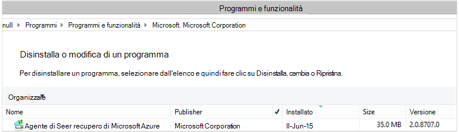

<properties
    pageTitle="Azure Backup - distribuzione e la gestione indietro per Data Protection Manager tramite PowerShell | Microsoft Azure"
    description="Informazioni su come distribuire e gestire Backup Azure per Data Protection Manager (DPM) tramite PowerShell"
    services="backup"
    documentationCenter=""
    authors="Nkolli1"
    manager="shreeshd"
    editor=""/>

<tags
    ms.service="backup"
    ms.workload="storage-backup-recovery"
    ms.tgt_pltfrm="na"
    ms.devlang="na"
    ms.topic="article"
    ms.date="09/27/2016"
    ms.author="jimpark; trinadhk; anuragm; markgal"/>


# <a name="deploy-and-manage-backup-to-azure-for-data-protection-manager-dpm-servers-using-powershell"></a>Distribuire e gestire backup in Azure per server Data Protection Manager (DPM) tramite PowerShell

> [AZURE.SELECTOR]
- [PROCESSORE](backup-dpm-automation.md)
- [Classica](backup-dpm-automation-classic.md)

In questo articolo viene illustrato come usare PowerShell per la configurazione Azure Backup in un server Data Protection Manager e per la gestione di backup e ripristino.

## <a name="setting-up-the-powershell-environment"></a>Impostazione dell'ambiente di PowerShell

[AZURE.INCLUDE [learn-about-deployment-models](../../includes/learn-about-deployment-models-include.md)]

Prima di poter utilizzare PowerShell per gestire l'esecuzione di backup da Data Protection Manager in Azure, è necessario che l'ambiente di destra nel PowerShell. All'inizio della sessione di PowerShell, assicurarsi di eseguire il seguente comando per importare i moduli destro e consentono di fare riferimento correttamente i cmdlet di Data Protection Manager:

```
PS C:> & "C:\Program Files\Microsoft System Center 2012 R2\DPM\DPM\bin\DpmCliInitScript.ps1"

Welcome to the DPM Management Shell!

Full list of cmdlets: Get-Command
Only DPM cmdlets: Get-DPMCommand
Get general help: help
Get help for a cmdlet: help <cmdlet-name> or <cmdlet-name> -?
Get definition of a cmdlet: Get-Command <cmdlet-name> -Syntax
Sample DPM scripts: Get-DPMSampleScript
```

## <a name="setup-and-registration"></a>Installazione e la registrazione
Per iniziare:

1. [Scaricare PowerShell più recente](https://github.com/Azure/azure-powershell/releases) (versione minima necessaria è: 1.0.0)
2. Abilitare i cmdlet di Azure Backup passando alla modalità *AzureResourceManager* tramite il **Parametro AzureMode** cmdlet:

```
PS C:\> Switch-AzureMode AzureResourceManager
```

Con PowerShell, è possono automatizzare le attività di configurazione e la registrazione seguenti:

- Creare un archivio di backup
- Installazione dell'agente di Backup di Azure
- La registrazione con il servizio di Backup di Azure
- Impostazioni di rete
- Impostazioni di crittografia

### <a name="create-a-backup-vault"></a>Creare un archivio di backup

> [AZURE.WARNING] Se si utilizza il Backup di Azure per la prima volta, è necessario registrare il provider di Azure Backup da utilizzare con l'abbonamento. A tale scopo, eseguire il comando seguente: registro AzureProvider - ProviderNamespace "Microsoft.Backup"

È possibile creare un nuovo archivio di backup utilizzando il cmdlet **New-AzureRMBackupVault** . Archivio di backup è una risorsa ARM, pertanto è necessario inserire all'interno di un gruppo di risorse. In una console di PowerShell Azure con privilegi elevata, eseguire i comandi seguenti:

```
PS C:\> New-AzureResourceGroup –Name “test-rg” -Region “West US”
PS C:\> $backupvault = New-AzureRMBackupVault –ResourceGroupName “test-rg” –Name “test-vault” –Region “West US” –Storage GRS
```

È possibile ottenere un elenco di tutti gli archivi di backup in un abbonamento specificato utilizzando il cmdlet **Get-AzureRMBackupVault** .


### <a name="installing-the-azure-backup-agent-on-a-dpm-server"></a>Installare l'agente di Azure Backup in un Server Data Protection Manager
Prima di installare l'agente di Backup di Azure, è necessario avere il programma di installazione scaricato e presenta in Windows Server. È possibile ottenere la versione più recente del programma di installazione dall' [Area Download Microsoft](http://aka.ms/azurebackup_agent) o dalla pagina Dashboard dell'archivio backup. Salvare il programma di installazione in una posizione facilmente accessibile come * C:\Downloads\*.

Per installare l'agente, eseguire il comando seguente in un elevati PowerShell console **nel server Data Protection Manager**:

```
PS C:\> MARSAgentInstaller.exe /q
```

Consente di installare l'agente con tutte le opzioni predefinite. L'installazione sono necessari alcuni minuti in background. Se non si specifica l'opzione */nu* che verrà aperta la finestra di **Windows Update** al termine dell'installazione per verificare la presenza di aggiornamenti.

L'agente verrà visualizzato nell'elenco dei programmi installati. Per visualizzare l'elenco dei programmi attualmente installati, passare al **Pannello di controllo** > **programmi** > **programmi e funzionalità**.



#### <a name="installation-options"></a>Opzioni di installazione
Per visualizzare tutte le opzioni disponibili tramite la riga di comando, utilizzare il comando seguente:

```
PS C:\> MARSAgentInstaller.exe /?
```

Le opzioni disponibili includono:

| Opzione | Dettagli | Impostazione predefinita |
| ---- | ----- | ----- |
| /q | Installazione automatica | - |
| /p: "posizione" | Percorso della cartella di installazione per l'agente di Backup di Azure. | C:\Programmi\Microsoft ripristino Azure servizi Agent |
| /s: "posizione" | Percorso della cartella della cache per l'agente di Backup di Azure. | C:\Programmi\Microsoft c:\Programmi\Microsoft ripristino Azure servizi Agent\Scratch |
| /m | Selezionare il Microsoft Update | - |
| /Nu | Controllare gli aggiornamenti al termine dell'installazione | - |
| /d | Disinstalla agente di servizi di recupero Microsoft Azure | - |
| /pH | Indirizzo proxy Host | - |
| /PO | Numero di porta Host proxy | - |
| /pu | Nome utente Host proxy | - |
| /pw | Password del proxy | - |

### <a name="registering-with-the-azure-backup-service"></a>La registrazione con il servizio di Backup di Azure
È possibile registrare con il servizio di Backup di Azure, è necessario assicurarsi che siano soddisfatti i [Prerequisiti](backup-azure-dpm-introduction.md) . È necessario:

- Ha un abbonamento valido a Azure
- Ha un archivio di backup

Per scaricare le credenziali di archivio, eseguire il cmdlet **Get-AzureBackupVaultCredentials** in una console di PowerShell Azure e archiviarlo in una posizione centralizzata come * C:\Downloads\*.

```
PS C:\> $credspath = "C:\"
PS C:\> $credsfilename = Get-AzureRMBackupVaultCredentials -Vault $backupvault -TargetLocation $credspath
PS C:\> $credsfilename
f5303a0b-fae4-4cdb-b44d-0e4c032dde26_backuprg_backuprn_2015-08-11--06-22-35.VaultCredentials
```

La registrazione del computer con l'archivio è stata completata utilizzando il cmdlet [Start DPMCloudRegistration](https://technet.microsoft.com/library/jj612787) :

```
PS C:\> $cred = $credspath + $credsfilename
PS C:\> Start-DPMCloudRegistration -DPMServerName "TestingServer" -VaultCredentialsFilePath $cred
```

In questo verrà registrato il Server di Data Protection Manager denominato "TestingServer" a Microsoft Azure archivio credenziali archivio specificato.

> [AZURE.IMPORTANT] Non utilizzare percorsi relativi per specificare il file di archivio credenziali. È necessario specificare un percorso assoluto come input al cmdlet.

### <a name="initial-configuration-settings"></a>Impostazioni di configurazione iniziale
Dopo che il Server Data Protection Manager è registrato con l'archivio di Backup di Azure, verrà avviato con impostazioni di sottoscrizione. Queste impostazioni di sottoscrizione di rete, sulla crittografia e area di gestione temporanea. Per iniziare a modificare le impostazioni di sottoscrizione che è necessario innanzitutto ottenere un handle alle impostazioni (impostazione predefinita) esistenti utilizzando il cmdlet [Get-DPMCloudSubscriptionSetting](https://technet.microsoft.com/library/jj612793) :

```
$setting = Get-DPMCloudSubscriptionSetting -DPMServerName "TestingServer"
```

Tutte le modifiche apportate all'oggetto PowerShell locale ```$setting``` e quindi l'oggetto completa si impegna a Data Protection Manager e Azure Backup di salvarli utilizzando il cmdlet [Set-DPMCloudSubscriptionSetting](https://technet.microsoft.com/library/jj612791) . È necessario utilizzare la ```–Commit``` contrassegno per garantire che le modifiche vengono mantenute. Le impostazioni verranno non applicate e utilizzate da Azure Backup, a meno che non approvata.

```
PS C:\> Set-DPMCloudSubscriptionSetting -DPMServerName "TestingServer" -SubscriptionSetting $setting -Commit
```

### <a name="networking"></a>Rete
Se la connessione del computer Data Protection Manager per il servizio di Backup di Azure su internet è un server proxy, per i backup a buon fine è necessario fornire le impostazioni del server proxy. In tal caso, utilizzando il ```-ProxyServer```, ```-ProxyPort```, ```-ProxyUsername``` e ```ProxyPassword``` parametri con il cmdlet [Set-DPMCloudSubscriptionSetting](https://technet.microsoft.com/library/jj612791) . In questo esempio è un server proxy in modo che è in corso in modo esplicito deselezionando le informazioni relative al proxy.

```
PS C:\> Set-DPMCloudSubscriptionSetting -DPMServerName "TestingServer" -SubscriptionSetting $setting -NoProxy
```

È anche possibile controllare l'utilizzo della larghezza di banda con le opzioni di ```-WorkHourBandwidth``` e ```-NonWorkHourBandwidth``` per un determinato insieme di giorni della settimana. In questo esempio è in corso la non qualsiasi limitazione.

```
PS C:\> Set-DPMCloudSubscriptionSetting -DPMServerName "TestingServer" -SubscriptionSetting $setting -NoThrottle
```

### <a name="configuring-the-staging-area"></a>Configurare l'Area di gestione temporanea
L'agente di Backup di Azure con il server Data Protection Manager deve temporaneo dello spazio di archiviazione per i dati ripristinati dal cloud (area di gestione temporanea locale). Configurare l'area di gestione temporanea utilizzando il cmdlet [Set-DPMCloudSubscriptionSetting](https://technet.microsoft.com/library/jj612791) e ```-StagingAreaPath``` parametro.

```
PS C:\> Set-DPMCloudSubscriptionSetting -DPMServerName "TestingServer" -SubscriptionSetting $setting -StagingAreaPath "C:\StagingArea"
```

Nell'esempio precedente, area di gestione temporanea verrà *C:\StagingArea* nell'oggetto PowerShell ```$setting```. Assicurarsi che la cartella specificata esiste già, altrimenti non viene eseguito il commit finale delle impostazioni di sottoscrizione.


### <a name="encryption-settings"></a>Impostazioni di crittografia
I dati di backup inviati Azure Backup sono crittografati per proteggere la riservatezza dei dati. La crittografia passphrase è "password" per decrittografare i dati in fase di ripristino. È importante mantenere queste informazioni e sicura dopo che è stata impostata.

Nell'esempio seguente, il primo comando viene convertita la stringa ```passphrase123456789``` a una stringa protetta e assegna la stringa protetta della variabile denominata ```$Passphrase```. il secondo comando imposta la stringa protetta ```$Passphrase``` come la password per la crittografia di backup.

```
PS C:\> $Passphrase = ConvertTo-SecureString -string "passphrase123456789" -AsPlainText -Force

PS C:\> Set-DPMCloudSubscriptionSetting -DPMServerName "TestingServer" -SubscriptionSetting $setting -EncryptionPassphrase $Passphrase
```

> [AZURE.IMPORTANT] Mantenere le informazioni di passphrase e sicura dopo che è stata impostata. Non sarà possibile ripristinare i dati da Azure senza questo passphrase.

A questo punto dovrebbe apportate tutte le modifiche necessarie per la ```$setting``` oggetto. È necessario ricordare di salvare le modifiche.

```
PS C:\> Set-DPMCloudSubscriptionSetting -DPMServerName "TestingServer" -SubscriptionSetting $setting -Commit
```

## <a name="protect-data-to-azure-backup"></a>Proteggere i dati eseguire il Backup di Azure
In questa sezione, si verrà aggiunto un server di produzione a Data Protection Manager e quindi proteggere i dati in un archivio locale Data Protection Manager e quindi eseguire il Backup di Azure. Negli esempi verrà illustrato il backup di file e cartelle. La logica può essere facilmente esteso per eseguire il backup origini dati supportate Data Protection Manager. Tutti i backup di Data Protection Manager dipendono dal gruppo di protezione (pagina) con quattro parti:

1. **I membri del gruppo** è riportato un elenco di tutti i da proteggere gli oggetti (noto anche come *origini dati* in Data Protection Manager) che si desidera proteggere nello stesso gruppo di protezione. Ad esempio, può essere necessario proteggere produzione macchine virtuali in un gruppo di protezione e i database di SQL Server in un altro gruppo di protezione come presentare diverse esigenze di backup. Prima che è possibile eseguire il backup qualsiasi origine dati in un server di produzione che è necessario assicurarsi che l'agente protezione dati viene installato sul server e viene gestita da Data Protection Manager. Seguire i passaggi per [installare l'agente protezione dati](https://technet.microsoft.com/library/bb870935.aspx) e il collegamento al Server Data Protection Manager appropriato.
2. **Metodo protezione dati** specifica le posizioni backup di destinazione - nastro, disco e cloud. In questo esempio abbiamo per proteggere i dati sul disco locale e nel cloud.
3. **Pianificazione di backup** che specifica quando necessitano adottate backup e con quale frequenza i dati vengono sincronizzati tra il Server Data Protection Manager e il server di produzione.
4. **Pianificazione di conservazione** che specifica il tempo per la conservazione dei punti di ripristino di Azure.

### <a name="creating-a-protection-group"></a>Creazione di un gruppo di protezione
Iniziare creando un nuovo gruppo di protezione utilizzando il cmdlet [New-DPMProtectionGroup](https://technet.microsoft.com/library/hh881722) .

```
PS C:\> $PG = New-DPMProtectionGroup -DPMServerName " TestingServer " -Name "ProtectGroup01"
```

Il cmdlet precedente verrà creato un gruppo di protezione denominato *ProtectGroup01*. Un gruppo di protezione esistente possa essere modificato in un secondo momento per aggiungere backup nel cloud Azure. Tuttavia, per apportare modifiche al gruppo di protezione - nuovo o esistente, è necessario gestire, in un oggetto *modificabile* utilizzando il cmdlet [Get-DPMModifiableProtectionGroup](https://technet.microsoft.com/library/hh881713) .

```
PS C:\> $MPG = Get-ModifiableProtectionGroup $PG
```

### <a name="adding-group-members-to-the-protection-group"></a>Aggiunta di membri del gruppo al gruppo di protezione
Ogni agente protezione dati conosca l'elenco di origini dati nel server che è installata nel. Per aggiungere un'origine dati al gruppo di protezione, è necessario innanzitutto inviare un elenco delle origini dati al server Data Protection Manager l'agente protezione dati. Uno o più origini dati sono quindi selezionate e aggiunta al gruppo di protezione. La procedura di PowerShell necessaria per sfruttare ottenere questo sono:

1. Recuperare un elenco di tutti i server gestiti da Data Protection Manager tramite l'agente protezione dati.
2. Scegliere un server specifico.
3. Recuperare un elenco di tutte le origini dati nel server.
4. Scegliere uno o più origini dati e aggiungerli al gruppo di protezione

L'elenco dei server in cui è installato l'agente protezione dati e viene gestito tramite il Server Data Protection Manager viene acquisita con il cmdlet [Get-DPMProductionServer](https://technet.microsoft.com/library/hh881600) . In questo esempio verrà filtrare e configurare solo PS con nome *productionserver01* per il backup.

```
PS C:\> $server = Get-ProductionServer -DPMServerName "TestingServer" | where {($_.servername) –contains “productionserver01”
```

A questo punto recuperare l'elenco di origini dati nel ```$server``` utilizzando il cmdlet [Get-DPMDatasource](https://technet.microsoft.com/library/hh881605) . In questo esempio è in corso il filtro per il volume *d:\* che si desidera configurare per il backup. L'origine dati viene quindi aggiunto al gruppo di protezione tramite il cmdlet [DPMChildDatasource Aggiungi](https://technet.microsoft.com/library/hh881732) . È necessario utilizzare la *oggetto gruppo di protezione modifable * ```$MPG``` per eseguire le aggiunte.

```
PS C:\> $DS = Get-Datasource -ProductionServer $server -Inquire | where { $_.Name -contains “D:\” }

PS C:\> Add-DPMChildDatasource -ProtectionGroup $MPG -ChildDatasource $DS
```

Ripetere questo passaggio il numero di volte in base alle esigenze fino ad aggiungere tutte le origini dati scelte al gruppo di protezione. È anche possibile iniziare con una sola origine dati e completare il flusso di lavoro per la creazione del gruppo di protezione e in un secondo momento aggiungere altre origini dati al gruppo di protezione.

### <a name="selecting-the-data-protection-method"></a>Selezione del metodo di protezione dei dati
Dopo aver creato le origini dati sono stati aggiunti al gruppo di protezione, il passaggio successivo consiste per specificare il metodo di protezione utilizzando il cmdlet [Set-DPMProtectionType](https://technet.microsoft.com/library/hh881725) . In questo esempio, gruppo protezione sarà il programma di installazione per il backup di cloud e disco locale. Inoltre, è necessario specificare l'origine dati che si desidera proteggere cloud utilizzando il cmdlet [Aggiungi DPMChildDatasource](https://technet.microsoft.com/library/hh881732.aspx) con - flag Online.

```
PS C:\> Set-DPMProtectionType -ProtectionGroup $MPG -ShortTerm Disk –LongTerm Online
PS C:\> Add-DPMChildDatasource -ProtectionGroup $MPG -ChildDatasource $DS –Online
```

### <a name="setting-the-retention-range"></a>Impostazione dell'intervallo di criteri di conservazione
Impostare i criteri di conservazione per i punti di backup utilizzando il cmdlet [Set-DPMPolicyObjective](https://technet.microsoft.com/library/hh881762) . Anche se può sembrare dispari impostare i criteri di conservazione prima che è stata definita la pianificazione di backup, utilizzando il ```Set-DPMPolicyObjective``` cmdlet viene impostata automaticamente una pianificazione di backup predefinito che può quindi essere modificata. È sempre possibile impostare il backup primi nella programmazione e i criteri di conservazione dopo.

Nell'esempio seguente, il cmdlet imposta i parametri di conservazione per i backup su disco. Questo manterranno l'esecuzione di backup per 10 giorni e sincronizzazione dei dati ogni 6 ore tra il server di produzione e il server Data Protection Manager. Il ```SynchronizationFrequencyMinutes``` non definire con quale frequenza backup viene creato un punto, ma come spesso i dati vengono copiati al server Data Protection Manager. In questo modo backup diventando troppo grande.

```
PS C:\> Set-DPMPolicyObjective –ProtectionGroup $MPG -RetentionRangeInDays 10 -SynchronizationFrequencyMinutes 360
```

Per i backup di Azure (Data Protection Manager si riferisce a questi come backup in linea) gli intervalli di conservazione possono essere configurati per [la conservazione a lungo termine utilizzando una combinazione di nonno-padre-figlio (condivisione file di Groove)](backup-azure-backup-cloud-as-tape.md). Ovvero, è possibile definire un criterio di conservazione combinato riguardanti giornaliera, settimanale, mensile e annuale dei criteri di conservazione. In questo esempio, si crea una matrice che rappresenta la combinazione di conservazione complesse che si desidera e quindi configurare l'intervallo di criteri di conservazione utilizzando il cmdlet [Set-DPMPolicyObjective](https://technet.microsoft.com/library/hh881762) .

```
PS C:\> $RRlist = @()
PS C:\> $RRList += (New-Object -TypeName Microsoft.Internal.EnterpriseStorage.Dls.UI.ObjectModel.OMCommon.RetentionRange -ArgumentList 180, Days)
PS C:\> $RRList += (New-Object -TypeName Microsoft.Internal.EnterpriseStorage.Dls.UI.ObjectModel.OMCommon.RetentionRange -ArgumentList 104, Weeks)
PS C:\> $RRList += (New-Object -TypeName Microsoft.Internal.EnterpriseStorage.Dls.UI.ObjectModel.OMCommon.RetentionRange -ArgumentList 60, Month)
PS C:\> $RRList += (New-Object -TypeName Microsoft.Internal.EnterpriseStorage.Dls.UI.ObjectModel.OMCommon.RetentionRange -ArgumentList 10, Years)
PS C:\> Set-DPMPolicyObjective –ProtectionGroup $MPG -OnlineRetentionRangeList $RRlist
```

### <a name="set-the-backup-schedule"></a>Impostare la pianificazione di backup
Per impostare una pianificazione di backup predefinito automaticamente se si specifica la protezione assuma con la ```Set-DPMPolicyObjective``` cmdlet. Per modificare le pianificazioni predefinite, utilizzare il cmdlet [Get-DPMPolicySchedule](https://technet.microsoft.com/library/hh881749) seguito dal cmdlet [Set-DPMPolicySchedule](https://technet.microsoft.com/library/hh881723) .

```
PS C:\> $onlineSch = Get-DPMPolicySchedule -ProtectionGroup $mpg -LongTerm Online
PS C:\> Set-DPMPolicySchedule -ProtectionGroup $MPG -Schedule $onlineSch[0] -TimesOfDay 02:00
PS C:\> Set-DPMPolicySchedule -ProtectionGroup $MPG -Schedule $onlineSch[1] -TimesOfDay 02:00 -DaysOfWeek Sa,Su –Interval 1
PS C:\> Set-DPMPolicySchedule -ProtectionGroup $MPG -Schedule $onlineSch[2] -TimesOfDay 02:00 -RelativeIntervals First,Third –DaysOfWeek Sa
PS C:\> Set-DPMPolicySchedule -ProtectionGroup $MPG -Schedule $onlineSch[3] -TimesOfDay 02:00 -DaysOfMonth 2,5,8,9 -Months Jan,Jul
PS C:\> Set-DPMProtectionGroup -ProtectionGroup $MPG
```

Nell'esempio precedente, ```$onlineSch``` in forma di matrice con quattro elementi che contiene la pianificazione della protezione online esistente per il gruppo di protezione nello schema di condivisione file di Groove:

1. ```$onlineSch[0]```conterrà pianificazione giornaliera
2. ```$onlineSch[1]```conterrà la pianificazione settimanale
3. ```$onlineSch[2]```conterrà la pianificazione mensile
4. ```$onlineSch[3]```conterrà la programmazione annua

Se è necessario modificare la pianificazione settimanale, è necessario consultare la ```$onlineSch[1]```.

### <a name="initial-backup"></a>Backup iniziale
Per eseguire il backup di un'origine dati per la prima volta, necessità di creare una replica iniziale in modo da creare una copia dell'origine dati da proteggere nel volume di replica Data Protection Manager. Questa attività è possono essere pianificata per un'ora specifica oppure possono essere avviata manualmente, utilizzando il cmdlet [Set-DPMReplicaCreationMethod](https://technet.microsoft.com/library/hh881715) con il parametro ```-NOW```.

```
PS C:\> Set-DPMReplicaCreationMethod -ProtectionGroup $MPG -NOW
```
### <a name="changing-the-size-of-dpm-replica--recovery-point-volume"></a>Modificare la dimensione di Replica Data Protection Manager e volume del punto di ripristino
È inoltre possibile modificare le dimensioni del volume di Replica Data Protection Manager, nonché volume copia utilizzando il cmdlet [Set-DPMDatasourceDiskAllocation](https://technet.microsoft.com/library/hh881618.aspx) come nell'esempio seguente: Get-DatasourceDiskAllocation - Datasource $DS Set-DatasourceDiskAllocation - Datasource $DS - ProtectionGroup $MPG-manuale - ReplicaArea (2 gb) - ShadowCopyArea (2 gb)

### <a name="committing-the-changes-to-the-protection-group"></a>Le modifiche al gruppo di protezione
Infine, le modifiche devono essere approvata prima Data Protection Manager è possibile eseguire il backup per la configurazione di protezione gruppo nuovo. Questa operazione viene eseguita mediante il cmdlet [Set-DPMProtectionGroup](https://technet.microsoft.com/library/hh881758) .

```
PS C:\> Set-DPMProtectionGroup -ProtectionGroup $MPG
```
## <a name="view-the-backup-points"></a>Visualizzare i punti di backup
È possibile utilizzare il cmdlet [Get-DPMRecoveryPoint](https://technet.microsoft.com/library/hh881746) per ottenere un elenco di tutti i punti di ripristino per un'origine dati. In questo esempio, è necessario:
- recuperare tutti i PGs nel server Data Protection Manager che verrà archiviato in una matrice```$PG```
- accedere alle origini dati corrispondenti ai```$PG[0]```
- è possibile ottenere tutti i punti di ripristino per un'origine dati.

```
PS C:\> $PG = Get-DPMProtectionGroup –DPMServerName "TestingServer"
PS C:\> $DS = Get-DPMDatasource -ProtectionGroup $PG[0]
PS C:\> $RecoveryPoints = Get-DPMRecoverypoint -Datasource $DS[0] -Online
```

## <a name="restore-data-protected-on-azure"></a>Ripristinare dati protetti su Azure
Ripristino dei dati è una combinazione di un ```RecoverableItem``` oggetto e un ```RecoveryOption``` oggetto. Nella sezione precedente abbiamo un elenco dei punti di backup per un'origine dati.

Nell'esempio seguente viene illustrato come ripristinare una macchina virtuale Hyper-V da Azure Backup grazie alla combinazione dei punti di backup con la destinazione per il ripristino. Sono inclusi:

- Creazione di un'opzione di ripristino utilizzando il cmdlet [New-DPMRecoveryOption](https://technet.microsoft.com/library/hh881592) .
- Recuperare la matrice di punti backup utilizzando il ```Get-DPMRecoveryPoint``` cmdlet.
- Se si sceglie un punto di backup da ripristinare.

```
PS C:\> $RecoveryOption = New-DPMRecoveryOption -HyperVDatasource -TargetServer "HVDCenter02" -RecoveryLocation AlternateHyperVServer -RecoveryType Recover -TargetLocation “C:\VMRecovery”

PS C:\> $PG = Get-DPMProtectionGroup –DPMServerName "TestingServer"
PS C:\> $DS = Get-DPMDatasource -ProtectionGroup $PG[0]
PS C:\> $RecoveryPoints = Get-DPMRecoverypoint -Datasource $DS[0] -Online

PS C:\> Restore-DPMRecoverableItem -RecoverableItem $RecoveryPoints[0] -RecoveryOption $RecoveryOption
```

I comandi possono essere facilmente esteso per qualsiasi tipo di origine dati.

## <a name="next-steps"></a>Passaggi successivi

- Per ulteriori informazioni sui Backup di Azure per Data Protection Manager, vedere [Introduzione a Backup Data Protection Manager](backup-azure-dpm-introduction.md)
