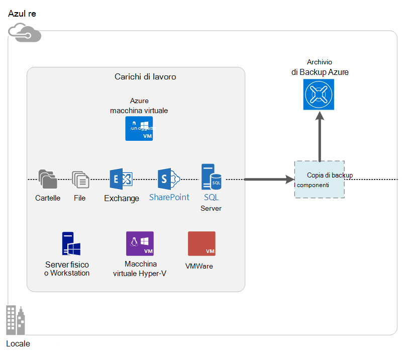

<properties
    pageTitle="Che cos'è il Backup di Azure? | Microsoft Azure"
    description="Tramite servizi Azure Backup e ripristino, è possibile eseguire il backup e ripristinare dati e le applicazioni di Windows Server, computer client Windows Server System Center DPM e macchine virtuali di Azure."
    services="backup"
    documentationCenter=""
    authors="markgalioto"
    manager="cfreeman"
    editor="tysonn"
    keywords="eseguire il backup e ripristino. servizi di recupero; soluzioni di backup"/>

<tags
    ms.service="backup"
    ms.workload="storage-backup-recovery"
    ms.tgt_pltfrm="na"
    ms.devlang="na"
    ms.topic="get-started-article"
    ms.date="10/19/2016"
    ms.author="jimpark; trinadhk"/>

# Che cos'è il Backup di Azure?
Copia di Backup Azure è il servizio che consente di eseguire il backup e ripristinare i dati nel cloud Microsoft. Sostituisce il locale esistente o una soluzione di backup esterno con una soluzione basata su cloud affidabili, sicuro e competitivo. Può essere utile anche proteggere eseguiti nel cloud. Backup Azure offre servizi di recupero basati su un'infrastruttura di alta qualità scalable, permanente e altamente disponibile.

[Guardare un video introduttivo di Backup di Azure](https://azure.microsoft.com/documentation/videos/what-is-azure-backup/)

## Perché usare Backup Azure?
Soluzioni di backup tradizionali hanno derivato per indicazione un endpoint simile a dischi o nastro nel cloud. Sebbene questo approccio è semplice, è limitato. Non usufruire di una piattaforma cloud sottostante e viene convertita in una soluzione costosa inefficace.
Invece Azure Backup offre tutti i vantaggi di una soluzione di backup cloud potente e conveniente. Ecco alcuni dei vantaggi principali che contiene un Backup di Azure.

| Caratteristica | Vantaggi |
| ------- | ------- |
| Gestione di archiviazione automatica | Spese di investimento non sono necessarie per i dispositivi di archiviazione locale. Backup Azure assegna automaticamente e gestisce l'archiviazione di backup e viene utilizzato un modello di consumo pagare come-si-uso. |
| Illimitato proporzioni dei caratteri | Vantaggi offerti garanzie disponibilità senza costi di manutenzione e monitoraggio. Backup Azure utilizza la potenza e la scala del cloud Azure sottostante con le funzionalità di adattamento automatico non intrusivo. |
| Più opzioni relative all'archiviazione | Scegliere lo spazio di archiviazione di backup in base alle necessità:<li>Un blob di blocco dello spazio di archiviazione in locale ridondanti è ideale per i clienti consente agli utenti e può essere comunque utile proteggere i dati dagli errori hardware locale. <li>Un blob di blocco della replica geografico lo spazio di archiviazione sono disponibili tre più copie in un Data Center accoppiate. Queste copie aggiuntive assicurarsi che i dati di backup disponibili anche se si verifica un danno a livello di sito Azure. |
| Trasferimento di dati illimitato | È gratuito per il trasferimento di dati (in uscita) qualsiasi uscita durante un'operazione di ripristino dall'archivio di Backup. Dati in ingresso di Azure anche è gratuita. Funziona con il servizio di importazione in cui è disponibile. |
| Crittografia dei dati | La crittografia dei dati consente la trasmissione sicura e lo spazio di archiviazione dei dati dei clienti nel cloud pubblico. Passphrase crittografia verrà archiviata nel sito di origine e non è mai trasmesse né archiviato in Azure. È necessario ripristinare i dati della chiave di crittografia e solo il cliente può accedere ai dati nel servizio. |  
| Copia di backup coerenti applicazione | Backup applicazione coerenti in Windows in modo che le correzioni non sono necessari in fase di ripristino, in modo da ridurre l'obiettivo di tempo di ripristino. In questo modo i clienti tornare alla esecuzione più rapidamente. |
| Criteri di conservazione a lungo termine | Invece di pagamento per soluzioni di backup nastro fuori sede, i clienti possono eseguire il backup di Azure, che offre la soluzione ideale mi piace nastro un costo. |

## Azure componenti di Backup
Poiché il Backup è una soluzione di backup ibrida, costituito da più componenti che interagiscono per attivare-to-end backup e ripristino dei flussi di lavoro.

### Scenari di distribuzione

| Componente | Possono essere distribuiti in Azure? | Può essere distribuito in locale? | Archiviazione di destinazione supportati|
| --- | --- | --- | --- |
| Azure agente di Backup | 
**Sì**
 
L'agente di Backup di Azure può essere distribuito su qualsiasi macchine Virtuali Server Windows in esecuzione in Azure.
 | 
**Sì**
 
È possibile distribuire l'agente di Backup in qualsiasi macchine Virtuali di Windows Server o un computer fisico.
 | 
Azure archivio di Backup
 |
| System Center Data Protection Manager (Data Protection Manager) | 
**Sì**

Ulteriori informazioni su [come proteggere carichi di lavoro di Azure in cui sia in System Center](http://blogs.technet.com/b/dpm/archive/2014/09/02/azure-iaas-workload-protection-using-data-protection-manager.aspx).
 | 
**Sì**
 
Ulteriori informazioni su [come proteggere carichi di lavoro e macchine virtuali nel centro dati](https://technet.microsoft.com/library/hh758173.aspx).
 | 
Disco locale collegato,
 
Insieme di credenziali Backup Azure
 
nastro (in locale solo)
 |
| Server di Backup Azure | 
**Sì**

Ulteriori informazioni su [come proteggere carichi di lavoro di Azure tramite il Server di Backup di Azure](backup-azure-microsoft-azure-backup.md).
 | 
**Sì**
 
Ulteriori informazioni su [come proteggere carichi di lavoro di Azure tramite il Server di Backup di Azure](backup-azure-microsoft-azure-backup.md).
 | 
Disco locale collegato,
 
Azure archivio di Backup
 |
| Azure Backup (con estensione macchine Virtuali) | 
**Sì**

Parte di tessuti Azure

Specializzati per [backup dell'infrastruttura di Azure come un macchine virtuali di servizio (IaaS)](backup-azure-vms-introduction.md).
 | 
**No**
 
Utilizzare System Center DPM per eseguire il backup macchine virtuali nel centro dati.
 | 
Azure archivio di Backup
 |

### Limitazioni e vantaggi livelli componente

| Componente | Vantaggi | Limitazioni | Granularità di ripristino |
| --- | --- | --- | --- |
| Azure agente di Backup (MARS) | <li>Di backup di file e cartelle in un computer con sistema operativo Windows, che si tratti di fisico o virtuale (macchine virtuali possono essere in un punto qualsiasi locale o Azure)<li>Nessun server di backup separato obbligatorio<li>Utilizza Azure archivio di Backup | <li>Ripristinare tre volte un giorno/file di backup livello<li>Ripristino di livello file/cartella/volume solo, e non dell'applicazione presente<li>Nessun supporto per Linux | file/cartelle/volumi |
| System Center Data Protection Manager | <li>Snapshot presente App (VSS)<li>Flessibilità completa per l'esecuzione di backup di<li>Granularità di ripristino (tutte)<li>Consente di archivio di Backup di Azure<li>Supporto Linux (se ospitati in Hyper-V) | <li>Mancanza di supporto eterogeneo (VMware macchine Virtuali backup automatici carico di lavoro Oracle backup).  | file/cartelle/volumi / Macchine virtuali/applicazioni |
| Server di Backup di Microsoft Azure | <li>Snapshot presente App (VSS)<li>Flessibilità completa per l'esecuzione di backup di<li>Granularità di ripristino (tutte)<li>Consente di archivio di Backup di Azure<li>Supporto Linux (se ospitati in Hyper-V)<li>Non è necessaria una licenza di System Center | <li>Mancanza di supporto eterogeneo (VMware macchine Virtuali backup automatici carico di lavoro Oracle backup).<li>È sempre necessario live abbonamento Azure<li>Disponibile alcun supporto per il backup di nastro | file/cartelle/volumi / Macchine virtuali/applicazioni |
| Copia di Backup macchine Virtuali IaaS Azure | <li>Backup nativi per Windows/Linux<li>Non è richiesta l'installazione agente specifico<li>Backup al livello tessuti con alcuna infrastruttura di backup necessario | <li>Una volta al giorno back up/disco ripristino livello<li>Non è possibile eseguire il backup locale | Macchine virtuali Tutti i dischi (con PowerShell) |

## Le applicazioni e carichi di lavoro possono essere backup?

| Carico di lavoro | Computer di origine | Soluzione di Backup di Azure |
| --- | --- |---|
| File e cartelle | Windows Server | 
[Agente di Backup di azure](backup-configure-vault.md)
 
[System Center Data Protection Manager](backup-azure-dpm-introduction.md) (+ l'agente di Backup di Azure)
 
[Server di Backup Azure](backup-azure-microsoft-azure-backup.md) (include l'agente di Backup di Azure)
  |
| File e cartelle | Client di Windows | 
[Agente di Backup di azure](backup-configure-vault.md)
 
[System Center Data Protection Manager](backup-azure-dpm-introduction.md) (+ l'agente di Backup di Azure)
 
[Server di Backup Azure](backup-azure-microsoft-azure-backup.md) (include l'agente di Backup di Azure)
  |
| Macchina virtuale Hyper-V (Windows) | Windows Server | 
[System Center Data Protection Manager](backup-azure-backup-sql.md) (+ l'agente di Backup di Azure)
 
[Server di Backup Azure](backup-azure-microsoft-azure-backup.md) (include l'agente di Backup di Azure)
 |
| Macchina virtuale Hyper-V (Linux) | Windows Server | 
[System Center Data Protection Manager](backup-azure-backup-sql.md) (+ l'agente di Backup di Azure)
 
[Server di Backup Azure](backup-azure-microsoft-azure-backup.md) (include l'agente di Backup di Azure)
  |
| Microsoft SQL Server | Windows Server | 
[System Center Data Protection Manager](backup-azure-backup-sql.md) (+ l'agente di Backup di Azure)
 
[Server di Backup Azure](backup-azure-microsoft-azure-backup.md) (include l'agente di Backup di Azure)
  |
| Microsoft SharePoint | Windows Server | 
[System Center Data Protection Manager](backup-azure-backup-sql.md) (+ l'agente di Backup di Azure)
 
[Server di Backup Azure](backup-azure-microsoft-azure-backup.md) (include l'agente di Backup di Azure)
   |
| Microsoft Exchange |  Windows Server | 
[System Center Data Protection Manager](backup-azure-backup-sql.md) (+ l'agente di Backup di Azure)
 
[Server di Backup Azure](backup-azure-microsoft-azure-backup.md) (include l'agente di Backup di Azure)
   |
| Macchine virtuali di Azure IaaS (Windows) | - | [Azure Backup (con estensione macchine Virtuali)](backup-azure-vms-introduction.md) |
| Macchine virtuali di Azure IaaS (Linux) | - | [Azure Backup (con estensione macchine Virtuali)](backup-azure-vms-introduction.md) |

## Supporto ARM e Linux

| Componente | Supporto ARM | Linux (Azure approvato) supporto |
| --- | --- | --- |
| Azure agente di Backup (MARS) | Sì | Nessuna (solo in base a dell'agente di Windows) |
| System Center Data Protection Manager | Sì (agente guest) | È possibili solo i backup solo file coerente Hyper-V (non macchine Virtuali di Azure) |
| Server di Backup Azure (MABS) | Sì (agente guest) | Solo backup solo file coerente Hyper-V (non macchine Virtuali di Azure) è possibile (come Data Protection Manager) |
| Copia di Backup macchine Virtuali IaaS Azure | Sì | Sì |

[AZURE.INCLUDE [learn-about-deployment-models](../../includes/learn-about-deployment-models-include.md)]

## Eseguire il backup e ripristino macchine virtuali di spazio di archiviazione Premium

Il servizio di Backup di Azure protegge ora macchine virtuali di spazio di archiviazione Premium.

### Eseguire il backup macchine virtuali di spazio di archiviazione Premium

Durante il backup macchine virtuali di spazio di archiviazione Premium, il servizio di Backup crea un percorso di gestione temporaneo temporaneo nell'account di archiviazione Premium. Gestione temporanea example.microsoft.com, "AzureBackup-", è uguale alla dimensione totale dei dati dei dischi premium associati a macchina virtuale.

>[AZURE.NOTE] Non modificare o modificare la posizione di gestione temporanea.

Al termine del processo di backup, viene eliminato il percorso di gestione temporaneo. Il prezzo di spazio di archiviazione per il percorso di gestione temporaneo è coerenza con tutti [Premium archiviazione prezzi](../storage/storage-premium-storage.md#pricing-and-billing).

### Ripristinare macchine virtuali di spazio di archiviazione Premium

Macchine Virtuali di spazio di archiviazione Premium possono essere ripristinati a uno spazio di archiviazione Premium o allo spazio di archiviazione normale. Ripristino di un punto di ripristino Premium macchine Virtuali di spazio di archiviazione in archiviazione Premium è il processo di ripristino tipico. Tuttavia, può essere conveniente per ripristinare un punto di ripristino macchine Virtuali di spazio di archiviazione Premium allo spazio di archiviazione standard. Questo tipo di ripristino può essere utilizzato se è necessario un sottoinsieme dei file dalla macchina virtuale.

## Funzionalità
Nelle tabelle seguenti cinque sono riepiloga funzionalità di backup come viene gestito in ogni componente.

### Spazio di archiviazione

| Caratteristica | Azure agente di Backup | System Center Data Protection Manager | Server di Backup Azure | Azure Backup (con estensione macchine Virtuali) |
| ------- | --- | --- | --- | ---- |
| Azure archivio di Backup | ![Sì][green] | ![Sì][green] | ![Sì][green] | ![Sì][green] |
| Spazio su disco | | ![Sì][green] | ![Sì][green] |  |
| Nastro | | ![Sì][green] |  | |
| Compressione (nell'archivio di backup) | ![Sì][green] | ![Sì][green]| ![Sì][green] | |
| Backup incrementale | ![Sì][green] | ![Sì][green] | ![Sì][green] | ![Sì][green] |
| Deduplication disco | | ![Parzialmente][yellow] | ![Parzialmente][yellow]| | |

Archivio di Backup è la destinazione di archiviazione preferibile a tutti i componenti. System Center Data Protection Manager e Backup Server offrono la possibilità di avere una copia locale del disco. Tuttavia, solo System Center DPM, è possibile scrivere dati in un dispositivo di archiviazione nastro.

#### Backup incrementale
Ogni componente supporta backup incrementale indipendentemente sull'archiviazione di destinazione (su disco, nastro, archivio di backup). Backup incrementale garantisce l'esecuzione di backup lo spazio di archiviazione e l'ora efficiente, eseguendo il trasferimento solo le modifiche apportate dall'ultimo backup.

#### Compressione
Backup vengono compresse per ridurre lo spazio di archiviazione necessari. L'unico componente che non utilizza la compressione è l'estensione macchine Virtuali. Con estensione macchine Virtuali, tutti i dati di backup viene copiata dal conto cliente lo spazio di archiviazione per l'archivio di backup nella stessa area sotto l'elenco allegati. Durante l'esecuzione senza compressione leggermente ingrandisce archiviazione utilizzato, archiviazione dei dati senza compressione consente di velocizzare i tempi di ripristino.

#### Deduplication
Deduplication è supportata per System Center DPM e Backup Server quando è [distribuito in un computer virtuale Hyper-V](http://blogs.technet.com/b/dpm/archive/2015/01/06/deduplication-of-dpm-storage-reduce-dpm-storage-consumption.aspx). Deduplication viene eseguita a livello host tramite deduplication di Windows Server su virtuali rigido dischi rigidi collegati a macchina virtuale come backup dello spazio di archiviazione.

>[AZURE.WARNING] Deduplication non è disponibile in Azure per uno dei componenti di Backup. Quando System Center DPM Server di Backup di distribuzione e Azure, non è possibile deduplicated dischi lo spazio di archiviazione collegati alla macchina virtuale.

### Sicurezza

| Caratteristica | Azure agente di Backup | System Center Data Protection Manager | Server di Backup Azure | Azure Backup (con estensione macchine Virtuali) |
| ------- | --- | --- | --- | ---- |
| Sicurezza della rete (al Azure) | ![Sì][green] |![Sì][green] | ![Sì][green] | ![Parzialmente][yellow]|
| Protezione dei dati (in Azure) | ![Sì][green] |![Sì][green] | ![Sì][green] | ![Parzialmente][yellow]|

Tutto il traffico backup dal server per l'archivio di Backup è crittografato tramite 256 Standard crittografia avanzate. I dati vengono inviati tramite un collegamento HTTPS protetto. I dati di backup archiviati anche nell'archivio di Backup in formato crittografato. Solo il cliente contiene passphrase sbloccare questi dati. Microsoft non è possibile decrittografare i dati di backup in qualsiasi momento.

>[AZURE.WARNING] La chiave utilizzata per crittografare i dati di backup è presenta solo con il cliente. Microsoft non conserva una copia in Azure e non ha qualsiasi accesso alla chiave. Se la chiave è smarrita, Microsoft non è possibile recuperare i dati di backup.

Backup macchine virtuali di Azure richiede la configurazione della crittografia *all'interno* della macchina virtuale. Utilizzare BitLocker su macchine virtuali di Windows e **crittografia di data mining** in macchine virtuali Linux. Backup Azure non vengono crittografati automaticamente i dati di backup fornito tramite questo percorso.

### Carichi di lavoro supportati

| Caratteristica | Azure agente di Backup | System Center Data Protection Manager | Server di Backup Azure | Azure Backup (con estensione macchine Virtuali) |
| ------- | --- | --- | --- | ---- |
| Computer Windows Server, ossia file e cartelle | ![Sì][green] | ![Sì][green] | ![Sì][green] | |
| Computer client Windows, ossia file e cartelle | ![Sì][green] | ![Sì][green] | ![Sì][green] | |
| Macchina virtuale Hyper-V (Windows) | | ![Sì][green] | ![Sì][green] | |
| Macchina virtuale Hyper-V (Linux) | | ![Sì][green] | ![Sì][green] | |
| Microsoft SQL Server | | ![Sì][green] | ![Sì][green] | |
| Microsoft SharePoint | | ![Sì][green] | ![Sì][green] | |
| Microsoft Exchange  | | ![Sì][green] | ![Sì][green] | |
| Azure macchina virtuale (Windows) | | | | ![Sì][green] |
| Azure macchina virtuale (Linux) | | | | ![Sì][green] |

### Rete

| Caratteristica | Azure agente di Backup | System Center Data Protection Manager | Server di Backup Azure | Azure Backup (con estensione macchine Virtuali) |
| ------- | --- | --- | --- | ---- |
| Compressione di rete (al server di backup) | | ![Sì][green] | ![Sì][green] | |
| Compressione di rete (per l'archivio di backup) | ![Sì][green] | ![Sì][green] | ![Sì][green] | |
| Protocollo (al server di backup) | | TCP | TCP | |
| Protocollo di rete (per l'archivio di backup) | HTTPS | HTTPS | HTTPS | HTTPS |

Perché l'estensione macchine Virtuali legge i dati direttamente dall'account di archiviazione Azure attraverso la rete lo spazio di archiviazione, non è necessario ottimizzare il traffico. Il traffico è sulla rete di archiviazione locale nel centro dati di Azure, quindi non esiste piccola necessità di compressione a causa di considerazioni sulla larghezza di banda.

Se esegue il backup dei dati a un server di backup (Data Protection Manager o Server di Backup), il traffico dal server primario al server di backup può essere compresso per salvare sulla larghezza di banda.

#### Limitazione di rete
L'agente di Backup di Azure offre funzionalità di limitazione, che consente di controllare l'utilizzo della larghezza di banda di rete durante il trasferimento di dati. Limitazione può essere utile se è necessario eseguire il backup dei dati durante ore lavorative ma non si desidera che il processo di backup interferire con il traffico internet. Limitazione per i dati trasferimento viene applicato per eseguire il backup e ripristino.

### Eseguire il backup e criteri di conservazione

|  | Azure agente di Backup | System Center Data Protection Manager | Server di Backup Azure | Azure Backup (con estensione macchine Virtuali) |
| --- | --- | --- | --- | --- |
| Frequenza di backup (per l'archivio di backup) | Tre backup al giorno | Due backup al giorno |Due backup al giorno | Un backup al giorno |
| Frequenza di backup (su disco) | Non applicabile | 
Ogni 15 minuti per SQL Server
 
Ogni ora per altri carichi di lavoro
 | 
Ogni 15 minuti per SQL Server
 
Ogni ora per altri carichi di lavoro
 |Non applicabile |
| Opzioni di conservazione | Giornaliera, settimanale, mensile, annuale | Giornaliera, settimanale, mensile, annuale | Giornaliera, settimanale, mensile, annuale |Giornaliera, settimanale, mensile, annuale |
| Periodo di conservazione | Fino a 99 anni | Fino a 99 anni | Fino a 99 anni | Fino a 99 anni |
| Punti di ripristino nell'archivio di Backup | Illimitato | Illimitato | Illimitato | Illimitato |
| Punti di ripristino sul disco locale | Non applicabile | 64 per i File server  448 per i server applicazioni | 64 per i File server  448 per i server applicazioni |Non applicabile |
| Punti di ripristino | Non applicabile | Illimitato | Non applicabile | Non applicabile |

## Che cos'è il file di archivio credenziali?

Il file di archivio credenziali è un certificato generato dal portale per ogni archivio di backup. Il portale quindi carica la chiave pubblica in Access Control Service (ACS). La chiave privata viene fornita all'utente quando si scarica le credenziali e quindi immessi durante la registrazione del computer. La chiave privata autentica il computer per inviare i dati di backup in un archivio identificato nel servizio di Azure Backup.

Le credenziali di archivio viene utilizzata solo durante il flusso di lavoro di registrazione. È responsabilità per assicurarsi che il file di archivio credenziali non è stata compromessa. Se si trova nelle mani di qualsiasi utente non autorizzato, il file di archivio credenziali può essere utilizzato per registrare altri computer contro lo stesso archivio. Tuttavia, dal momento che i dati di backup sono crittografati tramite una frase che appartengono solo al cliente, dati di backup esistenti non possono essere compromesso. Per ovviare a questo problema, archivio credenziali sono impostate su una scadenza 48 ore. Mentre è possibile scaricare le credenziali di archivio di una copia di backup archivio qualsiasi numero di volte, durante il flusso di lavoro di registrazione è applicabile solo il file più recente.

## Come è la differenza tra Azure Backup e il ripristino del sito di Azure?
Molti clienti confondere ripristino backup e ripristino di emergenza. Acquisire i dati e fornire semantica di ripristino, ma le proposte di valore di base sono diverse.

Backup Azure consente di copiare i dati in locale e nel cloud. Il ripristino del sito Azure coordinate failback, failover e replica macchina virtuale e fisica server. Entrambi i servizi sono importanti perché la soluzione di ripristino di emergenza deve proteggere i dati e recuperabili (Backup) *e* mantenere i carichi di lavoro disponibile (il ripristino del sito) quando si verificano interruzioni.

I concetti seguenti consentono di prendere decisioni importanti intorno a backup e il ripristino.

| Concetto | Dettagli | Copia di backup | Ripristino di emergenza (DR) |
| ------- | ------- | ------ | ----------------- |
| Obiettivo punto di ripristino (rilasciato) | La quantità di perdita di dati accettabili se è necessario eseguire un ripristino. | Soluzioni di backup dispone variabilità larghezza nel loro rilasciato accettabile. Backup macchina virtuale in genere hanno un rilasciato di un giorno, mentre il backup del database RPOs a partire da 15 minuti. | Soluzioni di ripristino di emergenza hanno RPOs bassa. La copia di DR può essere dietro alcuni secondi o alcuni minuti. |
| Obiettivo di tempo di ripristino (RTO) | La quantità di tempo necessario per completare un ripristino o ripristinare. | A causa di rilasciato più grande, la quantità di dati che deve essere una soluzione di backup per l'elaborazione è in genere molto più elevata che genera RTOs più tempo. Ad esempio, potrebbero essere necessari giorni per ripristinare i dati da nastri, a seconda il tempo che necessario per il trasporto nastro da un'altra sede. | Soluzioni di ripristino di emergenza sono minori RTOs perché sono più sincronizzate con l'origine. Numero di modifiche devono essere elaborate. |
| Criteri di conservazione | Per quanto tempo devono essere memorizzati dati | Per scenari che richiedono operativo ripristino (il danneggiamento dei dati, l'eliminazione dei file non intenzionale o errori del sistema operativo), i dati di backup viene generalmente mantenuti per 30 giorni o meno. Dal punto di vista della conformità, dati potrebbero essere necessario memorizzare i mesi o anche anni. Dati di backup sono ideale per l'archiviazione in tal caso. | Ripristino di emergenza deve solo dati ripristino operative che in genere accetta alcune ore o fino a un giorno. A causa l'acquisizione di dati diffusamente nelle soluzioni DR, non è consigliabile utilizzando i dati DR per criteri di conservazione a lungo termine. |

## Passaggi successivi

Provare a usare un semplice Backup di Azure. Per ulteriori informazioni, vedere uno di queste esercitazioni:

- [Provare a Backup Azure](backup-try-azure-backup-in-10-mins.md)
- [Provare a Backup macchine Virtuali di Azure](backup-azure-vms-first-look.md)

Poiché le esercitazioni su informazioni su come eseguire il backup rapidamente, verranno visualizzati solo il percorso più diretto per il backup dei dati. Per ulteriori informazioni sul tipo di backup si desidera, vedere:

- [Eseguire il backup computer Windows](backup-configure-vault.md)
- [Eseguire il backup carichi di lavoro di applicazione](backup-azure-microsoft-azure-backup.md)
- [Macchine virtuali di backup IaaS Azure](backup-azure-vms-prepare.md)

[green]: ./media/backup-introduction-to-azure-backup/green.png
[yellow]: ./media/backup-introduction-to-azure-backup/yellow.png
[red]: ./media/backup-introduction-to-azure-backup/red.png
