<properties
   pageTitle="Informazioni su come eseguire il backup file e cartelle da Windows Azure con Azure Backup utilizzando il modello di distribuzione di gestione risorse | Microsoft Azure"
   description="Informazioni su come eseguire il backup dei dati di Windows Server creando un archivio, installare l'agente di servizi di recupero e il backup dei file e cartelle su Azure."
   services="backup"
   documentationCenter=""
   authors="markgalioto"
   manager="cfreeman"
   editor=""
   keywords="come backup. come eseguire il backup"/>

<tags
   ms.service="backup"
   ms.workload="storage-backup-recovery"
   ms.tgt_pltfrm="na"
   ms.devlang="na"
   ms.topic="hero-article"
   ms.date="09/27/2016"
   ms.author="markgal;"/>

# Prima di tutto: eseguire il backup dei file e cartelle di Backup di Azure utilizzando il modello di distribuzione di Manager delle risorse

In questo articolo viene spiegato come eseguire il backup del Server di Windows (o client Windows) file e cartelle in Azure con Backup Azure Gestione risorse. Si tratta di un'esercitazione destinata a scorrere le nozioni di base. Se si desidera iniziare a utilizzare il Backup di Azure, si è nel posto giusto.

Se si desidera ottenere maggiori informazioni sui Backup di Azure, leggere questa [Panoramica](backup-introduction-to-azure-backup.md).

Il backup dei file e cartelle su Azure richiede queste attività:

 Ottiene un abbonamento a Azure (se non hai già uno). 
 creare un archivio di servizi di recupero. 
 scaricare i file necessari. 
 installa e registra l'agente di servizi di recupero. 
 eseguire il backup dei file e cartelle.

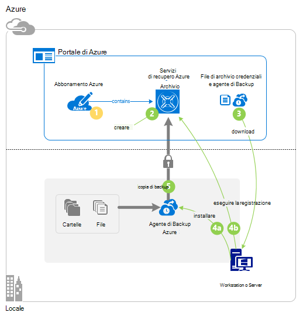

## Passaggio 1: Scaricare un abbonamento a Azure

Se non si dispone di un abbonamento a Azure, creare un [account gratuito](https://azure.microsoft.com/free/) che consente di accedere a qualsiasi servizio Azure.

## Passaggio 2: Creare un archivio di servizi di recupero

Per eseguire il backup dei file e cartelle, è necessario creare un archivio di servizi di recupero nell'area in cui si desidera archiviare i dati. È anche necessario determinare la modalità di spazio di archiviazione replicato.

### Per creare un archivio di servizi di recupero

1. Se non è già fatto, accedere al [Portale di Azure](https://portal.azure.com/) usando l'abbonamento Azure.

2. Nel menu Hub fare clic su **Sfoglia** e nell'elenco delle risorse, digitare **I servizi di recupero** e fare clic su **servizi di recupero archivi**.

    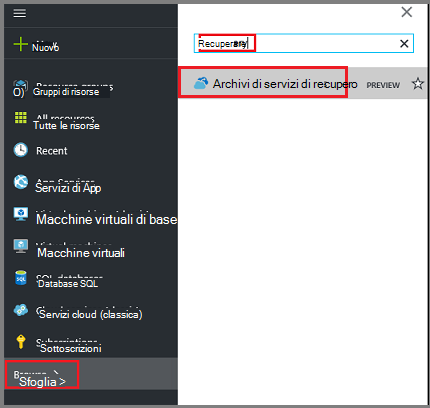  

3. Nel menu **archivi di servizi di recupero** , fare clic su **Aggiungi**.

    

    Verrà visualizzata e l'archivio servizi di recupero che richiede di specificare un **nome**, **l'abbonamento**, **gruppo di risorse**e **posizione**.

    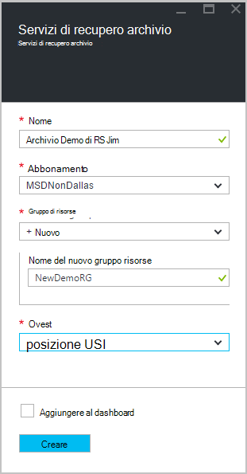

4. Per **nome**immettere un nome descrittivo per identificare l'archivio.

5. Fare clic su **sottoscrizione** per visualizzare l'elenco delle sottoscrizioni disponibile.

6. Fare clic su **gruppo di risorse** per visualizzare l'elenco dei gruppi di risorse disponibile oppure fare clic su **Nuovo** per creare un nuovo gruppo di risorse.

7. Fare clic su **posizione** per selezionare la località geografica per l'archivio. Questa scelta determina la propria area geografica in cui viene inviati i dati di backup.

8. Fare clic su **Crea**.

    Se non è visibile l'archivio elencato dopo aver completato, fare clic su **Aggiorna**. Quando si aggiorna l'elenco, fare clic sul nome dell'archivio.

### Per determinare la ridondanza dell'archiviazione
Quando si crea un archivio di servizi di recupero è determinare la modalità di replica di spazio di archiviazione.

1. Fare clic su nuovo archivio per aprire il dashboard.

2. In e **l'Impostazioni** , viene aperto automaticamente con il dashboard di archivio, fare clic su **Infrastruttura di Backup**.

3. In e dell'infrastruttura di Backup, fare clic su **Configurazione di Backup** per visualizzare il **tipo di replica di spazio di archiviazione**.

    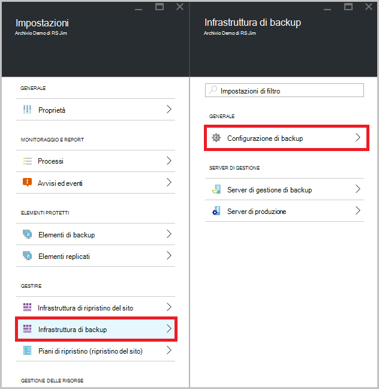

4. Scegliere l'opzione di replica di archiviazione appropriato per l'archivio.

    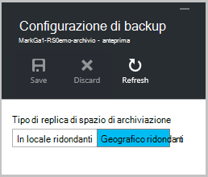

    Per impostazione predefinita, l'archivio dispone di spazio di archiviazione ridondanti geografico. Se si utilizza Azure come un endpoint di archiviazione di backup principale, continuare a usare lo spazio di archiviazione ridondanti geografico. Se si utilizza Azure come un endpoint di archiviazione di backup non primario, quindi scegliere archiviazione localmente ridondanti, che consente di ridurre il costo di archiviazione dei dati in Azure. Per saperne di più sui [geografico ridondanti](../storage/storage-redundancy.md#geo-redundant-storage) e [localmente ridondanti](../storage/storage-redundancy.md#locally-redundant-storage) opzioni relative all'archiviazione in questa [Panoramica](../storage/storage-redundancy.md).

Dopo aver creato un archivio, si preparare l'infrastruttura di backup automatici di file e cartelle scaricando i servizi di recupero di Microsoft Azure agente e archivio credenziali di accesso.

## Passaggio 3 - file di Download

1. Fare clic su **Impostazioni** nel dashboard di archivio di servizi di recupero.

    

2. Fare clic su **Introduzione > Backup** in e l'impostazioni.

    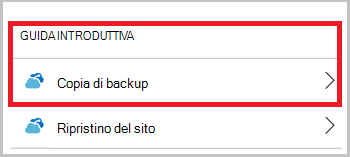

3. Scegliere **obiettivo di Backup** e il Backup.

    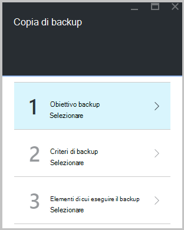

4. Selezionare **locale** da, dove è il carico di lavoro in esecuzione? menu.

5. Selezionare **file e cartelle** da cosa si desidera eseguire il backup? menu, fare clic su **OK**.

### Scaricare l'agente di servizi di recupero

1. Fare clic su **Scarica agente di Windows Server o Client Windows** e il **Prepara infrastruttura** .

    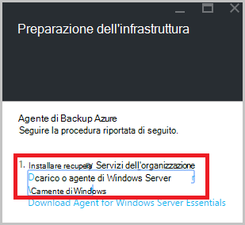

2. Fare clic su **Salva** nel popup del download. Per impostazione predefinita, **MARSagentinstaller.exe** viene salvato nella cartella download.

### Scaricare l'archivio credenziali

1. Fare clic su **scaricare > Salva** in e l'infrastruttura preparare.

    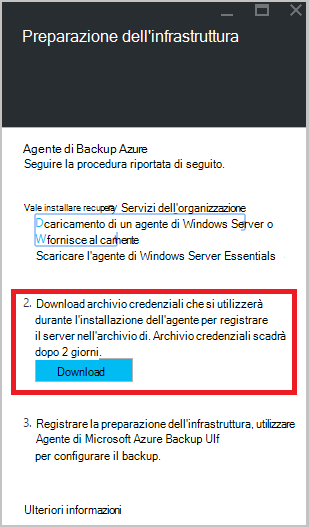

## Passaggio 4 - installa e registra l'agente

>[AZURE.NOTE] Copia di backup attivazione tramite il portale di Azure sarà presto disponibile. In questa fase, utilizzare i servizi Microsoft Azure agente locale per eseguire il backup dei file e cartelle.

1. Individuare e fare doppio clic su **MARSagentinstaller.exe** dalla cartella download (o un'altra posizione salvata).

2. Completare la configurazione guidata di Microsoft Azure ripristino servizi agente. Per completare la procedura guidata, è necessario:

    - Scegliere un percorso per l'installazione e la cartella della cache.
    - Specificare il proxy di informazioni sul server se si usa un server proxy per la connessione a internet.
    - Fornire all'utente nome e la password se si utilizza un proxy autenticato.
    - Specificare le credenziali di archivio scaricato
    - Salvare la passphrase crittografia in un percorso sicuro.

    >[AZURE.NOTE] Se si perde o si dimentica la passphrase, Microsoft non consente di recuperare i dati di backup. Salvare il file in un percorso sicuro. È necessario ripristinare una copia di backup.

L'agente è stato installato e il computer è registrato all'archivio. Si è pronti per configurare e pianificare il backup.

## Passaggio 5: Eseguire il backup dei file e cartelle

Backup iniziale include due attività principali:

- Pianificare il backup
- Backup automatici di file e cartelle per la prima volta

Per completare il backup iniziale, utilizzare l'agente di servizi di recupero di Microsoft Windows Azure.

### Per pianificare il backup

1. Aprire l'agente di servizi di recupero di Microsoft Windows Azure. È possibile trovare la ricerca nel computer di **Microsoft Azure Backup**.

    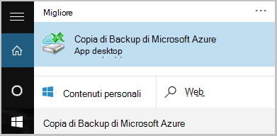

2. In agente di servizi di recupero, fare clic su **Programmazione Backup**.

    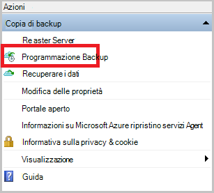

3. Nella pagina Guida introduttiva della pianificazione guidata Backup, fare clic su **Avanti**.

4. Sugli elementi selezionare alla pagina di Backup, fare clic su **Aggiungi elementi**.

5. Selezionare il file e cartelle che si desidera eseguire il backup e quindi fare clic su **OK**.

6. Fare clic su **Avanti**.

7. Nella pagina **Imposta pianificazione Backup** specificare la **pianificazione di backup** e fare clic su **Avanti**.

    È possibile pianificare backup settimanale o giornaliera (a velocità massima di tre volte al giorno).

    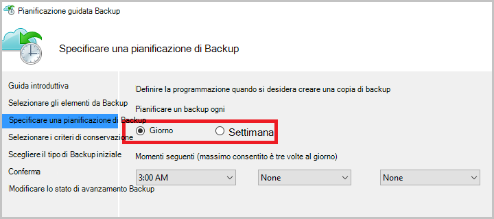

    >[AZURE.NOTE] Per ulteriori informazioni su come specificare la pianificazione di backup, vedere l'articolo [Utilizzo Azure Backup per sostituire l'infrastruttura di nastro](backup-azure-backup-cloud-as-tape.md).

8. Nella pagina **Seleziona criterio di conservazione** , selezionare il **Criterio di conservazione** per la copia di backup.

    I criteri di conservazione specificano la durata per cui verrà archiviato il backup. Appena si specifica un criterio"flat" per tutti i punti di backup, è possibile specificare i criteri di conservazione diverso in base a quando viene eseguito il backup. È possibile modificare i criteri di conservazione giornaliera, settimanale, mensile e annuale secondo le proprie esigenze.

9. Nella pagina tipo di Backup iniziale scegliere scegliere il tipo di backup iniziale. Lasciare l'opzione **automaticamente in rete** selezionata e quindi fare clic su **Avanti**.

    È possibile eseguire il backup automatico in rete oppure è possibile eseguire il backup non in linea. Il resto di questo articolo viene descritto il processo per il backup automatico. Se si preferisce eseguire un backup non in linea, consultare l'articolo [flusso di lavoro backup non in linea in Azure Backup](backup-azure-backup-import-export.md) per ulteriori informazioni.

10. Nella pagina Conferma esaminare le informazioni e quindi fare clic su **Fine**.

11. Termine della procedura guidata Creazione la pianificazione di backup, fare clic su **Chiudi**.

### Eseguire il backup di file e cartelle per la prima volta

1. In agente di servizi di recupero, fare clic su **Esegui backup** per completare il seeding iniziale in rete.

    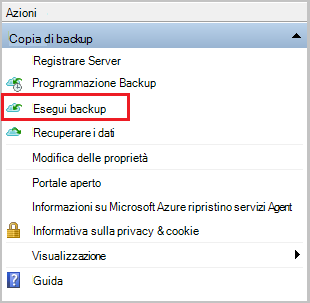

2. Nella pagina Confirmation verificare le impostazioni che il backup ora guidato verrà utilizzato per eseguire il backup del computer. Fare clic su **Backup**.

3. Fare clic su **Chiudi** per chiudere la procedura guidata. Se si esegue questa operazione prima del completamento del processo di backup, la procedura guidata continua per l'esecuzione in background.

Al termine del primo backup, viene visualizzato lo stato **processo** nella console di Backup.

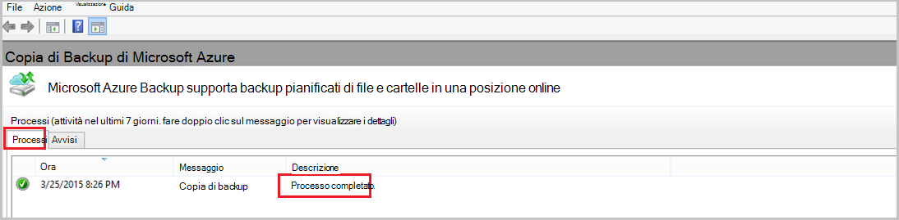

## Domande?
In caso di dubbi o qualsiasi funzione che si vuole vedere inclusi, [inviare un feedback](http://aka.ms/azurebackup_feedback).

## Passaggi successivi
- È possibile ottenere ulteriori informazioni sui [backup di computer Windows](backup-configure-vault.md).
- Ora che è stato eseguito il backup di file e cartelle, è possibile [gestire archivi e server](backup-azure-manage-windows-server.md).
- Se è necessario ripristinare una copia di backup, usare questo articolo per [ripristinare i file in un computer Windows](backup-azure-restore-windows-server.md).
