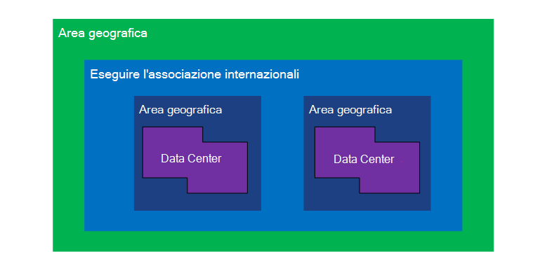
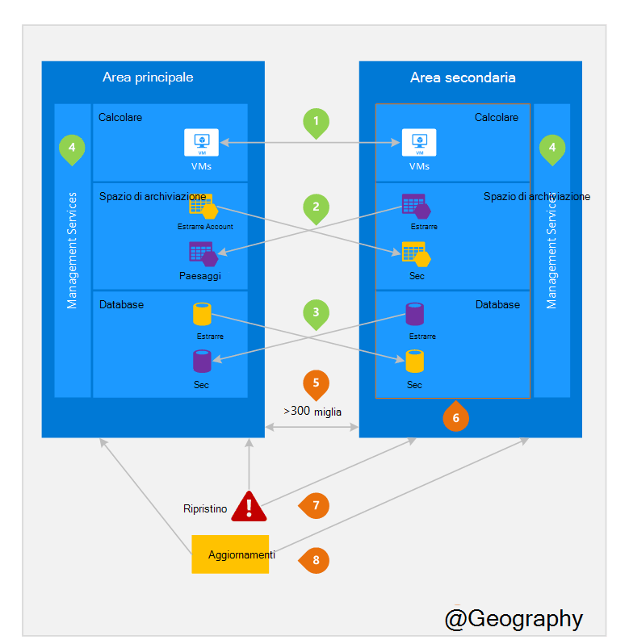

<properties
    pageTitle="Business continuità e ripristino di emergenza (BCDR): aree accoppiati Azure | Microsoft Azure"
    description="Azure coppie internazionali assicurarsi che le applicazioni siano flessibili durante errori centro dati."
    services="site-recovery"
    documentationCenter=""
    authors="rayne-wiselman"
    manager="jwhit"
    editor=""/>

<tags
    ms.service="site-recovery"
    ms.workload="storage-backup-recovery"
    ms.tgt_pltfrm="na"
    ms.devlang="na"
    ms.topic="article"
    ms.date="08/23/2016"
    ms.author="raynew"/>

# Business continuità e ripristino di emergenza (BCDR): aree accoppiati Azure

## Quali sono accoppiati aree?

Azure funziona in più aree geografiche in tutto il mondo. Un'area geografica Azure è un'area definita del mondo che contiene almeno un'area di Azure. Un'area di Azure è un'area all'interno di un'area geografica che contiene uno o più Data Center.

Ogni area Azure è associata a un'altra area all'interno di geografia stesso insieme eseguendo una coppia internazionali. L'eccezione è Sud Brasile che è associata a un'area all'esterno l'area geografica.

Figura 1-diagramma Azure coppia internazionali

| Area geografica     |  Aree accoppiate  |                     |
| :-------------| :-------------   | :-------------      |
| Nord America | America del Nord centrale USA | Sud centrale USA    |
| Nord America | Stati Uniti orientali          | Usa ovest             |
| Nord America | Stati Uniti orientali 2        | Stati Uniti centrali          |
| Nord America | Usa ovest 2        | Stati Uniti centro ovest     |
| Europa        | Europa Nord America     | Europa occidentale         |
| Area Asia          | Asia sudorientale  | Asia orientale           |
| Cina         | Cina orientale       | Cina Nord America         |
| Giappone         | Giappone est       | Giappone ovest          |
| Brasile        | Brasile Sud (1) | Sud centrale USA    |
| Australia     | Australia orientale   | Australia sudorientale |
| Governo degli Stati Uniti | Stati Uniti Gov Iowa      | Stati Uniti Gov Virginia     |
| India         | India centrale    | India sud         |
| Canada        | Canada centrale   | Canada orientale         |
| REGNO UNITO            | Regno Unito ovest          | Sud Regno Unito            |

Tabella 1 - Mapping di azure coppie internazionali

> (1) Sud Brasile sia univoco perché è associata a un'area all'esterno di propria area geografica. Area secondaria del Brasile a Sud Sud Central US ma del sud Central US area geografica secondario non Brasile sud.

È consigliabile replicare carichi di lavoro su coppie internazionali vantaggi offerti dai criteri di isolamento e la disponibilità di Azure. Ad esempio gli aggiornamenti del sistema di Azure pianificato sono distribuiti in sequenza (non nello stesso momento) tra le regioni accoppiate. Questo significa che anche in evento raro di un aggiornamento difettoso, entrambe aree geografiche non verranno contemporaneamente. Inoltre, in caso di interruzione di un ampio guasto, ripristino di almeno un'area fuori ciascuna coppia ha la priorità.

## Un esempio delle aree accoppiate
2 nella figura seguente mostra un'applicazione ipotetica che viene utilizzata l'internazionali per il ripristino di emergenza. Numeri verdi evidenziare le attività tra area di tre servizi Azure (Azure calcolare, lo spazio di archiviazione e Database) e sulla loro configurazione per replicare su aree geografiche. I vantaggi della distribuzione tra le regioni accoppiate univoci sono contrassegnati da numeri arancioni.

Figura 2: ipotetica coppia internazionali Azure

## Area tra attività
Come nella figura 2.

 **Azure calcolare (PaaS)** , è necessario eseguire il provisioning di risorse di elaborazione aggiuntivo in anticipo per assicurarsi che le risorse sono disponibili in un'altra area durante un danno. Per ulteriori informazioni, vedere [indicazioni tecniche sulla resilienza Azure](./resiliency/resiliency-technical-guidance.md).

 **Lo spazio di archiviazione di Azure** - archiviazione geografico ridondanti (GRS) è configurato per impostazione predefinita quando viene creato un account di archiviazione Azure. Con GRS, i dati viene automaticamente replicati tre volte all'interno dell'area principale e tre volte nell'area accoppiata. Per ulteriori informazioni, vedere [Opzioni ridondanza di archiviazione Azure](storage/storage-redundancy.md).

 **Database di SQL Azure** – con Azure SQL geografico-replica Standard, è possibile configurare replica asincrona delle transazioni su un'area accoppiata. Con Premium geografico-replica, è possibile configurare replica a qualsiasi area nel mondo; Tuttavia, è consigliabile che distribuire queste risorse in un'area accoppiata per la maggior parte dei tipi di ripristino di emergenza. Per ulteriori informazioni, vedere [Geografico replica di Database SQL Azure](./sql-database/sql-database-geo-replication-overview.md).

 **Manager delle risorse Azure (ARM)** - ARM garantisce per sé isolamento logico gestione dei componenti del servizio in aree geografiche. Ciò significa logici errori in un'area, è consigliabile effetti in termini di un'altra.

## Vantaggi delle aree accoppiate
Come nella figura 2.  

**isolamento fisico** – quando possibile, Azure preferisce almeno 300 miglia di separazione tra i Data Center in una coppia internazionali, anche se non è possibile o in tutte le aree geografiche. Separazione di Data Center fisico riduce la probabilità di emergenza naturali, unrest civile, guasti o interruzioni della rete fisica che interessano entrambe aree contemporaneamente. Isolamento è soggette ai vincoli all'interno dell'area geografica (dimensioni geography, la disponibilità di infrastruttura power/rete, normative e così via).  

**replica forniti piattaforma** - alcuni servizi, ad esempio lo spazio di archiviazione ridondante geografico fornire replica automatica all'area accoppiata.

**ordine ripristino area geografica** : in caso di un'interruzione generali ripristino di una regione sia assegnata la priorità fuori ciascuna coppia. Le applicazioni distribuite tra le regioni accoppiate vengono necessariamente disporre di una delle regioni recuperate con priorità. Se un'applicazione venga distribuita in aree non sono associate, ripristino potrebbe essere ritardato-nel caso peggiore che aree scelte potrebbero essere le ultime due da recuperare.

**sequenziale Aggiorna** -pianificato Azure sistema gli aggiornamenti vengono distribuiti alle aree accoppiate in sequenza (non nello stesso momento) per ridurre al minimo il tempo di inattività, l'effetto di bug e logici errori nell'evento raro di un aggiornamento non valido.

**residenza dati** : un'area si trova all'interno di geography stesso come la relativa coppia (ad eccezione delle sud Brasile) per soddisfare i requisiti di residenza dati ai fini della legge e fiscali imposizione competenza.

