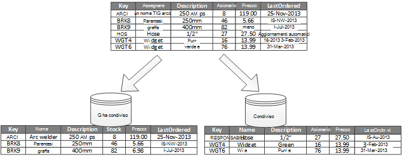
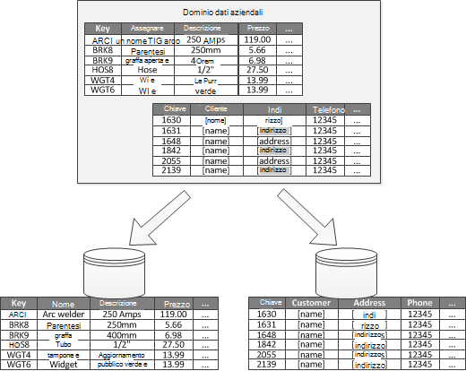
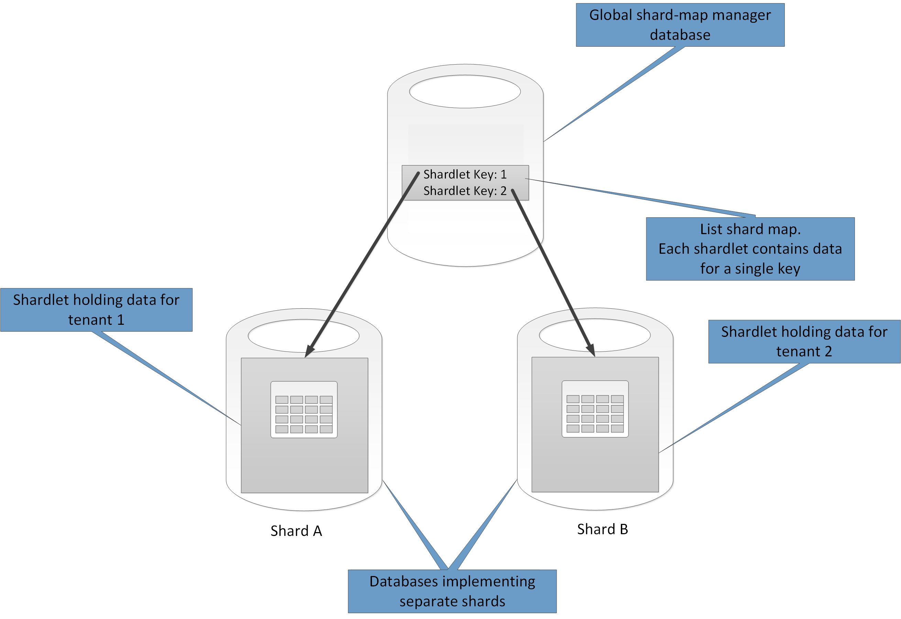
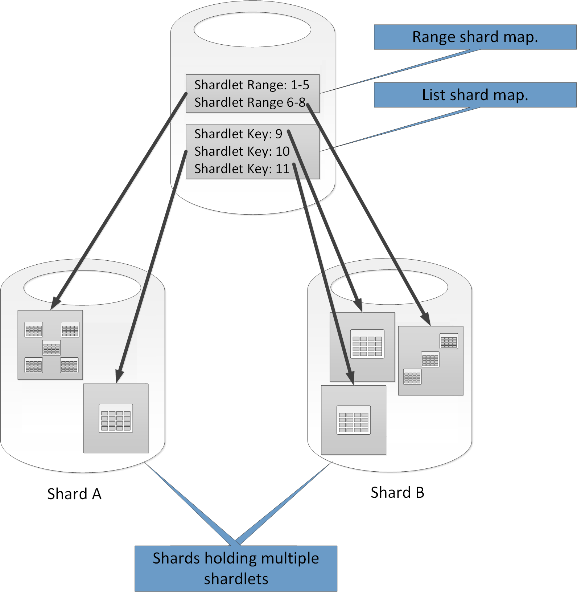
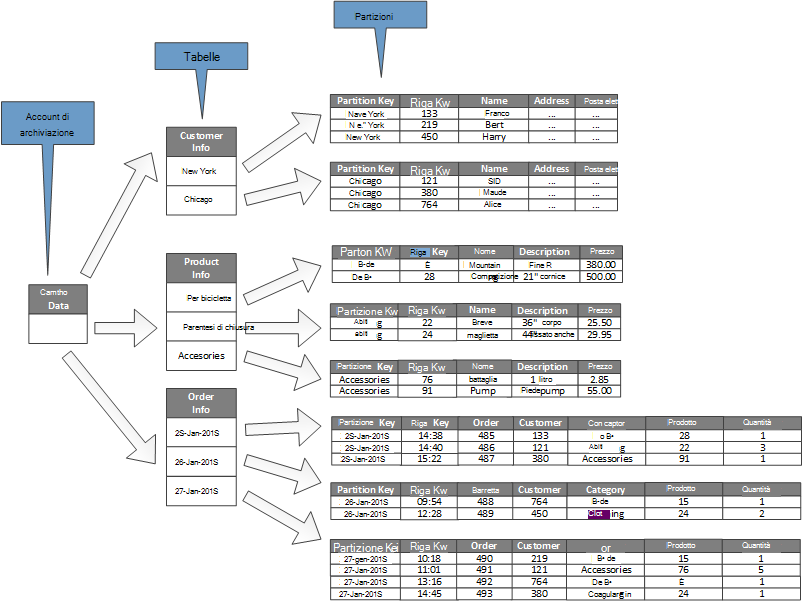
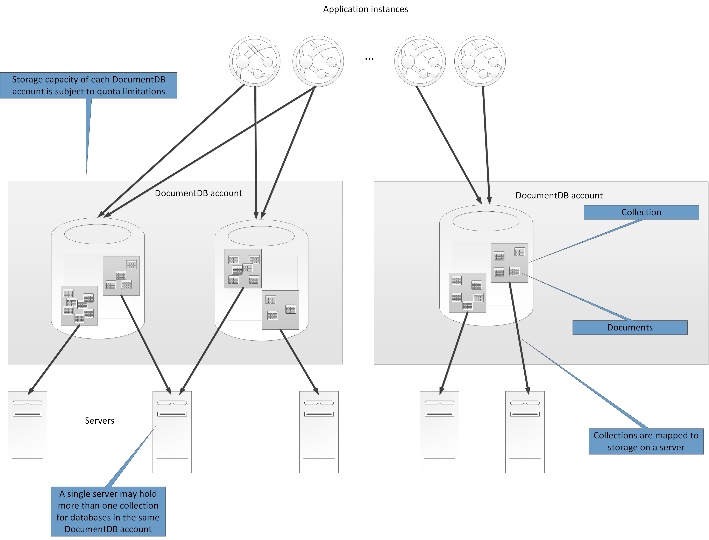
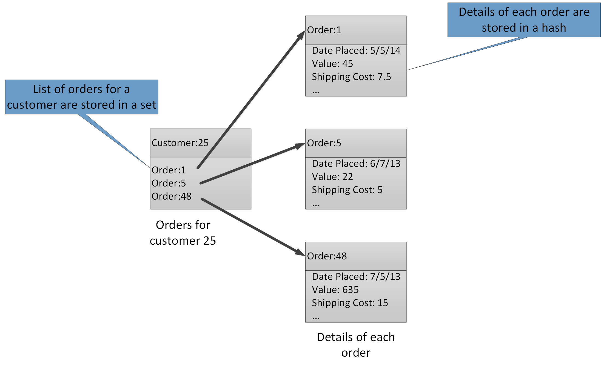

<properties
   pageTitle="Dati partizione indicazioni | Microsoft Azure"
   description="Istruzioni per separare le partizioni per la gestione e accedere separatamente."
   services=""
   documentationCenter="na"
   authors="dragon119"
   manager="christb"
   editor=""
   tags=""/>

<tags
   ms.service="best-practice"
   ms.devlang="na"
   ms.topic="article"
   ms.tgt_pltfrm="na"
   ms.workload="na"
   ms.date="07/14/2016"
   ms.author="masashin"/>

# Indicazioni partizione di dati

[AZURE.INCLUDE [pnp-header](../includes/guidance-pnp-header-include.md)]

## Panoramica

In molte soluzioni di grandi dimensioni, i dati vengano suddivisi in partizioni distinte che possono essere gestite e accedere separatamente. La strategia di gestione delle partizione devono essere scelti attentamente per aumentare al massimo i vantaggi riducendo al minimo gli effetti negativi. Partizione consente di migliorare la scalabilità, ridurre i conflitti e ottimizzare le prestazioni. Un altro vantaggio delle partizioni è che è possibile consentono di divisione di dati per il modello di utilizzo. Ad esempio, è possibile archiviare dati (freddo) meno recenti, meno attivi in meno spazio di archiviazione di dati.

## Perché partizione dati?

La maggior parte delle applicazioni e cloud services archiviare e recuperare i dati come parte del loro attività. La struttura degli archivi dati utilizzati da un'applicazione può avere un impatto significativo sulle prestazioni, velocità e scalabilità del sistema. Una tecnica comunemente applicati in sistemi di grandi dimensioni consiste nel dividere i dati in partizioni distinte.

> Il termine _partizione_ utilizzato in questa guida è il processo di divisione fisico di dati in archivi dati separati. Questo non è diverso da quello di partizione della tabella di SQL Server, ovvero un concetto diverso.

Suddividere dati può offrire numerosi vantaggi. Ad esempio, possono essere applicata al fine di:

- **Rendi scalabilità**. Durante il ridimensionamento di un sistema singolo database, raggiunge un limite hardware fisico. Se si dividono dati in più partizioni, ognuno dei quali è ospitato su un server diverso, è possibile ridimensionarlo quasi tempo indefinito del sistema.
- **Migliorare le prestazioni**. Operazioni di accesso ai dati in ogni partizione eseguita su un volume più piccolo di dati. A condizione che i dati sono suddiviso in modo appropriato, può infatti rendere il sistema più efficiente. Operazioni che influiscono su più di una partizione è possono eseguire in parallelo. Ogni partizione può trovarsi in prossimità dell'applicazione in cui viene utilizzato per ridurre al minimo la latenza di rete.
- **Migliorare la disponibilità**. Separare dati in più server consente di evitare un singolo punto di errore. Se un server non riesce, o è soggetto a manutenzione pianificata, solo i dati in partizione non è disponibile. Operazioni su altre partizioni possono continuare. Aumento del numero di partizioni riduce l'impatto relativa di un errore singolo server riducendo la percentuale di dati che non saranno disponibili. La replica di ogni partizione può ridurre ulteriormente la possibilità di un errore singola partizione influenzare operazioni. Rende tuttavia possibile separare dati importanti che devono essere continuamente disponibilità dai dati del valore minimo che è inferiore ai requisiti di disponibilità (file di log, ad esempio).
- **Rendi sicurezza**. A seconda della natura dei dati e come è suddiviso, potrebbe essere possibile separare dati sensibili e non riservati in diverse partizioni e pertanto in server diversi o dati archiviati. Sicurezza può essere ottimizzata specificamente per i dati riservati.
- **Flessibilità operativa specifica**. Partizione offre molte opportunità per fitta ottimizzazione operazioni, l'ingrandimento efficienza amministrativa e la riduzione a icona costo. Ad esempio, è possibile definire diverse strategie di gestione, monitoraggio, backup e ripristino e altre attività di amministrazione in base alla importanza dei dati di ogni partizione.
- **Confronta l'archivio dati al modello di utilizzo**. Partizione consente di ogni partizione per essere distribuito in un altro tipo di archivio di dati, sulla base di costo e le caratteristiche incorporate che dati archiviare offerte. Ad esempio, grandi quantità di dati binari può trovarsi in un archivio di dati blob, mentre più dati strutturati possono essere contenuti in un database di documento. Per ulteriori informazioni, vedere [creare una soluzione polyglot] nella Guida di modelli e procedure e [accesso ai dati per soluzioni ad alta scalabilità: Using SQL, NoSQL e persistenza polyglot] del sito Web Microsoft.

Alcuni sistemi non implementano partizioni poiché viene considerato come un costo anziché un vantaggio. Alcuni motivi comuni per questa spiegazione includono:

- Molti sistemi di archiviazione di dati non sono supportano join tra le partizioni e può essere difficile da mantenere l'integrità referenziale in un sistema partizionato. È spesso necessario implementare join e controlli di integrità nel codice dell'applicazione (nel livello partizione), che possa causare i/o aggiuntivo e la complessità dell'applicazione.
- Gestione delle partizioni non è sempre un compito. In un sistema in cui i dati sono volatili, potrebbe essere necessario ribilanciare partizioni periodicamente per ridurre il conflitto e sensibili.
- Alcuni strumenti comuni non funzionano naturalmente con dati partizionati.

## Progettazione di partizioni

Dati possono essere suddiviso in diversi modi: orizzontalmente, verticalmente o funzionalità. La strategia che scelta dipende il motivo ricorre con i dati e i requisiti delle applicazioni e servizi che utilizzeranno i dati.

> [AZURE.NOTE] Schemi di partizione descritti in questa guida vengono illustrati in modo che sia indipendente della tecnologia di archiviazione dati sottostante. Si possono essere applicate a molti tipi di database NoSQL e archivi dati, inclusi relazionale.

### Strategie partizioni

Le tre strategie tipiche per suddividere dati sono:

- **Partizione orizzontale** (spesso denominate _sharding_). In questa strategia ogni partizione è un archivio di dati in vero e proprio, ma tutte le partizioni avere lo stesso schema. Ogni partizione noto come un _condiviso_ e contiene un sottoinsieme di dati, ad esempio tutti gli ordini per un determinato set di clienti in un'applicazione di e-commerce specifico.
- **Partizione verticale**. Questa strategia, ogni partizione contiene un sottoinsieme dei campi per gli elementi nell'archivio dati. I campi sono suddivise in base alle loro motivo d'uso. Ad esempio, campi frequentemente potrebbero essere inseriti in una partizione verticale e meno frequentemente campi in un altro.
- **Funzionali partizioni**. Questa strategia, i dati vengono aggregati in base alla modalità di utilizzo per ogni contesto limitata nel sistema. Ad esempio un sistema e-commerce che implementa separare le funzioni di business per la fatturazione e gestione inventario dei prodotti potrebbero archiviare i dati della fattura in una partizione e prodotto inventario dei dati in un altro.

È importante tenere presente che è possono combinare tre strategie descritte di seguito. Non sono si escludono a vicenda ed è consigliabile valutare tutti quando si progetta una combinazione di partizione. Ad esempio, si potrebbe dividere i dati in shards e quindi utilizzare partizione verticale per suddividere ulteriormente i dati in ogni condiviso. Analogamente, è possono dividere i dati in una partizione funziona in shards (che può anche essere verticalmente suddiviso).

Tuttavia, i diversi requisiti di ogni strategia possono generare un numero di problemi in conflitto. È necessario valutare e saldo totale tutte le regole per la progettazione di una combinazione di partizione che soddisfa le destinazioni prestazioni complessive elaborazione dei dati per i singoli sistemi. Nelle sezioni seguenti vengono illustrati in modo delle strategie in modo più dettagliato.

### Orizzontale partizione (sharding)

Figura 1 mostra una panoramica delle partizioni orizzontale o sharding. In questo esempio, i dati dell'inventario dei prodotti sono diviso in shards in base al codice product key. Ogni condiviso contenente i dati per un intervallo contiguo di chiavi condiviso A G e H + Z, organizzati in ordine alfabetico.

_Figura 1. Orizzontalmente suddividere (sharding) dati in base a una chiave di partizione_

Sharding consente di distribuire il carico su più computer, che consente di ridurre il conflitto e migliorare le prestazioni. È possibile ridimensionare il sistema fuori aggiungendo ulteriormente shards che vengono eseguite sui server aggiuntivi.

Il fattore più importante per l'implementazione di questa strategia di gestione delle partizione è la scelta della chiave sharding. Può essere difficile modificare la chiave dopo il sistema è in esecuzione. La chiave è necessario assicurarsi che i dati sono suddiviso in modo che il carico di lavoro è possibile come pari attraverso il shards.

Si noti che shards diversi non deve contenere volumi simili di dati. Invece più importante consiste nel bilanciare il numero di richieste. Alcuni shards potrebbe essere molto grandi, ma ogni elemento è il soggetto di un numero limitato di operazioni di accesso. Altri shards potrebbe essere più piccole, ma molto più spesso si accede a ogni elemento. È anche importante garantire che un singolo condiviso non superino i limiti di ridimensionamento (in termini di capacità e risorse di elaborazione) dell'archivio di dati utilizzato per ospitare tale condiviso.

Se si usa una combinazione di sharding, evitare di creare punti attivi (o partizioni attiva) che possono influire sulle prestazioni e disponibilità. Ad esempio, se si utilizza hashing di un identificatore clienti anziché la prima lettera del nome del cliente, impedire la distribuzione bilanciata risultante dalla meno comuni e comuni lettere iniziali. Questa è una tecnica tipica che consente di distribuire i dati più equamente tra partizioni.

Scegliere un tasto di sharding che consente di ridurre i requisiti futuri di dividere shards di grandi dimensioni in parti più piccole, riunire shards piccole in partizioni più grandi o modificare lo schema che descrive i dati archiviati in un set di partizioni. Queste operazioni possono essere molto tempo e possono implicare anche la disconnessione shards uno o più mentre vengono eseguite.

Se vengono replicate shards, potrebbe essere possibile mantenere alcune replica online mentre gli altri utenti vengono suddivise, uniti o riconfigurare. Tuttavia, il sistema potrebbe essere necessario limitare le operazioni che è possono eseguire sui dati in questi shards durante la riconfigurazione. Ad esempio, i dati in repliche possono essere contrassegnati come sola lettura per limitare l'ambito di incoerenze che potrebbero verificarsi durante la shards sono vengano ristrutturazione.

> Per ulteriori informazioni e indicazioni sulla maggior parte di queste considerazioni e tecniche consigliate per la progettazione di archivi dati che implementano partizioni orizzontale, vedere [Sharding].

### Partizione verticale

L'uso più comune per partizione verticale è ridurre i/o e i costi delle prestazioni associati recuperare gli elementi sono accessibili più di frequente. Figura 2 è illustrato un esempio delle partizioni verticale. In questo esempio, proprietà diverse per ogni elemento di dati sono contenute nel partizioni diverse. Una partizione contiene i dati che si accede più spesso, inclusi il nome, descrizione e informazioni sui prezzi per i prodotti. Un altro contiene il volume in magazzino e l'ultima data ordinata.

_Figura 2. Suddividere verticalmente dati tramite il modello di utilizzo_

In questo esempio, l'applicazione regolarmente query il nome del prodotto, descrizione e prezzo quando si visualizzano i dettagli del prodotto per i clienti. Il livello di magazzino e la data quando il prodotto è stato ordinato ultimo forniti dal produttore sono contenuti in una partizione separata perché questi due elementi di uso comune insieme.

Questo schema di partizione ha il vantaggio che i dati relativamente lente (nome prodotto, descrizione e prezzo) sono separati dai dati di più dinamici (livello scorte e data di fine ordinato). Un'applicazione può risultare utili per memorizzare nella cache i dati in memoria lente se è spesso possibile accedervi.

Tipico per questa strategia di gestione delle partizione anche per ottimizzare la protezione dei dati riservati. Ad esempio, è possibile eseguire archiviando i numeri di carta di credito e i numeri di verifica protezione scheda corrispondente in partizioni distinte.

Partizione verticale, è anche possibile ridurre la quantità di accesso simultaneo necessari per i dati.

> Partizione verticale opera a livello di entità all'interno di un archivio di dati, parzialmente normalizzare un'entità per scomposizione da un elemento di _larghezza_ per un set di _limitare_ gli elementi. È ideale per gli archivi dati orientata per colonna, ad esempio HBase e Cassandra. Se i dati in una raccolta di colonne sono in genere modificata, è anche possibile utilizzare gli archivi di colonna in SQL Server.

### Partizione funzionale

Per i sistemi in cui è possibile identificare un contesto limitato per ogni area aziendale distinti o servizio nell'applicazione, partizione funzionale fornisce una tecnica per migliorare le prestazioni di accesso di isolamento e i dati. Un altro uso comune delle partizioni funzionale consiste nel separare dati in lettura / scrittura dai dati di sola lettura utilizzato per la creazione di report. Figura 3 mostra una panoramica delle partizioni funzionale in cui vengono separati i dati di inventario dei dati del cliente.

_Figura 3. Funzionalità partizioni dati in base al contesto limitata o un sottodominio_

Questa strategia di gestione delle partizione consente di ridurre i conflitti di access dati tra diverse parti di un sistema.

## Progettazione di partizioni per scalabilità

È importante valutare la possibilità di dimensioni e il carico di lavoro per ogni partizione e bilanciare loro in modo che i dati sono distribuiti per ottenere la massima scalabilità. Tuttavia, devono partizione anche i dati in modo da non superare i limiti di scala di un archivio singola partizione.

Quando si progettano le partizioni per scalabilità, procedere come segue:

1. Analizzare l'applicazione per comprendere i modelli di accesso ai dati, ad esempio le dimensioni del set di risultati restituiti da ogni query, requisiti di elaborazione di calcolare la frequenza di accesso, la latenza inerente e lato server. In molti casi, un numero limitato di rilievo richiederà la maggior parte delle risorse di elaborazione.
2. Utilizzare questa analisi per determinare le destinazioni scalabilità correnti e futuri, ad esempio la dimensione dei dati e il carico di lavoro. Distribuire i dati tra le partizioni per rispettare la destinazione della scalabilità. Nella strategia partizione orizzontale, scegliendo il tasto appropriato condiviso è importante verificare che la distribuzione è pari. Per ulteriori informazioni, vedere il [motivo Sharding].
3. Assicurarsi che le risorse disponibili per ogni partizione sono sufficienti per gestire i requisiti di scalabilità in termini di dimensioni dei dati e la velocità effettiva. Ad esempio, il nodo che ospita una partizione potrebbe imporre un limite per la quantità di spazio di archiviazione, elaborazione power o della larghezza di banda di rete che offre. Se si prevede che superano questi limiti i requisiti di spazio di archiviazione e l'elaborazione di dati, potrebbe essere necessario per perfezionare la strategia di gestione delle partizione o dividere dati fuori ulteriormente. Ad esempio, potrebbe essere un approccio scalabilità per separare i dati di registrazione dalla funzionalità di base dell'applicazione. È tramite archivi dati separati per evitare che i requisiti di spazio di archiviazione totale dei dati di superare il limite di ridimensionamento del nodo. Se il numero totale di archivi dati supera il limite di nodo, potrebbe essere necessario utilizzare nodi di archiviazione separata.
4. Monitorare il sistema in uso per verificare che i dati viene distribuiti come previsto e che le partizioni consente di gestire il carico imposti su di essi. È possibile che l'utilizzo non corrisponde a utilizzo previsti per l'analisi. In questo caso, potrebbe essere possibile ribilanciare le partizioni. In caso contrario, potrebbe essere necessario riprogettare alcune parti del sistema per ottenere il saldo necessario.

Si noti che alcuni ambienti cloud allocano le risorse in termini di limiti dell'infrastruttura. Assicurarsi che i limiti del limite selezionato sufficiente per qualsiasi crescita prevista del volume dei dati, in termini di archiviazione dei dati, la potenza di elaborazione e della larghezza di banda.

Ad esempio, se si Usa archiviazione tabelle Azure, un condiviso occupato potrebbero essere necessarie ulteriori risorse quelle disponibili a una singola partizione per gestire le richieste. (Non esiste un limite per il volume di richieste che può essere gestito da una singola partizione in un determinato periodo di tempo. Vedere la pagina [di archiviazione Azure prestazioni e scalabilità i siti di destinazione] del sito Web Microsoft per informazioni dettagliate).

 In questo caso, il condiviso potrebbe essere necessario suddiviso per distribuire il carico. Se le dimensioni totali o effettiva delle tabelle supera la capacità di un account di archiviazione, potrebbe essere necessario creare gli account di spazio di archiviazione aggiuntivo e distribuire le tabelle su questi account. Se il numero di account di archiviazione supera il numero di account disponibili per una sottoscrizione, potrebbe essere necessario utilizzare più abbonamenti.

## Progettazione di partizioni per le prestazioni delle query

Le prestazioni delle query possono essere aumentata spesso utilizzando set di dati più piccoli ed esecuzione di query in parallelo. Ogni partizione deve contenere una piccola parte del set di dati intero. Questa riduzione del volume è possibile migliorare le prestazioni delle query. Tuttavia, partizione non è un'alternativa per la progettazione e configurazione di un database in modo appropriato. Ad esempio, assicurarsi che hanno gli indici necessari in posizione se si utilizza un database relazionale.

Quando si progettano le partizioni per le prestazioni delle query, procedere come segue:

1. Esaminare i requisiti dell'applicazione e prestazioni:
    - Utilizzare le esigenze aziendali per determinare le query critiche che devono sempre eseguire rapidamente.
    - Monitorare il sistema per individuare eventuali quesiti prestazioni ridotte.
    - Stabilire quali query vengono eseguite più di frequente. Una singola istanza di ogni query potrebbe essere costo minimo, ma il consumo cumulativo di risorse potrebbe essere significativo. Potrebbe essere utile separare i dati vengono recuperati da queste query in una partizione distinta o anche una cache.
2. Dividere i dati che la lentezza delle prestazioni:
    - Limitare le dimensioni di ogni partizione in modo che il tempo di risposta query all'interno di destinazione.
    - Progettare il tasto condiviso in modo che l'applicazione poter trovare facilmente la partizione per l'implementazione di partizione orizzontale. In questo modo la query non analizzare ogni partizione.
    - Considerare la posizione di una partizione. Se possibile, provare a mantenere i dati in partizioni presenti limitazioni geografiche Chiudi per le applicazioni e gli utenti di accedervi.
3. Se un'entità sono previsti i requisiti di prestazioni effettiva e query, usare funzionale partizioni in base a tale entità. Se non si non soddisfa i requisiti, applicare anche partizione orizzontale. Nella maggior parte dei casi è sufficiente un singolo strategia di gestione delle partizione, ma in alcuni casi è più efficiente per combinare entrambe strategie.
4. Valutare la possibilità di utilizzo delle query asincrona in esecuzione in parallelo tra partizioni per migliorare le prestazioni.

## Progettazione di partizioni per la disponibilità

Suddividere dati migliorare la disponibilità delle applicazioni, verificare che l'intero set di dati non costituisce un singolo punto di errore e che singoli sottoinsiemi del set di dati possono essere gestiti in modo indipendente. La replica delle partizioni che contengono dati critici è possibile migliorare la disponibilità.

Progettare e implementare partizioni, considerare i fattori seguenti che influiscono sulla disponibilità:

- **I dati come critiche consiste nel operazioni aziendali**. Alcuni dati potrebbero contenere informazioni aziendali critiche, ad esempio dettagli fattura o transazioni bancarie. Altri dati potrebbero contenere meno critici dati, ad esempio file di log, tracce di prestazioni e così via. Dopo aver identificato ogni tipo di dati, è consigliabile:
    - Archiviazione di dati di importanza cruciale in partizioni altamente disponibili con un piano di backup appropriato.
    - Definizione gestione separata e il monitoraggio meccanismi o procedure per i diversi criticalities ogni set di dati. Inserire i dati con lo stesso livello di importanza nella stessa partizione in modo che è possibile backup insieme una frequenza appropriata. Le partizioni che contengono dati per le transazioni bancarie, ad esempio, potrebbero essere necessario eseguire il backup più frequentemente partizioni che contengono la registrazione o le informazioni di analisi.
- **Modalità di singole partizioni possono essere gestite**. Progettazione di partizioni per il supporto di manutenzione e la gestione indipendente offre diversi vantaggi. Per esempio:
    - Se una partizione non riesce, può essere recuperato in modo indipendente senza influire sulle istanze di applicazioni che accedono ai dati in altre partizioni.
    - Suddividere dati per aree geografiche consente attività di manutenzione pianificata che venga eseguita durante le ore per ogni posizione. Assicurarsi che le partizioni non siano troppo grande per impedire che vengano completate durante questo periodo di qualsiasi interventi di manutenzione pianificata.
- **Se si desidera replicare dati critici in partizioni**. Questa strategia di migliorare la disponibilità e prestazioni ottimali, anche se può causare problemi di coerenza. Il tempo per le modifiche apportate ai dati in una partizione da sincronizzare con ogni replica. Durante questo periodo, partizioni diverse conterrà valori di dati diversi.

## Informazioni sulle partizioni influenza progettazione e sviluppo

Utilizzando partizioni aggiunge complessità per la progettazione e lo sviluppo del sistema. Valutare la possibilità di partizione come una parte fondamentale del sistema progettazione anche in caso il sistema inizialmente contiene solo una singola partizione. Se si indirizza partizioni in un secondo momento, all'avvio del sistema di subire problemi di prestazioni e scalabilità, la complessità aumenta perché si dispone già di un sistema di produzione per la gestione.

Se si aggiorna il sistema in modo da incorporare partizioni in questo ambiente, richiede la modifica di logica di accesso ai dati. Può essere incluso anche la migrazione di grandi quantità di dati esistenti per distribuirlo in partizioni, spesso mentre gli utenti si aspettano di essere in grado di continuare a usare il sistema.

In alcuni casi, partizione non è considerato importante perché il set di dati iniziale è piccolo e possono essere facilmente gestite da un singolo server. È possibile true in un sistema che non si prevede di scalare rispetto alle dimensioni iniziali, ma molti sistemi commerciali necessitano espandere il numero di utenti. Questa espansione è in genere accompagnata da una crescita il volume dei dati.

È anche importante tenere presente che partizione non è sempre una funzione di archivi di dati di grandi dimensioni. Un archivio di dati di piccole dimensioni, ad esempio, può accedere in modo rilevante in centinaia di client simultanee. Suddividere i dati in questa situazione può aiutare a ridurre i conflitti e migliorare la produttività.

Quando si progetta una combinazione di partizioni dati, tenere presente quanto segue:

- **Se possibile, mantenere assieme dati per le più comuni operazioni di database in ogni partizione per ridurre al minimo operazioni di accesso ai dati tra partizione**. Query tra le partizioni può essere più tempo rispetto all'invio di query solo all'interno di una singola partizione ma ottimizzazione delle partizioni per un set di query può influire negativamente altri insiemi di query. Quando non è possibile evitare query tra le partizioni, ridurre i tempi di query eseguendo query parallele e aggregare risultati all'interno dell'applicazione. Questo approccio potrebbe non essere possibile in alcuni casi, ad esempio quando è necessario ottenere un risultato di una query e usarla in query successiva.
- **Se le query si avvalgono di dati di riferimento relativamente statico, ad esempio codice postale tabelle o elenchi di prodotti, valutare la possibilità di replica di dati in tutte le partizioni per ridurre i requisiti di operazioni di ricerca separata in partizioni diverse**. Questo approccio può anche ridurre la probabilità dei dati di riferimento a un set di dati "hot" che è soggetto a traffico elevato da attraverso l'intero sistema. C'è però un costo aggiuntivo associato sincronizzando le modifiche che possono verificarsi questo fare riferimento ai dati.
- **Se possibile, ridurre a icona requisiti per l'integrità referenziale tra partizioni verticale e funzionante**. In questi schemi, l'applicazione è responsabile per mantenere l'integrità referenziale tra partizioni quando dati viene aggiornati e consumati. Query che è necessario unire i dati in più partizioni eseguito più lentamente rispetto a quelle che unire i dati solo nella stessa partizione perché l'applicazione in genere è necessario eseguire query consecutive basate su una chiave e quindi su una chiave esterna. Si consiglia di replicare o deselezionare normalizzare i dati rilevanti. Per ridurre al minimo il tempo di query in cui sono necessari partizione cross join, eseguire query in parallelo sulle partizioni e unire i dati all'interno dell'applicazione.
- **Considerare l'effetto che la combinazione di partizione potrebbe avere sulla coerenza dei dati in partizioni.** Valutare se la coerenza sicura è effettivamente un requisito. Se, tuttavia, un approccio comune nel cloud consiste nell'implementare la coerenza finale. I dati in ogni partizione vengono aggiornati separatamente e la logica dell'applicazione garantisce che gli aggiornamenti sono tutti è stati completati correttamente. Consente di gestire anche le incoerenze che possono verificarsi dalla query sui dati durante l'esecuzione di un'operazione non hanno un limite coerente. Per ulteriori informazioni sull'implementazione coerenza finale, vedere [Nozioni di base la coerenza dei dati].
- **Valutare la possibilità di come query individuare la partizione corretta**. Se una query deve esaminare tutte le partizioni per individuare i dati necessari, esiste un impatto sulle prestazioni, anche durante l'esecuzione di più query in parallelo. Query che vengono utilizzate con strategie partizioni verticali e funzionale naturalmente possibile specificare le partizioni. Tuttavia, orizzontale (sharding) può infatti rendere passaggio a un elemento difficile in quanto ogni condiviso con lo stesso schema. Una soluzione tipica per sharding è di mantenere una mappa che può essere utilizzata per cercare il percorso condiviso per gli elementi specifici di dati. Questa mappa può essere implementata in logica sharding dell'applicazione o gestita dall'archivio dati se supporta sharding trasparente.
- **Quando si utilizza una strategia di partizione orizzontale, è consigliabile periodicamente riequilibrare il shards**. In questo modo distribuiti uniformemente i dati dalle dimensioni e dal carico di lavoro per ridurre al minimo le aree sensibili, ottimizzare le prestazioni delle query e risolvere il problema dei limiti di archiviazione fisica. Tuttavia, questa è un'attività complessa che spesso richiede l'uso di uno strumento personalizzato o un processo.
- **Se si esegue la replica ogni partizione fornisce ulteriore protezione in caso di errore**. Se una singola replica non riesce, le query possono essere indirizzate verso una copia di lavoro.
- **Se si vengano raggiunti i limiti fisici di una strategia di gestione delle partizione, potrebbe essere necessario estendere la scalabilità a un livello diverso**. Ad esempio, se partizione è il livello di database, potrebbe essere necessario individuare o replicare le partizioni in più database. Se partizione è già al livello di database e limiti fisici sono un problema, potrebbe indicare che è necessario individuare o replicare le partizioni in più account di hosting.
- **Evitare le transazioni che accedono a dati in più partizioni**. Alcuni dati archivi implementare transazione coerenza e l'integrità per le operazioni che modificano i dati, ma solo quando si trovano i dati in una singola partizione. Se è necessario il supporto delle transazioni su più partizioni, sarà probabilmente necessario implementare come parte della logica dell'applicazione perché sistemi più partizioni non forniscono supporto nativo.

Tutti gli archivi dati richiedono alcune gestione operativa e monitorare l'attività. Le attività sono compresi tra il caricamento dei dati, backup e ripristino dei dati, riorganizzare dati e garantire prestazioni del sistema corretto ed efficiente.

Considerare i fattori seguenti che influiscono sulla gestione operativa:

- Informazioni su **come implementare gestione appropriata e attività operative quando sono suddiviso i dati**. Queste attività possono includere backup e ripristino, archiviazione dei dati, monitoraggio il sistema e altre attività amministrative. Ad esempio, mantenendo la coerenza logica durante le operazioni di backup e ripristino può essere un'operazione impegnativa.
- Informazioni su **come caricare i dati in più partizioni e aggiungere nuovi dati che sono arrivato da altre origini**. Alcuni strumenti e utilità potrebbe non supportano operazioni sui dati sharded, ad esempio il caricamento dei dati in partizione corretta. Questo significa che è necessario creare o ottenere utilità e i nuovi strumenti.
- Informazioni su **come archiviare ed eliminare i dati a intervalli regolari**. Per evitare la crescita eccessiva delle partizioni, è necessario archiviare ed eliminare i dati a intervalli regolari (ad esempio mensilmente). Potrebbe essere necessario trasformare i dati in modo che corrisponda a uno schema di archiviazione diversa.
- Informazioni su **come individuare i problemi di integrità dei dati**. Si consiglia di eseguire un processo periodico per individuare eventuali problemi di integrità dei dati, ad esempio i dati in una partizione che fa riferimento a informazioni mancanti in un altro. Il processo è possibile tentare di risolvere i problemi automaticamente questi problemi o generare un avviso per un operatore per correggere i problemi manualmente. Ad esempio, in un'applicazione di e-commerce, informazioni sugli ordini potrebbero essere contenuti in una partizione ma le voci che costituiscono ogni ordine può trovarsi in un altro. Il processo di inserimento di un ordine deve aggiungere proprietà alle altre partizioni. Se si verifica il problema, sono voci archiviate per il quale non esiste alcun ordine corrispondente.

Tecnologie di archiviazione di dati diversi offrono le proprie funzionalità per supportare partizioni. Nelle sezioni seguenti sono riepilogano le opzioni che implementate da archivi dati utilizzati dalle applicazioni Azure. Vengono inoltre descritti considerazioni sulla progettazione di applicazioni che meglio sfruttarne queste caratteristiche.

## Partizioni strategie per il Database di SQL Azure

Database SQL Azure è un relazionale database-come-a-service che viene eseguita nel cloud. È basato su Microsoft SQL Server. Un database relazionale divide informazioni in tabelle e ogni tabella contiene informazioni sulle entità come una serie di righe. Ogni riga contiene le colonne che contengono i dati per i singoli campi di un'entità. La pagina [che cos'è il Database di SQL Azure?] di Microsoft sito Web sono fornite informazioni dettagliate sulla creazione e l'utilizzo di database SQL.

## Partizione orizzontale con Database flessibile

Un database SQL ha un limite per il volume dei dati che può contenere. Produttività è vincolato dai fattori architettura e il numero di connessioni simultanee che supporta. La funzionalità di Database flessibile del Database SQL supporta la scala orizzontale per un database SQL. Usa Database flessibile, è possibile dividere i dati in shards sono suddivisi in più database SQL. È anche possibile aggiungere o rimuovere shards come il volume di dati che è necessario gestire aumenta e compatta. Utilizzo di Database flessibile consente inoltre di ridurre i conflitti distribuendo il carico tra database.

> [AZURE.NOTE] Database flessibile è pensata come sostitutivo della caratteristica federazione di Database SQL Azure. Esistenti federazione di Database SQL installazioni possono essere migrate al Database flessibile mediante l'utilità di migrazione federazione. In alternativa, è possibile implementare un proprio meccanismo sharding se lo scenario non portare naturalmente a caratteristiche che sono fornite dal Database flessibile.

Ogni condiviso è implementata come un database SQL. Un condiviso può contenere più di un set di dati (definiti un _shardlet_). Ogni database mantiene metadati che descrivono shardlets in essa contenuti. Un shardlet può essere un singolo elemento dati oppure può trattarsi di un gruppo di elementi che condividono la stessa chiave shardlet. Ad esempio, se si dati sharding in un'applicazione multi-tenant, la chiave shardlet può essere l'ID di tenant e tutti i dati per un determinato tenant possono essere mantenuti come parte della stessa shardlet. Dati per altri tenant da in sospeso shardlets diversi.

È il programmatore per associare un set di dati con una chiave shardlet. Un database SQL separato funge da un responsabile di mappa globale condiviso. Il database contiene un elenco di tutti i shards e shardlets nel sistema. Un'applicazione client che accede ai dati si connette innanzitutto al condiviso globale mappa gestione database per ottenere una copia della mappa condiviso (voce shards e shardlets), che viene quindi memorizzato nella cache locale.

L'applicazione quindi utilizza queste informazioni per indirizzare le richieste di dati per condiviso appropriato. Questa funzionalità è nascosta dietro una serie di API che sono contenute in Azure SQL Database flessibile Database di libreria Client, che è disponibile come pacchetto NuGet. La pagina [Panoramica delle funzionalità Database flessibile] del sito Web Microsoft fornisce un'introduzione più completa ai Database flessibile.

> [AZURE.NOTE] È possibile replicare il database di gestione globale condiviso della mappa per ridurre la latenza e migliorare la disponibilità. Se il database è implementare utilizzando uno dei livelli prezzi Premium, è possibile configurare la replica geografico attiva per copiare continuamente i dati ai database in diverse aree geografiche. Creare una copia del database in ogni area geografica in cui si basano gli utenti. Configurare l'applicazione per la connessione a tale copia per ottenere la mappa condiviso.

> In alternativa consiste nell'utilizzare sincronizzazione di dati di SQL Azure o una pipeline di Azure Data Factory per replicare il database di gestione della mappa condiviso su aree geografiche. Il modulo di replica viene eseguito periodicamente e più adatto se la mappa condiviso vengono modificati raramente. Inoltre, non è necessario che il database di gestione della mappa condiviso creato mediante un premio prezzi livello.

Database flessibile sono disponibili due schemi per il mapping dei dati per shardlets e l'archiviazione in shards:

- Una **mappa condiviso elenco** descrive un'associazione tra una singola chiave e un shardlet. Ad esempio, in un sistema multi-tenant, i dati per ogni tenant possono essere associati a una chiave univoca e archiviati nella propria shardlet. Per garantire privacy e isolamento (ovvero, per impedire l'esaurimento delle risorse di archiviazione dati disponibili agli altri utenti di un tenant), ogni shardlet possono essere contenuti all'interno delle proprie condiviso.

_Figura 4. Usando una mappa di condiviso elenco per memorizzare dati tenant shards separata_

- Una **mappa condiviso intervallo** descrive un'associazione tra un set di valori di chiave contigui e un shardlet. Nell'esempio multi-tenant designato in precedenza, come un'alternativa all'implementazione shardlets dedicato, è possibile raggruppare i dati per un set di tenant (ciascuno con le proprie chiave) all'interno di shardlet stesso. Questa combinazione è meno costosa rispetto alla prima riga (perché tenant di condividono le risorse di archiviazione dati), ma, crea anche il rischio di isolamento e la privacy dei dati ridotta.

_Figura 5. Usando una mappa di condiviso intervallo per l'archiviazione di dati per un intervallo di tenant in una condiviso_

Si noti che una singola condiviso può contenere i dati relativi a shardlets diversi. Ad esempio, è possibile utilizzare elenco shardlets per archiviare dati per diversi tenant non contigue nella stessa condiviso. È anche possibile combinare intervallo shardlets e shardlets elenco nella stessa condiviso, anche se verranno risolti tramite mappe diverse nel database condiviso globale mappa manager. (Nel database di gestione della mappa condiviso globale può contenere più mapping condiviso). Questo approccio è illustrata nella figura 6.

_Figura 6. Implementazione condiviso più mappe_

La combinazione di partizione che è implementare può avere un impatto significativo sulle prestazioni di sistema. Può inoltre influire sulla frequenza con cui shards è necessario aggiungere o rimuovere o il tasso in cui devono essere suddiviso dati tra shards. Quando si utilizza Database flessibile ai dati di partizione, tenere presente quanto segue:

- Raggruppare i dati utilizzati in condiviso stesso ed evitare le operazioni necessarie per accedere ai dati contenuti in più shards. Tenere presente che con flessibile Database, un condiviso è un database SQL di vero e proprio e Database SQL Azure non supporta i join tra database (che devono essere effettuati sul lato client). Ricordare inoltre che nel Database di SQL Azure, vincoli di integrità referenziale, trigger e stored procedure in un database non è possibile fare riferimento a oggetti in un altro. Di conseguenza, non progettare un sistema che contiene le dipendenze tra shards. Un database SQL di contenere, tuttavia, le tabelle che contengono copie dei dati di riferimento utilizzate di frequente dalla query e altre operazioni. Non è necessario che le tabelle seguenti includono appartengono a qualsiasi shardlet specifico. La replica di questi dati nella shards consente di rimuovere la necessità di dati di join che si estende su database. Se possibile, tali dati devono essere statica o lente per ridurre al minimo l'impegno di replica e ridurre il rischio che ne diventare non aggiornati.

    > [AZURE.NOTE] Database SQL supporta i join tra database, è possibile eseguire query tra condiviso con l'API di Database flessibile. Le query in modo trasparente consente di scorrere i dati in tutte le shardlets che fa riferimento una mappa condiviso. Interruzioni flessibile Database API cross-condiviso query verso il basso in una serie di singole query (uno per ogni database) e quindi unisce i risultati. Per ulteriori informazioni, vedere la pagina [condiviso più query] nel sito Web Microsoft.

- I dati archiviati in shardlets che appartiene alla stessa mappa di condiviso devono avere lo stesso schema. Ad esempio, non lo si crea una mappa condiviso elenco che punta al alcune shardlets contenente dati tenant e altri shardlets contenente informazioni sul prodotto. Questa regola non è attivata per Database flessibile, ma la gestione dei dati e query diventa molto complessa se ogni shardlet presenta uno schema diverso. Nell'esempio appena citata, bene è soluzione consiste nel creare due elenco condiviso mappe: uno che fa riferimento tenant dati e un altro che punta alle informazioni sui prodotti. Tenere presente che i dati che appartengono a diversi shardlets possono essere archiviati nella stessa condiviso.

    > [AZURE.NOTE] La funzionalità di query condiviso tra dell'API di Database flessibile dipende da ogni shardlet nella mappa condiviso contenente lo stesso schema.

- Operazioni transazione sono supportate solo per i dati che viene mantenuti all'interno di condiviso stesso e non tra shards. Transazioni può essere esteso shardlets come fanno parte della stessa condiviso. Pertanto, se la regola business deve eseguire le transazioni, archiviare i dati nella stessa condiviso o implementare la coerenza finale. Per ulteriori informazioni, vedere [Introduzione alla coerenza dei dati].
- Posizionare shards Chiudi per gli utenti che accedono ai dati in tali shards (in altre parole, geografico-individuare il shards). Questa strategia consente di ridurre la latenza.
- Evitare che una combinazione di altamente attivo (aree sensibili) e shards relativamente inattivo. Provare a distribuire il carico uniformemente tra shards. Ciò potrebbe richiedere l'hashing chiavi shardlet.
- Se si shards individuazione geografico, assicurarsi che i tasti per eseguire il mapping a shardlets contenuti nelle shards archiviati Chiudi per gli utenti di accedere ai dati.
- Al momento solo un set limitato di dati SQL sono supportati come chiavi shardlet; _int, bigint, varbinary_ e _uniqueidentifier_. I tipi di _relazioni int_ e _bigint_ SQL corrispondono ai tipi di dati _int_ e _long_ in c# e sono gli stessi intervalli. Il tipo di _varbinary_ SQL può essere gestito utilizzando una matrice di _Byte_ in c# e il tipo di _uniqueidentier_ SQL corrisponde alla classe _Guid_ in .NET Framework.

Come indica il nome, Database flessibile rende possibili per un sistema di aggiungere e rimuovere shards come il volume dei dati riduce e cresce. API nella libreria client Database flessibile Database SQL Azure abilitare un'applicazione per creare ed eliminare in modo dinamico shards (e aggiornare in modo trasparente il responsabile di mappa condiviso). Tuttavia, la rimozione di un condiviso è un'operazione dannosi che richiede l'eliminazione di tutti i dati in tale condiviso.

Se un'applicazione deve dividere un condiviso in due shards separata o combinare shards, Database flessibile offre un servizio di stampa unione di divisione separato. Questo servizio viene eseguito in un servizio cloud ospitato (che deve essere creato dello sviluppatore) ed esegue la migrazione dei dati in modo sicuro tra shards. Per ulteriori informazioni, vedere l'argomento [proporzioni utilizzando lo strumento di unione Dividi Database flessibile] del sito Web Microsoft.

## Partizione strategie per l'archiviazione di Azure

Spazio di archiviazione Azure sono disponibili tre astrazioni per la gestione dei dati:

- Archiviazione tabella, che implementa lo spazio di archiviazione scalable struttura. Una tabella contiene un insieme di entità, ognuno dei quali può includere un insieme di proprietà e i valori.
- Archiviazione BLOB, che fornisce spazio di archiviazione di oggetti di grandi dimensioni e i file.
- Code di spazio di archiviazione di supportano la messaggistica affidabile asincrono tra le applicazioni.

Archiviazione tabelle e archiviazione blob sono archivi essenzialmente chiave-valore ottimizzate per contenere dati strutturati e rispettivamente. Code di spazio di archiviazione meccanismo per la creazione di applicazioni scalable accoppiamento. Archiviazione tabelle, archiviazione blob e lo spazio di archiviazione code vengono create nel contesto di un account di archiviazione Azure. Gli account di archiviazione supportano tre formati di ridondanza:

- **Spazio di archiviazione in locale ridondante**, che mantiene tre copie di dati all'interno di un singolo Data Center. Consente di proteggere il modulo di ridondanza per errore hardware ma non per un errore che include l'intero centro dati.
- Spazio di archiviazione ridondanti zone ****, che gestisce tre copie di dati distribuiti tra diversi centri dati all'interno dell'area stessa (o tra due aree limitazioni geografiche Chiudi). Questo modulo di ridondanza possibile proteggersi dai guasti che si verificano all'interno di un singolo Data Center, ma non è possibile proteggersi dai rete su larga scala disconnette che influiscono su un'intera regione. Si noti che lo spazio di archiviazione ridondanti zona attualmente solo attualmente disponibile per BLOB di blocco.
- **Spazio di archiviazione ridondanti geografico**, che mantiene sei copie dei dati: tre copie in un'area (l'area locale) e un altro tre copie in un'area remota. Questo modulo di ridondanza offre il massimo livello di protezione di emergenza.

Microsoft ha pubblicato destinazioni scalabilità per l'archiviazione di Azure. Per ulteriori informazioni, vedere la pagina [archiviazione Azure prestazioni e scalabilità i siti di destinazione] del sito Web Microsoft. Attualmente la capacità di archiviazione totale account non può superare 500 TB. (Comprese le dimensioni dei dati contenuti in archiviazione tabella e archiviazione blob, nonché i messaggi in attesa che vengono conservati nella coda di spazio di archiviazione).

La velocità massima richiesta (presupponendo che un'entità 1 KB, blob o la dimensione dei messaggi) è 20 KBps. Se il sistema è probabile che superano questi limiti, è utile suddividere il carico tra più account di archiviazione. Una singola sottoscrizione Azure è possibile creare fino a 100 account di archiviazione. Tuttavia, si noti che tali limiti possono cambiare nel tempo.

## Partizioni archiviazione tabelle Azure

Archivio tabelle Azure è un archivio di valore chiave che si basa su partizioni. Tutte le entità sono archiviate in una partizione e partizioni vengono gestite internamente dal servizio di archiviazione tabelle Azure. Ogni entità archiviata in una tabella deve fornire una chiave di due parti che include:

- **Chiave di partizione**. Questo è un valore string che determina quale partizione archiviazione tabelle Azure inserirà l'entità. Tutte le entità con la stessa chiave partizione verranno archiviate nella stessa partizione.
- **Il tasto di riga**. Si tratta di un altro valore stringa che identifica l'entità all'interno della partizione. Tutte le entità all'interno di una partizione vengono ordinate lessicalmente, in ordine crescente, questo tasto. La combinazione di tasti tasto/riga partizione deve essere univoca per ogni entità e non può superare 1 KB lunghezza.

Il resto dei dati per un'entità è costituito da campi definiti dall'applicazione. Nessuno schema specifico vengono rispettate e ogni riga può contenere un set di campi definiti dall'applicazione diverso. L'unica limitazione è che le dimensioni massime di un'entità (inclusi i tasti di riga e partizione) sono attualmente 1 MB. Le dimensioni massime di una tabella sono 200 TB, anche se tali cifre potrebbero cambiare in futuro. (Selezionare la pagina [archiviazione Azure prestazioni e scalabilità i siti di destinazione] del sito Web Microsoft per informazioni più aggiornate su queste limitazioni.)

Se si sta tentando di archiviare entità che superano la capacità, è possibile dividerle in più tabelle. Utilizzare partizione verticale per dividere i campi in gruppi che più probabilmente avvenire insieme.

La figura 7 mostra la struttura logica di un account di archiviazione di esempio (dati Contoso) per un'applicazione e-commerce fittizio. Account di archiviazione contiene tre tabelle: Info cliente, le informazioni sui prodotti e informazioni relative all'ordine. In ogni tabella sia più partizioni.

Nella tabella Info cliente, i dati sono suddiviso in base alla città in cui si trova il cliente e la chiave riga contiene il proprio ID cliente. Nella tabella informazioni sui prodotti, i prodotti sono suddivisi per categoria di prodotti e la chiave riga contiene il numero di prodotto. Nella tabella informazioni relative all'ordine gli ordini sono suddivisi in base alla data in cui vengono inseriti e la chiave riga specifica l'ora di che ricezione l'ordine. Si noti che tutti i dati sono ordinati nel tasto di riga in ognuna.

_Figura 7. Le tabelle e le partizioni in un account di archiviazione di esempio_

> [AZURE.NOTE] Archivio tabelle Azure aggiunge anche un campo di data e ora a ciascuna entità. Il campo di data e ora gestito da archiviazione tabella e viene aggiornato ogni volta che l'entità viene modificata e scritta in una partizione. Il servizio di archiviazione tabella questo campo viene utilizzato per implementare ottimistica. (Ogni volta che un'applicazione scritte un'entità nel sistema di archiviazione tabella, il servizio di archiviazione tabella confronta il valore di timestamp dell'entità scritti con il valore viene mantenuto in archiviazione tabella. Se i valori sono diversi, significa che un'altra applicazione deve essere modificati l'entità dall'ultimo recupero e l'operazione di scrittura ha esito negativo. Non modificare questo campo nel codice e non specificare un valore per questo campo quando si crea una nuova entità.

Archivio tabelle Azure utilizza la chiave di partizione per determinare la modalità di memorizzazione dei dati. Se un'entità viene aggiunto a una tabella con una chiave di partizione precedentemente inutilizzati, archiviazione tabelle Azure crea una nuova partizione per l'entità. Altre entità con la stessa chiave partizione verranno archiviati nella stessa partizione.

Questo meccanismo implementata in modo efficace una strategia di scalabilità automatica. Ogni partizione è archiviata in un unico server in un Data Center Azure per garantire che le query che recuperano dati da una singola partizione eseguite rapidamente. Tuttavia, è possono distribuire partizioni diverse in più server. Inoltre, un singolo server può ospitare più partizioni se queste partizioni hanno dimensioni limitate.

Quando si progettano le entità per l'archiviazione tabelle Azure, tenere presente quanto segue:

- Selezione di valori chiave partizione chiave e riga deve essere basata sulle risorse dal modo in cui si accede i dati. Scegliere una combinazione di tasti tasto/riga partizione che supporta la maggior parte delle query. Le query più efficiente per recuperare dati specificando le chiavi partizione e la riga. Query che specificano una chiave di partizione e un intervallo di chiavi riga può essere eseguita da analizzare una singola partizione. In questo modo relativamente veloce i dati sono contenuti in ordine chiave di riga. Se le query non specificano quale partizione di analisi, la chiave partizione potrebbe richiedere archiviazione tabelle Azure per analizzare ogni partizione per i dati.

    > [AZURE.TIP] Se un'entità ha una chiave naturale, utilizzare come chiave di partizione e specificare una stringa vuota come chiave di riga. Se un'entità ha una chiave composta costituito da due proprietà, selezionare più lentamente modifica della proprietà come chiave di partizione e l'altro come chiave di riga. Se un'entità ha più di due proprietà chiave, utilizzare una concatenazione delle proprietà per fornire i tasti partizione e riga.

- Se si esegue regolarmente query cercare dati utilizzando solo i tasti partizione e riga campo, si consiglia di implementare il [modello di tabella indice].
- Se si generare chiavi partizione utilizzando un monotona crescenti o decrescenti sequenza (ad esempio "0001", "0002", "0003" e così via) e ogni partizione contiene solo un minimo di dati, archiviazione tabelle Azure fisica raggruppare queste partizioni insieme nello stesso server. Questo meccanismo presuppone che l'applicazione è più facile eseguire query su un intervallo contiguo di partizioni (query intervallo) e ottimizzata per questo caso. Tuttavia, questo approccio può causare ai punti attivi basati su un singolo server in quanto potrebbero essere concentrati all'estremità o gli altri intervalli contigui di tutti gli inserimenti di nuove entità. È possibile anche ridurre scalabilità. Per distribuire il carico più equamente tra server, è consigliabile l'hashing chiave di partizione per rendere più casuale la sequenza.
- Archivio tabelle Azure supporta operazioni transazione per entità appartenenti alla stessa partizione. Questo errore indica che un'applicazione può eseguire più Inserisci, Aggiorna, Elimina, Sostituisci o operazioni di unione come unità atomica (purché la transazione non include più di 100 entità e payload della richiesta non superiori a 4 MB). Operazioni che si estendono su più partizioni non sono transazioni e potrebbero essere necessario implementare la coerenza eventuale come descritto nella [Nozioni di base la coerenza dei dati]. Per ulteriori informazioni sull'archiviazione tabelle e le transazioni, passare alla pagina [transazioni gruppo entità di esecuzione] del sito Web Microsoft.
- Concedere attenzione alla granularità della chiave di partizione per i motivi seguenti:
    - Mediante la stessa chiave di partizione per ogni entità, il servizio di archiviazione tabella creare una partizione di grandi dimensioni singola contenute in un server. Questo impedisce di scalabilità e invece il carico è incentrata su un singolo server. Di conseguenza, questo approccio è adatto solo per sistemi che gestiscono un numero limitato di entità. Tuttavia, questo approccio assicurarsi che tutte le entità possono partecipare alle transazioni gruppo entità.
    - Utilizzo di una chiave di partizione univoco per ogni entità, il servizio di archiviazione tabella creare una partizione separata per ogni entità, potranno generare un numero elevato di piccole dimensioni partizioni (a seconda delle dimensioni delle entità). Questo approccio è maggiore scalabilità rispetto all'utilizzo di una chiave singola partizione, ma non sono possibili transazioni gruppo entità. Inoltre, le query che recuperano più entità prevede la lettura da più di un server. Tuttavia, se l'applicazione esegue le query di intervallo, quindi utilizzando una sequenza monotona per generare chiavi partizione potrebbero essere utili per ottimizzare le query.
    - Condivisione della chiave di partizione tra un sottoinsieme di entità rende consente di raggruppare le entità nella stessa partizione correlate. Operazioni che prevedono l'entità correlate possono essere eseguite mediante le transazioni gruppo entità e le query che recuperano un set di entità correlate possono essere soddisfatti da accede a un server.

Per ulteriori informazioni sui dati partizione nell'archivio tabelle Azure, vedere l'articolo [Guida alla progettazione di archiviazione Azure tabella] sul sito Web Microsoft.

## Partizioni archiviazione blob Azure

Archiviazione blob Azure consente di tenere oggetti binari di grandi dimensioni - attualmente fino a 200 GB nella dimensione del blocco BLOB o 1 TB per BLOB di pagine. (Per informazioni più recenti, andare alla pagina [archiviazione Azure prestazioni e scalabilità i siti di destinazione] del sito Web Microsoft.) Utilizzare blocco BLOB in scenari, ad esempio di flusso in cui è necessario caricare o scaricare rapidamente volumi elevati di dati. Utilizzare BLOB di pagine per applicazioni che richiedono casuali invece di accesso seriale per la visualizzazione dei dati.

Ogni blob (blocco o pagina) viene mantenuto in un contenitore di un account di archiviazione Azure. È possibile utilizzare i contenitori per raggruppare BLOB correlate che sono i requisiti di sicurezza stesso, anche se questo raggruppamento logico anziché fisico. All'interno di un contenitore, ogni blob con un nome univoco.

Archiviazione BLOB è suddiviso automaticamente in base al nome blob. Ogni blob viene mantenuto nella propria partizione. BLOB nello stesso contenitore di non condividere una partizione. Questa architettura consente di archiviazione blob Azure per distribuire il carico tra server in modo trasparente perché BLOB diversi nello stesso contenitore può essere distribuito in server diversi.

Le azioni di scrittura di una pagina (blob pagina) o un singolo blocco (blob blocco) sono atomiche, ma non sono le operazioni che si estendono su blocchi, pagine o BLOB. Se è necessario per garantire la coerenza quando si esegue le operazioni di scrittura in più blocchi, pagine e BLOB, estrarre un blocco di scrittura utilizzando un leasing blob.

Archiviazione blob Azure supporta velocità di trasferimento di fino a 60 MB al seconda o 500 richieste al secondo per ogni blob. Se si prevede venga superato il queste limitazioni e i dati blob sono relativamente statici, è possibile replicare BLOB tramite la rete CDN Azure. Per ulteriori informazioni, vedere la pagina [tramite recapito contenuto rete per Azure] del sito Web Microsoft. Per ulteriori istruzioni e considerazioni, vedere [tramite rete CDN per Azure].

## Partizione code archiviazione Azure

Code Azure dello spazio di archiviazione per l'implementazione di messaggistica asincrono tra processi. Un account di archiviazione Azure può contenere un numero di code e ogni coda può contenere qualsiasi numero di messaggi. L'unico limite è lo spazio disponibile nella finestra account di archiviazione. La dimensione massima di un singolo messaggio è 64 KB. Se si richiedono messaggi superiori a questa operazione, quindi provare a utilizzare code Bus di servizio Azure.

Ciascuna coda di spazio di archiviazione è un nome univoco all'interno di account di archiviazione che lo contiene. Azure partizioni code in base al nome. Tutti i messaggi per la stessa coda sono archiviati nella stessa partizione controllata da un singolo server. Code diverse possono essere gestite da server diversi per distribuire il carico. L'allocazione di code su server è trasparente alle applicazioni e gli utenti.

 In un'applicazione di grandi dimensioni, non usare la stessa coda di spazio di archiviazione per tutte le istanze dell'applicazione in quanto questo approccio potrebbe causare il server che ospita la coda per diventare un'area sensibile. Utilizzare invece code diverse per diverse aree funzionali dell'applicazione. Code di archiviazione Azure non supportano le transazioni, in modo che indirizza i messaggi a code diverse deve avere un impatto minimo sulla messaggistica coerenza.

Una coda di archiviazione Azure può gestire fino a 2.000 messaggi al secondo.  Se è necessario elaborare i messaggi a una velocità maggiore rispetto a quella, considerare la creazione di più code. Ad esempio, in un'applicazione globale, creare lo spazio di archiviazione separata code nell'account di archiviazione separata per gestire le istanze dell'applicazione in esecuzione in ogni area.

## Partizioni strategie per Bus di servizio Azure

Azure servizio Bus utilizza un gestore messaggi per gestire i messaggi inviati a una coda Bus di servizio o l'argomento. Per impostazione predefinita, tutti i messaggi inviati a una coda o argomento vengono gestiti dallo stesso processo di gestore di messaggio. Questa architettura è possibile inserire un limite sulla velocità effettiva globale della coda messaggi. Tuttavia, è possibile anche suddividere una coda o un argomento quando viene creato. Eseguire questa operazione impostando la proprietà _EnablePartitioning_ della descrizione coda o l'argomento su _true_.

Coda partizionata o un argomento è suddivisa in più frammenti, ognuno dei quali è supportato da un archivio messaggi separato e gestore di messaggio. Servizio Bus è responsabile per creare e gestire questi frammenti. Quando un'applicazione invia un messaggio a una coda partizionata o un argomento, Bus di servizio assegna il messaggio a un frammento per tale coda o argomento. Quando un'applicazione riceve un messaggio da una coda o l'abbonamento, Bus di servizio controlla ogni frammento per il messaggio successivo disponibile, quindi passa all'applicazione per l'elaborazione.

La struttura consente di distribuire il carico tra intermediari messaggi e gli archivi di messaggi, aumentando scalabilità e miglioramento della disponibilità. Se l'archivio di gestore o il messaggio di messaggio per un frammento è temporaneamente non disponibile, Bus di servizio possibile recuperare i messaggi da uno dei frammenti disponibili rimanenti.

Servizio Bus assegna un messaggio a un frammento come indicato di seguito:

- Se il messaggio appartiene a una sessione, tutti i messaggi con lo stesso valore per la proprietà _ID sessione_ vengono inviati al frammento stesso.
- Se il messaggio non appartiene a una sessione, ma il mittente è specificato un valore per la proprietà _PartitionKey_ , tutti i messaggi con lo stesso valore di _PartitionKey_ vengono inviati al frammento stesso.

    > [AZURE.NOTE] Se le proprietà _ID sessione_ e _PartitionKey_ sono specificati entrambi, quindi deve essere impostate per lo stesso valore o il messaggio verrà rifiutato.
- Se non sono specificate _l'ID sessione_ e _PartitionKey_ proprietà per un messaggio, ma è abilitato il rilevamento duplicati, verrà utilizzata la proprietà _ID messaggio_ . Tutti i messaggi con la stessa _ID messaggio_ verranno indirizzati al stesso frammento.
- Se i messaggi non includono una proprietà _ID sessione, PartitionKey,_ o _ID messaggio_ , il servizio Bus assegna i messaggi a frammenti in sequenza. Se non è disponibile un frammento, Bus di servizio passerà alla successiva. Ciò significa che un errore temporaneo dell'infrastruttura di messaggistica non implica l'operazione di invio di messaggi di esito negativo.

Considerare i seguenti punti per decidere se o su come dividere una coda di messaggi Bus di servizio o l'argomento:

- Gli argomenti e code Bus di servizio vengono creati nell'ambito di uno spazio dei nomi Bus di servizio. Servizio Bus consente attualmente fino a 100 code partizionate o argomenti per ogni spazio dei nomi.
- Ogni spazio dei nomi Bus di servizio impone quote per le risorse disponibili, ad esempio il numero di sottoscrizioni per argomento, il numero di simultanea Invia e riceve le richieste al secondo e il numero massimo di connessioni simultanee che è possibile stabilire. Queste quote vengono riportati nel sito Web Microsoft nella pagina [le quote di Bus di servizio]. Se si prevede di superare questi valori, creare ulteriori spazi dei nomi con le proprie code e gli argomenti e distribuire il lavoro tra questi spazi dei nomi. Ad esempio, in un'applicazione globale, creare spazi dei nomi distinti in ogni regione e configurare istanze di applicazioni per l'utilizzo di code e argomenti dello spazio dei nomi più vicino.
- I messaggi che vengono inviati come parte di una transazione è necessario specificare una chiave di partizione. Può trattarsi di una proprietà _ID sessione_, _PartitionKey_o _ID messaggio_ . Tutti i messaggi inviati come parte della stessa transazione necessario specificare la stessa chiave partizione perché devono essere gestiti dallo stesso processo di gestore di messaggio. È possibile inviare messaggi a code diverse o argomenti all'interno della stessa transazione.
- Argomenti e code partizionate non sono configurati per eliminati automaticamente quando diventano inattive.
- Argomenti code partizionate non sono attualmente utilizzare e con l'avanzate messaggio Accodamento Protocol (AMQP) se si creano soluzioni multipiattaforma o ibrida.

## Partizione strategie per i database DocumentDB Azure

Azure DocumentDB è un database NoSQL che è possibile archiviare i documenti. Un documento in un database DocumentDB è una rappresentazione serializzata JSON di un oggetto o altri elementi di dati. Nessuno schema fissi vengono applicati ad eccezione del fatto che ogni documento deve contenere un ID univoco.

I documenti sono organizzati in raccolte. È possibile raggruppare i documenti correlati insieme in una raccolta. Ad esempio, in un sistema che mantiene post di blog, è possibile archiviare il contenuto di ogni post di blog come un documento in una raccolta. È anche possibile creare raccolte per ogni tipo di oggetto. In alternativa, in un'applicazione multi-tenant, ad esempio un sistema in cui autori diversi controllare e gestire le proprie post di blog, è possibile suddividere blog autore e creare raccolte separate per ogni autore. Lo spazio di archiviazione da allocata alle raccolte è flessibile e possibile riduzione o aumento in base alle esigenze.

Raccolte documenti meccanismo naturale per suddividere dati all'interno di un solo database. Internamente, un database DocumentDB interessare più server e potrebbe tentare di distribuire il carico distribuendo raccolte tra server. Il modo più semplice per implementare sharding consiste nel creare una raccolta per ogni condiviso.

> [AZURE.NOTE] Ogni database di DocumentDB dispone di un _livello di prestazioni_ che determina la quantità di risorse che viene ottenuta. Un livello di prestazioni è associato a un limite di velocità _unità richiesta_ (RU). Il limite di velocità RU specifica il volume delle risorse che esclusiva riservato e disponibile per usare tale raccolta. Il costo di una raccolta dipende dal livello di prestazioni che sia selezionato per la raccolta. Maggiore delle prestazioni livello (e il limite della velocità RU) maggiore spese. È possibile regolare il livello di prestazioni di una raccolta tramite il portale di Azure. Per ulteriori informazioni, vedere la pagina [livelli di prestazioni in DocumentDB] del sito Web Microsoft.

Tutti i database vengono creati nel contesto di un account DocumentDB. Un singolo account DocumentDB può contenere più database e specifica in quale area vengono creati i database. Ogni account DocumentDB vengono applicate anche il proprio controllo di accesso. È possibile utilizzare account DocumentDB a geografico-individuare shards (raccolte all'interno di database) Chiudi per gli utenti che hanno l'esigenza di accedervi e applicare restrizioni in modo che solo gli utenti si connettono a tali.

Ogni account DocumentDB ha una quota che limita il numero di database e raccolte che può contenere e la quantità di spazio di archiviazione di documenti che è disponibile. Questi limiti sono soggetti a modifiche, ma sono descritti nella pagina [quote e DocumentDB limiti] del sito Web Microsoft. È possibile teorico se è implementare un sistema in cui tutti shards appartengono allo stesso database, si potrebbe raggiungere il limite di capacità di archiviazione dell'account.

In questo caso, potrebbe essere necessario creare database e altri account DocumentDB e distribuire il shards su questi database. Tuttavia, anche se vengono raramente raggiungere la capacità di archiviazione di un database, è consigliabile utilizzare più database. Ciò avviene perché ogni database viene utilizzato un insieme di utenti e autorizzazioni e utilizzare questo meccanismo di isolare l'accesso alle raccolte in base al database.

La struttura di alto livello di architettura DocumentDB illustrato nella figura 8.

_Figura 8.  La struttura dell'architettura DocumentDB_

È l'attività dell'applicazione client per indirizzare le richieste di condiviso appropriato, in genere mediante l'implementazione meccanismo mapping basato su alcuni attributi dei dati che definiscono la chiave condiviso. La figura 9 mostra due DocumentDB database, ognuno contenente due raccolte che fungono da shards. I dati sono sharded da un ID tenant e contiene i dati per un tenant specifico. I database vengono creati in account DocumentDB separati. Questi account si trovano nella stessa regione tenant per i quali contengono dati. La logica di routing nelle applicazioni client utilizza l'ID tenant come chiave condiviso.

_Figura 9. Implementazione sharding utilizzando un database di Azure DocumentDB_

Decidere come dividere i dati con un database DocumentDB, considerare i seguenti punti:

- **Le risorse disponibili per un database DocumentDB sono soggetti a limitazioni quota dell'account DocumentDB**. Ogni database può contenere un numero di raccolte (nuovo è previsto un limite), e ogni raccolta è associata a un livello di prestazioni che determina il limite di velocità RU (riservato velocità effettiva) per la raccolta. Per ulteriori informazioni, passare alla pagina [quote e DocumentDB limiti] del sito Web Microsoft.
- **Ogni documento deve avere un attributo che può essere utilizzato per identificare il documento all'interno della raccolta in cui viene mantenuto**. L'attributo è la differenza tra la chiave condiviso, che consente di definire insieme che contiene il documento. Un insieme può contenere un numero elevato di documenti. In teoria è limitato solo la lunghezza massima di ID del documento. ID documento può contenere fino a 255 caratteri.
- **Tutte le operazioni in base a un documento vengono eseguite all'interno del contesto di una transazione. Transazioni nel database DocumentDB sono limitate alla raccolta in cui è contenuto il documento.** Se un'operazione non riesce, viene eseguito il lavoro che è stato eseguito. Quando un documento è soggetto a un'operazione, le modifiche apportate sono soggetti a snapshot a livello di isolamento. Questo meccanismo garantisce che se, ad esempio una richiesta per creare un nuovo documento ha esito negativo, un altro utente che esegue una query di database contemporaneamente non vedranno un documento parziale viene rimosso.
- **Query di database DocumentDB anche l'ambito a livello di raccolta**. Una singola query è possibile recuperare dati da un unico insieme. Se è necessario recuperare dati da più raccolte, è necessario richiedere singolarmente ogni raccolta e unire i risultati nel codice dell'applicazione.
- **Database DocumentDB supporta programmabili elementi che possono tutti essere creati in una raccolta insieme ai documenti**. Sono incluse stored procedure, funzioni definite dall'utente e trigger (scritto in JavaScript). Questi elementi possono accedere a qualsiasi documento nella stessa raccolta. Inoltre, questi elementi eseguite all'interno dell'ambito di questa transazione (in caso di un trigger che viene attivata quando il risultato di creare, eliminare o sostituire operazione eseguita in base a un documento), o avviando una nuova transazione (in caso di una stored procedure che viene eseguita come risultato di una richiesta esplicita del client). Se il codice di un elemento programmabile genera un'eccezione, le transazioni vengono ripristinati. È possibile utilizzare stored procedure e trigger per mantenere l'integrità e la coerenza tra i documenti, ma tutti questi documenti devono fare parte della stessa raccolta.
- **Gli insiemi di file che si desidera tenere i database in un account DocumentDB dovrebbe essere difficilmente superare i limiti di velocità definiti per i livelli di prestazioni delle raccolte**. Nella pagina [Gestisci DocumentDB capacità deve] del sito Web Microsoft sono descritti questi limiti. Se si prevede di dover raggiungere questi limiti, considerare la divisione di raccolte su database in account DocumentDB diversi per ridurre il carico per insieme.

## Partizione strategie per la ricerca di Azure

La possibilità di cercare i dati è spesso il metodo principale della struttura di spostamento e l'esplorazione fornito da molte applicazioni web. Può essere utile agli utenti di trovare risorse rapidamente (ad esempio, i prodotti in un'applicazione di e-commerce) in base alle combinazioni di criteri di ricerca. Il servizio di ricerca di Azure fornisce le funzionalità di ricerca full-text in contenuto web e include caratteristiche quali query ricerca incrementale e suggerite in base a accanto ad corrispondenze e spostamento in base a facet. Una descrizione completa di queste funzionalità è disponibile nella pagina [Novità ricerca Azure?] del sito Web Microsoft.

Ricerca Azure memorizza contenuto che supportano le ricerche come documenti JSON in un database. È possibile definire indici che specificano i campi che supportano le ricerche in tali documenti e forniscono queste definizioni alla ricerca di Azure. Quando un utente invia una richiesta di ricerca, Cerca Azure utilizza gli indici appropriati per trovare elementi corrispondenti.

Per ridurre il conflitto, lo spazio di archiviazione utilizzato da Azure ricerca può essere suddivise in 1, 2, 3, 4, 6 o 12 partizioni e ogni partizione può essere replicate fino a 6 ore. Il prodotto del numero di partizioni moltiplicato per il numero di repliche è l' _unità di ricerca_ (SU). Una singola istanza di Azure ricerca può contenere un massimo di 36 SUs (un database con 12 partizioni supporta solo un massimo di 3 repliche).

Vengono addebitate per ogni SO allocato al servizio. Man mano che aumenta il volume di aumento del contenuto che supportano le ricerche o il tasso di richieste di ricerca, è possibile aggiungere SUs a un'istanza esistente di ricerca di Azure per gestire il carico aggiuntivo. Ricerca di Azure stessa consente di distribuire i documenti in modo uniforme le partizioni. Nessun strategie partizione manuale sono attualmente supportate.

Ogni partizione può contenere al massimo 15 milioni di documenti o occupare 300 GB di spazio di archiviazione (qualunque sia il minore). È possibile creare fino a 50 indici. Le prestazioni del servizio variano a seconda della complessità dei documenti, gli indici disponibili e gli effetti della latenza di rete. In Media, una singola replica (1 SO) dovrebbe essere possibile gestire 15 query al secondo (QPS), anche se è consigliabile eseguire benchmark sui propri dati per ottenere una misura più precisa di trasmissione. Per ulteriori informazioni, vedere la pagina [limiti del servizio in Azure ricerca] del sito Web Microsoft.

> [AZURE.NOTE] È possibile archiviare un numero limitato di tipi di dati nei documenti che supportano le ricerche, tra cui le stringhe, valori booleani, dati numerici, dati datetime e alcuni dati geografici. Per ulteriori informazioni, vedere la pagina [tipi di dati supportati (Azure ricerca)] del sito Web Microsoft.

Si dispone di un controllo come ricerca Azure partizioni dati per ogni istanza del servizio limitato. In un ambiente globale, tuttavia, potrebbe essere possibile migliorare le prestazioni e ridurre ulteriormente conflitti tra e latenza partizione il servizio stesso utilizzando uno dei seguenti strategie:

- Creare un'istanza di Azure ricerca in ogni area geografica e assicurarsi che le applicazioni client siano indirizzate verso il più vicino istanza disponibile. Questa strategia richiede che tutti gli aggiornamenti ai contenuti che supportano le ricerche vengono replicati in modo tempestivo in tutte le istanze del servizio.

- Creare due livelli di Azure ricerca:
    - Servizio locale in ogni area che contiene i dati più accessibili agli utenti di tale area. Gli utenti possono indirizzare le richieste di seguito per risultati ottimali veloce ma limitati.
    - Servizio globale che include tutti i dati. Gli utenti possono indirizzare le richieste di seguito per ottenere risultati più lenti ma più completi.

Questo approccio è più adatto quando una variante internazionali significativi nei dati di ricerca.

## Partizione strategie per Azure Redis Cache

Azure Cache Redis fornisce un servizio di memorizzazione nella cache condiviso nel cloud basato sull'archivio di dati dei valori di chiave Redis. Come indica il nome, Azure Redis Cache è considerata una soluzione di memorizzazione nella cache. Serve solo per l'esenzione dati temporanei e non come archivio dati permanente. Le applicazioni che utilizzano Azure Redis Cache dovrebbero essere possibile continuare a funzionare se la cache non è disponibile. Azure Cache Redis supporta la replica primario e secondario per fornire alta disponibilità, ma attualmente limita le dimensioni massime della cache a 53 GB. Se è necessario più spazio di questa operazione, è necessario creare altre cache. Per ulteriori informazioni, passare alla pagina [Azure Redis Cache] del sito Web Microsoft.

Partizione un archivio di dati Redis comporta la suddivisione i dati tra istanze del servizio Redis. Ogni istanza costituisce una singola partizione. Azure Cache Redis estrae i servizi di Redis dietro a una facciata e non esporle direttamente. Il modo più semplice per implementare partizioni consiste nel creare più istanze di Azure Redis Cache e distribuire i dati su di essi.

È possibile associare ogni elemento di dati con un identificatore (chiave di partizione) che specifica la cache memorizza i dati. La logica dell'applicazione client quindi possibile utilizzare l'identificatore per indirizzare le richieste di partizione appropriata. Questa combinazione è molto semplice, ma se la combinazione di partizione assume l'aspetto (ad esempio, se vengono create altre istanze di Azure Redis Cache), le applicazioni client potrebbero essere necessario riconfigurare.

Redis nativo (non Azure Redis Cache) supporta partizioni sul lato server in base a Redis cluster. In questo approccio, è possibile dividere i dati in modo uniforme su server utilizzando un meccanismo hashing. Ogni server Redis archivia i metadati che descrive l'intervallo di chiavi hash contenente la partizione e vengono fornite informazioni sulle quali hash tasti si trovano in partizioni in altri server.

Applicazioni client semplicemente inviano richieste a uno qualsiasi dei partecipanti Redis server (probabilmente il più vicino). Il server Redis esamina la richiesta del client. Se possibile risolvere localmente, l'operazione viene eseguita richiesto. In caso contrario l'inoltra al server appropriato.

Questo modello viene implementato tramite Redis cluster e descritto dettagliatamente più avanti nella pagina [Redis esercitazione cluster] nel sito Web Redis. Redis cluster è trasparente alle applicazioni client. Server Redis aggiuntivi possono essere aggiunti al cluster e i dati possono essere suddivise nuovamente senza riconfigurare i client.

> [AZURE.IMPORTANT] Azure Cache Redis attualmente non supporta Redis cluster. Se si desidera implementare questo approccio con Azure, è necessario implementare server Redis installando Redis su un set di Azure macchine virtuali e la configurazione manuale. La pagina [In esecuzione Redis in una macchina virtuale Linux CentOS in Azure] del sito Web Microsoft illustra un esempio che illustra come creare e configurare un nodo Redis in esecuzione come una macchina virtuale Azure.

La pagina [partizionamento: come dividere i dati tra più istanze di Redis] sul Redis sito Web sono disponibili ulteriori informazioni sull'implementazione partizioni con Redis. Il resto di questa sezione prende in considerazione l'implementazione di lato client o assistito proxy partizioni.

Decidere come dividere i dati con Azure Redis Cache, considerare i seguenti punti:

- Azure Redis Cache non è destinata a fungere da archivio dati permanente, in modo che qualsiasi combinazione di partizione implementare, il codice dell'applicazione deve essere in grado di recuperare dati da un percorso che non è la cache.
- Spesso accessibili insieme devono essere conservate nella stessa partizione. Redis è una potente archivio valore chiave sono disponibili diversi metodi altamente ottimizzati per strutturare i dati. Questi meccanismi possono essere una delle operazioni seguenti:
    - Stringhe semplici (dati binari lunghezza fino a 512 MB)
    - Tipi di aggregati, ad esempio elenchi (che può essere utilizzato come code e stack)
    - Imposta (ordinato e non ordinato)
    - Hash (che è possibile raggruppare campi correlati, ad esempio gli elementi che rappresentano i campi in un oggetto)

- I tipi di aggregati consentono di associare correlati molti valori con la stessa chiave. Una chiave Redis identifica un elenco, una set, o hash anziché gli elementi di dati che contiene. Questi tipi sono tutti disponibili con Azure Redis Cache e sono descritti nella pagina [tipi di dati] nel sito Web Redis. Ad esempio, in parte di un sistema di e-commerce cui registrare gli ordini posizionati dai clienti, i dettagli di ogni cliente possono essere creati in un hash Redis che viene immesso utilizzando l'ID cliente. Ogni hash può contenere un insieme di ID ordine per il cliente. Un gruppo distinto Redis può contenere gli ordini, fare di nuovo strutturato come hash e chiave utilizzando l'ID ordine. La figura 10 Mostra la struttura. Si noti che Redis non implementare qualsiasi forma di integrità referenziale, pertanto è compito dello sviluppatore di mantenere le relazioni tra clienti e ordini.

_Figura 10. Struttura consigliata di spazio di archiviazione Redis per registrare gli ordini dei clienti e i relativi dettagli_

> [AZURE.NOTE] In Redis, tutte le chiavi sono i valori di dati binari (ad esempio stringhe Redis) e possono contenere fino a 512 MB di dati. In teoria, una chiave può contenere quasi tutte le informazioni. Tuttavia, è consigliabile adottare una convenzione di denominazione per le chiavi che sia descrittivo del tipo di dati e che identifica l'entità, ma non è troppo lungo. Un approccio comune consiste nell'usare i tasti del modulo "entity_type:ID". Ad esempio, è possibile utilizzare "cliente: 99" per indicare il tasto per un cliente con ID 99.

- È possibile implementare partizioni verticale archiviando informazioni correlate in aggregazioni diverse nello stesso database. In un'applicazione di e-commerce, ad esempio, è possibile memorizzare comunemente informazioni sui prodotti in una sola hash Redis e meno informazioni dettagliate utilizzate di frequente in un'altra.
Entrambi gli hash è possono utilizzare lo stesso ID prodotto come parte della chiave. Ad esempio, è possibile utilizzare "prodotto: _nn_" (dove _nn_ è il numero di serie) per le informazioni sul prodotto e "product_details: _nn_" per i dati di dettagliati. Questa strategia consente di ridurre il volume dei dati che potrebbero recuperare la maggior parte delle query.
- È possibile nuova partizione un Redis archiviare dati, ma tenere presente che si tratti di un'attività complessa e richiede molto tempo. Redis cluster possibile nuova partizione dati automaticamente, ma questa funzionalità non è disponibile con Azure Redis Cache. Di conseguenza, quando si progetta schema di partizione, provare a lasciare spazio sufficiente in ogni partizione per consentire espansione dati previsti nel tempo. Tuttavia, tenere presente che Azure Redis Cache viene usata per i dati nella cache temporaneamente e che i dati contenuti nella cache può avere una durata limitata specificata come valore time to live (TTL). Per i dati relativamente volatili, il valore TTL può essere breve, ma per i dati statici può essere molto più il valore TTL. Evitare di archiviare grandi quantità di dati di lunga durati nella cache se il volume di questi dati riempire la cache. È possibile specificare criteri dell'eliminazione che causa l'attivazione di Azure Redis Cache rimuovere i dati, se lo spazio prezioso.

    > [AZURE.NOTE] Quando si utilizza Azure Redis cache, specificare le dimensioni massime della cache (da 250 MB per GB 53) selezionando il livello di prezzo appropriato. Tuttavia, dopo la creazione di una Cache Redis Azure, è possibile aumentare (o ridurre) le dimensioni.

- Redis batch e le transazioni non possono comprendere più connessioni, in modo che tutti i dati che subisca un batch o transazione devono trovarsi nello stesso database (condiviso).

    > [AZURE.NOTE] Una sequenza di operazioni in una transazione Redis non è necessariamente atomica. I comandi che compongono una transazione vengono verificati e accodati per eseguire. Se si verifica un errore in questa fase, l'intera coda viene eliminato. Dopo la transazione è stata inviata, i comandi in coda eseguiti in sequenza. Se i comandi non riesce, l'esecuzione di solo il comando viene interrotta. Tutti i comandi precedenti e successivi nella coda vengono eseguiti. Per ulteriori informazioni, passare alla pagina [le transazioni] del sito Web Redis.

- Redis supporta un numero limitato di operazioni atomiche. Sola operazioni che supportano più tasti e i valori di questo tipo sono operazioni MGET e MSET. Operazioni MGET restituiscono un insieme di valori per un elenco di tasti specificato e operazioni MSET archiviare un insieme di valori per un elenco di chiavi specificato. Se è necessario utilizzare queste operazioni, le coppie valore chiave che fanno riferimento i comandi MSET e MGET devono essere memorizzate all'interno dello stesso database.

## Il ribilanciamento delle partizioni

Se un sistema matura e si conoscono gli schemi di utilizzo migliori, potrebbe essere necessario regolare la combinazione di partizione. Ad esempio, singole partizioni potrebbero avviare attirare un volume sproporzionato di traffico e diventare attivo, causando conflitti eccessivo. Inoltre, si potrebbe hanno sottovalutato il volume di dati in alcune partizioni dover raggiungere i limiti della capacità di archiviazione in queste partizioni. Indipendentemente dall'origine, può risultare necessario ribilanciare partizioni per distribuire il carico più equamente.

In alcuni casi, sistemi di archiviazione di dati che non espongono pubblicamente dati assegnazione di server viene effettuato nuovamente le partizioni entro i limiti delle risorse disponibili. In altri casi, il ribilanciamento è un'attività amministrativa è costituito da due fasi:

1. Determinare la strategia di gestione delle nuove partizione per verificare:
    - Le partizioni potrebbero essere necessario essere suddivise (o eventualmente combinate).
    - Modalità di assegnazione dei dati per le nuove partizioni progettando nuove chiavi partizione.
2. Eseguire la migrazione di tali dati dal vecchio schema di partizione per il nuovo set di partizioni.

> [AZURE.NOTE] Il mapping tra insiemi, database DocumentDB server è trasparente, ma è comunque possibile raggiungere la capacità di archiviazione e limiti di velocità di un account DocumentDB. In questo caso, potrebbe essere necessario riprogettare schema di partizione ed eseguire la migrazione dei dati.

A seconda della tecnologia di archiviazione di dati e la struttura del sistema di archiviazione dati, sarà possibile eseguire la migrazione dei dati tra le partizioni mentre si trovano in uso (migrazione online). Se questo non è possibile, potrebbe essere necessario apportare partizioni interessate temporaneamente non disponibile, mentre i dati si trovano riposizionata (migrazione offline).

## Migrazione non in linea

Migrazione offline è probabilmente l'approccio più semplice in quanto riduce le possibilità che si verifichi un conflitto. Non apportare le modifiche ai dati mentre viene spostato e ristrutturazione.

Livello concettuale, questo processo prevede i passaggi seguenti:

1. Contrassegnare la condiviso non in linea.
2. Unione di divisione e spostare i dati per il nuovo shards.
3. Verificare i dati.
4. Visualizzare la nuova shards online.
5. Rimuovere il vecchio condiviso.

Per mantenere alcune disponibilità, è possibile contrassegnare condiviso originale in sola lettura nel passaggio 1, piuttosto che non è disponibile. In questo modo le applicazioni per leggere i dati durante lo spostamento, ma non di modificarlo.

## Migrazione online

Migrazione online è più complessa per ma minore quanto per gli utenti poiché i dati rimangono disponibili durante la procedura intera. Il processo è simile a quella utilizzata per la migrazione non in linea, ad eccezione del fatto che condiviso originale non è contrassegnato come non in linea (passaggio 1). A seconda di granularità del processo di migrazione (ad esempio, se completamento elemento o condiviso da condiviso), il codice di accesso ai dati nelle applicazioni client potrebbe essere necessario gestire leggere e scrivere dati contenuti in due posizioni (condiviso originale e condiviso nuovo).

Per un esempio di una soluzione che supporta la migrazione online, vedere l'articolo [proporzioni utilizzando lo strumento di unione Dividi Database flessibile] del sito Web Microsoft.

## Indicazioni e modelli correlati

Se si sceglie strategie per l'implementazione la coerenza dei dati, i motivi seguenti può essere pertinenti al proprio scenario:

- Pagina [Introduzione alla coerenza dei dati] del sito Web Microsoft descrive strategie per mantenere la coerenza in un ambiente distribuito, ad esempio nel cloud.
- Pagina [Guida partizione di dati] del sito Web Microsoft offre una panoramica generale consente di progettare partizioni per soddisfare diversi criteri in una soluzione distribuita.
- [Motivo sharding] come descritto nel sito Web Microsoft sono riepilogate alcune strategie comuni per i dati sharding.
- [Modello di tabella indice] come descritto nel sito Web Microsoft viene illustrato come creare indici secondari dei dati. Un'applicazione possibile recuperare i dati con questo approccio per l'utilizzo delle query che fa riferimento la chiave primaria di una raccolta.
- Il [materializzati motivo Visualizza] come descritto nel sito Web Microsoft viene descritto come generare visualizzazioni precompilate per riepilogare i dati per supportare le operazioni di query veloce. Questo approccio può essere utile in un archivio di dati partizionati se le partizioni che contengono i dati riepilogati sono distribuite tra più siti.
- L'articolo [Utilizzo Azure rete CDN] del sito Web Microsoft fornisce ulteriori informazioni sulla configurazione e utilizzo di rete CDN con Azure.

## Ulteriori informazioni

- La pagina [che cos'è il Database di SQL Azure?] di Microsoft sito Web sono fornite informazioni dettagliate in cui viene descritto come creare e utilizzare i database SQL.
- La pagina [Panoramica delle funzionalità flessibile Database] nel sito Web Microsoft offre un'introduzione completa ai Database flessibile.
- La pagina [proporzioni utilizzando lo strumento di unione Dividi Database flessibile] del sito Web Microsoft contiene informazioni sull'utilizzo del servizio di stampa unione di divisione per gestire shards Database flessibile.
- La pagina [di archiviazione Azure prestazioni e scalabilità i siti di destinazione](https://msdn.microsoft.com/library/azure/dn249410.aspx) del sito Web Microsoft i documenti ai limiti di dimensioni e la velocità di trasmissione di spazio di archiviazione Azure.
- Per informazioni dettagliate sugli implementazione transazione operazioni su entità archiviati in archiviazione tabelle Azure, la pagina [transazioni gruppo entità di esecuzione] del sito Web Microsoft.
- Per informazioni dettagliate sui dati partizioni nell'archivio tabelle Azure, l'articolo [Guida alla progettazione di archiviazione Azure tabella] sul sito Web Microsoft.
- Pagina [Con Azure rete CDN] del sito Web Microsoft viene descritto come replicare dati contenuti in archiviazione blob Azure tramite la rete CDN Azure.
- La pagina [è necessario gestire DocumentDB capacità] del sito Web Microsoft contiene informazioni su come database Azure DocumentDB allocano le risorse.
- La pagina [Novità ricerca Azure?] di Microsoft sito Web fornisce una descrizione completa di funzionalità che sono disponibili in ricerca Azure.
- La pagina [limiti del servizio di ricerca di Azure] del sito Web Microsoft contiene informazioni sulla capacità di ogni istanza di Azure ricerca.
- La pagina [tipi di dati supportati (Azure ricerca)] del sito Web Microsoft vengono riepilogati i tipi di dati che è possibile utilizzare gli indici e i documenti che supportano le ricerche.
- Pagina [Azure Redis Cache] del sito Web Microsoft offre un'introduzione alle Azure Redis Cache.
- Il [partizionamento: come dividere i dati tra più istanze di Redis] pagina del sito Web Redis fornisce informazioni su come implementare partizioni con Redis.
- La pagina [In esecuzione Redis in una macchina virtuale Linux CentOS in Azure] del sito Web Microsoft illustra un esempio che illustra come creare e configurare un nodo Redis in esecuzione come una macchina virtuale Azure.
- La pagina [tipi di dati] del sito Web Redis descrive i tipi di dati che sono disponibili con Redis e Azure Redis Cache.

[Cache Redis Azure]: http://azure.microsoft.com/services/cache/
[Prestazioni e scalabilità archiviazione Azure]: storage/storage-scalability-targets.md
[Guida alla progettazione di Azure archiviazione tabella]: storage/storage-table-design-guide.md
[Creare una soluzione Polyglot]: https://msdn.microsoft.com/library/dn313279.aspx
[Accesso ai dati per soluzioni ad alta scalabilità: utilizzo di SQL, NoSQL e persistenza Polyglot]: https://msdn.microsoft.com/library/dn271399.aspx
[Nozioni di base la coerenza dei dati]: http://aka.ms/Data-Consistency-Primer
[Indicazioni partizione di dati]: https://msdn.microsoft.com/library/dn589795.aspx
[Tipi di dati]: http://redis.io/topics/data-types
[Le quote e limiti dei DocumentDB]: documentdb/documentdb-limits.md
[Panoramica delle funzionalità Database flessibile]: sql-database/sql-database-elastic-scale-introduction.md
[Federations Migration Utility]: https://code.msdn.microsoft.com/vstudio/Federations-Migration-ce61e9c1
[Indice tabella motivo]: http://aka.ms/Index-Table-Pattern
[Gestire le esigenze di capacità DocumentDB]: documentdb/documentdb-manage.md
[Motivo della visualizzazione materializzata]: http://aka.ms/Materialized-View-Pattern
[Query su più condiviso]: sql-database/sql-database-elastic-scale-multishard-querying.md
[Partizione: dividere i dati tra più istanze di Redis come]: http://redis.io/topics/partitioning
[Livelli di prestazioni in DocumentDB]: documentdb/documentdb-performance-levels.md
[Esecuzione delle transazioni gruppo entità]: https://msdn.microsoft.com/library/azure/dd894038.aspx
[Redis esercitazione cluster]: http://redis.io/topics/cluster-tutorial
[Esecuzione Redis in una macchina virtuale Linux CentOS in Azure]: http://blogs.msdn.com/b/tconte/archive/2012/06/08/running-redis-on-a-centos-linux-vm-in-windows-azure.aspx
[Ridimensionamento tramite lo strumento di unione Dividi Database flessibile]: sql-database/sql-database-elastic-scale-overview-split-and-merge.md
[Utilizzo di rete di distribuzione di contenuti Azure]: cdn/cdn-create-new-endpoint.md
[Quote di Bus di servizio]: service-bus/service-bus-quotas.md
[Limiti di servizio di ricerca di Azure]:  search/search-limits-quotas-capacity.md
[Motivo sharding]: http://aka.ms/Sharding-Pattern
[Tipi di dati supportati (ricerca Azure)]:  https://msdn.microsoft.com/library/azure/dn798938.aspx
[Transazioni]: http://redis.io/topics/transactions
[Che cos'è Azure ricerca?]: search/search-what-is-azure-search.md
[Che cos'è il Database di SQL Azure?]: sql-database/sql-database-technical-overview.md
