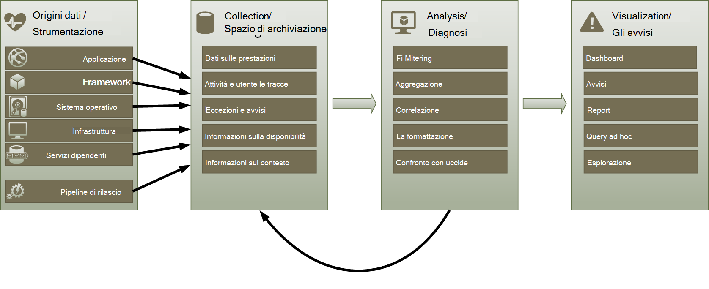
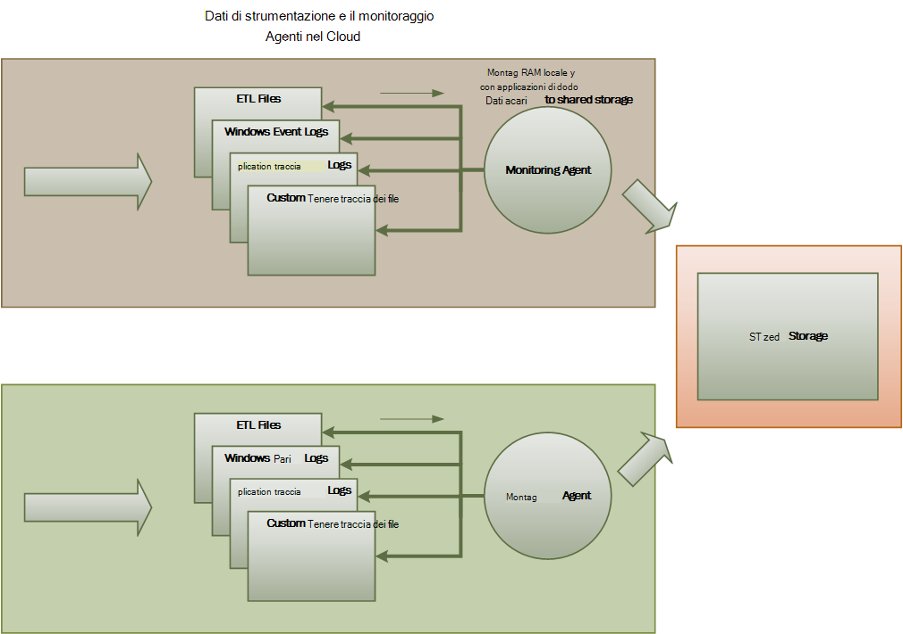
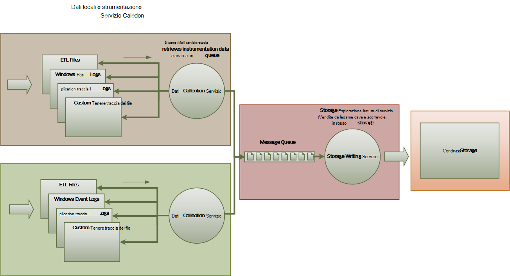
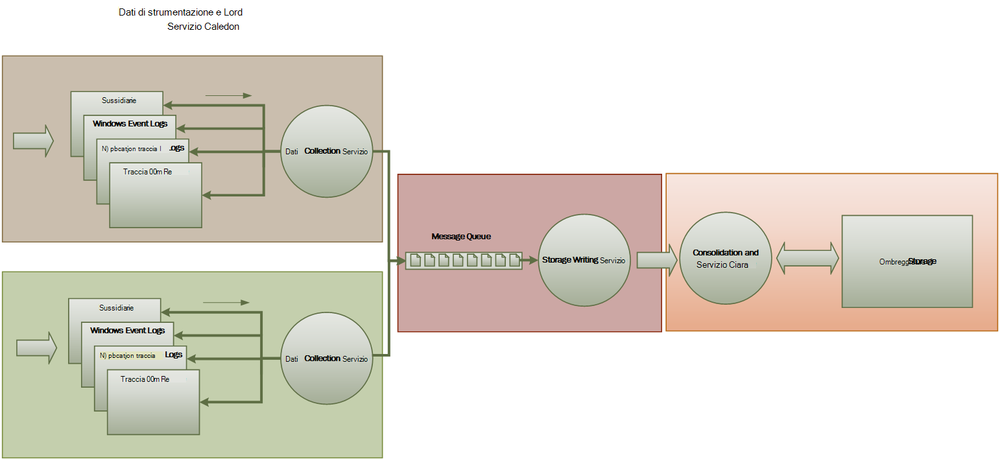

<properties
   pageTitle="Guida di monitoraggio e diagnostica | Microsoft Azure"
   description="Procedure consigliate per il monitoraggio delle applicazioni distribuite nel cloud."
   services=""
   documentationCenter="na"
   authors="dragon119"
   manager="christb"
   editor=""
   tags=""/>

<tags
   ms.service="best-practice"
   ms.devlang="na"
   ms.topic="article"
   ms.tgt_pltfrm="na"
   ms.workload="na"
   ms.date="07/13/2016"
   ms.author="masashin"/>

# <a name="monitoring-and-diagnostics-guidance"></a>Guida di monitoraggio e diagnostica

[AZURE.INCLUDE [pnp-header](../includes/guidance-pnp-header-include.md)]

## <a name="overview"></a>Panoramica
Applicazioni e servizi in esecuzione nel cloud per sono loro natura complesse parti del software, che includono molti elementi mobili. In un ambiente di produzione, è importante essere in grado di rilevare il modo in cui gli utenti utilizzano il sistema, l'utilizzo delle risorse individua e in genere monitorare l'integrità e le prestazioni del sistema di posta. È possibile utilizzare queste informazioni per agevolare la diagnosi per rilevare e correggere i problemi e per consentire di individuare potenziali problemi e impedire che si verifichi.

## <a name="monitoring-and-diagnostics-scenarios"></a>Scenari di diagnostica e monitoraggio
È possibile utilizzare il monitoraggio di ottenere informazioni su come funziona un sistema. Il monitoraggio è una parte fondamentale di mantenere i siti di destinazione di qualità del servizio. Scenari comuni per la raccolta di dati di monitoraggio includono:

- Assicurarsi che il sistema rimane integro.
- Verifica la disponibilità del sistema e i relativi elementi componente.
- Gestione delle prestazioni per assicurarsi che la velocità del sistema non interferisca in modo imprevisto come il volume di lavoro aumenta.
- Per garantire che il sistema soddisfi qualsiasi livello di servizio (Agreement) stabilito con i clienti.
- Protezione della privacy e sicurezza del sistema, gli utenti e i dati.
- Tenere traccia del operazioni eseguite per scopi di controllo o alle normative.
- Monitorare l'utilizzo quotidiano del sistema e individuare le tendenze che potrebbero causare problemi non è indirizzati.
- Problemi che si verificano, da report iniziale tramite per analisi delle cause possibili, rettifica, aggiornamenti software conseguente e distribuzione di registrazione.
- Operazioni di analisi e debug versioni del software.

> [AZURE.NOTE] In questo elenco non deve essere completo. In questo documento è incentrata su questi scenari come situazioni più comuni per l'esecuzione di monitoraggio. Potrebbero essere presenti altri utenti che sono meno comuni o che sono specifici per l'ambiente.

Nelle sezioni seguenti vengono descrivono i due scenari in modo più dettagliato. Le informazioni per ogni scenario viene descritto nel formato seguente:

1. Una breve panoramica dello scenario
2. Requisiti tipici di questo scenario
3. I dati non elaborati strumentazione sono necessari per supportare scenario e possibili fonti di informazioni
4. Come questi dati non elaborati possono essere analizzati e combinati per generare le informazioni di diagnostica significative

## <a name="health-monitoring"></a>Il monitoraggio dell'integrità
Un sistema è integro se è in esecuzione e in grado di elaborare le richieste. Lo scopo di monitoraggio dell'integrità consiste nel generare un'istantanea dell'integrità del sistema in modo da poter verificare che tutti i componenti del sistema funzionino come previsto.

### <a name="requirements-for-health-monitoring"></a>Requisiti per il monitoraggio dell'integrità
Per un operatore deve ricevere un avviso rapidamente (in pochi secondi) se qualsiasi parte del sistema è considerata non corretti. L'operatore dovrebbe essere possibile verificare quali parti del sistema di funzionamento normale e le parti si verificano problemi. L'integrità del sistema può essere evidenziata tramite un sistema di traffico light:

- Rosso per non corretti (ha smesso di sistema)
- Giallo per parzialmente Integro (il sistema è in esecuzione con funzionalità ridotte)
- Verde per completamente integro

Un sistema di monitoraggio completo consente un operatore di drill-down tramite il sistema per visualizzare lo stato di integrità di sottosistemi e dei componenti. Ad esempio, se all'interno del sistema viene illustrato come parzialmente integro, l'operatore dovrebbe essere possibile eseguire lo zoom avanti e determinare quali funzionalità non è attualmente disponibile.

### <a name="data-sources-instrumentation-and-data-collection-requirements"></a>Requisiti di raccolta di dati, strumentazione e origini dati
I dati non elaborati che sono necessari per supportare il monitoraggio dell'integrità possono essere generati come risultato di:

- Individua esecuzione delle richieste utente. Per determinare quali richieste hanno avuto esito positivo, che hanno avuto esito negativo e alle richieste di tempo, è possono utilizzare queste informazioni.
- Utente sintetici monitoraggio. Questa procedura consente di simulare la procedura eseguita da un utente e segue una serie predefinita di passaggi. È consigliabile acquisire i risultati di ogni passaggio.
- Registrazione delle eccezioni, errori e avvisi. Queste informazioni possono essere acquisite in seguito le istruzioni di analisi incorporato nel codice dell'applicazione, come il recupero di informazioni dai registri eventi di tutti i servizi che il sistema fa riferimento.
- Il monitoraggio dell'integrità dei servizi di terze parti che verrà utilizzato. Il controllo può richiedere il recupero e analisi dell'integrità dati che questi servizi forniscono. Queste informazioni possono richiedere diversi formati.
- Endpoint monitoraggio. Questo meccanismo viene descritta in modo più dettagliato nella sezione "Monitoraggio di disponibilità".
- Raccogliere informazioni sulle prestazioni ambiente, ad esempio sfondo utilizzo della CPU o attività (compresa la rete).

### <a name="analyzing-health-data"></a>Analisi dei dati dell'integrità
L'obiettivo principale di monitoraggio è indicare rapidamente se il sistema è in esecuzione. Scelta analisi dei dati immediati può causare un avviso se un componente critico viene rilevato come danneggiato. (Cessa di rispondere a una serie di errori consecutiva di ping, ad esempio). L'operatore può quindi eseguire le operazioni di correttive appropriata.

Un sistema più avanzato potrebbe contenere un elemento stima che consente di eseguire un'analisi fredda su carichi di lavoro recenti e corrente. Un'analisi fredda possibile individuare le tendenze e stabilire se il sistema è soggetto a integrità o se il sistema sarà necessario risorse aggiuntive. Questo elemento stima basare metriche di prestazioni, ad esempio:

- Il tasso di richieste dirette in ogni servizio o sottosistema.
- Tempi di risposta di tali richieste.
- Il volume di dati e in uscita ogni servizio.

Se il valore di qualsiasi metrica supera una determinata soglia, il sistema può generare un avviso per abilitare un operatore o il ridimensionamento automatico (se disponibile) per eseguire le azioni preventive necessarie per mantenere l'integrità del sistema. Queste azioni prevede l'aggiunta di risorse, il riavvio di uno o più servizi che non funziona o applicare la limitazione per le richieste di priorità più bassa.

## <a name="availability-monitoring"></a>Il monitoraggio della disponibilità
Un sistema davvero integro richiede che i componenti e sottosistemi che compongono il sistema sono disponibili. Il monitoraggio della disponibilità strettamente correlato per il monitoraggio dell'integrità. Ma mentre il monitoraggio dell'integrità fornisce una visione immediata dell'integrità corrente del sistema, il monitoraggio della disponibilità riguarda verifica la disponibilità di sistema e i relativi componenti per generare statistiche sulla disponibilità del sistema.

In molti sistemi, alcuni componenti (ad esempio un database) sono configurati con la ridondanza incorporata per consentire un rapido failover in caso di un errore grave o una perdita di connettività. Se possibile, gli utenti non devono essere presente che si è verificato un errore di. Ma da una punto di vista di monitoraggio della disponibilità, è necessario raccogliere le informazioni possibili sul tali errori per determinare la causa e intraprendere azioni correttive per impedire che ricorrente.

I dati che sono necessarie per tenere traccia di disponibilità possono dipendere da diversi fattori di livello inferiore. Molti dei fattori seguenti potrebbe essere specifiche per l'applicazione, sistema e ambiente. Un sistema di monitoraggio efficace acquisisce i dati di disponibilità che corrisponde a questi fattori raggio e aggrega in modo da offrire una panoramica del sistema. Ad esempio, in un sistema di e-commerce, la funzionalità di business che consente a un cliente di ordini dipenda repository in cui sono archiviati i dettagli dell'ordine e il sistema di pagamento che gestisce le transazioni monetari per il pagamento degli ordini. La disponibilità della parte ordine posizionamento del sistema è una funzione la disponibilità di un repository e sottosistema pagamento.

### <a name="requirements-for-availability-monitoring"></a>Requisiti per il monitoraggio della disponibilità
Un operatore anche dovrebbe essere possibile visualizzare la disponibilità di ogni sistema e sottosistema cronologia e usare queste informazioni per individuare le tendenze che potrebbero causare uno o più sottosistemi riesca periodicamente. (I servizi avviano in fase di una determinata ora del giorno corrispondente all'elaborazione orari?)

Una soluzione di monitoraggio dovrebbe fornire una vista immediata e nella cronologia della disponibilità o mancata disponibilità di ogni sottosistema. Anche saranno in grado di avviso rapidamente un operatore quando uno o più servizi fail o utenti non potranno connettersi ai servizi. Si tratta di non solo il monitoraggio di ogni servizio, ma anche esaminare le azioni eseguite da ogni utente se queste azioni non riuscire quando tentano di comunicare con un servizio. In alcuni casi, un grado problemi di connettività normale e potrebbe non essere a causa degli errori temporanei. Ma può essere utile consentire al sistema di generare un avviso per il numero di problemi di connettività a un sottosistema specificato che si verificano durante un periodo specifico.

### <a name="data-sources-instrumentation-and-data-collection-requirements"></a>Requisiti di raccolta di dati, strumentazione e origini dati
Come con il monitoraggio dell'integrità, i dati non elaborati che sono necessari per supportare il monitoraggio della disponibilità possono essere generati sintetici utente monitoraggio e la registrazione eventuali eccezioni, errori e avvisi che possono verificarsi. Inoltre, è possibile ottenere dati sulla disponibilità di eseguire il monitoraggio dell'endpoint. L'applicazione può esporre uno o più endpoint integrità, ogni test per l'accesso a un'area funzionale all'interno del sistema. Il sistema di monitoraggio può effettuare il ping ogni endpoint seguendo una pianificazione definita e raccogliere i risultati (esito positivo o fail).

Devono essere registrati tutti timeout, problemi di connettività di rete e tentativi di connessione. Tutti i dati dovrebbero essere impostate.

<a name="analyzing-availability-data"></a>
### <a name="analyzing-availability-data"></a>Analisi dei dati di disponibilità
I dati di strumentazione devono essere aggregati e correlare per supportare i tipi di analisi seguenti:

- Disponibilità immediata del sistema e sottosistemi.
- Frequenza di errore disponibilità del sistema e sottosistemi. Se possibile, un operatore dovrebbe essere possibile correlare errori con attività specifiche: che cos'è stata succede quando il sistema non?
- Una visualizzazione cronologica di tassi di errore del sistema o qualsiasi sottosistemi in seguito al specificato periodo di prova e il caricamento del computer (numero di richieste degli utenti, ad esempio) quando si è verificato un errore.
- Motivi per cui indisponibilità del sistema o qualsiasi sottosistemi. Ad esempio, potrebbero essere i motivi servizio non è in esecuzione, perdita, di connettività connesso ma timeout e connessi ma restituendo gli errori.

È possibile calcolare la percentuale di disponibilità di un servizio per un periodo di tempo utilizzando la formula seguente:

```
%Availability =  ((Total Time – Total Downtime) / Total Time ) * 100
```

Questo è utile per contratto di servizio. ([Contratto di servizio monitoraggio](#SLA-monitoring) descritto in dettaglio più avanti in questa Guida.) La definizione del tempo di _inattività_ dipende dal servizio. Ad esempio servizio Visual Studio Team servizi Build definisce il tempo di inattività come del periodo (totali accumulati minuti) durante il quale creare servizio non è disponibile. Un minuto verrà considerato non disponibile se continue richieste HTTP al servizio di compilazione di eseguire operazioni iniziato dal cliente in tutto il minuto come risultato un codice di errore o non restituire una risposta.

## <a name="performance-monitoring"></a>Monitoraggio delle prestazioni
Mentre il sistema viene inserito in condizioni di carico maggiore di (aumentando il volume degli utenti), le dimensioni del set di dati che cresce tali utenti l'accesso e la possibilità di errore di uno o più componenti diventa più probabilità. Errore componente è spesso, preceduto da una riduzione delle prestazioni. Se si è in grado di rilevare una riduzione, è possibile eseguire i passaggi per priorità per risolvere il problema.

Le prestazioni del sistema dipendono da diversi fattori. Ogni fattore è in genere misurato tramite indicatori di prestazioni chiave (KPI), ad esempio il numero le transazioni del database al secondo o il volume di richieste di rete completata servite in un intervallo di tempo specificato. Alcuni di questi indicatori KPI potrebbero essere disponibili come prestazioni specifiche misure, mentre gli altri utenti potrebbero deriva da una combinazione di metriche.

> [AZURE.NOTE] Determinare le prestazioni scarsa o buona necessario comprendere il livello di prestazioni in cui il sistema deve essere in grado di esecuzione. È necessario osservare il sistema mentre il corretto funzionamento in condizioni di carico tipico e acquisizione dei dati per ogni indicatore KPI in un periodo di tempo. Questa operazione può implicare eseguono il sistema in un carico simulato in un ambiente di testing e la raccolta di dati appropriato prima di distribuire il sistema in un ambiente di produzione.

> È necessario che il monitoraggio per migliorare le prestazioni non diventa un carico di lavoro nel sistema. Potrebbe essere possibile regolare il livello di dettaglio per i dati che consente di raccogliere il processo di monitoraggio delle prestazioni.

### <a name="requirements-for-performance-monitoring"></a>Requisiti per il monitoraggio delle prestazioni
Per esaminare le prestazioni del sistema, è necessario che in genere visualizzare le informazioni che include:

- Percentuali di risposta per le richieste utente.
- Il numero di richieste simultanee utente.
- Il volume del traffico di rete.
- Frequenza in cui le transazioni, vengono completate.
- Tempo medio di elaborazione delle richieste.

Può inoltre essere utile fornire strumenti che consentono un operatore utili correlazioni campione, ad esempio:

- Il numero di utenti e latenza richiesta orari (il tempo impiegato per avviare una richiesta di elaborazione dopo l'utente ha inviato).
- Il numero di utenti e l'ora di risposta medio (tempo necessario per completare una richiesta dopo l'avvio processing).
- Il volume di richieste rispetto al numero di errori di elaborazione.

Insieme a queste informazioni funzionale di alto livello, un operatore dovrebbe essere possibile ottenere una visualizzazione dettagliata delle prestazioni per ogni componente del sistema. Questi dati sono in genere forniti tramite raggio contatori che tengono traccia delle informazioni, ad esempio:

- Utilizzo della memoria.
- Numero di thread.
- Tempo di elaborazione CPU.
- Lunghezza coda richieste.
- Tassi dei / o disco o della rete e gli errori.
- Numero di byte scritto o letto.
- Indicatori di middleware, ad esempio coda.

Tutte le visualizzazioni devono consentire a un operatore di specificare un periodo di tempo. I dati visualizzati potrebbero essere uno snapshot della situazione attuale e/o una visualizzazione cronologica delle prestazioni.

Un operatore dovrebbe essere possibile generare un avviso in base a qualsiasi misurazione delle prestazioni per qualsiasi valore specificato durante un intervallo di tempo specificato.

### <a name="data-sources-instrumentation-and-data-collection-requirements"></a>Requisiti di raccolta di dati, strumentazione e origini dati
È possibile raccogliere dati relativi alle prestazioni di alto livello (velocità, numero di utenti, numero di transazioni commerciali, percentuali di errore e così via) per controllare lo stato di avanzamento delle richieste degli utenti mentre la ricezione e passano attraverso il sistema. Questo comporta l'inserimento delle istruzioni di analisi in punti chiave codice dell'applicazione, insieme a informazioni sugli intervalli. Tutti gli errori, eccezioni e gli avvisi devono essere acquisiti con dati sufficienti per la loro correlazione con le richieste che li ha. Il log di Internet Information Services (IIS) è un'altra origine utile.

Se possibile, è inoltre necessario acquisire dati sulle prestazioni per tutti i sistemi esterni che utilizza l'applicazione. Questi sistemi esterni potrebbero fornire le proprie contatori o altre caratteristiche per la richiesta di dati sulle prestazioni. Se non è possibile, registrare informazioni ad esempio l'ora di inizio e ora di fine di ogni richiesta apportata a un sistema esterno, con lo stato dell'operazione (esito positivo, fail o avviso). Ad esempio, è possibile utilizzare un approccio cronometro a richieste di tempo: avviare un timer quando viene avviata la richiesta e quindi interrompere il timer termine la richiesta.

Dati sulle prestazioni di basso livello per singoli componenti di un sistema potrebbero essere disponibili tramite le caratteristiche e servizi, ad esempio contatori Windows e diagnostica di Azure.

### <a name="analyzing-performance-data"></a>Analisi dei dati sulle prestazioni
La maggior parte delle attività di analisi è costituito da aggregare i dati delle prestazioni dal tipo di richiesta utente e/o sottosistema o servizio in cui viene inviato ogni richiesta. Aggiunta di un elemento a un carrello o eseguire il processo di acquisto in un sistema di e-commerce un esempio di una richiesta dell'utente.

Un altro requisito comune è riepilogare dati sulle prestazioni in percentili selezionati. Ad esempio, un operatore potrebbe determinare i tempi di risposta per il 99% di richieste, 95% delle richieste e 70% delle richieste. Potrebbe essersi destinazioni contratto di servizio o altri obiettivi impostato per ogni percentile. I risultati in corso dovrebbero essere riportati in quasi in tempo reale per rilevare i problemi immediati. Anche aggregare i risultati nel tempo più statistica.

In caso di problemi di latenza sulle prestazioni, un operatore dovrebbe essere possibile identificare rapidamente la causa del bottiglia esaminando la latenza di ogni passaggio che esegue ogni richiesta. Dati sulle prestazioni devono pertanto consentono di correlare misure delle prestazioni per ogni passaggio collegarli a una richiesta specifica.

In base ai requisiti di visualizzazione, potrebbe essere utile generare e archiviare un cubo di dati che contiene visualizzazioni dei dati non elaborati. Il cubo di dati è possibile consentire ad hoc esecuzione di query complesse e l'analisi di informazioni sulle prestazioni.

## <a name="security-monitoring"></a>Il monitoraggio della protezione
Tutti i sistemi commerciali contenenti dati riservati devono implementare una struttura di protezione. La complessità del meccanismo di protezione in genere è una funzione di riservatezza dei dati. In un sistema che richiede l'autenticazione degli utenti, è opportuno prendere:

- Tentativi di accesso tutti, se non forniscono o esito positivo.
- Tutte le operazioni eseguite da, e i dettagli di tutte le risorse accedono, ossia un utente autenticato.
- Quando un utente termina una sessione e uscire.

Monitoraggio potrebbe essere possibile rilevare attacchi al sistema. Ad esempio un numero elevato di tentativi di accesso non può indicare un attacco tentativi. Un aumento imprevisto nelle convocazioni potrebbe essere il risultato di attacchi distribuito (DDoS) negazione del servizio. È necessario essere pronti a controllare tutte le richieste di tutte le risorse indipendentemente dall'origine di tali richieste. Un sistema che dispone di una vulnerabilità accesso potrebbe accidentalmente esporre risorse al mondo esterno senza doverlo effettivamente l'accesso.

### <a name="requirements-for-security-monitoring"></a>Requisiti per il monitoraggio della protezione
Gli aspetti importanti di monitoraggio della protezione devono attivare rapidamente un operatore di:

- Consente di individuare tentativi di intrusione da un'entità non autenticata.
- Identificare i tentativi di entità per eseguire operazioni sui dati per il quale che non dispone di accesso.
- Determinare se il sistema o una parte del sistema di attacco dall'esterno o interno. (Ad esempio, un utente autenticato dannoso potrebbe essere tentativo di portare il sistema verso il basso.)

Per supportare questi requisiti, un operatore deve ricevere una notifica:

- Se un account rende ripetuto non è possibile tentativi di accesso all'interno di un periodo specificato.
- Se un account autenticato ripetutamente tenta di accedere a una risorsa non consentita durante un periodo specificato.
- Se un numero elevato di richieste non autenticati o non autorizzate si verifica durante un periodo specificato.

Le informazioni fornite a un operatore devono includere l'indirizzo di host di origine per ogni richiesta. Se violazioni della protezione si verificano regolarmente da un determinato intervallo di indirizzi, questi host potrebbero risultare bloccati.

Fondamentale per garantire la sicurezza di un sistema è la possibilità di rilevare rapidamente le azioni che si allontanano il criterio di consueto. Informazioni, ad esempio il numero di esito negativo e/o non riuscite richieste di accesso possono essere visualizzate in modo visivo che consente di rilevare se esiste un picco nell'attività in un momento insolito. (Un esempio di questa attività è agli utenti l'accesso al 3.00 ed eseguire molte operazioni quando viene avviato il giorno lavorativo alle 9:00). Questo informazioni possono essere utilizzate anche per configurare il ridimensionamento automatico basate sul tempo. Se, ad esempio, un operatore osserva che un numero elevato di utenti regolarmente di accesso in un determinato momento del giorno, l'operatore può disporre avviare i servizi di autenticazione aggiuntive per gestire il volume di lavoro e quindi arrestare questi servizi aggiuntivi quando ha superato la punta.

### <a name="data-sources-instrumentation-and-data-collection-requirements"></a>Requisiti di raccolta di dati, strumentazione e origini dati
Un aspetto globale dei sistemi più distribuiti è la sicurezza. I dati desiderati sono probabile che deve essere generato in più punti all'interno di un sistema. È necessario prendere in considerazione un approccio informazioni sulla protezione e gestione di evento (SIEM) per raccogliere le informazioni relative alla protezione risultante da eventi generati dall'applicazione, apparecchiature di rete, server, firewall, il software antivirus e altri elementi di prevenzione intrusione.

Il monitoraggio della protezione, è possibile incorporare dati dagli strumenti che non fanno parte dell'applicazione. Questi strumenti possono includere utilità che identificano analisi delle porte attività esterna governativi o filtri di rete che consente di individuare tentativi di accesso non autenticato all'applicazione e dati.

In ogni caso, i dati raccolti necessario abilitare un amministratore determinare la natura di qualsiasi attacco e intraprendere contromisure appropriate.

### <a name="analyzing-security-data"></a>Analisi dei dati di sicurezza
Una funzionalità di monitoraggio di sicurezza è la gamma di origini da cui si verifica i dati. I diversi formati e livello di dettaglio spesso richiedono complessa analisi dei dati acquisiti per collegare insieme in un thread coerente delle informazioni. Oltre a più semplice dei casi (ad esempio rilevamento di un numero elevato di componenti aggiuntivi di accesso non riusciti o tentativi ripetuti di accesso non autorizzato alle risorse critiche), potrebbe non essere possibile eseguire l'elaborazione automatica complessa dei dati di protezione. Se, tuttavia, potrebbe essere preferibile scrivere i dati, timestamp ma in caso contrario nel formato originale, a un repository protetto per consentire di esperti analisi manuale.

<a name="SLA-monitoring"></a>

## <a name="sla-monitoring"></a>Contratto di servizio monitoraggio
Molti sistemi commerciali che supportano i clienti pagamenti apportare garanzie sulle prestazioni del sistema sotto forma di contratti di servizio. In pratica, contratti di servizio indicare che il sistema consente di gestire un volume di lavoro all'interno di un intervallo di tempo approvata, senza perdere informazioni importanti. Contratto di servizio monitoraggio riguarda garantire che il sistema soddisfi misurabili contratti di servizio.

> [AZURE.NOTE] Contratto di servizio monitoraggio strettamente correlato per il monitoraggio delle prestazioni. Ma che il monitoraggio delle prestazioni riguarda assicurandosi che il sistema funzioni _in modo ottimale_, contratto di servizio monitoraggio è disciplinato da un'obbligazione contrattuale che consente di definire quali _in modo ottimale_ significa.

Contratti di servizio vengono spesso definiti in termini di:

- Disponibilità globale del sistema. Ad esempio un'organizzazione potrebbe garantisce che il sistema saranno disponibile per 99,9 del tempo. Questo equivale a non più di 9 ore di inattività all'anno o circa 10 minuti alla settimana.
- Velocità effettiva operativa. Questo aspetto è spesso indicato come uno o più – soglie massime, ad esempio per garantire che il sistema può supporta fino a 100.000 richieste utente simultanee o gestire 10.000 transazioni simultanee business.
- Tempo di risposta operativi. Il sistema può anche essere garanzie per la velocità di elaborazione delle richieste completate. Un esempio è che il 99% di tutte le transazioni business finirà all'interno di 2 secondi e non singola transazione richiederà più di 10 secondi.

> [AZURE.NOTE] Alcuni contratti per sistemi commerciali possono inoltre includere contratti di servizio di supporto tecnico. Un esempio è che tutte le richieste di supporto tecnico verranno richiedono una risposta entro 5 minuti e che il 99% di tutti i problemi verrà risolto completamente entro 1 giorno lavorativo. Efficace [Gestione problemi](#issue-tracking) (descritto più avanti in questa sezione) è fondamentale per riunione contratti di servizio, ad esempio questi.

### <a name="requirements-for-sla-monitoring"></a>Requisiti per il monitoraggio contratto di servizio
Al livello più alto, un operatore dovrebbe essere possibile stabilire a colpo d'occhio se il sistema di soddisfare i contratti di servizio approvate o meno. E se non, l'operatore dovrebbe essere possibile eseguire il drill-verso il basso ed esaminare i fattori per determinare i motivi per cui si prestazioni.

Indicatori di alto livello tipici che possono essere rappresentati visivamente includono:

- La percentuale di disponibilità servizio.
- L'efficienza delle applicazioni (misurato in termini di transazioni completate e/o operazioni al secondo).
- Il numero di richieste di esito negativo / l'applicazione.
- Il numero di errori di applicazioni e di sistema, eccezioni e avvisi.

Tutti questi indicatori di deve essere in grado di vengono filtrati in base a un periodo di tempo specificato.

Un'applicazione cloud probabilmente includerà un numero di sottosistemi e componenti. Un operatore dovrebbe essere possibile selezionare un indicatore di alto livello e vedere come è composta dallo stato degli elementi sottostanti. Ad esempio, se il tempo di attività del sistema è inferiore da un valore valido, un operatore dovrebbe essere possibile applicare lo zoom avanti e determinare quali elementi sono contribuire a questo errore.

> [AZURE.NOTE] Tempi deve essere definito con attenzione. In un sistema che utilizza la ridondanza per garantire la massima disponibilità, potrebbero non riuscire a singole istanze di elementi, ma il sistema può rimanere funziona. Tempi presentate dal monitoraggio dell'integrità devono indicare il tempo di attività aggregata di ogni elemento e non necessariamente se sistema effettivamente bloccato. Inoltre, gli errori potrebbero essere isolati. Anche se non è disponibile un sistema specifico, il resto del sistema potrebbe restare disponibile, anche se con funzionalità ridotte. (In un sistema di e-commerce, un errore nel sistema potrebbe impedire un cliente di inserire gli ordini, ma il cliente ancora potrebbe essere possibile esplorare il catalogo di prodotti)

Per gli avvisi scopi, il sistema dovrebbe essere possibile generare un evento se uno degli indicatori di alto livello supera una determinata soglia. I dettagli di livello inferiore di vari fattori che compongono il campo indicatore di alto livello dovrebbero essere disponibili come dati contestuali di sistema avvisi.

### <a name="data-sources-instrumentation-and-data-collection-requirements"></a>Requisiti di raccolta di dati, strumentazione e origini dati
I dati non elaborati che sono necessari per supportare il monitoraggio contratto di servizio sono simili a dati non elaborati sono necessari per il monitoraggio delle prestazioni, insieme ad alcuni aspetti di salute e il monitoraggio della disponibilità. (Vedere le sezioni per informazioni dettagliate). È possibile acquisire dati da:

- Monitoraggio endpoint.
- Registrazione delle eccezioni, errori e avvisi.
- Individua l'esecuzione di richieste utente.
- Controllare la disponibilità dei servizi di terze parti che verrà utilizzato.
- Utilizzo di contatori e dati sulle prestazioni.

Tutti i dati devono essere timeout e indicatore di data e ora.

### <a name="analyzing-sla-data"></a>Analisi dei dati contratto di servizio
I dati di strumentazione devono essere aggregati per generare un'immagine di prestazioni complessive del sistema. Dati aggregati devono supportare anche drill-down per abilitare l'esame delle prestazioni di sottosistema sottostante. Ad esempio, dovrebbe essere possibile per:

- Calcolare il numero totale di richieste utente durante un periodo specificato e determinare il tasso di esito positivo o negativo di queste richieste.
- Combinare i tempi di risposta dell'utente richieste per generare una panoramica dei tempi di risposta di sistema.
- Analizzare lo stato di avanzamento di richieste utente per suddividere il tempo di risposta complessivo della richiesta nei tempi di risposta i singoli elementi di lavoro in tale richiesta.  
- Verificare la disponibilità generale del sistema come percentuale del tempo di attività per un periodo specifico.
- Analizzare la percentuale di disponibilità di tempo dei singoli componenti e servizi nel sistema. Questo potrebbe richiedere l'analisi dei registri generati i servizi di terze parti.

Molti sistemi commerciali sono necessari per inviare una segnalazione cifre a prestazioni reali fronte approvate contratti di servizio per un periodo specificato, in genere un mese. Queste informazioni possono essere utilizzate per calcolare crediti o altre forme di rimborsi per i clienti se i contratti di servizio non vengono soddisfatti durante questo periodo. È possibile calcolare la disponibilità di un servizio utilizzando la tecnica descritta nella sezione [analisi dei dati di disponibilità](#analyzing-availability-data).

Ai fini interni, un'organizzazione potrebbe inoltre tenere traccia il numero e natura dei problemi che generano servizi di. Come risolvere questi problemi rapidamente o eliminarli completamente aiuteranno per ridurre i tempi di inattività e soddisfano i contratti di servizio.

## <a name="auditing"></a>Il controllo
A seconda della natura dell'applicazione, potrebbe essere legge o altre normative legali che specificano i requisiti per il controllo operazioni degli utenti e registrare ogni accesso ai dati. Il controllo può dimostrare che i clienti i collegamenti a richieste specifiche. Non ripudio è importante molti sistemi di e-business per la gestione di attendibilità tra un cliente e l'organizzazione responsabile per l'applicazione o servizio.

### <a name="requirements-for-auditing"></a>Requisiti per il controllo
Gli analisti devono avere la possibilità di individuare la sequenza di operazioni aziendali che gli utenti eseguono in modo che è possibile ricostruire azioni degli utenti. Potrebbe essere necessario semplicemente per motivi di record o all'interno di un'analisi legali.

Le informazioni di controllo sono riservate. Probabile che conterrà dati che identificano gli utenti del sistema, insieme le attività che si sta eseguendo. Per questo motivo, le informazioni di controllo è probabile che avrà il modulo di report che sono disponibili solo per gli analisti attendibili anziché come un sistema interattivo che supporta drill-down di operazioni grafiche. Gli analisti dovrebbero essere possibile generare un intervallo di report. Ad esempio report potrebbero elenco attività di tutti gli utenti che si verificano durante un intervallo di tempo specificato, Dettagli cronologia dell'attività per un singolo utente o la sequenza di operazioni eseguite su una o più risorse dell'elenco.

### <a name="data-sources-instrumentation-and-data-collection-requirements"></a>Requisiti di raccolta di dati, strumentazione e origini dati
Principali fonti di informazioni per il controllo possono includere:

- Il sistema di sicurezza che gestisce l'autenticazione utente.
- Tenere traccia dei registri tale record attività dell'utente.
- Log di protezione per tenere traccia di tutte le richieste di rete identificabili e non identificabili.

Il formato di dati di controllo e il modo in cui è archiviato potrebbe dipendere dalla requisiti normativi. Ad esempio, potrebbe non essere possibile eliminare i dati in alcun modo. (È necessario registrata nel formato originale.) Accesso all'archivio in cui viene mantenuto deve essere protetto in modo da impedire.

### <a name="analyzing-audit-data"></a>Analisi dei dati di controllo
Gli analisti devono essere in grado di accedere ai dati non elaborati interamente nella sua forma originale. Oltre la necessità di generare i report di controllo più comuni, gli strumenti per l'analisi dei dati sono probabilmente specializzate e mantenere esterni al sistema.

## <a name="usage-monitoring"></a>L'uso di monitoraggio
L'uso di monitoraggio tiene traccia delle modalità di utilizzo delle caratteristiche e i componenti di un'applicazione. Un operatore è possibile utilizzare i dati raccolti da:

- Verificare quali caratteristiche vengono utilizzate e le aree sensibili potenziali nel sistema. Elementi di traffico elevato possono trarre vantaggio da partizioni funzionale o persino replica di distribuire il carico più equamente. Un operatore può anche usare queste informazioni per verificare quali caratteristiche vengono utilizzate raramente e sono possibili candidati per pensionistico o sostituzione in una versione futura del sistema.
- Ottenere informazioni sugli eventi operativi del sistema in uso normale. In un sito di e-commerce, ad esempio, è possibile registrare le informazioni statistiche relative il numero delle transazioni e il volume dei clienti che sono responsabili dei prodotti. Queste informazioni possono essere utilizzate per la pianificazione delle capacità man mano che aumenta il numero dei clienti.
- Consente di individuare (eventualmente indirettamente) soddisfazione con le prestazioni del sistema. Ad esempio, se un numero elevato di utenti in un sistema di e-commerce abbandonare periodicamente i carrelli, potrebbe essere a causa di un problema con la funzionalità di estrazione.
- Generare informazioni di fatturazione. Applicazione commerciale o un servizio multi-tenant potrebbe applicare costi per le risorse che utilizzano i clienti.
- Applicare quote. Se un utente in un sistema multi-tenant supera la quota di pagamento di elaborazione l'uso di tempo e risorse durante un periodo specificato, il loro accesso può essere limitata o elaborazione può essere limitata.

### <a name="requirements-for-usage-monitoring"></a>Requisiti per l'uso di monitoraggio
Per esaminare l'utilizzo di sistema, è necessario che in genere visualizzare le informazioni che include:

- Il numero di richieste che vengono elaborati da ogni sottosistema e indirizzati a ogni risorsa.
- Il lavoro che ogni utente esegue.
- Il volume di archiviazione dei dati che occupa ogni utente.
- Le risorse che accede a ogni utente.

Un operatore anche dovrebbe essere possibile generare grafici. Ad esempio, un grafico possono essere visualizzate agli utenti più che richiedono elevata di risorse o accede a più di frequente risorse o funzionalità del sistema.

### <a name="data-sources-instrumentation-and-data-collection-requirements"></a>Requisiti di raccolta di dati, strumentazione e origini dati
L'uso di verifica può essere eseguita relativamente alto livello. È possibile nota ora di inizio e fine di ogni richiesta e la natura della richiesta (lettura, scrittura e così via, a seconda delle risorse in questione). È possibile ottenere queste informazioni per:

- Individua attività dell'utente.
- Acquisizione contatori che misurano l'utilizzo per ogni risorsa.
- Monitoraggio dell'utilizzo delle risorse per ogni utente.

Per motivi di misurazione, è necessario essere in grado di identificare quali utenti sono responsabili per eseguire le operazioni e le risorse che utilizzano queste operazioni. Le informazioni raccolte devono essere sufficientemente dettagliati per permettere fatturazione accurata.

<a name="issue-tracking"></a>
## <a name="issue-tracking"></a>Gestione dei problemi
Clienti e altri utenti potrebbero segnalare problemi se eventi imprevisti o il comportamento si verifica nel sistema. Gestione dei problemi riguarda la gestione di questi problemi, associarli a sforzi per risolvere eventuali problemi sottostanti nel sistema e per informare i clienti di possibili soluzioni.

### <a name="requirements-for-issue-tracking"></a>Requisiti per la gestione dei problemi
Gli operatori eseguono spesso problemi con un sistema separato che consente di registrare e comunicare i dettagli dei problemi che gli utenti segnalano. Questi dettagli possono includere le attività che l'utente ha tentato di eseguire, sintomi il problema, la sequenza di eventi e qualsiasi errore o messaggi di avviso che sono stati rilasciati.

### <a name="data-sources-instrumentation-and-data-collection-requirements"></a>Requisiti di raccolta di dati, strumentazione e origini dati
L'origine dati iniziali per i dati di problemi è l'utente che ha effettuato il problema in primo luogo. L'utente potrebbe essere possibile fornire dati aggiuntivi, ad esempio:

- Un arresto anomalo (se l'applicazione include un componente che viene eseguito sul desktop dell'utente).
- Uno snapshot dello schermo.
- Data e ora quando si verifica l'errore, insieme a eventuali altre informazioni ambientale, ad esempio la posizione dell'utente.

Queste informazioni possono essere utilizzate per l'impegno debug e creare un backlog per le versioni future del software.

### <a name="analyzing-issue-tracking-data"></a>Analisi dei dati problemi
Gli utenti diversi potrebbero segnalare il problema persiste. Il sistema di gestione problemi deve associare i report più comuni.

Lo stato di avanzamento dell'attività di debug deve essere registrato rispetto a ogni rapporto problema. Quando il problema viene risolto, il cliente può essere informato della soluzione.

Se un utente segnala un problema che è disponibile una soluzione nota nel sistema di problemi, l'operatore dovrebbe essere possibile informare immediatamente l'utente della soluzione.

## <a name="tracing-operations-and-debugging-software-releases"></a>Operazioni di analisi e debug versioni del software
Quando un utente segnala un problema, spesso solo l'utente è presente l'impatto immediato contenente le operazioni. L'utente potrà essere solo rimandato i risultati della propria esperienza a un operatore responsabile della gestione del sistema. I contenuti sono in genere solo sintomo visibile di uno o più problemi di base. In molti casi, gli analisti saranno necessario analizzare tramite la cronologia delle operazioni sottostanti per stabilire la causa del problema. Questo processo è denominato _analisi delle cause_.

> [AZURE.NOTE] Analisi delle cause principali possono rivelare efficiente nella finestra di progettazione di un'applicazione. In questi casi, potrebbe essere possibile rielaborare elementi interessati e distribuirle come parte di una versione successiva. Questo processo richiede attenzione a controllo e monitorare strettamente componenti aggiornati.

### <a name="requirements-for-tracing-and-debugging"></a>Requisiti per l'analisi e il debug
Per la traccia di eventi imprevisti e altri problemi, è essenziale che i dati di monitoraggio forniscono informazioni sufficienti per abilitare analisti per risalire alla origini di questi problemi e ricostruire la sequenza di eventi che si sono verificati. Queste informazioni devono essere sufficienti per abilitare gli analisti individuare la causa principale di eventuali problemi. Uno sviluppatore può quindi apportare le modifiche necessarie per impedire che ricorrente.

### <a name="data-sources-instrumentation-and-data-collection-requirements"></a>Requisiti di raccolta di dati, strumentazione e origini dati
Risoluzione dei problemi può comportare la traccia di tutti i metodi (e relativi parametri) richiamati come parte di un'operazione per creare una struttura che descrive il flusso logico attraverso il sistema quando un cliente richiede specifiche. Eccezioni e avvisi generato dal sistema in seguito a questo flusso che devono essere acquisiti e ha eseguito l'accesso.

Per supportare il debug, il sistema può fornire hook che consentono un operatore acquisire informazioni sullo stato dei punti essenziali nel sistema. In alternativa, il sistema può inviare informazioni dettagliate come lo stato di avanzamento operativa selezionata. Acquisizione dati questo livello di dettaglio possono imporre un carico aggiuntivo sul sistema e devono essere un processo temporaneo. Un operatore utilizza questo processo principalmente quando una serie di eventi insolita si verifica ed è difficile da replicare o una nuova versione di uno o più elementi in un sistema richiede il monitoraggio per assicurarsi che la funzione di elementi come previsto.

## <a name="the-monitoring-and-diagnostics-pipeline"></a>La pipeline di monitoraggio e diagnostica
Monitoraggio di un sistema distribuito su larga scala pone significativa. Ognuna delle situazioni descritte nella sezione precedente non deve necessariamente essere considerato separatamente. È probabile che sia una sovrapposizione significativa nei dati di monitoraggio e diagnostici che sono necessario per ogni caso, anche se questi dati potrebbero essere necessario elaborate e presentate in vari modi. Per questi motivi, è necessario prendere visione di monitoraggio e diagnostica.

È possibile visualizzare il processo di diagnostica e monitoraggio intera come pipeline che include le fasi illustrate nella figura 1.



_Figura 1. Le fasi nella pipeline di monitoraggio e diagnostica_

Figura 1 viene evidenziato come i dati per il monitoraggio e diagnostica possono provenire da varie origini dati. Le fasi di raccolta e strumentazione riguardano l'individuazione delle origini nel punto in cui i dati devono essere acquisito, determinare i dati da acquisire, come l'acquisizione e come formattare i dati in modo che possono essere esaminata facilmente. La fase di analisi/diagnosi accetta i dati non elaborati e viene utilizzata per generare informazioni significative che un operatore consente di determinare lo stato del sistema. L'operatore può usare queste informazioni per decidere sui possibili azioni da intraprendere e quindi reimmettere i risultati nella fasi strumentazione e insieme. La fase di condivisione della visualizzazione/avviso presenta una visualizzazione consumo dello stato del sistema. È possibile visualizzare le informazioni in quasi in tempo reale utilizzando una serie di dashboard. In grado di generare report, grafici e grafici per fornire una visualizzazione cronologica dei dati che consente di identificare le tendenze a lungo termine. Se l'informazione indica che un indicatore KPI è probabile che superano i limiti accettabili, questo passaggio può essere attivata anche un avviso per un operatore. In alcuni casi, un avviso può essere utilizzato anche per avviare un processo automatico che tenta di effettuare operazioni correttive, ad esempio il ridimensionamento automatico.

Si noti che questa procedura costituisce un processo continuo del flusso di cassa nel punto in cui si verificano le fasi in parallelo. Se possibile, tutte le fasi dovrebbero essere configurabili in modo dinamico. Un certo punto, soprattutto quando un sistema è stato distribuito appena o si sono verificati problemi, potrebbe essere necessario raccogliere dati estesi alla scala cronologica più frequenti. In altri casi, dovrebbe essere possibile ripristinare l'acquisizione di un livello di base delle informazioni essenziali per verificare che il sistema funzioni correttamente.

Inoltre, il processo di monitoraggio intero deve essere considerato una soluzione in corso, attiva che è soggetto a ottimizzato e i miglioramenti in seguito a commenti e suggerimenti. Ad esempio, si può partire da diversi fattori per determinare l'integrità del sistema di misura. Analisi nel tempo potrebbero causare un perfezionamento come si annullano misure che non sono importanti, per consentire a con maggiore precisione lo stato attivo sui dati che è necessario riducendo rumore di fondo.

## <a name="sources-of-monitoring-and-diagnostic-data"></a>Origini dati di monitoraggio e diagnostici
Le informazioni che utilizza il processo di monitoraggio possono provenire da diverse origini, come illustrato nella figura 1. Livello di applicazione informazioni provengono da registri traccia incorporati nel codice del sistema. Gli sviluppatori devono seguire un approccio standard per tenere traccia del flusso di controllo mediante il proprio codice. Ad esempio una voce a un metodo può generare un messaggio di traccia che specifica il nome del metodo, l'ora corrente, il valore di ogni parametro ed eventuali altre informazioni pertinenti. Registrazione delle date e ore entrata o uscita può inoltre rivelarsi utile.

Registrare tutte le eccezioni e gli avvisi e assicurarsi di mantenere una traccia completa di eventuali eccezioni annidate e avvisi. Se possibile, è inoltre necessario acquisire informazioni che identificano l'utente che esegue il codice, insieme a informazioni di correlazione attività (per tenere traccia delle richieste durante il passaggio attraverso il sistema). Ed eseguire tentativi di accesso a tutte le risorse, ad esempio code di messaggi, database, file e altri servizi dipendenti. Utilizzare queste informazioni per la misurazione e ai fini del controllo.

Molte applicazioni uso delle raccolte e Framework per eseguire attività comuni, ad esempio l'accesso a un archivio dati o le comunicazioni di rete. Queste strutture potrebbero essere configurabili per fornire i propri messaggi di analisi e le informazioni di diagnostiche non elaborate, ad esempio frequenza delle transazioni e successi di trasmissione dei dati e gli errori.

> [AZURE.NOTE] Molti framework moderno pubblicare automaticamente le prestazioni e traccia eventi. Acquisizione di queste informazioni è sufficiente offre la possibilità di recuperare e archiviarlo nel punto in cui possono essere elaborato e analizzato.

Il sistema operativo in cui viene eseguita l'applicazione può essere una fonte di basso livello informazioni di sistema, ad esempio contatori che indicano i/o tariffe, utilizzo della memoria e l'utilizzo della CPU. Potrebbero essere segnalati anche errori del sistema operativo (ad esempio, l'errore per aprire un file in modo corretto).

È anche necessario prendere in considerazione l'infrastruttura e dei componenti sul quale viene eseguito il sistema sottostante. Macchine virtuali, reti virtuali e servizi di archiviazione possono essere origini dei contatori a livello di infrastruttura importanti e altri dati di diagnostica.

Se l'applicazione utilizza altri servizi esterni, ad esempio un server web o un sistema di gestione di database, questi servizi possono pubblicare le proprie informazioni di analisi, i registri e contatori. Esempi dinamico Gestione viste di SQL Server per tenere traccia delle operazioni eseguite su un database SQL Server e registri traccia IIS per registrare le richieste relative a un server web.

Come vengono modificati i componenti di un sistema e vengono distribuite nuove versioni, è importante essere in grado di problemi relativi ad attributi, eventi e il formato per ogni versione. Queste informazioni devono essere collegate alla pipeline di rilascio in modo che è possibile tracciare rapidamente e correggere i problemi con una versione specifica di un componente.

Nel sistema, potrebbero verificarsi problemi di sicurezza in qualsiasi momento. Ad esempio, un utente possa tentare di accedere con un ID utente non valido o una password. Un utente autenticato potrebbe tentare di ottenere accesso non autorizzato a una risorsa. O un utente può fornire una chiave non valida o non aggiornata per accedere a informazioni crittografate. Informazioni sulla protezione per le richieste di esito negativo e non riuscite devono essere sempre registrate.

La sezione [Strumentazione di un'applicazione](#instrumenting-an-application) contiene altre indicazioni sulle informazioni che è necessario acquisire. Ma è possibile utilizzare una varietà di strategie per raccogliere queste informazioni:

- **Monitoraggio applicazione/sistema**. Questa strategia utilizza origini interne nell'applicazione, framework applicazione, sistema operativo e infrastruttura. Il codice dell'applicazione può generare il proprio il monitoraggio dei dati in punti importanti durante il ciclo di vita di una richiesta client. L'applicazione è possibile includere le istruzioni di analisi che possono essere abilitate o disabilitate come circostanze in modo selettivo. Potrebbe anche essere possibile inserire diagnostica dinamicamente tramite una struttura di diagnostica. Questi modelli forniscono in genere plug-in grado di connettersi ai vari punti strumentazione nel codice e acquisire i dati di traccia in questi punti.

    Inoltre, il codice e/o infrastruttura potrebbe generare eventi in punti critici. Monitoraggio agenti configurati per rilevare questi eventi, è possibile registrare le informazioni sull'evento.

- **Monitoraggio utente reale**. Questo approccio vengono registrate le interazioni tra un utente e l'applicazione e osserva il flusso di ogni richiesta e risposta. Queste informazioni possono avere uno scopo due motivi: può essere utilizzato per l'uso di misurazione da ogni utente e può essere utilizzato per determinare se gli utenti ricevono un adatto qualità del servizio (ad esempio, i tempi di risposta rapida, bassa latenza ed errori minimi). È possibile utilizzare i dati acquisiti per identificare le aree di interesse in cui si verificano spesso errori. È anche possibile utilizzare i dati per identificare gli elementi in cui il sistema è lento, probabilmente a causa di aree sensibili nell'applicazione o un altro tipo di bottiglia. Se questo approccio è implementare con attenzione, potrebbe essere possibile ricostruire flussi degli utenti tramite l'applicazione per il debug e la verifica.

    > [AZURE.IMPORTANT] È necessario prendere in considerazione i dati raccolti mediante il monitoraggio di utenti reali per essere riservati perché potrebbe includere materiale riservato. Se si salvano dati acquisiti, archiviarlo in modo sicuro. Se si desidera utilizzare i dati per prestazioni ottimali monitoraggio o debug, rimuovere innanzitutto tutte le informazioni personali.

- **Monitoraggio sintetici utente**. In questo approccio, scrivere il proprio client di test che consente di simulare un utente ed esegue una serie configurabile ma tipica di operazioni. È possibile registrare le prestazioni dei client di prova per determinare lo stato del sistema. È anche possibile utilizzare più istanze del client di prova come parte di un'operazione di test di carico per stabilire la risposta del sistema in condizioni di carico e il tipo di monitoraggio di output viene generato in queste condizioni.

    > [AZURE.NOTE] È possibile implementare utente reale e sintetici monitoraggio, incluso il codice che sempre l'esecuzione di chiamate e altre parti importanti di un'applicazione e analizza.

- **Il profilo**. Questo approccio è destinato principalmente monitorare e migliorare le prestazioni dell'applicazione. Invece di operativo al livello di funzionalità di monitoraggio utente reale e sintetici, e contengono informazioni di livello inferiore durante l'esecuzione di applicazioni. È possibile implementare analisi mediante campioni periodici dello stato di esecuzione di un'applicazione (determinare quale parte di codice che l'applicazione è in esecuzione in un determinato momento). È anche possibile utilizzare strumentazione che inserisce le ricerche nel codice importanti giunture (ad esempio l'inizio e fine di una chiamata) e record sono stati richiamati metodi, quali momento e durata ogni chiamata. È quindi possibile analizzare questi dati per determinare le parti dell'applicazione potrebbero causare problemi di prestazioni.

- **Monitoraggio endpoint**. Questa tecnica utilizza uno o più endpoint diagnostico esposti dall'applicazione in particolare per attivare il monitoraggio. Un endpoint fornisce un percorso per il codice dell'applicazione e può restituire le informazioni sull'integrità del sistema. Endpoint distinti consente di tracciare diversi aspetti delle funzionalità. È possibile scrivere il proprio client di diagnostica per l'invio di richieste periodiche a questi endpoint e assimilazione le risposte. Questo approccio è descritto più nel [Modello di monitoraggio dell'integrità Endpoint](https://msdn.microsoft.com/library/dn589789.aspx) del sito Web Microsoft.

Per la copertura massima, è necessario utilizzare una combinazione di queste tecniche.

<a name="instrumenting-an-application"></a>
## <a name="instrumenting-an-application"></a>Strumentazione di un'applicazione
Strumentazione è fondamentale del processo di monitoraggio. È possibile decisioni significativo sulle prestazioni e stato di un sistema solo se è prima di tutto acquisire i dati che consente di prendere le decisioni. Le informazioni da raccogliere utilizzando Strumentazione sarà sufficiente che consentono di valutare le prestazioni, diagnosticare i problemi e prendere decisioni senza che sia necessario eseguire l'accesso a un server di produzione remoto per eseguire analisi (e il debug) manualmente. Dati di strumentazione in genere comprendono metrica e informazioni scritti per tenere traccia.

Il contenuto di un file di log di analisi può essere il risultato di dati di tipo testo scritto dall'applicazione o dati binari che viene creati come risultato di un evento (se l'applicazione sta utilizzando traccia eventi per Windows, ossia ETW). Può inoltre essere generati da registri di sistema che registra gli eventi generati dal parti dell'infrastruttura, ad esempio un server web. Messaggi di log testuale spesso sono progettati per essere leggibile, ma anche deve essere scritta in un formato che consente a un sistema automatico analizzare loro facilmente.

È anche necessario classificare i registri. Tutti i dati di traccia non scrivere un singolo file di log, ma usare file di log distinti per registrare l'output di analisi da diversi aspetti operativi del sistema. Quindi è possibile filtrare rapidamente messaggi del registro per la lettura dal log appropriato anziché per l'elaborazione di un singolo file lungo. Informazioni sulla scrittura mai che contiene i requisiti di sicurezza diversi (ad esempio le informazioni di controllo e dati di debug) allo stesso registro.

> [AZURE.NOTE] Un file di log potrebbe essere implementato come file nel file system o potrebbero essere contenuto in un altro formato, ad esempio un blob nell'archiviazione blob. Informazioni del log potrebbero anche in sospeso più strutturato archiviazione, ad esempio righe in una tabella.

Metrica in genere sarà una misura o il numero di alcuni aspetti o risorsa nel sistema in un momento specifico, con uno o più tag associati o dimensioni (a volte chiamate anche un _esempio_). Una singola istanza di una metrica non è in genere utile separatamente. Se, tuttavia, metriche sono necessario acquisire nel tempo. Il problema chiave da prendere in considerazione non quali metriche devono registrare e con quale frequenza. Generazione di dati per le metriche troppo spesso possibile imporre un carico aggiuntivo significativo nel sistema, mentre metriche di acquisizione raramente potrebbe essere perde le circostanze che hanno condotto a un evento significativo. Le considerazioni variano da unità di misura metriche di unità di misura metriche. Ad esempio, utilizzo della CPU su un server potrebbe variare in modo significativo da secondo alla seconda, ma utilizzo elevato diventa un problema solo se è lunga durata su un numero di minuti.

<a name="information-for-correlating-data"></a>
### <a name="information-for-correlating-data"></a>Informazioni per la correlazione di dati
È possibile facilmente monitorare contatori delle prestazioni di sistema di livello singoli, acquisire metriche per le risorse e ottenere informazioni di analisi dell'applicazione da vari file di log. Ma alcune forme di monitoraggio richiedono la fase di analisi e diagnostica nella pipeline di monitoraggio di correlare i dati recuperati da diverse origini. Questi dati possono richiedere diversi tipi di dati non elaborati e il processo di analisi deve essere fornito con dati di strumentazione sufficienti per poter eseguire il mapping di queste diverse forme. Ad esempio a livello di framework applicazione un'attività può essere identificata da un ID thread. In un'applicazione, lo stesso lavoro potrebbe essere associato con l'ID utente per l'utente che esegue l'attività.

Inoltre, è difficilmente un mapping 1:1 tra thread e le richieste di utente, in quanto operazioni asincrone potrebbero riutilizzare gli stessi thread per eseguire le operazioni per conto di più utenti. Per rendere più complessa esecuzione questioni ulteriormente, una singola richiesta può essere gestita dal più thread di esecuzione passano attraverso il sistema. Se possibile, associare ogni richiesta di un ID attività univoco che viene propagato tramite il sistema come parte del contesto della richiesta. (Tecnica per la generazione e inclusi ID attività in informazioni di analisi dipende la tecnologia che viene utilizzata per acquisire i dati di traccia.)

Tutti i dati di monitoraggio dovrebbero essere impostate nello stesso modo. Per coerenza, registrare tutte le date e ore utilizzando Coordinated Universal Time. Sarà quindi possibile più facilmente la sequenza di traccia di eventi.

> [AZURE.NOTE] Computer in fusi orari diversi e reti potrebbero non essere sincronizzati. Non dipendono dal tipo di uso timestamp solo per la correlazione di dati di strumentazione che si estende su più computer.

### <a name="information-to-include-in-the-instrumentation-data"></a>Informazioni da includere i dati di strumentazione
Quando si scelgono i dati di strumentazione è necessario per la raccolta, tenere presente quanto segue:

- Assicurarsi che le informazioni acquisite da eventi traccia siano computer e chiaro. Adottare ben schemi per queste informazioni per facilitare l'elaborazione automatica dei dati del registro tra i sistemi e fornire la coerenza alle operazioni e ingegneria personale leggere i log. Includere informazioni ambientale, ad esempio l'ambiente di distribuzione, il computer in cui viene eseguito il processo, i dettagli del processo e stack di chiamate.  
- Abilitare il profilo solo quando necessario, perché è possibile imporre un sovraccarico significativo nel sistema. Analisi mediante strumentazione registra un evento (ad esempio una chiamata al metodo) ogni volta che si verifica, mentre eventi solo campionamento record selezionati. È possibile selezionare basate sul tempo (una volta ogni *n* secondi), o basato su frequenza (dopo ogni *n* richieste). Se si verificano spesso eventi, analisi tramite strumentazione potrebbe causare eccessiva di un carico di lavoro e stesso influiscono sulle prestazioni complessive. In questo caso, l'approccio campioni potrebbe essere preferibile. Tuttavia, se la frequenza degli eventi è limitata, campioni potrebbero mancare. In questo caso, strumentazione potrebbe essere l'approccio più efficace.
- Fornisce sufficiente contesto per attivare uno sviluppatore o un amministratore determinare l'origine di ogni richiesta. Possono essere inclusi alcuni modulo dell'attività ID che identifica una specifica istanza di una richiesta. Inoltre possibile che includano informazioni che possono essere usate per creare una relazione tra questa attività con calcolo lavoro portato a termine e le risorse utilizzate. Si noti che il corretto funzionamento potrebbe attraversano i limiti del processi e computer. Per misurazione, il contesto di includere anche (direttamente o indirettamente tramite altre informazioni correlate) un riferimento al cliente che ha generato la richiesta da apportare. Questo contesto fornisce informazioni utili sullo stato dell'applicazione nel momento in cui i dati di monitoraggio acquisiti.
- Registrare tutte le richieste e le posizioni o aree geografiche da cui queste richieste. Queste informazioni possono risultare utili determinare se sono presenti le aree sensibili specifiche del percorso. Queste informazioni possono anche essere utile per determinare se eseguire un'applicazione o i dati che viene utilizzato.
- Registrare e registrare i dettagli di eccezioni con attenzione. Spesso, informazioni di debug critiche vengono perse in seguito a eccezioni scarsa. Acquisire i dettagli completi di eccezioni che genera l'applicazione, incluse le eventuali eccezioni interne e altre informazioni sul contesto. Se possibile, includere stack di chiamate.
- Coerenza dei dati che i diversi elementi dell'applicazione contenuto acquisito, perché questo consentono di analisi di eventi e la loro correlazione con le richieste degli utenti. È consigliabile mediante un pacchetto di registrazione completa e configurabili per raccogliere informazioni, anziché a seconda del tipo agli sviluppatori di adottare lo stesso approccio come implementare diverse parti del sistema. Raccogliere dati da contatori di prestazioni chiave, ad esempio il volume dei / o viene eseguita, utilizzo della rete, il numero di richieste, utilizzo della memoria e utilizzo della CPU. Alcuni servizi di infrastruttura potrebbero fornire le proprie contatori delle prestazioni specifici, ad esempio il numero di connessioni a un database, il tasso in cui vengono eseguite le transazioni e il numero delle transazioni che esito positivo o negativo. Le applicazioni potrebbero anche definire le proprie specifici contatori delle prestazioni.
- Accedere a tutte le chiamate a servizi esterni, ad esempio sistemi di database, servizi web o altri servizi di livello di sistema che fanno parte dell'infrastruttura. Registrare il tempo necessario per eseguire ogni chiamata di informazioni e l'esito positivo o negativo della chiamata. Se possibile, acquisire informazioni sui problemi per gli eventuali errori temporanei tentativi.

### <a name="ensuring-compatibility-with-telemetry-systems"></a>Per garantire la compatibilità con i sistemi di telemetria
In molti casi, le informazioni che produce strumentazione vengono generate come una serie di eventi e passare a un sistema di telemetria separati per l'elaborazione e analisi. Un sistema di telemetria è in genere indipendente da qualsiasi applicazione specifica o tecnologia, ma prevede informazioni a un formato specifico in genere definito da uno schema. Lo schema specifica in modo efficace un contratto che definisce i campi dati e i tipi di sistema di telemetria in grado di acquisire. Lo schema deve essere generalizzato per consentire dati provenienti da un intervallo di piattaforme e dispositivi.

Uno schema comune deve includere i campi che sono comuni a tutti gli eventi di strumentazione, ad esempio il nome dell'evento, l'ora dell'evento, l'indirizzo IP del mittente e i dettagli necessari per la correlazione con altri eventi (ad esempio un ID utente, un ID dispositivo e un ID di applicazione). Tenere presente che qualsiasi numero di dispositivi potrebbe generare eventi, in modo che lo schema deve non dipendono dal tipo di dispositivo. Inoltre, diversi dispositivi potrebbero generare eventi per l'applicazione stessa. l'applicazione supportino comune o un altro formato di distribuzione su più dispositivi.

Lo schema può inoltre includere i campi di dominio che sono i contenuti pertinenti per uno scenario specifico in comune tra diverse applicazioni. Può trattarsi di informazioni sulle eccezioni, avvio dell'applicazione e gli eventi di fine e successo e/o errore chiamate API del servizio web. Tutte le applicazioni che utilizzano lo stesso set di campi di dominio devono creare lo stesso set di eventi, abilitando un set di report e analitica da compilare comuni.

Infine, uno schema può contenere campi personalizzati per acquisire i dettagli degli eventi specifici dell'applicazione.

### <a name="best-practices-for-instrumenting-applications"></a>Procedure consigliate per la strumentazione di applicazioni
L'elenco seguente sono riepilogate procedure consigliate per la strumentazione di un'applicazione distribuita in esecuzione nel cloud.

- Semplificare i registri di lettura e facile da analizzare. Usare strutturati registrazione laddove possibile. Essere conciso e descrittivo nei messaggi di log.
- In tutti i log, identificare l'origine e offrono intervallo informazioni sul contesto e come è scritto ogni record di log.
- Utilizzare il fuso orario e il formato per tutti gli indicatori di ora. In questo modo per correlare eventi per le operazioni che si estendono su hardware e servizi in esecuzione in diverse aree geografiche.
- Categorizzare i registri e scrivere messaggi nel file di log appropriato.
- Non divulgare informazioni personali degli utenti o informazioni riservate sul sistema. Scorrere queste informazioni prima viene registrato, ma assicurarsi che le informazioni vengono mantenute. Ad esempio, rimuovere l'ID e la password da qualsiasi stringa di connessione di database, ma scrivere le restanti informazioni nel log in modo che gli analisti è possono stabilire che il sistema esegue l'accesso corretto. Registrare tutte le eccezioni critiche, ma consentono all'amministratore di attivare e disattivare la registrazione per inferiori di eccezioni e avvisi. Inoltre, acquisire e registrare tutte le informazioni di logica riprova. Questi dati possono essere utili per monitorare l'integrità del sistema temporaneo.
- Tenere traccia dei fuori chiamate processi, ad esempio le richieste di servizi web esterni o nei database.
- Non combinare messaggi del registro ai requisiti di sicurezza diversi nello stesso file di log. Ad esempio, non scrivere debug e informazioni per lo stesso log di controllo.
- Fatta eccezione per il controllo degli eventi, assicurarsi che tutte le chiamate di registrazione siano operazioni fire e dimenticare che non si bloccano l'avanzamento dell'attività aziendali. Eventi di controllo vengono eccezionali perché sono importanti per l'azienda e possono essere suddivise in una parte fondamentale delle attività aziendali.
- Assicurarsi che la registrazione è extensible e non sono presenti altre dirette dipendenze su un valore di destinazione concreto. Ad esempio, invece di scrittura di informazioni tramite _System.Diagnostics.Trace_, definire un'interfaccia astratta (ad esempio _ILogger_) esposti metodi di registrazione e che può essere implementato tramite qualsiasi mezzo appropriato.
- Assicurarsi che tutti registrazione è in modalità provvisoria e mai attiva eventuali errori a cascata. Registrazione non deve generare eccezioni.
- Indicazione strumentazione un processo continuo iterativo ed esaminare i registri regolarmente, non solo quando si è verificato un problema.

## <a name="collecting-and-storing-data"></a>La raccolta e la memorizzazione dei dati
Finestra di condivisione della raccolta del processo di monitoraggio riguarda il recupero di informazioni che genera strumentazione, questi dati per rendere più semplice per la fase di analisi/diagnosi di utilizzare e salvare i dati trasformati in archiviazione affidabile la formattazione. I dati di strumentazione raccogliere da diverse parti di un sistema distribuito possono essere mantenuti in varie posizioni e con diversi formati. Ad esempio, il codice dell'applicazione potrebbe generare il file di log di analisi e generare dati registro eventi dell'applicazione, che possono essere acquisiti con contatori che controllano aspetti dell'infrastruttura utilizzate dall'applicazione tramite altre tecnologie. I componenti di terze parti e i servizi che utilizzate dall'applicazione possono fornire informazioni strumentazione in diversi formati, utilizzando i file di analisi distinto, blob lo spazio di archiviazione o anche un archivio dati personalizzato.

Raccolta di dati viene spesso eseguita mediante un servizio di raccolta che possa eseguire in modo autonomo dall'applicazione che genera i dati di strumentazione. Figura 2 è illustrato un esempio di questa architettura, evidenziazione sottosistema Strumentazione raccolta di dati.


_Figura 2. Raccolta di dati di strumentazione_

Si noti che si tratta di una versione semplificata. Il servizio di raccolta non è un singolo processo e potrebbe includono molti elementi costitutivi in esecuzione su diversi computer, come descritto nelle sezioni seguenti. Inoltre, se è necessario eseguire rapidamente l'analisi di alcuni dati di telemetria (hot analisi, come descritto nella sezione [supporto caldo, analysis, calda e fredda](#supporting-hot-warm-and-cold-analysis) più avanti in questo documento), componenti locali che funzionano all'esterno del servizio di raccolta possono eseguire le operazioni di analisi immediatamente. Figura 2 illustra questa situazione per eventi selezionati. Dopo l'elaborazione analitica, i risultati possono essere inviati direttamente per la visualizzazione e sottosistema avviso. Dati che sono soggetto a caldo o fredda analisi sono contenuti in archiviazione mentre in attesa di elaborazione.

Per servizi e applicazioni Azure diagnostica Azure fornisce una possibile soluzione per acquisire i dati. Diagnostica Windows Azure raccoglie dati da origini seguenti per ogni nodo di calcolo, aggrega essa e quindi caricarlo in archiviazione Azure:

- Registri di IIS
- Non è possibile richiedere IIS log
- Registri eventi di Windows
- Contatori delle prestazioni
- Anomalo
- Azure registri dell'infrastruttura di diagnostica  
- Registri di errori personalizzato
- EventSource .NET
- ETW basata su manifesto

Per ulteriori informazioni, vedere l'articolo [Azure: nozioni fondamentali di telemetria e risoluzione dei problemi](http://social.technet.microsoft.com/wiki/contents/articles/18146.windows-azure-telemetry-basics-and-troubleshooting.aspx).

### <a name="strategies-for-collecting-instrumentation-data"></a>Strategie per la raccolta di dati di strumentazione
Considerando natura flessibile del cloud ed evitare la necessità di manualmente il recupero dei dati di telemetria da tutti i nodi nel sistema, si deve disporre per i dati da trasferire in una posizione centrale e consolidati. In un sistema che si estende su più Data Center, potrebbe essere utile per raccogliere prima di tutto, consolidare e archiviano i dati di una regione per regione e quindi aggregare i dati delle vendite regionali in un unico sistema centrale.

Per ottimizzare l'utilizzo della larghezza di banda, è possibile scegliere di trasferire dati meno urgenti in blocchi, come batch. Tuttavia, i dati non ritardo di tempo indefinito, soprattutto se contiene informazioni sensibili al tempo.

#### <a name="pulling-and-pushing-instrumentation-data"></a>_Estrarre e inserimento di dati di strumentazione_
Sottosistema raccolta di dati di strumentazione attivamente recuperare dati di strumentazione da diversi registri e da altre origini per ogni istanza dell'applicazione ( _modello pull_). In alternativa, può fungere da un ricevitore passivo in attesa per i dati da inviare dai componenti che costituiscono ogni istanza dell'applicazione ( _modello push_).

Un approccio per l'implementazione il modello pull consiste nell'usare agenti di monitoraggio che vengono eseguite localmente con ogni istanza dell'applicazione. Un agente di monitoraggio è un processo separato periodicamente i dati di telemetria Recupera (pull) raccolti in corrispondenza del nodo locale e scrive queste informazioni direttamente all'archiviazione centralizzata che condividono tutte le istanze dell'applicazione. Si tratta del meccanismo implementate Azure diagnostica. Ogni istanza di un ruolo web o lavoro Azure può essere configurato per acquisizione di diagnostica e altre informazioni di traccia archiviata in locale. Agente di monitoraggio che viene eseguita insieme a ogni istanza copia i dati specificati nell'archivio di Azure. [In servizi Cloud Windows Azure e macchine virtuali di diagnostica per consentire](./cloud-services/cloud-services-dotnet-diagnostics.md) l'articolo vengono fornite informazioni dettagliate su questo processo. Alcuni elementi, ad esempio IIS registri anomalo e log degli errori personalizzato, scrivere nell'archiviazione blob. Dati del registro eventi di Windows, gli eventi ETW e contatori sono registrati in archiviazione tabella. Questo meccanismo è illustrato nella figura 3.



_Figura 3. Utilizzo di un agente di monitoraggio per estrarre informazioni e scrivere archiviazione condivisa_

> [AZURE.NOTE] Utilizzo di un agente di monitoraggio è ideale per acquisire i dati di strumentazione naturalmente recapitati da un'origine dati. Un esempio di informazioni da dinamico Gestione viste di SQL Server o la lunghezza di una coda di Azure servizio Bus.


È possibile utilizzare l'approccio descritto solo per archiviare i dati di telemetria per un'applicazione di piccole dimensioni in esecuzione in un numero limitato di nodi in un'unica posizione. Tuttavia, un'applicazione cloud complesse, scalabilità, globale potrebbe generare grandi volumi di dati da centinaia di ruoli web e di lavoro, shards database e altri servizi. Questo flusso di dati può facilmente sovraccaricare la larghezza di banda i/o disponibile con una singola posizione centrale. La soluzione di telemetria deve quindi scalable per impedire che il sistema espande funge come una bottiglia. La soluzione ideale deve incorporare un grado di ridondanza per ridurre il rischio di perdere importanti informazioni sul monitoraggio (ad esempio i dati di controllo o di fatturazione) se si verifica un errore di parte del sistema.

Per risolvere questi problemi, è possibile implementare accodamento, come illustrato nella figura 4. In questa architettura, l'agente di monitoraggio locale (se è possibile configurarlo in modo appropriato) o raccolta di dati personalizzata servizio (se non) post dati a una coda. Un processo separato in esecuzione in modo asincrono (l'archiviazione del servizio di scrittura nella figura 4) accetta i dati in questa coda e scrive allo spazio di archiviazione condiviso. Una coda di messaggi è adatta per questo scenario poiché fornisce "almeno una volta" semantica che consentono di verificare che i dati in coda non andranno persi dopo la pubblicazione. È possibile implementare l'archiviazione del servizio di scrittura utilizzando un ruolo di lavoro separato.



_Figura 4. Utilizzando una coda per i dati nel buffer Strumentazione_

Il servizio di raccolta dati locale è possibile aggiungere dati a una coda immediatamente dopo la ricezione. Coda funge da un buffer e l'archiviazione del servizio di scrittura possibile recuperare e scrivere i dati a sé stante velocità. Per impostazione predefinita, una coda opera singoli First Out first-in. Ma è possibile assegnare una priorità dei messaggi per accelerare attraverso la coda che contengono dati che devono essere gestiti in modo più rapido. Per ulteriori informazioni, vedere il criterio di [Coda priorità](https://msdn.microsoft.com/library/dn589794.aspx) . In alternativa, è possibile utilizzare diversi canali (ad esempio argomenti Service Bus) per inviare i dati a destinazioni diverse a seconda forma di elaborazione analitica è necessarie.

Per scalabilità, è possibile eseguire più istanze di spazio di archiviazione del servizio di scrittura. Se c'è un numero elevato di eventi, è possibile utilizzare un hub di evento per inviare i dati da risorse di elaborazione diverso per l'elaborazione e lo spazio di archiviazione.

<a name="consolidating-instrumentation-data"></a>
#### <a name="consolidating-instrumentation-data"></a>_Consolidamento dei dati di strumentazione_
I dati di strumentazione che recupera il servizio di raccolta dati da una singola istanza di un'applicazione fornisce una visualizzazione localizzata dell'integrità e le prestazioni dell'istanza. Per valutare l'integrità del sistema, è necessario consolidare alcuni aspetti dei dati nella casella visualizzazioni locale. È possibile eseguire questa operazione dopo i dati sono stati archiviati, ma in alcuni casi, è possibile ottenere che vengono raccolti i dati. Invece di scritti direttamente all'archiviazione condivisa, è possono passare i dati di strumentazione tramite un servizio di consolidamento dei dati separato che combina i dati e funge da un processo di filtro e pulizia. Ad esempio, è possano combinati dati strumentazione che includono le stesse informazioni di correlazione, ad esempio un ID attività. (È possibile che un utente inizia un'operazione di business in un nodo e quindi ottiene trasferito a un altro nodo in caso di errore di nodo o a seconda di come il bilanciamento del carico è configurato.) Questo processo può inoltre rilevare e rimuovere eventuali dati duplicati (sempre una possibilità se il servizio di telemetria utilizza code di messaggi ai dati di strumentazione push fuori allo spazio di archiviazione). Figura 5 è illustrato un esempio della struttura.



_Figura 5. Utilizzo di un servizio separato per consolidare e pulizia dei dati di strumentazione_

### <a name="storing-instrumentation-data"></a>Archiviazione dei dati di strumentazione
Le discussioni precedente sono rappresentati con una visualizzazione semplice invece del modo in cui sono memorizzati dati di strumentazione. In realtà, rende opportuno archiviare i diversi tipi di informazioni tramite tecnologie che sono più adatte al modo in cui ogni tipo è possono essere usati.

Ad esempio, archiviazione blob e tabella Azure sono alcune analogie nel modo in cui si accede. Ma hanno limitazioni alle operazioni che è possibile eseguire con loro e granularità dei dati che contengono diverse. Se è necessario eseguire le operazioni di analisi più o richiedono le funzionalità di ricerca full-text sui dati, potrebbe essere più adatta utilizzare l'archiviazione di dati che offre funzionalità che sono ottimizzate per specifici tipi di query e l'accesso ai dati. Per esempio:

- Prestazioni contatore possono essere archiviati in un database SQL per abilitare l'analisi ad hoc.
- Analisi dei registri possono essere memorizzati meglio in Azure DocumentDB.
- Informazioni sulla protezione è possibile scrivere HDFS.
- Informazioni che richiede di ricerca full-text possono essere archiviate tramite Elasticsearch (che inoltre velocità ricerche utilizzando l'indicizzazione RTF).

È possibile implementare un servizio aggiuntivo periodicamente recupera i dati da archiviazione condivisa, partizioni e filtri dei dati in base allo scopo e quindi scrive in un set di dati Archivia come illustrato nella figura 6 appropriato. In alternativa consiste nell'includere questa funzionalità nel processo di consolidamento e pulizia e scrivere i dati direttamente in questi archivi come esso ha recuperato anziché salvarlo in un intermedia condiviso area di archiviazione. Ogni approccio presenta vantaggi e svantaggi. Per implementare un servizio partizione separato consente di ridurre il carico del consolidamento e il servizio di pulizia ed è almeno alcuni dati partizionata per rigenerare eventualmente (a seconda dell'archiviazione condivisa viene mantenuta la quantità di dati). Tuttavia, utilizza risorse aggiuntive. Inoltre, potrebbero esserci un ritardo tra la ricezione di dati di strumentazione da ogni istanza dell'applicazione e la conversione dei dati in informazioni utilizzabili.


_Figura 6. Requisiti di spazio di archiviazione e partizioni dati in base alle analisi_

Gli stessi dati strumentazione potrebbero essere necessari per più scopi. Ad esempio contatori prestazioni possono essere utilizzati per fornire una visualizzazione nella cronologia delle prestazioni del sistema nel tempo. Queste informazioni potrebbero essere combinate con altri dati di utilizzo per generare le informazioni di fatturazione cliente. In questi casi, è possibile inviare i dati stesso a più di una destinazione, ad esempio un database di documento che può essere utilizzato come un archivio a lungo termine per l'esenzione informazioni di fatturazione e un archivio multidimensionale per la gestione analitica prestazioni complesse.

È anche necessario prendere in considerazione come urgente i dati sono necessari. Che fornisce informazioni per gli avvisi devono essere accedere rapidamente ai dati, in modo che deve essere contenuto nell'archivio dati veloce e indicizzata o strutturata per ottimizzare le query che esegue il sistema avvisi. In alcuni casi, potrebbe essere necessario per il servizio di telemetria che raccoglie i dati su ciascun nodo per formattare e salvare i dati in locale in modo che un'istanza locale di sistema avvisi rapidamente può comunicare le eventuali problemi. Gli stessi dati possono essere indirizzati allo spazio di archiviazione servizio mostrato nei diagrammi precedenti e memorizzate se è necessaria anche per altri scopi di scrittura.

Informazioni che vengono utilizzate per altre informazioni considerato analisi, per i report e che consentono di individuare le tendenze cronologiche meno urgenti e possono essere create in modo che supporta il data mining e query ad hoc. Per ulteriori informazioni, vedere la sezione [supporto, calda e fredda analisi](#supporting-hot-warm-and-cold-analysis) più avanti in questo documento.

#### <a name="log-rotation-and-data-retention"></a>_Rotazione di log e la conservazione dei dati_
Strumentazione può generare notevole quantità di dati. Questi dati possono essere contenuti in diverse posizioni, a partire da file di registro non elaborati, di traccia e altre informazioni archiviate in ogni nodo a consolidati, pulire e suddiviso visualizzazione dei dati contenuti in archiviazione condivisa. In alcuni casi, dopo aver elaborati e trasferiti, i dati originale i dati di origine possono essere rimossa dalla ogni nodo. In altri casi, potrebbe essere necessario o semplicemente utile per salvare le informazioni non formattate. Dati generati per il debug, ad esempio, potrebbero essere più a sinistra disponibili nella sua forma non elaborato ma possono essere eliminati quindi rapidamente dopo che sono stati rimossi gli errori.

Dati sulle prestazioni sono spesso una durata più lunga in modo che possono essere utilizzato per individuare le tendenze delle prestazioni e per la pianificazione della capacità. In genere la visualizzazione consolidata di questi dati verrà mantenuta online per un periodo limitato consentire l'accesso rapido. In seguito, possono essere archiviato o eliminato. I dati raccolti per misurazione e fatturazione dei clienti potrebbe essere necessario salvare tempo indefinito. Inoltre, i requisiti normativi possono richiedere che le informazioni raccolte ai fini della protezione e controllo anche devono essere archiviati e salvato. Questi dati vengono anche riservati e potrebbero essere necessario crittografati o in caso contrario protetto in modo da impedire. È non opportuno prendere mai le password degli utenti o altre informazioni che possono essere utilizzati per eseguire il commit frode identità. Questi dettagli devono annullati dai dati prima di essere archiviato.

#### <a name="down-sampling"></a>_Esempio di verso il basso_
È utile per archiviare i dati cronologici in modo che è possibile individuare le tendenze a lungo termine. Invece di salvataggio di dati obsoleti interamente, potrebbe essere possibile campioni verso il basso i dati per ridurre la risoluzione e salvare i costi di spazio di archiviazione. Ad esempio, anziché il salvataggio di indicatori di prestazioni minuto dal minuto, è possibile consolidare i dati di più di un mese precedente in modo da formare una visualizzazione di condividere la propria pianificazione.

### <a name="best-practices-for-collecting-and-storing-logging-information"></a>Procedure consigliate per la raccolta e la memorizzazione delle informazioni di registrazione
L'elenco seguente vengono riepilogate procedure consigliate per l'acquisizione e la memorizzazione delle informazioni di registrazione:

- L'agente di monitoraggio o servizio raccolta dati deve essere eseguito come un servizio di fuori del processo e deve essere semplice per la distribuzione.
- Tutti i output dall'agente di monitoraggio o servizio raccolta dati deve essere un formato indipendente che sia indipendente dal protocollo di rete, sistema operativo o computer. Ad esempio, creare informazioni in un formato automatico che descrivono come JSON, MessagePack, o Protobuf invece di ETL/ETW. Utilizzo di un formato standard consente al sistema di creare pipeline di elaborazione; componenti leggere, la trasformazione e inviare i dati nel formato previsto possono essere facilmente integrati.
- Il processo di raccolta di dati e il monitoraggio deve essere in modalità provvisoria e non è necessario attivare tutte le condizioni di errore a cascata.
- In caso di un problema temporaneo in invio di informazioni a un sink di dati, l'agente di monitoraggio o servizio raccolta dati deve essere preparato per riordinare i dati di telemetria in modo che le informazioni più recenti vengono inviate prima di tutto. (Il servizio di agente-rilevazione monitoraggio può decidere eliminare i dati nei formati precedenti o salvare localmente e trasmette in un secondo momento per rilevare verso l'alto, a propria discrezione.)

## <a name="analyzing-data-and-diagnosing-issues"></a>Analisi dei dati e la diagnosi problemi
Una parte del processo di monitoraggio e diagnostica importante analizzare i dati raccolti per ottenere una panoramica generale ben essere del sistema. Devono avere definito gli indicatori KPI e metriche delle prestazioni personalizzati ed è importante sapere come è possibile strutturare i dati che sono state raccolte per soddisfare i requisiti di analisi. È anche importante sapere come i dati raccolti in file di log e metriche diversi correlati, poiché queste informazioni possono essere essenziale per verificare una sequenza di eventi e diagnosticare i problemi che si verificano.

Come descritto nella sezione [strumentazione del consolidamento dei dati](#consolidating-instrumentation-data), i dati per ogni parte del sistema vengono in genere acquisiti in locale, ma è in genere è necessario essere combinato con dati generati in altri siti che fanno parte del sistema. Queste informazioni richiedono attenzione correlazione per assicurarsi che i dati vengono combinati in modo accurato. Ad esempio, i dati di utilizzo per un'operazione si estende su un nodo che ospita un sito Web a cui si connette un utente, un nodo che esegue un servizio separato accedere come parte di questa operazione e la memorizzazione dei dati contenuti in un altro nodo. Queste informazioni devono essere collegati per formare una panoramica dell'utilizzo delle risorse ed elaborazione per l'operazione. Pre-elaborazione e il filtraggio dei dati che possono verificarsi sul nodo in cui i dati vengono acquisiti, mentre l'aggregazione e la formattazione sono più che si verifichino su un nodo centrale.

<a name="supporting-hot-warm-and-cold-analysis"></a>
### <a name="supporting-hot-warm-and-cold-analysis"></a>Analisi calda, calda e fredda di supporto
Analisi e la formattazione di dati per la visualizzazione, creazione di report e gli avvisi scopi può essere un processo complesso che utilizza un insieme di risorse. Alcune forme di monitoraggio sono critico e richiedono immediato analisi dei dati sia efficace. Tale valore è noto come _analisi attivo_. Esempi di analisi necessari per gli avvisi e alcuni aspetti della sicurezza monitoraggio (ad esempio il rilevamento attacco nel sistema). Dati che serve a tale scopo devono essere disponibili e strutturati per l'elaborazione efficiente rapidamente. In alcuni casi, potrebbe essere necessario spostare l'analisi di elaborazione ai singoli nodi in cui i dati sono contenuti.

Altre forme di analisi sono meno tempo importanti e possono richiedere alcuni calcolo e le aggregazioni dopo i dati non elaborati sono stati ricevuti. Questo comando si chiama _caldo analisi_. Analisi delle prestazioni spesso rientra in questa categoria. In questo caso un evento di prestazioni isolato, singola è particolarmente forma statistica rilevanti. (Si potrebbe essere causato da un raccoglitore inaspettata o glitch.) I dati da una serie di eventi devono fornire un'immagine più affidabile delle prestazioni del sistema.

Analisi caldo può inoltre essere utilizzata per diagnosticare i problemi di integrità. Un evento di stato in genere elaborato tramite analisi attivo e può generare un avviso immediatamente. Un operatore dovrebbe essere possibile drill-down dei motivi per cui l'evento di stato esaminando i dati dal percorso di caldo. Questi dati devono contenere informazioni sugli eventi che hanno contribuito al problema che causa l'evento di stato.

Alcuni tipi di monitoraggio generano i dati più a lungo termine. L'analisi può essere eseguita in un secondo momento, possibilmente in base a un programma predefinito. In alcuni casi, l'analisi potrebbe essere necessario eseguire un filtro complesso di volumi elevati di dati acquisiti per un periodo di tempo. Questo comando si chiama _fredda analisi_. Il tasto requisito è che i dati vengono archiviati in modo sicuro dopo averla acquisita. Ad esempio, l'uso di monitoraggio e controllo richiede un quadro preciso dello stato del sistema di intervalli regolari nel tempo, ma queste informazioni sullo stato non può essere disponibile per l'elaborazione immediatamente dopo che sono state raccolte.

Un operatore anche fredda analisi consente di specificare i dati per l'analisi dell'integrità della previsione. L'operatore può raccogliere informazioni cronologiche un periodo specifico e usarlo in combinazione con i dati di integrità corrente (recuperati dal percorso critico) per individuare le tendenze che non appena potrebbero causare problemi di integrità. In questi casi, potrebbe essere necessario creare un avviso in modo che possano essere adottate misure correttive.

### <a name="correlating-data"></a>Correlazione di dati
I dati per l'acquisizione di strumentazione possono fornire un'istantanea dello stato del sistema, ma è lo scopo di analisi per effettuare questi dati con funzioni specifiche. Per esempio:

- La causa un / o complesse il caricamento di livello di sistema in un momento specifico?
- È il risultato di un numero elevato di operazioni di database?
- È questo riflesso nella risposta database per il numero delle transazioni al secondo e tempi di risposta dell'applicazione nella stessa qual?

In caso affermativo, uno correttive che potrebbe ridurre il carico potrebbe essere condiviso i dati su più server. Inoltre, le eccezioni possono verificarsi in seguito a un errore di qualsiasi livello del sistema. Un'eccezione in un solo livello spesso genera un errore di livello superiore.

Per questi motivi, è necessario essere in grado di creare una relazione tra i diversi tipi di monitoraggio dei dati a ogni livello per generare una panoramica dello stato del sistema e le applicazioni in esecuzione su di esso. È possibile usare queste informazioni per decidere se il sistema funziona accettabile o meno e determinare quali può essere eseguita per migliorare la qualità del sistema.

Come descritto nella sezione [informazioni per i dati correlate](#information-for-correlating-data), è necessario assicurarsi che i dati non elaborati strumentazione includono informazioni sufficienti di ID di contesto e attività per supportare le aggregazioni necessari per correlare eventi. Inoltre, questi dati potrebbero essere contenuti in diversi formati e potrebbe essere necessario analizzare queste informazioni per convertirla in un formato standard per l'analisi.

### <a name="troubleshooting-and-diagnosing-issues"></a>Per la diagnosi e problemi
Diagnosi richiede la possibilità di individuare la causa errori o comportamenti imprevisti, inclusa l'esecuzione di analisi delle cause principali. Le informazioni sono necessarie in genere includono:

- Informazioni dettagliate dai registri eventi e tracce per l'intero sistema o per un determinato sottosistema durante un intervallo di tempo specificato.
- Eseguire le tracce dello stack risultante dalla eccezioni ed errori di qualsiasi livello specificato che si verificano all'interno del sistema o sottosistema specificato durante un periodo specificato.
- Anomalo per tutti i processi non riusciti in un punto qualsiasi nel sistema o per un determinato sottosistema durante un intervallo di tempo specificato.
- Attività registra registrazione delle operazioni eseguite da tutti gli utenti o per utenti selezionati durante un periodo specificato.

Analisi dei dati per la risoluzione dei problemi spesso richiede una conoscenza tecnica approfondita dell'architettura di sistema e i vari componenti che compongono la soluzione. Di conseguenza, un elevato grado di intervento manuale è spesso necessario interpretare i dati, stabilire la causa di problemi e consigliabile una strategia appropriata per correggerli. Può essere opportuno è sufficiente archiviare una copia delle informazioni nel formato originale e renderlo disponibile per l'analisi fredda dall'esperto.

## <a name="visualizing-data-and-raising-alerts"></a>Visualizzazione dei dati e generazione di avvisi
Aspetti importanti di qualsiasi sistema di monitoraggio sono la possibilità di presentare i dati in modo che un operatore possibile individuare rapidamente le tendenze o i problemi. Anche importante è la possibilità di comunicare rapidamente un operatore se un evento significativo verificato che potrebbe richiedere l'attenzione.

Presentazione dei dati può impiegare più moduli, tra cui visualizzazione tramite Dashboard, avvisi e report.

### <a name="visualization-by-using-dashboards"></a>Visualizzazione tramite Dashboard
Il modo più comune per visualizzare i dati consiste nell'utilizzare dashboard che possono visualizzare le informazioni come una serie di grafici, grafici o alcuni altri figura. Questi elementi è possono aggiungere parametri e gli analisti dovrebbero essere possibile selezionare i parametri importanti (ad esempio il periodo di tempo) per qualsiasi situazione specifica.

È possibile organizzare i dashboard in una struttura gerarchica. Dashboard principale può fornire una panoramica di ogni aspetto del sistema ma consentire un operatore di drill-down ai dettagli. Ad esempio, un dashboard che raffigura/o del disco complessivo per il sistema deve consentire analisti per visualizzare le tariffe i/o per ogni singolo disco verificare se una o per l'account di dispositivi più specifici per un volume sproporzionato di traffico. Se possibile, il dashboard dovrebbe essere inoltre visualizzato informazioni correlate, ad esempio l'origine di ogni richiesta (l'utente o attività) che genera questo / o. Queste informazioni possono quindi essere utilizzate per determinare se (e) per distribuire il carico più equamente tra i dispositivi, e se il sistema da offrire prestazioni migliori se sono stati aggiunti più dispositivi.

Un dashboard possono essere utilizzate anche la codifica a colori o alcuni altri visual le pile per indicare i valori che vengono visualizzate anomale o che non è incluso un intervallo previsto. Nel caso dell'esempio precedente:

- Un disco con un tasso dei / o che si sta avvicinando capacità massima per un periodo esteso (disco attivo) può essere evidenziato in rosso.
- Un disco con un tasso dei / o eseguito a periodicamente il limite massimo in brevi periodi (disco caldo) può essere evidenziato in giallo.
- Un disco che è stato rilevato l'utilizzo normale può essere visualizzato in verde.

Nota per un sistema di dashboard in modo efficiente, è necessario disporre i dati non elaborati per l'uso con. Se si creano sistema dashboard o mediante un dashboard sviluppato da un'altra organizzazione, è necessario conoscere i dati di strumentazione è necessario per la raccolta, quali livelli di dettaglio e come devono essere formattata per il dashboard per l'utilizzo.

Un buon dashboard non visualizzare solo le informazioni, consente inoltre analisti per porre domande ad hoc su tali informazioni. Alcuni sistemi sono disponibili strumenti di gestione di un operatore consente di eseguire queste attività ed esplorare i dati sottostanti. In alternativa, a seconda dell'archivio utilizzato per tenere queste informazioni, potrebbe essere possibile ottenere i dati direttamente o importarlo strumenti, ad esempio Microsoft Excel per un'ulteriore analisi e creazione di report.

> [AZURE.NOTE] È consigliabile limitare l'accesso ai dashboard per il personale autorizzato, in quanto tali informazioni potrebbero essere riservate. È anche necessario proteggere i dati sottostanti per i dashboard impedire agli utenti di modificarlo.

### <a name="raising-alerts"></a>Generazione di avvisi
Gli avvisi è il processo di analisi dei dati di monitoraggio e la strumentazione e generare una notifica se viene rilevato un evento significativo.

Avviso garantisce che il sistema rimane integro, comunicazione e sicuro. È una parte importante di qualsiasi sistema che garantisce prestazioni, disponibilità e l'informativa sulla privacy per gli utenti nel punto in cui i dati potrebbero essere necessario verranno eseguite immediatamente. Potrebbe essere necessario un operatore di ricevere una notifica dell'evento che ha attivato l'avviso. Avviso può anche essere utilizzato per richiamare le funzioni di sistema, ad esempio il ridimensionamento automatico.

Avviso in genere dipende dai dati strumentazione seguenti:

- Eventi di protezione. Se i registri eventi indicano che verranno ripetuti l'autenticazione e/o si sono verificati errori di autorizzazione, il sistema potrebbe essere in attacco e un operatore deve essere informato.
- Metriche di prestazioni. Il sistema è necessario rispondere rapidamente se una metrica prestazioni particolare supera una determinata soglia.
- Informazioni sulla disponibilità. Se si verifica un errore, potrebbe essere necessario riavviare sottosistemi uno o più rapidamente o esito negativo su a una risorsa di backup. Errori ripetuti in un sottosistema possono indicare problemi più gravi.

Operatori potrebbero ricevere informazioni sugli avvisi tramite numerosi canali di recapito, ad esempio posta elettronica, un dispositivo di spostamento o un SMS. Un avviso può inoltre includere un'indicazione del come critiche una situazione. Molti sistemi avvisi supportano i gruppi di sottoscrizione e tutti gli operatori che appartengono ai membri del gruppo stesso possono ricevere lo stesso insieme di avvisi.

Un sistema di avvisi deve essere personalizzabile e i valori appropriati dai dati di strumentazione sottostante possono essere forniti come parametri. In questo modo un operatore per filtrare i dati e lo stato attivo tali soglie o combinazioni di valori che si è interessati. Si noti che in alcuni casi, i dati non elaborati strumentazione possono fornire del sistema avvisi. In altri casi, potrebbe essere più adatta fornire dati aggregati. (Ad esempio, può essere generato un avviso se l'utilizzo della CPU per un nodo ha superato il 90% su ultimi 10 minuti). I dettagli forniti del sistema avvisi includere anche tutte le informazioni di riepilogo e contesto. Questi dati consente di ridurre la possibilità che restituisca eventi verranno trip un avviso.

### <a name="reporting"></a>Creazione di report
Creazione di report verrà usata per generare una panoramica del sistema. Potrebbero incorporare dati cronologici oltre a informazioni aggiornate. Creazione di report stessi requisiti rientrano in due categorie generali: report operativi e report di protezione.

Report operativi in genere include gli aspetti seguenti:

- Aggregazioni statistiche che è possibile utilizzare per comprendere l'utilizzo delle risorse del sistema globali o sottosistemi specificati durante un intervallo di tempo specificato
- Identificare le tendenze in uso risorse per il sistema globali o sottosistemi specificati durante un periodo specificato
- Monitorare le eccezioni che si sono verificati in tutto il sistema o sottosistemi specificato durante un periodo specificato
- Determinazione del rendimento dell'applicazione in termini di risorse distribuite e la comprensione se è possibile ridurre il volume di risorse (e i costi associati) senza influire sulle prestazioni inutilmente

Report di protezione riguarda l'uso dei clienti del sistema di gestione. È possibile includere:

- Controllo operazioni utente. È necessario registrare le singole richieste eseguite da ogni utente, insieme a date e ore. Strutturare i dati per abilitare un amministratore ricostruire rapidamente la sequenza delle operazioni che un utente esegue un periodo specifico.
- Utilizzo delle risorse verifica dall'utente. È necessario registrazione come ogni richiesta per un utente accede varie risorse che compongono il sistema e la durata. Un amministratore deve essere in grado di utilizzare questi dati per generare un report di utilizzo dall'utente per un periodo specificato, probabilmente ai fini della fatturazione.

In molti casi, processi batch possono generare report in base a una pianificazione definita. (Latenza non è in genere un problema.) Ma dovrebbe essere disponibile per la generazione in base ad hoc se necessario. Ad esempio, se si archiviano dati in un database relazionale, ad esempio il Database di SQL Azure, è possibile utilizzare uno strumento, ad esempio SQL Server Reporting Services per estrarre e formattare i dati e presentarli sotto forma di una serie di report.

## <a name="related-patterns-and-guidance"></a>Indicazioni e modelli correlati
- [Indicazioni per il ridimensionamento automatico](best-practices-auto-scaling.md) viene descritto come ridurre il sovraccarico gestione riducendo la necessità di un operatore per continuamente e monitorare le prestazioni di un sistema e prendere decisioni sull'aggiunta o rimozione di risorse.
- [Integrità Endpoint monitoraggio modello](https://msdn.microsoft.com/library/dn589789.aspx) viene descritto come implementare i controlli funzionali all'interno di un'applicazione che strumenti esterni possono accedere tramite endpoint esposti a intervalli regolari.
- [Priorità coda motivo](https://msdn.microsoft.com/library/dn589794.aspx) viene illustrato come definire la priorità dei messaggi in coda in modo che le richieste urgenti vengono ricevute e possono essere elaborate prima messaggi meno urgenti.

## <a name="more-information"></a>Ulteriori informazioni
- [Monitorare, diagnosticare e risolvere i problemi di spazio di archiviazione di Microsoft Azure](./storage/storage-monitoring-diagnosing-troubleshooting.md)
- [Azure: Nozioni fondamentali di telemetria e risoluzione dei problemi](http://social.technet.microsoft.com/wiki/contents/articles/18146.windows-azure-telemetry-basics-and-troubleshooting.aspx)
- [Attivazione della diagnostica in macchine virtuali e servizi Cloud Azure](./cloud-services/cloud-services-dotnet-diagnostics.md)
- [Azure Redis Cache](https://azure.microsoft.com/services/cache/) [DocumentDB Azure](https://azure.microsoft.com/services/documentdb/)e [HDInsight](https://azure.microsoft.com/services/hdinsight/)
- [Come usare code Bus di servizio](./service-bus-messaging/service-bus-dotnet-get-started-with-queues.md)
- [Business intelligence di installazione di SQL Server in macchine virtuali di Azure](./virtual-machines/virtual-machines-windows-classic-ps-sql-bi.md)
- [Ricevere notifiche di avviso](./monitoring-and-diagnostics/insights-receive-alert-notifications.md) e [l'integrità dei servizi di rilevamento](./monitoring-and-diagnostics/insights-service-health.md)
- [Informazioni dettagliate sui applicazione](./application-insights/app-insights-overview.md)
