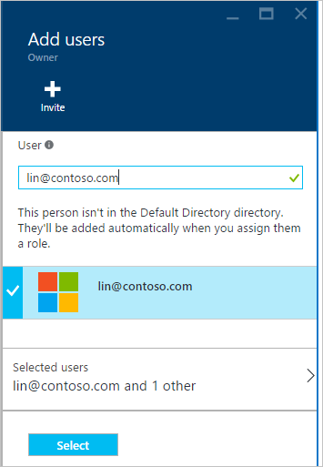

<properties
    pageTitle="Come aggiungere o modificare i ruoli di amministratore Azure | Microsoft Azure"
    description="Viene descritto come aggiungere o modificare CO-amministratore Azure, amministratore del servizio e amministratore dell'Account"
    services=""
    documentationCenter=""
    authors="genlin"
    manager="mbaldwin"
    editor=""
    tags="billing"/>

<tags
    ms.service="billing"
    ms.workload="na"
    ms.tgt_pltfrm="na"
    ms.devlang="na"
    ms.topic="article"
    ms.date="08/17/2016"
    ms.author="genli"/>

# Come aggiungere o modificare i ruoli di amministratore di Azure

Esistono tre tipi di ruoli di amministratore di Microsoft Azure:

| Ruolo amministrativo   | Limite  | Descrizione
| ------------- | ------------- |---------------|
|Account di amministratore (AA)  | 1 per ogni account Azure  |Questa è la persona che ha iscritti o acquistato abbonamenti Azure e sia autorizzata ad accedere al [Centro Account](https://account.windowsazure.com/Home/Index) ed eseguire varie attività di gestione. Ad esempio la possibilità di creare sottoscrizioni, annullare gli abbonamenti, modificare la fatturazione per un abbonamento e l'amministratore del servizio.
| Servizio dell'amministratore | 1 per abbonamento Azure  |Questo ruolo è autorizzato a gestire i servizi nel [portale di Azure](https://portal.azure.com). Per impostazione predefinita, per un nuovo abbonamento, l'amministratore dell'Account è l'amministratore del servizio.|
|CO-amministratore (CA) nel [portale classica Azure](https://manage.windowsazure.com)|200 per abbonamento| Questo ruolo dispone di privilegi di accesso come amministratore del servizio stesso, ma non è possibile modificare l'associazione degli abbonamenti alle directory Azure. |

> [AZURE.NOTE] Azure Active Directory basata accesso controllo (RBAC) consente agli utenti da aggiungere a più ruoli. Per ulteriori informazioni, vedere [Controllo dell'accesso basato sui ruoli di Azure Active Directory](./active-directory/role-based-access-control-configure.md).

> [AZURE.NOTE] Se necessaria ulteriore assistenza in qualsiasi momento in questo articolo, informazioni, [contattare il supporto tecnico](https://portal.azure.com/?#blade/Microsoft_Azure_Support/HelpAndSupportBlade) per ottenere il problema risolto rapidamente.

## Come aggiungere un amministratore per una sottoscrizione

**Portale di Azure**

1. Accedere al [portale di Azure](https://portal.azure.com).

2. Nel menu Hub selezionare **abbonamento** > *l'abbonamento a cui si vuole che l'amministratore per accedere a*.

    

3. Nella finestra e abbonamento, selezionare **Impostazioni**> **gli utenti**.

    
4. Nella finestra e utenti, selezionare **Aggiungi**>**Selezionare un ruolo** > **proprietario**.

    

    **Nota**
    - Il ruolo di proprietario ha stessi privilegi di accesso come amministratore condivisa. Questo ruolo non dispone di privilegi di accesso al [Centro Account Azure](https://account.windowsazure.com/subscriptions).
    - I proprietari che aggiunti tramite il [portale di Azure](https://portal.azure.com) non è possibile gestire i servizi di [Azure portale classica](https://manage.windowsazure.com).  

5. Digitare l'indirizzo di posta elettronica dell'utente che si desidera aggiungere come proprietario, fare clic sull'utente e quindi fare clic su **Seleziona**.

    

**Portale classica Azure**

1. Accedere al [portale classica Azure](https://manage.windowsazure.com/).

2. Nel riquadro di spostamento fare clic su **Impostazioni**> **amministratori**> **Aggiungi**.  

    

3. Digitare l'indirizzo di posta elettronica della persona da aggiungere come amministratore condivisa e quindi selezionare l'abbonamento a cui si desidera CO-amministratore per accedere. 

     

Indirizzo di posta elettronica seguenti può essere aggiunti come amministratore condivisa:

* **Account Microsoft** (in precedenza Windows Live ID)  
 È possibile utilizzare un Account Microsoft per accedere a tutti i prodotti Microsoft orientati al consumer e cloud services, ad esempio Outlook (Hotmail), Skype (MSN), OneDrive, Windows Phone e Xbox LIVE.
* **Account aziendale** 
 Un account dell'organizzazione è un account creato in Azure Active Directory. L'indirizzo dell'account organizzazione analogo al seguente: user@ &lt;il dominio&gt;. onmicrosoft.com

### Restrizioni e limitazioni

 * Ciascuna sottoscrizione è associata a una directory di Azure Active Directory (noto anche come la Directory predefinita). Per trovare la Directory predefinita è associato all'abbonamento, accedere al [portale classica Azure](https://manage.windowsazure.com/), selezionare **Impostazioni** > **abbonamenti**. Verificare l'ID di abbonamento per trovare la Directory predefinite.

 * Se è stato effettuato con un Account Microsoft, è possibile aggiungere solo altri Accounts di Microsoft o utenti all'interno della Directory predefinite come amministratore condivisa.

 * Se è stato effettuato con un account aziendale, è possibile aggiungere altri account dell'organizzazione all'interno dell'organizzazione come amministratore condivisa. Ad esempio abby@contoso.com possibile aggiungere bob@contoso.com come amministratore di servizio o condivisa, ma non è possibile aggiungere john@notcontoso.com a meno che non john@noncontoso.com l'utente nella Directory predefinita. Gli utenti connessi con account dell'organizzazione possono continuare ad aggiungere utenti Account Microsoft come amministratore di servizio o condivisa.

 * Ora che è possibile accedere a Azure con un account dell'organizzazione, ecco le modifiche ai requisiti di account di amministratore di servizio e condivisa:

    Metodo di accesso| Aggiungere l'Account Microsoft o agli utenti interni Directory predefinite come CA o amministratore di sistema?  |Aggiungere l'account dell'organizzazione nella stessa organizzazione come autorità di certificazione o amministratore di sistema? |Aggiungere l'account dell'organizzazione nell'organizzazione diversa come CA o SA?
    ------------- | ------------- |---------------|---------------
    Account Microsoft |Sì|No|No
    Account aziendale|Sì|Sì|No

## Come modificare l'amministratore del servizio per una sottoscrizione

Solo l'amministratore dell'Account è possibile cambiare l'amministratore del servizio per un abbonamento.

1. Accedere [all'Interfaccia di Account Azure](https://account.windowsazure.com/subscriptions) utilizzando l'amministratore dell'Account.

2. Selezionare l'abbonamento che si desidera modificare.

3. Sul lato destro fare clic su **Modifica abbonamento** dettagli.  

    

4. Nella casella **Amministratore del servizio** immettere l'indirizzo di posta elettronica di nuovo amministratore del servizio.  

    

## Come modificare l'amministratore dell'Account

Per trasferire la proprietà dell'account Azure a un altro account, vedere [Il trasferimento delle proprietà di un abbonamento a Azure](billing-subscription-transfer.md).

## Passaggi successivi

* Per altre informazioni sulla modalità di controllo di accesso alle risorse in Microsoft Azure, vedere [accesso alle risorse Understanding in Azure](./active-directory/active-directory-understanding-resource-access.md)

* Per ulteriori informazioni sulla correlazione all'abbonamento Azure Azure Active Directory, vedere [come Azure sottoscrizioni associate Azure Active Directory](./active-directory/active-directory-how-subscriptions-associated-directory.md)

* Per ulteriori informazioni sulla correlazione all'abbonamento Azure Azure Active Directory, vedere [assegnazione di ruoli di amministratore di Azure Active Directory](./active-directory/active-directory-assign-admin-roles.md)

> [AZURE.NOTE] Se si riscontrano ancora ulteriormente domande, informazioni, [contattare il supporto tecnico](https://portal.azure.com/?#blade/Microsoft_Azure_Support/HelpAndSupportBlade) per ottenere il problema risolto rapidamente.
