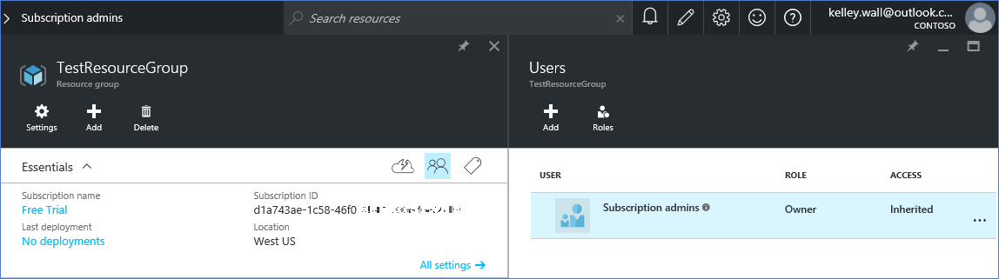

<properties
    pageTitle="Usare un tenant di Office 365 con un abbonamento a Azure | Microsoft Azure"
    description="Informazioni su come aggiungere una directory di Office 365 (tenant) a un abbonamento Azure per definire l'associazione."
    services=""
    documentationCenter=""
    authors="JiangChen79"
    manager="mbaldwin"
    editor=""
    tags="billing,top-support-issue"/>

<tags
    ms.service="billing"
    ms.workload="na"
    ms.tgt_pltfrm="ibiza"
    ms.devlang="na"
    ms.topic="article"
    ms.date="09/16/2016"
    ms.author="cjiang"/>

# Associare un tenant di Office 365 con un abbonamento a Azure
Se le sottoscrizioni di Azure e Office 365 è stato acquistato separatamente in passato e ora si desidera essere in grado di accedere al tenant di Office 365 dalla sottoscrizione Azure, è facile per farlo. In questo articolo illustra come.

> [AZURE.NOTE] In questo articolo non è applicabile ai clienti contratto Enterprise (EA).

## Guida rapida
Per associare il tenant di Office 365 con l'abbonamento Azure, usare l'account Azure per aggiungere il tenant di Office 365 e quindi associare la sottoscrizione Azure tenant di Office 365.

## Procedura dettagliata
In questo scenario Kelley Wall è un utente che dispone di una sottoscrizione con l'account Azure kelley.wall@outlook.com. Kelley è installato anche un abbonamento a Office 365 con l'account kelley.wall@contoso.onmicrosoft.com. Kelley desidera accedere tenant di Office 365 con l'abbonamento Azure.

### Prerequisiti
Per l'associazione per il corretto funzionamento, i prerequisiti seguenti sono necessari:

- È necessario le credenziali dell'amministratore del servizio di abbonamento Azure. Gli CO-amministratori di non è possibile eseguire un sottoinsieme dei passaggi.
- È necessario disporre delle credenziali di un amministratore globale del tenant di Office 365.
- L'indirizzo di posta elettronica dell'amministratore del servizio deve essere incluso nel tenant di Office 365.
- L'indirizzo di posta elettronica dell'amministratore del servizio non deve corrispondere che un amministratore globale del tenant di Office 365.
- Se al momento si usano un indirizzo di posta elettronica è un account Microsoft e un account dell'organizzazione, modificare temporaneamente l'amministratore del servizio di abbonamento Azure per usare un altro account Microsoft. È possibile creare un nuovo account di Microsoft nella [pagina account Microsoft](https://signup.live.com/).

Per modificare l'amministratore del servizio, procedere come segue:

1. Accedere al [portale di gestione degli Account](https://account.windowsazure.com/subscriptions).
2. Selezionare l'abbonamento che si desidera modificare.
3. Selezionare **Modifica dettagli abbonamento**.

    

4. Nella casella **Amministratore del servizio** immettere l'indirizzo di posta elettronica dell'amministratore del servizio nuovo.

    

### Associare il tenant di Office 365 con l'abbonamento Azure
Per associare il tenant di Office 365 con l'abbonamento Azure, procedere come segue:

1.  Accedere al [portale di gestione degli Account](https://account.windowsazure.com/subscriptions) con le credenziali di amministratore di servizio.
2.  Nel riquadro sinistro selezionare **ACTIVE DIRECTORY**.

    

    > [AZURE.NOTE] Non è visualizzato il tenant di Office 365. Se è presente, ignorare il passaggio successivo.

    

3. Aggiungere il tenant di Office 365 per l'abbonamento Azure.

    un. Selezionare **Nuovo** > **DIRECTORY** > **Crea personalizzato**.

    

    b. Nella pagina **Aggiungi directory** nella **DIRECTORY**, selezionare **utilizza directory esistente**. Quindi selezionare **Pronto essere disconnessi ora**e **completamento** .

    

    c. Dopo che si è disconnessi, accedere con le credenziali di amministratore globale del tenant di Office 365.

    

    d. Selezionare **Continua**.

    

    e. Selezionare **Esci**.

    

    f. Accedere al [portale di gestione degli Account](https://account.windowsazure.com/subscriptions) con le credenziali di amministratore di servizio.

    

    g. Verrà visualizzato il tenant di Office 365 nel dashboard.

    

4. Modificare la directory associata alla sottoscrizione Azure.

    un. Selezionare **Impostazioni**.

    

    b. Selezionare l'abbonamento Azure e quindi selezionare **Modifica DIRECTORY**.
    

    c. Selezionare **Avanti** .

    

    > [AZURE.WARNING] Si riceverà un messaggio di avviso che verranno rimossi tutti gli amministratori condivisa.

    

    >[AZURE.WARNING] Inoltre, tutti gli utenti di [controllo dell'accesso basato sui ruoli (RBAC)](./active-directory/role-based-access-control-configure.md) con access assegnate in gruppi di risorse esistenti vengono rimosse anche. Tuttavia, si riceve il messaggio di avviso menzioni solo la rimozione di coamministratori.

    

    d. Selezionare **completa** .

5. A questo punto è possibile aggiungere l'account aziendale di Office 365 come coamministratori nel tenant di Azure Active Directory.

    un. Selezionare la scheda **ADMINISTRATORS** e quindi selezionare **Aggiungi**.

    

    b. Immettere un account dell'organizzazione del tenant di Office 365, selezionare l'abbonamento Azure e quindi selezionare **completa** .

    

    c. Tornare alla scheda **amministratori** . Verrà visualizzato l'account dell'organizzazione visualizzato come amministratore condivisa.

    

6. Avanti è possibile verificare l'accesso con l'amministratore di creazione.

    un. Disconnettersi da portale di gestione degli Account.

    b. Aprire il [portale di gestione degli Account](https://account.windowsazure.com/subscriptions) o un [portale di Azure](https://portal.azure.com/).

    c. Se la pagina di accesso Azure include un collegamento di **accedere con l'account dell'organizzazione**, selezionare il collegamento. In caso contrario, ignorare questo passaggio.

    

    d. Immettere le credenziali di amministratore condivisa e quindi selezionare **Accedi**.

    

## Passaggi successivi
Scenari correlati includono:

- Già ha un abbonamento a Office 365 e si è pronti per un abbonamento a Azure, ma si desidera utilizzare gli account utente di Office 365 esistenti per l'abbonamento Azure.
- Si è abbonati Azure e si desidera ottenere un abbonamento a Office 365 per gli utenti nell'istanza di Azure Active Directory esistente.

Per informazioni su come eseguire queste operazioni, vedere [usare l'esistente di Office 365 account con l'abbonamento Azure o viceversa](billing-use-existing-office-365-account-azure-subscription.md).
