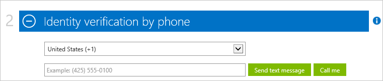
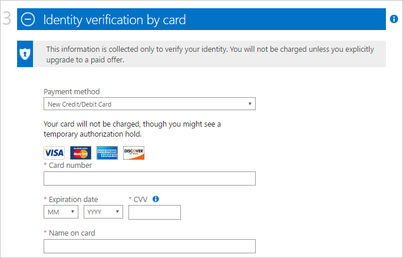
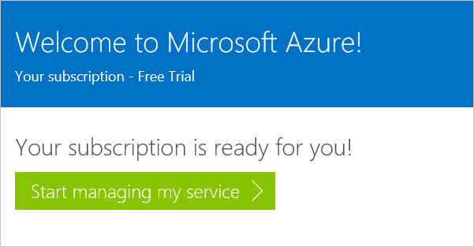
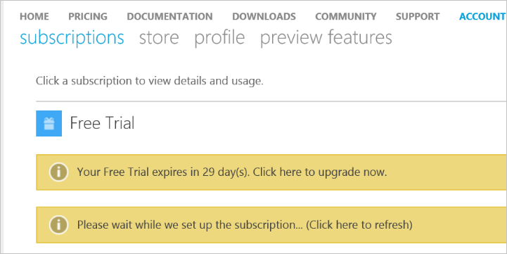

<properties
    pageTitle="Come iscriversi, acquistare, aggiornare o attivare un abbonamento a Azure | Microsoft Azure"
    description="Viene descritto come acquistare o effettuare l'iscrizione per un abbonamento a Azure"
    services=""
    documentationCenter=""
    authors="genlin"
    manager="mbaldwin"
    editor=""
    tags="billing,top-support-issue"
    />

<tags
    ms.service="billing"
    ms.workload="na"
    ms.tgt_pltfrm="na"
    ms.devlang="na"
    ms.topic="article"
    ms.date="09/23/2016"
    ms.author="genli"/>

# Come iscriversi, acquistare, aggiornare o attivare Azure

> [AZURE.NOTE] Se necessaria ulteriore assistenza in qualsiasi momento in questo articolo, informazioni, [contattare il supporto tecnico](https://portal.azure.com/?#blade/Microsoft_Azure_Support/HelpAndSupportBlade) per ottenere il problema risolto rapidamente.

Azure offre vari offerte per le esigenze aziendali e iniziare a utilizzare Azure. Visitare [Azure offre](https://azure.microsoft.com/support/legal/offer-details/) per un elenco completo di tutte le offerte attive con informazioni dettagliate su ogni offerta sui quali sono copertina, vantaggi e la disponibilità per i paesi/area geografica.

## Azure offre - vantaggi e limiti

Nella tabella seguente vengono fornite informazioni dettagliate su offerte comuni:

| Offerta                                                                              | Dettagli |
|--------------------------------------------------------------------------------------|---------|
| Versione di valutazione gratuita                                                                           |• [Guida passo dopo passo e l'abbonamento](billing-buy-sign-up-azure-subscription.md#SignupFreeTrial) • [Vantaggi](https://azure.microsoft.com/pricing/free-trial/) • [Domande frequenti](https://azure.microsoft.com/pricing/free-trial-faq/) • [Aggiornamento versione di valutazione gratuita per uso prepagato](billing-buy-sign-up-azure-subscription.md#UpgradeFreeToPYG)     |
| Uso prepagato                                                                        | • [Per l'abbonamento](https://azure.microsoft.com/pricing/purchase-options/) • [Prezzi](https://azure.microsoft.com/pricing/)   |
| I membri MPN (Microsoft Partner Network) - ricevono mensili crediti Azure senza costi aggiuntivi | • [Azure vantaggi per i partner](https://azure.microsoft.com/offers/ms-azr-0025p/) • [Registra come un partner](http://go.microsoft.com/fwlink/?linkid=309258&clcid=0x409) o [Esegui la sottoscrizione a Microsoft Action pack](http://go.microsoft.com/fwlink/?linkid=525768&clcid=0x409) • Usare crediti Azure - accedere al [portale MPN](https://partner.microsoft.com) e verificare lo stato di idoneità e seguire i passaggi in chiavi Software e vantaggi. Se non è possibile verificare l'idoneità, contattare il [supporto MPN](https://partner.microsoft.com/Support/).   |
| Sottoscrittori MSDN e Visual Studio                                                      |• [Vantaggi offerti dai Dev/Test MSDN](https://azure.microsoft.com/offers/ms-azr-0023p/) • [Vantaggi sottoscrittore visual Studio](https://azure.microsoft.com/pricing/member-offers/msdn-benefits-details/) • [Sottoscrittore attivare Visual Studio Azure carta di credito](https://azure.microsoft.com/pricing/member-offers/msdn-benefits-details/) • [Vantaggi di attivazione di Azure MSDN in tre semplici passaggi](https://www.youtube.com/watch?v=SN2CA71uOEI&feature=youtu.be):  Accedere alla [pagina account personale MSDN](https://msdn.microsoft.com/subscriptions/manage/default.aspx) e verificare l'idoneità, fare clic su 'Vantaggi di attivazione di Azure'. Se non è possibile verificare l'idoneità, contattare l' [Assistenza clienti abbonamenti MSDN](https://msdn.microsoft.com/subscriptions/contactus.aspx).|
| BizSpark                                                                             | • [Vantaggi BizSpark](https://www.microsoft.com/bizspark/default.aspx#start-two). Per ulteriori informazioni, vedere [credito Azure mensile per Visual Studio Enterprise](https://azure.microsoft.com/offers/ms-azr-0064p/) • [Partecipare BizSpark](https://www.microsoft.com/bizspark/signup/default.aspx). Se si verificano problemi, contattare il [BizSpark Team](mailto:bizspark@microsoft.com?subject=BizSpark%20Support&body=Thank%20you%20for%20contacting%20BizSpark.%20Please%20provide%20as%20much%20of%20the%20following%20information%20as%20possible,%20as%20it%20will%20help%20expedite%20our%20response%20to%20you.%0aContact%20name:%0aStartup%20name:%0aMicrosoft%20Account/Live%20ID:%0aSpecific%20description%20of%20issue%20experienced%20or%20question:%0a%0aThank%20you,%0a%0aThe%20BizSpark%20Team).      |
| Segno di BizSpark                                                                        |• [Informazioni BizSpark Plus](https://www.microsoft.com/bizspark/plus/default.aspx). Per ulteriori informazioni, vedere [Vantaggi più BizSpark](https://azure.microsoft.com/offers/ms-azr-0149p/) • [BizSpark partecipare](https://www.microsoft.com/bizspark/signup/default.aspx) e quindi utilizzare il partner contattare eseguire l'aggiornamento a più BizSpark. Se si verificano problemi, contattare il [BizSpark Team](mailto:bizspark@microsoft.com?subject=BizSpark%20Support&body=Thank%20you%20for%20contacting%20BizSpark.%20Please%20provide%20as%20much%20of%20the%20following%20information%20as%20possible,%20as%20it%20will%20help%20expedite%20our%20response%20to%20you.%0aContact%20name:%0aStartup%20name:%0aMicrosoft%20Account/Live%20ID:%0aSpecific%20description%20of%20issue%20experienced%20or%20question:%0a%0aThank%20you,%0a%0aThe%20BizSpark%20Team).     |
| Rivenditori (programmi Open Volume License)                                             |• [Servizio attivare Online chiave - Guida dettagliata](billing-buy-sign-up-azure-subscription.md#activateKey) • [Acquisto, vantaggi, attivare](https://azure.microsoft.com/offers/ms-azr-0111p/)        |
| EA (Enterprise Agreement)                                                            |• [Licenze Azure per le aziende](https://azure.microsoft.com/pricing/enterprise-agreement/) • Per attivare, contattare il responsabile Microsoft o il rivenditore per iniziare a oggi     |

## Iscriversi a una sottoscrizione di valutazione gratuita di Azure

Per iscriversi per una sottoscrizione di valutazione gratuita di Azure, è necessario specificare un numero di telefono, una carta di credito e un Account Microsoft. L'account Microsoft è l'indirizzo di posta elettronica che si usa, e la password, effettuare l'accesso a tutti i programmi di Windows Live o servizio, ad esempio Outlook, Hotmail o OneDrive. Può configurare un account di Microsoft tramite un indirizzo di posta elettronica che appartengono all'utente, tra cui la posta elettronica della società. Per ulteriori informazioni, vedere [domande frequenti sugli account di Microsoft](https://www.microsoft.com/account/faq.aspx) .

Se si riscontrano problemi, vedere [Risoluzione dei problemi di abbonamento a un servizio di Azure](billing-troubleshoot-azure-sign-up-issues.md) .

>[AZURE.NOTE] I dettagli sulla carta di credito e numero di telefono vengono utilizzati esclusivamente per verificare l'identità. Anche se non è possibile addebitata carta di credito, Microsoft inserirà un'esenzione autorizzazione su di esso per una quantità minima verificare che la carta di credito è valida. Il blocco verrà rilasciato all'interno di 3-5 giorni lavorativi, a seconda dei criteri dell'istituto.

1. Aprire la [pagina di valutazione gratuita Azure](https://azure.microsoft.com/pricing/free-trial/)e quindi selezionare **Inizia ora**.

2. Accedere con l'account Microsoft o account aziendale.

3. Nella sezione **sull'utente** , immettere le informazioni personali. [Ulteriori](billing-troubleshoot-azure-sign-up-issues.md#i-am-getting-an-error-when-entering-my-information-to-sign-up) informazioni sull'immissione di informazioni personali in modo accurato.

    

    >[AZURE.NOTE] Le informazioni indirizzo e paese di posta elettronica fornito quando si effettua l'iscrizione per un abbonamento a Azure vengono mantenuto associate alla sottoscrizione e non possono essere modificate in un secondo momento.

4. Nella sezione **verifica tramite telefono** , è necessario specificare un numero di telefono per ricevere un codice di verifica che è possibile fornire per completare il processo di verifica.

    È possibile scegliere di ricevere il codice di verifica come messaggio di testo o tramite una chiamata vocale. Effettuare la selezione, fare clic su **Invia messaggio di testo** o **chiama**. Selezionare il codice di composizione internazionali per il proprio paese nella prima casella e immettere il numero di telefono nella seconda casella. Dopo aver ricevuto il codice di verifica, immetterlo nella terza casella e quindi selezionare il pulsante **codice di verifica** . [Vedere l'articolo per informazioni dettagliate](billing-troubleshoot-azure-sign-up-issues.md#i-am-not-getting-text-messages-or-calls-during-account-verification-when-i-try-to-sign-up).

    >[AZURE.NOTE] È possibile utilizzare un numero di telefono VOIP per il processo di verifica telefono.

    

    Se non si riceve un messaggio di testo o una chiamata, provare a usare un diverso numero di telefono o contattare il [Supporto di Azure](https://portal.azure.com/#blade/Microsoft_Azure_Support/HelpAndSupportBlade) per assistenza.

5. Nella sezione **verifica tramite carta di** immettere i dettagli di una carta di credito valido. Queste informazioni vengono raccolte solo per verificare l'identità.

    Se si riceve un messaggio di errore dopo aver inviato le informazioni sulla carta di credito, vedere l'articolo [della carta di credito non funziona quando si tenta di effettuare l'iscrizione per Azure](billing-credit-card-fails-during-azure-sign-up.md).

    

6. Nella sezione **contratto** , selezionare la casella per accettare il contratto di sottoscrizione, i dettagli della proposta e informativa sulla privacy. Selezionare quindi **effettua l'iscrizione**. Modulo contratto può variare in base al paese.

    

    È possibile richiedere alcuni minuti per configurare l'abbonamento. Se la configurazione di abbonamento non viene completata in 15 minuti, contattare il [Supporto di Azure](https://portal.azure.com/#blade/Microsoft_Azure_Support/HelpAndSupportBlade) per assistenza.

    > [AZURE.NOTE] Se viene visualizzato un messaggio di errore, seguire i passaggi nel messaggio per risolvere il problema. Un messaggio di errore tipico è:

    > **C'è Impossibile completare l'operazione. Provare un secondo momento o ricaricare la pagina web**

    > In questo caso, provare a usare un altro browser per completare il processo di iscrizione. Se il problema persiste, contattare [Il supporto di Azure](https://portal.azure.com/#blade/Microsoft_Azure_Support/HelpAndSupportBlade) per assistenza.

7. Quando l'abbonamento è pronta, selezionare per avviare **iniziare a gestire il servizio** .

    

### Risorse aggiuntive

- [Impossibile attivare una versione di valutazione gratuita di Azure](billing-troubleshoot-azure-sign-up-issues.md#i-cant-activate-an-azure-free-trial)
- [Versione di valutazione gratuita azure domande frequenti](https://azure.microsoft.com/pricing/free-trial-faq/).

## Eseguire l'aggiornamento di versione di valutazione gratuita Azure a uso prepagato

1. Accedere al [Portale di Account Azure](https://account.windowsazure.com/subscriptions) utilizzando l'account Microsoft o l'account aziendale utilizzato per iscriversi per la versione di valutazione gratuita.

2. Selezionare l'abbonamento e quindi selezionare **l'aggiornamento**

    

3. Selezionare **Sì**e quindi selezionare **Aggiorna**.

    

Durante l'aggiornamento da una sottoscrizione di valutazione gratuita per una sottoscrizione di uso prepagato, i vantaggi rimasti dopo il periodo di valutazione gratuita, ad esempio il limite di 30 giorni o la carta di credito $200 utilizzare servizi di Azure continuerà fino a uno di essi esaurito. L'aggiornamento di abbonamento verrà visualizzato in un secondo momento.

## Attivazione tramite una chiave di attivazione del servizio Online

Se è stato acquistato crediti **Azure in aperto** da un rivenditore e se si ha un tasto di attivazione (5 x 5 chiave), seguire questa procedura per attivare l'abbonamento:

1. Passare alla [pagina di riepilogo di sottoscrizione](https://account.windowsazure.com/subscriptions).

2. Selezionare **Azure in aperto**. Nella pagina di [Azure nella chiave contratto Open License](https://azure.microsoft.com/offers/ms-azr-0111p/) , selezionare **attiva una nuova sottoscrizione o l'abbonamento esistente**.

3. Immettere il codice product key e quindi selezionare l'opzione contratto.

> [AZURE.NOTE] Se si riscontrano ancora ulteriormente domande, informazioni, [contattare il supporto tecnico](https://portal.azure.com/?#blade/Microsoft_Azure_Support/HelpAndSupportBlade) per ottenere il problema risolto rapidamente.
