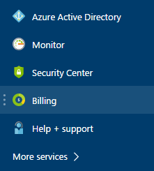

<properties
    pageTitle="Come scaricare la fattura e giornaliera dati sull'utilizzo di fatturazione di Azure | Microsoft Azure"
    description="Viene descritto come scaricare il Azure fatturazione e i dati di utilizzo giornaliero"
    services=""
    documentationCenter=""
    authors="genlin"
    manager="mbaldwin"
    editor=""
    tags="billing"
    />

<tags
    ms.service="billing"
    ms.workload="na"
    ms.tgt_pltfrm="na"
    ms.devlang="na"
    ms.topic="article"
    ms.date="10/10/2016"
    ms.author="genli"/>

# Come scaricare il Azure fattura e giornaliera dati sull'utilizzo di fatturazione

> [AZURE.NOTE] Se necessaria ulteriore assistenza in qualsiasi momento in questo articolo, informazioni, [contattare il supporto tecnico](https://portal.azure.com/?#blade/Microsoft_Azure_Support/HelpAndSupportBlade) per ottenere il problema risolto rapidamente.

Come l'amministratore dell'account Azure, è possibile visualizzare la fattura fatturazione e i dati di utilizzo giornaliero in [Azure portale](https://portal.azure.com) o al [Centro Account Azure](https://account.windowsazure.com/subscriptions). Ecco come:

## Portale di Azure

1. Accedere al [portale di Azure](https://portal.azure.com) come l'amministratore dell'account.

    >[AZURE.NOTE] Solo l'amministratore dell'account è autorizzato ad accedere ai dati di fatturazione. Per ulteriori informazioni su come scoprire chi è l'amministratore dell'account della sottoscrizione, vedere [domande frequenti](billing-subscription-transfer.md#faq).

2. Nel menu Hub selezionare **fatturazione**. In e il **fatturazione** , sono disponibili informazioni utili, ad esempio la data di fatturazione successiva.

    
3. Nella sezione **i costi di abbonamento** selezionare l'abbonamento a cui si desidera visualizzare.

    
4. Fare clic su **fatturazione e l'uso**.

    

5. Scegliere **Download fattura** per visualizzare una copia della fattura e il **cronologia di fatturazione** . Fare clic su un periodo di fatturazione per visualizzare i dati di utilizzo giornaliero.

    

## Centro Account Azure

1. Accedere a [Centro Account Azure](https://account.windowsazure.com/subscriptions) come l'amministratore dell'account.
2. Selezionare l'abbonamento per il quale si desiderano le informazioni di fatturazione e l'uso.
3. Selezionare **la cronologia di fatturazione**.  
4. È possibile vedere le istruzioni per l'ultimo sei periodi di fatturazione e il periodo di fatturati corrente.   
5. Selezionare **Visualizza istruzione corrente** per vedere una stima del costo al momento in cui che è stato generato il valore stimato. Queste informazioni solo viene aggiornate ogni giorno e non possono includere tutti l'utilizzo. Il conto mensile possono essere diversi da questa stima.   
6. Selezionare **Scarica fattura** per visualizzare una copia dell'ultima fattura.  
7. Selezionare **L'uso di Download** per scaricare i dati di utilizzo giornaliero in un file CSV. 

> [AZURE.NOTE] Se si riscontrano ancora ulteriormente domande, informazioni, [contattare il supporto tecnico](https://portal.azure.com/?#blade/Microsoft_Azure_Support/HelpAndSupportBlade) per ottenere il problema risolto rapidamente.
