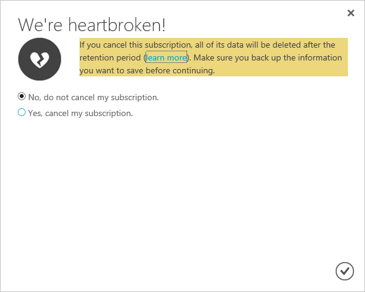

<properties
    pageTitle="Annullare l'abbonamento Azure | Microsoft Azure"
    description="Viene descritto come annullare l'abbonamento Azure, ad esempio la sottoscrizione di valutazione gratuita"
    services=""
    documentationCenter=""
    authors="genlin"
    manager="mbaldwin"
    editor=""
    tags="billing"
    />

<tags
    ms.service="billing"
    ms.workload="na"
    ms.tgt_pltfrm="na"
    ms.devlang="na"
    ms.topic="article"
    ms.date="09/26/2016"
    ms.author="genli"/>

# Annullare l'abbonamento Azure

Annullare l'abbonamento Azure dal [Centro Account Azure](https://account.windowsazure.com/subscriptions). Dopo l'annullamento dell'abbonamento, terminerà l'accesso ai servizi Azure e risorse.

Prima di annullare l'abbonamento:

- Eseguire il backup dei dati. Ad esempio, se i dati archiviati in archiviazione Azure o SQL, scaricare una copia. Se si dispone di una macchina virtuale, salvare un'immagine che ne in locale.

- Arrestare il provider di servizi. Passare alla [pagina risorse nel portale di gestione](https://ms.portal.azure.com/?flight=1#blade/HubsExtension/Resources/resourceType/Microsoft.Resources%2Fresources)e **interrompere** le macchine virtuali in esecuzione, le applicazioni o altri servizi.

Se si annulla un [piano di supporto di Azure](https://azure.microsoft.com/support/plans/)a pagamento, verrà comunque fatturato mensile per il resto del termine 6 mesi.

## Annulla abbonamento

1. Accedere a [Centro Account Azure](https://account.windowsazure.com/subscriptions) come Account di amministratore.

2. In **fare clic su un abbonamento per visualizzare i dettagli e l'uso**, selezionare l'abbonamento a cui si desidera annullare. 

    

3. Sul lato destro della pagina, selezionare **Annulla abbonamento**.
    
    

4. Selezionare **Sì, annullare l'abbonamento**.
    
    

5. Fare clic su  per chiudere la finestra di dialogo e tornare alla pagina di sottoscrizione.

Dopo che si annulla l'abbonamento, attesa 90 giorni prima di eliminare definitivamente i dati nel caso in cui è necessario accedere o cambia idea. Per ulteriori informazioni, vedere [Microsoft Trust Center - come si gestiscono i dati](https://go.microsoft.com/fwLink/p/?LinkID=822930&clcid=0x409).

## Riattivare l'abbonamento

Se l'abbonamento in è stato annullato accidentalmente, è possibile [riattivarlo nell'interfaccia di account](billing-subscription-become-disable.md#how-to-re-enable-non-pay-as-you-go-subscriptions).

## Servono altre informazioni? Contattare il supporto tecnico.

Se si riscontrano ancora ulteriormente domande, informazioni, [contattare il supporto tecnico](https://portal.azure.com/?#blade/Microsoft_Azure_Support/HelpAndSupportBlade) per ottenere il problema risolto rapidamente.
