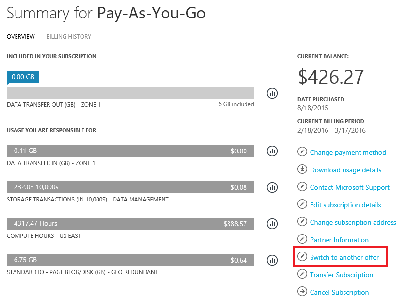

<properties
    pageTitle="Cambiare abbonamento Azure a un'altra proposta | Microsoft Azure"
    description="Informazioni su come modificare l'abbonamento Azure e passare a un'offerta diversa tramite il portale di gestione di abbonamento"
    services=""
    documentationCenter=""
    authors="genlin"
    manager="mbaldwin"
    editor=""
    tags="billing,top-support-issue"/>

<tags
    ms.service="billing"
    ms.workload="na"
    ms.tgt_pltfrm="na"
    ms.devlang="na"
    ms.topic="article"
    ms.date="09/30/2016"
    ms.author="genli"/>

# Cambiare abbonamento Azure a un'altra proposta

Come cliente [Uso prepagato](https://azure.microsoft.com/offers/ms-azr-0003p/) , potrebbe essere possibile cambiare l'abbonamento Azure a un'altra proposta nel [Centro Account](https://account.windowsazure.com/Subscriptions). Ad esempio, è possibile utilizzare questa caratteristica in modo da sfruttare [crediti mensili per gli abbonati a Visual Studio](https://azure.microsoft.com/pricing/member-offers/msdn-benefits-details/). Nella [Versione di valutazione gratuita](https://azure.microsoft.com/free/), sono disponibili informazioni su come eseguire [l'aggiornamento a uso prepagato](billing-upgrade-azure-subscription.md).

#### Operazioni supportate:

| Da                                                              | A                                                                                      |
|-------------------------------------------------------------------|-----------------------------------------------------------------------------------------|
| [Uso prepagato](https://azure.microsoft.com/offers/ms-azr-0003p/) | [Uso prepagato. Dev/Test](https://azure.microsoft.com/offers/ms-azr-0023p/)              |
| [Uso prepagato](https://azure.microsoft.com/offers/ms-azr-0003p/) | [Visual Studio Professional](https://azure.microsoft.com/offers/ms-azr-0059p/)          |
| [Uso prepagato](https://azure.microsoft.com/offers/ms-azr-0003p/) | [Visual Studio Test Professional](https://azure.microsoft.com/offers/ms-azr-0060p/)     |
| [Uso prepagato](https://azure.microsoft.com/offers/ms-azr-0003p/) | [Piattaforme MSDN](https://azure.microsoft.com/offers/ms-azr-0062p/)                      |
| [Uso prepagato](https://azure.microsoft.com/offers/ms-azr-0003p/) | [Visual Studio Enterprise](https://azure.microsoft.com/offers/ms-azr-0063p/)            |
| [Uso prepagato](https://azure.microsoft.com/offers/ms-azr-0003p/) | [Visual Studio Enterprise (Bizspark)](https://azure.microsoft.com/offers/ms-azr-0064p/) |

> [AZURE.NOTE] Per altri offrono modifiche, [contattare il supporto tecnico](https://portal.azure.com/?#blade/Microsoft_Azure_Support/HelpAndSupportBlade).
    
## Offerta di sottoscrizione di parametro

> [AZURE.VIDEO switch-to-a-different-azure-offer]

1.  Accedere [all'Interfaccia di Account Azure](https://account.windowsazure.com/Subscriptions).

2.  Selezionare l'abbonamento in.

3.  Fare clic su **passa a un'altra proposta**. Il pulsante è disponibile solo se si è in uso prepagato e fine con il primo periodo di fatturazione.

    
    
4.  **Selezionare l'offerta desiderata** nell'elenco di offerte di a che abbonamento può essere cambiato. In questo elenco varia in base le appartenenze associato all'account. Se non è disponibile, verificare l' [elenco delle offerte disponibili, che è possibile passare](#whats-supported) e verificare di soddisfare le appartenenze destra. 

    

5.  A seconda dell'offerta, che si passa, sarà possibile visualizzare una nota sugli effetti del passaggio. Verranno illustrate in questo elenco con attenzione e seguire le istruzioni prima di procedere.

    

6.  È possibile rinominare l'abbonamento. Per impostazione predefinita, è impostarlo al nuovo nome di offerta. Fare clic su **Cambia offrono** per completare il processo.

    

7.  Success! L'abbonamento a questo punto viene attivata l'offerta di nuovo.

## Perché non è possibile cambiare offerte?

**Passa a un'altra proposta** potrebbe non essere visibile se:

- Non si è in [Uso prepagato](https://azure.microsoft.com/offers/ms-azr-0003p/). Attualmente solo le sottoscrizioni di uso prepagato possono essere cambiate a un'altra proposta.

    - Nella [Versione di valutazione gratuita](https://azure.microsoft.com/free/), sono disponibili informazioni su come eseguire [l'aggiornamento a uso prepagato](billing-upgrade-azure-subscription.md).

    - Per passare all'offerta da una sottoscrizione diversa, [contattare il supporto tecnico](https://portal.azure.com/?#blade/Microsoft_Azure_Support/HelpAndSupportBlade).

- Si è ancora presente sul primo periodo di fatturazione; è necessario attendere che il primo periodo di fatturazione terminare prima di passare offerte.

È possibile che **non sono disponibili nel proprio paese o paese al momento proposte** se:

- Non si è idonei per ogni opzione offerta. Controllare l' [elenco delle offerte disponibili, che è possibile passare](#whats-supported).

## Che cosa significa trasferire eseguire offerte Azure al servizio e fatturazione?

Ecco i dettagli di quello che succede quando si passa Azure piani nell'interfaccia di Account.

### Accesso ai servizi

Non esiste alcun i tempi di inattività per qualsiasi utente associato all'abbonamento. Tuttavia, l'offerta a che si passa potrebbe essere restrizioni. Ad esempio, alcune offerte Impedisci l'utilizzo di produzione, pertanto è necessario spostare le risorse di produzione a un'altra sottoscrizione.

### Fatturazione

Il giorno che cambio, viene generata una fattura per tutte le spese in sospeso. Quindi, l'abbonamento viene effettuata secondo termini prezzi dell'offerta di nuovo. L'anniversario di fatturazione di abbonamento viene modificato in base alla data in cui è stato modificato offerte. L'utilizzo e la fatturazione dati prima che la modifica di offerta non viene mantenuta, è consigliabile scaricare una copia prima di passare.

> [AZURE.NOTE] A causa di vincoli relativi alla fatturazione offerta opzioni non sono possibili all'interno del ciclo di fatturazione prima dopo la creazione di un abbonamento.

## È possibile migrare dall'uso prepagato [Cloud soluzione Provider](https://partner.microsoft.com/Solutions/cloud-reseller-overview) (CSP) o [Enterprise Agreement](https://azure.microsoft.com/pricing/enterprise-agreement/) (EA)?

Attualmente non è possibile passare offerta alla CSP o EA nell'interfaccia di account. Per spostare l'abbonamento esistente in EA, che l'amministratore di registrazione aggiungere l'account in EA. Quindi, si riceve un messaggio di invito. Quando si seguono le istruzioni per accettare l'invito, le sottoscrizioni vengono spostate automaticamente in Enterprise Agreement. Per eseguire la migrazione a CSP, vedere informazioni sulla [Migrazione di sottoscrizione di Azure a CSP](https://blogs.technet.microsoft.com/hybridcloudbp/2016/08/26/azure-subscription-migration-to-csp/).

## Passaggi successivi

- Informazioni su come [gestire i ruoli di amministratore](billing-add-change-azure-subscription-administrator.md) per l'abbonamento

- Tenere traccia di uso scaricando [fattura e dati di utilizzo](billing-download-azure-invoice-daily-usage-date.md)

## Servono altre informazioni? Contattare il supporto tecnico.

Se si riscontrano ancora ulteriormente domande, informazioni, [contattare il supporto tecnico](https://portal.azure.com/?#blade/Microsoft_Azure_Support/HelpAndSupportBlade) per ottenere il problema risolto rapidamente.
