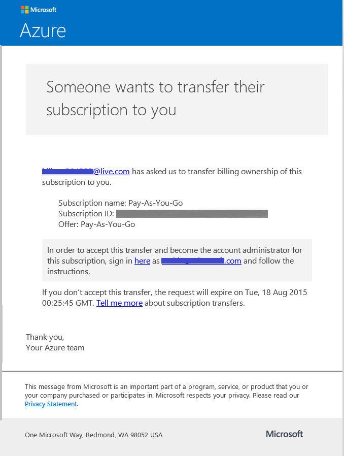
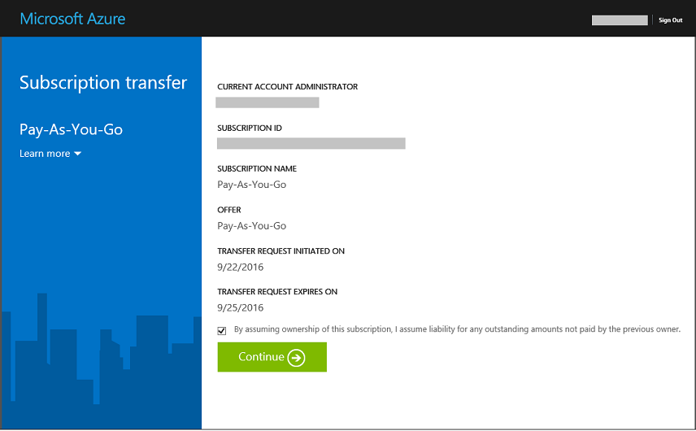

<properties
   pageTitle="Trasferisce la proprietà di un abbonamento Azure | Microsoft Azure"
   description="Come trasferire un abbonamento a Azure a un altro utente e alcune domande frequenti domande frequenti sul processo"
   services=""
   documentationCenter=""
   authors="genlin"
   manager="stevenpo"
   editor=""
   tags="billing,top-support-issue"/>

<tags
   ms.service="billing"
   ms.workload="na"
   ms.tgt_pltfrm="na"
   ms.devlang="na"
   ms.topic="article"
   ms.date="10/10/2016"
   ms.author="genli"/>

# Trasferire la proprietà di un abbonamento Azure

Davvero:

- È necessario mano sopra la proprietà del proprio abbonamento Azure ad altre persone coinvolte di fatturazione?
- Per modificare l'account utilizzato per iscriversi a Azure per? Ad esempio è stato utilizzato il proprio Account Microsoft ma lo scopo di utilizzare il lavoro o dell'istituto di istruzione invece account?
- Se si vuole spostare l'abbonamento Azure da una directory a un altro?
- Disporre di Azure e Office 365 nel tenant di diversi e si desidera consolidare?

È ora possibile eseguire questa operazione con facilità in di Microsoft Azure Account Center - per uso prepagato, MSDN, Action Pack o BizSpark abbonamenti.  È stata aggiunta la possibilità di trasferire la sottoscrizione a un altro utente. In altre parole, è ora possibile modificare l'account amministratore qualsiasi uso prepagato, MSDN, Action Pack o BizSpark nell'abbonamento a cui si è proprietari, indipendentemente da quale paese si opera. È ora supportato il trasferimento di Azure Marketplace acquisti per anche questi tipi di sottoscrizione.

> [AZURE.NOTE] Per modificare l'abbonamento a un'offerta diversa, vedere [modificare l'abbonamento Azure a un'altra proposta](billing-how-to-switch-azure-offer.md) per altre informazioni. Se necessaria ulteriore assistenza in qualsiasi momento in questo articolo, informazioni, [contattare il supporto tecnico](https://portal.azure.com/?#blade/Microsoft_Azure_Support/HelpAndSupportBlade) per ottenere il problema risolto rapidamente.

## Come trasferire la proprietà di un abbonamento Azure

> [AZURE.VIDEO transfer-an-azure-subscription]

1.  Accedere <all'https://account.windowsazure.com/Subscriptions>. È necessario essere l'amministratore dell'account per eseguire un trasferimento di proprietà. Per ulteriori informazioni su come scoprire chi è l'amministratore dell'account della sottoscrizione, vedere [domande frequenti](#faq).

2.  Selezionare l'abbonamento per il trasferimento.

3.  Fare clic sull'opzione **Trasferisci abbonamento** .

    

4.  Seguire le istruzioni visualizzate per specificare il destinatario.

    

5.  I destinatari ricevono automaticamente un messaggio di posta elettronica con un collegamento di accettazione.

    

6.  Il destinatario fa clic sul collegamento e segue le istruzioni incluse immettere le informazioni di pagamento.

    

    

7. Success! L'abbonamento verrà trasferito.

## Domande frequenti domande frequenti

-   **Come è possibile sapere chi è l'amministratore dell'account dell'abbonamento?**

    È possibile verificare chi è l'amministratore dell'account dell'abbonamento come indicato di seguito:

    1. Accedere al [portale di Azure](https://portal.azure.com).
    2. Nel menu Hub selezionare **abbonamento**.
    3. Selezionare l'abbonamento a cui che si desidera controllare e quindi selezionare **Impostazioni**.
    4. Scegliere **proprietà**. L'amministratore dell'account dell'abbonamento verrà visualizzato nella casella **Account di amministratore** .  

-   **Trasferimento di un abbonamento con un certo qualsiasi i tempi di inattività?**

    Non esiste alcun effetto al servizio. In modo efficace Annulla la sottoscrizione con l'Account corrente amministratore e crea uno nuovo account del destinatario, ma associa i servizi di Azure sottostanti con la nuova sottoscrizione. ID abbonamento rimarrà invariato.

-   **Utilizzo di questo meccanismo per modificare la directory per abbonamento**-   
    Una sottoscrizione Azure viene creata nella directory l'amministratore di Account a cui appartiene. Pertanto, per modificare la directory, è sufficiente trasferire la sottoscrizione a un account utente nella directory di destinazione. Quando l'utente ha completato la procedura per accettare il trasferimento, l'abbonamento verrà automaticamente visualizzata nella directory di destinazione.

-   **Se subentrare fatturazione la proprietà di una sottoscrizione di un'altra organizzazione, si continueranno ad avere accesso alle risorse personali?**

    Se l'abbonamento viene trasferita a un altro tenant, gli utenti associati al tenant precedente saranno più possibile accedere all'abbonamento. Anche se un utente non è un amministratore del servizio o Co-amministratore più, potrebbe comunque hanno accesso all'abbonamento tramite altri meccanismi di protezione. Sono inclusi:
    - Certificati di gestione da concedono all'utente diritti di amministratore per le risorse di sottoscrizione. Per ulteriori informazioni, vedere [creare e caricare un certificato di gestione di Azure](https://msdn.microsoft.com/library/azure/gg551722.aspx)
    -   Tasti di scelta per i servizi, ad esempio lo spazio di archiviazione. Per ulteriori informazioni, vedere [visualizzare, copia e lo spazio di archiviazione rigenera i tasti di scelta](storage-create-storage-account.md#view-copy-and-regenerate-storage-access-keys)
    -   Credenziali di accesso remote per servizi come macchine virtuali di Azure

    Non si tratta di un elenco completo. Il destinatario deve valutare la possibilità di aggiornare le informazioni riservate associati al servizio se è necessario limitare l'accesso per le risorse. La maggior parte delle risorse possono essere aggiornate come indicato di seguito:

    1.   Passare al portale di Azure: [ *https://portal.azure.com*](https://portal.azure.com)

    2.    Fare clic su Esplora tutto -&gt; tutte le risorse

    3.    Selezionare la risorsa. Verrà aperta e delle risorse.

    4.    In e delle risorse, fare clic su **Impostazioni**. È possibile visualizzare e aggiornare le informazioni riservate esistente.

-   **Se trasferisce la sottoscrizione al centro del ciclo di fatturazione, pagare destinatario per la fatturazione intera ciclo?**

    Il mittente è tenuto a pagamento per l'utilizzo segnalato fino al punto che il trasferimento è stato completato. Il destinatario è responsabile per l'utilizzo di segnalati dall'ora del trasferimento in poi. È possibile che alcuni utilizzo avvenute prima del trasferimento, ma è stato segnalato in un secondo momento. Questa caratteristica sarà inclusa nella fattura del destinatario.

-   **Il destinatario ha accesso per l'utilizzo e la cronologia di fatturazione?**

    Al momento le informazioni sola ottenute al destinatario sono la quantità di ultima fattura (o il saldo corrente, se l'abbonamento è stato trasferito prima che il primo effetto è stato generato). Il resto dell'utilizzo e la cronologia di fatturazione non vengono trasferiti con l'abbonamento.

-   **L'offerta può essere modificata durante il trasferimento?**

    L'offerta deve rimanere invariata. Per modificare l'offerta, è necessario [contattare il supporto tecnico](http://go.microsoft.com/fwlink/?LinkID=619338).

-   **È possibile trasferire una sottoscrizione a un account utente in un altro paese?**

    No, al momento che non è supportato. Account utente del destinatario deve essere dello stesso paese.

-   **Il destinatario può utilizzare un meccanismo di pagamento diverso?**

    Sì. Esistono limitazioni qui: dopo la sottoscrizione la cronologia di fatturazione viene suddiviso in due account. Ma il vantaggio che è possibile eseguire questa operazione senza che sia necessario [contattare il supporto tecnico](http://go.microsoft.com/fwlink/?LinkID=619338).

-   **Il metodo di pagamento verrà interessato dopo il trasferimento di una sottoscrizione Azure?**

    Per accettare il trasferimento di un abbonamento, è necessario specificare una carta di credito o simili metodo di pagamento per il pagamento della sottoscrizione. Ad esempio, se Davide vengono trasferiti una sottoscrizione a Olga e Olga accetta il trasferimento, Olga anche necessario fornire un metodo di pagamento verrà usato per il pagamento della sottoscrizione. Dopo avere inserito il trasferimento, non è più Roberto verrà addebitato per la sottoscrizione che ha trasferita Olga.

## Passaggi successivi dopo aver accettato la proprietà di una sottoscrizione

1. Si è ora l'amministratore dell'Account. Esaminare e aggiornare l'amministratore del servizio e coamministratori. Gestire gli amministratori di [Azure portale classica](https://manage.windowsazure.com) facendo clic su impostazioni. [Altre informazioni](http://go.microsoft.com/fwlink/?LinkID=533293).
2. È anche possibile utilizzare controllo dell'accesso basato sui ruoli (RBAC) per l'abbonamento e servizi. Visitare il [portale di Azure](https://portal.azure.com) [altre informazioni sul RBAC](http://go.microsoft.com/fwlink/?LinkID=544802)
3. Aggiornare le credenziali associate ai servizi dell'abbonamento. Sono inclusi:
    - Certificati di gestione da concedono all'utente diritti di amministratore per le risorse di sottoscrizione. Per ulteriori informazioni, vedere [creare e caricare una gestione certificati per Azure](https://msdn.microsoft.com/library/azure/gg551722.aspx)
    -   Tasti di scelta per i servizi, ad esempio lo spazio di archiviazione. Per ulteriori informazioni, vedere [visualizzare, copia e lo spazio di archiviazione rigenera i tasti di scelta](storage-create-storage-account.md#view-copy-and-regenerate-storage-access-keys)
    -   Credenziali di accesso remote per servizi come macchine virtuali di Azure
4. Aggiornare gli avvisi di fatturazione per l'abbonamento, al [Centro Account Azure](https://account.windowsazure.com/Subscriptions)  [altre informazioni](http://go.microsoft.com/fwlink/?LinkID=533292)
5.  Se si sta lavorando con un partner, valutare la possibilità di aggiornare l'ID partner questo abbonamento. È possibile eseguire questa operazione nel [Centro di Account Azure](https://account.windowsazure.com/Subscriptions).

> [AZURE.NOTE] Se si riscontrano ancora ulteriormente domande, informazioni, [contattare il supporto tecnico](https://portal.azure.com/?#blade/Microsoft_Azure_Support/HelpAndSupportBlade) per ottenere il problema risolto rapidamente.
