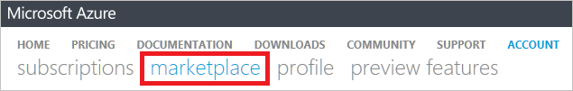

<properties
    pageTitle="Comprendere il costo del servizio esterno Azure | Microsoft Azure"
    description="Informazioni sulla fatturazione di servizi esterni, precedentemente noto come Marketplace, in base alle tariffe in Azure."
    services=""
    documentationCenter=""
    authors="adpick"
    manager="felixwu"
    editor=""
    tags="billing"
    />

<tags
    ms.service="billing"
    ms.workload="na"
    ms.tgt_pltfrm="na"
    ms.devlang="na"
    ms.topic="article"
    ms.date="10/12/2016"
    ms.author="adpick"/>

# Comprendere il costo del servizio esterno Azure

Questo articolo illustra la fatturazione di servizi esterni in Azure. Servizi esterni consente di chiamare ordini Marketplace. Servizi esterni forniti dai fornitori di servizi indipendenti, ma sono integrati completamente all'interno dell'ecosistema Azure. Informazioni su come:

- Identificare i servizi esterni
- Comprendere come la fatturazione è diversa rispetto alle altre risorse Azure
- Visualizzare e tenere traccia di tutti i costi che attribuzione dall'uso di servizi esterni
- Gestire gli ordini di assistenza esterni e le modalità di pagamento per poter

## Informazioni sui servizi esterni Azure?

Servizi esterni consente di chiamare Azure Marketplace. In genere, si tratta di servizi pubblicati da terze parti disponibili per Azure. Ad esempio, ClearDB e SendGrid sono servizi esterni che è possibile acquistare in Azure, ma non sono pubblicate da Microsoft.

### Identificare i servizi esterni

Quando viene effettuato il provisioning di un nuovo servizio esterno o una risorsa, viene visualizzato un avviso:

>[AZURE.NOTE] Servizi esterni pubblicati per le aziende che non sono Microsoft, ma a volte i prodotti Microsoft vengono inoltre classificati come servizi esterni.

### Servizi esterni vengono addebitati separatamente

Servizi esterni vengono considerati come singoli ordini all'interno di abbonamento Azure. Il periodo di fatturazione per ogni servizio viene impostato quando si acquista il servizio. Non deve essere confuso con il periodo di fatturazione della sottoscrizione in cui è stato acquistato. L'utente ottiene inoltre fatture separate e la carta di credito vengono addebitato separatamente.

### Ogni servizio esterno include un modello di fatturazione diversi

Alcuni servizi vengono addebitate in modo mentre altri utilizzano un modello di base pagamento mensile. È necessaria una carta di credito per Azure servizi esterni, non è possibile acquistare servizi esterni con pagamento fattura.

### Non è possibile utilizzare crediti gratuiti mensili per servizi esterni

Se si utilizza una sottoscrizione Azure che include [crediti gratuiti](https://azure.microsoft.com/pricing/spending-limits/), non possono essere applicate a fatture servizio esterno. Utilizzare una carta di credito per acquistare servizi esterni.

## Uso dei servizi esterni di visualizzazione e cronologia

È possibile visualizzare un elenco di servizi esterni disponibili su ciascuna sottoscrizione all'interno del [portale di Azure](https://portal.azure.com/): 

1. Eseguire l'accesso per il [portale di Azure](https://portal.azure.com/) e [passare a e il **fatturazione** ](https://portal.azure.com/?flight=1#blade/Microsoft_Azure_Billing/BillingBlade).

     
  
2. Nella sezione **i costi di abbonamento** selezionare l'abbonamento a cui si desidera visualizzare. 
   
    

3. Fare clic su **servizi esterni**.

    

4. Verrà visualizzato ognuno dei propri ordini di servizio esterno, il nome dell'autore, livelli di servizio che è stato acquistato, nome assegnato alla risorsa e lo stato corrente dell'ordine. Selezionare un servizio esterno per visualizzare gli effetti.

    

5. Da qui è possibile visualizzare oltre importi di fattura inclusa la suddivisione fiscale.

    

## Gestire i metodi di pagamento per gli ordini di servizio esterno

Aggiornare i metodi di pagamento per gli ordini di servizio esterno dal [Centro Account](https://account.windowsazure.com/).

> [AZURE.NOTE] Se è stato acquistato l'abbonamento con un account aziendale o dell'istituto di istruzione è necessario [contattare il supporto](https://portal.azure.com/?#blade/Microsoft_Azure_Support/HelpAndSupportBlade) per apportare modifiche alla modalità di pagamento.

1. Accedere a interfaccia [Di Account](https://account.windowsazure.com/) e [passare alla scheda **marketplace** ](https://account.windowsazure.com/Store)

    

2. Selezionare il servizio esterno che si desidera gestire

    

3. Fare clic su **modalità di pagamento modifica** sul lato destro della pagina. Questo collegamento consente di visualizzare un portale diverso per gestire il metodo di pagamento.
    
    

4. Fare clic su **Modifica informazioni** e seguire le istruzioni per aggiornare le informazioni di pagamento.

    
    
## Annullare un ordine di servizio esterno

Se si desidera annullare l'ordine di servizio esterno, è necessario eliminare la risorsa nel [portale di Azure](https://portal.azure.com).

## Servono altre informazioni? Contattare il supporto tecnico.

Se si riscontrano ancora ulteriormente domande, informazioni, [contattare il supporto tecnico](https://portal.azure.com/?#blade/Microsoft_Azure_Support/HelpAndSupportBlade) per ottenere il problema risolto rapidamente.
