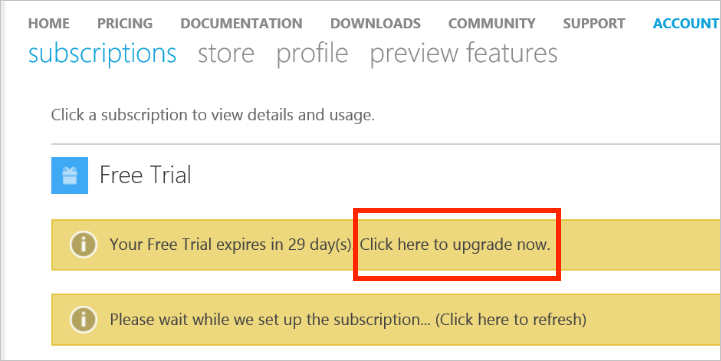

<properties
   pageTitle="Aggiornare l'abbonamento di Azure gratuito per uso prepagato | Microsoft Azure"
   description="Descrizione del processo e i requisiti per l'aggiornamento da una sottoscrizione gratuita per uso prepagato"
   services=""
   documentationCenter=""
   authors="jlian"
   manager="mbaldwin"
   editor=""
   tags="billing"
   />

<tags
   ms.service="billing"
   ms.devlang="na"
   ms.topic="article"
   ms.tgt_pltfrm="na"
   ms.workload="na"
   ms.date="10/26/2016"
   ms.author="jlian"/>

# Aggiornare l'abbonamento di Azure gratuito per uso prepagato

È possibile aggiornare l'abbonamento di [Valutazione gratuita](https://azure.microsoft.com/free/) o [Imagine Microsoft](https://azure.microsoft.com/offers/ms-azr-0144p/) per [Uso prepagato](https://azure.microsoft.com/offers/ms-azr-0003p/) dal portale di Account Azure. 

1. Accedere al [Portale di Account Azure](https://account.windowsazure.com/subscriptions) e passare alla scheda **sottoscrizioni** .

2. Nella sezione Stato abbonamento, selezionare l'intestazione **Aggiorna** .

    

3. Confermare l'aggiornamento.

    

Quando si esegue l'aggiornamento di uso prepagato versione di valutazione gratuita, eventuali vantaggi rimasti dopo il periodo di valutazione gratuita come meriti 30 giorni limite o $200 continuerà fino a uno di essi esaurito. L'aggiornamento di abbonamento accade in un secondo momento.
