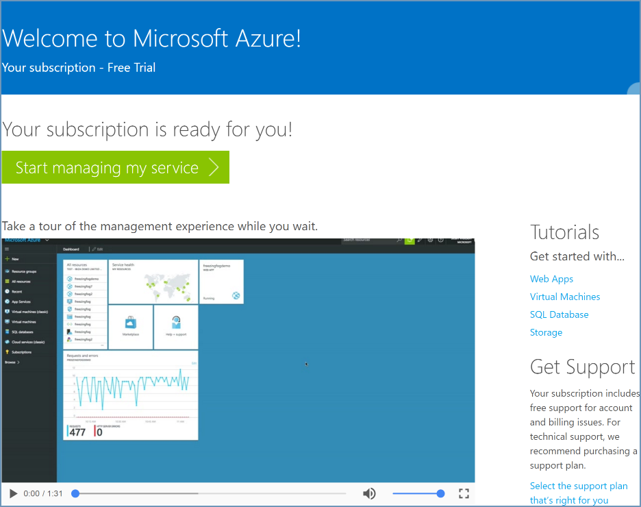
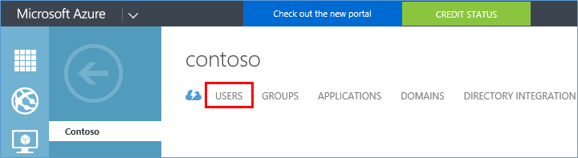
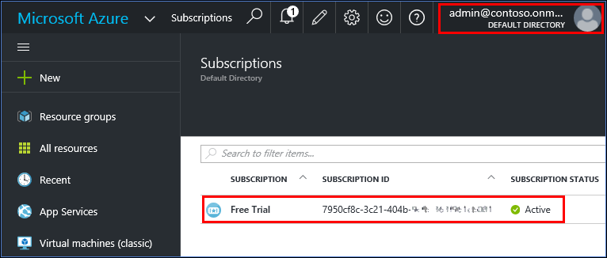

<properties
    pageTitle="Condividere un unico tenant di Azure AD abbonamenti a Office 365 e Azure | Microsoft Azure"
    description="Informazioni su come condividere il tenant di Azure Active Directory di Office 365 e i relativi utenti con l'abbonamento Azure o viceversa"
    services=""
    documentationCenter=""
    authors="JiangChen79"
    manager="mbaldwin"
    editor=""
    tags="billing,top-support-issue"/>

<tags
    ms.service="billing"
    ms.workload="na"
    ms.tgt_pltfrm="ibiza"
    ms.devlang="na"
    ms.topic="article"
    ms.date="08/17/2016"
    ms.author="cjiang"/>

# Usare un account Office 365 esistente con l'abbonamento Azure o viceversa
Scenario: È già ha un abbonamento a Office 365 e pronti per un abbonamento a Azure, ma si desidera utilizzare gli account utente di Office 365 esistenti per l'abbonamento Azure. In alternativa, si è abbonati Azure e si desidera ottenere un abbonamento a Office 365 per gli utenti di Azure Active Directory esistente. In questo articolo illustra quanto sia semplice raggiungere entrambi.

> [AZURE.NOTE] In questo articolo non è applicabile ai clienti contratto Enterprise (EA). Se sono necessarie altre in qualsiasi momento in questo articolo, [contattare il supporto tecnico](https://portal.azure.com/?#blade/Microsoft_Azure_Support/HelpAndSupportBlade) per ottenere il problema risolto rapidamente.

## Guida rapida

- Se è già ha un abbonamento a Office 365 e vuoi iscriverti per Azure, utilizzare l'opzione **accedere con l'account dell'organizzazione** . Quindi continuare il processo di iscrizione Azure con l'account di Office 365. Vedere [la procedura dettagliata più avanti in questo articolo](#s1).

- Se è già disponibile un abbonamento a pagamento Azure e per ottenere un abbonamento a Office 365, accedere a Office 365 con il proprio account Azure. Procedere con la procedura di iscrizione. Dopo aver completato l'abbonamento, l'abbonamento a Office 365 viene aggiunto alla stessa istanza di Azure Active Directory l'abbonamento Azure a cui appartiene. Per ulteriori informazioni, vedere la sezione [procedura dettagliata più avanti in questo articolo](#s2).

>[AZURE.NOTE] Per ottenere un abbonamento a Office 365, l'account usare per abbonamento deve essere membro del ruolo di directory amministratore globale o amministratore fatturazione nel tenant di Azure Active Directory. [Informazioni su come determinare il ruolo di Azure Active Directory](#how-to-know-your-role-in-your-azure-active-directory).

Per capire cosa accade quando si aggiunge una sottoscrizione a un account, vedere le [informazioni di base avanti in questo articolo](#background-information).

## Procedura dettagliata

### Scenario 1: Utenti di Office 365 che prevede di acquistano Azure
In questo scenario si presuppone che Kelley Wall è un utente che ha un abbonamento a Office 365 e pianificazione sottoscrivere Azure. Sono disponibili due utenti attivi aggiuntivi, Olga e Marco. Si tratta di Kelley admin@contoso.onmicrosoft.com.

Per iscriversi a Azure, procedere come segue:

1. Iscriversi a Azure in [Azure.com](https://azure.microsoft.com/). Fare clic su **prova gratuitamente**. Nella pagina successiva, fare clic su **Inizia ora**.

    

2. Fare clic su **accedere con l'account dell'organizzazione**.

    

3. Accedere con l'account di Office 365. In questo caso è account Office 365 di Kelley.

    

4. Inserire le informazioni e completare il processo di iscrizione.

    

    

A questo punto è possibile iniziare. Nel portale di Azure, vedere gli stessi utenti visualizzati. Per verificare questa impostazione, procedere come segue:

1. Fare clic su **Avvia il servizio di gestione** nella schermata precedente.
2. Fare clic su **Sfoglia**e quindi fare clic su **Active Directory**.

    

3. Fare clic su **utenti**.

    

4. Tutti gli utenti, inclusi Kelley, sono elencati come previsto.

    

### Scenario 2: Azure utenti prevede di acquistare Office 365

In questo scenario Kelley Wall è un utente che dispone di una sottoscrizione con l'account Azure admin@contoso.onmicrosoft.com. Kelley desidera effettuare la sottoscrizione a Office 365 e utilizzare la stessa directory che ha già con Azure.

>[AZURE.NOTE] Per ottenere un abbonamento a Office 365, l'account usato per l'accesso deve essere membro del ruolo di directory amministratore globale o amministratore fatturazione nel tenant di Azure Active Directory. [Imparare a conoscere il ruolo di Azure Active Directory](#how-to-know-your-role-in-your-azure-active-directory).

Per eseguire la sottoscrizione a Office 365, procedere come segue:

1. Passare alla [pagina di prodotto di Office 365](https://products.office.com/business)e quindi selezionare il piano a cui è adatto alle proprie esigenze.
2. Dopo aver selezionato il piano, verrà visualizzata la pagina seguente. Compilare il modulo. Fare clic su **Accedi** nell'angolo superiore destro della pagina.

    

3. Accedere con le credenziali dell'account. In questo esempio è account di Kelley.

    

4. Fare clic su **provare ora**.

    

5. Nella pagina Conferma ordine, fare clic su **Continua**.

    

A questo punto è possibile iniziare. Nell'interfaccia di amministrazione di Office 365, verrà visualizzato agli utenti della directory di Contoso appaiono utenti attivi. Per verificare questa impostazione, procedere come segue:

1. Aprire l'interfaccia di amministrazione di Office 365.
2. Espandere **utenti**e quindi fare clic su **Utenti attivi**.

    

### Come sapere proprio ruolo all'interno di Azure Active Directory

1. Accedere al [portale di Azure](https://portal.azure.com/).
2. Fare clic su **Sfoglia**e quindi fare clic su **Active Directory**.

    

3. Fare clic su **utenti**.

    

4. Fare clic sull'utente. In questo esempio, l'utente è Kelley Wall.

    Si noti che il campo del **Ruolo dell'organizzazione**.

    

## Informazioni sugli abbonamenti Azure e in Office 365
Office 365 e Azure usare il servizio di Azure Active Directory per gestire utenti e le sottoscrizioni. Valutare la possibilità di una directory Azure come contenitore in cui è possibile raggruppare gli utenti e le sottoscrizioni. Per usare lo stesso account utente per le sottoscrizioni di Azure e in Office 365, è necessario assicurarsi che gli abbonamenti vengono creati nella stessa directory. Tenere presenti i seguenti punti:

- Una sottoscrizione viene creata in una directory non viceversa.
- Gli utenti appartengono a directory e non viceversa.
- Una sottoscrizione recapitata nella directory dell'utente che ha creato l'abbonamento. Di conseguenza, l'abbonamento a Office 365 è collegato allo stesso account come abbonamento Azure quando si utilizza tale account per creare l'abbonamento a Office 365.

Per ulteriori informazioni, vedere [come Azure sottoscrizioni associate Azure Active Directory](./active-directory/active-directory-how-subscriptions-associated-directory.md).

>[AZURE.NOTE] Sottoscrizioni di Azure appartengono ai singoli utenti nella directory.

>[AZURE.NOTE] Sottoscrizioni di Office 365 appartengono a directory stessa. Se gli utenti all'interno della directory dispongano delle autorizzazioni necessarie, può operare su sottoscrizioni.

## Passaggi successivi
Se si desidera essere in grado di accedere al tenant di Office 365 dalla sottoscrizione Azure abbonamenti il Azure e di Office 365 è stato acquistato separatamente in passato, vedere [associazione di un tenant di Office 365 con un abbonamento a Azure](billing-add-office-365-tenant-to-azure-subscription.md).

> [AZURE.NOTE] Se si riscontrano ancora domande, [contattare il supporto tecnico](https://portal.azure.com/?#blade/Microsoft_Azure_Support/HelpAndSupportBlade) per ottenere il problema risolto rapidamente.
