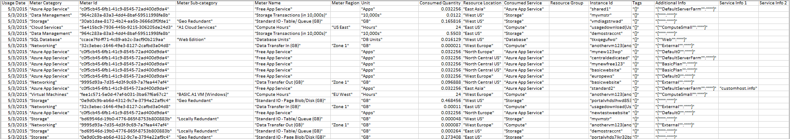

<properties
   pageTitle="Informazioni sulla fattura | Microsoft Azure"
   description="Informazioni su come da leggere e comprendere l'utilizzo e la fattura per l'abbonamento Azure"
   services=""
   documentationCenter=""
   authors="genlin"
   manager="stevenpo"
   editor=""
   tags="billing"/>

<tags
   ms.service="billing"
   ms.devlang="na"
   ms.topic="article"
   ms.tgt_pltfrm="na"
   ms.workload="na"
   ms.date="10/31/2016"
   ms.author="erihur;genli"/>

# Leggere la fattura per Microsoft Azure

> [AZURE.NOTE] Se necessaria ulteriore assistenza in qualsiasi momento in questo articolo, informazioni, [contattare il supporto tecnico](https://portal.azure.com/?#blade/Microsoft_Azure_Support/HelpAndSupportBlade) per ottenere il problema risolto rapidamente.

Le spese per le sottoscrizioni di Microsoft Azure variano in base piano di frequenza. Alcuni piani di tariffe, ad esempio gli abbonati Visual Studio Enterprise (MPN) includono crediti mensili che è possibile usare qualsiasi servizio di Azure in base alle proprie esigenze.

Si noti che la a 24 ore di utilizzo affidabili dal periodo di fatturazione precedente che possono essere inserite nel periodo di fatturazione corrente.

Per ulteriori informazioni sui piani tasso e consumo, vedere la [pagina delle opzioni di acquisto di Microsoft Azure](https://azure.microsoft.com/pricing/purchase-options/).

<!-- The below links cover a complete list of all Microsoft Azure services.

<!-- - [Service Details list (csv1)](https://azurepricing.blob.core.windows.net/supplemental/MOSPServices_csv1.xlsx)
<!-- - [Service Details list (csv2)](https://azurepricing.blob.core.windows.net/supplemental/MOSPServices_csv2.xlsx)

<!-- *NOTE: The **csv1** link refers to the column header names for csv version 1 and **csv2** link refers to the new column header names for csv version 2.  These files are updated monthly.*-->

### Visualizzare o scaricare una fattura per Microsoft Azure:

1. Accedere al [Centro Account](https://account.windowsazure.com/subscriptions) usando l'Account Microsoft o l'ID dell'organizzazione.

2. Fare clic sull'abbonamento in cui si desidera visualizzare dettagli e l'uso.

3. Fare clic sulla **cronologia di fatturazione**

    

4. La sezione **Cronologia fatturazione** Elenca le istruzioni per il periodo corrente fatturato più periodi di fatturazione precedenti. L'istruzione per il periodo corrente è una stima delle spese in corrispondenza dell'ora che la stima è stata generata. Queste informazioni aggiornate solo ogni giorno e non possono includere tutti l'uso fino alla data odierna. Il conto mensile possono essere diversi da questa stima.  

    

5. Fare clic su **Visualizzazione istruzione corrente** per visualizzare una stima delle spese in corrispondenza dell'ora che la stima è stata generata. Queste informazioni aggiornate solo ogni giorno e non possono includere tutti l'uso fino alla data odierna. Il conto mensile possono essere diversi da questa stima.

    

    

6. Fare clic su **Scarica fattura** per visualizzare una copia della fattura precedente.

    

> [AZURE.NOTE] In base alle tariffe elencate nelle istruzioni di fatturazione per i clienti internazionali sono ai fini della stima solo banche hanno costi diversi per tassi di conversione.

Di seguito sono alcune istruzioni di esempio per due diversi offerte in Microsoft Azure.

 Tipo di offerta | Descrizione | Download |
 :--------- |:-------- | :-------|
Uso prepagato | Pagamento mensile in ritardo | [File di esempio](https://azurepricing.blob.core.windows.net/sampleinvoices/Microsoft_Azure_ccinvoice_Sample.pdf)
Offerta di impegno | Dedicare detratta dall'impegno prepagato | [File di esempio](https://azurepricing.blob.core.windows.net/sampleinvoices/Microsoft_Azure_invoice_Sample.pdf)

## Informazioni sull'account

Sezione informazioni sull'account identifica informazioni pertinenti sull'utilizzo e il profilo.

| Termini                | Descrizione                                                                                         |
|---------------------|-----------------------------------------------------------------------------------------------------|
| Fattura No.         | Un identificatore univoco fattura scopo di registrazione                                                   |
| Ciclo di fatturazione       | L'intervallo di tempo in cui l'utilizzo ha avuto luogo                                                       |
| Data della fattura        | Data in cui è stata generata la fattura                                                                 |
| Metodo di pagamento      | Tipo di pagamento utilizzati nella pagina account (carta di credito o fattura)                                   |
| Fatturazione             | Indirizzo di pagamenti di Microsoft Azure                                                                    |
| Offerta di abbonamento  | Tipo di offerta di abbonamento è stato acquistato (uso prepagato, BizSpark Plus, Azure Pass e così via) |
| Proprietario dell'indirizzo di posta elettronica | L'indirizzo di posta elettronica di account che l'account di Microsoft Azure viene registrata in                      |

## Comprendere il riepilogo fattura

La sezione di **Riepilogo fatture** dell'effetto sono riepilogate le transazioni dopo l'ultima fattura e i costi di utilizzo corrente.

Saldo precedente, i pagamenti e saldo sezione dell'effetto sono riepilogate le transazioni dopo l'ultima fattura.

| Termini                                              | Descrizione                                                                              |
|---------------------------------------------------|------------------------------------------------------------------------------------------|
| Saldo precedente                                  | L'importo totale dovuto da ultima fattura                                                 |
| Pagamenti                                          | Totale dei pagamenti applicati per ultima fattura                                                 |
| Saldo (da ciclo di fatturazione precedente) | Le modifiche di fattura (crediti totali o saldi) applicate al proprio account dall'ultima fattura  |

## Comprendere addebiti correnti
La sezione corrente in base alle tariffe dell'effetto contiene informazioni dettagliate sulle spese mensili. I collegamenti sono organizzati nelle sottosezioni seguenti.

| Termini          | Descrizione                                                                                                                                                                                                                                                                                                                                                                                                                                            |
|---------------|--------------------------------------------------------------------------------------------------------------------------------------------------------------------------------------------------------------------------------------------------------------------------------------------------------------------------------------------------------------------------------------------------------------------------------------------------------|
| Costi di utilizzo | Costi di utilizzo sono totale delle spese mensili in una sottoscrizione. Vengono addebitate in ritardo per l'utilizzo del mese precedente.                                                                                                                                                                                                                                                                                                                                       |
| Sconti     | In questa voce verrà riflesso sconti servizio applicati della fattura corrente.                                                                                                                                                                                                                                                                                                                                              |
| Rettifiche   | Rettifiche varie sono vari crediti o in sospeso in base alle tariffe applicati per la fattura corrente. Ad esempio, se si dispone di Visual Studio Enterprise con offerta MSDN, si vedrà una carta di credito mensile in questa voce. Se si annulla l'abbonamento, si vedrà in base alle tariffe per l'utilizzo di mensile che superano la carta di credito mensile incluso nell'offerta dall'inizio del periodo di fatturazione corrente per la data di annullamento della sottoscrizione.|

## Informazioni del piè di pagina

## Comprendere le informazioni aggiuntive
Nella pagina informazioni aggiuntive offre riferimenti ad altre risorse per comprendere la fattura e collegamenti per visualizzare l'utilizzo e altre informazioni rilevanti per la fattura.

### Utilizzo dettagliato
Un collegamento nella casella Descrizione in **Informazioni dettagliate sull'utilizzo** indirizza l'interfaccia di Account in cui è possibile visualizzare l'utilizzo dettagliata per l'abbonamento.  Esistono due versioni disponibili per il download: **CSV versione 1** contiene i campi di utilizzo e una convenzione di denominazione precedente e **CSV versione 2** contiene nomi dei clienti per ciascuna delle categorie di campi aggiuntivi che consentono di capire quali servizi si usano in Microsoft Azure. Si noti che nella versione CSV 1 non sono presenti dettagli di gestione di risorse Azure. Azure informazioni di gestione risorse disponibili nella versione CSV 2.

### Informazioni aggiuntive e risorse utili
In questa sezione è disponibili collegamenti a semplici domande relative alle dimensioni istanza di calcolo, in base alle tariffe DB SQL e collegamenti utili per rispondere a domande ulteriori.

| Termini                 | Descrizione                                                                                                                            |
|----------------------|----------------------------------------------------------------------------------------------------------------------------------------|
| Venduto a              | Questo viene prepopolato con l'indirizzo del profilo dell'account                                                                           |
| Istruzioni per il pagamento | In questa sezione è istruzioni per il pagamento del punto in cui è possibile inviare controlli, filo trasferimenti o controlli notte se il metodo di pagamento fattura |

## Informazioni dettagliate addebiti

Come parte del nostro impegno per aiutare i clienti a gestire l'uso di Azure, sono state avanzate per il download di utilizzo che segnala per l'uso con i servizi Azure e dei costi.  Il collegamento di download contiene due versioni del file di utilizzo:

- **Versione 1** utilizza il formato esistente

- **Versione 2** include informazioni aggiuntive e aggiornare i nomi di colonna nella sezione quotidiana.  

Costi di utilizzo sono costo totale di tipo **mensile** per una sottoscrizione meno qualsiasi carta di credito o sconto. Vengono addebitate in ritardo per l'utilizzo del mese precedente.  La sezione superiore del file consente di visualizzare i dettagli sui servizi che vengono fatturato il per ciclo di fatturazione del mese precedente.  Nella tabella precedente sono elencati i nomi delle colonne per ogni versione file CSV.

Versione 1 |  Versione 2  |  Descrizione|
:---------------| :---------------- | --------|
Periodo di fatturazione | Periodo di fatturazione | Il periodo di fatturazione quando di utilizzo della risorsa.
Nome | Categoria contatore | Consente di identificare il servizio di primo livello per cui appartiene l'utilizzo.
Tipo | Sottocategoria contatore | Servizio di Azure può essere definito in base al tipo in questa colonna, che possa influenzare il tasso di.
Risorsa | Nome contatore | Identifica l'unità di misura della risorsa utilizzata.
Area geografica | Area geografica contatore | Identifica la posizione del Data Center per alcuni servizi prezzi variano in base alla posizione Data Center.
SKU | SKU | Identifica l'identificatore univoco del sistema per ogni risorsa Azure.
Unità | Unità | Identifica l'unità addebitato il servizio. Ad esempio, GB, ore, 10.000.
Consumate | Quantità consumata | Contiene l'importo della risorsa utilizzati durante il periodo di fatturazione.
Incluso | Quantità inclusi | Contiene l'importo della risorsa a cui è inclusa senza costi aggiuntivi il periodo di fatturazione corrente.
Fatturabili | Quantità di elaborazione | Se l'importo consumato supera la quantità inclusa, consente di visualizzare la differenza. Vengono addebitate per questo periodo. Per le offerte uso prepagato con alcun importo incluso con l'offerta, il totale sarà la stessa quantità consumato.
All'interno di impegno | All'interno di impegno | Contiene le spese di risorse ridotta dalla quantità di impegno associata l'offerta di mese 6 o 12. I costi delle risorse sono ridotto dall'importo impegno in ordine cronologico.
Valuta | Valuta | Identifica la valuta applicata nel periodo di fatturazione corrente.
Eccesso di dosaggio | Eccesso di dosaggio | Contiene in base alle tariffe delle risorse che superano la quantità di impegno associata l'offerta di mese 6 o 12.
Tasso di impegno | Tasso di impegno | Contiene il tasso di impegno in base alla quantità totale impegno associata l'offerta di mese 6 o 12.
Tasso | Tasso | Tasso Visualizza la velocità addebitate unitario fatturabile.
Valore | Valore | Visualizza il risultato della moltiplicazione fatturabile colonna in base alla colonna tariffa. Se l'importo consumato non superi l'importo incluso, non si verificherà costi aggiuntivi in questa colonna.

## Analizzare i dati di utilizzo giornaliero
A seconda l'utilizzo, può essere migliaia di righe di dati di utilizzo giornaliera. Se si desidera analizzare i dati, fare clic su **Scarica uso** e scegliere una versione del file variabile separati da virgola (CSV) per visualizzare i dati di utilizzo giornaliero per il periodo di fatturazione appropriato.  Per riferimento, è possibile scaricare un file CSV di esempio per ogni versione riportata di seguito.

 Nome | Download |
 :----------:| :-------: |
  Utilizzo dettagliato CSV versione 1|  [File di esempio](https://azurepricing.blob.core.windows.net/supplemental/MOSPServices_csv1.xlsx)
  Utilizzo dettagliato CSV versione 2 | [File di esempio](https://azurepricing.blob.core.windows.net/supplemental/MOSPServices_csv2.xlsx)

Nel file CSV, gli elementi sono suddivisi per visualizzare un elenco di quantità di ogni risorsa consumata entro il periodo di fatturazione corrente.

Le colonne seguenti visualizzano i dettagli che influiscono sulle tariffe all'inizio del periodo di fatturazione:

Versione 1 |   Versione 2   |  Descrizione |
:---------------| :----------------| -----|
Data di utilizzo | Data di utilizzo | Data quando la risorsa è stata creata.
Nome | Categoria contatore | Consente di identificare il servizio di primo livello per cui appartiene l'utilizzo.
GUID risorsa | ID contatore | Identificatore contatore fatturato.  Viene utilizzato come l'identificatore utilizzato per l'uso di fatturazione di prezzo.
Tipo | Sottocategoria contatore | Servizio di Azure può essere definito in base al tipo in questa colonna, che possa influenzare il tasso di.
Risorsa | Nome contatore | Identifica l'unità di misura della risorsa utilizzata.
Area geografica | Area geografica contatore | Identifica la posizione del Data Center per alcuni servizi prezzi variano in base alla posizione Data Center.
Unità | Unità | Identifica l'unità addebitato il servizio. Ad esempio, GB, ore, 10.000.
Consumate | Quantità consumata | Contiene l'importo della risorsa utilizzati per tale giorno.
Regione secondaria | Percorso della risorsa | Identifica Data Center in cui la risorsa è in esecuzione.
Servizio | Servizio consumata | Questo articolo viene utilizzato per tenere traccia del servizio per piattaforma Azure che potrebbe non essere identificato in particolare nella colonna nome. Si riferisce questo servizio colonna indica quali specifiche del servizio l'utilizzo.
N/D | Gruppo di risorse | _**Novità di colonna.**_ Gruppo di risorse in cui la risorsa distribuita è in esecuzione in. Fare riferimento alla pagina [Panoramica di gestione risorse di Azure](../azure-resource-manager/resource-group-overview.md)
Componente | ID istanza | Identificatore per la risorsa in esecuzione. L'identificatore contiene il nome specificato per la risorsa è stata creata.
N/D | Tag | _**Novità di colonna.**_ Nuovi tipi di risorse in Azure consentono alle risorse di tag. Fare riferimento a [organizzare le risorse Azure con tag](http://azure.microsoft.com/updates/organize-your-azure-resources-with-tags/)
Informazioni aggiuntive | Informazioni aggiuntive | Metadati aggiuntivi relativi al servizio.
Informazioni sul servizio 1 | Informazioni sul servizio 1 | In questa colonna fornisce il nome del progetto il servizio a cui appartiene l'abbonamento.
Informazioni sul servizio 2 | Informazioni sul servizio 2 | Si tratta di un campo legacy che acquisisce facoltativo specifico del servizio metadati.

Oltre ad alcune nuovi campi e le modifiche nome csv versione 2, ci sarà standardizzati formattazione per i dati nel sotto campi:

- **ID istanza**: rappresenta campo ID istanza l'utente specificato identificatore per il servizio viene completato il provisioning. Attualmente sono disponibili due formati in cui viene rappresentato l'ID dell'istanza: è il nome della risorsa o il nome completo ID di risorsa. Servizi di Microsoft Azure stanno passando per rappresentare l'ID dell'istanza in un formato ID risorsa completo standardizzato _**(/subscriptions/<subscription id>/resourcegroups/<resourcegroupname>/providers/<providername>/<resourcename>)**_. Durante la transizione al nuovo formato di servizi verrà visualizzato il campo dati ID istanza modificare da solo il nome della risorsa a ID risorsa. ID risorsa è nel formato usato da [Azure Manager delle risorse API](https://msdn.microsoft.com/library/azure/dn790567.aspx) per identificare le risorse in un abbonamento.

- **Informazioni aggiuntive**: informazioni supplementari di colonna nel file CSV l'uso specifica specifiche del servizio metadati. Ad esempio, un tipo di immagine per una macchina virtuale. Attualmente, un servizio genera specifiche del servizio metadati in più colonne: campi informazioni aggiuntive, Info1 servizio e Service Info 2. Servizi di Microsoft Azure verranno standardizzazione emissione dei metadati specifici dei servizi nella colonna informazioni supplementari solo.  Vedere di seguito snapshot del formato standard:

- **Tag**: questa colonna contiene l'utente specificato tag di risorse. Il tag possono essere utilizzati per raggruppare record fatturazione. Ad esempio, è possibile utilizzare tag per distribuire i costi per reparto mediante il servizio. Altre informazioni [sull'uso di tag per organizzare le risorse di Azure](../resource-group-using-tags.md). I servizi che supportano la creazione di tag sono:  

    - Macchine virtuali

    - Spazio di archiviazione e

    - Servizi di rete viene completato il provisioning tramite l' [API di gestione risorse di Azure](https://msdn.microsoft.com/library/azure/dn790567.aspx)

## Passaggi successivi

- [Impostare gli avvisi di fatturazione](../billing-set-up-alerts.md)

- [Gestire i metodi di pagamento](../billing-how-to-change-credit-card.md)

- [Comprendere il costo di Azure Marketplace](../billing-understand-your-azure-marketplace-charges.md)

- [Domande frequenti su Azure fatturazione e abbonamento](../billing-subscription-faq.md)

> [AZURE.NOTE] Se si riscontrano ancora ulteriormente domande, informazioni, [contattare il supporto tecnico](https://portal.azure.com/?#blade/Microsoft_Azure_Support/HelpAndSupportBlade) per ottenere il problema risolto rapidamente.

<!--
OLD MSDN Articles
- [What do I do if my Azure subscription become disabled?](https://msdn.microsoft.com/library/azure/dn736049.aspx)
- [Edit payment information for an existing credit card](https://msdn.microsoft.com/library/azure/dn736053.aspx)
- [Add a new credit card to use as a payment method](https://msdn.microsoft.com/library/azure/dn736057.aspx)
- [Change the credit card on your Microsoft Azure account](https://msdn.microsoft.com/library/azure/dn736050.aspx)
- [Manage your payment method](https://msdn.microsoft.com/library/azure/dn736054.aspx)
-->

<!--Image references-->
