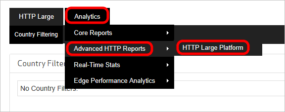

<properties
    pageTitle="Azure CDN avanzate HTTP report | Microsoft Azure"
    description="Report HTTP avanzate in Microsoft Azure CDN. Per informazioni dettagliate sull'attività CDN questi report:"
    services="cdn"
    documentationCenter=""
    authors="camsoper"
    manager="erikre"
    editor=""/>

<tags
    ms.service="cdn"
    ms.workload="tbd"
    ms.tgt_pltfrm="na"
    ms.devlang="na"
    ms.topic="article"
    ms.date="07/28/2016"
    ms.author="casoper"/>

# Report HTTP avanzati in rete CDN di Microsoft Azure

## Panoramica

In questo documento viene avanzate HTTP reporting in Microsoft Azure CDN. Per informazioni dettagliate sull'attività CDN questi report:

[AZURE.INCLUDE [cdn-premium-feature](../../includes/cdn-premium-feature.md)]

## Accesso ai report HTTP avanzate

1. Scegliere il pulsante **Gestisci** e il profilo CDN.

    

    Portale di gestione di rete CDN apre.

2. Al passaggio del mouse sulla scheda **Analitica** , quindi al passaggio del mouse sopra il riquadro a comparsa **Avanzate report HTTP** .  Fare clic su **HTTP piattaforma di grandi dimensioni**.

    

    Vengono visualizzate opzioni del report.

## Report Geography (basati su mappe)

Sono disponibili cinque report che si avvalgono di una mappa per indicare le aree da cui viene richiesto il contenuto. Questi report sono planisfero, mappa negli Stati Uniti, Canada mappa, mappa Europa e Asia Pacifico mappa.

Ogni report basati su mappe ordinato entità geografica (ad esempio paesi, stati e province) in base alla percentuale di visite provenienti da tale area. Inoltre, è disponibile una mappa che consentono di visualizzare le posizioni da cui viene richiesto il contenuto. È possibile farlo per ogni regione in base alla quantità di richiesta esperto in quell'area la codifica a colori. Più chiare le aree ombreggiate indicano inferiore richiesta per il contenuto, mentre aree più scure indicano livelli superiori di richiesta per il contenuto.

Vengono fornite informazioni dettagliate di traffico e la larghezza di banda per ogni area sotto la mappa. In questo modo è possibile visualizzare il numero totale di visite, la percentuale di visite, l'importo totale dei dati trasferiti (in GB) e la percentuale di dati trasferiti per ogni area. Visualizzare una descrizione per ognuna di queste metriche. Infine, quando si passa il mouse su un'area (ad esempio, paese, stato o provincia), il nome e la percentuale di visite che si sono verificati nell'area verrà visualizzati come descrizione comandi.

Una breve descrizione è fornita di seguito per ogni tipo di report basati su mappe geografici.

Nome report | Descrizione
------------|------------
Planisfero | Questo report consente di visualizzare in tutto il mondo richiesta per il contenuto CDN. Ogni paese è contraddistinti da colori diversi sulla mappa del mondo per indicare la percentuale di visite proveniente da tale area.
Mappa Stati Uniti | Questo report consente di visualizzare la richiesta per il contenuto CDN negli Stati Uniti. Ogni stato è contraddistinti da colori diversi sulla mappa per indicare la percentuale di visite proveniente da tale area.
Mappa Canada | Questo report consente di visualizzare la richiesta per il contenuto CDN in Canada. Ogni provincia è contraddistinti da colori diversi sulla mappa per indicare la percentuale di visite proveniente da tale area.
Europa mappa | Questo report consente di visualizzare la richiesta per il contenuto CDN europei. Ogni paese è contraddistinti da colori diversi sulla mappa per indicare la percentuale di visite proveniente da tale area.
Area Asia Pacifico mappa | Questo report consente di visualizzare la richiesta per il contenuto CDN in Asia. Ogni paese è contraddistinti da colori diversi sulla mappa per indicare la percentuale di visite proveniente da tale area.

## Report Geography (grafici a barre)

Esistono due altri report che forniscono informazioni statistiche in base alla posizione geografica, che sono paesi superiore e città superiore. Questi report classificano le città e paesi, rispettivamente, in base al numero di occorrenze proveniente da queste aree. Dopo la generazione di questo tipo di report, un grafico a barre indica le prime 10 città o paesi in cui è richiesto il contenuto tramite una piattaforma specifica. Questo grafico a barre consente di valutare rapidamente le aree geografiche che generano il numero massimo di richieste per il contenuto.

Sul lato sinistro del grafico (asse y) indica il numero delle visite all'area specificata. Direttamente sotto il grafico (asse x), si noterà un'etichetta per ognuna delle aree di 10 superiore.

### Usare i grafici a barre

* Se si passa il mouse su una barra, il nome e il numero totale dei risultati che si sono verificati nell'area verrà visualizzati come descrizione comandi.
* Descrizione comando per il report superiore città identifica una città con il nome, provincia e abbreviazione del paese.
* Se non è possibile determinare la città o regione (ad esempio Provincia) da cui ha avuto origine una richiesta, verrà indicano che provengano sconosciuti. Se il paese è sconosciuto e quindi due il punto interrogativo (ad esempio??), verrà visualizzato.
* Una relazione può contenere metriche per "Europa" o "Area Asia/Pacifico". Questi elementi non deve fornire informazioni statistiche su tutti gli indirizzi IP in queste aree geografiche. Ma si applicano solo alle richieste provenienti da indirizzi IP che sono distribuiti su Europa o Asia/Pacifico invece che a una determinata città o paese.

I dati che è stati usati per generare il grafico a barre possono essere visualizzati sotto di esso. Ci si trova il numero totale di visite, la percentuale di visite, la quantità di dati trasferiti (in GB) e la percentuale di dati trasferiti relativi alle aree superiore 250. Visualizzare una descrizione per ognuna di queste metriche.

Per entrambi i tipi di relazioni riportato di seguito viene fornita una descrizione breve.

Nome report | Descrizione
------------|------------
Torna al città | Questo report ordinato città in base al numero di occorrenze creati da tale area.
Paesi superiore | Questo report ordinato paesi in base al numero di occorrenze creati da tale area.

## Riepilogo giornaliero

Report riepilogo giornaliero consente di visualizzare il numero totale di visite e dati trasferiti una determinata piattaforma su base giornaliera. Queste informazioni possono essere utilizzate per distinguere rapidamente i modelli di attività CDN. Ad esempio, questo report consente di rilevare i giorni esperti superiore o inferiori di traffico previsti.

Dopo la generazione di questo tipo di report, un grafico a barre costituiranno un'indicazione visiva per quanto riguarda l'importo della domanda specifico della piattaforma esperto su base giornaliera nel periodo di tempo coperto dal report. Verranno eseguite in modo visualizzando una barra per ogni giorno nel report. Ad esempio, selezionando il periodo di tempo denominato "Ultima settimana" verrà generato un grafico a barre con sette barre. Ogni barra indica il numero totale di visite esperti del giorno corrente.

Sul lato sinistro del grafico (asse y) indica il numero delle visite alla data specificata. Direttamente sotto il grafico (asse x), si noterà un'etichetta che indica la data (formato: gg / MM-AAAA) per ogni giorno inclusa nel report.

> [AZURE.TIP] Se si passa il mouse su una barra, il numero totale dei risultati che si sono verificati in tale data verrà visualizzato come descrizione comandi.

I dati che è stati usati per generare il grafico a barre possono essere visualizzati sotto di esso. Ci si trova totale degli accessi e la quantità di dati trasferiti (in GB) per ogni giorno interessato dal report.

## Da ora

Il report da ora consente di visualizzare il numero totale di visite e dati trasferiti una determinata piattaforma oraria. Queste informazioni possono essere utilizzate per distinguere rapidamente i modelli di attività CDN. Ad esempio, questo report consente di rilevare i periodi di tempo durante la giornata verifichino superiori o inferiori di traffico previsti.

Dopo la generazione di questo tipo di report, un grafico a barre costituiranno un'indicazione visiva per quanto riguarda l'importo della domanda specifico della piattaforma subita ora per il periodo di tempo coperto dal report. Verranno eseguite in modo visualizzando una barra per ogni ora interessato dal report. Ad esempio, la selezione di 24 ore periodo di tempo verrà generato un grafico a barre con 24 barre. Ogni barra indica il numero totale di visite esperti in quell'ora.

Sul lato sinistro del grafico (asse y) indica il numero delle visite durante l'ora specificato. Direttamente sotto il grafico (asse x), si noterà un'etichetta che indica la data/ora (formato: gg / MM-aaaa hh.mm) per ogni ora inclusa nel report. Ora viene segnalata nel formato 24 ore e viene specificato utilizzando il fuso orario UTC/GMT.

> [AZURE.TIP] Se si passa il mouse su una barra, il numero totale dei risultati che si sono verificati in quell'ora verrà visualizzato come descrizione comandi.

I dati che è stati usati per generare il grafico a barre possono essere visualizzati sotto di esso. Ci si trova totale degli accessi e la quantità di dati trasferiti (in GB) per ogni ora interessato dal report.

## Da File

Il report dal File consente di visualizzare la quantità di richiesta e il traffico sostenuti su una determinata piattaforma dei beni maggiormente. Dopo la generazione di questo tipo di report, verrà generato un grafico a barre dei beni maggiormente 10 principali nel periodo di tempo specificato.

> [AZURE.NOTE] Per quanto riguarda il report, bordo CNAME URL vengono convertiti negli URL CDN equivalenti. In questo modo elettorali accurate per il numero totale di visite associata a una risorsa indipendentemente dal CDN o bordo CNAME URL utilizzato per la richiesta.

Sul lato sinistro del grafico (asse y) indica il numero di richieste per ogni risorsa nel periodo di tempo specificato. Direttamente sotto il grafico (asse x), si noterà un'etichetta che indica il nome del file per ognuna delle prime 10 attività richiesta.

I dati che è stati usati per generare il grafico a barre possono essere visualizzati sotto di esso. Sono disponibili le informazioni seguenti per ognuna delle attività di richiesta 250 superiore: percorso, il numero totale di visite, la percentuale di visite, la quantità di dati trasferiti (in GB) e la percentuale di dati trasferiti.

## Per dettagli su come File

Il report di base dettagli File consente di visualizzare la quantità di richiesta e il traffico sostenuti su una determinata piattaforma per una risorsa specifica. Nella parte superiore del report è l'opzione File dettagli per. Questa opzione comprende un elenco delle risorse di più sulla piattaforma selezionata. Per generare il report dal File dettaglio, sarà necessario selezionare l'opzione File dettagli per risorse desiderata. Dopo il quale, un grafico a barre indicano la quantità di domanda giornaliera generati nel periodo di tempo specificato.

Sul lato sinistro del grafico (asse y) indica il numero totale di richieste di tipo che si è verificato un bene in un giorno specifico. Direttamente sotto il grafico (asse x), si noterà un'etichetta che indica la data (formato: gg / MM-AAAA) per la rete CDN è stato segnalato richiesta per la risorsa.

I dati che è stati usati per generare il grafico a barre possono essere visualizzati sotto di esso. Ci si trova totale degli accessi e la quantità di dati trasferiti (in GB) per ogni giorno interessato dal report.

## In base al tipo di File

Il report per tipo di File consente di visualizzare la quantità di richiesta e il traffico sostenuti per il tipo di file. Dopo la generazione di questo tipo di report, un grafico ad anello indica la percentuale di visite generati da tipi di 10 file superiore.

> [AZURE.TIP] Se si passa il mouse su una sezione del grafico ad anello, gli elementi multimediali Internet tipo di che tipo di file verrà visualizzato come descrizione comandi.

I dati che è stati usati per generare il grafico ad anello possono essere visualizzati sotto di esso. Sarà possibile trovare il tipo di elemento multimediale estensione/Internet nome file, il numero totale di visite, la percentuale di visite, la quantità di dati trasferiti (in GB) e la percentuale di dati trasferiti per tutti i tipi di file superiore 250.

## Dalla Directory

Il report dalla Directory consente di visualizzare la quantità di richiesta e il traffico sostenuti su una determinata piattaforma per il contenuto di una directory specifica. Dopo la generazione di questo tipo di report, un grafico a barre indica il numero totale di risultati generati da contenuto nelle directory di 10 superiore.

### Utilizzare il grafico a barre

* Passare il mouse su una barra per visualizzare il relativo percorso della directory corrispondente.
* Il contenuto archiviato in una sottocartella di una directory non rileva durante il calcolo richiesta dalla directory. Questo calcolo si basa unicamente sul numero di richieste generate per il contenuto archiviato nella directory effettiva.
* Per quanto riguarda il report, bordo CNAME URL vengono convertiti negli URL CDN equivalenti. In questo modo elettorali accurate per tutte le statistiche associata a una risorsa indipendentemente dal CDN o bordo CNAME URL utilizzato per la richiesta.

Sul lato sinistro del grafico (asse y) indica il numero totale di richieste per il contenuto archiviato nella directory primi 10. Ogni barra del grafico rappresenta una directory. Utilizzare la combinazione di colori le corrispondenze tra una barra in una directory elencata nella sezione superiore 250 intera directory.

I dati che è stati usati per generare il grafico a barre possono essere visualizzati sotto di esso. Sono disponibili le informazioni seguenti per ciascuna delle directory superiore 250: percorso, il numero totale di visite, la percentuale di visite, la quantità di dati trasferiti (in GB) e la percentuale di dati trasferiti.

## Dal Browser

Il report dal Browser consente di visualizzare quali browser sono stati utilizzati per richiedere contenuto. Dopo la generazione di questo tipo di report, un grafico a torta indicano la percentuale di richieste gestite da principali 10 browser.

### Utilizzando il grafico a torta

* Passare il mouse su una sezione nel grafico a torta per visualizzare il nome e la versione di un browser.
* Per quanto riguarda il report, ogni combinazione univoco/versione del browser è considerato un browser diverso.
* La sezione denominata "Altro" indica la percentuale di richieste gestite da tutti gli altri browser e le versioni.

I dati che è stati usati per generare il grafico a torta possono essere visualizzati sotto di esso. Sono si trova il numero di tipo/versione del browser, il numero totale di accessi e la percentuale di visite per ognuno dei browser superiore 250.

## Per riferimento

Il report da provenienza consente di visualizzare riferimenti principali per il contenuto della piattaforma selezionata. Un riferimento indica il nome host da cui è stata generata una richiesta. Dopo la generazione di questo tipo di report, un grafico a barre indica la quantità di richiesta (ad esempio accessi) generato da principali 10 riferimenti.

Sul lato sinistro del grafico (asse y) indica il numero totale di richieste di tipo che si è verificato un bene per ogni provenienza. Ogni barra del grafico rappresenta un riferimento. Utilizzare la combinazione di colori le corrispondenze tra una barra in un riferimento elencata nella sezione superiore 250 provenienza.

I dati che è stati usati per generare il grafico a barre possono essere visualizzati sotto di esso. Ci si trova l'URL, il numero totale di accessi e la percentuale di visite generate da ognuna delle principali 250 riferimenti.

## Per il Download

Il report da scaricare consente di analizzare i criteri di download per il contenuto più richiesto. Nella parte superiore del report sono un grafico a barre che confronta tentato download con download completato per le risorse richieste 10 superiore. Ogni barra è contraddistinti da colori diversi in base alle se si tratta di un tentativo di download (blu) o il download completato (verde).

> [AZURE.NOTE] Per quanto riguarda il report, bordo CNAME URL vengono convertiti negli URL CDN equivalenti. In questo modo elettorali accurate per tutte le statistiche associata a una risorsa indipendentemente dal CDN o bordo CNAME URL utilizzato per la richiesta.

Sul lato sinistro del grafico (asse y) indica il nome del file per ognuna delle prime 10 attività richiesta. Direttamente sotto il grafico (asse x), sono disponibili le etichette che indicano il numero totale di download tentato completata.

Direttamente sotto il grafico a barre, verranno elencate le informazioni seguenti per le risorse richieste 250 superiore: percorso relativo (incluso il nome di file), il numero di volte in cui è stato scaricato fino al completamento, il numero di volte in cui è stata richiesta e la percentuale di richieste che hanno generato il download completo.

> [AZURE.TIP] Il nostro CDN non viene informato da un client HTTP (ad esempio browser) quando una risorsa è stato completamente scaricata. Di conseguenza, è necessario calcolare se una risorsa è stata scaricata completamente in base al codice di stato o intervallo di byte richieste. La prima cosa che cercare questo calcolo è se la richiesta genera un codice di 200 stato OK. In caso affermativo, quindi si osserva le richieste di intervallo di byte per garantire coprire l'intero bene. Confrontare infine la quantità di dati trasferiti a ottenere le dimensioni dell'asset richiesto. Se i dati trasferiti sono uguale o maggiore delle dimensioni del file e le richieste di intervallo di byte sono appropriate per tale risorsa, l'occorrenza verrà contata per il download completo.
>
>A causa della natura tutti del report, da tenere in considerazione i seguenti punti che potrebbero modificare la coerenza e l'accuratezza del report.
>
>* Modelli di traffico non sono previsto in modo accurato quando gli agenti utente hanno un comportamento diverso. Questa situazione può provocare risultati di download completata superi al 100%.
>* Attività che si avvalgono di Download graduale HTTP non può essere rappresentato in modo accurato da questo report. Ciò è dovuto utenti alla ricerca in posizioni diverse in un video.

## Da 404 errori

Il report da errori 404 consente di identificare il tipo di contenuto che genera il maggior numero di codici di stato 404 non trovato. Nella parte superiore del report sono un grafico a barre per le risorse primi 10 per il quale è stato restituito un codice di stato 404 non trovato. Questo grafico a barre confronta il numero totale di richieste con richieste che hanno generato un codice di 404 stato non viene trovato per le risorse. Ogni barra è contraddistinti da colori diversi. Una barra gialla viene utilizzata per indicare che ha generato la richiesta di un codice di stato 404 non trovato. Una barra rossa viene utilizzata per indicare il numero totale di richieste per la risorsa.

> [AZURE.NOTE] Per quanto riguarda il report, tenere presente quanto segue:
>
>* Un tentativo di accesso rappresenta una richiesta di un bene indipendentemente dal codice di stato.
>* Bordo CNAME URL vengono convertiti negli URL CDN equivalenti. In questo modo elettorali accurate per tutte le statistiche associata a una risorsa indipendentemente dal CDN o bordo CNAME URL utilizzato per la richiesta.

Sul lato sinistro del grafico (asse y) indica il nome del file per ognuna delle principali attività di richiesta 10 che hanno generato un codice di stato 404 non trovato. Direttamente sotto il grafico (asse x), sono disponibili le etichette che indicano il numero totale di richieste di tipo e il numero di richieste che hanno generato un codice di stato 404 non trovato.

Direttamente sotto il grafico a barre, verranno elencate le informazioni seguenti per le risorse richieste 250 superiore: percorso relativo (incluso il nome di file), il numero di richieste che hanno generato un codice di stato 404 non trovato, il numero totale di volte in cui la risorsa è stata richiesta e la percentuale di richieste che hanno generato un codice di stato 404 non trovato.

## Vedere anche
* [Panoramica di Azure CDN](cdn-overview.md)
* [Statistiche in tempo reale in rete CDN di Microsoft Azure](cdn-real-time-stats.md)
* [Override di comportamento HTTP predefinito tramite il motore di regole](cdn-rules-engine.md)
* [Analizzare le prestazioni del bordo](cdn-edge-performance.md)
