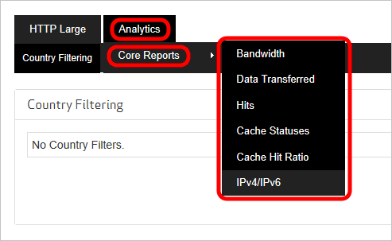

<properties
    pageTitle="Analizzare i modelli di utilizzo di Azure CDN | Microsoft Azure"
    description="È possibile visualizzare i modelli di utilizzo per la rete CDN utilizzando i report seguenti: della larghezza di banda, trasferire i dati, accessi, stati Cache, frequenza di accesso alla Cache, IPV4/IPV6 dati trasferiti."
    services="cdn"
    documentationCenter=""
    authors="camsoper"
    manager="erikre"
    editor=""/>

<tags
    ms.service="cdn"
    ms.workload="tbd"
    ms.tgt_pltfrm="na"
    ms.devlang="na"
    ms.topic="article"
    ms.date="07/28/2016"
    ms.author="casoper"/>

# Analizzare i modelli di utilizzo di rete CDN di Azure

[AZURE.INCLUDE [cdn-verizon-only](../../includes/cdn-verizon-only.md)]

È possibile visualizzare i modelli di utilizzo per la rete CDN utilizzando i report seguenti:

- Larghezza di banda
- Dati trasferiti
- Visite
- Stati cache
- Rapporto accessi alla cache
- Dati IPv4/IPV6 trasferiti

## Accesso ai report HTTP avanzate

1. Scegliere il pulsante **Gestisci** e il profilo CDN.

    

    Portale di gestione di rete CDN apre.

2. Al passaggio del mouse sulla scheda **Analitica** , quindi al passaggio del mouse sopra il riquadro a comparsa **Report principali** .  Fare clic sul report desiderato nel menu di scelta.

    

## Larghezza di banda

Report della larghezza di banda è costituito da una tabella di dati e di grafico che indica l'utilizzo della larghezza di banda per HTTP e HTTPS in un periodo di tempo specifico. È possibile visualizzare l'utilizzo della larghezza di banda tra tutti i POP CDN o un particolare POP. In questo modo è possibile visualizzare il traffico picchi e distribuzione tra CDN estrae in Mbps.

- Selezionare tutti i nodi di bordo per vedere il traffico da tutti i nodi o scegliere un paese/nodo specifico nell'elenco a discesa.
- Selezionare l'intervallo di Date per visualizzare dati per oggi/questa settimana/mese e così via o immettere le date personalizzate, quindi fare clic su "OK" per assicurarsi che la selezione viene aggiornata.
- È possibile esportare e scaricare i dati facendo clic sull'icona di foglio di excel che si trova accanto a "Vai".

Il report viene aggiornato ogni 5 minuti.

## Dati trasferiti

Questo report è costituito da una tabella di dati e di grafico che indica l'utilizzo di traffico per HTTP e HTTPS in un periodo di tempo specifico. È possibile visualizzare l'utilizzo di traffico attraverso tutti i POP CDN o un particolare POP. In questo modo è possibile visualizzare il traffico picchi e distribuzione tra CDN estrae in GB.

- Selezionare tutti i nodi di bordo per vedere il traffico da tutte le note o scegliere un paese/nodo specifico nell'elenco a discesa.
- Selezionare l'intervallo di Date per visualizzare dati per oggi/questa settimana/mese e così via o immettere le date personalizzate, quindi fare clic su "OK" per assicurarsi che la selezione viene aggiornata.
- È possibile esportare e scaricare i dati facendo clic sull'icona di foglio di excel che si trova accanto a "Vai".

Il report viene aggiornato ogni 5 minuti.

## Visite (codici di stato)

Il report viene descritta la distribuzione dei codici di stato richiesta per il contenuto. Ogni richiesta per il contenuto verrà generato un codice di stato HTTP. Il codice di stato descrive come bordo POP gestito la richiesta. Ad esempio, i codici di stato 2xx indicano che la richiesta è stata inviata correttamente a un client, mentre un codice di stato 4xx indica che si è verificato un errore. Per ulteriori informazioni su codice di stato HTTP, vedere [codici di stato](https://en.wikipedia.org/wiki/List_of_HTTP_status_codes).

- Selezionare l'intervallo di Date per visualizzare dati per oggi/questa settimana/mese e così via o immettere le date personalizzate, quindi fare clic su "OK" per assicurarsi che la selezione viene aggiornata.
- È possibile esportare e scaricare i dati facendo clic sul foglio di excel che si trova accanto a "Vai".

## Stati cache

Il report viene descritta la distribuzione di accessi e non riusciti della cache alla richiesta del client. Poiché le prestazioni migliori provengono da accessi, è possibile ottimizzare velocità di recapito dei dati, la riduzione a icona errori cache e accessi scaduto. Errori cache possono risultare ridotte mediante la configurazione del server di origine per evitare di assegnare intestazioni di risposta "no-cache", evitando la memorizzazione nella cache stringa di query ad eccezione di in cui è strettamente necessaria, evitando codici di risposta tali. Della cache scaduti effettuando una risorsa è possono evitare accessi 's max-age più a lungo possibile per ridurre al minimo il numero di richieste al server di origine.

### Gli stati di cache principali includono:

- TCP_HIT: Served dal bordo. L'oggetto è stata nella cache e non ha superato la durata massima.
- TCP_MISS: Served dall'origine. L'oggetto non nella cache e la risposta non torna all'origine.
- TCP_EXPIRED _MISS: Served dall'origine dopo rinnovo con origine. L'oggetto è stata nella cache ma ha superato la durata massima. Rinnovo con origine condotto alla visualizzazione dell'oggetto cache sostituita da una nuova risposta dall'origine.
- TCP_EXPIRED _HIT: Served dal bordo dopo rinnovo con origine. L'oggetto è stata nella cache ma ha superato la durata massima. Rinnovo con il server di origine condotto alla visualizzazione dell'oggetto cache non viene modificato.

- Selezionare l'intervallo di Date per visualizzare dati per oggi/questa settimana/mese e così via o immettere le date personalizzate, quindi fare clic su "OK" per assicurarsi che la selezione viene aggiornata.
- È possibile esportare e scaricare i dati facendo clic sull'icona di foglio di excel che si trova accanto a "Vai".

### Elenco completo degli stati cache

- TCP_HIT - questo stato viene indicato quando una richiesta viene fornita direttamente dal POP al client. Una risorsa sia served immediatamente da POP quando è memorizzato su POP vicino al client e che contiene un valore valido time to live o TTL. TTL è determinato dalle intestazioni di risposta seguenti:

    - Controllo della cache: s-maxage
    - Controllo della cache: max-age
    - Scadenza

- TCP_MISS - questo stato indica che una versione memorizzati nella cache del bene richiesta non è stata trovata nel POP vicino al client. Verrà richiesta la risorsa da un server di origine o un server di origine dello schermo. Se il server di origine o il server di origine icona restituisce una risorsa, verranno fornita al client e cache sul client e server perimetrale. In caso contrario, un codice di stato non 200 (ad esempio 403 accesso negato, 404 non viene trovato, ecc) verrà restituito.

- _HIT TCP_EXPIRED - questo stato viene indicato quando una richiesta di destinazione di un bene con un valore di TTL scaduto, ad esempio quando max-age del bene è scaduto, è stata fornita direttamente dal POP al client.

    Una richiesta di scaduto in genere restituisce come risultato una richiesta di rinnovo al server di origine. Affinché un _HIT TCP_EXPIRED venga eseguita, il server di origine deve indicare che non esiste una versione più recente del bene. Questo tipo di situazione aggiornerà in genere le intestazioni di scadenza e il controllo della Cache di tale attività.

- _MISS TCP_EXPIRED - questo stato viene indicato quando una versione più recente di un bene memorizzati nella cache scaduto sia served dalla POP al client. Si verifica quando il valore TTL per una risorsa memorizzati nella cache è scaduto (ad esempio, scaduto max-age) e il server di origine restituisce una versione più recente di tale attività. La nuova versione del bene verrà servita al client invece della versione memorizzati nella cache. Inoltre, nella cache del server perimetrale e il client.

- CONFIG_NOCACHE - questo stato indica che una configurazione specifica per un cliente sul nostro bordo POP impedito il bene memorizzata nella cache.

- Nessuno - questo stato indica che non è stata eseguita una verifica del contenuto validità della cache.

- _MISS TCP_ CLIENT_REFRESH - questo stato viene indicato quando un client HTTP (ad esempio, browser) impone un bordo POP per recuperare una nuova versione di un bene non aggiornato dal server di origine.

    Per impostazione predefinita, i server impediscono un client HTTP forzare il nostro server perimetrali per recuperare una nuova versione del bene dal server di origine.

- PARTIAL_HIT TCP_ - questo stato viene indicato quando una richiesta di intervallo byte i risultati in un punto di una risorsa parzialmente memorizzati nella cache. L'intervallo di byte richiesto immediatamente viene fornito da POP al client.

- UNCACHEABLE - viene segnalato questo stato quando le intestazioni di controllo della Cache e di scadenza di una risorsa indicano che consigliabile non verrà memorizzata un POP o dal client HTTP. Questi tipi di richieste vengono gestiti dal server di origine

## Rapporto accessi alla cache

Segnalare la percentuale di richieste memorizzate nella cache inviata direttamente dalla cache.

Il report fornisce le informazioni seguenti:

- Il contenuto richiesto è stato cache nella finestra di più vicina al richiedente.
- La convocazione è stata fornita direttamente dal bordo della rete.
- La richiesta non richiedono rinnovo con il server di origine.

Il report non include:

- Richieste rifiutate a causa di paese opzioni di filtro.
- Richieste di risorse cui intestazioni indicano che è consigliabile non verrà memorizzate. Ad esempio di controllo della Cache: privato, il controllo della Cache: no-cache o Pragma: intestazioni cache non impedirà un bene memorizzata nella cache.
- Richieste di intervallo byte per il contenuto parzialmente memorizzati nella cache.

La formula è: (accesso TCP_ / (accesso TCP_ + TCP_MISS)) * 100

- Selezionare l'intervallo di Date per visualizzare dati per oggi/questa settimana/mese e così via o immettere le date personalizzate, quindi fare clic su "OK" per assicurarsi che la selezione viene aggiornata.
- È possibile esportare e scaricare i dati facendo clic sull'icona di foglio di excel che si trova accanto a "Vai".

## Dati IPv4/IPV6 trasferiti

Questo report mostra la distribuzione di utilizzo il traffico in Visual Studio IPV4 IPV6.

- Selezionare l'intervallo di Date per visualizzare dati per oggi/questa settimana/mese e così via o immettere le date personalizzate.
- Scegliere "Vai" per assicurarsi che la selezione viene aggiornata.

## Considerazioni

Report possono essere generati solo negli ultimi 18 mesi.
