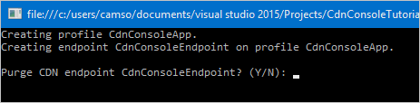
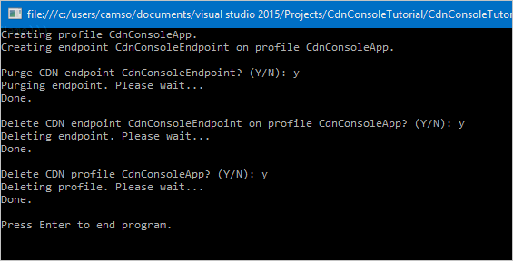

<properties
    pageTitle="Iniziare con la raccolta di CDN Azure per .NET | Microsoft Azure"
    description="Informazioni su come scrivere applicazioni .NET per gestire CDN Azure utilizzando Visual Studio."
    services="cdn"
    documentationCenter=".net"
    authors="camsoper"
    manager="erikre"
    editor=""/>

<tags
    ms.service="cdn"
    ms.workload="tbd"
    ms.tgt_pltfrm="na"
    ms.devlang="na"
    ms.topic="article"
    ms.date="09/15/2016"
    ms.author="casoper"/>

# <a name="get-started-with-azure-cdn-development"></a>Introduzione allo sviluppo CDN Azure

> [AZURE.SELECTOR]
- [Node](cdn-app-dev-node.md)
- [.NET](cdn-app-dev-net.md)

È possibile utilizzare la [Libreria di rete CDN di Azure per .NET](https://msdn.microsoft.com/library/mt657769.aspx) per automatizzare la creazione e gestione dei profili CDN e i punti finali.  In questa esercitazione tramite la creazione di una semplice applicazione console .NET che illustri diverse operazioni disponibili.  In questa esercitazione non è destinata per descrivere tutti gli aspetti della libreria di rete CDN di Azure per .NET in dettaglio.

È necessario Visual Studio 2015 per completare questa esercitazione.  [Visual Studio Community 2015](https://www.visualstudio.com/products/visual-studio-community-vs.aspx) è disponibile gratuitamente per il download.

> [AZURE.TIP] [Completamento progetto da questa esercitazione](https://code.msdn.microsoft.com/Azure-CDN-Management-1f2fba2c) è disponibile per il download su MSDN.

[AZURE.INCLUDE [cdn-app-dev-prep](../../includes/cdn-app-dev-prep.md)]

## <a name="create-your-project-and-add-nuget-packages"></a>Creare un progetto e aggiungere pacchetti Nuget

Ora che abbiamo creato un gruppo di risorse per i profili di rete CDN e autorizzati nostro applicazione Azure Active Directory per gestire i profili di rete CDN e i punti finali all'interno del gruppo, è possibile iniziare a creare l'applicazione.

All'interno di Visual Studio 2015, fare clic su **File**, **Nuovo** **progetto...** per aprire la finestra di dialogo Nuovo progetto.  Espandere **Visual c#**, quindi selezionare **Windows** nel riquadro a sinistra.  Fare clic su **Applicazione Console** nel riquadro centrale.  Assegnare un nome del progetto, quindi fare clic su **OK**.  


Il progetto che verrà utilizzata alcune librerie Azure contenuti nei pacchetti Nuget.  È possibile aggiungere quelli al progetto.

1. Fare clic sul menu **Strumenti** , **Nuget Package Manager**, quindi **Console di gestione pacchetti**.

    

2. Nella Console di gestione pacchetti, eseguire il comando seguente per installare **Active Directory autenticazione raccolta (ADAL)**:

    `Install-Package Microsoft.IdentityModel.Clients.ActiveDirectory`

3. Eseguire la procedura seguente per installare la **Raccolta gestione CDN Azure**:

    `Install-Package Microsoft.Azure.Management.Cdn`

## <a name="directives-constants-main-method-and-helper-methods"></a>Direttive, costanti, metodo principale e i metodi di supporto

Vediamo come configurare la struttura di base del nostro programma scritto.

1. Tornare nella scheda Program.cs sostituire il `using` direttive nella parte superiore con le operazioni seguenti:

    ```csharp
    using System;
    using System.Collections.Generic;
    using Microsoft.Azure.Management.Cdn;
    using Microsoft.Azure.Management.Cdn.Models;
    using Microsoft.Azure.Management.Resources;
    using Microsoft.Azure.Management.Resources.Models;
    using Microsoft.IdentityModel.Clients.ActiveDirectory;
    using Microsoft.Rest;
    ```

2. È necessario definire alcune costanti che utilizzeranno i metodi.  Nel `Program` per la classe, ma prima che il `Main` metodo, aggiungere quanto segue.  Assicurarsi di sostituire i segnaposto, tra cui la ** &lt;angolari&gt;**, con i valori in base alle esigenze.

    ```csharp
    //Tenant app constants
    private const string clientID = "<YOUR CLIENT ID>";
    private const string clientSecret = "<YOUR CLIENT AUTHENTICATION KEY>"; //Only for service principals
    private const string authority = "https://login.microsoftonline.com/<YOUR TENANT ID>/<YOUR TENANT DOMAIN NAME>";

    //Application constants
    private const string subscriptionId = "<YOUR SUBSCRIPTION ID>";
    private const string profileName = "CdnConsoleApp";
    private const string endpointName = "<A UNIQUE NAME FOR YOUR CDN ENDPOINT>";
    private const string resourceGroupName = "CdnConsoleTutorial";
    private const string resourceLocation = "<YOUR PREFERRED AZURE LOCATION, SUCH AS Central US>";
    ```

3. Anche a livello di classe, definire queste due variabili.  Si userà questi in un secondo momento per determinare se il profilo ed endpoint già esistente.

    ```csharp
    static bool profileAlreadyExists = false;
    static bool endpointAlreadyExists = false;
    ```

4.  Sostituire il `Main` metodo come descritto di seguito:

    ```csharp
    static void Main(string[] args)
    {
        //Get a token
        AuthenticationResult authResult = GetAccessToken();

        // Create CDN client
        CdnManagementClient cdn = new CdnManagementClient(new TokenCredentials(authResult.AccessToken))
            { SubscriptionId = subscriptionId };

        ListProfilesAndEndpoints(cdn);

        // Create CDN Profile
        CreateCdnProfile(cdn);

        // Create CDN Endpoint
        CreateCdnEndpoint(cdn);
        
        Console.WriteLine();

        // Purge CDN Endpoint
        PromptPurgeCdnEndpoint(cdn);

        // Delete CDN Endpoint
        PromptDeleteCdnEndpoint(cdn);

        // Delete CDN Profile
        PromptDeleteCdnProfile(cdn);

        Console.WriteLine("Press Enter to end program.");
        Console.ReadLine();
    }
    ```

5. Alcuni altri metodi di nostro sta per richiedere all'utente con domande "Sì/No".  Aggiungere il metodo seguente per assicurarsi che un po' più semplice:

    ```csharp
    private static bool PromptUser(string Question)
    {
        Console.Write(Question + " (Y/N): ");
        var response = Console.ReadKey();
        Console.WriteLine();
        if (response.Key == ConsoleKey.Y)
        {
            return true;
        }
        else if (response.Key == ConsoleKey.N)
        {
            return false;
        }
        else
        {
            // They pressed something other than Y or N.  Let's ask them again.
            return PromptUser(Question);
        }
    }
    ```

Ora che la struttura di base del programma è scritto, bisogna creiamo metodi chiamati dalla `Main` metodo.

## <a name="authentication"></a>Autenticazione

È possibile utilizzare la raccolta gestione CDN di Azure, è necessario eseguire l'autenticazione il nostro principale del servizio e ottenere un token di autenticazione.  Questo metodo utilizza ADAL per recuperare il token.

```csharp
private static AuthenticationResult GetAccessToken()
{
    AuthenticationContext authContext = new AuthenticationContext(authority); 
    ClientCredential credential = new ClientCredential(clientID, clientSecret);
    AuthenticationResult authResult = 
        authContext.AcquireTokenAsync("https://management.core.windows.net/", credential).Result;

    return authResult;
}
```

Se si utilizza l'autenticazione utente, la `GetAccessToken` metodo avrà un aspetto leggermente diverso.

>[AZURE.IMPORTANT] Utilizzare solo in questo esempio se si sceglie l'autenticazione utente anziché un servizio principale.

```csharp
private static AuthenticationResult GetAccessToken()
{
    AuthenticationContext authContext = new AuthenticationContext(authority);
    AuthenticationResult authResult = authContext.AcquireTokenAsync("https://management.core.windows.net/",
        clientID, new Uri("http://<redirect URI>"), new PlatformParameters(PromptBehavior.RefreshSession)).Result;

    return authResult;
}
```

Assicurarsi di sostituire `<redirect URI>` con il reindirizzamento URI è stata immessa al momento della registrazione dell'applicazione in Azure Active Directory.

## <a name="list-cdn-profiles-and-endpoints"></a>Elenco CDN profili e i punti finali

Ora si è pronti per eseguire operazioni di rete CDN.  La prima cosa il metodo elenco tutti i profili e i punti finali nel gruppo risorse e se viene trovata una corrispondenza per il profilo ed endpoint specificati nelle costanti rende annotare che per usarle in seguito in modo che non si eseguono tentativi creare i duplicati.

```csharp
private static void ListProfilesAndEndpoints(CdnManagementClient cdn)
{
    // List all the CDN profiles in this resource group
    var profileList = cdn.Profiles.ListByResourceGroup(resourceGroupName);
    foreach (Profile p in profileList)
    {
        Console.WriteLine("CDN profile {0}", p.Name);
        if (p.Name.Equals(profileName, StringComparison.OrdinalIgnoreCase))
        {
            // Hey, that's the name of the CDN profile we want to create!
            profileAlreadyExists = true;
        }

        //List all the CDN endpoints on this CDN profile
        Console.WriteLine("Endpoints:");
        var endpointList = cdn.Endpoints.ListByProfile(p.Name, resourceGroupName);
        foreach (Endpoint e in endpointList)
        {
            Console.WriteLine("-{0} ({1})", e.Name, e.HostName);
            if (e.Name.Equals(endpointName, StringComparison.OrdinalIgnoreCase))
            {
                // The unique endpoint name already exists.
                endpointAlreadyExists = true;
            }
        }
        Console.WriteLine();
    }
}
```

## <a name="create-cdn-profiles-and-endpoints"></a>Creare i punti finali e CDN profili

Successivamente, è necessario creare un profilo.

```csharp
private static void CreateCdnProfile(CdnManagementClient cdn)
{
    if (profileAlreadyExists)
    {
        Console.WriteLine("Profile {0} already exists.", profileName);
    }
    else
    {
        Console.WriteLine("Creating profile {0}.", profileName);
        ProfileCreateParameters profileParms =
            new ProfileCreateParameters() { Location = resourceLocation, Sku = new Sku(SkuName.StandardVerizon) };
        cdn.Profiles.Create(profileName, profileParms, resourceGroupName);
    }
}
```

Dopo aver creato il profilo, è necessario creare un endpoint.

```csharp
private static void CreateCdnEndpoint(CdnManagementClient cdn)
{
    if (endpointAlreadyExists)
    {
        Console.WriteLine("Profile {0} already exists.", profileName);
    }
    else
    {
        Console.WriteLine("Creating endpoint {0} on profile {1}.", endpointName, profileName);
        EndpointCreateParameters endpointParms =
            new EndpointCreateParameters()
            {
                Origins = new List<DeepCreatedOrigin>() { new DeepCreatedOrigin("Contoso", "www.contoso.com") },
                IsHttpAllowed = true,
                IsHttpsAllowed = true,
                Location = resourceLocation
            };
        cdn.Endpoints.Create(endpointName, endpointParms, profileName, resourceGroupName);
    }
}
```

>[AZURE.NOTE] L'esempio precedente assegna l'endpoint di un'origine denominata *Contoso* con un nome host `www.contoso.com`.  È necessario modificare in modo che punti a hostname propri origine.

## <a name="purge-an-endpoint"></a>Eliminare un estremo

Presupponendo che l'endpoint è stata creata, attività comuni che potrebbe essere necessario eseguire il programma è eliminazione del contenuto nostro endpoint.

```csharp
private static void PromptPurgeCdnEndpoint(CdnManagementClient cdn)
{
    if (PromptUser(String.Format("Purge CDN endpoint {0}?", endpointName)))
    {
        Console.WriteLine("Purging endpoint. Please wait...");
        cdn.Endpoints.PurgeContent(endpointName, profileName, resourceGroupName, new List<string>() { "/*" });
        Console.WriteLine("Done.");
        Console.WriteLine();
    }
}
```

>[AZURE.NOTE] Nell'esempio precedente, la stringa `/*` indica che desidera eliminare tutti gli elementi nella radice del percorso endpoint.  Si tratta consente di **Eliminare tutti** nella finestra di dialogo "eliminazione" del portale Azure. Nel `CreateCdnProfile` metodo, creato il profilo come profilo **CDN Azure da Verizon** utilizzando il codice `Sku = new Sku(SkuName.StandardVerizon)`, in modo che sia corretta.  Tuttavia, i profili di **Azure CDN da Akamai** non supportano **Eliminare tutti**se all'utilizzo di un profilo Akamai per questa esercitazione, è necessario includere percorsi specifici per rimuovere definitivamente.

## <a name="delete-cdn-profiles-and-endpoints"></a>Eliminare i punti finali e CDN profili

Gli ultimi metodi eliminerà il nostro endpoint e il profilo.

```csharp
private static void PromptDeleteCdnEndpoint(CdnManagementClient cdn)
{
    if(PromptUser(String.Format("Delete CDN endpoint {0} on profile {1}?", endpointName, profileName)))
    {
        Console.WriteLine("Deleting endpoint. Please wait...");
        cdn.Endpoints.DeleteIfExists(endpointName, profileName, resourceGroupName);
        Console.WriteLine("Done.");
        Console.WriteLine();
    }
}

private static void PromptDeleteCdnProfile(CdnManagementClient cdn)
{
    if(PromptUser(String.Format("Delete CDN profile {0}?", profileName)))
    {
        Console.WriteLine("Deleting profile. Please wait...");
        cdn.Profiles.DeleteIfExists(profileName, resourceGroupName);
        Console.WriteLine("Done.");
        Console.WriteLine();
    }
}
```

## <a name="running-the-program"></a>Eseguire il programma

A questo punto possiamo compilare ed eseguire il programma facendo clic sul pulsante **Start** in Visual Studio.



Quando viene raggiunta la richiesta sopra, dovrebbe essere possibile tornare al gruppo di risorse nel portale di Azure e che sia stato creato il profilo.


È quindi possibile verificare le istruzioni per eseguire il resto del programma.



## <a name="next-steps"></a>Passaggi successivi

Per visualizzare il progetto completato questa procedura dettagliata, [scaricare l'esempio](https://code.msdn.microsoft.com/Azure-CDN-Management-1f2fba2c).

Per trovare la documentazione aggiuntiva nella libreria di gestione di Azure CDN per .NET, consente di visualizzare la [Guida di riferimento su MSDN](https://msdn.microsoft.com/library/mt657769.aspx).

Gestire le risorse CDN con [PowerShell](./cdn-manage-powershell.md).


