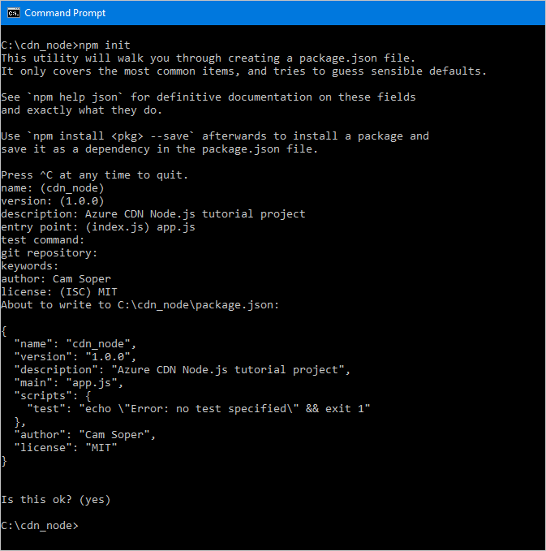
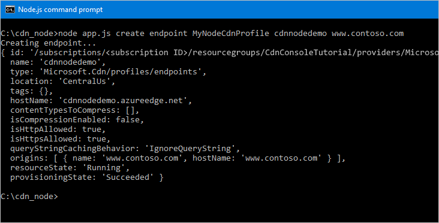

<properties
    pageTitle="Guida introduttiva a Azure CDN SDK per Node | Microsoft Azure"
    description="Informazioni su come scrivere applicazioni node per gestire CDN Azure."
    services="cdn"
    documentationCenter="nodejs"
    authors="camsoper"
    manager="erikre"
    editor=""/>

<tags
    ms.service="cdn"
    ms.workload="tbd"
    ms.tgt_pltfrm="na"
    ms.devlang="na"
    ms.topic="article"
    ms.date="09/15/2016"
    ms.author="casoper"/>

# <a name="get-started-with-azure-cdn-development"></a>Introduzione allo sviluppo CDN Azure

> [AZURE.SELECTOR]
- [Node](cdn-app-dev-node.md)
- [.NET](cdn-app-dev-net.md)

È possibile utilizzare [Azure CDN SDK per Node](https://www.npmjs.com/package/azure-arm-cdn) per automatizzare la creazione e gestione dei profili CDN e i punti finali.  In questa esercitazione tramite la creazione di un'applicazione di console Node semplice che seguente vengono illustrate diverse operazioni disponibili.  In questa esercitazione non è destinata per descrivere tutti gli aspetti Azure CDN SDK per Node in dettaglio.

Per completare questa esercitazione, è necessario già [Node](http://www.nodejs.org) **4.x.x** o superiore installato e configurato.  È possibile utilizzare qualsiasi editor di testo che si desidera creare l'applicazione Node.  Per scrivere questa esercitazione, è stata utilizzata [Codice Visual Studio](https://code.visualstudio.com).  

> [AZURE.TIP] [Completamento progetto da questa esercitazione](https://code.msdn.microsoft.com/Azure-CDN-SDK-for-Nodejs-c712bc74) è disponibile per il download su MSDN.

[AZURE.INCLUDE [cdn-app-dev-prep](../../includes/cdn-app-dev-prep.md)]

## <a name="create-your-project-and-add-npm-dependencies"></a>Creare un progetto e aggiungere le dipendenze NPM

Ora che abbiamo creato un gruppo di risorse per i profili di rete CDN e autorizzati nostro applicazione Azure Active Directory per gestire i profili di rete CDN e i punti finali all'interno del gruppo, è possibile iniziare a creare l'applicazione.

Creare una cartella in cui memorizzare l'applicazione.  Dalla console di con gli strumenti di Node nel percorso corrente, impostare la posizione corrente per la nuova cartella e inizializzare il progetto eseguendo:
    
    npm init
    
Viene quindi visualizzata una serie di domande inizializzare il progetto.  Per **punto di ingresso**, in questa esercitazione utilizza *app.js*.  È possibile visualizzare le altre opzioni nell'esempio seguente.



Il progetto è ora abilitato con un file *packages.json* .  Il progetto che verrà utilizzata alcune librerie Azure contenuti nei pacchetti NPM.  Si userà il Runtime del Client di Azure node (ms-resto-azure) e la libreria di Azure CDN Client per node (cd di arm azure).  È possibile aggiungere quelli al progetto come dipendenze.
 
    npm install --save ms-rest-azure
    npm install --save azure-arm-cdn

Dopo i pacchetti vengono eseguiti l'installazione, *package.json* file dovrebbe essere simile a questo esempio (versione numeri possono variare):

``` json
{
  "name": "cdn_node",
  "version": "1.0.0",
  "description": "Azure CDN Node.js tutorial project",
  "main": "app.js",
  "scripts": {
    "test": "echo \"Error: no test specified\" && exit 1"
  },
  "author": "Cam Soper",
  "license": "MIT",
  "dependencies": {
    "azure-arm-cdn": "^0.2.1",
    "ms-rest-azure": "^1.14.4"
  }
}
```

Infine, utilizzando l'editor di testo, creare un file di testo vuota e salvarla nella cartella radice della cartella progetto come *app.js*.  A questo punto si è pronti per iniziare a scrivere codice.

## <a name="requires-constants-authentication-and-structure"></a>Richiede, costanti, l'autenticazione e struttura

Con *app.js* aperto nel nostro editor, vediamo come configurare la struttura di base del nostro programma scritto.

1. Aggiungere la "richiede" per i pacchetti NPM nella parte superiore con le operazioni seguenti:

    ``` javascript
    var msRestAzure = require('ms-rest-azure');
    var cdnManagementClient = require('azure-arm-cdn');
    ```

2. È necessario definire alcune costanti che utilizzeranno i metodi.  Aggiungere quanto segue.  Assicurarsi di sostituire i segnaposto, tra cui la ** &lt;angolari&gt;**, con i valori in base alle esigenze.

    ``` javascript
    //Tenant app constants
    const clientId = "<YOUR CLIENT ID>";
    const clientSecret = "<YOUR CLIENT AUTHENTICATION KEY>"; //Only for service principals
    const tenantId = "<YOUR TENANT ID>";

    //Application constants
    const subscriptionId = "<YOUR SUBSCRIPTION ID>";
    const resourceGroupName = "CdnConsoleTutorial";
    const resourceLocation = "<YOUR PREFERRED AZURE LOCATION, SUCH AS Central US>";
    ```

3. Abbiamo verrà successivamente, creare un'istanza del client di gestione CDN e assegnarle il nostro credenziali.

    ``` javascript
    var credentials = new msRestAzure.ApplicationTokenCredentials(clientId, tenantId, clientSecret);
    var cdnClient = new cdnManagementClient(credentials, subscriptionId);
    ```
    
    Se si utilizza l'autenticazione di singoli utenti, questi due righe avrà un aspetto leggermente diverse.

    >[AZURE.IMPORTANT] Utilizzare solo in questo esempio se si sceglie l'autenticazione utente anziché un servizio principale.  Prestare attenzione a proteggere le credenziali utente e tenerle in segreta.

    ``` javascript
    var credentials = new msRestAzure.UserTokenCredentials(clientId, 
        tenantId, '<username>', '<password>', '<redirect URI>');
    var cdnClient = new cdnManagementClient(credentials, subscriptionId);
    ```

    Assicurarsi di sostituire le voci di ** &lt;angolari&gt; ** con le informazioni corrette.  Per `<redirect URI>`, utilizzare il reindirizzamento URI è stata immessa al momento della registrazione dell'applicazione in Azure Active Directory.
    

4.  L'applicazione di console Node diventeranno alcuni parametri della riga di comando.  Di seguito convalidare che almeno un parametro passato.

    ```javascript
    //Collect command-line parameters
    var parms = process.argv.slice(2);

    //Do we have parameters?
    if(parms == null || parms.length == 0)
    {
        console.log("Not enough parameters!");
        console.log("Valid commands are list, delete, create, and purge.");
        process.exit(1);
    }
    ```

5. Questo ci riporta alla parte principale del programma, in cui passiamo ad altre funzioni in base a quali parametri passati.

    ```javascript
    switch(parms[0].toLowerCase())
    {
        case "list":
            cdnList();
            break;

        case "create":
            cdnCreate();
            break;
        
        case "delete":
            cdnDelete();
            break;

        case "purge":
            cdnPurge();
            break;

        default:
            console.log("Valid commands are list, delete, create, and purge.");
            process.exit(1);
    }
    ```

6.  In luoghi diversi nostro programma, è necessario assicurarsi che il numero di parametri passato e Visualizza aiuto se soddisfino non corretti.  Creare le funzioni per eseguire questa operazione.

    ```javascript
    function requireParms(parmCount) {
        if(parms.length < parmCount) {
            usageHelp(parms[0].toLowerCase());
            process.exit(1);
        }
    }

    function usageHelp(cmd) {
        console.log("Usage for " + cmd + ":");
        switch(cmd)
        {
            case "list":
                console.log("list profiles");
                console.log("list endpoints <profile name>");
                break;

            case "create":
                console.log("create profile <profile name>");
                console.log("create endpoint <profile name> <endpoint name> <origin hostname>");
                break;
            
            case "delete":
                console.log("delete profile <profile name>");
                console.log("delete endpoint <profile name> <endpoint name>");
                break;

            case "purge":
                console.log("purge <profile name> <endpoint name> <path>");
                break;

            default:
                console.log("Invalid command.");
        }
    }
    ```

7. Infine, le funzioni che verrà usato nel client di gestione CDN sono asincrone, pertanto è necessario un metodo da chiamare quando completati.  Questo punto, eseguire uno che consente di visualizzare l'output dal client di gestione di rete CDN (se presente) e uscire dall'applicazione normalmente.

    ```javascript
    function callback(err, result, request, response) {
        if (err) {
            console.log(err);
            process.exit(1);
        } else {
            console.log((result == null) ? "Done!" : result);
            process.exit(0);
        }
    }
    ```

La struttura di base del programma è scritta, è bisogna creare le funzioni base invitate i parametri.

## <a name="list-cdn-profiles-and-endpoints"></a>Elenco CDN profili e i punti finali

Iniziamo con codice per elencare i profili esistenti e i punti finali.  I commenti di codice forniscono la sintassi prevista in modo da sapere in cui verrà collocata ogni parametro.

```javascript
// list profiles
// list endpoints <profile name>
function cdnList(){
    requireParms(2);
    switch(parms[1].toLowerCase())
    {
        case "profiles":
            console.log("Listing profiles...");
            cdnClient.profiles.listByResourceGroup(resourceGroupName, callback);
            break;

        case "endpoints":
            requireParms(3);
            console.log("Listing endpoints...");
            cdnClient.endpoints.listByProfile(parms[2], resourceGroupName, callback);
            break;

        default:
            console.log("Invalid parameter.");
            process.exit(1);
    }
}
```

## <a name="create-cdn-profiles-and-endpoints"></a>Creare i punti finali e CDN profili

Quindi, in cui verranno scritti le funzioni per creare i profili e i punti finali.

```javascript
function cdnCreate() {
    requireParms(2);
    switch(parms[1].toLowerCase())
    {
        case "profile":
            cdnCreateProfile();
            break;

        case "endpoint":
            cdnCreateEndpoint();
            break;

        default:
            console.log("Invalid parameter.");
            process.exit(1);
    }
}

// create profile <profile name>
function cdnCreateProfile() {
    requireParms(3);
    console.log("Creating profile...");
    var standardCreateParameters = {
        location: resourceLocation,
        sku: {
            name: 'Standard_Verizon'
        }
    };

    cdnClient.profiles.create(parms[2], standardCreateParameters, resourceGroupName, callback);
}

// create endpoint <profile name> <endpoint name> <origin hostname>        
function cdnCreateEndpoint() {
    requireParms(5);
    console.log("Creating endpoint...");
    var endpointProperties = {
        location: resourceLocation,
        origins: [{
            name: parms[4],
            hostName: parms[4]
        }]
    };

    cdnClient.endpoints.create(parms[3], endpointProperties, parms[2], resourceGroupName, callback);
}
```

## <a name="purge-an-endpoint"></a>Eliminare un estremo

Supponendo che è stato creato il punto finale, attività comuni che potrebbe essere necessario eseguire il programma è eliminazione contenuto in nostro endpoint.

```javascript
// purge <profile name> <endpoint name> <path>
function cdnPurge() {
    requireParms(4);
    console.log("Purging endpoint...");
    var purgeContentPaths = [ parms[3] ];
    cdnClient.endpoints.purgeContent(parms[2], parms[1], resourceGroupName, purgeContentPaths, callback);
}
```

## <a name="delete-cdn-profiles-and-endpoints"></a>Eliminare i punti finali e CDN profili

L'ultima funzione che verrà inclusa Elimina profili e i punti finali.

```javascript
function cdnDelete() {
    requireParms(2);
    switch(parms[1].toLowerCase())
    {
        // delete profile <profile name>
        case "profile":
            requireParms(3);
            console.log("Deleting profile...");
            cdnClient.profiles.deleteIfExists(parms[2], resourceGroupName, callback);
            break;

        // delete endpoint <profile name> <endpoint name>
        case "endpoint":
            requireParms(4);
            console.log("Deleting endpoint...");
            cdnClient.endpoints.deleteIfExists(parms[3], parms[2], resourceGroupName, callback);
            break;

        default:
            console.log("Invalid parameter.");
            process.exit(1);
    }
}
```

## <a name="running-the-program"></a>Eseguire il programma

Possiamo ora eseguiamo il nostro programma Node tramite il nostro debugger Preferiti o alla console.

> [AZURE.TIP] Se si sta utilizzando Visual Studio codice come debug, è necessario configurare l'ambiente per passare i parametri della riga di comando.  Codice di Visual Studio responsabile nel file **lanuch.json** .  Cercare una proprietà denominata **argomenti** e aggiungere una matrice di valori stringa per i parametri in modo da riferisca simile alla seguente: `"args": ["list", "profiles"]`.

Iniziare l'esercitazione elencando i profili.


Abbiamo ottenuto una stringa vuota.  Poiché è non esiste alcun profilo nel gruppo risorse, che è previsto.  Creare un profilo a questo punto.


A questo punto, aggiungere un endpoint.



Infine, eliminare il profilo.


## <a name="next-steps"></a>Passaggi successivi

Per visualizzare il progetto completato questa procedura dettagliata, [scaricare l'esempio](https://code.msdn.microsoft.com/Azure-CDN-SDK-for-Nodejs-c712bc74).

Per visualizzare la Guida di riferimento per la rete CDN di Azure SDK Node, visualizzare il [riferimento](http://azure.github.io/azure-sdk-for-node/azure-arm-cdn/latest/).

Per trovare documentazione aggiuntiva su Azure SDK Node, visualizzare il [riferimento completo](http://azure.github.io/azure-sdk-for-node/).

Gestire le risorse CDN con [PowerShell](./cdn-manage-powershell.md).

