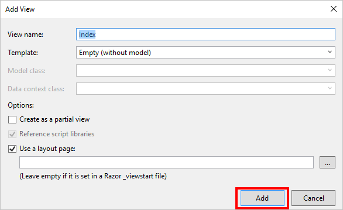

<properties
    pageTitle="Integrare un servizio cloud con Azure CDN | Microsoft Azure"
    description="Un'esercitazione che illustra come distribuire un servizio cloud che viene utilizzato il contenuto di un estremo Azure CDN integrato"
    services="cdn, cloud-services"
    documentationCenter=".net"
    authors="camsoper"
    manager="erikre"
    editor="tysonn"/>

<tags
    ms.service="cdn"
    ms.workload="tbd"
    ms.tgt_pltfrm="na"
    ms.devlang="dotnet"
    ms.topic="article"
    ms.date="07/28/2016"
    ms.author="casoper"/>

# Integrare un servizio cloud con Azure CDN

Un servizio cloud può essere integrato con CDN Azure, che servono qualsiasi contenuto dalla posizione del servizio cloud. Questo approccio offre i seguenti vantaggi:

- Facilmente distribuire e aggiornare le immagini, script e fogli di stile nella directory di progetto del servizio cloud
- Aggiornare facilmente i pacchetti NuGet il servizio cloud, ad esempio jQuery o versioni avvio
- Gestire l'applicazione Web e il tutto contenuto CDN served dalla stessa interfaccia di Visual Studio
- Distribuzione uniforme flusso di lavoro per l'applicazione Web e al contenuto served CDN
- Integrare ASP.NET aggregazione e riduzione con Azure CDN

## Si apprenderà ##

In questa esercitazione si apprenderà come:

-   [Integrare un endpoint CDN Azure con il servizio cloud e la gestione di contenuto statico nelle pagine Web da Azure CDN](#deploy)
-   [Configurare le impostazioni della cache di contenuto statico del servizio cloud](#caching)
-   [Visualizzare il contenuto da azioni del controller tramite CDN Azure](#controller)
-   [Serve aggregati e minimizzata contenuto tramite Azure CDN mantenendo lo script debug in Visual Studio](#bundling)
-   [Configurare fallback gli script e CSS quando la rete CDN Azure è offline](#fallback)

## Si creerà ##

Si distribuisce un ruolo di Web servizio cloud, utilizzando il modello MVC ASP.NET predefinita, aggiungere il codice per la gestione di contenuto da un CDN Azure integrate, ad esempio un'immagine, i risultati dell'azione controller e i file predefiniti CSS e JavaScript e anche scrivere codice per configurare il meccanismo di fallback bundle servita nel caso in cui la rete CDN è offline.

## È necessario ##

In questa esercitazione sono previsti i prerequisiti seguenti:

-   Un [account di Microsoft Azure](/account/) attivo
-   Visual Studio 2015 con [Azure SDK](http://go.microsoft.com/fwlink/?linkid=518003&clcid=0x409)

> [AZURE.NOTE] È necessario un account Azure per completare l'esercitazione:
> + È possibile [aprire un account Azure gratuitamente](/pricing/free-trial/) - viene visualizzato crediti è possibile utilizzare per provare a pagamento servizi Azure e anche se vengono utilizzati massimo è possibile mantenere l'account e usare gratuiti servizi Azure, ad esempio siti Web.
> + È possibile [attivare vantaggi sottoscrittori MSDN](/pricing/member-offers/msdn-benefits-details/) : abbonamento MSDN Your offre crediti ogni mese che è possibile utilizzare per i servizi di Azure a pagamento.

## Distribuire un servizio cloud ##

In questa sezione, si distribuisce il modello di applicazione MVC ASP.NET in Visual Studio 2015 predefinita a un ruolo di Web servizio cloud e quindi essere integrato con un nuovo endpoint CDN. Seguire le istruzioni seguenti:

1. In Visual Studio 2015, creare un nuovo servizio cloud Azure dalla barra dei menu facendo clic su **File > Nuovo > progetto > Cloud > servizio Cloud di Azure**. Assegnare un nome e fare clic su **OK**.

    

2. Selezionare **Il ruolo di Web ASP.NET** e fare clic sul **>** pulsante. Fare clic su OK.

    

3. Selezionare **MVC** e fare clic su **OK**.

    

4. A questo punto, pubblicare questo ruolo Web in un servizio cloud Azure. Fare clic sul progetto servizio cloud e selezionare **pubblica**.

    

5. Se non è ancora effettuato Microsoft Azure, fare clic sull'elenco a discesa **Aggiungi un account …** e selezionare la voce di menu **Aggiungi un account** .

    

6. Nella pagina di accesso, accedere con l'account Microsoft usato per attivare l'account Azure.
7. Dopo avere effettuato il, fare clic su **Avanti**.

    

8. Supponendo che è stato creato un account di servizio o lo spazio di archiviazione cloud, Visual Studio consente di creare entrambe. Nella finestra di dialogo **Account e creare servizio Cloud** , digitare il nome di servizio desiderato e selezionare il paese desiderato. Quindi fare clic su **Crea**.

    

9. Nella pagina Impostazioni di pubblicazione, verificare la configurazione e fare clic su **pubblica**.

    

    >[AZURE.NOTE] Il processo di pubblicazione per i servizi cloud richiede molto tempo. Abilitare Web distribuire per l'opzione tutto ruoli può rendere il debug il servizio cloud molto più veloce fornendo rapidi (ma temporaneo) aggiornamenti ai ruoli Web. Per ulteriori informazioni su questa opzione, vedere [pubblicazione di un servizio Cloud usando gli strumenti di Azure](http://msdn.microsoft.com/library/ff683672.aspx).

    Quando il **Registro di attività di Microsoft Azure** viene indicato che lo stato della pubblicazione è **completato**, è necessario creare un endpoint CDN integrata con questo servizio cloud.

    >[AZURE.WARNING] Se, dopo la pubblicazione, il servizio cloud distribuito viene visualizzata una schermata di errore, è probabile perché il servizio cloud che è stato distribuito utilizza un [sistema operativo che non include .NET 4.5.2 guest](../cloud-services/cloud-services-guestos-update-matrix.md#news-updates).  È possibile risolvere questo problema distribuendo [.NET 4.5.2 come un'attività di avvio](../cloud-services/cloud-services-dotnet-install-dotnet.md).

## Creare un nuovo profilo di rete CDN

Un profilo CDN è un insieme di CDN.  Ogni profilo contiene uno o più endpoint CDN.  Si consiglia di utilizzare più profili per organizzare gli endpoint CDN dominio internet, applicazione web o ad altri criteri.

> [AZURE.TIP] Se si dispone già di un profilo di rete CDN che si desidera utilizzare per questa esercitazione, passare a [creare un nuovo endpoint di rete CDN](#create-a-new-cdn-endpoint).

[AZURE.INCLUDE [cdn-create-profile](../../includes/cdn-create-profile.md)]

## Creare un nuovo endpoint CDN

**Per creare un nuovo endpoint CDN per l'account di archiviazione**

1. Nel [Portale di gestione Azure](https://portal.azure.com), passare al proprio profilo CDN.  Si può hanno bloccata dashboard nel passaggio precedente.  Se non si sarà facendo clic su **Sfoglia**, quindi **profili CDN**e facendo clic sul profilo di cui si intende aggiungere l'endpoint.

    Verrà visualizzata e il profilo CDN.

    ![Profilo CDN][cdn-profile-settings]

2. Fare clic sul pulsante **Aggiungi Endpoint** .

    ![Endpoint pulsante Aggiungi][cdn-new-endpoint-button]

    Verrà visualizzata e il **componente un endpoint** .

    ![Aggiungere blade endpoint][cdn-add-endpoint]

3. Immettere un **nome** per l'endpoint CDN.  Questo nome da utilizzare per accedere alle risorse di memorizzati nella cache del dominio `<EndpointName>.azureedge.net`.

4. Nell'elenco a discesa **tipo di origine** , selezionare *servizio Cloud*.  

5. Nell'elenco a discesa **origine hostname** , selezionare il servizio cloud.

6. Lasciare le impostazioni predefinite per **il percorso di origine**, **intestazione host di origine**e **porta protocollo/origine**.  È necessario specificare almeno un protocollo HTTP (HTTPS).

7. Fare clic sul pulsante **Aggiungi** per creare il nuovo endpoint.

8. Dopo aver creato il punto finale, viene visualizzato in un elenco di endpoint per il profilo. La visualizzazione elenco Mostra l'URL da usare per accedere al contenuto della cache, come il dominio di origine.

    ![Endpoint CDN][cdn-endpoint-success]

    > [AZURE.NOTE] L'endpoint non immediatamente saranno disponibile per l'utilizzo.  Può richiedere fino a 90 minuti per la registrazione per la propagazione attraverso la rete CDN. Gli utenti che tentano di utilizzare immediatamente il nome di dominio CDN che venga visualizzato il codice di stato 404 fino a quando il contenuto sia disponibile tramite la rete CDN.

## Verificare l'endpoint CDN

Quando lo stato di pubblicazione è **completata**, aprire una finestra del browser e passare a * *http://<cdnName>*.azureedge.net/Content/bootstrap.css**. Personale durante l'installazione, questo URL è:

    http://camservice.azureedge.net/Content/bootstrap.css

Che corrisponde all'URL di origine seguenti endpoint CDN:

    http://camcdnservice.cloudapp.net/Content/bootstrap.css

Quando si passa a * *http://*&lt;cdnName >*.azureedge.net/Content/bootstrap.css**, a seconda del tipo nella finestra del browser, verrà richiesto di scaricare o aprire bootstrap.css proveniente da un'app Web pubblicata.

È possibile accedere allo stesso modo qualsiasi URL accessibili in * *http://*&lt;nome >*.cloudapp.net/**, direttamente dall'endpoint CDN. Per esempio:

-   Un file con estensione js dal percorso /Script
-   Qualsiasi file di contenuto dal /Content percorso
-   Qualsiasi controller/azione
-   Se la stringa di query è abilitata l'endpoint CDN, qualsiasi URL con stringhe di query

Infatti, con la configurazione precedente, è possibile ospitare il servizio cloud intera da * *http://*&lt;cdnName >*.azureedge.net/**. Se passa a **http://camservice.azureedge.net/ * *, viene visualizzato il risultato dell'azione da Home/indice.

Ciò significa, tuttavia, che è sempre consigliabile (o in genere una buona idea) a un servizio cloud intero tramite CDN Azure. Alcune delle avvertenze sono:

-   Questo approccio richiede l'intero sito come pubblico, perché CDN Azure non è possibile utilizzare qualsiasi contenuto riservato al momento.
-   Se l'endpoint CDN in linea per qualsiasi motivo, se la manutenzione pianificata o errori dell'utente, il servizio cloud intera disconnessione a meno che i clienti possono essere reindirizzati all'URL di origine * *http://*&lt;nome >*.cloudapp.net/**.
-   Anche con le impostazioni di controllo della Cache personalizzate (vedere [configurare le opzioni per i file statici del servizio cloud di cache](#caching)), un endpoint CDN non migliorare le prestazioni del contenuto altamente dinamiche. Se si è tentato di caricare la home page dall'endpoint CDN come mostrato in precedenza, si noti che ha richiesto almeno 5 secondi per caricare la home page predefinita la prima volta, è una pagina semplice. Si supponga che per l'esperienza client se questa pagina contiene contenuto dinamico che devono essere aggiornati ogni minuto. Utilizzo di contenuto dinamico da un endpoint CDN richiede scadenza della cache breve, che corrisponde a errori di cache frequenti all'endpoint CDN. Ciò influisce negativamente sulle prestazioni del servizio cloud e rendere inutile l'uso di una rete CDN.

In alternativa consiste nel determinare quali contenuti per servire da Azure CDN nel caso per caso nel servizio cloud. A tale scopo già stato come accedere a singoli file di contenuti da endpoint CDN. Illustra come utilizzare un'azione controller specifico attraverso l'endpoint CDN in [Distribuisci il contenuto da azioni del controller tramite CDN Azure](#controller).

## Configurare le opzioni di memorizzazione nella cache per i file statici del servizio cloud ##

Con l'integrazione di Azure CDN nel servizio cloud, è possibile specificare la modalità di memorizzazione nella cache nell'endpoint CDN in contenuto statico. A tale scopo, aprire *config* dal progetto di ruolo Web (ad esempio WebRole1) e aggiungere un `<staticContent>` elemento da `<system.webServer>`. XML riportato di seguito consente di configurare la cache per scadere 3 giorni.  

    <system.webServer>
      <staticContent>
        <clientCache cacheControlMode="UseMaxAge" cacheControlMaxAge="3.00:00:00"/>
      </staticContent>
      ...
    </system.webServer>

Una volta eseguita questa operazione, tutti i file statici del servizio cloud noterà la stessa regola nella cache CDN. Per un controllo più dettagliato delle impostazioni della cache, aggiungere un file *config* in una cartella e le impostazioni sono. Ad esempio, aggiungere un file *config* alla cartella *\Content* e sostituire il contenuto con il seguente codice XML:

    <?xml version="1.0"?>
    <configuration>
      <system.webServer>
        <staticContent>
          <clientCache cacheControlMode="UseMaxAge" cacheControlMaxAge="15.00:00:00"/>
        </staticContent>
      </system.webServer>
    </configuration>

Questa impostazione, tutti i file statici dalla cartella *\Content* da memorizzare nella cache per 15 giorni.

Per ulteriori informazioni su come configurare il `<clientCache>` elemento, vedere [Cache Client &lt;clientCache >](http://www.iis.net/configreference/system.webserver/staticcontent/clientcache).

In [la gestione di contenuto da azioni del controller tramite CDN Azure](#controller), inoltre illustra come è possibile configurare le impostazioni della cache per i risultati dell'azione controller nella cache CDN.

## Visualizzare il contenuto da azioni del controller tramite CDN Azure ##

Quando si integra un ruolo di Web servizio cloud con Azure CDN, è relativamente semplice per la gestione di contenuto da azioni del controller tramite la rete CDN di Azure. Diversa da quella che servono il servizio cloud direttamente tramite CDN Azure (illustrato sopra), [Maarten Balliauw](https://twitter.com/maartenballiauw) viene illustrato come eseguire con una divertente controller MemeGenerator latenza [decrescenti sul web con la rete CDN di Azure](http://channel9.msdn.com/events/TechDays/Techdays-2014-the-Netherlands/Reducing-latency-on-the-web-with-the-Windows-Azure-CDN). Verrà semplicemente riprodurre qui.

Si supponga che nel servizio cloud che si desidera generare memes in base a un'immagine di Chuck Norris giovane (foto dalla [Luce Ezio](http://www.flickr.com/photos/alan-light/218493788/)) alla seguente:

Si dispone di un semplice `Index` un'azione che consente di specificare i superlativi dell'immagine, quindi genera il meme dopo l'invio all'azione. Poiché si tratta Chuck Norris, che ci si aspetta questa pagina per imparare a livello globale notevolmente popolari. Si tratta di un buon esempio di utilizzo di contenuto dinamico semistrutturati con Azure CDN.

Seguire i passaggi precedenti per questa azione di controller di configurazione:

1. Nella cartella *\Controllers* creare un nuovo file cs denominato *MemeGeneratorController.cs* e sostituire il contenuto con il codice seguente. Assicurarsi di sostituire la parte evidenziata con il nome di rete CDN.  

        using System;
        using System.Collections.Generic;
        using System.Diagnostics;
        using System.Drawing;
        using System.IO;
        using System.Net;
        using System.Web.Hosting;
        using System.Web.Mvc;
        using System.Web.UI;

        namespace WebRole1.Controllers
        {
            public class MemeGeneratorController : Controller
            {
                static readonly Dictionary<string, Tuple<string ,string>> Memes = new Dictionary<string, Tuple<string, string>>();

                public ActionResult Index()
                {
                    return View();
                }

                [HttpPost, ActionName("Index")]
                public ActionResult Index_Post(string top, string bottom)
                {
                    var identifier = Guid.NewGuid().ToString();
                    if (!Memes.ContainsKey(identifier))
                    {
                        Memes.Add(identifier, new Tuple<string, string>(top, bottom));
                    }

                    return Content("<a href=\"" + Url.Action("Show", new {id = identifier}) + "\">here's your meme</a>");
                }

                [OutputCache(VaryByParam = "*", Duration = 1, Location = OutputCacheLocation.Downstream)]
                public ActionResult Show(string id)
                {
                    Tuple<string, string> data = null;
                    if (!Memes.TryGetValue(id, out data))
                    {
                        return new HttpStatusCodeResult(HttpStatusCode.NotFound);
                    }

                    if (Debugger.IsAttached) // Preserve the debug experience
                    {
                        return Redirect(string.Format("/MemeGenerator/Generate?top={0}&bottom={1}", data.Item1, data.Item2));
                    }
                    else // Get content from Azure CDN
                    {
                        return Redirect(string.Format("http://<yourCdnName>.azureedge.net/MemeGenerator/Generate?top={0}&bottom={1}", data.Item1, data.Item2));
                    }
                }

                [OutputCache(VaryByParam = "*", Duration = 3600, Location = OutputCacheLocation.Downstream)]
                public ActionResult Generate(string top, string bottom)
                {
                    string imageFilePath = HostingEnvironment.MapPath("~/Content/chuck.bmp");
                    Bitmap bitmap = (Bitmap)Image.FromFile(imageFilePath);

                    using (Graphics graphics = Graphics.FromImage(bitmap))
                    {
                        SizeF size = new SizeF();
                        using (Font arialFont = FindBestFitFont(bitmap, graphics, top.ToUpperInvariant(), new Font("Arial Narrow", 100), out size))
                        {
                            graphics.DrawString(top.ToUpperInvariant(), arialFont, Brushes.White, new PointF(((bitmap.Width - size.Width) / 2), 10f));
                        }
                        using (Font arialFont = FindBestFitFont(bitmap, graphics, bottom.ToUpperInvariant(), new Font("Arial Narrow", 100), out size))
                        {
                            graphics.DrawString(bottom.ToUpperInvariant(), arialFont, Brushes.White, new PointF(((bitmap.Width - size.Width) / 2), bitmap.Height - 10f - arialFont.Height));
                        }
                    }

                    MemoryStream ms = new MemoryStream();
                    bitmap.Save(ms, System.Drawing.Imaging.ImageFormat.Png);
                    return File(ms.ToArray(), "image/png");
                }

                private Font FindBestFitFont(Image i, Graphics g, String text, Font font, out SizeF size)
                {
                    // Compute actual size, shrink if needed
                    while (true)
                    {
                        size = g.MeasureString(text, font);

                        // It fits, back out
                        if (size.Height < i.Height &&
                             size.Width < i.Width) { return font; }

                        // Try a smaller font (90% of old size)
                        Font oldFont = font;
                        font = new Font(font.Name, (float)(font.Size * .9), font.Style);
                        oldFont.Dispose();
                    }
                }
            }
        }

2. Pulsante destro del mouse in predefinito `Index()` azione e selezionare **Aggiungi visualizzazione**.

    

3.  Accettare le impostazioni seguenti e fare clic su **Aggiungi**.

    

4. Aprire una nuova *Views\MemeGenerator\Index.cshtml* e sostituire il contenuto con il seguente codice HTML semplice per l'invio di superlativi:

        <h2>Meme Generator</h2>

        <form action="" method="post">
            <input type="text" name="top" placeholder="Enter top text here" />
             
            <input type="text" name="bottom" placeholder="Enter bottom text here" />
             
            <input class="btn" type="submit" value="Generate meme" />
        </form>

5. Pubblicare di nuovo il servizio cloud e passare a * *http://*&lt;nome >*.cloudapp.net/MemeGenerator/Index** nel browser.

Quando si invia i valori del modulo a `/MemeGenerator/Index`, il `Index_Post` metodo di azione restituisce un collegamento alla `Show` metodo di azione con i rispettivo identificatore di input. Quando si fa clic sul collegamento, raggiungere il codice seguente:  

    [OutputCache(VaryByParam = "*", Duration = 1, Location = OutputCacheLocation.Downstream)]
    public ActionResult Show(string id)
    {
        Tuple<string, string> data = null;
        if (!Memes.TryGetValue(id, out data))
        {
            return new HttpStatusCodeResult(HttpStatusCode.NotFound);
        }

        if (Debugger.IsAttached) // Preserve the debug experience
        {
            return Redirect(string.Format("/MemeGenerator/Generate?top={0}&bottom={1}", data.Item1, data.Item2));
        }
        else // Get content from Azure CDN
        {
            return Redirect(string.Format("http://<yourCDNName>.azureedge.net/MemeGenerator/Generate?top={0}&bottom={1}", data.Item1, data.Item2));
        }
    }

Se il locale del debugger, verrà visualizzato l'esperienza di debug normale con un reindirizzamento locale. Se è in esecuzione nel servizio cloud, verrà reindirizzati alla:

    http://<yourCDNName>.azureedge.net/MemeGenerator/Generate?top=<formInput>&bottom=<formInput>

Che corrisponde all'URL di origine seguenti per l'endpoint CDN:

    http://<youCloudServiceName>.cloudapp.net/MemeGenerator/Generate?top=<formInput>&bottom=<formInput>

È quindi possibile utilizzare il `OutputCacheAttribute` attributo la `Generate` per specificare come risultato dell'azione deve essere memorizzata nella cache, che rispetta CDN Azure. Il codice riportato di seguito specificare una scadenza della cache di 1 ora (3.600 secondi).

    [OutputCache(VaryByParam = "*", Duration = 3600, Location = OutputCacheLocation.Downstream)]

Analogamente, può essere utilizzato il contenuto da qualsiasi azione controller del servizio cloud tramite la rete CDN Azure, con l'opzione di memorizzazione nella cache desiderata.

Nella sezione successiva verrà illustrato servire aggregati e minimizzato script e CSS tramite CDN Azure.

## Integrare ASP.NET aggregazione e riduzione con Azure CDN ##

Fogli di stile CSS e script soggette e sono candidati ideali per la cache di Azure CDN. Che servono l'intero ruolo Web tramite la rete CDN Azure è il modo più semplice per l'integrazione di aggregazione e riduzione con Azure CDN. Tuttavia, mentre non può essere necessario eseguire questa operazione, verrà illustrato è a disposizione mentre conservando l'esperienza desiderata per sviluppatori di aggregazione di ASP.NET e riduzione, ad esempio:

-   Esperienza di debug ottimo modalità
-   Distribuzione semplificata
-   Immediata degli aggiornamenti ai client di aggiornamenti della versione di script/CSS
-   Meccanismo di fallback quando l'endpoint CDN non riesce
-   Ridurre a icona di modifica del codice

Nel progetto **WebRole1** creata in [integrazione un endpoint CDN Azure con il contenuto statico di sito Web e serve Azure nelle pagine Web da Azure CDN](#deploy), aprire *App_Start\BundleConfig.cs* e dare un'occhiata il `bundles.Add()` chiamate.

    public static void RegisterBundles(BundleCollection bundles)
    {
        bundles.Add(new ScriptBundle("~/bundles/jquery").Include(
                    "~/Scripts/jquery-{version}.js"));
        ...
    }

La prima `bundles.Add()` istruzione aggiunge un raggruppamento di script alla directory virtuale `~/bundles/jquery`. Aprire quindi *Views\Shared\_Layout.cshtml* per visualizzare la modalità di rendering di tag di raggruppamento script. Dovrebbe essere possibile trovare la riga di codice Razor seguente:

    @Scripts.Render("~/bundles/jquery")

Quando questo codice Razor viene eseguito il ruolo Web Azure, esegue il rendering di una `

Tuttavia, quando viene eseguito in Visual Studio digitando `F5`, esegue il rendering di ogni file di script nell'aggregazione singolarmente (nel caso, file di sola script è nel bundle):

    

In questo modo di eseguire il debug di codice JavaScript nel proprio ambiente di sviluppo durante la riduzione connessioni client simultanee (aggregazione) e riduzione dei file delle prestazioni di scaricamento (riduzione) nell'ambiente di produzione. È un'ottima funzionalità per mantenere con l'integrazione di Azure CDN. Inoltre, poiché il rendering bundle contiene già una stringa di versione generato automaticamente, che si desidera replicare tale funzionalità in modo che ogni volta che si aggiorna la versione jQuery tramite NuGet, può essere aggiornato ogni sul lato client più presto possibile.

Seguire le istruzioni seguenti per l'integrazione ASP.NET aggregazione e riduzione con l'endpoint CDN.

1. Di nuovo in *App_Start\BundleConfig.cs*, modificare il `bundles.Add()` metodi per utilizzare un altro [costruttore Bundle](http://msdn.microsoft.com/library/jj646464.aspx), uno che specifica un indirizzo CDN. A tale scopo, sostituire il `RegisterBundles` definizione del metodo con il codice seguente:  

        public static void RegisterBundles(BundleCollection bundles)
        {
            bundles.UseCdn = true;
            var version = System.Reflection.Assembly.GetAssembly(typeof(Controllers.HomeController))
                .GetName().Version.ToString();
            var cdnUrl = "http://<yourCDNName>.azureedge.net/{0}?v=" + version;

            bundles.Add(new ScriptBundle("~/bundles/jquery", string.Format(cdnUrl, "bundles/jquery")).Include(
                        "~/Scripts/jquery-{version}.js"));

            bundles.Add(new ScriptBundle("~/bundles/jqueryval", string.Format(cdnUrl, "bundles/jqueryval")).Include(
                        "~/Scripts/jquery.validate*"));

            // Use the development version of Modernizr to develop with and learn from. Then, when you're
            // ready for production, use the build tool at http://modernizr.com to pick only the tests you need.
            bundles.Add(new ScriptBundle("~/bundles/modernizr", string.Format(cdnUrl, "bundles/modernizer")).Include(
                        "~/Scripts/modernizr-*"));

            bundles.Add(new ScriptBundle("~/bundles/bootstrap", string.Format(cdnUrl, "bundles/bootstrap")).Include(
                        "~/Scripts/bootstrap.js",
                        "~/Scripts/respond.js"));

            bundles.Add(new StyleBundle("~/Content/css", string.Format(cdnUrl, "Content/css")).Include(
                        "~/Content/bootstrap.css",
                        "~/Content/site.css"));
        }

    Assicurarsi di sostituire `<yourCDNName>` con il nome della rete CDN Azure.

    Parole semplici, si sta impostando `bundles.UseCdn = true` e aggiunta di un URL CDN ben articolata in ogni raggruppamento. Ad esempio, il primo costruttore nel codice:

        new ScriptBundle("~/bundles/jquery", string.Format(cdnUrl, "bundles/jquery"))

    è diverso da quello di:

        new ScriptBundle("~/bundles/jquery", string.Format(cdnUrl, "http://<yourCDNName>.azureedge.net/bundles/jquery?v=<W.X.Y.Z>"))

    Questo costruttore indica ASP.NET aggregazione e la riduzione per il rendering di singoli file di script quando il debug in locale, ma non usare l'indirizzo di rete CDN specificato per accedere a script in questione. Si noti tuttavia due caratteristiche importanti con questo URL CDN ben articolata:

    -   L'origine per questo URL CDN `http://<yourCloudService>.cloudapp.net/bundles/jquery?v=<W.X.Y.Z>`, che è effettivamente la directory virtuale del raggruppamento di script del servizio cloud.
    -   Poiché si utilizza costruttore CDN, il tag di script CDN per il raggruppamento non contiene più la stringa della versione generato automaticamente nell'URL rendering. È necessario generare manualmente una stringa di versione univoco ogni volta che viene modificato il raggruppamento di script per forzare l'accesso alla cache nel CDN Azure. Nello stesso momento questa stringa versione univoco deve rimanere costante tramite la durata della distribuzione per ottimizzare accessi al CDN Azure dopo il raggruppamento di distribuzione.
    -   Stringa di query v = < W.X.Y. > pull da *Properties \ AssemblyInfo.cs* del progetto di ruolo Web. È possibile impostare un flusso di lavoro di distribuzione che include incrementare la versione ogni volta che si pubblica in Azure. O, è possibile modificare solo *Properties \ AssemblyInfo.cs* del progetto per incrementare automaticamente la stringa di versione ogni volta che si creano, utilizzando il carattere jolly "*". Per esempio:

            [assembly: AssemblyVersion("1.0.0.*")]

        Tutte le altre strategie per semplificare la generazione di una stringa univoca per la durata di una distribuzione funzionerà qui.

3. Pubblicare di nuovo il servizio cloud e accedere alla home page.

4. Visualizza il codice HTML per la pagina. Dovrebbe essere possibile visualizzare l'URL CDN rendering, con una stringa di versione univoco ogni volta che si ripubblica modifiche al servizio cloud. Per esempio:  

        ...

        <link href="http://camservice.azureedge.net/Content/css?v=1.0.0.25449" rel="stylesheet"/>

        

        ...

        

        

        ...

5. In Visual Studio, eseguire il debug sul servizio cloud in Visual Studio digitando `F5`.,

6. Visualizza il codice HTML per la pagina. Verrà visualizzata ogni file di script singolarmente il rendering in modo che è possibile creare un debug coerente esperienza in Visual Studio.  

        ...

            <link href="/Content/bootstrap.css" rel="stylesheet"/>
        <link href="/Content/site.css" rel="stylesheet"/>

            

        ...

            

            
        

        ...   

## Meccanismo di fallback per gli URL CDN ##

Quando l'endpoint di rete CDN di Azure viene interrotta per qualsiasi motivo, da pagina Web in modo intelligente di accedere al server Web di origine come opzione di fallback per il caricamento di JavaScript o avvio. È in grado di perdere immagini nel sito Web a causa di indisponibilità CDN, ma molto più gravi modificano funzionalità pagina fondamentale, fornite dagli script e i fogli di stile.

La classe [Bundle](http://msdn.microsoft.com/library/system.web.optimization.bundle.aspx) contiene una proprietà denominata [CdnFallbackExpression](http://msdn.microsoft.com/library/system.web.optimization.bundle.cdnfallbackexpression.aspx) che consente di configurare il meccanismo di fallback per errore CDN. Per utilizzare questa proprietà, seguire la procedura seguente:

1. Nel progetto di ruolo Web aprire *App_Start\BundleConfig.cs*, in cui è stato aggiunto un URL CDN in ogni [costruttore globale](http://msdn.microsoft.com/library/jj646464.aspx)e apportare le modifiche evidenziate seguenti per aggiungere le aggregazioni predefinite meccanismo di fallback:  

        public static void RegisterBundles(BundleCollection bundles)
        {
            var version = System.Reflection.Assembly.GetAssembly(typeof(BundleConfig))
                .GetName().Version.ToString();
            var cdnUrl = "http://cdnurl.azureedge.net/.../{0}?" + version;
            bundles.UseCdn = true;

            bundles.Add(new ScriptBundle("~/bundles/jquery", string.Format(cdnUrl, "bundles/jquery"))
                        { CdnFallbackExpression = "window.jquery" }
                        .Include("~/Scripts/jquery-{version}.js"));

            bundles.Add(new ScriptBundle("~/bundles/jqueryval", string.Format(cdnUrl, "bundles/jqueryval"))
                        { CdnFallbackExpression = "$.validator" }
                        .Include("~/Scripts/jquery.validate*"));

            // Use the development version of Modernizr to develop with and learn from. Then, when you&#39;re
            // ready for production, use the build tool at http://modernizr.com to pick only the tests you need.
            bundles.Add(new ScriptBundle("~/bundles/modernizr", string.Format(cdnUrl, "bundles/modernizer"))
                        { CdnFallbackExpression = "window.Modernizr" }
                        .Include("~/Scripts/modernizr-*"));

            bundles.Add(new ScriptBundle("~/bundles/bootstrap", string.Format(cdnUrl, "bundles/bootstrap"))     
                        { CdnFallbackExpression = "$.fn.modal" }
                        .Include(
                                "~/Scripts/bootstrap.js",
                                "~/Scripts/respond.js"));

            bundles.Add(new StyleBundle("~/Content/css", string.Format(cdnUrl, "Content/css")).Include(
                        "~/Content/bootstrap.css",
                        "~/Content/site.css"));
        }

    Quando `CdnFallbackExpression` è non null, script viene inserito in formato HTML per verificare se il raggruppamento è stato caricato correttamente e, in caso contrario, il raggruppamento di accedere direttamente dal server Web di origine. Questa proprietà deve essere impostata su un'espressione JavaScript che verifica se il raggruppamento CDN rispettivo è stato caricato correttamente. L'espressione necessaria per testare ogni bundle varia in base al contenuto. Per le aggregazioni predefinite precedente:

    -   `window.jquery`viene definita jquery-{versione} js
    -   `$.validator`viene definita in jquery.validate.js
    -   `window.Modernizr`viene definita modernizer-{versione} js
    -   `$.fn.modal`viene definita in bootstrap.js

    Si sarà notato che non ha impostato CdnFallbackExpression per il `~/Cointent/css` globale. In questo modo attualmente c'è un [errore in System.Web.Optimization](https://aspnetoptimization.codeplex.com/workitem/104) inserisce un `

            
        

        ...

            
        

            
        

        ...

    Si noti che uno script per il raggruppamento CSS contiene ancora residuo derivanti dalla `CdnFallbackExpression` proprietà nella riga:

        }())||document.write('

    Ma dopo la prima parte di | | espressione restituirà sempre true (nella riga sopra cui), la funzione Document non eseguirà mai.

## Ulteriori informazioni ##
- [Panoramica della rete Azure contenuti (CDN)](http://msdn.microsoft.com/library/azure/ff919703.aspx)
- [Uso CDN Azure](cdn-create-new-endpoint.md)
- [Aggiunta di ASP.NET e riduzione](http://www.asp.net/mvc/tutorials/mvc-4/bundling-and-minification)

[new-cdn-profile]: ./media/cdn-cloud-service-with-cdn/cdn-new-profile.png
[cdn-profile-settings]: ./media/cdn-cloud-service-with-cdn/cdn-profile-settings.png
[cdn-new-endpoint-button]: ./media/cdn-cloud-service-with-cdn/cdn-new-endpoint-button.png
[cdn-add-endpoint]: ./media/cdn-cloud-service-with-cdn/cdn-add-endpoint.png
[cdn-endpoint-success]: ./media/cdn-cloud-service-with-cdn/cdn-endpoint-success.png
