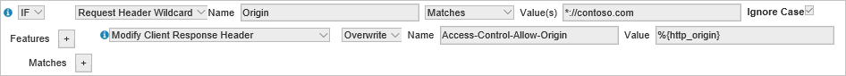

<properties
    pageTitle="Usa CDN Azure con CORS | Microsoft Azure"
    description="Informazioni su come utilizzare il Azure contenuti rete (CDN) a con la condivisione delle risorse tra origine (CORS)."
    services="cdn"
    documentationCenter=""
    authors="camsoper"
    manager="erikre"
    editor=""/>

<tags
    ms.service="cdn"
    ms.workload="tbd"
    ms.tgt_pltfrm="na"
    ms.devlang="na"
    ms.topic="article"
    ms.date="09/30/2016"
    ms.author="casoper"/>
    
# Utilizzo di Azure CDN con CORS     

## Che cos'è CORS?

CORS (Cross origine la condivisione delle risorse) è una caratteristica HTTP che consente a un'applicazione web in esecuzione in un dominio accedere alle risorse in un altro dominio. Per ridurre la possibilità di attacchi di script, tutti i browser moderni implementano restrizioni di protezione noto come [criterio stessa origine](http://www.w3.org/Security/wiki/Same_Origin_Policy).  In questo modo una pagina web da chiamare le API in un dominio diverso.  CORS offre un modo protetto per consentire a un dominio, il dominio di origine, chiamare API in un altro dominio.
 
## Come funziona
1.  Il browser invia la richiesta di opzioni in un'intestazione di **origine** HTTP. Il valore di questa intestazione è il dominio che served della pagina padre. Quando una pagina da https://www.contoso.com tenta di accedere ai dati di un utente nel dominio fabrikam.com, intestazione della richiesta seguenti inviata a fabrikam.com: 
    
    `Origin: https://www.contoso.com`
 
2.  Il server può rispondere con le operazioni seguenti:
    - Un'intestazione di **Accesso controllo-Consenti-origine** nella sua risposta che indica quali siti di origine sono consentite. Per esempio:
        
        `Access-Control-Allow-Origin: https://www.contoso.com`
        
    - Se il server non consente la richiesta di origine tra una pagina di errore
    - Un'intestazione di **Accesso controllo-Consenti-origine** con un carattere jolly che consente a tutti i domini:
        
        `Access-Control-Allow-Origin: *`
 
Per le richieste HTTP complesse, è stata richiesta completata prima "preliminare" per determinare se dispone dell'autorizzazione prima di inviare l'intera richiesta.
 
## Scenari di origine singola o con caratteri jolly

CORS nella rete CDN di Azure funzionerà automaticamente con alcuna configurazione aggiuntiva quando l'intestazione di **Accesso controllo-Consenti-origine** è impostato su caratteri jolly (*) o una singola origine.  La rete CDN inserirà la risposta prima le successive richieste utilizzare la stessa intestazione.
 
Se le richieste di sono già state apportate della rete CDN prima CORS viene impostata sul l'origine, sarà necessario eliminare il contenuto di endpoint per ricaricare il contenuto con l'intestazione di **Accesso controllo-Consenti-origine** contenuto.
 
## Più scenari di origine

Se è necessario consentire a un elenco specifico di origini diverse da consentire per CORS, le cose diventano un po' più complesse. Il problema si verifica quando la rete CDN memorizza l'intestazione di **Accesso controllo-Consenti-origine** per l'origine CORS prima.  Quando una diversa origine CORS effettua una richiesta successiva, la rete CDN verrà servita l'intestazione **Access controllo-Consenti-origine** memorizzati nella cache, che non corrisponda.  Esistono diversi modi per risolvere il problema.
 
### Azure CDN Premium da Verizon

Il modo migliore per abilitare questa operazione consiste nell'utilizzare **Azure CDN Premium da Verizon**, che espone alcune funzionalità avanzate. 
 
È necessario [creare una regola](cdn-rules-engine.md) controllare l'intestazione di **origine** per la richiesta.  Se si tratta di un'origine valida, la regola verrà impostato l'intestazione di **Accesso controllo-Consenti-origine** con l'origine fornita nella richiesta di.  Se l'origine specificato nell'intestazione di **origine** non è consentito, la regola deve omettere l'intestazione di **Accesso controllo-Consenti-origine** che il browser rifiutare la richiesta. 
 
Esistono due modi per eseguire questa operazione con il motore di regole.  In entrambi i casi, l'intestazione di **Accesso controllo-Consenti-origine** dal server di origine del file verrà ignorata completamente, motore di regole del CDN gestisce completamente origini CORS consentite.

#### Un'espressione regolare con tutte le origini diverse validi
 
In questo caso, si creerà un'espressione regolare che include tutte le origini che si desidera consentire: 

    https?:\/\/(www\.contoso\.com|contoso\.com|www\.microsoft\.com|microsoft.com\.com)$
 
> [AZURE.TIP] **Rete CDN di Azure da Verizon** utilizza [Espressioni regolari compatibili Perl](http://pcre.org/) come il motore per le espressioni regolari.  È possibile usare uno strumento come [101 espressioni regolari](https://regex101.com/) per convalidare l'espressione regolare.  Si noti che il carattere "/" valido nelle espressioni regolari e non deve essere di tipo escape, tuttavia, tale carattere di escape sono una buona norma e prevede alcune convalida regex.

Se l'espressione regolare corrisponde, la regola sostituirà l'intestazione di **Accesso controllo-Consenti-origine** (se presente) dall'origine con l'origine che ha inviato la richiesta.  È anche possibile aggiungere intestazioni CORS aggiuntive, ad esempio **Controllo-Consenti-metodi di accesso**.

 
#### Richiesta di intestazione regola per ogni origine.

Invece di espressioni regolari, è invece possibile creare una regola separata per ogni origine che si desidera consentire utilizzando la **Richiesta jolly intestazione** [corrispondono alla condizione](https://msdn.microsoft.com/library/mt757336.aspx#Anchor_1). Come il metodo di espressioni regolari, motore regole consente di impostare le intestazioni CORS. 
  

> [AZURE.TIP] Nell'esempio precedente, l'uso di caratteri jolly * indica al motore di regole in modo che corrispondano HTTP e HTTPS.
 
### Azure CDN Standard

Nei profili di Azure CDN Standard, l'unico meccanismo per consentire più origini diverse senza l'utilizzo di origine con caratteri jolly consiste nell'utilizzare [la memorizzazione nella cache di stringa query](cdn-query-string.md).  È necessario abilitare le impostazioni per l'endpoint CDN stringa query e quindi utilizzare una stringa di query univoci per le richieste da tutti i domini consentiti. Questa operazione comporta la rete CDN di memorizzazione nella cache un oggetto distinto per ogni stringa di query univoco. Questo approccio non è ideale, tuttavia, in quanto comporta in più copie dello stesso file nella rete CDN di cache.  

