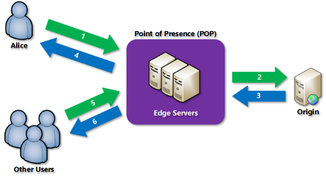

<properties
    pageTitle="Panoramica di Azure CDN | Microsoft Azure"
    description="Informazioni su che cos'è il Azure contenuto rete (CDN) e come utilizzarlo per distribuire contenuto ad alta larghezza di banda per la memorizzazione nella cache BLOB e in contenuto statico."
    services="cdn"
    documentationCenter=""
    authors="camsoper"
    manager="erikre"
    editor=""/>

<tags
    ms.service="cdn"
    ms.workload="tbd"
    ms.tgt_pltfrm="na"
    ms.devlang="na"
    ms.topic="hero-article"
    ms.date="09/30/2016"
    ms.author="casoper"/>

# Panoramica della rete Azure contenuti (CDN)

> [AZURE.NOTE] In questo documento sono descritte le novità di Azure contenuti rete (CDN), come funziona e le caratteristiche di ogni prodotto CDN Azure.  Se si vuole ignorare queste informazioni e passare direttamente a un'esercitazione su come creare un endpoint CDN, vedere [Uso CDN Azure](cdn-create-new-endpoint.md).  Se si vuole visualizzare un elenco di posizioni nodo CDN correnti, vedere [Azure CDN POP posizioni](cdn-pop-locations.md).

Il Azure contenuto rete (CDN) nella cache del contenuto web statica posizionati nelle posizioni per fornire velocità massima per la distribuzione di contenuti per gli utenti.  La rete CDN offre una soluzione globale per l'esecuzione di larghezza di banda elevata contenuto per la memorizzazione nella cache del contenuto in nodi fisici in tutto il mondo. 

Vantaggi dell'utilizzo di rete CDN di risorse del sito web cache includono:

- Migliorare le prestazioni e utente esperienza utente per gli utenti finali, soprattutto quando si utilizzano le applicazioni nel punto in cui è necessari più andata e ritorno per caricare il contenuto.
- Grande proporzioni dei caratteri per una migliore gestione istantaneo condizioni di carico elevato, ad esempio all'inizio di un evento di lancio del prodotto.
- Per la distribuzione utente richieste e che servono contenuto dal server perimetrali, meno il traffico viene inviato all'origine.

## Come funziona

1. Un utente (Alice) richiede un file (detto anche un bene) usando un URL con un nome di dominio speciale, ad esempio `<endpointname>.azureedge.net`.  DNS indirizza la richiesta per le migliori prestazioni posizione punto di presenza (POP).  Si tratta in genere POP limitazioni geografiche più vicina all'utente.

2. Se il server perimetrali nel POP non si ha il file nella cache, server perimetrale richiede il file dall'origine.  L'origine può essere un'App Web di Azure, servizio Cloud di Azure, lo spazio di archiviazione di Azure account o un server web accessibile al pubblico.

3. L'origine restituisce il file al server perimetrale, inclusi intestazioni HTTP la descrizione alla durata del file (TTL).

4. Server perimetrale memorizza il file e restituisce il file per il richiedente originale (Alice).  Il file rimane memorizzati nella cache nel server perimetrale fino a quando scade il valore TTL.  Se l'origine non ha specificato un TTL, il valore TTL predefinito è sette giorni.

5. Altri utenti possono richiedere lo stesso file mediante l'URL stesso e potrebbero anche fare riferimento a tale POP stesso.

6. Se il valore TTL per il file non è scaduto, server perimetrale restituisce il file dalla cache.  In questo modo un'esperienza utente più veloci ed efficienti.

## Caratteristiche di Azure CDN

Esistono tre prodotti CDN Azure: **Azure CDN Standard da Akamai** **Azure CDN Standard da Verizon**e **Azure CDN Premium da Verizon**.  Nella tabella seguente vengono elencate le caratteristiche disponibili con ogni prodotto.

|       | Akamai standard | Verizon standard | Verizon Premium |
|-------|-----------------|------------------|-----------------|
| Servizi di integrazione con Azure ad esempio [lo spazio di archiviazione](cdn-create-a-storage-account-with-cdn.md), [Servizi Cloud](cdn-cloud-service-with-cdn.md), [Web App](../app-service-web/cdn-websites-with-cdn.md)e [Servizi multimediali](../media-services/media-services-portal-manage-streaming-endpoints.md) | **& #x 2713;** | **& #x 2713;** | **& #x 2713;**|
| Gestione tramite [API REST](https://msdn.microsoft.com/library/mt634456.aspx), [.NET](./cdn-app-dev-net.md), [Node](./cdn-app-dev-node.md)o [PowerShell](./cdn-manage-powershell.md). | **& #x 2713;** | **& #x 2713;** | **& #x 2713;** |
| Supporto HTTPS | **& #x 2713;** | **& #x 2713;** | **& #x 2713;** |
| Il bilanciamento del carico | **& #x 2713;** | **& #x 2713;** | **& #x 2713;** |
| Protezione [DDOS](https://www.us-cert.gov/ncas/tips/ST04-015) | **& #x 2713;** | **& #x 2713;** | **& #x 2713;** |
| Doppio stack IPv4/IPv6 | **& #x 2713;** | **& #x 2713;** | **& #x 2713;** |
| [Supporto per il nome di dominio personalizzato](cdn-map-content-to-custom-domain.md) | **& #x 2713;** | **& #x 2713;** | **& #x 2713;** |
| [Memorizzazione nella cache stringa di query](cdn-query-string.md) | **& #x 2713;** | **& #x 2713;** | **& #x 2713;** |
| [Filtro geografico](cdn-restrict-access-by-country.md) |  | **& #x 2713;** | **& #x 2713;** |
| [Eliminare rapidamente](cdn-purge-endpoint.md) | **& #x 2713;** | **& #x 2713;** | **& #x 2713;** |
| [Pre-caricando bene](cdn-preload-endpoint.md) |  | **& #x 2713;** | **& #x 2713;** |
| [Analitica core](cdn-analyze-usage-patterns.md) |  | **& #x 2713;** | **& #x 2713;** |
| [Supporto di HTTP/2](https://msdn.microsoft.com/library/mt762901.aspx) | **& #x 2713;**  |  |  |
| [Report HTTP avanzati](cdn-advanced-http-reports.md) | | | **& #x 2713;** |
| [Statistiche in tempo reale](cdn-real-time-stats.md) | | | **& #x 2713;** |
| [Avvisi in tempo reale](cdn-real-time-alerts.md) | | | **& #x 2713;** |
| [Motore di distribuzione di contenuti regola personalizzabile](cdn-rules-engine.md) | | | **& #x 2713;** |
| Impostazioni cache/intestazione (con [motore regole](cdn-rules-engine.md))  | | | **& #x 2713;** |
| URL reindirizza/riscrittura (con [motore regole](cdn-rules-engine.md)) | | | **& #x 2713;** |
| Regole di dispositivi mobili (con [motore regole](cdn-rules-engine.md))  | | | **& #x 2713;** |

>[AZURE.TIP] Esiste una caratteristica che si desidera visualizzare in Azure CDN?  [Inviare commenti e suggerimenti](https://feedback.azure.com/forums/169397-cdn)! 

## Passaggi successivi

Per iniziare a utilizzare CDN, vedere [Uso CDN Azure](./cdn-create-new-endpoint.md).

Se si è un cliente CDN esistente, è possibile gestire gli endpoint CDN tramite il [portale di Microsoft Azure](https://portal.azure.com) o con [PowerShell](cdn-manage-powershell.md).

Per visualizzare la rete CDN in azione, consultare il [video della sessione compilazione 2016](https://azure.microsoft.com/documentation/videos/build-2016-leveraging-the-new-azure-cdn-apis-to-build-wicked-fast-applications/).

Informazioni su come automatizzare CDN Azure con [.NET](./cdn-app-dev-net.md) o [Node](./cdn-app-dev-node.md).

Per informazioni sui prezzi, vedere [CDN prezzi](https://azure.microsoft.com/pricing/details/cdn/).
