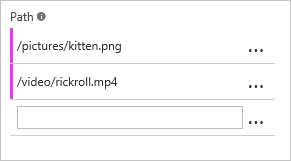

<properties
    pageTitle="Pre-caricare risorse per un endpoint CDN Azure | Microsoft Azure"
    description="Informazioni su come caricare pre-memorizzati nella cache contenuto in un endpoint CDN."
    services="cdn"
    documentationCenter=""
    authors="camsoper"
    manager="erikre"
    editor=""/>

<tags
    ms.service="cdn"
    ms.workload="tbd"
    ms.tgt_pltfrm="na"
    ms.devlang="na"
    ms.topic="article"
    ms.date="07/28/2016"
    ms.author="casoper"/>

# Pre-caricare risorse per un endpoint di rete CDN di Azure

[AZURE.INCLUDE [cdn-verizon-only](../../includes/cdn-verizon-only.md)]

Per impostazione predefinita, risorse prima di tutto cache quando vengono richieste. Questo errore indica che la richiesta prima di ogni regione può richiedere più tempo, dal momento che i server perimetrali non avrà il contenuto della cache e sarà necessario inoltrare la richiesta al server di origine. Pre-caricamento di contenuto consente di evitare questa latenza passaggi prima.

Oltre a soddisfazione del cliente, pre-caricamento propri beni memorizzati nella cache anche ridurre il traffico di rete sul server di origine.

> [AZURE.NOTE] Pre-il caricamento di risorse è utile per eventi di grandi dimensioni o il contenuto diventa disponibile contemporaneamente a un numero elevato di utenti, ad esempio una nuova versione di filmato o un aggiornamento software.

In questa esercitazione si tramite pre-caricamento contenuto della cache su tutti i nodi di bordo CDN Azure.

## Procedura dettagliata

1. Nel [Portale di Azure](https://portal.azure.com), passare al profilo CDN contenente l'endpoint che si desidera pre-caricare.  Verrà visualizzata e il profilo.

2. Fare clic sull'endpoint nell'elenco.  Verrà visualizzata e il punto finale.

3. Scegliere il pulsante Carica e il punto finale CDN.

    

    Verrà visualizzata e il caricamento.

    

4. Immettere il percorso completo di ogni attività che si desidera caricare (ad esempio, `/pictures/kitten.png`) nella casella di testo **percorso** .

    > [AZURE.TIP] Altre caselle di testo **percorso** verrà visualizzato dopo avere immesso il testo che consente di creare un elenco di più risorse.  È possibile eliminare l'attività dall'elenco facendo clic sui puntini di sospensione (...).
    >
    > Percorsi devono essere un URL relativo che soddisfa la seguente [espressione](https://msdn.microsoft.com/library/az24scfc.aspx): `^(?:\/[a-zA-Z0-9-_.\u0020]+)+$`.  Ogni risorsa deve avere il proprio percorso.  Non esiste nessuna funzionalità con caratteri jolly per beni pre-il caricamento.

    

5. Fare clic sul pulsante **Carica** .

    

> [AZURE.NOTE] Esiste un limite di 10 carico richieste al minuto per ogni profilo CDN.

## Vedere anche
- [Eliminare un endpoint di rete CDN di Azure](cdn-purge-endpoint.md)
- [Riferimento all'API REST CDN Azure - eliminare o pre-caricare un estremo](https://msdn.microsoft.com/library/mt634451.aspx)
