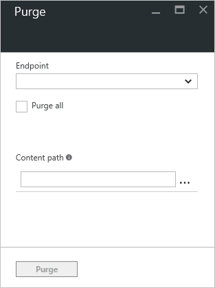

<properties
    pageTitle="Eliminare un endpoint CDN Azure | Microsoft Azure"
    description="Informazioni su come eliminare tutto il contenuto memorizzati nella cache da un endpoint CDN."
    services="cdn"
    documentationCenter=""
    authors="camsoper"
    manager="erikre"
    editor=""/>

<tags
    ms.service="cdn"
    ms.workload="tbd"
    ms.tgt_pltfrm="na"
    ms.devlang="na"
    ms.topic="article"
    ms.date="07/28/2016"
    ms.author="casoper"/>

# Eliminare un endpoint di rete CDN di Azure

## Panoramica

Azure nodi di bordo CDN inserirà risorse fino alla scadenza di time to live (TTL) un bene.  Al termine TTL del bene, quando un client richiede bene il nodo del bordo, il nodo del bordo verrà recuperato una nuova copia aggiornata di un bene per rispondere alla richiesta di client e archivio aggiornare la cache.

Può succedere che si desidera eliminare contenuto della cache da tutti i nodi di bordo e imporre tutti per recuperare nuove attività aggiornati.  È possibile a causa di aggiornamenti per l'applicazione web o per rapidamente attività di aggiornamento che contengono informazioni non corrette.

> [AZURE.TIP] Si noti che l'eliminazione solo Cancella contenuto della cache sui server perimetrali CDN.  Tutte le cache downstream, ad esempio server proxy e cache del browser locale, possono comunque tenere una copia del file memorizzati nella cache.  È importante ricordare quando si imposta un file time to live.  È possibile forzare un client downstream per richiedere la versione più recente del file mediante l'assegnazione di un nome univoco ogni volta che si aggiorna o sfruttando di [memorizzazione nella cache stringa di query](cdn-query-string.md).  

In questa esercitazione è illustrata l'eliminazione di risorse da tutti i nodi di bordo di un endpoint.

## Procedura dettagliata

1. Nel [Portale di Azure](https://portal.azure.com), passare al profilo CDN contenente l'endpoint che si desidera eliminare.

2. Da e il profilo CDN fare clic sul pulsante Elimina.

    

    Verrà visualizzata e l'eliminazione.

    

3. Scegliere l'indirizzo del servizio che si desidera eliminare nell'elenco a discesa URL e l'eliminazione.

    

    > [AZURE.NOTE] È anche possibile ottenere e l'eliminazione facendo clic sul pulsante **Elimina** sulla e punto finale CDN.  In questo caso, il campo di **URL** potrà essere prepopolato con l'indirizzo del servizio di tale endpoint specifico.

4. Selezionare quali risorse che si desidera eliminare dei nodi di bordo.  Se si desidera cancellare tutte le risorse, fare clic sulla casella di controllo **Svuota tutto** .  In caso contrario, digitare il percorso completo di ogni attività che si desidera eliminare (ad esempio, `/pictures/kitten.png`) nella casella di testo **percorso** .

    > [AZURE.TIP] Altre caselle di testo **percorso** verrà visualizzato dopo avere immesso il testo che consente di creare un elenco di più risorse.  È possibile eliminare l'attività dall'elenco facendo clic sui puntini di sospensione (...).
    >
    > Percorsi devono essere un URL relativo che soddisfano la seguente [espressione](https://msdn.microsoft.com/library/az24scfc.aspx): `^\/(?:[a-zA-Z0-9-_.\u0020]+\/)*\*$";`.  Per **CDN Azure da Verizon** (Standard e Premium), asterisco (\*) può essere utilizzato come un carattere jolly (ad esempio, `/music/*`).  I caratteri jolly e **Svuota tutto** non sono consentiti con **Azure CDN da Akamai**.
    
5. Fare clic sul pulsante **Elimina** .

    

> [AZURE.IMPORTANT] Le richieste di eliminazione necessari circa 2-3 minuti per l'elaborazione di **Azure CDN da Verizon** (Standard e Premium) e 7 minuti con **Azure CDN da Akamai**.  Azure CDN ha un limite di 50 simultanee eliminare le richieste in qualsiasi momento. 

## Vedere anche
- [Pre-caricare risorse per un endpoint di rete CDN di Azure](cdn-preload-endpoint.md)
- [Riferimento all'API REST CDN Azure - eliminare o pre-caricare un estremo](https://msdn.microsoft.com/library/mt634451.aspx)
