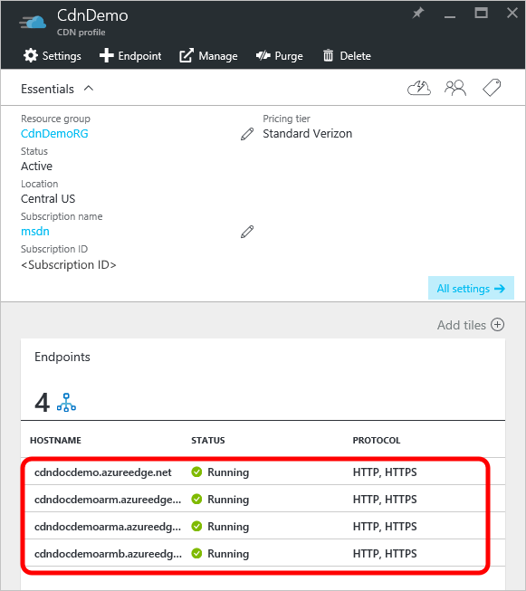

<properties
    pageTitle="Controllo CDN Azure comportamento delle richieste con stringhe di query della cache | Microsoft Azure"
    description="Stringa di query CDN Azure memorizzazione nella cache controlli come file devono essere memorizzati nella cache quando contengono stringhe di query."
    services="cdn"
    documentationCenter=""
    authors="camsoper"
    manager="erikre"
    editor=""/>

<tags
    ms.service="cdn"
    ms.workload="tbd"
    ms.tgt_pltfrm="na"
    ms.devlang="na"
    ms.topic="article"
    ms.date="07/28/2016"
    ms.author="casoper"/>

#Controllare il comportamento della cache delle richieste di rete CDN con stringhe di query

> [AZURE.SELECTOR]
- [Standard](cdn-query-string.md)
- [Azure CDN Premium da Verizon](cdn-query-string-premium.md)

##Panoramica

Stringa di query la memorizzazione nella cache controlli come file devono essere memorizzati nella cache quando contengono stringhe di query.

> [AZURE.IMPORTANT] I prodotti Standard e Premium CDN forniscono la stessa stringa query la funzionalità di cache, ma l'interfaccia utente diversa.  Questo documento descrive l'interfaccia di ** **Azure CDN da Akamai Azure CDN Standard**e da Verizon** .  Per query stringa la memorizzazione nella cache con **Azure CDN Premium da Verizon**, vedere [controllare il comportamento della cache delle richieste di rete CDN con stringhe di query - Premium](cdn-query-string-premium.md).

Sono disponibili tre modalità:

- **Ignora le stringhe di query**: questa è la modalità predefinita.  Il nodo del bordo CDN passerà la stringa di query dal richiedente all'origine nella prima richiesta e cache bene.  Tutte le successive richieste per tale attività inviata da nodo del bordo ignorerà la stringa di query alla scadenza del bene memorizzati nella cache.
- **Ignorare la memorizzazione nella cache dell'URL con stringhe di query**: In questa modalità, le richieste con stringhe di query non vengono memorizzate in corrispondenza del nodo di bordo CDN.  Il nodo del bordo recupera asset direttamente dall'origine e passa al richiedente con ogni richiesta.
- **Memorizzare nella cache ogni URL univoco**: questa modalità considera ogni richiesta con una stringa di query come risorsa univoca con la propria cache.  Ad esempio, la risposta dall'origine per una richiesta di *foo.ashx?q=bar* cache in corrispondenza del nodo di bordo e restituita per cache successivi con la stessa stringa di query.  Verrà memorizzata nella cache di una richiesta di *foo.ashx?q=somethingelse* come risorsa distinta con il proprio tempo TTL.

##Modificare la memorizzazione nella cache le impostazioni per i profili di rete CDN standard stringa di query

1. Selezionare l'endpoint di rete CDN che si desidera gestire e il profilo CDN.

    

    Verrà visualizzata e il punto finale CDN.

2. Fare clic sul pulsante **Configura** .

    

    Verrà visualizzata e il CDN configurazione.

3. Selezionare un'impostazione nell'elenco a discesa **stringa di Query comportamento della cache** .

    

4. Dopo la selezione, fare clic sul pulsante **Salva** .

> [AZURE.IMPORTANT] Le modifiche alle impostazioni potrebbe non essere immediatamente visibili in quanto viene ora per la registrazione per la propagazione attraverso la rete CDN.  Per i profili di <b>Azure CDN da Akamai</b> , propagazione completeranno in genere all'interno di un minuto.  Per i profili di <b>Azure CDN da Verizon</b> , propagazione in genere completeranno all'interno di 90 minuti, ma in alcuni casi può impiegare più tempo.
