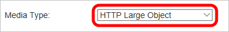
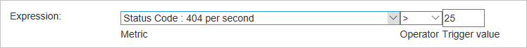
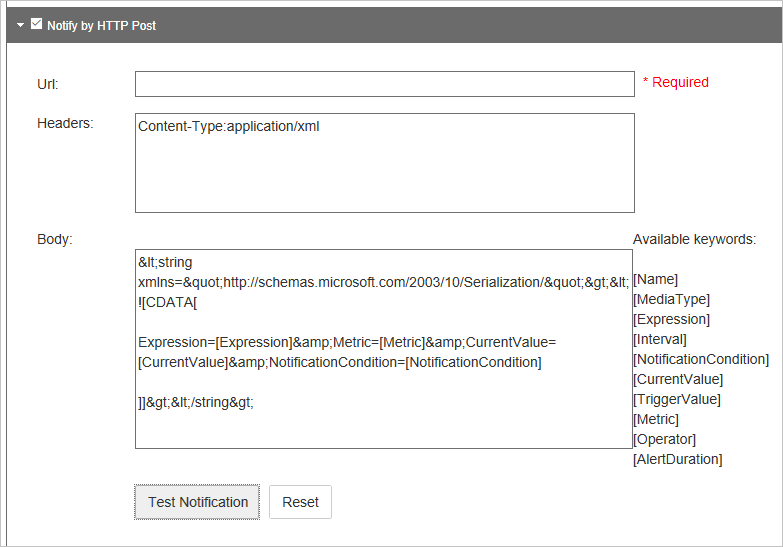

<properties
    pageTitle="Avvisi in tempo reale CDN Azure | Microsoft Azure"
    description="Avvisi in tempo reale in Microsoft Azure CDN. Gli avvisi in tempo reale offrono le notifiche sulle prestazioni dell'endpoint nel profilo di rete CDN."
    services="cdn"
    documentationCenter=""
    authors="camsoper"
    manager="erikre"
    editor=""/>

<tags
    ms.service="cdn"
    ms.workload="tbd"
    ms.tgt_pltfrm="na"
    ms.devlang="na"
    ms.topic="article"
    ms.date="07/12/2016"
    ms.author="casoper"/>

# <a name="real-time-alerts-in-microsoft-azure-cdn"></a>Avvisi in tempo reale in rete CDN di Microsoft Azure

[AZURE.INCLUDE [cdn-premium-feature](../../includes/cdn-premium-feature.md)]


## <a name="overview"></a>Panoramica

In questo documento viene avvisi in tempo reale in Microsoft Azure CDN. Questa funzionalità fornisce notifiche in tempo reale sulle prestazioni dell'endpoint nel profilo di rete CDN.  È possibile impostare la posta elettronica o avvisi HTTP in base a:

* Larghezza di banda
* Codici di stato
* Stati cache
* Connessioni

## <a name="creating-a-real-time-alert"></a>Creazione di un avviso in tempo reale

1. Nel [Portale di Azure](https://portal.azure.com), passare al proprio profilo CDN.

    

2. Scegliere il pulsante **Gestisci** e il profilo CDN.

    

    Portale di gestione di rete CDN apre.

3. Al passaggio del mouse sulla scheda **Analitica** , quindi al passaggio del mouse sopra il riquadro a comparsa **Stat in tempo reale** .  Fare clic su **avvisi in tempo reale**.

    

    L'elenco delle configurazioni avviso esistente (se presente).

4. Fare clic sul pulsante **Aggiungi avviso** .

    

    Verrà visualizzato un modulo per la creazione di un nuovo avviso.

    

5. Se si vuole questo avviso quando si fa clic su **Salva**, selezionare la casella di controllo **Abilitata avviso** .

6. Immettere un nome descrittivo per l'avviso nel campo **nome** .

7. Nell'elenco a discesa **Tipo di oggetto multimediale** , selezionare **Oggetto di grandi dimensioni HTTP**.

    

    > [AZURE.IMPORTANT] È necessario selezionare **Oggetto di grandi dimensioni HTTP** come **Tipo di oggetto multimediale**.  Altre opzioni non vengono utilizzati da **Azure CDN da Verizon**.  Per selezionare **l'Oggetto di grandi dimensioni HTTP** verificheranno l'avviso verso mai avviata.

8. Creare un' **espressione** per monitorare selezionando **un'unità di misura metriche**, **operatore**e **valore Trigger**.

    - Per **unità di misura metriche**, selezionare il tipo di condizione che si desidera monitorare.  **Mbps della larghezza di banda** è l'importo dell'utilizzo della larghezza di banda in megabit al secondo.  **Totale connessioni** indica il numero di connessioni HTTP concorrenti al nostro server perimetrali.  Le definizioni dei vari stati cache e codici di stato, vedere [Codici di stato di Azure CDN Cache](https://msdn.microsoft.com/library/mt759237.aspx) e [Codici di stato di Azure CDN HTTP](https://msdn.microsoft.com/library/mt759238.aspx)
    - **È l'operatore matematico che stabilisce la relazione tra le unità di misura metriche e il valore di trigger.**
    - **Valore trigger** è il valore di soglia che deve essere soddisfatte prima verrà inviata una notifica.

    Nell'esempio seguente, il valore di expression ho creato indica che desidera ricevere una notifica quando il numero di codici di stato 404 è maggiore di 25.

    

9. Per un **intervallo**, immettere la frequenza si desidera che l'espressione.

10. **Notifica** dall'elenco a discesa selezionare quando si desidera ricevere una notifica quando l'espressione è vera.
    
    - **Iniziare a condizione** indica che verrà inviata una notifica quando la condizione specificata viene rilevata prima di tutto.
    - **Condizione fine** indica che verrà inviata una notifica quando la condizione specificata non è più rilevabile. Questa notifica può essere avviata solo dopo la rete di sistema di monitoraggio rilevamento che si è verificato la condizione specificata.
    - **Continua** indica che una notifica verrà inviata ogni volta che il sistema di monitoraggio della rete rileva la condizione specificata. Tenere presente che il sistema di monitoraggio della rete verrà archiviata solo una volta per l'intervallo per la condizione specificata.
    - **Condizione di inizio e fine** indica che una notifica verrà inviata la prima volta che viene rilevata la condizione specificata e nuovamente quando non viene rilevata la condizione.

11. Se si desidera ricevere notifiche tramite posta elettronica, selezionare la casella di controllo **notifica tramite posta elettronica** .  

    
    
    Nel campo **a** immettere l'indirizzo di posta elettronica in cui si vuole che le notifiche inviate. Per **oggetto** e **il corpo**, è possibile lasciare il valore predefinito o è possibile personalizzare il messaggio utilizzando l'elenco di **parole chiave disponibili** per inserire dinamicamente i dati relativi agli avvisi quando il messaggio viene inviato.

    > [AZURE.NOTE] È possibile verificare la notifica tramite posta elettronica facendo clic su **Una notifica di prova** , ma solo dopo aver salvata la configurazione dell'avviso.

12. Se si desidera che le notifiche verrà inserito in un server web, selezionare la casella di controllo **notifica mediante HTTP Post** .

    

    Nel campo **Url** immettere l'URL in cui si vuole che il messaggio HTTP inserito. Nella casella di testo delle **intestazioni** , immettere le intestazioni HTTP da inviare nella richiesta.  Per **corpo** è possibile personalizzare il messaggio utilizzando l'elenco di **parole chiave disponibili** per inserire dinamicamente i dati relativi agli avvisi quando il messaggio viene inviato.  **Intestazioni** e **corpo** impostazioni predefinite per un payload XML simile all'esempio seguente.

    ```
    <string xmlns="http://schemas.microsoft.com/2003/10/Serialization/">
        <![CDATA[Expression=Status Code : 404 per second > 25&Metric=Status Code : 404 per second&CurrentValue=[CurrentValue]&NotificationCondition=Condition Start]]>
    </string>
    ```

    > [AZURE.NOTE] È possibile verificare la notifica HTTP Post facendo clic su **Una notifica di prova** , ma solo dopo aver salvata la configurazione dell'avviso.

13. Fare clic sul pulsante **Salva** per salvare la configurazione dell'avviso.  Se è selezionata **Avviso attivato** nel passaggio 5, l'avviso è ora attivo.

## <a name="next-steps"></a>Passaggi successivi

- Analisi [statistiche in tempo reale in rete CDN di Azure](cdn-real-time-stats.md)
- Approfondimento con [report HTTP avanzati](cdn-advanced-http-reports.md)
- Analizzare i [modelli di utilizzo](cdn-analyze-usage-patterns.md)

