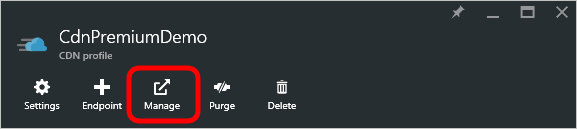
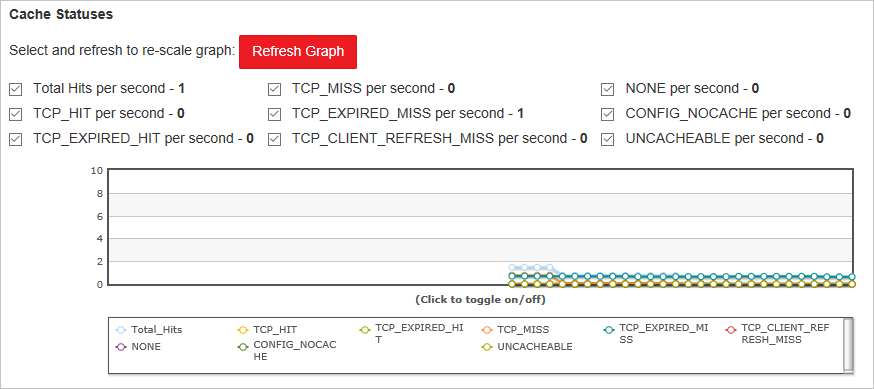

<properties
    pageTitle="Real-tempo-STAT in Azure CDN | Microsoft Azure"
    description="Statistiche in tempo reale fornisce i dati in tempo reale sulle prestazioni di rete CDN di Azure durante l'esecuzione di contenuto per i clienti."
    services="cdn"
    documentationCenter=""
    authors="camsoper"
    manager="erikre"
    editor=""/>

<tags
    ms.service="cdn"
    ms.workload="tbd"
    ms.tgt_pltfrm="na"
    ms.devlang="na"
    ms.topic="article"
    ms.date="07/28/2016"
    ms.author="casoper"/>

# Statistiche in tempo reale in rete CDN di Microsoft Azure

[AZURE.INCLUDE [cdn-premium-feature](../../includes/cdn-premium-feature.md)]

## Panoramica

In questo documento viene STAT in tempo reale in Microsoft Azure CDN.  Questa funzionalità fornisce i dati in tempo reale, ad esempio la larghezza di banda, stati cache e connessioni simultanee al proprio profilo CDN durante l'esecuzione di contenuto per i clienti. In questo modo continuo monitoraggio dell'integrità del servizio in qualsiasi momento, inclusi gli eventi di pubblicazione.

I grafici seguenti sono disponibili:

* [Larghezza di banda](#bandwidth)
* [Codici di stato](#status-codes)
* [Stati cache](#cache-statuses)
* [Connessioni](#connections)

## Accesso alle statistiche in tempo reale

1. Nel [Portale di Azure](https://portal.azure.com), passare al proprio profilo CDN.

    

2. Scegliere il pulsante **Gestisci** e il profilo CDN.

    

    Verrà visualizzata la finestra di portale di gestione di CDN.

3. Al passaggio del mouse sulla scheda **Analitica** , quindi al passaggio del mouse sopra il riquadro a comparsa **Stat in tempo reale** .  Fare clic su **oggetto di grandi dimensioni HTTP**.

    

    I grafici in tempo reale stat vengono visualizzati.
    
Ognuno dei grafici consente di visualizzare le statistiche in tempo reale per l'intervallo di tempo selezionato, avvio durante il caricamento della pagina.  I grafici vengono aggiornate automaticamente ogni pochi secondi.  Pulsante **Aggiorna Graph** , se presenti, eliminerà il grafico, trascorso il quale verranno visualizzate solo i dati selezionati.

## Larghezza di banda

Il grafico **della larghezza di banda** Visualizza la quantità di larghezza di banda utilizzata per la piattaforma corrente nel periodo di tempo selezionato. La parte ombreggiata del grafico indica l'utilizzo della larghezza di banda. L'importo esatto della larghezza di banda attualmente in uso viene visualizzato sotto il grafico a linee.

## Codici di stato

Il grafico di **Codici di stato** indica quante volte si verificano determinati codici di risposta HTTP nel periodo di tempo selezionato.

> [AZURE.TIP]  Per una descrizione delle singole opzioni di codice di stato HTTP, vedere [Codici di stato di Azure CDN HTTP](https://msdn.microsoft.com/library/mt759238.aspx).

Viene visualizzato un elenco dei codici di stato HTTP direttamente sopra il grafico. Questo elenco indica ogni codice di stato che può essere inclusi nel grafico a linee e il numero di occorrenze al secondo per il codice di stato corrente. Per impostazione predefinita, viene visualizzata una riga per ogni di questi codici di stato nel grafico. Tuttavia, è possibile monitorare solo i codici di stato che hanno un significato speciale per la configurazione della rete CDN. A tale scopo, selezionare i codici di stato desiderato e deselezionare tutte le altre opzioni, quindi fare clic su **Aggiorna grafico**. 

È possibile nascondere temporaneamente i dati registrati per un codice di stato specifico.  Scegliere il codice di stato che si desidera nascondere la legenda direttamente sotto il grafico. Il codice di stato verrà nascosti immediatamente nel grafico. Fare di nuovo il codice di stato impedirà l'opzione per visualizzare nuovamente.

## Stati cache

Il grafico **Stati Cache** indica quante volte si verificano determinati tipi di stati cache nel periodo di tempo selezionato. 

> [AZURE.TIP]  Per una descrizione delle singole opzioni di codice di stato della cache, vedere [Codici di stato di Azure CDN Cache](https://msdn.microsoft.com/library/mt759237.aspx).

Viene visualizzato un elenco dei codici di stato della cache direttamente sopra il grafico. Questo elenco indica ogni codice di stato che può essere inclusi nel grafico a linee e il numero di occorrenze al secondo per il codice di stato corrente. Per impostazione predefinita, viene visualizzata una riga per ogni di questi codici di stato nel grafico. Tuttavia, è possibile monitorare solo i codici di stato che hanno un significato speciale per la configurazione della rete CDN. A tale scopo, selezionare i codici di stato desiderato e deselezionare tutte le altre opzioni, quindi fare clic su **Aggiorna grafico**. 

È possibile nascondere temporaneamente i dati registrati per un codice di stato specifico.  Scegliere il codice di stato che si desidera nascondere la legenda direttamente sotto il grafico. Il codice di stato verrà nascosti immediatamente nel grafico. Fare di nuovo il codice di stato impedirà l'opzione per visualizzare nuovamente.

## Connessioni

Questo grafico indica il numero di connessioni è stato definito per il server perimetrali. Ogni richiesta di un bene che attraversano i risultati CDN in una connessione.

## Passaggi successivi

- Ricevere una notifica con [avvisi in tempo reale in rete CDN di Azure](cdn-real-time-alerts.md)
- Approfondimento con [report HTTP avanzati](cdn-advanced-http-reports.md)
- Analizzare i [modelli di utilizzo](cdn-analyze-usage-patterns.md)

