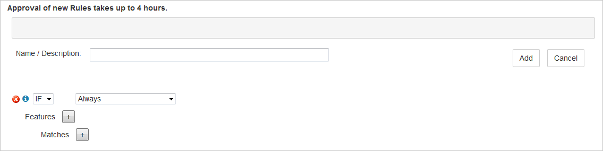

<properties
    pageTitle="Si esegue l'override predefinita HTTP nella rete CDN di Azure tramite il motore regole | Microsoft Azure"
    description="Motore di regole consente di personalizzare la modalità di gestione richieste dalla rete CDN di Azure, ad esempio bloccare il recapito di determinati tipi di contenuto, definire i criteri di memorizzazione nella cache e modificare le intestazioni HTTP."
    services="cdn"
    documentationCenter=""
    authors="camsoper"
    manager="erikre"
    editor=""/>

<tags
    ms.service="cdn"
    ms.workload="tbd"
    ms.tgt_pltfrm="na"
    ms.devlang="na"
    ms.topic="article"
    ms.date="07/28/2016"
    ms.author="casoper"/>

# Ignorare il comportamento predefinito HTTP utilizzando il motore di regole

[AZURE.INCLUDE [cdn-premium-feature](../../includes/cdn-premium-feature.md)]

## Panoramica

Motore di regole consente di personalizzare come vengono gestite richieste HTTP, ad esempio bloccare il recapito di determinati tipi di contenuto, la definizione di un criterio di memorizzazione nella cache e modifica delle intestazioni HTTP.  In questa esercitazione verrà illustrato la creazione di una regola che verrà modificato il comportamento della cache dei beni CDN.  È inoltre disponibile contenuto video disponibile nella sezione "[Vedere anche](#see-also)".

## Esercitazione

1. Scegliere il pulsante **Gestisci** e il profilo CDN.

    

    Portale di gestione di rete CDN apre.

2. Fare clic sulla scheda **HTTP grandi** , seguita dal **Motore regole**.

    Vengono visualizzate le opzioni per una nuova regola.

    

    >[AZURE.IMPORTANT] L'ordine in cui sono elencate più regole viene applicata la modalità di gestione. Una regola successiva potrebbe ignorare le azioni specificate da una regola precedente.
    
3. Immettere un nome per il **nome / descrizione** casella di testo.

4. Identificare il tipo di richieste che verrà applicata la regola.  Per impostazione predefinita, la condizione di corrispondenza **sempre** sia selezionata.  È necessario utilizzare **sempre** per questa esercitazione, lasciare selezionata.

    

    >[AZURE.TIP] Sono disponibili molti tipi di corrispondenza condizioni disponibili nell'elenco a discesa.  Fare clic sull'icona blu informativo a sinistra della condizione di corrispondenza viene la condizione selezionata in modo dettagliato.
    >
    >Per l'elenco completo delle condizioni di corrispondenza in modo dettagliato, vedere [regole motore corrispondono condizione e informazioni sulle funzionalità](https://msdn.microsoft.com/library/mt757336.aspx#Anchor_0).

5.  Fare clic sul **+** pulsante accanto a **caratteristiche** per aggiungere una nuova caratteristica.  Nell'elenco a discesa sulla sinistra, selezionare **Forza interno Max-Age**.  Nella casella di testo visualizzata immettere **300**.  Lasciare i valori predefiniti rimanenti.

    

    >[AZURE.NOTE] Come con condizioni di corrispondenza, fare clic sull'icona blu informativo a sinistra della nuova caratteristica di visualizzare informazioni dettagliate su questa caratteristica.  In caso di **Forza interni Max-Age**è stato eseguito l'override intestazioni di **Controllo della Cache** e di **scadenza** della risorsa per controllare quando il nodo del bordo CDN aggiornerà bene dall'origine.  Esempio di 300 secondi indica che il nodo del bordo CDN inserirà asset per 5 minuti prima di aggiornare la risorsa dall'origine.
    >
    >Per l'elenco completo delle caratteristiche di dettaglio, vedere [regole motore corrispondenza condizione e informazioni sulle funzionalità](https://msdn.microsoft.com/library/mt757336.aspx#Anchor_1).

6.  Fare clic sul pulsante **Aggiungi** per salvare la nuova regola.  La nuova regola a questo punto è in attesa di approvazione. Una volta è stata approvata, lo stato cambierà da **XML in sospeso** in **Formato XML attivo**.

    >[AZURE.IMPORTANT] Regole modifiche potrebbe richiedere fino a 90 minuti per propagare tramite la rete CDN.

## Vedere anche
* [Venerdì azure: nuove e potenti Premium caratteristiche di Azure CDN](https://azure.microsoft.com/documentation/videos/azure-cdns-powerful-new-premium-features/) (video)
* [Condizione di corrispondenza motore regole e informazioni sulle funzionalità](https://msdn.microsoft.com/library/mt757336.aspx)
