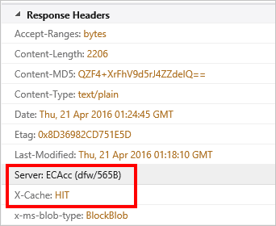

<properties
    pageTitle="Risoluzione dei problemi di compressione dei file in Azure CDN | Microsoft Azure"
    description="Risolvere i problemi con la compressione dei file di rete CDN di Azure."
    services="cdn"
    documentationCenter=""
    authors="camsoper"
    manager="erikre"
    editor=""/>

<tags
    ms.service="cdn"
    ms.workload="tbd"
    ms.tgt_pltfrm="na"
    ms.devlang="na"
    ms.topic="article"
    ms.date="09/01/2016"
    ms.author="casoper"/>
    
# Risoluzione dei problemi la compressione dei file di rete CDN

In questo articolo consente di risolvere i problemi con [la compressione dei file CDN](cdn-improve-performance.md).

Se necessaria ulteriore assistenza in qualsiasi momento in questo articolo, è possibile contattare i Azure esperti di [Azure MSDN e nei forum di Overflow dello Stack](https://azure.microsoft.com/support/forums/). In alternativa, è possibile inoltre archiviare una richiesta di assistenza Azure. Passare al [sito di supporto di Azure](https://azure.microsoft.com/support/options/) e fare clic su **Ottenere supporto**.

## Sintomo

La compressione per l'endpoint è attivata, ma i file vengono restituiti non compressi.

>[AZURE.TIP] Per verificare se i file vengono restituiti compressi, è necessario utilizzare uno strumento come [Fiddler](http://www.telerik.com/fiddler) o del browser [gli strumenti di sviluppo](https://developer.microsoft.com/microsoft-edge/platform/documentation/f12-devtools-guide/).  Intestazioni di risposta controllo HTTP restituiti con il CDN memorizzati nella cache del contenuto.  Se è presente un'intestazione denominata `Content-Encoding` con un valore di **gzip**, **bzip2**o **decompressione**, il contenuto è compressa.
>
>

## Causa

Esistono diverse cause, tra cui:

- Il contenuto della richiesto non è idoneo per la compressione.
- Compressione non è abilitata per il tipo di file richiesto.
- Richiesta HTTP non include un'intestazione che richiede un tipo di compressione validi.

## Risoluzione dei problemi

> [AZURE.TIP] Come per la distribuzione di nuovi endpoint, le modifiche alla configurazione CDN richiedere del tempo di propagare tramite la rete.  In genere, le modifiche vengono applicate all'interno di 90 minuti.  Se si tratta la prima volta compressione è stato configurato per l'endpoint CDN, è necessario prendere in considerazione in attesa 1-2 ore per essere certi che la compressione le impostazioni sono propagate ai POP. 

### Verificare la richiesta

Prima di tutto, eseguire una verifica dell'integrità rapido alla richiesta.  È possibile utilizzare [gli strumenti di sviluppo](https://developer.microsoft.com/microsoft-edge/platform/documentation/f12-devtools-guide/) del browser per visualizzare le richieste.

- Verificare la richiesta viene inviata per l'URL endpoint `<endpointname>.azureedge.net`e non l'origine.
- Verificare che la richiesta contiene un'intestazione di **Codifica accetta** e il valore per tale intestazione **gzip**, **decompressione**o **bzip2**.

> [AZURE.NOTE] I profili di **Azure CDN da Akamai** supportano solo la codifica **gzip** .

### Verificare le impostazioni di compressione (profilo Standard CDN)

> [AZURE.NOTE] Questo passaggio si applica solo se il profilo CDN è un profilo di **Azure CDN Standard da Verizon** o **Azure CDN Standard da Akamai** . 

Individuare l'endpoint nel [portale di Azure](https://portal.azure.com) e fare clic sul pulsante **Configura** .

- Verificare che sia abilitata la compressione.
- Verificare il tipo MIME per il contenuto deve essere compressa è incluso nell'elenco dei formati compressi.

### Verificare le impostazioni di compressione (profilo CDN Premium)

> [AZURE.NOTE] Questo passaggio si applica solo se il profilo CDN è un profilo di **Azure CDN Premium da Verizon** .

Individuare l'endpoint nel [portale di Azure](https://portal.azure.com) e fare clic sul pulsante **Gestisci** .  Verrà aperto il portale supplementare.  Al passaggio del mouse sulla scheda **Grandi HTTP** , quindi al passaggio del mouse sopra il riquadro a comparsa **Impostazioni della Cache** .  Selezionare la **compressione**. 

- Verificare che sia abilitata la compressione.
- Verificare che l'elenco di **Tipi di File** contiene un elenco delimitato da virgole (senza spazi) tipi MIME.
- Verificare il tipo MIME per il contenuto deve essere compressa è incluso nell'elenco dei formati compressi.

### Verificare che il contenuto nella cache

> [AZURE.NOTE] Questo passaggio si applica solo se il profilo CDN è un profilo di **Rete CDN di Azure da Verizon** (Standard o Premium).

Usare gli strumenti di sviluppo del browser, selezionare le intestazioni di risposta per assicurarsi che il file viene inserito nella cache nell'area in cui viene richiesto.

- Selezionare l'intestazione di risposta del **Server** .  L'intestazione deve avere il formato **della piattaforma (POP/Server ID)**, come illustrato nell'esempio seguente.
- Selezionare l'intestazione di risposta **Della Cache X** .  L'intestazione dovrebbe essere **raggiunto**.  

### Verificare che il file soddisfi i requisiti di dimensioni

> [AZURE.NOTE] Questo passaggio si applica solo se il profilo CDN è un profilo di **Azure CDN da Verizon** (Standard o Premium).

Per essere idoneo per la compressione, un file deve soddisfare i requisiti di dimensioni seguenti:

- Maggiore di 128 byte.
- Minore di 1 MB.

### Controllare la richiesta nel server di origine per un'intestazione **tramite**

L'intestazione **tramite** HTTP indica al server web che la richiesta vengono passata da un server proxy.  Server web IIS Microsoft per impostazione predefinita non comprimere le risposte quando la richiesta contiene un'intestazione **tramite** .  Per ignorare il problema, eseguire le operazioni seguenti:

- **IIS 6**: [impostare HcNoCompressionForProxies = "FALSE" nelle proprietà Metabase IIS](https://msdn.microsoft.com/library/ms525390.aspx)
- **IIS 7 e fino**: [impostare **noCompressionForHttp10** e **noCompressionForProxies** su False nella configurazione del server](http://www.iis.net/configreference/system.webserver/httpcompression)

