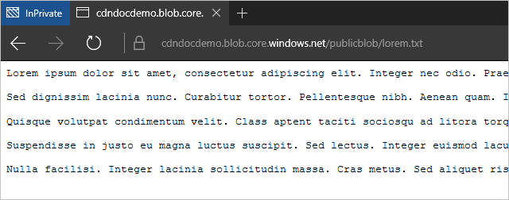

<properties
    pageTitle="Risoluzione dei problemi endpoint Azure CDN restituzione stato 404 | Microsoft Azure"
    description="Risoluzione dei problemi 404 codici di risposta con i punti finali CDN Azure."
    services="cdn"
    documentationCenter=""
    authors="camsoper"
    manager="erikre"
    editor=""/>

<tags
    ms.service="cdn"
    ms.workload="tbd"
    ms.tgt_pltfrm="na"
    ms.devlang="na"
    ms.topic="article"
    ms.date="07/28/2016"
    ms.author="casoper"/>
    
# Risoluzione dei problemi endpoint CDN restituzione 404 stati

In questo articolo consente di risolvere i problemi con [i punti finali CDN](cdn-create-new-endpoint.md) restituzione 404 errori.

Se necessaria ulteriore assistenza in qualsiasi momento in questo articolo, è possibile contattare i Azure esperti di [Azure MSDN e nei forum di Overflow dello Stack](https://azure.microsoft.com/support/forums/). In alternativa, è possibile inoltre archiviare una richiesta di assistenza Azure. Fare clic sul **Supporto di accedere**al [sito di supporto di Azure](https://azure.microsoft.com/support/options/) .

## Sintomo

È stato creato un profilo CDN e un endpoint, ma il contenuto sembra non essere disponibili in rete CDN.  Gli utenti che tentano di accedere al contenuto tramite l'URL CDN ricevere codici di stato HTTP 404. 

## Causa

Esistono diverse cause, tra cui:

- Origine del file non è visibile per la rete CDN
- L'endpoint non è configurato correttamente, causando CDN cercare nel posto sbagliato
- L'host non accetta l'intestazione host dalla rete CDN
- L'endpoint non è stato il tempo di propagare in tutta la rete CDN

## Risoluzione dei problemi

> [AZURE.IMPORTANT] Dopo aver creato un endpoint CDN, non immediatamente sarà disponibile per l'utilizzo, come il tempo per la registrazione per la propagazione attraverso la rete CDN.  Per i profili di <b>Azure CDN da Akamai</b> , in genere completamento entro un minuto.  Per i profili di <b>Azure CDN da Verizon</b> , propagazione in genere completeranno all'interno di 90 minuti, ma in alcuni casi può impiegare più tempo.  Se si completare i passaggi descritti in questo documento e si riceve ancora 404 risposte, è consigliabile attendere alcune ore per verificare prima di aprire un ticket di supporto.

### Archiviare il file di origine

Prima di tutto, metodo di verifica che il file vogliamo memorizzati nella cache è disponibile nel nostro origine e pubblicamente.  Il modo più veloce consiste nell'aprire un browser in una sessione di Incognito o In privato e passare direttamente al file.  È sufficiente digitare o incollare l'URL nella casella Indirizzo e verificare se che determina il file desiderato.  In questo esempio verrà usare un file dispone di un account di archiviazione Azure, accessibile in `https://cdndocdemo.blob.core.windows.net/publicblob/lorem.txt`.  Come si può notare, passa correttamente il test.

> [AZURE.WARNING] Mentre si è il modo più veloce e più semplice per verificare che il file è disponibile pubblicamente, alcune configurazioni di rete dell'organizzazione potrebbero fornire l'effetto che il file è disponibile al pubblico quando è in effetti, visibile solo per gli utenti della rete (anche se è ospitato in Azure).  Se si dispone di un browser esterno da cui è possibile testare, ad esempio un dispositivo mobile non è connesso alla rete dell'organizzazione oppure una macchina virtuale in Azure, che sarà migliore.

### Controllare le impostazioni di origine

Ora che è stato verificato che il file è disponibile pubblicamente su internet, metodo di verifica le impostazioni di origine.  Nel [Portale di Azure](https://portal.azure.com), passare al proprio profilo CDN e fare clic sull'endpoint che si sta tentando di risolvere.  In e il **punto finale** risultante, fare clic su origine.  

Verrà visualizzata e **l'origine** . 

#### Nome host e il tipo di origine

Verificare che il **tipo di origine** è corretto e **nome host di origine**.  In questo esempio, `https://cdndocdemo.blob.core.windows.net/publicblob/lorem.txt`, la parte di nome host dell'URL è `cdndocdemo.blob.core.windows.net`.  Come si può vedere nella schermata, questo sia corretto.  Per lo spazio di archiviazione di Azure, Web App e origini diverse servizio Cloud, il campo **nome host di origine** è un elenco a discesa, in modo che non occorre preoccuparsi digitato correttamente.  Tuttavia, se si usa un'origine personalizzata, è *essenziale* che il nome host è stato digitato correttamente!

#### Porte HTTP e HTTPS

L'altra cosa da fare clic qui è le **porte** **HTTP** e HTTPS.  Nella maggior parte dei casi, 80 e 443 siano corretti e non sarà necessaria alcuna modifica.  Tuttavia, se il server di origine è in attesa su un'altra porta, che sarà necessario rappresentato qui.  Se non si sa, esaminare semplicemente l'URL per il file di origine.  Le specifiche HTTP e HTTPS specificare porte 80 e 443 come le impostazioni predefinite. In personale URL `https://cdndocdemo.blob.core.windows.net/publicblob/lorem.txt`, una porta non viene specificata, in modo che verrà utilizzato il valore predefinito di 443 e le impostazioni sono corrette.  

Tuttavia, ad esempio l'URL per il file di origine che testati in precedenza è `http://www.contoso.com:8080/file.txt`.  Nota la `:8080` alla fine del segmento di nome host.  Che indica il browser da utilizzare porta `8080` per connettersi al server web `www.contoso.com`, pertanto è necessario immettere 8080 nel campo **porta HTTP** .  È importante tenere presente che queste impostazioni porta riguardano solo la porta l'endpoint utilizzato per recuperare informazioni dall'origine.

> [AZURE.NOTE] I punti finali **CDN Azure da Akamai** non consentono l'intervallo di porte TCP completo di origini diverse.  Per un elenco delle porte di origine che non sono consentiti, vedere [CDN Azure da Akamai consentiti origine porte](https://msdn.microsoft.com/library/mt757337.aspx).  
  
### Controllare le impostazioni di endpoint

Nuovo in e il **punto finale** , fare clic sul pulsante **Configura** .

Verrà visualizzata la blade **Configura** dell'endpoint.

#### Protocolli

Per i **protocolli**, verificare che sia selezionato il protocollo utilizzato dai client.  Lo stesso protocollo utilizzato dal client sarà quello usato per accedere all'origine, pertanto è importante avere le porte origine configurate in modo corretto nella sezione precedente.  L'endpoint di ascolto solo le predefinito HTTP e HTTPS porte 80 e 443, indipendentemente dalle porte di origine.

Torniamo all'esempio ipotetico con `http://www.contoso.com:8080/file.txt`.  Come si sarà ricorda, Contoso specificati `8080` come loro HTTP porta, ma supponiamo anche che vengono specificati `44300` come la porta HTTPS.  Se sono stati creati un endpoint denominato `contoso`, loro hostname endpoint CDN sarebbe `contoso.azureedge.net`.  Una richiesta di `http://contoso.azureedge.net/file.txt` è una richiesta HTTP, in modo che l'endpoint utilizza HTTP sulla porta 8080 per recuperare dall'origine.  Una richiesta protetta su HTTPS, `https://contoso.azureedge.net/file.txt`, causa l'endpoint di utilizzare HTTPS sulla porta 44300 quando il file dall'origine durante il recupero della.

#### Intestazione host di origine

**Intestazione host di origine** è il valore di intestazione host inviato all'origine con ogni richiesta.  Nella maggior parte dei casi, deve essere diverso da quello di **origine hostname** abbiamo verificato in precedenza.  Un valore non corretto in questo campo non è possibile che in genere 404 stati, ma può causare altri Stati 4xx, a seconda di cosa si aspetta l'origine.

#### Percorso di origine

Infine, metodo di verifica il **percorso di origine**.  Per impostazione predefinita questo è vuoto.  Utilizzare questo campo solo se si desidera limitare l'ambito delle risorse ospitato origine che si desidera rendere disponibili nella rete CDN.  

Ad esempio, nel mio endpoint desiderati tutte le risorse in account personale lo spazio di archiviazione sia disponibile, in modo che **il percorso di origine** lasciato vuoto.  Ciò significa che una richiesta di `https://cdndocdemo.azureedge.net/publicblob/lorem.txt` genera una connessione da personale endpoint a `cdndocdemo.core.windows.net` che richiede `/publicblob/lorem.txt`.  Analogamente, una richiesta di `https://cdndocdemo.azureedge.net/donotcache/status.png` genera il punto finale che richiede `/donotcache/status.png` dall'origine.

Ma cosa fare se non si desidera utilizzare la rete CDN per ogni percorso nel mio origine?  Ad esempio I desidera esporre il `publicblob` percorso.  Se immette */publicblob* nel campo **percorso di origine** , che impedirà l'endpoint inserire */publicblob* prima di ogni richiesta all'origine.  Ciò significa che la richiesta di `https://cdndocdemo.azureedge.net/publicblob/lorem.txt` ora richiederà effettivamente la parte di richiesta dell'URL, `/publicblob/lorem.txt`e aggiungere `/publicblob` all'inizio. Il risultato è una richiesta di `/publicblob/publicblob/lorem.txt` dall'origine.  Se tale percorso non viene risolto in un file effettivo, l'origine restituirà uno stato 404.  L'URL corretto per recuperare lorem.txt in questo esempio sarebbe effettivamente `https://cdndocdemo.azureedge.net/lorem.txt`.  Nota non inclusi il percorso di */publicblob* , poiché la parte di richiesta dell'URL è `/lorem.txt` e aggiunge l'endpoint `/publicblob`, risultante in `/publicblob/lorem.txt` passati la richiesta all'origine.
