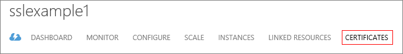

<properties 
    pageTitle="Configurazione di SSL per un servizio cloud (classico) | Microsoft Azure" 
    description="Informazioni su come specificare un endpoint HTTPS per un ruolo web e come caricare un certificato SSL per proteggere l'applicazione." 
    services="cloud-services" 
    documentationCenter=".net" 
    authors="Thraka" 
    manager="timlt" 
    editor=""/>

<tags 
    ms.service="cloud-services" 
    ms.workload="tbd" 
    ms.tgt_pltfrm="na" 
    ms.devlang="na" 
    ms.topic="article" 
    ms.date="10/04/2016"
    ms.author="adegeo"/>

# Configurazione di SSL per un'applicazione di Azure

> [AZURE.SELECTOR]
- [Portale di Azure](cloud-services-configure-ssl-certificate-portal.md)
- [Portale classica Azure](cloud-services-configure-ssl-certificate.md)

La crittografia Secure Sockets Layer (SSL) è il modo più comunemente usato per proteggere i dati inviati tramite internet. Questa attività comune viene illustrato come specificare un endpoint HTTPS per un ruolo web e come caricare un certificato SSL per proteggere l'applicazione.

> [AZURE.NOTE] Le procedure in questa attività si applicano ai servizi Cloud Azure; per i servizi di App, vedere  l'articolo.

Questa attività utilizza un ambiente di produzione. Alla fine di questo argomento vengono fornite informazioni sull'uso di una distribuzione di gestione temporanea.

Prima di tutto, leggere [questo](cloud-services-how-to-create-deploy.md) articolo se non è stato ancora creato un servizio cloud.

[AZURE.INCLUDE [websites-cloud-services-css-guided-walkthrough](../../includes/websites-cloud-services-css-guided-walkthrough.md)]

## Passaggio 1: Ottenere un certificato SSL

Per configurare SSL per un'applicazione, è innanzitutto necessario ottenere un certificato SSL firmati da un'autorità di certificazione (CA), una terza parte attendibile che emette certificati a tale scopo. Se non già presente, è necessario ottenerne uno da una società che vende i certificati SSL.

Il certificato deve soddisfare i requisiti seguenti per i certificati SSL in Azure:

-   Il certificato deve contenere una chiave privata.
-   Per lo scambio, esportato in un file di scambio di informazioni personali (PFX), è necessario creare il certificato.
-   Nome del soggetto del certificato deve corrispondere dominio usato per accedere al servizio cloud. È possibile ottenere un certificato SSL da un'autorità di certificazione (CA) per il dominio cloudapp.net. È necessario acquistare un nome di dominio personalizzato da utilizzare per accedere al servizio. Quando si richiede un certificato da un'autorità di certificazione, nome del soggetto del certificato deve corrispondere al nome di dominio personalizzato utilizzato per accedere all'applicazione. Ad esempio, se il nome di dominio personalizzato è **contoso.com** è necessario richiedere un certificato CA per * **. contoso.com** o * *www.contoso.com**.
-   Il certificato deve utilizzare un minimo di crittografia a 2048 bit.

Scopo di test, è possibile [creare](cloud-services-certs-create.md) e usare un certificato autofirmato. Un certificato autofirmato non viene autenticato tramite un'autorità di certificazione e può usare il dominio cloudapp.net come l'URL del sito Web. Ad esempio, l'operazione seguente utilizza un certificato autofirmato in cui il nome comune (CN) utilizzato nel certificato è **sslexample.cloudapp.net**.

Successivamente, è necessario includere informazioni sul certificato nella definizione del servizio e file di configurazione del servizio.

## Passaggio 2: Modificare i file di definizione e la configurazione del servizio

L'applicazione deve essere configurato per utilizzare il certificato e un endpoint HTTPS deve essere aggiunta. Di conseguenza, la definizione di servizio e i file di configurazione del servizio devono essere aggiornati.

1.  Nel proprio ambiente di sviluppo, aprire il file di definizione di servizio (CSDEF), aggiungere una sezione di **certificati** all'interno della sezione **WebRole** e includere le seguenti informazioni certificato (e certificati intermedi):

        <WebRole name="CertificateTesting" vmsize="Small">
        ...
            <Certificates>
                <Certificate name="SampleCertificate" 
                             storeLocation="LocalMachine" 
                             storeName="My"
                             permissionLevel="limitedOrElevated" />
                <!-- IMPORTANT! Unless your certificate is either
                self-signed or signed directly by the CA root, you
                must include all the intermediate certificates
                here. You must list them here, even if they are
                not bound to any endpoints. Failing to list any of
                the intermediate certificates may cause hard-to-reproduce
                interoperability problems on some clients.-->
                <Certificate name="CAForSampleCertificate"
                             storeLocation="LocalMachine"
                             storeName="CA"
                             permissionLevel="limitedOrElevated" />
            </Certificates>
        ...
        </WebRole>

    La sezione **certificati** definisce il nome del certificato, la relativa posizione e il nome dell'archivio in cui si trova.
    
    Autorizzazioni (`permisionLevel` attributo) possono essere impostate uno dei seguenti valori:

  	| Valore di autorizzazione  | Descrizione |
  	| ----------------  | ----------- |
  	| limitedOrElevated | **(Impostazione predefinita)** Tutti i processi di ruolo possono accedere alla chiave privata. |
  	| con privilegi elevati          | Solo processi con privilegi elevati possono accedere alla chiave privata.|

2.  In file di definizione del servizio, aggiungere un elemento **InputEndpoint** all'interno della sezione **endpoint** per abilitare HTTPS:

        <WebRole name="CertificateTesting" vmsize="Small">
        ...
            <Endpoints>
                <InputEndpoint name="HttpsIn" protocol="https" port="443" 
                    certificate="SampleCertificate" />
            </Endpoints>
        ...
        </WebRole>

3.  In file di definizione del servizio, aggiungere un elemento di **associazione** all'interno della sezione di **siti** . In questa sezione consente di aggiungere un'associazione HTTPS per mappare l'endpoint al sito:

        <WebRole name="CertificateTesting" vmsize="Small">
        ...
            <Sites>
                <Site name="Web">
                    <Bindings>
                        <Binding name="HttpsIn" endpointName="HttpsIn" />
                    </Bindings>
                </Site>
            </Sites>
        ...
        </WebRole>

    Sono state completate tutte le modifiche necessarie al file di definizione del servizio, ma è comunque necessario aggiungere le informazioni del certificato per il file di configurazione del servizio.

4.  Nel file di configurazione di servizio (CSCFG), ServiceConfiguration.Cloud.cscfg, aggiungere una sezione di **certificati** all'interno della sezione **ruolo** , sostituire il valore di identificazione personale di esempio riportato di seguito con quella del certificato:

        <Role name="Deployment">
        ...
            <Certificates>
                <Certificate name="SampleCertificate" 
                    thumbprint="9427befa18ec6865a9ebdc79d4c38de50e6316ff" 
                    thumbprintAlgorithm="sha1" />
                <Certificate name="CAForSampleCertificate"
                    thumbprint="79d4c38de50e6316ff9427befa18ec6865a9ebdc" 
                    thumbprintAlgorithm="sha1" />
            </Certificates>
        ...
        </Role>

(Nell'esempio precedente vengono utilizzate **sha1** per l'algoritmo di identificazione personale. Specificare il valore appropriato per algoritmo di identificazione personale del certificato).

Ora che la definizione di servizio e i file di configurazione del servizio sono stati aggiornati, creare un pacchetto della distribuzione per il caricamento in Azure. Se si utilizza **cspack**, non utilizzare il contrassegno **/generateConfigurationFile** come che sovrascrive le informazioni del certificato che è stato inserito.

## Passaggio 3: Caricare un certificato

Pacchetto di distribuzione è stato aggiornato per utilizzare il certificato e un endpoint HTTPS è stato aggiunto. A questo punto è possibile caricare il pacchetto e certificato Azure con il portale classico Azure.

1. Accedere al [portale classica Azure][]. 
2. Nel riquadro di spostamento sinistra, fare clic su **Servizi Cloud** .
3. Fare clic su servizio cloud desiderato.
4. Fare clic sulla scheda **certificati** .

    

5. Fare clic sul pulsante **Carica** .

    
    
6. Specificare il **File**, **la Password**, quindi fare clic su **completa** (il segno di spunta).

## Passaggio 4: Connettere all'istanza di ruolo mediante HTTPS

Ora che la distribuzione sia in esecuzione in Azure, è possibile connettersi tramite HTTPS.

1.  Nel portale di classica Azure, selezionare la distribuzione, quindi fare clic sul collegamento **all'URL del sito**.

    ![Determinare l'URL del sito][2]

2.  Nel web browser, modificare il collegamento per l'utilizzo di **https** anziché **http**e quindi visitare la pagina.

    >[AZURE.NOTE] Se si utilizza un certificato autofirmato, quando si passa a un endpoint HTTPS associato il certificato autofirmato che potrebbe essere visualizzato un errore di certificato nel browser. Utilizzo di un certificato firmato da un'autorità di certificazione attendibile Elimina questo problema. Nel frattempo, è possibile ignorare l'errore. (Un'altra opzione consiste nell'aggiungere il certificato autofirmato all'archivio certificati Autorità di certificazione attendibile dell'utente).

    ![Sito web di esempio SSL][3]

Se si desidera utilizzare SSL per una distribuzione di gestione temporanea invece di una distribuzione di produzione, è innanzitutto necessario determinare l'URL utilizzato per la distribuzione di gestione temporanea. Distribuire il servizio cloud nell'ambiente di gestione temporanea senza includere un certificato o le informazioni relative al certificato. Una volta distribuito, è possibile determinare l'URL basato su GUID indicato nel campo **URL del sito** del portale classica Azure. Creare un certificato con il nome comune (CN) uguale a URL basato su GUID (ad esempio **32818777-6e77-4ced-a8fc-57609d404462.cloudapp.net**). Utilizzare il portale classico Azure per aggiungere il certificato al servizio cloud a fasi. Quindi aggiungere le informazioni del certificato ai file CSDEF e CSCFG, rigenerare l'applicazione e aggiornare la distribuzione a fasi per utilizzare il nuovo pacchetto.

## Passaggi successivi

* [Configurazione generale del servizio cloud](cloud-services-how-to-configure.md).
* Informazioni su come [distribuire un servizio cloud](cloud-services-how-to-create-deploy.md).
* Configurare un [nome di dominio personalizzato](cloud-services-custom-domain-name.md).
* [Gestire il servizio cloud](cloud-services-how-to-manage.md).

  [Portale classica Azure]: http://manage.windowsazure.com
  [0]: ./media/cloud-services-configure-ssl-certificate/CreateCloudService.png
  [1]: ./media/cloud-services-configure-ssl-certificate/AddCertificate.png
  [2]: ./media/cloud-services-configure-ssl-certificate/CopyURL.png
  [3]: ./media/cloud-services-configure-ssl-certificate/SSLCloudService.png
  [4]: ./media/cloud-services-configure-ssl-certificate/AddCertificateComplete.png  
