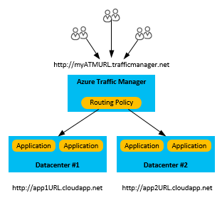

<properties
    pageTitle="Operazioni da eseguire in caso di un Azure service disservizi che influisce sul servizi Cloud Windows Azure | Microsoft Azure"
    description="Informazioni sulle operazioni da eseguire in caso di un'interruzione di Azure servizio che influisce sul servizi Cloud Windows Azure."
    services="cloud-services"
    documentationCenter=""
    authors="kmouss"
    manager="drewm"
    editor=""/>

<tags
    ms.service="cloud-services"
    ms.workload="cloud-services"
    ms.tgt_pltfrm="na"
    ms.devlang="na"
    ms.topic="article"
    ms.date="05/16/2016"
    ms.author="kmouss;aglick"/>

#Operazioni da eseguire in caso di un Azure service disservizi che influisce sul servizi Cloud Windows Azure

Microsoft, viene costantemente per assicurarsi che i servizi siano sempre disponibili quando è necessario. Forza oltre il controllo talvolta influisce su Contattaci in diversi modi che causano interruzioni del servizio non pianificato.

Microsoft offre un livello di contratto di servizio per i servizi come impegno per il tempo di attività e la connettività. Contratto di servizio per i servizi di Azure individuali sono disponibili in [Azure i contratti di servizio](https://azure.microsoft.com/support/legal/sla/).

Azure contiene già molte funzionalità di piattaforma incorporata che supportano applicazioni altamente disponibili. Per ulteriori informazioni su questi servizi, Leggi [il ripristino di emergenza e disponibilità per applicazioni Azure](../resiliency/resiliency-disaster-recovery-high-availability-azure-applications.md).

In questo articolo è descritta uno scenario di ripristino di emergenza true quando un'intera area si verifica un'interruzione a causa di gravi naturale o interruzione del servizio diffusi. Questi sono poche occasioni, ma è necessario preparare la possibilità che sia presente un'interruzione di un'intera regione. Se un'intera regione si verifica un'interruzione del servizio, copie localmente ridondanti dei dati sarebbe temporaneamente non disponibile. Se è stata attivata la replica geografico, tre copie aggiuntive delle tabelle Azure archiviazione BLOB sono archiviate in un'area diversa. In caso di un'interruzione di internazionali completa o un danno in cui l'area principale non è reversibile, Azure esegue la correlazione di tutte le voci DNS all'area replicato geografico.

>[AZURE.NOTE]Tenere presente che non si dispone di controllare questo processo e si verifica solo per le interruzioni dei servizi del Data Center del livello. Per questi motivi, è necessario utilizzare anche altre strategie di backup specifiche di un'applicazione per ottenere il massimo livello di disponibilità. Per ulteriori informazioni, vedere la sezione sulle [strategie di dati per il ripristino di emergenza](../resiliency/resiliency-disaster-recovery-high-availability-azure-applications.md#DSDR). Se si desidera essere in grado di influire sulla proprio failover, è consigliabile valutare la possibilità di utilizzo dell' [accesso in lettura geografico ridondanti dello spazio di archiviazione (RA GRS)](../storage/storage-redundancy.md#read-access-geo-redundant-storage), che consente di creare una copia di sola lettura dei dati in un'altra area.

Per informazioni su come gestire queste poche occasioni, sono disponibili le seguenti linee guida per Azure macchine () in caso di un'interruzione del servizio dell'intera area in cui viene distribuito l'applicazione di macchine Virtuali di Azure.

##Opzione 1: Attendere per il ripristino
In questo caso è richiesta alcuna azione da parte dell'utente. È possibile sapere che Team Azure sta lavorando attentamente per ripristinare la disponibilità dei servizi. È possibile visualizzare lo stato corrente dei servizi sul nostro [Dashboard di integrità dei servizi di Azure](https://azure.microsoft.com/status/).

>[AZURE.NOTE]Questo è l'opzione ottimale se un cliente non ha configurato il ripristino del sito di Azure o che dispone di una distribuzione secondaria in un'area diversa.

Per i clienti che hanno vuole avere accesso immediato ai servizi cloud distribuito, sono disponibili le opzioni seguenti.

>[AZURE.NOTE]Tenere presente che queste opzioni hanno la possibilità di perdita di dati.     

##Opzione 2: Ridistribuire configurazione del servizio cloud a una nuova area

Se si dispone del codice originale, è possibile ridistribuire semplicemente l'applicazione, configurazione associata e le risorse associate a un nuovo servizio cloud in una nuova area.  

Per ulteriori informazioni su come creare e distribuire un'applicazione di servizio cloud, vedere [come creare e distribuire un servizio cloud](./cloud-services-how-to-create-deploy-portal.md).

A seconda di origini dati dell'applicazione, è necessario verificare le procedure di ripristino per l'origine dati dell'applicazione.
  * Per le origini dati di Azure lo spazio di archiviazione, vedere [lo spazio di archiviazione di Azure replica](../storage/storage-redundancy.md#read-access-geo-redundant-storage) per verificare se le opzioni disponibili in base al modello di replica scelto per l'applicazione.
  * Per le origini di Database SQL, leggere [Panoramica: Cloud business continuità e database di emergenza Database SQL di](../sql-database/sql-database-business-continuity.md) per verificare se le opzioni disponibili basato sul modello di replica scelto per l'applicazione.

##Opzione 3: Utilizzare una distribuzione backup tramite Gestione il traffico di Azure
Questa opzione si presuppone che la soluzione di applicazione con il ripristino di emergenza internazionali in considerazione già stata creata. È possibile usare questa opzione se si dispone già di una distribuzione dell'applicazione di servizi cloud secondario che è in esecuzione in un'area diversa e la connessione tramite un canale di gestione del traffico. In questo caso, verificare l'integrità della distribuzione secondaria. Se è integro, è possibile reindirizzare il traffico a tale tramite Azure il traffico Manager. Con questa strategia, è possibile sfruttare le configurazioni di ordine failover e il metodo di routing il traffico in Azure il traffico di gestione. Per ulteriori informazioni, vedere [come configurare le impostazioni di gestione di traffico](../traffic-manager/traffic-manager-overview.md#how-to-configure-traffic-manager-settings).

##Passaggi successivi

Per ulteriori informazioni su come implementare una strategia di disponibilità e il ripristino di emergenza, vedere [ripristino di emergenza e disponibilità per applicazioni Azure](../resiliency/resiliency-disaster-recovery-high-availability-azure-applications.md).

Per sviluppare una conoscenza tecnica approfondita delle funzionalità della piattaforma cloud, vedere [indicazioni tecniche sulla resilienza Azure](../resiliency/resiliency-technical-guidance.md).

Se le istruzioni sono non è chiaro o se si desidera che Microsoft per eseguire le operazioni per conto dell'utente, contattare [Il supporto tecnico](https://portal.azure.com/#blade/Microsoft_Azure_Support/HelpAndSupportBlade).
