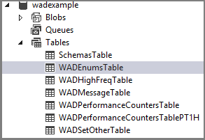

<properties
    pageTitle="Come usare diagnostica Windows Azure (.NET) ai servizi Cloud | Microsoft Azure"
    description="Utilizzo di diagnostica Windows Azure per raccogliere dati da Azure cloud Services per il debug, la misurazione delle prestazioni, monitoraggio, analisi del traffico e altro."
    services="cloud-services"
    documentationCenter=".net"
    authors="rboucher"
    manager="jwhit"
    editor=""/>

<tags
    ms.service="cloud-services"
    ms.workload="tbd"
    ms.tgt_pltfrm="na"
    ms.devlang="dotnet"
    ms.topic="article"
    ms.date="01/25/2016"
    ms.author="robb"/>


# <a name="enabling-azure-diagnostics-in-azure-cloud-services"></a>Attivazione della diagnostica Azure nei servizi Cloud Azure

Per uno sfondo sulla diagnostica di Azure, vedere [Panoramica di diagnostica Azure](../azure-diagnostics.md) .


## <a name="how-to-enable-diagnostics-in-a-worker-role"></a>Come abilitare diagnostica in un ruolo di lavoro

Questa panoramica sulle procedure viene descritto come implementare un ruolo di lavoro Azure che genera dati di telemetria utilizzando la classe .NET EventSource. Diagnostica Windows Azure viene utilizzata per raccogliere i dati di telemetria e archiviarlo in un account di archiviazione Azure. Quando si crea un ruolo di lavoro Visual Studio attiva automaticamente Diagnostics 1.0 come parte della soluzione in Azure SDK per .NET 2,4 e versioni precedenti. Le istruzioni seguenti illustrano il processo di creazione il ruolo di lavoro, la disattivazione di diagnostica 1.0 dalla soluzione e distribuzione di diagnostica 1.2 o 1.3 al proprio ruolo di lavoro.

### <a name="pre-requisites"></a>Prerequisiti
In questo articolo si presuppone che si ha un abbonamento a Azure e si utilizza Visual Studio 2013 con Azure SDK. Se non si dispone di un abbonamento a Azure, è possibile iscriversi per la [Versione di valutazione gratuita][]. Assicurarsi di [installare e configurare Azure PowerShell versione 0.8.7 o versione successiva][].

### <a name="step-1-create-a-worker-role"></a>Passaggio 1: Creare un ruolo di lavoro
1.  Avviare **Visual Studio 2013**.
2.  Creare un nuovo progetto di **Servizio Cloud di Azure** dal modello di **Cloud** destinato a .NET Framework 4.5.  Nome del progetto "WadExample" e fare clic su Ok.
3.  Selezionare **Il ruolo di lavoro** e fare clic su Ok. Verrà creato il progetto.
4.  In **Esplora soluzioni**fare doppio clic sul file di proprietà **WorkerRole1** .
5.  **Configurazione** della scheda deselezionare **Abilita diagnostica** per disabilitare Diagnostics 1.0 (Azure SDK 2,4 ed eariler).
6.  Compilare la soluzione per verificare che non siano presenti errori.

### <a name="step-2-instrument-your-code"></a>Passaggio 2: Strumentazione del codice
Sostituire il contenuto di WorkerRole.cs con il codice riportato di seguito. La classe SampleEventSourceWriter, ereditata dalla [Classe EventSource][]implementa quattro metodi di registrazione: **SendEnums**, **MessageMethod**, **SetOther** e **HighFreq**. Il primo parametro per il metodo **WriteEvent** definisce l'ID per l'evento corrispondente. Il metodo di esecuzione di implementare un ciclo infinito che chiama ognuno dei metodi di registrazione implementati nella classe **SampleEventSourceWriter** ogni 10 secondi.

    using Microsoft.WindowsAzure.ServiceRuntime;
    using System;
    using System.Diagnostics;
    using System.Diagnostics.Tracing;
    using System.Net;
    using System.Threading;

    namespace WorkerRole1
    {
    sealed class SampleEventSourceWriter : EventSource
    {
        public static SampleEventSourceWriter Log = new SampleEventSourceWriter();
        public void SendEnums(MyColor color, MyFlags flags) { if (IsEnabled())  WriteEvent(1, (int)color, (int)flags); }// Cast enums to int for efficient logging.
        public void MessageMethod(string Message) { if (IsEnabled())  WriteEvent(2, Message); }
        public void SetOther(bool flag, int myInt) { if (IsEnabled())  WriteEvent(3, flag, myInt); }
        public void HighFreq(int value) { if (IsEnabled()) WriteEvent(4, value); }

    }

    enum MyColor
    {
        Red,
        Blue,
        Green
    }

    [Flags]
    enum MyFlags
    {
        Flag1 = 1,
        Flag2 = 2,
        Flag3 = 4
    }

    public class WorkerRole : RoleEntryPoint
    {
        public override void Run()
        {
            // This is a sample worker implementation. Replace with your logic.
            Trace.TraceInformation("WorkerRole1 entry point called");

            int value = 0;

            while (true)
            {
                Thread.Sleep(10000);
                Trace.TraceInformation("Working");

                // Emit several events every time we go through the loop
                for (int i = 0; i < 6; i++)
                {
                    SampleEventSourceWriter.Log.SendEnums(MyColor.Blue, MyFlags.Flag2 | MyFlags.Flag3);
                }

                for (int i = 0; i < 3; i++)
                {
                    SampleEventSourceWriter.Log.MessageMethod("This is a message.");
                    SampleEventSourceWriter.Log.SetOther(true, 123456789);
                }

                if (value == int.MaxValue) value = 0;
                SampleEventSourceWriter.Log.HighFreq(value++);
            }
        }

        public override bool OnStart()
        {
            // Set the maximum number of concurrent connections
            ServicePointManager.DefaultConnectionLimit = 12;

            // For information on handling configuration changes
            // see the MSDN topic at http://go.microsoft.com/fwlink/?LinkId=166357.

            return base.OnStart();
        }
    }
    }


### <a name="step-3-deploy-your-worker-role"></a>Passaggio 3: Distribuire il ruolo di lavoro
1.  Distribuire il ruolo di lavoro in Azure dall'interno di Visual Studio selezionando il progetto **WadExample** sulla Esplora quindi su **pubblica** dal menu **Genera** .
2.  Scegliere l'abbonamento.
3.  Nella finestra di dialogo **Impostazioni di pubblicazione di Microsoft Azure** selezionare **Crea nuovo**.
4.  Nella finestra di dialogo **Crea un servizio Cloud e Account di archiviazione** immettere un **nome** (ad esempio, "WadExample") e selezionare un'area geografica o gruppo affinità.
5.  Impostare l' **ambiente di** **gestione temporanea**.
6.  Modificare le altre **Impostazioni** in base alle esigenze e fare clic su **pubblica**.
7.  Una volta completata la distribuzione sia nel portale di classica Azure che il servizio cloud in uno stato **in esecuzione** .

### <a name="step-4-create-your-diagnostics-configuration-file-and-install-the-extension"></a>Passaggio 4: Creare il file di configurazione di diagnostica e installare l'estensione
1.  Scaricare la definizione dello schema di file pubblico configurazione eseguendo il seguente comando di PowerShell:
2.
        (AzureServiceAvailableExtension get - NomeEstensione 'PaaSDiagnostics' - ProviderNamespace 'Microsoft.Azure.Diagnostics'). PublicConfigurationSchema | Out-File-codifica utf8 - percorso file 'WadConfig.xsd'

2.  Aggiungere un file XML al progetto **WorkerRole1** facendo clic su progetto **WorkerRole1** e selezionare **Aggiungi** -> **Nuovo elemento...**  ->  **Elementi visual c#** -> **dati** -> **File XML**. Assegnare un nome file "WadExample.xml".

    

3.  Associare il WadConfig.xsd il file di configurazione. Verificare che la finestra editor WadExample.xml sia la finestra attiva. Premere **F4** per aprire la finestra **proprietà** . Fare clic su proprietà **schemi** nella finestra delle **proprietà** . Fare clic su **…** in proprietà **schemi** . Scegliere il **pulsante Aggiungi....** pulsante e passare al percorso in cui è salvato il file XSD e selezionare il file WadConfig.xsd. Fare clic su **OK**.
4.  Sostituire il contenuto del file di configurazione WadExample.xml con il seguente codice XML e salvare il file. In questo file di configurazione definisce un paio contatori delle prestazioni per raccogliere: uno per l'utilizzo della CPU e uno per l'utilizzo della memoria. La configurazione definisce quindi quattro eventi corrispondenti ai metodi di classe SampleEventSourceWriter.

```
        <?xml version="1.0" encoding="utf-8"?>
        <PublicConfig xmlns="http://schemas.microsoft.com/ServiceHosting/2010/10/DiagnosticsConfiguration">
            <WadCfg>
                <DiagnosticMonitorConfiguration overallQuotaInMB="25000">
                <PerformanceCounters scheduledTransferPeriod="PT1M">
                    <PerformanceCounterConfiguration counterSpecifier="\Processor(_Total)\% Processor Time" sampleRate="PT1M" unit="percent" />
                    <PerformanceCounterConfiguration counterSpecifier="\Memory\Committed Bytes" sampleRate="PT1M" unit="bytes"/>
                    </PerformanceCounters>
                    <EtwProviders>
                        <EtwEventSourceProviderConfiguration provider="SampleEventSourceWriter" scheduledTransferPeriod="PT5M">
                            <Event id="1" eventDestination="EnumsTable"/>
                            <Event id="2" eventDestination="MessageTable"/>
                            <Event id="3" eventDestination="SetOtherTable"/>
                            <Event id="4" eventDestination="HighFreqTable"/>
                            <DefaultEvents eventDestination="DefaultTable" />
                        </EtwEventSourceProviderConfiguration>
                    </EtwProviders>
                </DiagnosticMonitorConfiguration>
            </WadCfg>
        </PublicConfig>
```

### <a name="step-5-install-diagnostics-on-your-worker-role"></a>Passaggio 5: Installare diagnostica nel proprio ruolo di lavoro
I cmdlet di PowerShell per la gestione di diagnostica in un ruolo web o lavoro sono: Set-AzureServiceDiagnosticsExtension, Get-AzureServiceDiagnosticsExtension e AzureServiceDiagnosticsExtension Rimuovi.

1.  Aprire PowerShell Azure.
2.  Eseguire lo script per installare diagnostica nel proprio ruolo di lavoro (sostituisce *StorageAccountKey* con la chiave account lo spazio di archiviazione per l'account di archiviazione wadexample):

```
    $storage_name = "wadexample"
    $key = "<StorageAccountKey>"
    $config_path="c:\users\<user>\documents\visual studio 2013\Projects\WadExample\WorkerRole1\WadExample.xml"
    $service_name="wadexample"
    $storageContext = New-AzureStorageContext -StorageAccountName $storage_name -StorageAccountKey $key
    Set-AzureServiceDiagnosticsExtension -StorageContext $storageContext -DiagnosticsConfigurationPath $config_path -ServiceName $service_name -Slot Staging -Role WorkerRole1
```

### <a name="step-6-look-at-your-telemetry-data"></a>Passaggio 6: Visualizzare i dati di telemetria
In Visual Studio **Esplora Server** passare all'account di archiviazione wadexample. Dopo il cloud servizio è in esecuzione è necessario vedere le tabelle **WADEnumsTable**, **WADHighFreqTable**, **WADMessageTable**, **WADPerformanceCountersTable** e **WADSetOtherTable**circa 5 minuti. Fare doppio clic su una delle tabelle per visualizzare telemetria che è stati raccolti.
    


## <a name="configuration-file-schema"></a>Schema di File di configurazione

Il file di configurazione diagnostica definisce valori che vengono utilizzati per inizializzare le impostazioni di configurazione di diagnostica all'avvio di agente di diagnostica. Vedere il [riferimento allo schema più recente](https://msdn.microsoft.com/library/azure/mt634524.aspx) per i valori validi ed esempi.

## <a name="troubleshooting"></a>Risoluzione dei problemi

Se si riscontrano problemi, vedere [Risoluzione dei problemi di Azure diagnostica](../azure-diagnostics-troubleshooting.md) per informazioni sui problemi comuni.

## <a name="next-steps"></a>Passaggi successivi
[Diagnostica Windows Azure articoli relativi a visualizzare un elenco di macchina virtuale](azure-diagnostics.md#cloud-services) per modificare i dati raccolti, risolvere i problemi o altre informazioni di diagnostica in generale.


[EventSource classe]: http://msdn.microsoft.com/library/system.diagnostics.tracing.eventsource(v=vs.110).aspx

[Debugging an Azure Application]: http://msdn.microsoft.com/library/windowsazure/ee405479.aspx   
[Collect Logging Data by Using Azure Diagnostics]: http://msdn.microsoft.com/library/windowsazure/gg433048.aspx
[Versione di valutazione gratuita]: http://azure.microsoft.com/pricing/free-trial/
[Installare e configurare Azure PowerShell versione 0.8.7 o versioni successive]: http://azure.microsoft.com/documentation/articles/install-configure-powershell/
